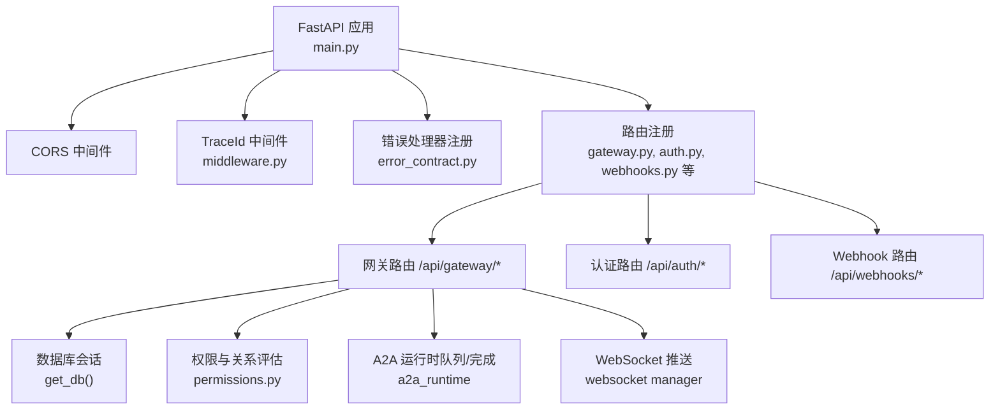
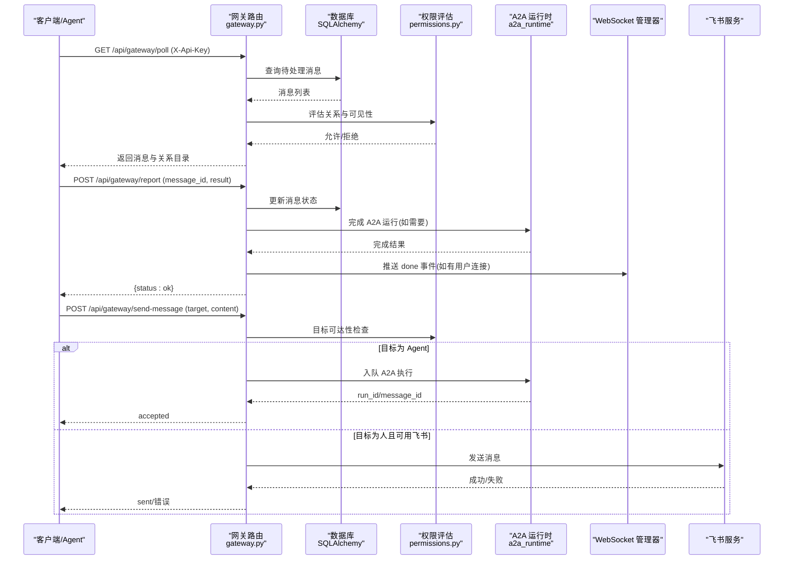
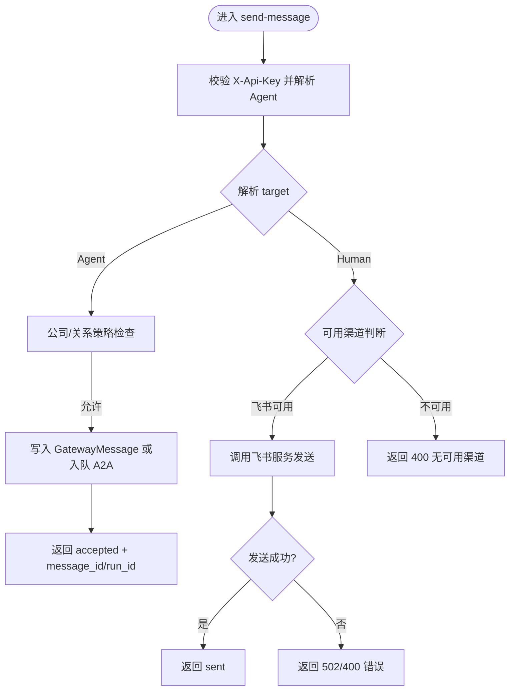
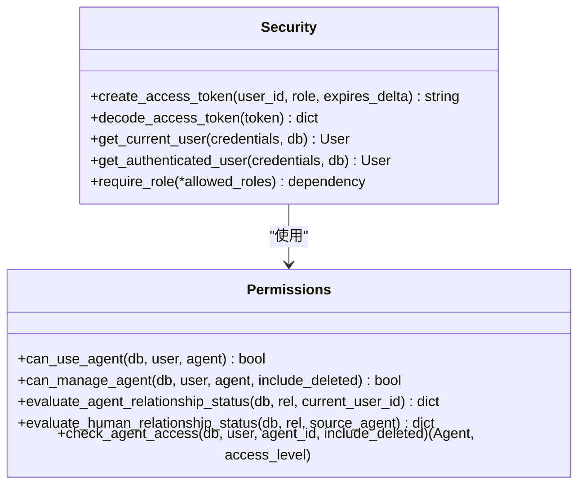
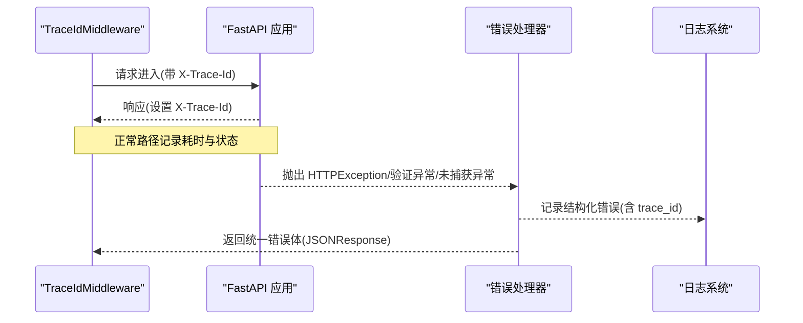
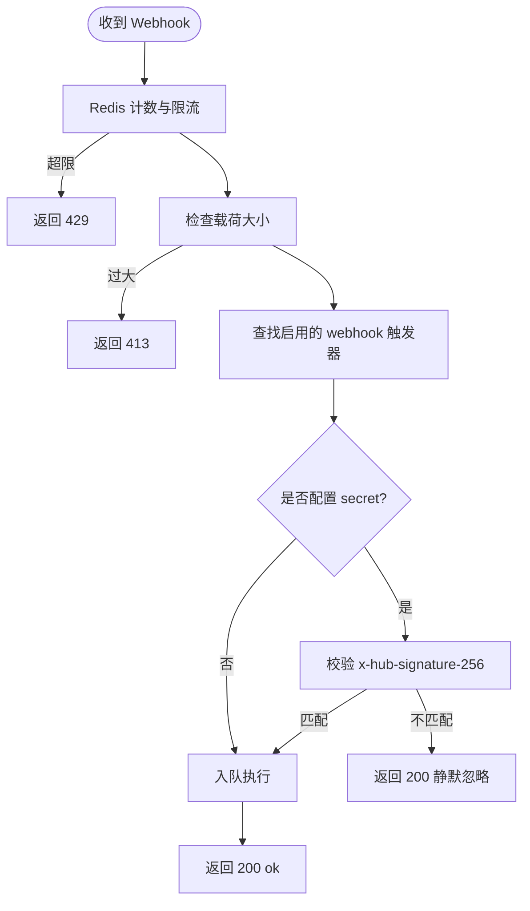
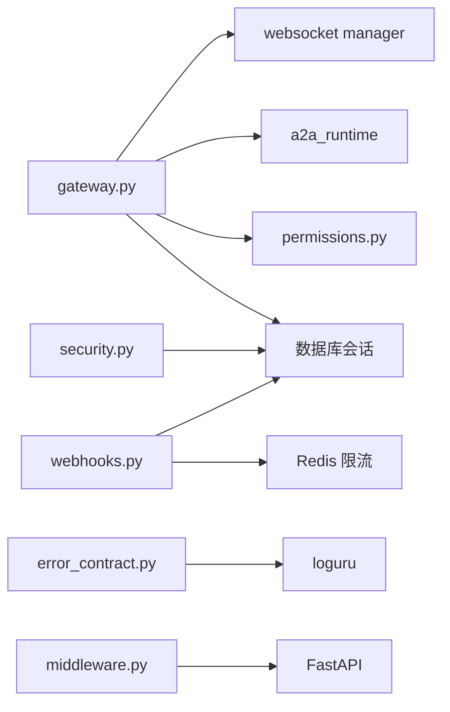

# API网关接口

<cite>
**本文引用的文件**   
- [backend/app/main.py](file://backend/app/main.py)
- [backend/app/api/gateway.py](file://backend/app/api/gateway.py)
- [backend/app/core/middleware.py](file://backend/app/core/middleware.py)
- [backend/app/core/security.py](file://backend/app/core/security.py)
- [backend/app/core/error_contract.py](file://backend/app/core/error_contract.py)
- [backend/app/core/permissions.py](file://backend/app/core/permissions.py)
- [backend/app/config.py](file://backend/app/config.py)
- [backend/app/api/webhooks.py](file://backend/app/api/webhooks.py)
- [backend/app/services/workspace_locking.py](file://backend/app/services/workspace_locking.py)
- [backend/app/core/logging_config.py](file://backend/app/core/logging_config.py)
</cite>

## 目录
1. [简介](#简介)
2. [项目结构](#项目结构)
3. [核心组件](#核心组件)
4. [架构总览](#架构总览)
5. [详细组件分析](#详细组件分析)
6. [依赖关系分析](#依赖关系分析)
7. [性能考虑](#性能考虑)
8. [故障排查指南](#故障排查指南)
9. [结论](#结论)
10. [附录](#附录)

## 简介
本文件为 Clawith 平台的 API 网关接口文档，聚焦统一入口的 RESTful 设计、请求路由、认证授权、限流与缓存策略、微服务间通信数据格式、错误码定义、重试机制、客户端集成示例与性能优化建议，以及监控指标收集、日志记录与故障诊断方法。网关主要面向 OpenClaw Agent 通过 X-Api-Key 进行鉴权，提供消息轮询、结果上报、心跳保活与主动发消息等能力，并支持将消息投递到飞书等外部渠道或转发至其他 Agent。

## 项目结构
后端基于 FastAPI，统一入口在应用启动时注册各模块路由，并通过中间件完成追踪与 CORS。网关相关路由集中在 /api/gateway 前缀下，认证与安全由安全模块与权限模块共同保障，错误响应遵循统一的错误契约。

**图表来源** 
- [backend/app/main.py:352-471](file://backend/app/main.py#L352-L471)
- [backend/app/core/middleware.py:12-53](file://backend/app/core/middleware.py#L12-L53)
- [backend/app/core/error_contract.py:224-229](file://backend/app/core/error_contract.py#L224-L229)
- [backend/app/api/gateway.py:35-712](file://backend/app/api/gateway.py#L35-L712)

**章节来源**
- [backend/app/main.py:352-471](file://backend/app/main.py#L352-L471)
- [backend/app/core/middleware.py:12-53](file://backend/app/core/middleware.py#L12-L53)
- [backend/app/core/error_contract.py:224-229](file://backend/app/core/error_contract.py#L224-L229)

## 核心组件
- 网关路由：提供 poll、report、heartbeat、send-message、setup-guide 等端点，用于 OpenClaw Agent 与平台交互。
- 认证与安全：X-Api-Key 鉴权（Agent），JWT Bearer（用户），角色与权限控制。
- 错误契约：统一错误体结构、trace_id 注入、校验错误处理。
- 中间件：请求追踪、耗时统计、跨域配置。
- Webhook 接收：公开端点，具备速率限制、载荷大小限制与可选 HMAC 签名校验。
- 配置中心：环境变量驱动的配置项，包括 JWT、存储、代理、沙箱、运行时参数等。
- 分布式锁：Redis 实现的短生命周期工作空间锁。

**章节来源**
- [backend/app/api/gateway.py:35-712](file://backend/app/api/gateway.py#L35-L712)
- [backend/app/core/security.py:1-227](file://backend/app/core/security.py#L1-L227)
- [backend/app/core/error_contract.py:1-229](file://backend/app/core/error_contract.py#L1-L229)
- [backend/app/core/middleware.py:12-53](file://backend/app/core/middleware.py#L12-L53)
- [backend/app/api/webhooks.py:1-142](file://backend/app/api/webhooks.py#L1-L142)
- [backend/app/config.py:79-268](file://backend/app/config.py#L79-L268)
- [backend/app/services/workspace_locking.py:1-53](file://backend/app/services/workspace_locking.py#L1-L53)

## 架构总览
下图展示了从客户端到网关再到下游服务的整体调用链，包含鉴权、路由、权限判定、数据库访问、外部渠道投递与 WebSocket 推送。

**图表来源** 
- [backend/app/api/gateway.py:74-576](file://backend/app/api/gateway.py#L74-L576)
- [backend/app/core/permissions.py:536-554](file://backend/app/core/permissions.py#L536-L554)

## 详细组件分析

### 网关路由（/api/gateway）
- 端点概览
  - GET /api/gateway/poll：拉取待处理消息，标记已投递，返回历史上下文与关系目录。
  - POST /api/gateway/report：上报处理结果，持久化结果并触发 A2A 完成流程，必要时回推 WebSocket。
  - POST /api/gateway/heartbeat：心跳保活，更新 Agent 在线状态。
  - POST /api/gateway/send-message：向人或 Agent 发送消息，自动选择最佳通道（Agent/A2A 或飞书）。
  - GET /api/gateway/setup-guide/{agent_id}：生成技能文件与心跳指令模板。
- 鉴权方式：X-Api-Key 头，服务端按 Agent 类型 openclaw 校验并兼容旧哈希键。
- 数据流向：读取 GatewayMessage、ChatMessage、User、Agent 等实体；必要时调用 A2A 运行时与 WebSocket 管理器。
- 错误处理：HTTPException 携带 code/message/retryable 等字段，统一经 error_contract 包装。

**图表来源** 
- [backend/app/api/gateway.py:370-576](file://backend/app/api/gateway.py#L370-L576)

**章节来源**
- [backend/app/api/gateway.py:35-712](file://backend/app/api/gateway.py#L35-L712)

### 认证与授权
- Agent 鉴权：X-Api-Key 头，服务端匹配 Agent.api_key_hash（支持明文与哈希兼容），未命中则 401。
- 用户鉴权：Bearer Token（JWT），依赖 get_current_user/get_authenticated_user，支持角色层级 require_role。
- 权限模型：RBAC + 组织隔离，支持公司级/自定义访问模式，Agent-Agent 与 Agent-Human 关系有效性评估。
- 管理员保护：require_role("org_admin","platform_admin") 等。

**图表来源** 
- [backend/app/core/security.py:128-227](file://backend/app/core/security.py#L128-L227)
- [backend/app/core/permissions.py:44-554](file://backend/app/core/permissions.py#L44-L554)

**章节来源**
- [backend/app/core/security.py:1-227](file://backend/app/core/security.py#L1-L227)
- [backend/app/core/permissions.py:1-554](file://backend/app/core/permissions.py#L1-L554)

### 错误契约与中间件
- 错误体结构：detail、error.code、error.message、error.trace_id、可选 run_id/agent_id/stage/details/retryable。
- 中间件：TraceIdMiddleware 注入 trace_id，记录请求/响应耗时，异常路径输出错误日志。
- 统一处理器：HTTPException、RequestValidationError、未捕获异常均被拦截并返回标准错误体。

**图表来源** 
- [backend/app/core/middleware.py:12-53](file://backend/app/core/middleware.py#L12-L53)
- [backend/app/core/error_contract.py:158-229](file://backend/app/core/error_contract.py#L158-L229)

**章节来源**
- [backend/app/core/middleware.py:12-53](file://backend/app/core/middleware.py#L12-L53)
- [backend/app/core/error_contract.py:1-229](file://backend/app/core/error_contract.py#L1-L229)

### Webhook 接收与限流
- 端点：POST /api/webhooks/t/{token}，公开无需鉴权，依赖唯一 token 与可选 HMAC 签名。
- 限流策略：每 token 每分钟最多 5 次，全局硬上限 60/min；超过返回 429。
- 载荷限制：最大 64KB，超限返回 413。
- 审计：限流丢弃会记录审计日志，便于追踪。

**图表来源** 
- [backend/app/api/webhooks.py:1-142](file://backend/app/api/webhooks.py#L1-L142)

**章节来源**
- [backend/app/api/webhooks.py:1-142](file://backend/app/api/webhooks.py#L1-L142)

### 配置与环境变量
- 关键配置项：APP_NAME/VERSION、DATABASE_URL、REDIS_URL、JWT_*、CORS_ORIGINS、AGENT_RUNTIME_*、SANDBOX_*、代理与存储等。
- 默认值与校验：部分字段有默认值与范围校验，确保运行时稳定性。

**章节来源**
- [backend/app/config.py:79-268](file://backend/app/config.py#L79-L268)

### 分布式锁与工作空间
- Redis 短生命周期锁：acquire_workspace_lock/release_workspace_lock，防止并发写冲突。
- 适用场景：工作区文件/内存写入等需要互斥的操作。

**章节来源**
- [backend/app/services/workspace_locking.py:1-53](file://backend/app/services/workspace_locking.py#L1-L53)

## 依赖关系分析
- 路由层：gateway.py 依赖数据库会话、权限模块、A2A 运行时、WebSocket 管理器。
- 安全层：security.py 依赖 JWT 库、数据库会话、用户模型。
- 错误层：error_contract.py 依赖 loguru 与 FastAPI 异常处理。
- 中间件：middleware.py 依赖 request/response 对象与标准化 trace_id。
- Webhook：webhooks.py 依赖 Redis 限流、数据库触发器与审计日志。

**图表来源** 
- [backend/app/api/gateway.py:35-712](file://backend/app/api/gateway.py#L35-L712)
- [backend/app/core/security.py:1-227](file://backend/app/core/security.py#L1-L227)
- [backend/app/core/error_contract.py:1-229](file://backend/app/core/error_contract.py#L1-L229)
- [backend/app/core/middleware.py:12-53](file://backend/app/core/middleware.py#L12-L53)
- [backend/app/api/webhooks.py:1-142](file://backend/app/api/webhooks.py#L1-L142)

**章节来源**
- [backend/app/api/gateway.py:35-712](file://backend/app/api/gateway.py#L35-L712)
- [backend/app/core/security.py:1-227](file://backend/app/core/security.py#L1-L227)
- [backend/app/core/error_contract.py:1-229](file://backend/app/core/error_contract.py#L1-L229)
- [backend/app/core/middleware.py:12-53](file://backend/app/core/middleware.py#L12-L53)
- [backend/app/api/webhooks.py:1-142](file://backend/app/api/webhooks.py#L1-L142)

## 性能考虑
- 中间件与日志：TraceIdMiddleware 记录耗时，避免过度日志输出；生产环境建议调整日志级别与异步队列。
- 数据库访问：批量查询与分页，减少 N+1 问题；Gateway poll 中仅取最近 10 条历史消息。
- 外部调用：飞书发送前释放数据库连接，避免长时间持有；失败快速返回错误。
- 限流与背压：Webhook 限流与载荷限制，防止资源耗尽；A2A 运行时具备命令并发与重试策略。
- 缓存策略：当前未见显式缓存层，可在热点读路径引入 Redis 缓存（如关系目录、配置项）。

[本节为通用指导，不直接分析具体文件]

## 故障排查指南
- 追踪 ID：所有请求/响应头包含 X-Trace-Id，结合日志中的 trace_id 定位问题。
- 常见错误码：
  - 401：无效或过期的 X-Api-Key/JWT。
  - 403：权限不足或租户隔离不匹配。
  - 404：消息/目标不存在。
  - 409：结果重复提交或运行时冲突。
  - 413：Webhook 载荷过大。
  - 429：限流触发。
  - 500：内部错误（统一错误体）。
  - 502：外部渠道发送失败。
- 日志与审计：查看 TraceIdMiddleware 与 error_contract 输出的结构化日志；Webhook 限流丢弃会记录审计日志。
- 调试建议：开启 DEBUG 模式，检查 CORS 配置与代理设置；确认 Redis/PostgreSQL 连通性。

**章节来源**
- [backend/app/core/middleware.py:12-53](file://backend/app/core/middleware.py#L12-L53)
- [backend/app/core/error_contract.py:158-229](file://backend/app/core/error_contract.py#L158-L229)
- [backend/app/api/webhooks.py:45-142](file://backend/app/api/webhooks.py#L45-L142)

## 结论
Clawith 的 API 网关以 FastAPI 为核心，提供稳定、可观测、可扩展的统一入口。通过 X-Api-Key 与 JWT 双重鉴权、RBAC 权限模型、统一错误契约与中间件追踪，保障了高可用与易维护性。对外部渠道（如飞书）与 A2A 运行时的集成实现了灵活的协议转换与消息路由。建议在热点路径引入缓存、优化数据库查询与外部调用策略，进一步提升吞吐与延迟表现。

[本节为总结，不直接分析具体文件]

## 附录

### 统一错误体规范
- 字段说明：
  - detail：原始错误详情（字符串或结构化信息）。
  - error.code：错误代码（如 http_401、validation_error、internal_error）。
  - error.message：人类可读的错误描述。
  - error.trace_id：请求追踪 ID。
  - error.run_id/agent_id/stage/details/retryable：可选扩展字段。
- 适用场景：HTTP 异常、请求校验失败、未捕获异常。

**章节来源**
- [backend/app/core/error_contract.py:21-111](file://backend/app/core/error_contract.py#L21-L111)

### 客户端 SDK 集成示例（概念性）
- 认证：
  - Agent：在请求头添加 X-Api-Key。
  - 用户：在请求头添加 Authorization: Bearer <token>。
- 常用操作：
  - 拉取消息：GET /api/gateway/poll。
  - 上报结果：POST /api/gateway/report。
  - 心跳保活：POST /api/gateway/heartbeat。
  - 发送消息：POST /api/gateway/send-message。
- 重试策略：
  - 对 429/5xx 实施指数退避重试，注意幂等性与去重。
  - 关注 error.retryable 字段决定是否重试。
- 缓存建议：
  - 对关系目录与配置项做短期缓存，降低频繁查询。
  - 失效策略：时间过期 + 事件刷新。

[本节为概念性内容，不直接分析具体文件]

### 监控指标与日志记录
- 指标建议：
  - QPS、P95/P99 延迟、错误率、限流次数、外部调用成功率。
  - 数据库慢查询、Redis 命中率、WebSocket 连接数。
- 日志记录：
  - 使用 loguru 结构化日志，包含 trace_id、请求路径、耗时、状态码。
  - 审计日志记录关键操作（如 Webhook 限流丢弃）。

**章节来源**
- [backend/app/core/logging_config.py:1-129](file://backend/app/core/logging_config.py#L1-L129)