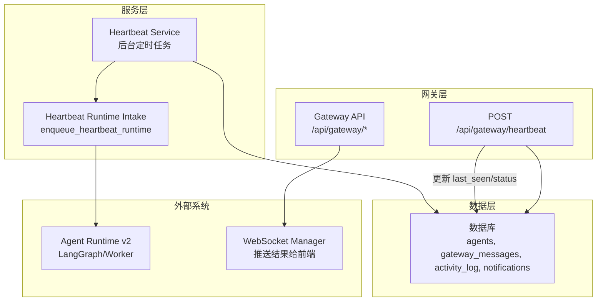
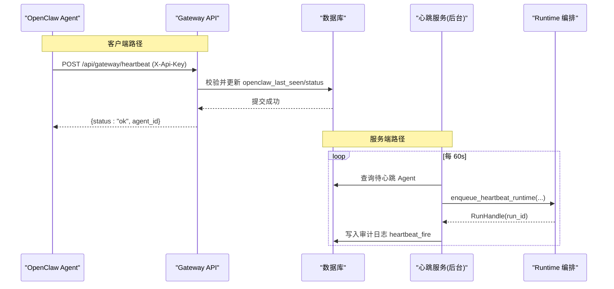
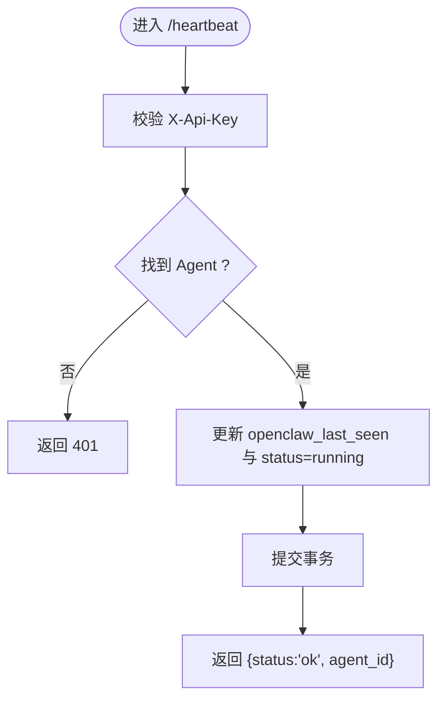
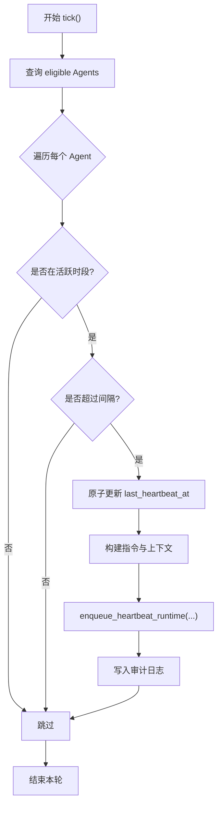
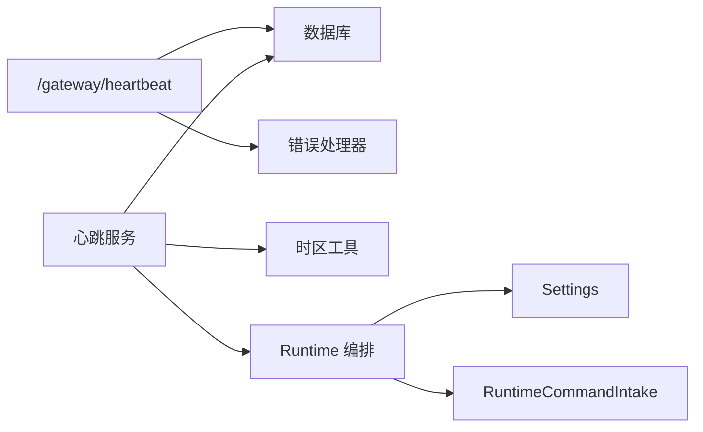

# 心跳检测接口

<cite>
**本文引用的文件**   
- [backend/app/api/gateway.py](file://backend/app/api/gateway.py)
- [backend/app/services/heartbeat.py](file://backend/app/services/heartbeat.py)
- [backend/app/services/heartbeat_runtime.py](file://backend/app/services/heartbeat_runtime.py)
- [backend/app/models/agent.py](file://backend/app/models/agent.py)
- [backend/app/config.py](file://backend/app/config.py)
- [backend/app/core/error_contract.py](file://backend/app/core/error_contract.py)
- [backend/tests/test_heartbeat_runtime.py](file://backend/tests/test_heartbeat_runtime.py)
</cite>

## 目录
1. [简介](#简介)
2. [项目结构](#项目结构)
3. [核心组件](#核心组件)
4. [架构总览](#架构总览)
5. [详细组件分析](#详细组件分析)
6. [依赖关系分析](#依赖关系分析)
7. [性能与超时建议](#性能与超时建议)
8. [故障排查指南](#故障排查指南)
9. [结论](#结论)
10. [附录：API 规范](#附录api-规范)

## 简介
本文件为 Clawith 平台“心跳检测接口”的权威 API 文档，聚焦 POST /api/gateway/heartbeat 端点。该接口用于 OpenClaw Agent 向平台上报存活状态，维护在线状态、触发资源清理与运行态同步，并作为平台侧“主动式心跳服务”（后台定时任务）的补充机制。文档涵盖：
- 在线状态维护与存活检测
- 心跳频率建议、超时处理与重试策略
- 与 Agent 运行时的集成与健康检查
- 监控告警与审计日志
- 失败处理、重连策略与资源泄漏防护
- 分布式环境下的协调与故障转移要点

## 项目结构
与心跳检测相关的代码主要分布在网关 API、心跳服务与运行时编排层：
- 网关 API：定义 /gateway 路由，包含 heartbeat、poll、report、send-message 等
- 心跳服务：后台循环扫描需要执行心跳的 Agent，构建指令与上下文，入队到统一 Runtime
- 心跳运行时：将心跳事件注册为统一的后台 Run，确保幂等与可观测性
- Agent 模型：记录 openclaw_last_seen、status、心跳开关与间隔等字段
- 配置：运行时开关、并发、Claim TTL 等影响心跳行为的关键参数
- 错误契约：统一的 HTTP 错误响应格式与 TraceId 注入

图表来源
- [backend/app/api/gateway.py:355-365](file://backend/app/api/gateway.py#L355-L365)
- [backend/app/services/heartbeat.py:185-357](file://backend/app/services/heartbeat.py#L185-L357)
- [backend/app/services/heartbeat_runtime.py:81-130](file://backend/app/services/heartbeat_runtime.py#L81-L130)
- [backend/app/models/agent.py:48-58](file://backend/app/models/agent.py#L48-L58)

章节来源
- [backend/app/api/gateway.py:1-712](file://backend/app/api/gateway.py#L1-L712)
- [backend/app/services/heartbeat.py:1-445](file://backend/app/services/heartbeat.py#L1-L445)
- [backend/app/services/heartbeat_runtime.py:1-262](file://backend/app/services/heartbeat_runtime.py#L1-L262)
- [backend/app/models/agent.py:1-200](file://backend/app/models/agent.py#L1-L200)

## 核心组件
- 网关心跳接口：POST /api/gateway/heartbeat
  - 功能：校验 X-Api-Key，定位 Agent，更新 openclaw_last_seen 与 status=running，返回成功
  - 输入：请求头 X-Api-Key（必填）
  - 输出：{ status: "ok", agent_id: "<uuid>" }
  - 错误：未认证时返回 401；其他异常经全局错误处理器包装为标准错误体
- 后台心跳服务：每 60 秒扫描一次，按 Agent 的心跳间隔与活跃时段决定是否触发一次 Runtime Run
- 心跳运行时编排：将心跳事件转为统一的后台 Run，携带 source_execution_id 保证幂等
- Agent 模型：openclaw_last_seen、status、heartbeat_enabled、heartbeat_interval_minutes、heartbeat_active_hours、last_heartbeat_at 等字段支撑在线与调度

章节来源
- [backend/app/api/gateway.py:355-365](file://backend/app/api/gateway.py#L355-L365)
- [backend/app/services/heartbeat.py:185-357](file://backend/app/services/heartbeat.py#L185-L357)
- [backend/app/services/heartbeat_runtime.py:81-130](file://backend/app/services/heartbeat_runtime.py#L81-L130)
- [backend/app/models/agent.py:132-146](file://backend/app/models/agent.py#L132-L146)

## 架构总览
心跳检测涉及两条路径：
- 客户端路径：OpenClaw Agent 定期调用 POST /api/gateway/heartbeat 维持在线
- 服务端路径：后台心跳服务周期性挑选到期 Agent，构造指令与上下文，入队到统一 Runtime 执行

图表来源
- [backend/app/api/gateway.py:355-365](file://backend/app/api/gateway.py#L355-L365)
- [backend/app/services/heartbeat.py:185-357](file://backend/app/services/heartbeat.py#L185-L357)
- [backend/app/services/heartbeat_runtime.py:81-130](file://backend/app/services/heartbeat_runtime.py#L81-L130)

## 详细组件分析

### 组件 A：POST /api/gateway/heartbeat
- 职责
  - 鉴权：通过 X-Api-Key 识别 Agent
  - 状态同步：更新 openclaw_last_seen 与 status=running
  - 幂等与轻量：仅写一次行，无业务负载
- 关键流程
  - 解析 Header 中的 X-Api-Key
  - 根据 api_key_hash 查找 Agent（兼容明文与哈希）
  - 更新 last_seen 与 status
  - 提交事务并返回 agent_id
- 错误处理
  - 未认证：401 Invalid API key
  - 其他异常：由全局错误处理器统一封装，附带 trace_id

图表来源
- [backend/app/api/gateway.py:355-365](file://backend/app/api/gateway.py#L355-L365)
- [backend/app/core/error_contract.py:158-181](file://backend/app/core/error_contract.py#L158-L181)

章节来源
- [backend/app/api/gateway.py:355-365](file://backend/app/api/gateway.py#L355-L365)
- [backend/app/core/error_contract.py:158-181](file://backend/app/core/error_contract.py#L158-L181)

### 组件 B：后台心跳服务（Tick）
- 职责
  - 每 60 秒扫描一次，筛选 heartbeat_enabled=True 且状态为 running/idle 的 Agent
  - 依据 heartbeat_interval_minutes 与 heartbeat_active_hours 判断是否到期
  - 使用原子更新 last_heartbeat_at 避免重复触发
  - 构建指令与上下文（活动日志、通知），入队到统一 Runtime
- 关键流程
  - 读取设置与租户时区
  - 计算时间窗口与间隔
  - decide_runtime_v2 决定走 v2 编排
  - enqueue_heartbeat_runtime 生成稳定 source_execution_id
  - 写入审计日志 heartbeat_tick/heartbeat_fire
- 容错
  - 捕获 HeartbeatRuntimeIntakeError 与通用异常，记录日志并继续下一轮

图表来源
- [backend/app/services/heartbeat.py:185-357](file://backend/app/services/heartbeat.py#L185-L357)
- [backend/app/services/heartbeat_runtime.py:81-130](file://backend/app/services/heartbeat_runtime.py#L81-L130)

章节来源
- [backend/app/services/heartbeat.py:185-357](file://backend/app/services/heartbeat.py#L185-L357)
- [backend/app/services/heartbeat_runtime.py:81-130](file://backend/app/services/heartbeat_runtime.py#L81-L130)

### 组件 C：心跳运行时编排
- 职责
  - 将心跳事件注册为统一的后台 Run，确保幂等与可追踪
  - 校验 Agent 基础信息（tenant_id、primary_model_id、状态）
  - 生成稳定的 source_execution_id 与 idempotency_key
- 关键点
  - 当 decide_runtime_v2 禁用时，直接返回 None（回退旧逻辑或忽略）
  - 空指令会抛出 HeartbeatRuntimeIntakeError
  - payload 中携带 background_mode=heartbeat 与 occurrence_at、context

章节来源
- [backend/app/services/heartbeat_runtime.py:81-130](file://backend/app/services/heartbeat_runtime.py#L81-L130)
- [backend/tests/test_heartbeat_runtime.py:56-108](file://backend/tests/test_heartbeat_runtime.py#L56-L108)

### 组件 D：Agent 模型与在线状态
- 关键字段
  - openclaw_last_seen：最后一次心跳时间（用于在线判定）
  - status：running/idle/stopped/error 等
  - heartbeat_enabled：是否启用后台心跳
  - heartbeat_interval_minutes：后台心跳间隔（分钟）
  - heartbeat_active_hours：活跃时段 HH:MM-HH:MM
  - last_heartbeat_at：后台心跳最近触发时间
- 作用
  - 网关心跳更新 last_seen 与 status
  - 后台心跳基于 interval 与 active hours 控制触发

章节来源
- [backend/app/models/agent.py:48-58](file://backend/app/models/agent.py#L48-L58)
- [backend/app/models/agent.py:132-146](file://backend/app/models/agent.py#L132-L146)

## 依赖关系分析
- 网关心跳接口依赖：
  - 数据库会话（get_db）
  - Agent 模型（鉴权与状态更新）
  - 全局错误处理器（统一错误体与 trace_id）
- 后台心跳服务依赖：
  - 数据库会话（查询与原子更新）
  - 时区工具（获取 Agent 时区）
  - 运行时编排（enqueue_heartbeat_runtime）
  - 审计日志（heartbeat_tick/fire/error）
- 运行时编排依赖：
  - Settings（AGENT_RUNTIME_V2_*）
  - RuntimeCommandIntake（启动后台 Run）

图表来源
- [backend/app/api/gateway.py:355-365](file://backend/app/api/gateway.py#L355-L365)
- [backend/app/services/heartbeat.py:185-357](file://backend/app/services/heartbeat.py#L185-L357)
- [backend/app/services/heartbeat_runtime.py:81-130](file://backend/app/services/heartbeat_runtime.py#L81-L130)
- [backend/app/config.py:124-161](file://backend/app/config.py#L124-L161)

章节来源
- [backend/app/api/gateway.py:355-365](file://backend/app/api/gateway.py#L355-L365)
- [backend/app/services/heartbeat.py:185-357](file://backend/app/services/heartbeat.py#L185-L357)
- [backend/app/services/heartbeat_runtime.py:81-130](file://backend/app/services/heartbeat_runtime.py#L81-L130)
- [backend/app/config.py:124-161](file://backend/app/config.py#L124-L161)

## 性能与超时建议
- 心跳频率建议
  - 客户端（Agent）：建议每 30–60 秒调用一次 /api/gateway/heartbeat，确保在线状态及时刷新
  - 服务端（后台）：默认每 60 秒扫描一次，Agent 级别间隔默认 240 分钟，可按需调整
- 超时与重试
  - 网关心跳接口为轻量写操作，建议客户端超时 5–10 秒
  - 若失败，采用指数退避 + 抖动重试（例如 1s、2s、4s、8s，最大 30s），最多 3–5 次
  - 后台心跳服务已内置原子 claim 与异常捕获，不会重复触发
- 资源清理
  - 心跳不直接触发资源清理，但可通过后台心跳服务在 Runtime 中执行清理任务
  - 结合 Agent 过期字段（expires_at/is_expired）自动停止无效 Agent
- 监控与告警
  - 审计日志：heartbeat_tick、heartbeat_fire、heartbeat_error
  - 指标建议：心跳成功率、平均延迟、失败率、Agent 在线数、最后心跳时间分布
  - 告警阈值：连续 N 次失败、某 Agent 长时间无心跳、后台心跳服务未推进

章节来源
- [backend/app/services/heartbeat.py:352-357](file://backend/app/services/heartbeat.py#L352-L357)
- [backend/app/models/agent.py:107-110](file://backend/app/models/agent.py#L107-L110)
- [backend/app/core/error_contract.py:158-181](file://backend/app/core/error_contract.py#L158-L181)

## 故障排查指南
- 常见问题
  - 401 未认证：检查 X-Api-Key 是否正确，Agent 是否存在且未删除
  - 心跳未生效：确认 heartbeat_enabled=True、status 为 running/idle、interval 与 active hours 合理
  - 后台心跳未触发：查看 decide_runtime_v2 是否启用、Agent 是否满足 tenant_id/primary_model_id 要求
- 诊断步骤
  - 查看网关日志：[gateway] heartbeat called, key_prefix=...
  - 查看后台心跳日志：heartbeat tick error、heartbeat claim failed、Queued heartbeat for ...
  - 查看审计日志：heartbeat_tick、heartbeat_fire、heartbeat_error
  - 检查数据库：agents.openclaw_last_seen、agents.last_heartbeat_at、agents.status
- 恢复策略
  - 客户端：短暂失败后重试，持续失败则降级为本地缓存与离线模式
  - 服务端：后台心跳服务具备健壮性，异常会被捕获并记录，不影响下一轮扫描

章节来源
- [backend/app/api/gateway.py:355-365](file://backend/app/api/gateway.py#L355-L365)
- [backend/app/services/heartbeat.py:300-349](file://backend/app/services/heartbeat.py#L300-L349)
- [backend/app/core/error_contract.py:158-181](file://backend/app/core/error_contract.py#L158-L181)

## 结论
POST /api/gateway/heartbeat 是一个轻量、幂等、高可用的在线状态维护接口，配合后台心跳服务与统一 Runtime 编排，形成完整的“存活检测—状态同步—任务调度”闭环。通过合理的频率与超时策略、完善的错误处理与审计日志，可在单机与分布式环境下稳定运行，并提供清晰的监控与告警能力。

## 附录：API 规范
- 端点：POST /api/gateway/heartbeat
- 鉴权：请求头 X-Api-Key（必填）
- 请求体：无
- 响应体：
  - 成功：{ status: "ok", agent_id: "<uuid>" }
  - 失败：标准错误体（含 code、message、trace_id，可能包含 run_id/agent_id/stage/details/retryable）
- 状态码：
  - 200：成功
  - 401：未认证
  - 5xx：服务器内部错误（由全局错误处理器统一封装）

章节来源
- [backend/app/api/gateway.py:355-365](file://backend/app/api/gateway.py#L355-L365)
- [backend/app/core/error_contract.py:57-84](file://backend/app/core/error_contract.py#L57-L84)