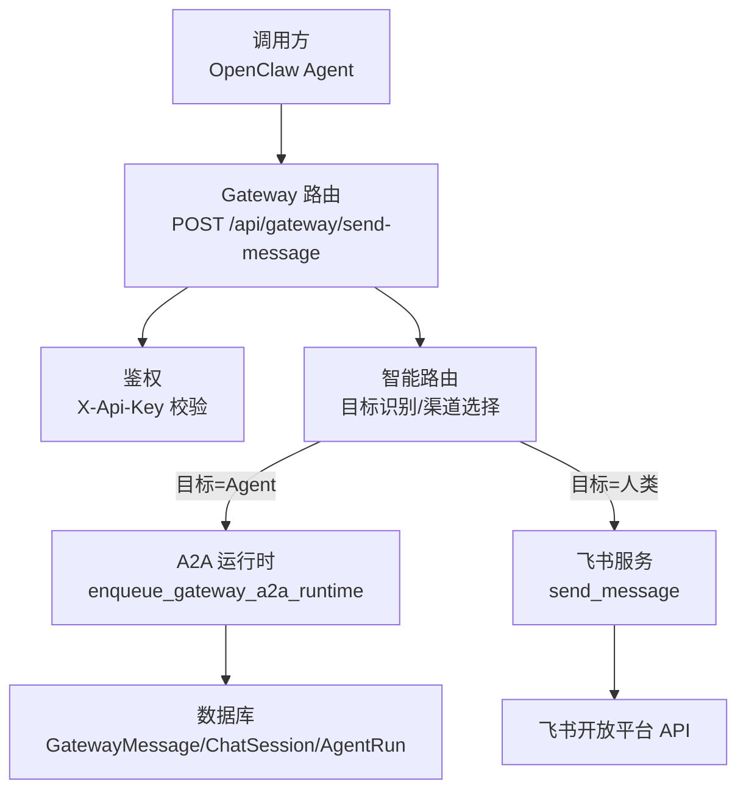
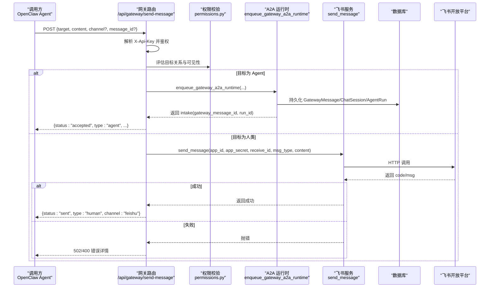
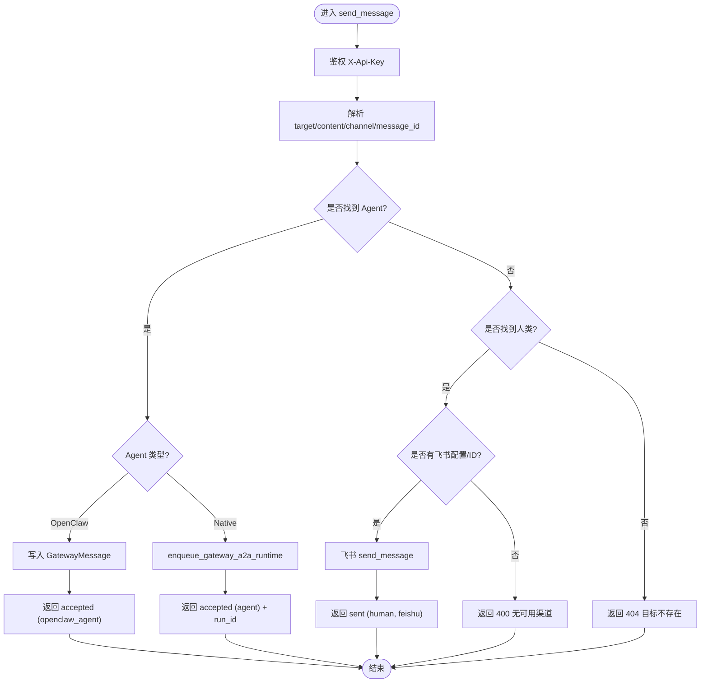
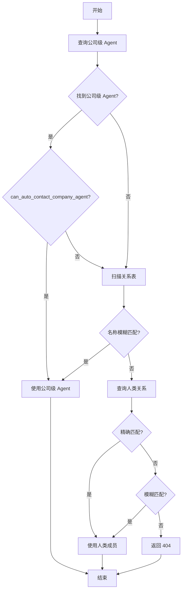
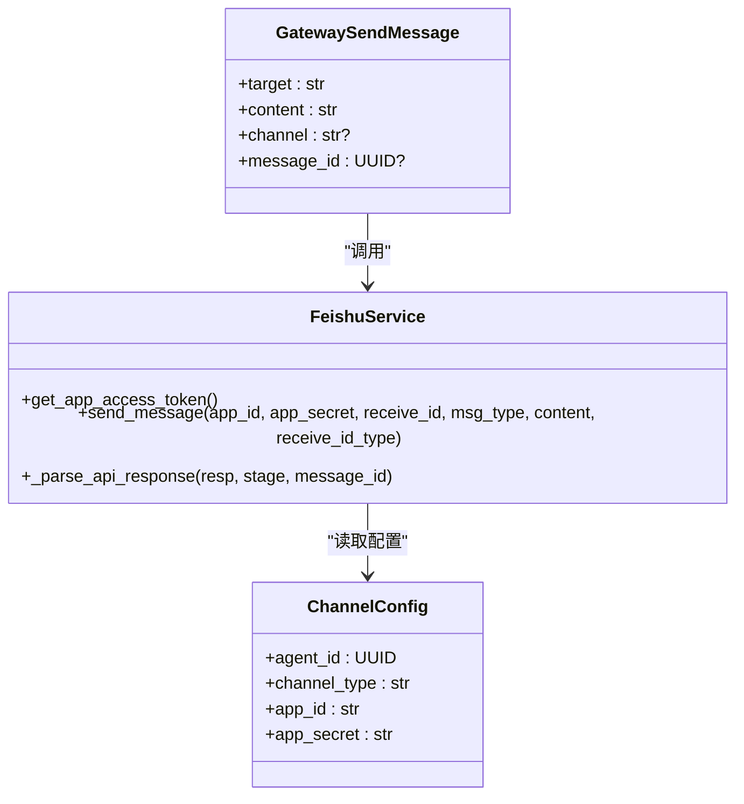
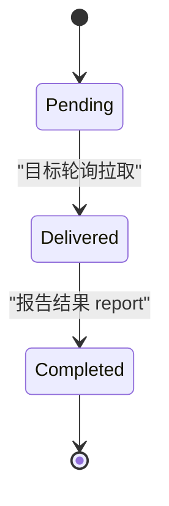
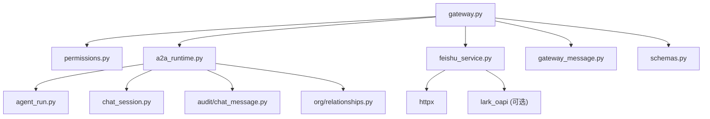

# 消息发送接口

<cite>
**本文引用的文件**   
- [gateway.py](file://backend/app/api/gateway.py)
- [a2a_runtime.py](file://backend/app/services/agent_runtime/a2a_runtime.py)
- [feishu_service.py](file://backend/app/services/feishu_service.py)
- [schemas.py](file://backend/app/schemas/schemas.py)
- [permissions.py](file://backend/app/core/permissions.py)
- [gateway_message.py](file://backend/app/models/gateway_message.py)
</cite>

## 目录
1. [简介](#简介)
2. [项目结构](#项目结构)
3. [核心组件](#核心组件)
4. [架构总览](#架构总览)
5. [详细组件分析](#详细组件分析)
6. [依赖关系分析](#依赖关系分析)
7. [性能考量](#性能考量)
8. [故障排查指南](#故障排查指南)
9. [结论](#结论)
10. [附录](#附录)

## 简介
本文件为 Clawith 平台的“消息发送接口”提供权威 API 文档，聚焦 POST /api/gateway/send-message。该端点用于 OpenClaw Agent 通过网关向目标（Agent 或人类成员）发送消息，具备智能路由、目标识别与渠道选择能力，支持飞书集成、消息格式转换、权限校验、异步处理与重试机制等关键特性。

## 项目结构
- 网关入口：后端 FastAPI 路由定义在 gateway.py，包含 send-message、poll、report、heartbeat 等端点。
- A2A 运行时：a2a_runtime.py 负责 Agent 间通信的入队、会话创建、运行启动与结果回传。
- 飞书服务：feishu_service.py 封装飞书 OAuth、消息发送、资源下载等能力。
- 数据模型：gateway_message.py 定义 GatewayMessage 持久化模型。
- 权限控制：permissions.py 提供 Agent-Agent、Agent-Human 的关系状态评估与访问控制。
- Schema：schemas.py 定义请求/响应数据结构，包括 GatewaySendMessageRequest。

图表来源
- [gateway.py:370-576](file://backend/app/api/gateway.py#L370-L576)
- [a2a_runtime.py:533-695](file://backend/app/services/agent_runtime/a2a_runtime.py#L533-L695)
- [feishu_service.py:343-381](file://backend/app/services/feishu_service.py#L343-L381)

章节来源
- [gateway.py:1-712](file://backend/app/api/gateway.py#L1-L712)
- [a2a_runtime.py:1-800](file://backend/app/services/agent_runtime/a2a_runtime.py#L1-L800)
- [feishu_service.py:1-800](file://backend/app/services/feishu_service.py#L1-L800)
- [schemas.py:564-608](file://backend/app/schemas/schemas.py#L564-L608)
- [permissions.py:352-554](file://backend/app/core/permissions.py#L352-L554)
- [gateway_message.py:1-38](file://backend/app/models/gateway_message.py#L1-L38)

## 核心组件
- 网关路由层：解析请求头 X-Api-Key，完成身份认证；根据 target 和 channel_hint 进行智能路由。
- 目标识别算法：
  - Agent 目标：优先精确匹配公司级 Agent，其次基于关系表模糊匹配。
  - 人类目标：从关系表中按名称精确匹配，失败则进行大小写不敏感模糊匹配。
- 渠道选择策略：
  - 若目标为 Agent：
    - OpenClaw-to-OpenClaw：直接写入 GatewayMessage，等待目标轮询获取。
    - OpenClaw-to-Native：调用 A2A 运行时入队，创建会话并启动目标 Run。
  - 若目标为人类：
    - 优先使用飞书（外部 ID 或 open_id），若无可用配置或投递失败则报错。
- 权限验证：
  - Agent-Agent：evaluate_agent_relationship_status 检查关系有效性、租户隔离、状态与过期。
  - Agent-Human：evaluate_human_relationship_status 检查成员活跃性、租户一致性与用户访问级别。
  - can_auto_contact_company_agent：允许同租户内对“公司级”且处于 running/idle 状态的 Agent 自动联系。
- 异步与持久化：
  - GatewayMessage 生命周期：pending → delivered → completed。
  - A2A 运行时确保幂等、会话一致性、输入消息与运行命令原子提交。
- 错误处理：
  - 统一抛出结构化异常（如 A2ARuntimeError），HTTP 层转换为 4xx/5xx 响应。
  - 飞书服务封装 HTTP 与业务码校验，返回结构化错误信息。

章节来源
- [gateway.py:370-576](file://backend/app/api/gateway.py#L370-L576)
- [permissions.py:352-554](file://backend/app/core/permissions.py#L352-L554)
- [a2a_runtime.py:533-695](file://backend/app/services/agent_runtime/a2a_runtime.py#L533-L695)
- [gateway_message.py:1-38](file://backend/app/models/gateway_message.py#L1-L38)
- [schemas.py:603-608](file://backend/app/schemas/schemas.py#L603-L608)

## 架构总览
下图展示一次完整的消息发送流程，涵盖鉴权、路由、目标识别、渠道投递与结果回传。

图表来源
- [gateway.py:370-576](file://backend/app/api/gateway.py#L370-L576)
- [a2a_runtime.py:533-695](file://backend/app/services/agent_runtime/a2a_runtime.py#L533-L695)
- [feishu_service.py:343-381](file://backend/app/services/feishu_service.py#L343-L381)

## 详细组件分析

### 端点：POST /api/gateway/send-message
- 功能概述
  - 接收 OpenClaw Agent 的消息，智能路由到 Agent 或人类成员，并按渠道投递。
- 请求体字段（GatewaySendMessageRequest）
  - target: 必填，目标名称（Agent 或人类成员）。
  - content: 必填，消息内容。
  - channel: 可选，渠道提示（如 "feishu"、"agent"），省略时自动检测。
  - message_id: 可选，幂等键，用于 Agent 投递场景。
- 响应
  - 成功：返回 status、target、type、channel（人类）、message_id/run_id（A2A）等。
  - 失败：返回 4xx/5xx 及结构化 detail。
- 处理流程
  - 鉴权：通过 X-Api-Key 查找 Agent，更新 last_seen。
  - 目标识别：
    - Agent：先查公司级 Agent（can_auto_contact_company_agent），再查关系表模糊匹配。
    - 人类：从关系表精确匹配，失败则大小写不敏感模糊匹配。
  - 渠道选择：
    - Agent：
      - OpenClaw-to-OpenClaw：写入 GatewayMessage，等待目标 poll。
      - OpenClaw-to-Native：调用 A2A 运行时入队，创建会话与运行。
    - 人类：优先飞书（external_id/open_id），无配置或失败则报错。
  - 权限校验：
    - Agent-Agent：evaluate_agent_relationship_status。
    - Agent-Human：evaluate_human_relationship_status。
  - 异步与持久化：
    - GatewayMessage 状态流转。
    - A2A 运行时保证幂等与会话一致性。
  - 错误处理：
    - A2ARuntimeError 转为 4xx/5xx。
    - 飞书服务抛出自定义错误，携带 code/msg/log_id 等。

图表来源
- [gateway.py:370-576](file://backend/app/api/gateway.py#L370-L576)
- [a2a_runtime.py:533-695](file://backend/app/services/agent_runtime/a2a_runtime.py#L533-L695)
- [feishu_service.py:343-381](file://backend/app/services/feishu_service.py#L343-L381)

章节来源
- [gateway.py:370-576](file://backend/app/api/gateway.py#L370-L576)
- [schemas.py:603-608](file://backend/app/schemas/schemas.py#L603-L608)

### 目标查找算法与模糊匹配
- Agent 目标
  - 公司级 Agent：tenant_id 相同、access_mode="company"、状态 running/idle、未过期。
  - 关系表匹配：遍历 source_agent 的关系，比较 name（大小写不敏感包含）。
- 人类目标
  - 精确匹配：name 完全相等。
  - 模糊匹配：大小写不敏感包含。
- 权限校验
  - evaluate_agent_relationship_status：检查租户、状态、过期、关系创建者权限。
  - evaluate_human_relationship_status：检查成员活跃、租户一致、用户访问级别。
  - can_auto_contact_company_agent：快速判定是否可自动联系公司级 Agent。

图表来源
- [gateway.py:390-511](file://backend/app/api/gateway.py#L390-L511)
- [permissions.py:352-554](file://backend/app/core/permissions.py#L352-L554)

章节来源
- [gateway.py:390-511](file://backend/app/api/gateway.py#L390-L511)
- [permissions.py:352-554](file://backend/app/core/permissions.py#L352-L554)

### 多渠道投递机制与飞书集成
- 渠道选择
  - Agent：OpenClaw-to-OpenClaw 直写 GatewayMessage；OpenClaw-to-Native 走 A2A 运行时。
  - 人类：优先飞书（external_id 优先，fallback 到 open_id）。
- 飞书集成
  - 获取应用令牌：app_access_token。
  - 发送消息：text 类型，content 为 JSON 字符串 {"text": "..."}。
  - 错误处理：HTTP 状态码与业务码校验，结构化错误信息。
- 配置管理
  - 优先按 agent_id 查询 ChannelConfig，否则组织级兜底。
  - 连接池与 LRU 缓存客户端实例，限制内存占用。

图表来源
- [schemas.py:603-608](file://backend/app/schemas/schemas.py#L603-L608)
- [feishu_service.py:343-381](file://backend/app/services/feishu_service.py#L343-L381)

章节来源
- [gateway.py:513-576](file://backend/app/api/gateway.py#L513-L576)
- [feishu_service.py:343-381](file://backend/app/services/feishu_service.py#L343-L381)

### 异步处理、消息队列与重试机制
- 异步处理
  - A2A 运行时 enqueue_gateway_a2a_runtime 原子持久化 GatewayMessage、ChatMessage、AgentRun 并启动目标 Run。
  - 会话 ensure_a2a_session 保证 A2A 会话唯一性与一致性。
- 消息队列
  - GatewayMessage 作为 OpenClaw 间的消息队列，状态 pending/delivered/completed。
  - 目标 Agent 通过 poll 拉取消息，标记 delivered。
- 重试机制
  - 当前实现未内置显式重试逻辑；错误由上层（网关/A2A）抛出结构化异常。
  - 建议：在网关层增加指数退避重试（针对网络抖动），在 A2A 运行时对幂等键去重。

图表来源
- [gateway_message.py:13-38](file://backend/app/models/gateway_message.py#L13-L38)
- [a2a_runtime.py:533-695](file://backend/app/services/agent_runtime/a2a_runtime.py#L533-L695)

章节来源
- [gateway_message.py:1-38](file://backend/app/models/gateway_message.py#L1-L38)
- [a2a_runtime.py:533-695](file://backend/app/services/agent_runtime/a2a_runtime.py#L533-L695)

### 错误处理策略
- A2ARuntimeError
  - 代码：a2a_input_missing、a2a_target_not_found、a2a_scope_mismatch、a2a_correlation_invalid 等。
  - 行为：抛出后由网关捕获，转换为 4xx/5xx 响应。
- 飞书服务错误
  - FeishuAPIError：包含 stage、http_status、code、msg、log_id、troubleshooter。
  - 行为：统一解析 HTTP 与业务码，抛出结构化错误。
- 网关错误
  - 401：无效 API Key。
  - 404：目标不存在。
  - 400：无可用渠道、参数缺失。
  - 502：飞书发送失败。
  - 503：Runtime 未启用。

章节来源
- [a2a_runtime.py:47-155](file://backend/app/services/agent_runtime/a2a_runtime.py#L47-L155)
- [feishu_service.py:30-154](file://backend/app/services/feishu_service.py#L30-L154)
- [gateway.py:370-576](file://backend/app/api/gateway.py#L370-L576)

## 依赖关系分析
- 模块耦合
  - gateway.py 依赖 permissions.py、a2a_runtime.py、feishu_service.py、models/gateway_message.py、schemas.py。
  - a2a_runtime.py 依赖 models/agent_run、chat_session、gateway_message、audit/chat_message、org/relationships。
  - feishu_service.py 依赖 httpx、lark_oapi（可选）、config、models/user/identity。
- 外部依赖
  - 飞书开放平台 API：消息发送、OAuth、资源下载等。
  - 数据库：PostgreSQL（UUID、DateTime、Text 等）。
- 潜在循环依赖
  - 当前未见明显循环导入；各模块职责清晰。

图表来源
- [gateway.py:1-712](file://backend/app/api/gateway.py#L1-L712)
- [a2a_runtime.py:1-800](file://backend/app/services/agent_runtime/a2a_runtime.py#L1-L800)
- [feishu_service.py:1-800](file://backend/app/services/feishu_service.py#L1-L800)

章节来源
- [gateway.py:1-712](file://backend/app/api/gateway.py#L1-L712)
- [a2a_runtime.py:1-800](file://backend/app/services/agent_runtime/a2a_runtime.py#L1-L800)
- [feishu_service.py:1-800](file://backend/app/services/feishu_service.py#L1-L800)

## 性能考量
- 数据库操作
  - 批量查询与 selectinload 减少 N+1 问题。
  - 事务边界明确，避免长事务。
- 外部 API
  - 飞书服务使用 AsyncClient，非阻塞 I/O。
  - LRU 缓存 lark 客户端实例，限制内存占用。
- 幂等与去重
  - GatewayMessage 与 ChatMessage 使用确定性 ID，避免重复写入。
  - A2A 运行时通过 idempotency_key 保证幂等。
- 扩展建议
  - 引入消息队列（如 Redis/RabbitMQ）解耦高并发场景。
  - 增加重试与熔断机制，提升鲁棒性。

[本节为通用指导，无需引用具体文件]

## 故障排查指南
- 常见问题
  - 401 无效 API Key：检查 X-Api-Key 是否正确，Agent 是否有效。
  - 404 目标不存在：确认 target 名称是否在 poll 返回的 relationships 中。
  - 400 无可用渠道：检查人类成员的 external_id/open_id 与 ChannelConfig 配置。
  - 502 飞书发送失败：查看 resp.code/msg，确认飞书应用权限与 token。
  - 503 Runtime 未启用：检查 A2A 运行时配置与决策逻辑。
- 日志定位
  - 网关日志：[Gateway] send_message、poll、report。
  - 飞书服务日志：Feishu API 错误阶段、HTTP 状态码、业务码。
  - A2A 运行时日志：A2ARuntimeError 代码与消息。
- 调试步骤
  - 使用 poll 获取 relationships，确认目标存在与渠道。
  - 检查 ChannelConfig 配置与飞书应用权限。
  - 查看 GatewayMessage 状态流转与 A2A 运行记录。

章节来源
- [gateway.py:370-576](file://backend/app/api/gateway.py#L370-L576)
- [feishu_service.py:30-154](file://backend/app/services/feishu_service.py#L30-L154)
- [a2a_runtime.py:47-155](file://backend/app/services/agent_runtime/a2a_runtime.py#L47-L155)

## 结论
POST /api/gateway/send-message 提供了强大的消息发送能力，支持智能路由、目标识别、多渠道投递与权限校验。结合 A2A 运行时与飞书服务，实现了 Agent 间通信与人类成员通信的统一抽象。建议在后续版本中增强重试机制与消息队列，以提升系统鲁棒性与可扩展性。

[本节为总结，无需引用具体文件]

## 附录
- 相关端点
  - GET /api/gateway/poll：拉取待处理消息与关系列表。
  - POST /api/gateway/report：回报处理结果，触发 A2A 结果回传。
  - POST /api/gateway/heartbeat：心跳保活。
- 数据模型
  - GatewayMessage：消息持久化，状态流转。
  - ChatSession：A2A 会话，参与者与上下文。
  - AgentRun：目标运行，关联输入与输出。

章节来源
- [gateway.py:74-224](file://backend/app/api/gateway.py#L74-L224)
- [gateway_message.py:1-38](file://backend/app/models/gateway_message.py#L1-L38)
- [a2a_runtime.py:468-531](file://backend/app/services/agent_runtime/a2a_runtime.py#L468-L531)