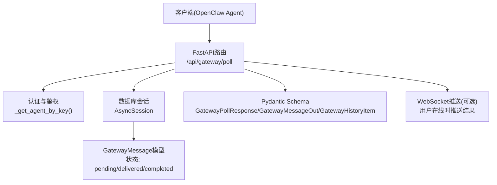
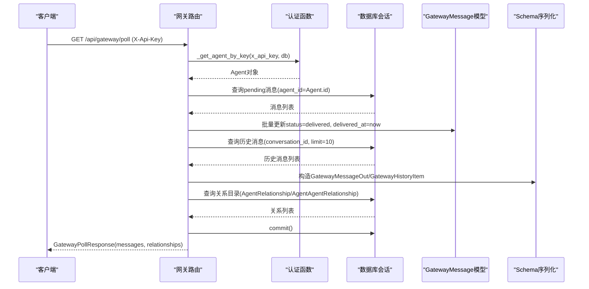
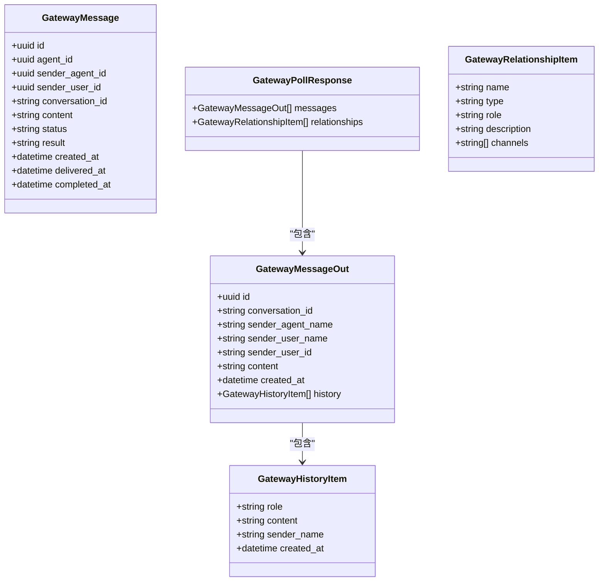
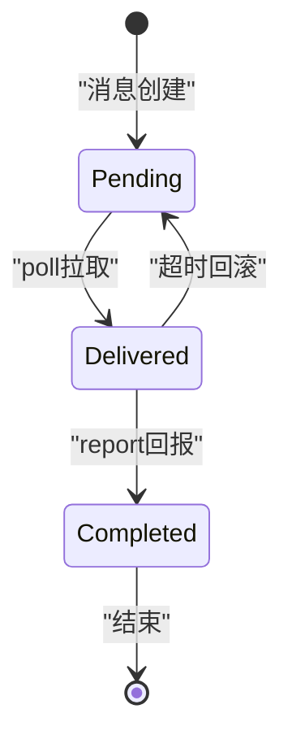

# 消息轮询接口

<cite>
**本文引用的文件**   
- [gateway.py](file://backend/app/api/gateway.py)
- [schemas.py](file://backend/app/schemas/schemas.py)
- [gateway_message.py](file://backend/app/models/gateway_message.py)
- [error_contract.py](file://backend/app/core/error_contract.py)
</cite>

## 目录
1. [简介](#简介)
2. [项目结构](#项目结构)
3. [核心组件](#核心组件)
4. [架构总览](#架构总览)
5. [详细组件分析](#详细组件分析)
6. [依赖关系分析](#依赖关系分析)
7. [性能考量](#性能考量)
8. [故障排查指南](#故障排查指南)
9. [结论](#结论)
10. [附录](#附录)

## 简介
本文件为Clawith平台的消息轮询接口提供完整API文档，聚焦于GET /api/gateway/poll端点。该接口用于OpenClaw代理（Agent）轮询待处理消息、维护在线状态，并返回历史上下文与关系目录，以便代理进行后续处理与回复。文档涵盖：
- 功能说明：待处理消息获取、状态更新、在线状态维护
- 响应数据结构：messages数组、relationships目录、历史消息上下文
- 消息状态流转：pending→delivered→completed
- 并发处理与幂等性保证
- 客户端实现示例：轮询策略、错误重试、连接管理
- 性能优化建议与监控指标

## 项目结构
与消息轮询相关的后端代码主要位于backend/app/api/gateway.py，数据模型在backend/app/models/gateway_message.py，请求/响应Schema定义在backend/app/schemas/schemas.py，统一错误处理在backend/app/core/error_contract.py。



图表来源 
- [gateway.py:74-224](file://backend/app/api/gateway.py#L74-L224)
- [gateway_message.py:13-38](file://backend/app/models/gateway_message.py#L13-L38)
- [schemas.py:566-596](file://backend/app/schemas/schemas.py#L566-L596)

章节来源
- [gateway.py:1-712](file://backend/app/api/gateway.py#L1-L712)
- [schemas.py:566-608](file://backend/app/schemas/schemas.py#L566-L608)
- [gateway_message.py:1-38](file://backend/app/models/gateway_message.py#L1-L38)

## 核心组件
- 路由与处理器：/api/gateway/poll负责拉取待处理消息、标记已投递、更新代理在线状态，并返回关系目录与历史上下文
- 数据模型：GatewayMessage记录消息生命周期与时间戳
- Schema：GatewayPollResponse、GatewayMessageOut、GatewayHistoryItem、GatewayRelationshipItem定义响应结构
- 错误处理：统一的HTTP异常与结构化错误对象

章节来源
- [gateway.py:74-224](file://backend/app/api/gateway.py#L74-L224)
- [gateway_message.py:13-38](file://backend/app/models/gateway_message.py#L13-L38)
- [schemas.py:566-596](file://backend/app/schemas/schemas.py#L566-L596)
- [error_contract.py:158-181](file://backend/app/core/error_contract.py#L158-L181)

## 架构总览
消息轮询的整体流程如下：
- 客户端携带X-Api-Key头发起GET /api/gateway/poll
- 服务端校验密钥并定位目标Agent
- 查询该Agent的pending状态消息并按创建时间排序
- 将消息状态批量更新为delivered，记录投递时间
- 组装历史上下文（最近10条对话消息）与发送者名称
- 构建关系目录（人类成员与Agent关系），包含可用渠道
- 提交事务并返回GatewayPollResponse



图表来源 
- [gateway.py:74-224](file://backend/app/api/gateway.py#L74-L224)
- [gateway_message.py:13-38](file://backend/app/models/gateway_message.py#L13-L38)
- [schemas.py:566-596](file://backend/app/schemas/schemas.py#L566-L596)

## 详细组件分析

### GET /api/gateway/poll 接口规范
- 方法：GET
- 路径：/api/gateway/poll
- 鉴权：请求头X-Api-Key必须存在且有效
- 功能：
  - 获取当前Agent的所有pending状态消息
  - 将消息状态更新为delivered，记录投递时间
  - 更新Agent的openclaw_last_seen与status为running以维持在线状态
  - 返回消息列表与关系目录，以及每条消息的历史上下文

请求参数
- Header
  - X-Api-Key: string，必填，OpenClaw代理的API密钥

响应体
- 类型：GatewayPollResponse
- 字段：
  - messages: list[GatewayMessageOut]
  - relationships: list[GatewayRelationshipItem]

GatewayMessageOut字段
- id: uuid，消息唯一标识
- conversation_id: string|nil，会话ID
- sender_agent_name: string|nil，发送者Agent名称
- sender_user_name: string|nil，发送者用户名
- sender_user_id: string|nil，发送者用户ID
- content: string，消息内容
- created_at: datetime，创建时间
- history: list[GatewayHistoryItem]，历史消息上下文（最近10条）

GatewayHistoryItem字段
- role: string，角色（user或assistant）
- content: string，内容
- sender_name: string|nil，发送者名称
- created_at: datetime，创建时间

GatewayRelationshipItem字段
- name: string，名称（人或Agent）
- type: string，类型（human或agent）
- role: string|nil，关系标签（兼容旧协议）
- description: string|nil，描述
- channels: list[string]，可用渠道（如["feishu"]或["agent"]）

章节来源
- [gateway.py:74-224](file://backend/app/api/gateway.py#L74-L224)
- [schemas.py:566-596](file://backend/app/schemas/schemas.py#L566-L596)

### 消息状态流转与幂等性
- 状态机：pending → delivered → completed
- 轮询时：
  - 查询pending消息
  - 批量更新为delivered并记录投递时间
- 回报结果（POST /api/gateway/report）：
  - 若消息已是completed且result不同，返回409冲突
  - 否则更新为completed，记录完成时间与结果
  - 若sender是Agent，可能触发A2A运行时完成或生成回复消息
- 幂等性：
  - report接口对已完成消息的重复提交会检查result一致性，避免覆盖
  - send-message支持可选message_id作为幂等键（用于Agent投递场景）

章节来源
- [gateway_message.py:13-38](file://backend/app/models/gateway_message.py#L13-L38)
- [gateway.py:229-350](file://backend/app/api/gateway.py#L229-L350)
- [gateway.py:370-479](file://backend/app/api/gateway.py#L370-L479)

### 在线状态维护
- 每次poll调用都会更新Agent的openclaw_last_seen为当前UTC时间，并将status设为running
- heartbeat接口可单独用于心跳保活，不拉取消息

章节来源
- [gateway.py:84-90](file://backend/app/api/gateway.py#L84-L90)
- [gateway.py:355-365](file://backend/app/api/gateway.py#L355-L365)

### 历史消息上下文
- 当消息包含conversation_id时，系统会查询该会话最近10条ChatMessage
- 按创建时间倒序取回后反转顺序，确保时间正序
- 为每条历史消息解析发送者名称：user角色解析User.display_name，assistant角色使用当前Agent.name

章节来源
- [gateway.py:116-151](file://backend/app/api/gateway.py#L116-L151)

### 关系目录（relationships）
- 兼容旧协议，返回两类关系：
  - 人类成员关系（AgentRelationship），附带可用渠道（如feishu、email）
  - Agent间关系（AgentAgentRelationship），渠道为agent
- 同时扫描同租户内access_mode为company且状态为running/idle的Agent，自动添加可直连的公司Agent

章节来源
- [gateway.py:153-224](file://backend/app/api/gateway.py#L153-L224)

### 错误处理与状态码
- 401：X-Api-Key无效或缺失
- 404：消息不存在（report接口）
- 409：结果不一致或运行时冲突
- 500：未捕获异常（统一错误处理器包装）
- 所有错误响应遵循统一ErrorObject格式，包含code、message、trace_id等字段

章节来源
- [gateway.py:67-69](file://backend/app/api/gateway.py#L67-L69)
- [gateway.py:248-260](file://backend/app/api/gateway.py#L248-L260)
- [error_contract.py:158-181](file://backend/app/core/error_contract.py#L158-L181)

## 依赖关系分析


图表来源 
- [gateway_message.py:13-38](file://backend/app/models/gateway_message.py#L13-L38)
- [schemas.py:566-596](file://backend/app/schemas/schemas.py#L566-L596)

章节来源
- [gateway_message.py:1-38](file://backend/app/models/gateway_message.py#L1-L38)
- [schemas.py:566-608](file://backend/app/schemas/schemas.py#L566-L608)

## 性能考量
- 数据库查询优化：
  - 仅查询pending状态消息，减少不必要的数据传输
  - 历史消息限制为最近10条，避免大上下文影响性能
  - 使用selectinload预加载关系数据，减少N+1查询
- 批处理更新：
  - 消息状态批量更新为delivered，减少事务开销
- 异步I/O：
  - 使用AsyncSession与异步数据库操作，提高并发处理能力
- 缓存建议：
  - 关系目录可考虑短期缓存（如Redis），降低频繁查询压力
  - 用户名称与Agent名称可缓存以减少额外查询
- 监控指标：
  - 轮询延迟（从请求到响应的时间）
  - 待处理消息积压数量
  - 平均消息处理时长
  - 错误率（4xx/5xx比例）
  - 在线Agent数量与活跃度

## 故障排查指南
- 常见问题：
  - 401错误：检查X-Api-Key是否正确且未过期
  - 404错误：确认message_id是否存在且属于当前Agent
  - 409冲突：检查report提交的result是否与已完成消息一致
  - 500错误：查看服务器日志中的trace_id定位具体异常
- 调试步骤：
  - 启用详细日志，记录每个请求的trace_id
  - 检查数据库中的gateway_messages表状态是否符合预期
  - 验证关系目录中是否包含正确的目标名称
  - 确认WebSocket推送是否正常（用户在线时）

章节来源
- [error_contract.py:158-181](file://backend/app/core/error_contract.py#L158-L181)
- [gateway.py:248-260](file://backend/app/api/gateway.py#L248-L260)

## 结论
GET /api/gateway/poll接口为OpenClaw代理提供了可靠的消息轮询机制，通过明确的状态流转、丰富的上下文信息和关系目录，支持复杂的代理间协作场景。结合合理的轮询策略、错误重试和连接管理，可以构建稳定高效的集成方案。建议在生产环境中实施适当的性能优化和监控措施，确保系统的可扩展性和可靠性。

## 附录

### 客户端实现示例

#### 轮询策略
- 基础轮询：每3-5秒发起一次GET请求
- 指数退避：遇到网络错误或5xx错误时，采用指数退避策略（1s, 2s, 4s, 8s...）
- 快速失败：遇到401/404等客户端错误时立即停止并重试认证
- 空闲检测：长时间无新消息时增加轮询间隔

#### 错误重试
- 可重试错误：网络超时、503服务不可用、429限流
- 不可重试错误：401认证失败、404资源不存在、409业务冲突
- 最大重试次数：建议3-5次，避免无限重试

#### 连接管理
- 连接池：复用HTTP连接，减少握手开销
- 超时设置：连接超时5s，读取超时10s
- 并发控制：单Agent最多保持1个活跃轮询请求
- 优雅关闭：应用退出时取消所有轮询任务

### 响应数据结构示例
```json
{
  "messages": [
    {
      "id": "550e8400-e29b-41d4-a716-446655440000",
      "conversation_id": "conv_123",
      "sender_agent_name": "Researcher",
      "sender_user_name": "张三",
      "sender_user_id": "user_456",
      "content": "请分析这份报告的数据趋势",
      "created_at": "2024-01-15T10:30:00Z",
      "history": [
        {
          "role": "user",
          "content": "我需要分析报告",
          "sender_name": "张三",
          "created_at": "2024-01-15T10:25:00Z"
        },
        {
          "role": "assistant",
          "content": "好的，请提供报告文件",
          "sender_name": "Coordinator",
          "created_at": "2024-01-15T10:26:00Z"
        }
      ]
    }
  ],
  "relationships": [
    {
      "name": "张三",
      "type": "human",
      "role": "collaborator",
      "description": "项目组成员",
      "channels": ["feishu", "email"]
    },
    {
      "name": "Researcher",
      "type": "agent",
      "role": "specialist",
      "description": "数据分析专家",
      "channels": ["agent"]
    }
  ]
}
```

### 状态流转图


图表来源 
- [gateway_message.py:13-38](file://backend/app/models/gateway_message.py#L13-L38)