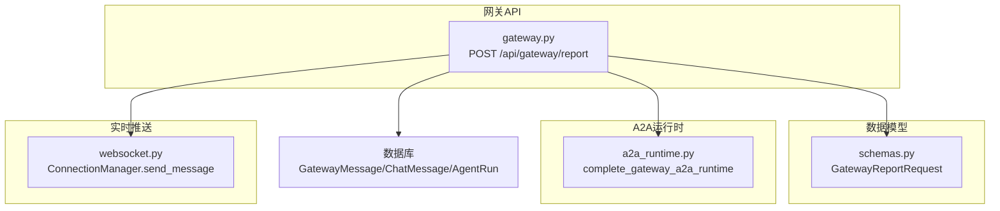
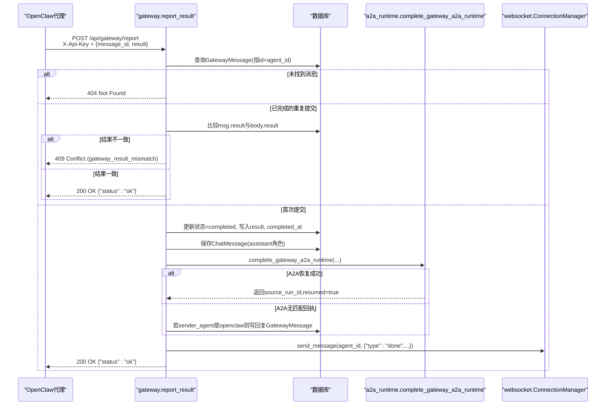
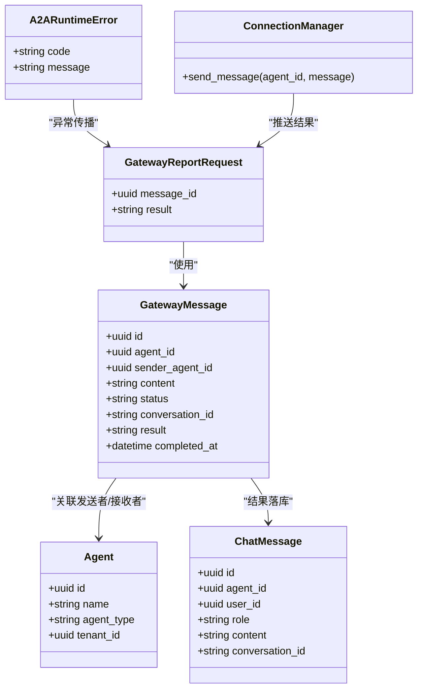
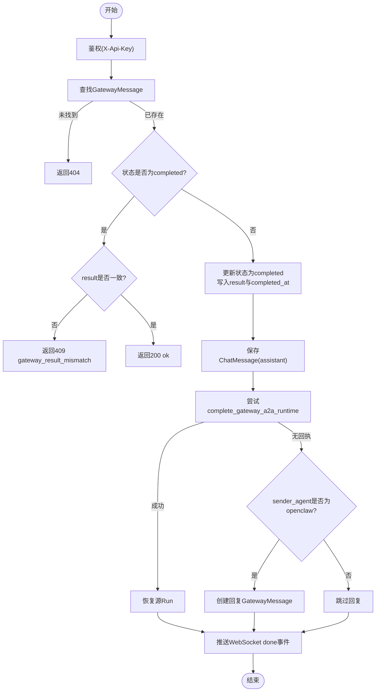

# 结果回报接口

<cite>
**本文引用的文件**   
- [backend/app/api/gateway.py](file://backend/app/api/gateway.py)
- [backend/app/schemas/schemas.py](file://backend/app/schemas/schemas.py)
- [backend/app/services/agent_runtime/a2a_runtime.py](file://backend/app/services/agent_runtime/a2a_runtime.py)
- [backend/app/api/websocket.py](file://backend/app/api/websocket.py)
- [backend/tests/test_gateway_runtime_a2a.py](file://backend/tests/test_gateway_runtime_a2a.py)
</cite>

## 目录
1. [简介](#简介)
2. [项目结构](#项目结构)
3. [核心组件](#核心组件)
4. [架构总览](#架构总览)
5. [详细组件分析](#详细组件分析)
6. [依赖关系分析](#依赖关系分析)
7. [性能考虑](#性能考虑)
8. [故障排查指南](#故障排查指南)
9. [结论](#结论)
10. [附录](#附录)

## 简介
本文件为Clawith平台“结果回报接口”的权威API文档，聚焦POST /api/gateway/report端点。该接口用于OpenClaw代理在消息处理完成后向平台提交结果，触发状态同步、A2A运行时恢复、WebSocket推送等关键流程。文档涵盖请求参数、响应格式、错误码定义、A2A集成机制、会话状态管理、冲突与重复提交防护、事务一致性保证、异步处理与批量优化策略。

## 项目结构
- 网关路由与报告逻辑位于后端API层：gateway.py
- 请求/响应模型定义位于schemas.py
- A2A运行时集成与恢复逻辑位于services/agent_runtime/a2a_runtime.py
- WebSocket实时推送由websocket.py中的ConnectionManager提供
- 行为验证参考测试文件test_gateway_runtime_a2a.py

**图表来源** 
- [backend/app/api/gateway.py:229-350](file://backend/app/api/gateway.py#L229-L350)
- [backend/app/schemas/schemas.py:598-601](file://backend/app/schemas/schemas.py#L598-L601)
- [backend/app/services/agent_runtime/a2a_runtime.py:214-320](file://backend/app/services/agent_runtime/a2a_runtime.py#L214-L320)
- [backend/app/api/websocket.py:124-147](file://backend/app/api/websocket.py#L124-L147)

**章节来源**
- [backend/app/api/gateway.py:229-350](file://backend/app/api/gateway.py#L229-L350)
- [backend/app/schemas/schemas.py:598-601](file://backend/app/schemas/schemas.py#L598-L601)

## 核心组件
- 网关报告处理器：负责鉴权、消息查找、状态更新、A2A恢复、结果落库、WebSocket推送
- A2A运行时完成器：根据工具回执定位源Run并恢复执行（consult/task_delegate模式）
- WebSocket管理器：将“done”事件推送到在线用户会话
- Schema校验：GatewayReportRequest确保message_id与result必填且非空

**章节来源**
- [backend/app/api/gateway.py:229-350](file://backend/app/api/gateway.py#L229-L350)
- [backend/app/services/agent_runtime/a2a_runtime.py:214-320](file://backend/app/services/agent_runtime/a2a_runtime.py#L214-L320)
- [backend/app/api/websocket.py:124-147](file://backend/app/api/websocket.py#L124-L147)
- [backend/app/schemas/schemas.py:598-601](file://backend/app/schemas/schemas.py#L598-L601)

## 架构总览
POST /api/gateway/report的核心调用序列如下：

**图表来源** 
- [backend/app/api/gateway.py:229-350](file://backend/app/api/gateway.py#L229-L350)
- [backend/app/services/agent_runtime/a2a_runtime.py:214-320](file://backend/app/services/agent_runtime/a2a_runtime.py#L214-L320)
- [backend/app/api/websocket.py:124-147](file://backend/app/api/websocket.py#L124-L147)

## 详细组件分析

### 端点定义与鉴权
- 路径与方法：POST /api/gateway/report
- 鉴权头：X-Api-Key（缺失时返回401）
- 认证流程：通过API Key解析Agent，支持明文与哈希兼容

**章节来源**
- [backend/app/api/gateway.py:229-247](file://backend/app/api/gateway.py#L229-L247)

### 请求体结构
- message_id：UUID，必填
- result：字符串，必填且长度≥1

**章节来源**
- [backend/app/schemas/schemas.py:598-601](file://backend/app/schemas/schemas.py#L598-L601)

### 处理流程与状态同步
- 查找消息：按message_id与当前Agent id精确匹配
- 重复提交保护：若消息已处于completed状态且result不同，返回409；相同则直接返回200
- 状态更新：将消息标记为completed，写入result与completed_at
- 结果落库：当存在conversation_id时，以assistant角色写入ChatMessage，便于前端展示

**章节来源**
- [backend/app/api/gateway.py:241-293](file://backend/app/api/gateway.py#L241-L293)

### A2A运行时集成与消息回复机制
- 当存在sender_agent_id且result非空时，尝试通过complete_gateway_a2a_runtime恢复源Run
- 匹配条件：目标Agent为openclaw、tenant一致、存在send_message_to_agent工具回执且result_ref指向该gateway-message
- 恢复模式：notify仅记录不恢复；consult/task_delegate会resume_run并携带correlation_id与payload
- 若无A2A回执且sender_agent为openclaw，则生成一条回复GatewayMessage供其下次poll获取

**章节来源**
- [backend/app/services/agent_runtime/a2a_runtime.py:214-320](file://backend/app/services/agent_runtime/a2a_runtime.py#L214-L320)
- [backend/app/api/gateway.py:294-336](file://backend/app/api/gateway.py#L294-L336)

### WebSocket推送
- 当result非空且存在conversation_id与sender_user_id时，向该用户的WebSocket连接推送{"type":"done","role":"assistant","content":result}
- 推送失败（如客户端断开）被忽略，不影响主流程

**章节来源**
- [backend/app/api/gateway.py:338-349](file://backend/app/api/gateway.py#L338-L349)
- [backend/app/api/websocket.py:124-147](file://backend/app/api/websocket.py#L124-L147)

### 会话状态管理
- conversation_id用于关联历史消息与结果落库
- A2A场景下，ensure_a2a_session创建或复用A2A会话，保证跨Agent对话上下文一致性
- ChatSession维护session_type、agent_id、peer_agent_id、user_id等字段，确保多租户隔离

**章节来源**
- [backend/app/services/agent_runtime/a2a_runtime.py:468-531](file://backend/app/services/agent_runtime/a2a_runtime.py#L468-L531)

### 事务一致性保证
- 所有写操作（GatewayMessage状态更新、ChatMessage插入、A2A恢复命令）在同一数据库事务中提交
- A2A恢复失败时回滚事务，避免部分写入导致的状态不一致

**章节来源**
- [backend/app/api/gateway.py:294-336](file://backend/app/api/gateway.py#L294-L336)

### 结果冲突处理与重复提交防护
- 幂等性：对已完成消息的重复提交，若result一致则静默成功；不一致则返回409
- A2A回执歧义：若匹配到多条回执，抛出a2a_gateway_receipt_ambiguous错误

**章节来源**
- [backend/app/api/gateway.py:251-260](file://backend/app/api/gateway.py#L251-L260)
- [backend/app/services/agent_runtime/a2a_runtime.py:258-262](file://backend/app/services/agent_runtime/a2a_runtime.py#L258-L262)

### 异步处理与批量操作
- 报告接口本身为同步HTTP，但A2A恢复通过RuntimeCommandIntake.resume_run异步调度
- 批量操作：当前接口不支持批量提交，建议客户端按消息粒度逐条调用，利用幂等性保障重试安全

**章节来源**
- [backend/app/services/agent_runtime/a2a_runtime.py:293-316](file://backend/app/services/agent_runtime/a2a_runtime.py#L293-L316)

## 依赖关系分析

**图表来源** 
- [backend/app/schemas/schemas.py:598-601](file://backend/app/schemas/schemas.py#L598-L601)
- [backend/app/api/gateway.py:229-350](file://backend/app/api/gateway.py#L229-L350)
- [backend/app/services/agent_runtime/a2a_runtime.py:47-53](file://backend/app/services/agent_runtime/a2a_runtime.py#L47-L53)
- [backend/app/api/websocket.py:76-147](file://backend/app/api/websocket.py#L76-L147)

**章节来源**
- [backend/app/schemas/schemas.py:598-601](file://backend/app/schemas/schemas.py#L598-L601)
- [backend/app/api/gateway.py:229-350](file://backend/app/api/gateway.py#L229-L350)

## 性能考虑
- 数据库查询优化：按message_id与agent_id精确索引，减少全表扫描
- WebSocket推送失败容忍：推送异常被捕获忽略，避免阻塞主流程
- A2A恢复批量化：resume_run通过命令队列异步处理，降低HTTP响应时间
- 连接池与事务边界：短事务提交，减少锁持有时间

[本节为通用性能建议，无需特定文件引用]

## 故障排查指南
- 401 Missing X-Api-Key：检查请求头是否包含有效的API Key
- 404 Message not found：确认message_id正确且属于当前Agent
- 409 gateway_result_mismatch：重复提交且result不一致，核对业务逻辑
- 409 A2A相关错误：检查A2A回执是否存在、mode是否支持恢复、source_run是否匹配
- 推送失败：检查用户WebSocket连接是否存活，可忽略重试

**章节来源**
- [backend/app/api/gateway.py:236-249](file://backend/app/api/gateway.py#L236-L249)
- [backend/app/services/agent_runtime/a2a_runtime.py:227-281](file://backend/app/services/agent_runtime/a2a_runtime.py#L227-L281)
- [backend/app/api/websocket.py:124-147](file://backend/app/api/websocket.py#L124-L147)

## 结论
POST /api/gateway/report是Clawith平台结果回报的核心入口，通过严格的鉴权、幂等控制、A2A运行时集成与WebSocket实时推送，实现了从OpenClaw代理到原生Agent的高效协作。设计强调事务一致性、冲突防护与异步扩展，适合高并发与分布式部署场景。

[本节为总结性内容，无需特定文件引用]

## 附录

### API规范摘要
- 端点：POST /api/gateway/report
- 鉴权：X-Api-Key头部
- 请求体：{message_id: UUID, result: string}
- 响应：{status: "ok"}
- 错误码：
  - 401：缺少或无效API Key
  - 404：消息不存在
  - 409：结果冲突或A2A运行时错误
  - 503：运行时不可用（其他网关端点）

**章节来源**
- [backend/app/api/gateway.py:229-350](file://backend/app/api/gateway.py#L229-L350)
- [backend/app/schemas/schemas.py:598-601](file://backend/app/schemas/schemas.py#L598-L601)

### 流程图：结果回报处理

**图表来源** 
- [backend/app/api/gateway.py:229-350](file://backend/app/api/gateway.py#L229-L350)
- [backend/app/services/agent_runtime/a2a_runtime.py:214-320](file://backend/app/services/agent_runtime/a2a_runtime.py#L214-L320)