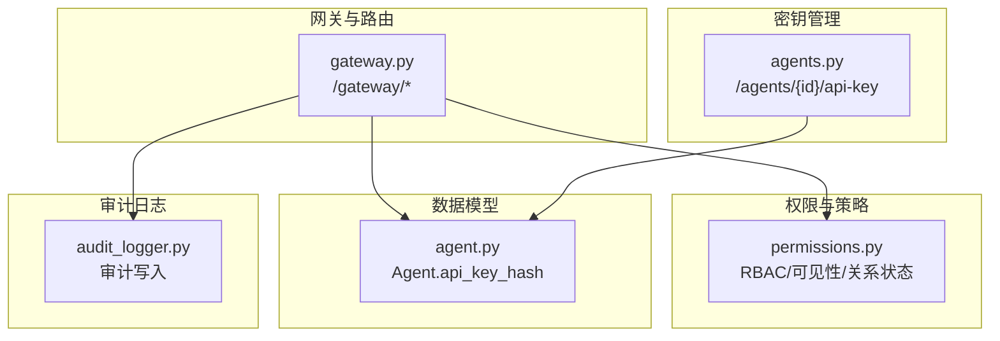
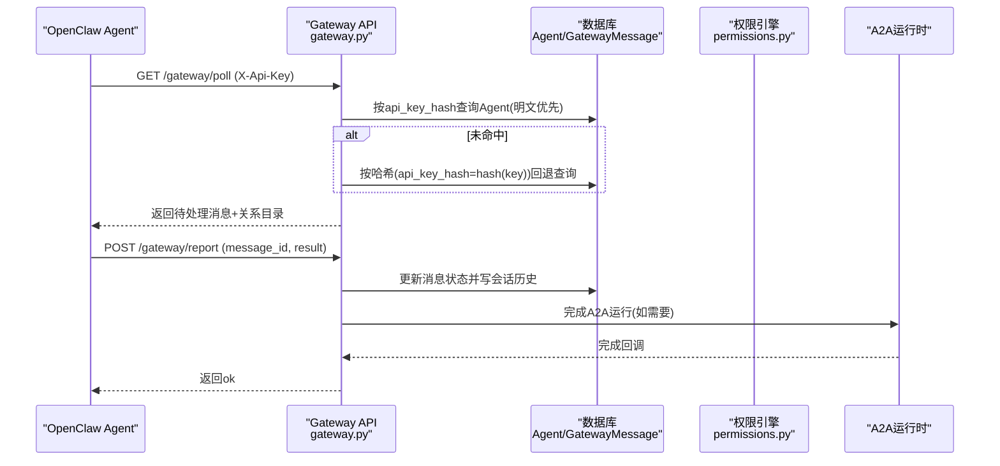
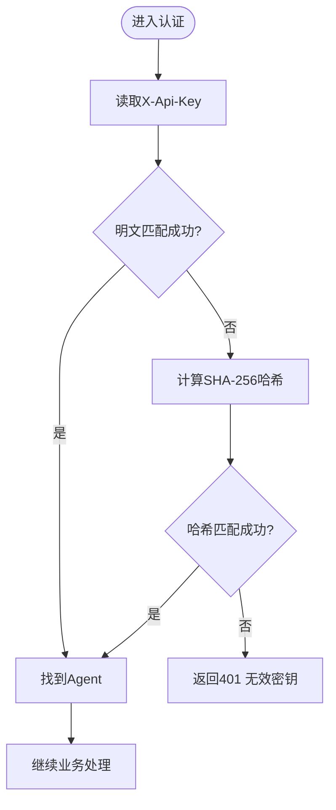
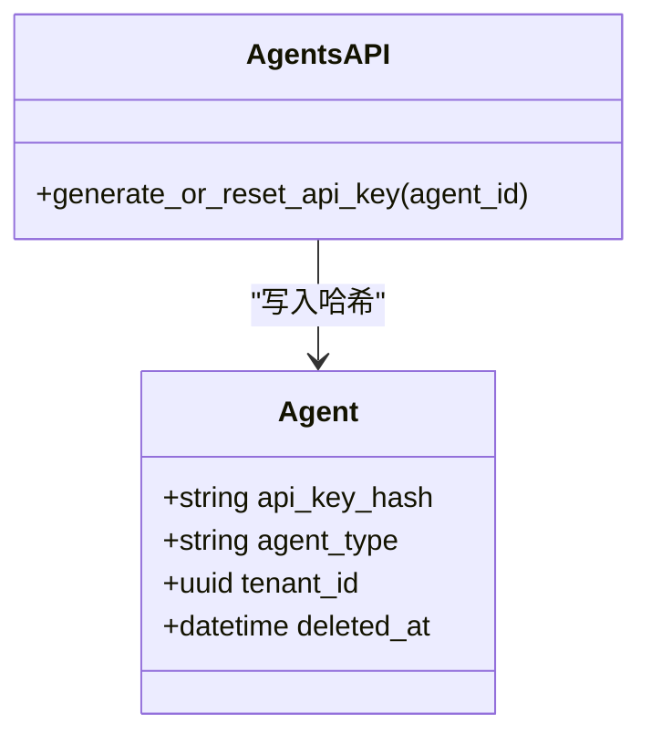
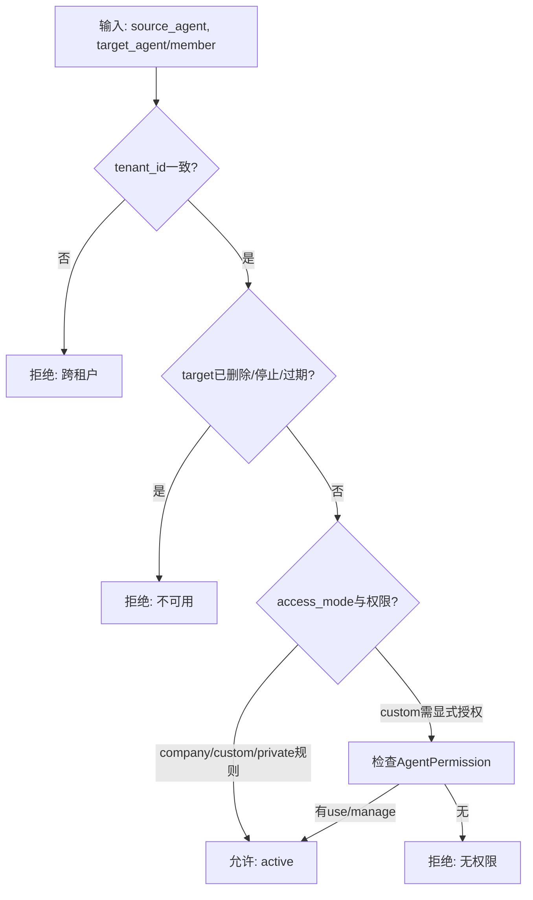
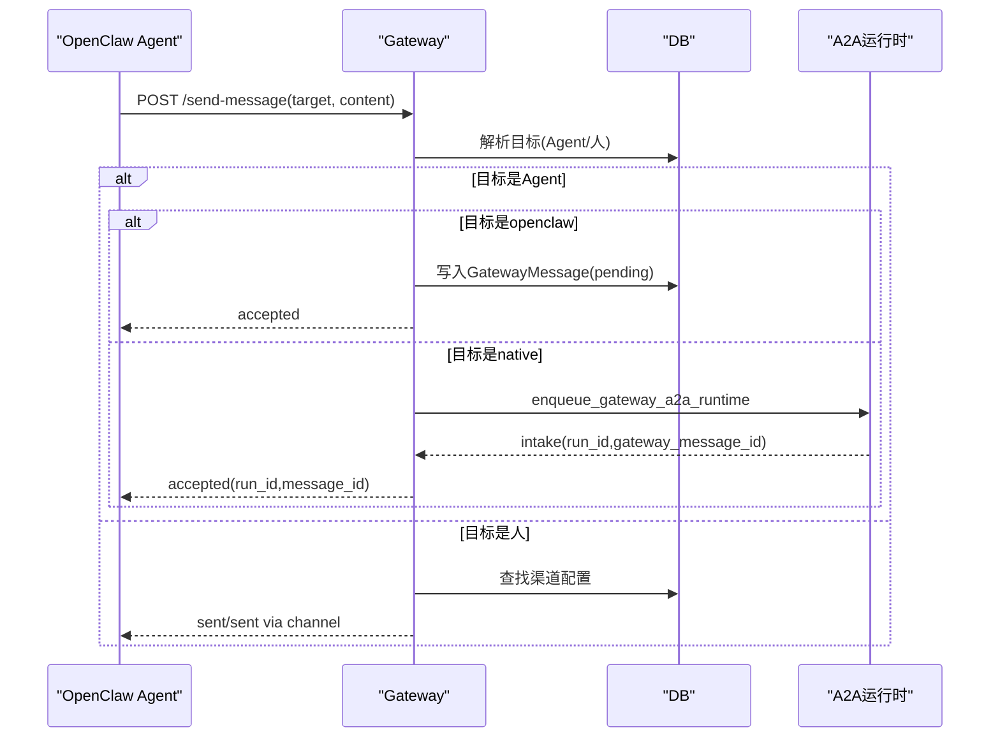
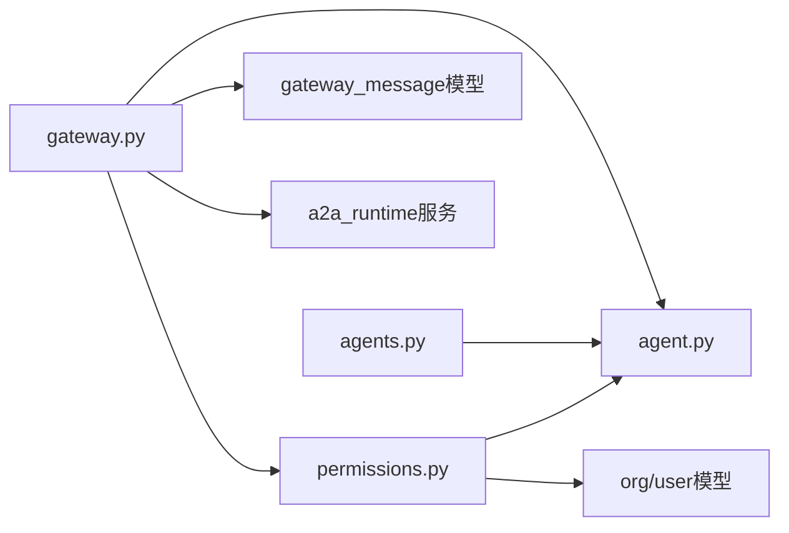

# 认证授权机制

<cite>
**本文引用的文件**   
- [backend/app/api/gateway.py](file://backend/app/api/gateway.py)
- [backend/app/api/agents.py](file://backend/app/api/agents.py)
- [backend/app/core/permissions.py](file://backend/app/core/permissions.py)
- [backend/app/models/agent.py](file://backend/app/models/agent.py)
- [backend/app/services/audit_logger.py](file://backend/app/services/audit_logger.py)
</cite>

## 目录
1. [简介](#简介)
2. [项目结构](#项目结构)
3. [核心组件](#核心组件)
4. [架构总览](#架构总览)
5. [详细组件分析](#详细组件分析)
6. [依赖关系分析](#依赖关系分析)
7. [性能考虑](#性能考虑)
8. [故障排查指南](#故障排查指南)
9. [结论](#结论)
10. [附录](#附录)

## 简介
本文件面向Clawith平台的API网关认证与授权机制，重点说明OpenClaw Agent通过X-Api-Key头部进行认证的完整流程，包括密钥生成、验证、哈希存储、后向兼容（明文与哈希并存）、权限检查（租户隔离、Agent类型校验、访问控制策略），以及失败处理与安全最佳实践。同时涵盖密钥轮换、安全存储与审计日志的实现要点，帮助开发者与运维人员正确部署与维护该能力。

## 项目结构
与认证授权相关的关键代码集中在后端模块：
- API网关入口与路由：gateway.py
- OpenClaw Agent密钥管理接口：agents.py
- 权限与访问控制逻辑：permissions.py
- Agent数据模型（含api_key_hash字段）：agent.py
- 审计日志写入工具：audit_logger.py

图表来源 
- [backend/app/api/gateway.py:1-712](file://backend/app/api/gateway.py#L1-L712)
- [backend/app/api/agents.py:1225-1257](file://backend/app/api/agents.py#L1225-L1257)
- [backend/app/core/permissions.py:1-554](file://backend/app/core/permissions.py#L1-L554)
- [backend/app/models/agent.py:1-235](file://backend/app/models/agent.py#L1-L235)
- [backend/app/services/audit_logger.py:1-215](file://backend/app/services/audit_logger.py#L1-L215)

章节来源
- [backend/app/api/gateway.py:1-712](file://backend/app/api/gateway.py#L1-L712)
- [backend/app/api/agents.py:1225-1257](file://backend/app/api/agents.py#L1225-L1257)
- [backend/app/core/permissions.py:1-554](file://backend/app/core/permissions.py#L1-L554)
- [backend/app/models/agent.py:1-235](file://backend/app/models/agent.py#L1-L235)
- [backend/app/services/audit_logger.py:1-215](file://backend/app/services/audit_logger.py#L1-L215)

## 核心组件
- X-Api-Key认证入口
  - 所有网关端点均要求携带X-Api-Key请求头，未提供或无效将返回401。
  - 认证函数优先按“明文”匹配（新行为），若失败则回退到“哈希”匹配（旧行为），确保向后兼容。
- 密钥生成与管理
  - 仅对openclaw类型的Agent开放密钥生成/重置接口。
  - 生成随机密钥并以SHA-256哈希形式持久化；原始密钥仅在创建时返回一次。
- 权限与访问控制
  - 基于租户隔离（tenant_id）与Agent类型（openclaw/native）。
  - 使用RBAC与关系状态评估（evaluate_agent_relationship_status、evaluate_human_relationship_status）决定可访问性与可见性。
- 审计与日志
  - 提供统一的审计写入工具，便于记录关键操作与事件。

章节来源
- [backend/app/api/gateway.py:38-69](file://backend/app/api/gateway.py#L38-L69)
- [backend/app/api/agents.py:1225-1257](file://backend/app/api/agents.py#L1225-L1257)
- [backend/app/core/permissions.py:1-554](file://backend/app/core/permissions.py#L1-L554)
- [backend/app/models/agent.py:46-52](file://backend/app/models/agent.py#L46-L52)
- [backend/app/services/audit_logger.py:1-215](file://backend/app/services/audit_logger.py#L1-L215)

## 架构总览
下图展示了OpenClaw Agent通过X-Api-Key调用网关的端到端流程，包括认证、鉴权、消息收发与结果回报。

图表来源 
- [backend/app/api/gateway.py:74-224](file://backend/app/api/gateway.py#L74-L224)
- [backend/app/api/gateway.py:229-350](file://backend/app/api/gateway.py#L229-L350)
- [backend/app/core/permissions.py:352-429](file://backend/app/core/permissions.py#L352-L429)

## 详细组件分析

### 组件一：X-Api-Key认证与后向兼容
- 认证流程
  - 从请求头读取X-Api-Key。
  - 先以明文值直接匹配Agent.api_key_hash（新行为）。
  - 若未命中，计算其SHA-256哈希再匹配（旧行为）。
  - 未找到有效Agent则返回401。
- 适用范围
  - 仅对agent_type为openclaw且未被软删除的Agent生效。
- 影响面
  - 支持平滑迁移：旧系统仍可使用哈希密钥，新系统可直接使用明文密钥。

图表来源 
- [backend/app/api/gateway.py:38-69](file://backend/app/api/gateway.py#L38-L69)

章节来源
- [backend/app/api/gateway.py:38-69](file://backend/app/api/gateway.py#L38-L69)

### 组件二：OpenClaw Agent密钥生成与存储
- 生成规则
  - 仅允许openclaw类型Agent生成/重置密钥。
  - 生成格式前缀“oc-”，后接随机字符串。
  - 将原始密钥的SHA-256哈希存入Agent.api_key_hash。
- 返回策略
  - 首次返回原始密钥，后续不再暴露明文。
- 安全建议
  - 客户端应安全存储原始密钥，避免日志泄露。
  - 定期轮换密钥，降低泄露风险。

图表来源 
- [backend/app/models/agent.py:46-52](file://backend/app/models/agent.py#L46-L52)
- [backend/app/api/agents.py:1225-1257](file://backend/app/api/agents.py#L1225-L1257)

章节来源
- [backend/app/api/agents.py:1225-1257](file://backend/app/api/agents.py#L1225-L1257)
- [backend/app/models/agent.py:46-52](file://backend/app/models/agent.py#L46-L52)

### 组件三：权限检查与访问控制策略
- 租户隔离
  - 所有访问均需满足source与target的tenant_id一致。
- Agent类型与状态
  - 仅当目标Agent为openclaw且未被软删除时，才允许特定交互。
- 关系与可见性
  - evaluate_agent_relationship_status：评估Agent间关系是否active。
  - evaluate_human_relationship_status：评估Agent对人成员的关系是否active。
  - can_auto_contact_company_agent：公司级Agent自动触达规则。
- 用户维度权限
  - can_use_agent/can_manage_agent：基于access_mode与AgentPermission决定use/manage。

图表来源 
- [backend/app/core/permissions.py:149-211](file://backend/app/core/permissions.py#L149-L211)
- [backend/app/core/permissions.py:352-429](file://backend/app/core/permissions.py#L352-L429)
- [backend/app/core/permissions.py:536-554](file://backend/app/core/permissions.py#L536-L554)

章节来源
- [backend/app/core/permissions.py:1-554](file://backend/app/core/permissions.py#L1-L554)

### 组件四：网关消息流转与结果回报
- poll_messages
  - 拉取pending消息，标记为delivered，返回消息与关系目录。
  - 更新Agent在线状态(openclaw_last_seen)。
- report_result
  - 幂等校验：已完成的消息不允许不同result覆盖。
  - 将结果写入会话历史，必要时触发A2A运行时完成。
  - 若发送方为openclaw Agent，生成回复消息供下次poll。
- send_message
  - 自动识别目标类型（Agent或人）。
  - 对Agent：直写GatewayMessage或入队A2A运行时。
  - 对人：根据可用渠道（如飞书）投递。

图表来源 
- [backend/app/api/gateway.py:370-576](file://backend/app/api/gateway.py#L370-L576)

章节来源
- [backend/app/api/gateway.py:74-224](file://backend/app/api/gateway.py#L74-L224)
- [backend/app/api/gateway.py:229-350](file://backend/app/api/gateway.py#L229-L350)
- [backend/app/api/gateway.py:370-576](file://backend/app/api/gateway.py#L370-L576)

## 依赖关系分析
- gateway.py依赖
  - permissions.py：关系与可见性评估、自动触达规则。
  - models.agent.Agent：认证与状态更新。
  - models.gateway_message.GatewayMessage：消息持久化。
  - services.a2a_runtime：A2A运行时的入队与完成。
- agents.py依赖
  - models.agent.Agent：写入api_key_hash。
- permissions.py依赖
  - models.agent.Agent、models.org.*、models.user.User：RBAC与关系状态。
- audit_logger.py
  - 通用审计写入，不直接耦合认证链路，但可用于扩展审计。

图表来源 
- [backend/app/api/gateway.py:1-712](file://backend/app/api/gateway.py#L1-L712)
- [backend/app/api/agents.py:1225-1257](file://backend/app/api/agents.py#L1225-L1257)
- [backend/app/core/permissions.py:1-554](file://backend/app/core/permissions.py#L1-L554)
- [backend/app/models/agent.py:1-235](file://backend/app/models/agent.py#L1-L235)

章节来源
- [backend/app/api/gateway.py:1-712](file://backend/app/api/gateway.py#L1-L712)
- [backend/app/api/agents.py:1225-1257](file://backend/app/api/agents.py#L1225-L1257)
- [backend/app/core/permissions.py:1-554](file://backend/app/core/permissions.py#L1-L554)
- [backend/app/models/agent.py:1-235](file://backend/app/models/agent.py#L1-L235)

## 性能考虑
- 认证查询优化
  - 优先明文匹配，减少哈希计算开销；仅在未命中时计算哈希。
  - 建议在api_key_hash上建立索引以提升查询效率。
- 批量操作
  - poll_messages批量标记delivered，减少多次提交。
- 外部调用
  - 发送飞书消息前释放数据库连接，避免长时间持有连接。
- 幂等与重试
  - report_result对已完成消息做幂等校验，避免重复写入与冲突。

[本节为通用指导，无需具体文件引用]

## 故障排查指南
- 常见错误码与原因
  - 401 Invalid API key：X-Api-Key缺失或不匹配（明文/哈希均未命中）。
  - 404 Message not found：report_result中message_id不存在或不属于当前Agent。
  - 409 冲突：report_result重复提交且result不一致；或A2A运行时错误。
  - 502/503：外部渠道发送失败或运行时不可用。
- 定位步骤
  - 确认X-Api-Key是否正确传入。
  - 检查Agent.api_key_hash是否为空或过期。
  - 查看GatewayMessage状态与conversation_id一致性。
  - 核对关系状态（evaluate_*_relationship_status）是否active。
- 审计与日志
  - 可通过审计日志工具记录关键动作，便于回溯问题。

章节来源
- [backend/app/api/gateway.py:229-350](file://backend/app/api/gateway.py#L229-L350)
- [backend/app/services/audit_logger.py:68-215](file://backend/app/services/audit_logger.py#L68-L215)

## 结论
Clawith平台通过X-Api-Key实现OpenClaw Agent的轻量级认证，结合哈希存储与后向兼容策略，兼顾安全性与迁移成本。权限体系以租户隔离为核心，辅以Agent类型与关系状态评估，确保细粒度的访问控制。配合幂等设计、外部调用优化与审计日志，形成稳定可靠的网关认证授权闭环。建议在生产环境中启用密钥轮换、最小权限原则与完善的监控告警，持续提升安全性与可观测性。

[本节为总结性内容，无需具体文件引用]

## 附录
- 安全最佳实践
  - 密钥轮换：定期重置OpenClaw Agent密钥，避免长期有效。
  - 安全存储：客户端侧加密存储原始密钥，禁止打印或落盘明文。
  - 最小权限：仅授予必要的Agent使用/管理权限。
  - 传输安全：强制HTTPS，避免中间人攻击。
  - 审计追踪：记录认证失败、密钥变更与敏感操作。
- 密钥轮换流程建议
  - 生成新密钥并写入数据库。
  - 客户端逐步切换至新密钥。
  - 观察一段时间无异常后，清理旧密钥（如需）。

[本节为通用指导，无需具体文件引用]