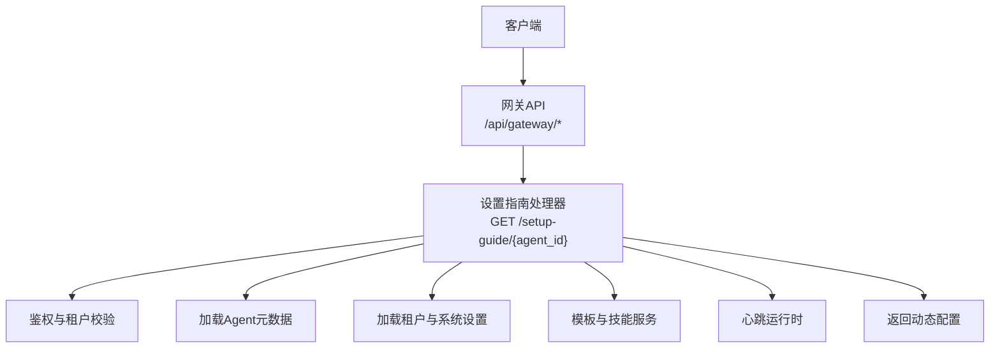
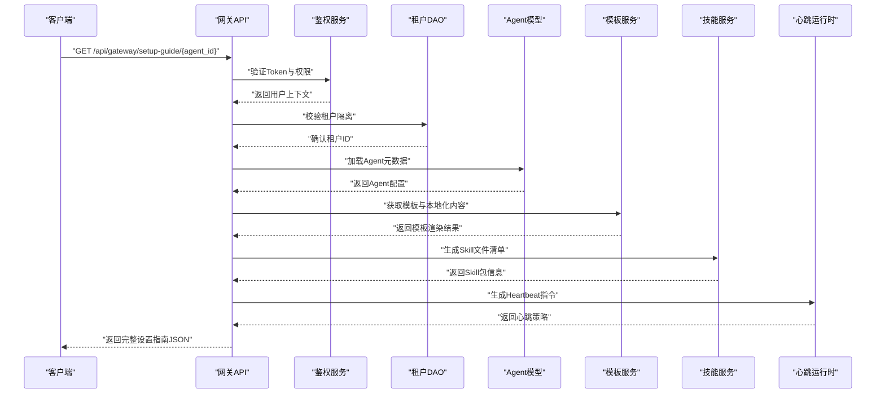
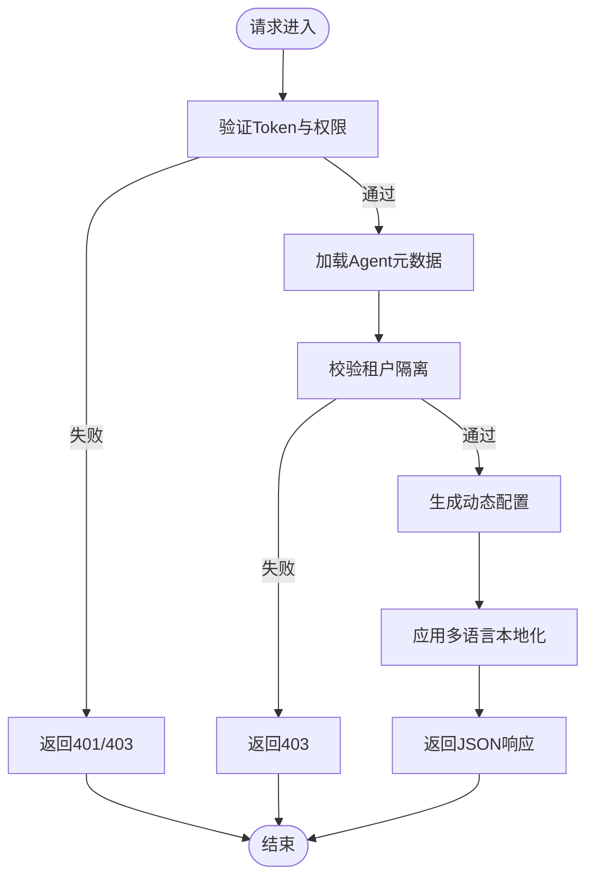
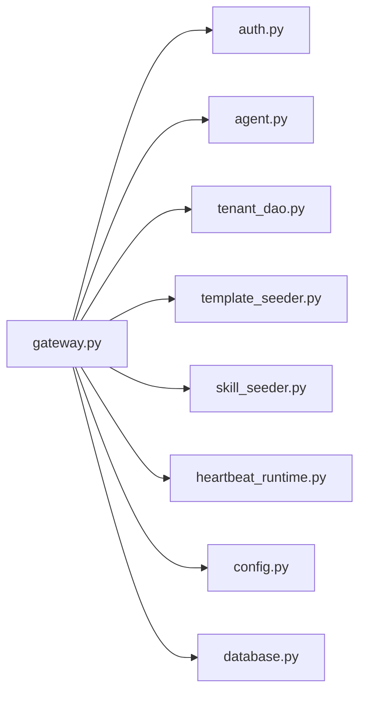

# 设置指南接口

<cite>
**本文引用的文件**   
- [gateway.py](file://backend/app/api/gateway.py)
- [agents.py](file://backend/app/api/agents.py)
- [agent.py](file://backend/app/models/agent.py)
- [gateway_message.py](file://backend/app/models/gateway_message.py)
- [auth.py](file://backend/app/api/auth.py)
- [security.py](file://backend/app/core/security.py)
- [middleware.py](file://backend/app/core/middleware.py)
- [config.py](file://backend/app/config.py)
- [database.py](file://backend/app/database.py)
- [template_seeder.py](file://backend/app/services/template_seeder.py)
- [skill_seeder.py](file://backend/app/services/skill_seeder.py)
- [heartbeat_runtime.py](file://backend/app/services/heartbeat_runtime.py)
- [heartbeat_completion.py](file://backend/app/services/agent_runtime/heartbeat_completion.py)
- [tenant_dao.py](file://backend/app/dao/tenant_dao.py)
- [system_setting_dao.py](file://backend/app/dao/system_setting_dao.py)
- [openClawInstruction.ts](file://frontend/src/utils/openClawInstruction.ts)
- [CustomAgentModal.tsx](file://frontend/src/components/CustomAgentModal.tsx)
</cite>

## 目录
1. [简介](#简介)
2. [项目结构](#项目结构)
3. [核心组件](#核心组件)
4. [架构总览](#架构总览)
5. [详细组件分析](#详细组件分析)
6. [依赖分析](#依赖分析)
7. [性能考虑](#性能考虑)
8. [故障排查指南](#故障排查指南)
9. [结论](#结论)
10. [附录](#附录)

## 简介
本文件为 Clawith 平台的“设置指南”接口提供完整 API 文档，聚焦 GET /api/gateway/setup-guide/{agent_id} 端点。该端点用于根据 Agent 上下文动态生成初始化与运行所需的配置信息，包括：
- 动态配置生成：基于 Agent、租户、系统设置与运行时能力，组装客户端所需的全量引导配置。
- 多语言支持：按当前语言环境返回本地化的说明文案与模板内容。
- 模板定制：结合内置模板与租户级覆盖，输出可定制的 Skill 文件与 Heartbeat 指令。
- 安全与隔离：严格校验访问权限与租户边界，确保跨租户数据隔离。
- 版本兼容：对前端与后端契约进行版本化适配，保证平滑升级。

## 项目结构
与“设置指南”相关的代码主要分布在以下模块：
- API 路由层：网关相关路由定义与请求处理
- 模型与 DAO：Agent、GatewayMessage、租户与系统设置等数据访问
- 服务层：模板与技能种子、心跳运行时、认证与安全中间件
- 前端集成：OpenClaw 指令构建与自定义 Agent 模态框

图表来源
- [gateway.py:581-620](file://backend/app/api/gateway.py#L581-L620)
- [auth.py:46-50](file://backend/app/api/auth.py#L46-L50)
- [agent.py:42-64](file://backend/app/models/agent.py#L42-L64)
- [tenant_dao.py](file://backend/app/dao/tenant_dao.py)
- [system_setting_dao.py](file://backend/app/dao/system_setting_dao.py)
- [template_seeder.py](file://backend/app/services/template_seeder.py)
- [skill_seeder.py](file://backend/app/services/skill_seeder.py)
- [heartbeat_runtime.py](file://backend/app/services/heartbeat_runtime.py)

章节来源
- [gateway.py:581-620](file://backend/app/api/gateway.py#L581-L620)
- [agents.py:1248-1260](file://backend/app/api/agents.py#L1248-L1260)
- [agent.py:42-64](file://backend/app/models/agent.py#L42-L64)

## 核心组件
- 设置指南处理器（GET /api/gateway/setup-guide/{agent_id}）
  - 输入：路径参数 agent_id；可选查询参数如语言、版本标识等
  - 处理流程：鉴权 → 租户隔离 → 读取 Agent 元数据 → 聚合模板与技能 → 生成 Heartbeat 指令 → 组装响应
  - 输出：包含连接信息、Skill 清单、Heartbeat 指令、国际化文案、版本兼容性字段等的 JSON 配置对象
- 鉴权与安全中间件
  - 使用 Bearer Token 验证用户身份与权限
  - 强制租户边界检查，防止越权访问其他租户资源
- 模板与技能服务
  - 从内置模板与租户覆盖中解析并渲染模板
  - 生成 Skill 文件清单与安装脚本
- 心跳运行时
  - 根据 Agent 能力与运行环境生成 Heartbeat 指令与调度策略

章节来源
- [gateway.py:581-620](file://backend/app/api/gateway.py#L581-L620)
- [auth.py:46-50](file://backend/app/api/auth.py#L46-L50)
- [security.py](file://backend/app/core/security.py)
- [middleware.py](file://backend/app/core/middleware.py)
- [template_seeder.py](file://backend/app/services/template_seeder.py)
- [skill_seeder.py](file://backend/app/services/skill_seeder.py)
- [heartbeat_runtime.py](file://backend/app/services/heartbeat_runtime.py)

## 架构总览
下图展示了设置指南接口的端到端调用链路与关键依赖关系。

图表来源
- [gateway.py:581-620](file://backend/app/api/gateway.py#L581-L620)
- [auth.py:46-50](file://backend/app/api/auth.py#L46-L50)
- [tenant_dao.py](file://backend/app/dao/tenant_dao.py)
- [agent.py:42-64](file://backend/app/models/agent.py#L42-L64)
- [template_seeder.py](file://backend/app/services/template_seeder.py)
- [skill_seeder.py](file://backend/app/services/skill_seeder.py)
- [heartbeat_runtime.py](file://backend/app/services/heartbeat_runtime.py)

## 详细组件分析

### 设置指南处理器（GET /api/gateway/setup-guide/{agent_id}）
- 功能要点
  - 动态配置生成：根据 Agent 的模型、工具、渠道、权限等属性，组合出客户端可直接使用的配置对象
  - 多语言支持：依据请求头或查询参数中的语言标识，返回对应语言的文案与模板内容
  - 模板定制：优先使用租户级覆盖模板，回退到平台默认模板
  - 安全限制：仅允许 Agent 创建者或具备管理权限的用户访问
  - 租户隔离：所有数据读取均绑定当前租户 ID，禁止跨租户访问
- 输入参数
  - 路径参数：agent_id（UUID）
  - 查询参数：lang（可选，如 zh-CN、en-US）、version（可选，用于版本兼容）
- 输出结构（示例字段）
  - connection：网关连接信息（URL、鉴权方式）
  - skills：Skill 清单与安装脚本
  - heartbeat：心跳指令与调度策略
  - i18n：本地化文案映射
  - version：服务端支持的协议版本与兼容性矩阵
- 错误码
  - 401：未授权或 Token 无效
  - 403：无权限访问该 Agent
  - 404：Agent 不存在或已删除
  - 500：内部服务器错误

图表来源
- [gateway.py:581-620](file://backend/app/api/gateway.py#L581-L620)
- [auth.py:46-50](file://backend/app/api/auth.py#L46-L50)
- [agent.py:42-64](file://backend/app/models/agent.py#L42-L64)

章节来源
- [gateway.py:581-620](file://backend/app/api/gateway.py#L581-L620)
- [agents.py:1248-1260](file://backend/app/api/agents.py#L1248-L1260)

### 鉴权与安全中间件
- 实现机制
  - 使用 Bearer Token 进行身份验证
  - 通过中间件注入当前用户与租户上下文
  - 针对 Agent 资源的访问控制基于创建者与角色权限
- 安全限制
  - 禁止直接访问非本租户的 Agent
  - 敏感配置（如 API Key）仅在受信任上下文中返回
- 错误处理
  - 统一抛出 HTTP 异常，便于前端捕获与提示

章节来源
- [auth.py:46-50](file://backend/app/api/auth.py#L46-L50)
- [security.py](file://backend/app/core/security.py)
- [middleware.py](file://backend/app/core/middleware.py)

### 模板与技能服务
- 模板渲染
  - 从 template_seeder 加载内置模板与租户覆盖
  - 支持变量替换与条件分支
- 技能生成
  - 基于 skill_seeder 生成 SKILL.md 与安装脚本
  - 支持多语言描述与能力清单
- 缓存策略
  - 模板与技能清单可按租户缓存，减少重复渲染开销

章节来源
- [template_seeder.py](file://backend/app/services/template_seeder.py)
- [skill_seeder.py](file://backend/app/services/skill_seeder.py)

### 心跳运行时
- 指令生成
  - 根据 Agent 的运行模式（native/openclaw）与能力集，生成 Heartbeat 指令
  - 支持定时任务、事件驱动与手动触发
- 兼容性处理
  - 根据客户端版本选择兼容的心跳协议格式

章节来源
- [heartbeat_runtime.py](file://backend/app/services/heartbeat_runtime.py)
- [heartbeat_completion.py](file://backend/app/services/agent_runtime/heartbeat_completion.py)

### 前端集成示例
- OpenClaw 指令构建
  - 使用 openClawInstruction.ts 将后端返回的配置转换为前端可用的指令对象
- 自定义 Agent 模态框
  - CustomAgentModal.tsx 展示设置指南内容并提供交互式配置

章节来源
- [openClawInstruction.ts](file://frontend/src/utils/openClawInstruction.ts)
- [CustomAgentModal.tsx](file://frontend/src/components/CustomAgentModal.tsx)

## 依赖分析
设置指南接口的依赖关系如下：

图表来源
- [gateway.py:581-620](file://backend/app/api/gateway.py#L581-L620)
- [auth.py:46-50](file://backend/app/api/auth.py#L46-L50)
- [agent.py:42-64](file://backend/app/models/agent.py#L42-L64)
- [tenant_dao.py](file://backend/app/dao/tenant_dao.py)
- [template_seeder.py](file://backend/app/services/template_seeder.py)
- [skill_seeder.py](file://backend/app/services/skill_seeder.py)
- [heartbeat_runtime.py](file://backend/app/services/heartbeat_runtime.py)
- [config.py](file://backend/app/config.py)
- [database.py](file://backend/app/database.py)

章节来源
- [gateway.py:581-620](file://backend/app/api/gateway.py#L581-L620)
- [agents.py:1248-1260](file://backend/app/api/agents.py#L1248-L1260)

## 性能考虑
- 缓存优化
  - 模板与技能清单按租户缓存，避免重复渲染
  - 心跳指令可短期缓存，减少频繁计算
- 异步处理
  - 大对象生成（如 Skill 包）采用异步任务，避免阻塞主线程
- 数据库访问
  - 批量加载 Agent 与租户信息，减少 N+1 查询
- 网络传输
  - 启用 gzip 压缩，减少响应体大小

## 故障排查指南
- 常见问题
  - 401 未授权：检查 Token 是否有效且未过期
  - 403 权限不足：确认当前用户是否为 Agent 创建者或具有管理权限
  - 404 资源不存在：验证 agent_id 是否正确且未被删除
  - 500 内部错误：查看服务端日志，定位具体异常堆栈
- 调试建议
  - 启用详细日志记录，追踪请求链路
  - 使用测试环境模拟不同租户与权限场景
  - 检查多语言资源是否完整加载

章节来源
- [auth.py:46-50](file://backend/app/api/auth.py#L46-L50)
- [security.py](file://backend/app/core/security.py)

## 结论
GET /api/gateway/setup-guide/{agent_id} 是 Clawith 平台的核心配置接口，通过动态生成、多语言支持与模板定制，为客户端提供完整的初始化与运行配置。其设计充分考虑了安全性、租户隔离与性能优化，并通过清晰的依赖关系与错误处理机制，确保了系统的稳定与可扩展性。

## 附录
- 版本兼容性
  - 建议在请求中携带 version 参数，以便服务端返回兼容的配置格式
- 扩展点
  - 可通过自定义模板与服务扩展，满足特定业务需求
- 最佳实践
  - 前端应缓存设置指南结果，减少重复请求
  - 定期更新客户端以适配新的配置字段与协议版本