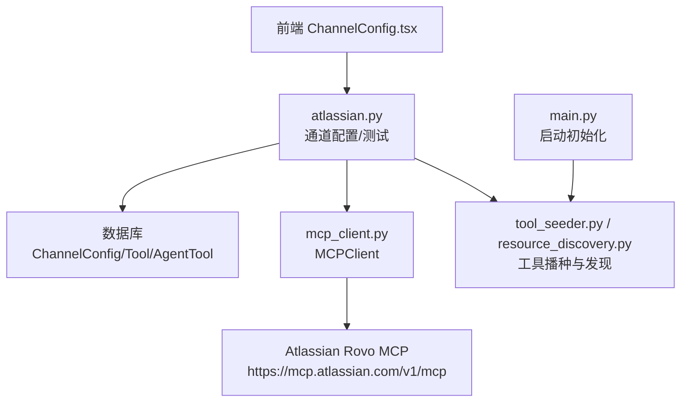
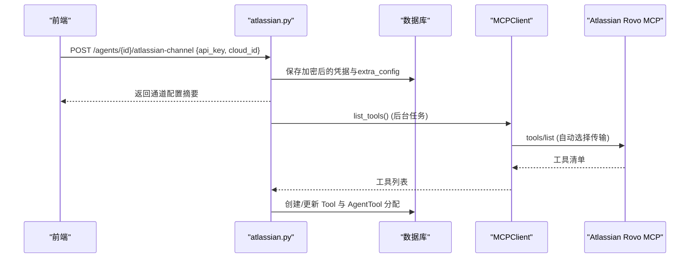
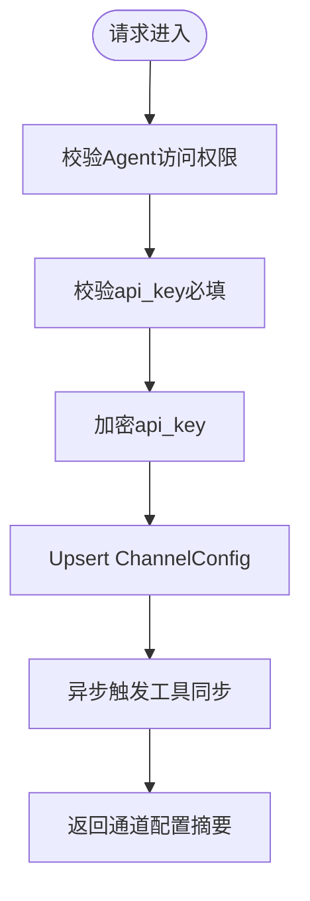
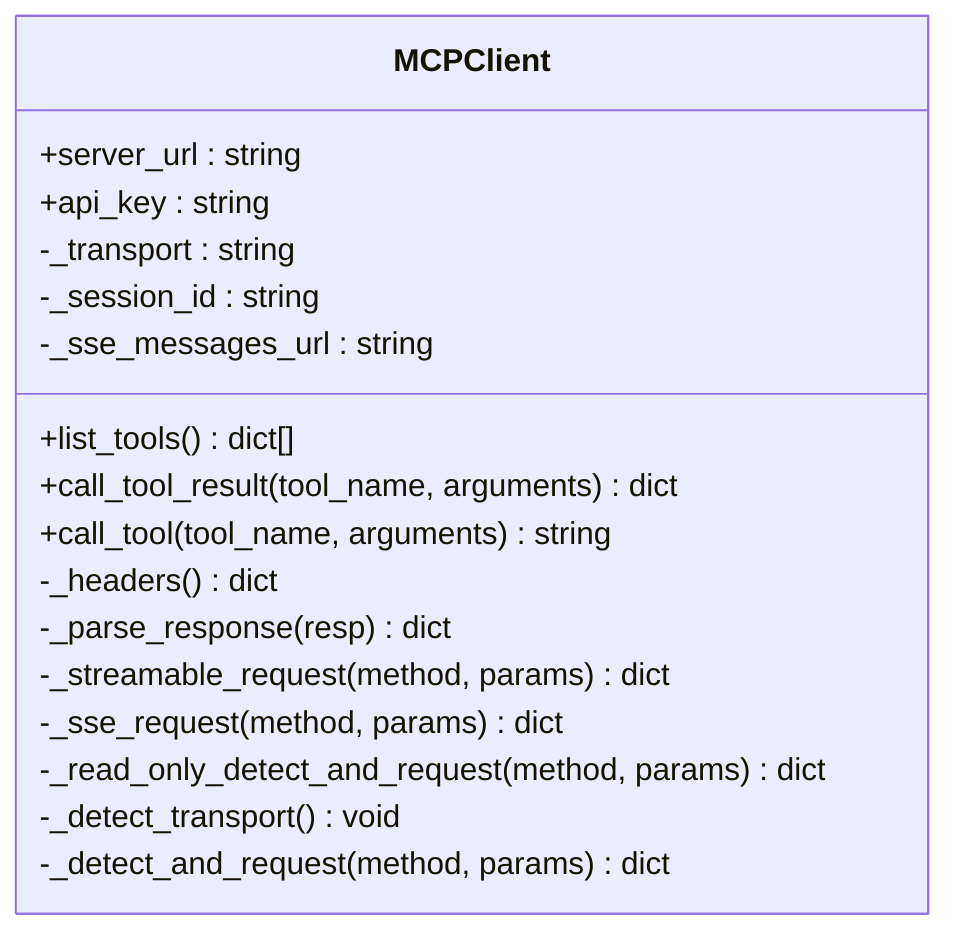
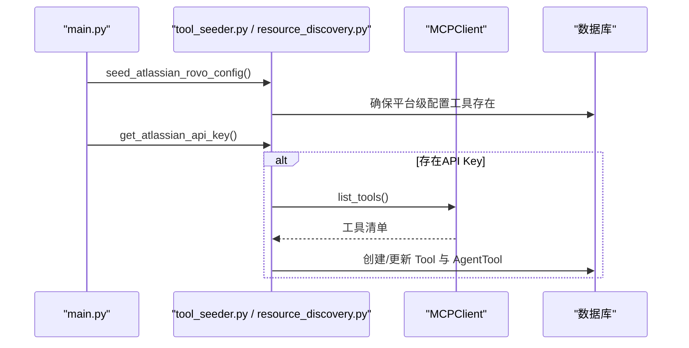
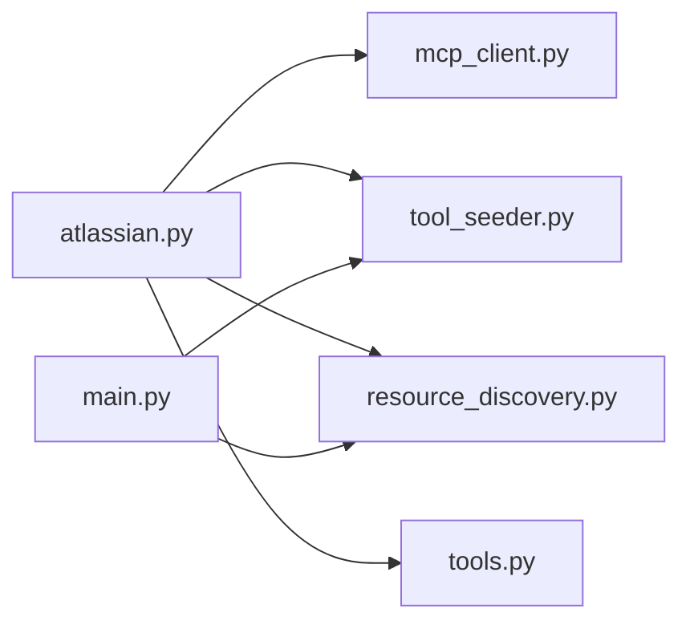

# Atlassian集成接口

<cite>
**本文引用的文件**   
- [backend/app/api/atlassian.py](file://backend/app/api/atlassian.py)
- [backend/app/services/mcp_client.py](file://backend/app/services/mcp_client.py)
- [backend/app/services/tool_seeder.py](file://backend/app/services/tool_seeder.py)
- [backend/app/services/resource_discovery.py](file://backend/app/services/resource_discovery.py)
- [backend/app/api/tools.py](file://backend/app/api/tools.py)
- [backend/app/main.py](file://backend/app/main.py)
- [backend/app/core/error_contract.py](file://backend/app/core/error_contract.py)
- [frontend/src/components/ChannelConfig.tsx](file://frontend/src/components/ChannelConfig.tsx)
</cite>

## 目录
1. [简介](#简介)
2. [项目结构](#项目结构)
3. [核心组件](#核心组件)
4. [架构总览](#架构总览)
5. [详细组件分析](#详细组件分析)
6. [依赖关系分析](#依赖关系分析)
7. [性能考虑](#性能考虑)
8. [故障排查指南](#故障排查指南)
9. [结论](#结论)
10. [附录](#附录)

## 简介
本文件面向Clawith平台与Atlassian生态（Jira、Confluence、Compass等）的集成接口，聚焦以下目标：
- 通过Atlassian Rovo MCP Server实现统一的工具访问能力，避免直接对接各服务原生API带来的碎片化。
- 提供Agent维度的通道配置、连通性测试、工具发现与分配流程。
- 说明认证方式（Bearer/Basic）、MCP传输自动探测（Streamable HTTP/SSE）、错误处理与重试策略。
- 给出运维建议（连接池、超时、幂等、增量同步思路）及前端配置要点。

说明：当前仓库未包含传统OAuth2授权码流程；Atlassian认证以API Key为主（支持Bearer或Basic）。如需OAuth2，可在上层网关或代理层扩展。

## 项目结构
与Atlassian集成相关的后端代码主要分布在：
- API路由：按Agent维度暴露Atlassian通道配置与测试接口
- MCP客户端：封装与Atlassian Rovo MCP的通信（自动选择传输模式）
- 工具播种与资源发现：启动时或按需将MCP工具映射为平台工具并分配给Agent
- 错误契约：统一HTTP错误响应格式与追踪ID

图表来源
- [backend/app/api/atlassian.py:1-35](file://backend/app/api/atlassian.py#L1-L35)
- [backend/app/services/mcp_client.py:1-12](file://backend/app/services/mcp_client.py#L1-L12)
- [backend/app/services/tool_seeder.py:405-441](file://backend/app/services/tool_seeder.py#L405-L441)
- [backend/app/services/resource_discovery.py:1154-1182](file://backend/app/services/resource_discovery.py#L1154-L1182)
- [backend/app/main.py:234-267](file://backend/app/main.py#L234-L267)

章节来源
- [backend/app/api/atlassian.py:1-35](file://backend/app/api/atlassian.py#L1-L35)
- [backend/app/services/mcp_client.py:1-12](file://backend/app/services/mcp_client.py#L1-L12)
- [backend/app/services/tool_seeder.py:405-441](file://backend/app/services/tool_seeder.py#L405-L441)
- [backend/app/services/resource_discovery.py:1154-1182](file://backend/app/services/resource_discovery.py#L1154-L1182)
- [backend/app/main.py:234-267](file://backend/app/main.py#L234-L267)

## 核心组件
- Atlassian通道API（per-Agent）
  - 配置通道：POST /agents/{agent_id}/atlassian-channel
  - 查询通道：GET /agents/{agent_id}/atlassian-channel
  - 删除通道：DELETE /agents/{agent_id}/atlassian-channel
  - 连通性测试：POST /agents/{agent_id}/atlassian-channel/test
- MCP客户端
  - 自动探测传输（Streamable HTTP优先，回退SSE）
  - 工具列表获取与调用封装
- 工具播种与资源发现
  - 启动时根据全局API Key导入Atlassian Rovo工具
  - Agent级通道配置后异步同步工具并分配至Agent
- 错误契约
  - 统一错误对象、Trace ID、可重试标记

章节来源
- [backend/app/api/atlassian.py:28-158](file://backend/app/api/atlassian.py#L28-L158)
- [backend/app/services/mcp_client.py:24-118](file://backend/app/services/mcp_client.py#L24-L118)
- [backend/app/services/tool_seeder.py:405-441](file://backend/app/services/tool_seeder.py#L405-L441)
- [backend/app/services/resource_discovery.py:1154-1182](file://backend/app/services/resource_discovery.py#L1154-L1182)
- [backend/app/core/error_contract.py:1-60](file://backend/app/core/error_contract.py#L1-L60)

## 架构总览
Atlassian集成采用“通道+MCP”的模式：
- 通道层：为每个Agent维护Atlassian凭据（加密存储），并提供配置/测试接口
- MCP层：通过MCPClient与Atlassian Rovo MCP交互，自动选择最佳传输
- 工具层：将MCP工具映射为平台工具，按需分配给Agent执行

图表来源
- [backend/app/api/atlassian.py:28-86](file://backend/app/api/atlassian.py#L28-L86)
- [backend/app/services/mcp_client.py:342-364](file://backend/app/services/mcp_client.py#L342-L364)
- [backend/app/api/atlassian.py:178-273](file://backend/app/api/atlassian.py#L178-L273)

## 详细组件分析

### Atlassian通道API
- 功能要点
  - 仅通道创建者可配置/删除
  - api_key必填，cloud_id可选（多站点场景）
  - 凭据加密存储，extra_config合并保留
  - 配置成功后异步触发工具同步
  - 测试接口用于连通性与工具数量校验
- 关键行为
  - 若已存在记录则更新app_secret与extra_config
  - 新建记录时设置is_configured=true
  - 后台任务调用MCPClient.list_tools并分配工具

图表来源
- [backend/app/api/atlassian.py:28-86](file://backend/app/api/atlassian.py#L28-L86)
- [backend/app/api/atlassian.py:178-273](file://backend/app/api/atlassian.py#L178-L273)

章节来源
- [backend/app/api/atlassian.py:28-158](file://backend/app/api/atlassian.py#L28-L158)

### MCP客户端（MCPClient）
- 传输自动探测
  - 先尝试Streamable HTTP（initialize + initialized + JSON-RPC）
  - 失败回退SSE（GET /sse获取endpoint，POST /messages发送请求，SSE读取响应）
- 鉴权
  - 从URL参数提取apiKey并移至Authorization头
  - 支持在构造时传入api_key
- 工具调用
  - list_tools：返回工具名、描述、输入Schema
  - call_tool_result：返回完整JSON-RPC结果
  - call_tool：文本适配，兼容旧调用方

图表来源
- [backend/app/services/mcp_client.py:24-118](file://backend/app/services/mcp_client.py#L24-L118)
- [backend/app/services/mcp_client.py:342-411](file://backend/app/services/mcp_client.py#L342-L411)

章节来源
- [backend/app/services/mcp_client.py:24-118](file://backend/app/services/mcp_client.py#L24-L118)
- [backend/app/services/mcp_client.py:342-411](file://backend/app/services/mcp_client.py#L342-L411)

### 工具播种与资源发现
- 启动阶段
  - 若存在全局Atlassian API Key，则连接MCP并导入工具到平台
  - 已存在工具会就地更新，新增工具创建并分配
- Agent级通道配置后
  - 异步拉取工具清单，确保Tool存在并按需创建AgentTool分配
  - 将api_key写入AgentTool.config以便执行时使用

图表来源
- [backend/app/main.py:234-267](file://backend/app/main.py#L234-L267)
- [backend/app/services/tool_seeder.py:405-441](file://backend/app/services/tool_seeder.py#L405-L441)
- [backend/app/services/resource_discovery.py:1154-1182](file://backend/app/services/resource_discovery.py#L1154-L1182)

章节来源
- [backend/app/services/tool_seeder.py:405-441](file://backend/app/services/tool_seeder.py#L405-L441)
- [backend/app/services/resource_discovery.py:1154-1182](file://backend/app/services/resource_discovery.py#L1154-L1182)
- [backend/app/main.py:234-267](file://backend/app/main.py#L234-L267)

### 通用工具配置入口（tools.py）
- 对category=atlassian的特殊处理
  - 保存凭据与extra_config
  - 使用明文key触发Atlassian工具同步（后台任务）

章节来源
- [backend/app/api/tools.py:1075-1109](file://backend/app/api/tools.py#L1075-L1109)

### 前端通道配置（ChannelConfig.tsx）
- Atlassian字段提示
  - api_key：服务账号密钥（ATSTT...）或Basic base64(email:token)
  - cloud_id：多站点场景需要，可从tenant_info端点获取
- 状态展示
  - 显示是否已配置API Key以及Cloud ID

章节来源
- [frontend/src/components/ChannelConfig.tsx:1012-1190](file://frontend/src/components/ChannelConfig.tsx#L1012-L1190)

## 依赖关系分析
- atlassian.py依赖
  - 权限与安全：check_agent_access、get_current_user、encrypt_data
  - 数据库：ChannelConfig模型、异步会话
  - MCP客户端：MCPClient（工具发现与调用）
  - 工具模型：Tool、AgentTool（工具播种与分配）
- mcp_client.py依赖
  - httpx异步HTTP客户端
  - JSON-RPC协议与SSE事件解析
- tool_seeder.py/resource_discovery.py依赖
  - MCPClient、数据库会话、工具模型
- main.py依赖
  - 启动时调用工具播种与清理逻辑

图表来源
- [backend/app/api/atlassian.py:1-35](file://backend/app/api/atlassian.py#L1-L35)
- [backend/app/services/mcp_client.py:1-12](file://backend/app/services/mcp_client.py#L1-L12)
- [backend/app/services/tool_seeder.py:405-441](file://backend/app/services/tool_seeder.py#L405-L441)
- [backend/app/services/resource_discovery.py:1154-1182](file://backend/app/services/resource_discovery.py#L1154-L1182)
- [backend/app/main.py:234-267](file://backend/app/main.py#L234-L267)
- [backend/app/api/tools.py:1075-1109](file://backend/app/api/tools.py#L1075-L1109)

章节来源
- [backend/app/api/atlassian.py:1-35](file://backend/app/api/atlassian.py#L1-L35)
- [backend/app/services/mcp_client.py:1-12](file://backend/app/services/mcp_client.py#L1-L12)
- [backend/app/services/tool_seeder.py:405-441](file://backend/app/services/tool_seeder.py#L405-L441)
- [backend/app/services/resource_discovery.py:1154-1182](file://backend/app/services/resource_discovery.py#L1154-L1182)
- [backend/app/main.py:234-267](file://backend/app/main.py#L234-L267)
- [backend/app/api/tools.py:1075-1109](file://backend/app/api/tools.py#L1075-L1109)

## 性能考虑
- 传输选择与连接复用
  - Streamable HTTP优先，减少握手开销；SSE作为回退
  - 首次探测后缓存传输类型，避免重复探测
- 超时与重试
  - 工具调用默认较长超时（如tools/call），其他请求较短超时
  - 网络异常与未知响应归类为unknown状态，便于上层重试或补偿
- 数据库操作
  - 工具播种与分配使用异步会话批量提交，降低锁竞争
- 日志与追踪
  - 统一错误对象含trace_id，便于定位问题

[本节为通用指导，不直接分析具体文件]

## 故障排查指南
- 常见错误
  - 未配置通道：测试接口返回未配置错误
  - 认证失败：检查api_key是否为有效的Bearer或Basic格式
  - 传输不可用：Streamable与SSE均失败时会抛出探测异常
- 排查步骤
  - 使用测试接口验证连通性与工具数量
  - 查看日志中的trace_id与错误码
  - 确认数据库ChannelConfig与AgentTool分配是否正确
- 错误契约
  - 所有HTTP错误统一包装error对象，包含code、message、trace_id、retryable等字段

章节来源
- [backend/app/api/atlassian.py:129-158](file://backend/app/api/atlassian.py#L129-L158)
- [backend/app/core/error_contract.py:158-229](file://backend/app/core/error_contract.py#L158-L229)

## 结论
Clawith通过Atlassian Rovo MCP实现了统一的工具接入能力，避免了直接对接各服务的复杂性。通道层负责凭据管理与工具分配，MCP层负责传输自适应与协议封装，工具播种保障平台工具的一致性。结合统一错误契约与可观测性，系统具备良好的可维护性与可扩展性。

[本节为总结，不直接分析具体文件]

## 附录

### API定义（Atlassian通道）
- POST /agents/{agent_id}/atlassian-channel
  - 作用：配置Atlassian通道（api_key必填，cloud_id可选）
  - 成功：返回通道配置摘要
  - 失败：403/422/404等
- GET /agents/{agent_id}/atlassian-channel
  - 作用：查询通道配置
- DELETE /agents/{agent_id}/atlassian-channel
  - 作用：删除通道配置
- POST /agents/{agent_id}/atlassian-channel/test
  - 作用：连通性测试，返回工具数量与前若干工具名称

章节来源
- [backend/app/api/atlassian.py:28-158](file://backend/app/api/atlassian.py#L28-L158)

### 数据映射规则（MCP工具→平台工具）
- 工具名：atlassian_rovo_{raw_name}
- 图标：根据名称关键字匹配（jira/issue→蓝色，confluence/page→蓝色书，compass/component→指南针）
- Schema：直接使用MCP返回的inputSchema
- 分配：为每个Agent创建AgentTool记录，config中保存api_key

章节来源
- [backend/app/api/atlassian.py:178-273](file://backend/app/api/atlassian.py#L178-L273)

### 冲突解决策略（工具播种）
- 已存在工具：就地更新描述与Schema
- 新增工具：创建Tool并分配至Agent
- 无工具返回：记录警告并跳过

章节来源
- [backend/app/services/resource_discovery.py:1154-1182](file://backend/app/services/resource_discovery.py#L1154-L1182)

### 增量同步机制（建议）
- 基于MCP工具清单差异进行增量更新
- 对AgentTool启用/禁用状态进行同步
- 凭据变更时重新触发工具同步

[本节为概念性建议，不直接分析具体文件]

### Python SDK使用示例（概念）
- 初始化MCPClient并列出工具
- 调用工具并处理结果
- 错误处理与重试策略

[本节为概念性示例，不直接分析具体文件]

### 最佳实践
- 使用服务账号密钥（ATSTT...）或Basic base64(email:token)
- 多站点务必配置cloud_id
- 定期测试通道连通性
- 监控工具播种日志与错误契约输出

章节来源
- [frontend/src/components/ChannelConfig.tsx:1175-1190](file://frontend/src/components/ChannelConfig.tsx#L1175-L1190)
- [backend/app/core/error_contract.py:1-60](file://backend/app/core/error_contract.py#L1-L60)