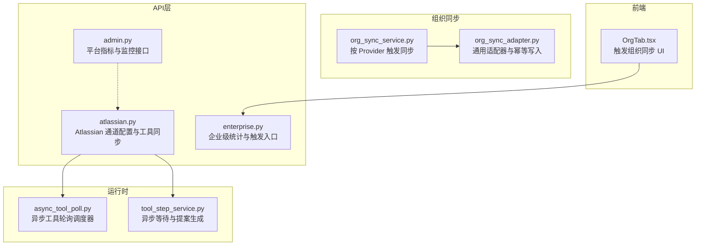
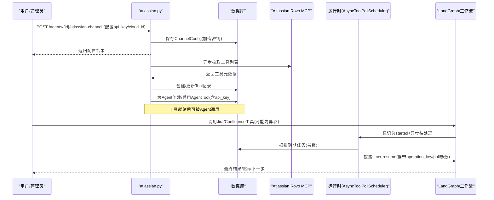
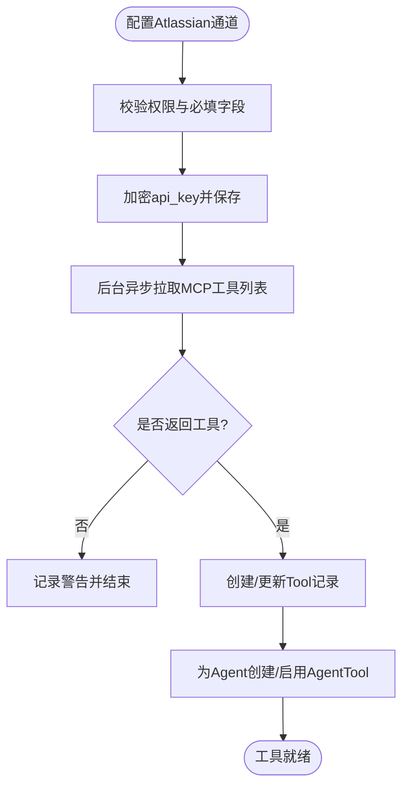
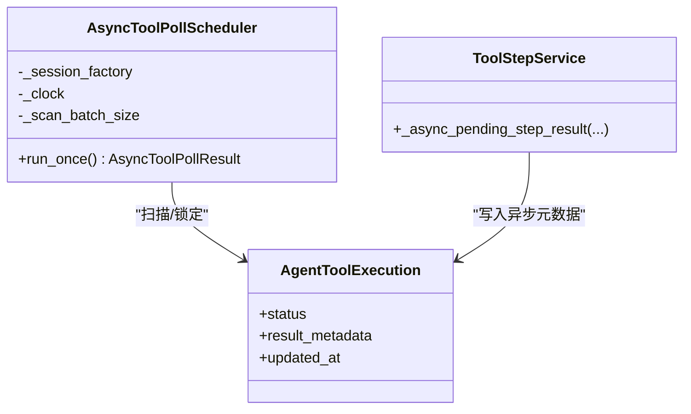
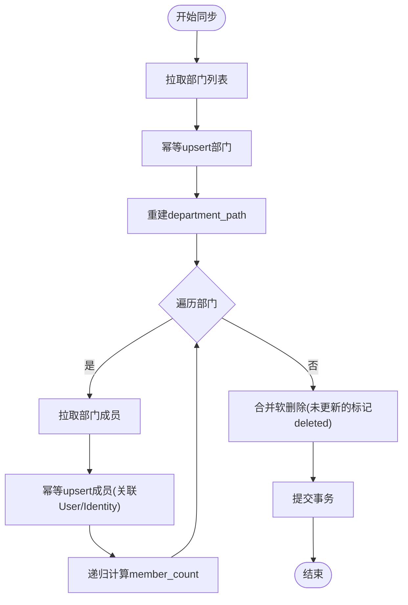
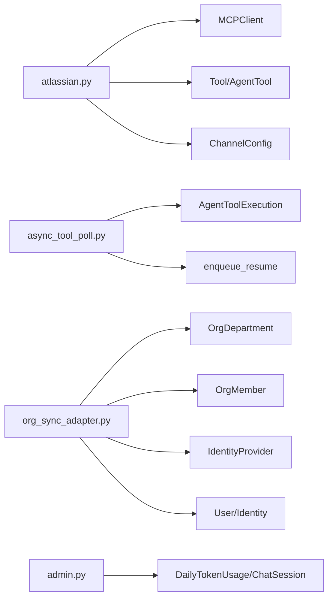

# 同步机制

<cite>
**本文引用的文件**   
- [backend/app/api/atlassian.py](file://backend/app/api/atlassian.py)
- [backend/app/services/agent_runtime/async_tool_poll.py](file://backend/app/services/agent_runtime/async_tool_poll.py)
- [backend/app/services/agent_runtime/tool_step_service.py](file://backend/app/services/agent_runtime/tool_step_service.py)
- [backend/app/services/org_sync_adapter.py](file://backend/app/services/org_sync_adapter.py)
- [backend/app/services/org_sync_service.py](file://backend/app/services/org_sync_service.py)
- [backend/app/api/enterprise.py](file://backend/app/api/enterprise.py)
- [backend/app/core/logging_config.py](file://backend/app/core/logging_config.py)
- [backend/app/api/admin.py](file://backend/app/api/admin.py)
- [frontend/src/pages/enterprise-settings/tabs/OrgTab.tsx](file://frontend/src/pages/enterprise-settings/tabs/OrgTab.tsx)
</cite>

## 目录
1. [简介](#简介)
2. [项目结构](#项目结构)
3. [核心组件](#核心组件)
4. [架构总览](#架构总览)
5. [详细组件分析](#详细组件分析)
6. [依赖关系分析](#依赖关系分析)
7. [性能考量](#性能考量)
8. [故障排查指南](#故障排查指南)
9. [结论](#结论)
10. [附录](#附录)

## 简介
本文件面向 Atlassian 数据同步机制，围绕异步工具同步流程、增量同步策略与冲突解决算法进行系统化说明。重点覆盖：
- 通过 Atlassian Rovo MCP 通道为 Agent 发现并分配 Jira、Confluence、Compass 工具；
- 基于持久化调度的异步轮询（poll）机制，保障长耗时操作的可靠执行与恢复；
- 组织同步（Org Sync）的通用适配器框架与幂等性保证；
- 触发条件、失败重试、数据一致性、监控接口与日志分析实践；
- 性能优化与批量处理最佳实践建议。

## 项目结构
与 Atlassian 同步相关的后端代码主要分布在 API 路由、运行时调度与组织同步适配器等模块中。前端提供企业设置页以触发组织同步。

**图表来源** 
- [backend/app/api/atlassian.py:1-303](file://backend/app/api/atlassian.py#L1-L303)
- [backend/app/services/agent_runtime/async_tool_poll.py:1-239](file://backend/app/services/agent_runtime/async_tool_poll.py#L1-L239)
- [backend/app/services/agent_runtime/tool_step_service.py:356-437](file://backend/app/services/agent_runtime/tool_step_service.py#L356-L437)
- [backend/app/services/org_sync_adapter.py:1-800](file://backend/app/services/org_sync_adapter.py#L1-L800)
- [backend/app/services/org_sync_service.py:1-49](file://backend/app/services/org_sync_service.py#L1-L49)
- [backend/app/api/enterprise.py:1787-1815](file://backend/app/api/enterprise.py#L1787-L1815)
- [frontend/src/pages/enterprise-settings/tabs/OrgTab.tsx:449-482](file://frontend/src/pages/enterprise-settings/tabs/OrgTab.tsx#L449-L482)

**章节来源**
- [backend/app/api/atlassian.py:1-303](file://backend/app/api/atlassian.py#L1-L303)
- [backend/app/services/agent_runtime/async_tool_poll.py:1-239](file://backend/app/services/agent_runtime/async_tool_poll.py#L1-L239)
- [backend/app/services/agent_runtime/tool_step_service.py:356-437](file://backend/app/services/agent_runtime/tool_step_service.py#L356-L437)
- [backend/app/services/org_sync_adapter.py:1-800](file://backend/app/services/org_sync_adapter.py#L1-L800)
- [backend/app/services/org_sync_service.py:1-49](file://backend/app/services/org_sync_service.py#L1-L49)
- [backend/app/api/enterprise.py:1787-1815](file://backend/app/api/enterprise.py#L1787-L1815)
- [frontend/src/pages/enterprise-settings/tabs/OrgTab.tsx:449-482](file://frontend/src/pages/enterprise-settings/tabs/OrgTab.tsx#L449-L482)

## 核心组件
- Atlassian 通道配置与工具同步：提供 REST 接口用于配置 Atlassian Rovo MCP，并在后台异步拉取工具列表，创建或更新 Tool 记录并为指定 Agent 分配。
- 异步工具轮询调度器：将“已启动但未完成”的工具执行转为可恢复的定时任务，确保幂等重放与跨进程恢复。
- 工具步骤服务：在需要外部轮询时生成“等待请求”和“轮询提案”，驱动 LangGraph 状态机继续推进。
- 组织同步适配器：统一的部门/成员同步框架，支持多身份提供商，具备幂等 upsert、路径重建、计数聚合与软删除合并。
- 组织同步服务：按 Provider 触发同步，封装错误与提交事务。
- 企业统计与触发：提供企业统计查询与手动触发组织同步的入口。
- 监控与日志：平台指标接口与集中式日志（trace_id），便于追踪与排障。

**章节来源**
- [backend/app/api/atlassian.py:28-85](file://backend/app/api/atlassian.py#L28-L85)
- [backend/app/services/agent_runtime/async_tool_poll.py:103-233](file://backend/app/services/agent_runtime/async_tool_poll.py#L103-L233)
- [backend/app/services/agent_runtime/tool_step_service.py:356-437](file://backend/app/services/agent_runtime/tool_step_service.py#L356-L437)
- [backend/app/services/org_sync_adapter.py:232-329](file://backend/app/services/org_sync_adapter.py#L232-L329)
- [backend/app/services/org_sync_service.py:14-45](file://backend/app/services/org_sync_service.py#L14-L45)
- [backend/app/api/enterprise.py:1787-1815](file://backend/app/api/enterprise.py#L1787-L1815)
- [backend/app/core/logging_config.py:61-79](file://backend/app/core/logging_config.py#L61-L79)

## 架构总览
下图展示从用户配置到工具可用、再到异步轮询执行的端到端流程。

**图表来源** 
- [backend/app/api/atlassian.py:28-85](file://backend/app/api/atlassian.py#L28-L85)
- [backend/app/api/atlassian.py:178-274](file://backend/app/api/atlassian.py#L178-L274)
- [backend/app/services/agent_runtime/async_tool_poll.py:119-233](file://backend/app/services/agent_runtime/async_tool_poll.py#L119-L233)
- [backend/app/services/agent_runtime/tool_step_service.py:356-437](file://backend/app/services/agent_runtime/tool_step_service.py#L356-L437)

## 详细组件分析

### Atlassian 通道与工具同步
- 功能要点
  - 配置接口校验权限与必填字段，加密存储 api_key，支持 cloud_id。
  - 后台任务连接 Atlassian Rovo MCP，拉取工具列表，去重创建 Tool，并为当前 Agent 分配 AgentTool。
  - 提供测试连通性与工具清单接口。
- 关键实现
  - 配置与保存：见 [backend/app/api/atlassian.py:28-85](file://backend/app/api/atlassian.py#L28-L85)
  - 工具同步逻辑：见 [backend/app/api/atlassian.py:178-274](file://backend/app/api/atlassian.py#L178-L274)
  - 测试连通性：见 [backend/app/api/atlassian.py:129-158](file://backend/app/api/atlassian.py#L129-L158)

**图表来源** 
- [backend/app/api/atlassian.py:28-85](file://backend/app/api/atlassian.py#L28-L85)
- [backend/app/api/atlassian.py:178-274](file://backend/app/api/atlassian.py#L178-L274)

**章节来源**
- [backend/app/api/atlassian.py:28-85](file://backend/app/api/atlassian.py#L28-L85)
- [backend/app/api/atlassian.py:178-274](file://backend/app/api/atlassian.py#L178-L274)
- [backend/app/api/atlassian.py:129-158](file://backend/app/api/atlassian.py#L129-L158)

### 异步工具轮询与恢复
- 设计目标
  - 对声明式异步工具调用，持久化“下次轮询时间”与“轮询参数”，由独立调度器周期性扫描并投递 resume。
  - 使用 idempotency key 避免重复执行，保证幂等。
- 关键实现
  - 轮询调度器：见 [backend/app/services/agent_runtime/async_tool_poll.py:103-233](file://backend/app/services/agent_runtime/async_tool_poll.py#L103-L233)
  - 等待与提案生成：见 [backend/app/services/agent_runtime/tool_step_service.py:356-437](file://backend/app/services/agent_runtime/tool_step_service.py#L356-L437)

**图表来源** 
- [backend/app/services/agent_runtime/async_tool_poll.py:103-233](file://backend/app/services/agent_runtime/async_tool_poll.py#L103-L233)
- [backend/app/services/agent_runtime/tool_step_service.py:356-437](file://backend/app/services/agent_runtime/tool_step_service.py#L356-L437)

**章节来源**
- [backend/app/services/agent_runtime/async_tool_poll.py:103-233](file://backend/app/services/agent_runtime/async_tool_poll.py#L103-L233)
- [backend/app/services/agent_runtime/tool_step_service.py:356-437](file://backend/app/services/agent_runtime/tool_step_service.py#L356-L437)

### 组织同步（Org Sync）适配器与服务
- 能力概览
  - 统一抽象 BaseOrgSyncAdapter，定义获取 Token、拉取部门/成员、upsert 与合并策略。
  - 支持多种身份提供商（如 WeCom、Feishu 等），内部维护 department_path、member_count 等派生字段。
  - OrgSyncService 负责按 provider 触发同步，封装异常与事务提交。
- 关键实现
  - 主同步流程与幂等 upsert：见 [backend/app/services/org_sync_adapter.py:232-329](file://backend/app/services/org_sync_adapter.py#L232-L329)、[backend/app/services/org_sync_adapter.py:453-505](file://backend/app/services/org_sync_adapter.py#L453-L505)、[backend/app/services/org_sync_adapter.py:539-680](file://backend/app/services/org_sync_adapter.py#L539-L680)
  - 路径重建与计数聚合：见 [backend/app/services/org_sync_adapter.py:507-518](file://backend/app/services/org_sync_adapter.py#L507-L518)、[backend/app/services/org_sync_adapter.py:354-416](file://backend/app/services/org_sync_adapter.py#L354-L416)
  - 触发服务：见 [backend/app/services/org_sync_service.py:14-45](file://backend/app/services/org_sync_service.py#L14-L45)

**图表来源** 
- [backend/app/services/org_sync_adapter.py:232-329](file://backend/app/services/org_sync_adapter.py#L232-L329)
- [backend/app/services/org_sync_adapter.py:354-416](file://backend/app/services/org_sync_adapter.py#L354-L416)
- [backend/app/services/org_sync_adapter.py:507-518](file://backend/app/services/org_sync_adapter.py#L507-L518)
- [backend/app/services/org_sync_service.py:14-45](file://backend/app/services/org_sync_service.py#L14-L45)

**章节来源**
- [backend/app/services/org_sync_adapter.py:232-329](file://backend/app/services/org_sync_adapter.py#L232-L329)
- [backend/app/services/org_sync_adapter.py:354-416](file://backend/app/services/org_sync_adapter.py#L354-L416)
- [backend/app/services/org_sync_adapter.py:507-518](file://backend/app/services/org_sync_adapter.py#L507-L518)
- [backend/app/services/org_sync_service.py:14-45](file://backend/app/services/org_sync_service.py#L14-L45)

### 同步触发条件与失败重试
- 触发条件
  - Atlassian 通道：配置成功后立即后台触发工具同步。
  - 组织同步：通过企业设置页面或管理接口手动触发。
- 失败重试
  - 异步工具轮询：基于 due_at 与幂等键，周期扫描并重新投递 resume。
  - 模型调用重试：指数退避+抖动，达到上限后挂起等待人工恢复。
  - 通道投递：指数退避策略，失败不回放图执行，仅重试投递。

**章节来源**
- [backend/app/api/atlassian.py:28-85](file://backend/app/api/atlassian.py#L28-L85)
- [backend/app/api/enterprise.py:1787-1815](file://backend/app/api/enterprise.py#L1787-L1815)
- [backend/app/services/agent_runtime/async_tool_poll.py:119-233](file://backend/app/services/agent_runtime/async_tool_poll.py#L119-L233)
- [backend/app/services/agent_runtime/model_step_service.py:1456-1535](file://backend/app/services/agent_runtime/model_step_service.py#L1456-L1535)
- [backend/app/services/agent_runtime/channel_delivery.py:188-211](file://backend/app/services/agent_runtime/channel_delivery.py#L188-L211)

### 数据一致性保证
- 幂等写入
  - 工具分配：按 tool_name 去重，存在则更新 schema，不存在则新建。
  - 组织数据：按 external_id/open_id/unionid 等多键匹配，避免重复创建。
- 事务与合并
  - 组织同步使用嵌套事务，部分失败不影响整体；最后统一重建路径与计数，再执行合并（软删除）。
- 异步恢复
  - 轮询调度器使用 with_for_update(skip_locked=True) 与 idempotency_key，确保单实例并发安全与幂等。

**章节来源**
- [backend/app/api/atlassian.py:178-274](file://backend/app/api/atlassian.py#L178-L274)
- [backend/app/services/org_sync_adapter.py:232-329](file://backend/app/services/org_sync_adapter.py#L232-L329)
- [backend/app/services/org_sync_adapter.py:539-680](file://backend/app/services/org_sync_adapter.py#L539-L680)
- [backend/app/services/agent_runtime/async_tool_poll.py:119-233](file://backend/app/services/agent_runtime/async_tool_poll.py#L119-L233)

### 监控接口与日志分析
- 监控接口
  - 平台时序指标：GET /api/admin/metrics/timeseries，返回公司、用户、Token、会话、DAU/WAU/MAU 等。
  - 排行榜：GET /api/admin/metrics/leaderboards。
- 日志分析
  - 统一 loguru 输出，包含 trace_id，便于跨进程追踪。
  - 后台任务通过 new_trace_id() 绑定上下文，保证同一任务日志一致。

**章节来源**
- [backend/app/api/admin.py:217-381](file://backend/app/api/admin.py#L217-L381)
- [backend/app/core/logging_config.py:61-79](file://backend/app/core/logging_config.py#L61-L79)
- [backend/app/core/logging_config.py:38-47](file://backend/app/core/logging_config.py#L38-L47)

## 依赖关系分析
- Atlassian 通道依赖 MCPClient 与数据库模型（ChannelConfig、Tool、AgentTool）。
- 异步轮询依赖 AgentToolExecution 表结构与 enqueue_resume 持久化。
- 组织同步依赖 IdentityProvider、OrgDepartment、OrgMember、User、Identity 等模型。
- 监控接口依赖活动日志与聊天会话模型。

**图表来源** 
- [backend/app/api/atlassian.py:178-274](file://backend/app/api/atlassian.py#L178-L274)
- [backend/app/services/agent_runtime/async_tool_poll.py:119-233](file://backend/app/services/agent_runtime/async_tool_poll.py#L119-L233)
- [backend/app/services/org_sync_adapter.py:232-329](file://backend/app/services/org_sync_adapter.py#L232-L329)
- [backend/app/api/admin.py:217-381](file://backend/app/api/admin.py#L217-L381)

**章节来源**
- [backend/app/api/atlassian.py:178-274](file://backend/app/api/atlassian.py#L178-L274)
- [backend/app/services/agent_runtime/async_tool_poll.py:119-233](file://backend/app/services/agent_runtime/async_tool_poll.py#L119-L233)
- [backend/app/services/org_sync_adapter.py:232-329](file://backend/app/services/org_sync_adapter.py#L232-L329)
- [backend/app/api/admin.py:217-381](file://backend/app/api/admin.py#L217-L381)

## 性能考量
- 批量与分页
  - 轮询调度器支持 scan_batch_size 限制单次扫描量，降低锁竞争与内存占用。
  - 组织同步采用批量 upsert 与 SQL 聚合，减少往返次数。
- 并发与锁
  - 使用 with_for_update(skip_locked=True) 避免重复消费；idempotency_key 保证幂等。
- 缓存与降载
  - 平台指标接口通过窗口函数一次性计算 DAU/WAU/MAU，避免多次全表扫描。
- 建议
  - 合理设置轮询间隔与批大小，结合业务峰值调整；
  - 对大对象（如文档内容）采用分块/流式处理；
  - 对高频读场景引入只读副本或缓存层。

[本节为通用指导，无需引用具体文件]

## 故障排查指南
- 常见问题定位
  - Atlassian 工具不可用：检查通道配置是否成功、MCP 连通性测试结果、后台日志中的工具拉取记录。
  - 异步轮询未触发：查看 AgentToolExecution 的 result_metadata 是否包含 async_operation 与 due_at；确认调度器是否运行。
  - 组织同步失败：检查 Provider 配置、网络访问、日志中的 partial_failure 与错误堆栈。
- 日志与追踪
  - 使用 trace_id 串联一次同步全过程；关注 ERROR/WARN 级别日志。
  - 平台指标接口可用于验证系统健康度与趋势变化。

**章节来源**
- [backend/app/api/atlassian.py:129-158](file://backend/app/api/atlassian.py#L129-L158)
- [backend/app/services/agent_runtime/async_tool_poll.py:119-233](file://backend/app/services/agent_runtime/async_tool_poll.py#L119-L233)
- [backend/app/services/org_sync_adapter.py:232-329](file://backend/app/services/org_sync_adapter.py#L232-L329)
- [backend/app/core/logging_config.py:61-79](file://backend/app/core/logging_config.py#L61-L79)
- [backend/app/api/admin.py:217-381](file://backend/app/api/admin.py#L217-L381)

## 结论
本同步机制通过“配置即同步”“持久化轮询”“幂等写入”“事务合并”四大支柱，实现了 Atlassian 工具与组织数据的稳定、可观测、可扩展同步。配合平台指标与集中日志，可在复杂生产环境中快速定位问题并持续优化性能。

[本节为总结，无需引用具体文件]

## 附录
- 前端触发组织同步：企业设置页点击触发，调用后端接口并刷新相关查询缓存。

**章节来源**
- [frontend/src/pages/enterprise-settings/tabs/OrgTab.tsx:449-482](file://frontend/src/pages/enterprise-settings/tabs/OrgTab.tsx#L449-L482)
- [backend/app/api/enterprise.py:1787-1815](file://backend/app/api/enterprise.py#L1787-L1815)