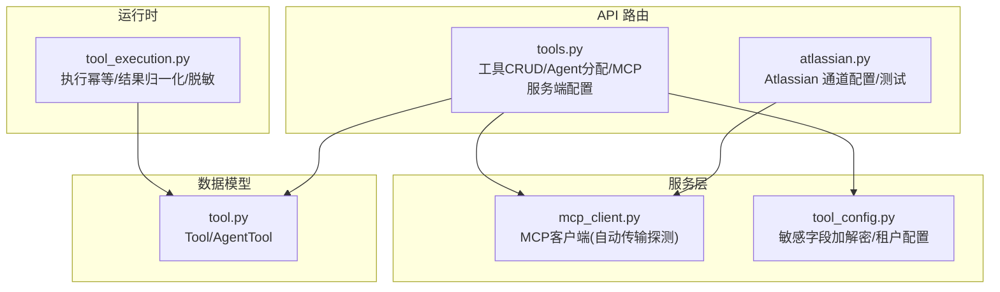
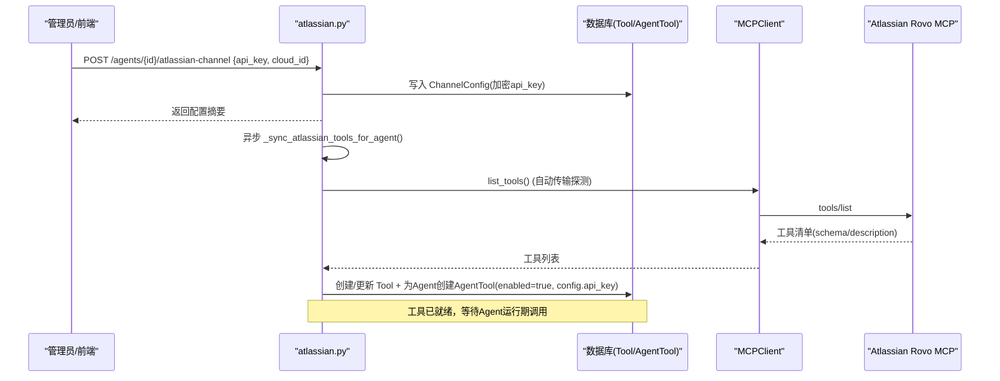
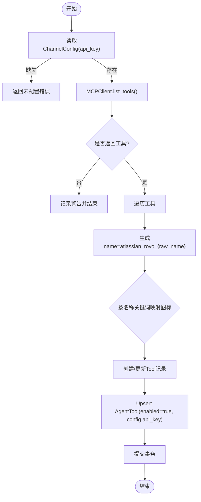
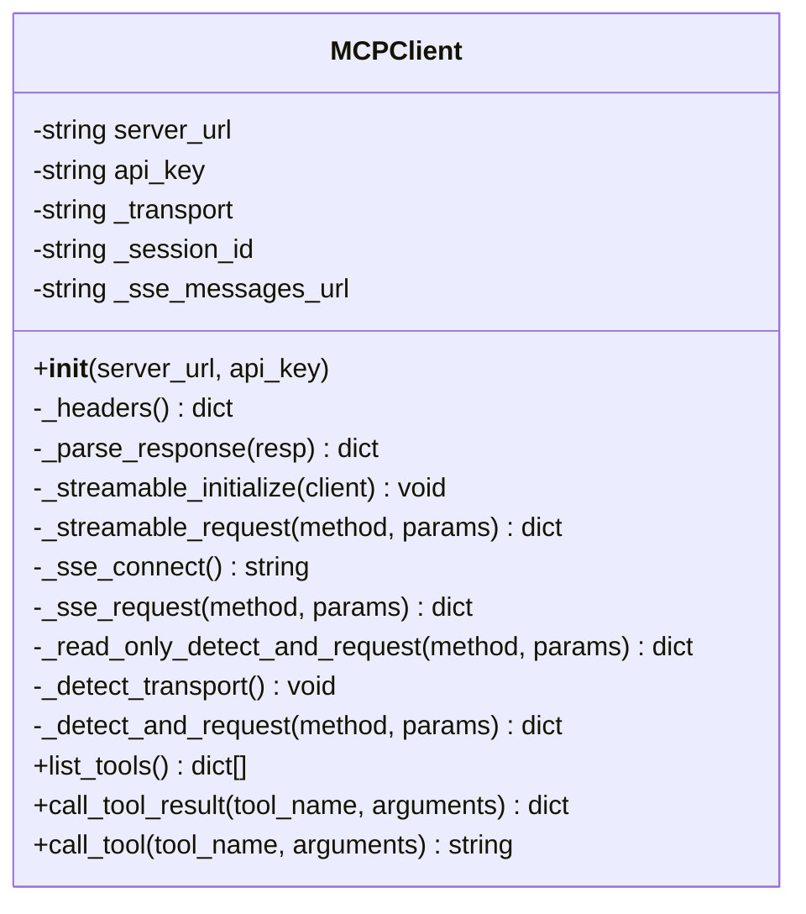
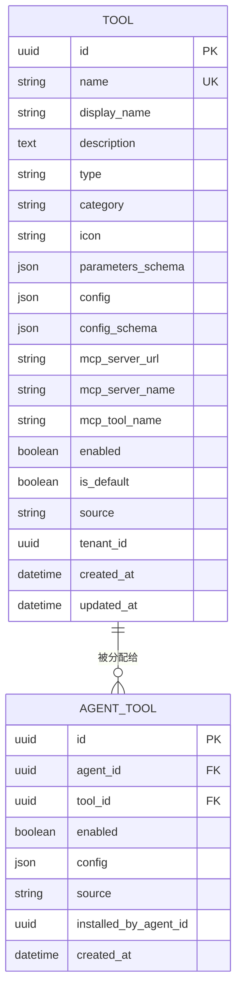
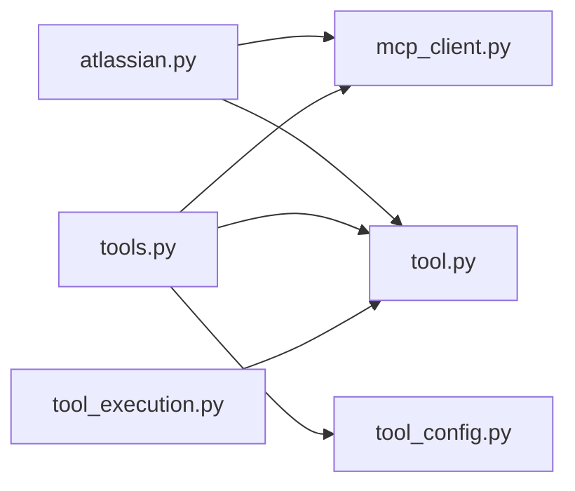

# 工具管理

<cite>
**本文引用的文件**   
- [atlassian.py](file://backend/app/api/atlassian.py)
- [mcp_client.py](file://backend/app/services/mcp_client.py)
- [tool.py](file://backend/app/models/tool.py)
- [tools.py](file://backend/app/api/tools.py)
- [tool_config.py](file://backend/app/services/tool_config.py)
- [tool_execution.py](file://backend/app/services/agent_runtime/tool_execution.py)
</cite>

## 目录
1. [简介](#简介)
2. [项目结构](#项目结构)
3. [核心组件](#核心组件)
4. [架构总览](#架构总览)
5. [详细组件分析](#详细组件分析)
6. [依赖关系分析](#依赖关系分析)
7. [性能考虑](#性能考虑)
8. [故障排查指南](#故障排查指南)
9. [结论](#结论)
10. [附录](#附录)

## 简介
本文件面向 Atlassian 工具管理系统，系统性说明 MCP 服务器工具发现、动态工具注册、工具分类与图标映射机制；详述 Jira、Confluence、Compass 相关工具的参数 schema、调用方式与返回格式；并覆盖工具启用/禁用、权限控制、版本兼容性处理。同时提供工具测试接口使用与错误处理策略，帮助开发者快速集成与排障。

## 项目结构
围绕 Atlassian 工具管理的后端关键路径包括：
- API 路由层：Atlassian 通道配置与测试、通用工具管理与 MCP 服务端配置
- 服务层：MCP 客户端（自动传输探测）、工具配置加密/解密与租户隔离
- 数据模型：Tool/AgentTool 持久化、按 Agent 的启用状态与配置
- 运行时：工具执行幂等性、结果归一化与敏感信息脱敏

**图表来源** 
- [atlassian.py:1-303](file://backend/app/api/atlassian.py#L1-L303)
- [tools.py:1-800](file://backend/app/api/tools.py#L1-L800)
- [mcp_client.py:1-411](file://backend/app/services/mcp_client.py#L1-L411)
- [tool_config.py:1-161](file://backend/app/services/tool_config.py#L1-L161)
- [tool.py:1-63](file://backend/app/models/tool.py#L1-L63)
- [tool_execution.py:1-800](file://backend/app/services/agent_runtime/tool_execution.py#L1-L800)

**章节来源**
- [atlassian.py:1-303](file://backend/app/api/atlassian.py#L1-L303)
- [tools.py:1-800](file://backend/app/api/tools.py#L1-L800)
- [mcp_client.py:1-411](file://backend/app/services/mcp_client.py#L1-L411)
- [tool_config.py:1-161](file://backend/app/services/tool_config.py#L1-L161)
- [tool.py:1-63](file://backend/app/models/tool.py#L1-L63)
- [tool_execution.py:1-800](file://backend/app/services/agent_runtime/tool_execution.py#L1-L800)

## 核心组件
- Atlassian 通道配置与工具同步：通过 POST /agents/{agent_id}/atlassian-channel 配置 api_key/cloud_id，后台异步连接 Atlassian Rovo MCP 并拉取工具列表，创建或更新 Tool 记录，并为当前 Agent 建立 AgentTool 关联，设置 enabled=True 与 config.api_key。
- MCP 客户端：支持 Streamable HTTP 与 SSE 两种传输，首次请求自动探测并缓存传输模式；提供 list_tools() 与 call_tool()/call_tool_result() 统一接口。
- 工具模型与可见性：Tool 表存储名称、描述、schema、类型、分类、图标、MCP 元信息、全局启用开关；AgentTool 表维护每个 Agent 的启用状态与覆盖配置。
- 工具配置与租户隔离：内置工具的公司级配置存储在 TenantSetting，非内置工具的配置在 Tool.config 中加密存储；提供敏感字段识别、加解密与掩码展示。
- 工具执行与幂等：tool_execution 模块负责参数清洗、结果归一化、重试策略判定与敏感信息脱敏，确保跨重启/重试的一致性。

**章节来源**
- [atlassian.py:28-85](file://backend/app/api/atlassian.py#L28-L85)
- [atlassian.py:178-274](file://backend/app/api/atlassian.py#L178-L274)
- [mcp_client.py:24-118](file://backend/app/services/mcp_client.py#L24-L118)
- [mcp_client.py:342-411](file://backend/app/services/mcp_client.py#L342-L411)
- [tool.py:13-63](file://backend/app/models/tool.py#L13-L63)
- [tool_config.py:22-77](file://backend/app/services/tool_config.py#L22-L77)
- [tool_execution.py:296-321](file://backend/app/services/agent_runtime/tool_execution.py#L296-L321)

## 架构总览
下图展示了从“配置 Atlassian 通道”到“工具发现与注册”，再到“运行时调用 MCP 工具”的端到端流程。

**图表来源** 
- [atlassian.py:28-85](file://backend/app/api/atlassian.py#L28-L85)
- [atlassian.py:178-274](file://backend/app/api/atlassian.py#L178-L274)
- [mcp_client.py:342-364](file://backend/app/services/mcp_client.py#L342-L364)

## 详细组件分析

### Atlassian 通道与工具同步
- 通道配置接口：POST /agents/{agent_id}/atlassian-channel，校验 api_key（Bearer 或 Basic），可选 cloud_id；成功后触发异步工具同步。
- 工具同步逻辑：连接 Atlassian Rovo MCP，拉取工具列表；对每个工具生成规范化 name（前缀 atlassian_rovo_），根据名称关键词匹配分类与图标（Jira→🔵，Confluence→📘，Compass→🧭，其他→🔷）；若 Tool 不存在则创建，存在则更新 schema；为当前 Agent 建立或更新 AgentTool，enabled=True，config.api_key=api_key。
- 获取/删除通道：GET/DELETE 对应路由，含权限校验与存在性检查。
- 通道测试接口：POST /agents/{agent_id}/atlassian-channel/test，连接 MCP 并列出可用工具的前若干项，用于连通性与能力验证。

**图表来源** 
- [atlassian.py:178-274](file://backend/app/api/atlassian.py#L178-L274)

**章节来源**
- [atlassian.py:28-85](file://backend/app/api/atlassian.py#L28-L85)
- [atlassian.py:129-158](file://backend/app/api/atlassian.py#L129-L158)
- [atlassian.py:178-274](file://backend/app/api/atlassian.py#L178-L274)

### MCP 客户端（传输自动探测）
- 传输模式：优先尝试 Streamable HTTP，失败回退至 SSE；首次只读探测后缓存传输模式，避免重复探测。
- 认证：支持 Authorization: Bearer 与 URL 查询参数 apiKey 提取；会话 ID 通过响应头 mcp-session-id 维护。
- 工具发现：list_tools() 返回标准化数组，包含 name、description、inputSchema。
- 工具调用：call_tool_result() 返回完整 JSON-RPC 响应；call_tool() 将 content blocks 拼接为文本，兼容旧调用方。

**图表来源** 
- [mcp_client.py:24-118](file://backend/app/services/mcp_client.py#L24-L118)
- [mcp_client.py:119-131](file://backend/app/services/mcp_client.py#L119-L131)
- [mcp_client.py:134-178](file://backend/app/services/mcp_client.py#L134-L178)
- [mcp_client.py:179-278](file://backend/app/services/mcp_client.py#L179-L278)
- [mcp_client.py:281-339](file://backend/app/services/mcp_client.py#L281-L339)
- [mcp_client.py:342-411](file://backend/app/services/mcp_client.py#L342-L411)

**章节来源**
- [mcp_client.py:24-118](file://backend/app/services/mcp_client.py#L24-L118)
- [mcp_client.py:342-411](file://backend/app/services/mcp_client.py#L342-L411)

### 工具模型与可见性
- Tool 字段：name、display_name、description、type(builtin/mcp)、category、icon、parameters_schema、config/config_schema、mcp_server_url/name/tool_name、enabled、is_default、source、tenant_id。
- AgentTool 字段：agent_id、tool_id、enabled、config、source、installed_by_agent_id。
- 可见性规则：builtin 全局可见；admin 工具仅对同租户或平台级可见；显式分配的 AgentTool 始终可见。系统级工具不可被禁用。

**图表来源** 
- [tool.py:13-63](file://backend/app/models/tool.py#L13-L63)

**章节来源**
- [tool.py:13-63](file://backend/app/models/tool.py#L13-L63)
- [tools.py:55-90](file://backend/app/api/tools.py#L55-L90)

### 工具配置与租户隔离
- 内置工具公司级配置：存储于 TenantSetting，键前缀 tool_config:<tool_name>；读取时解密敏感字段。
- 非内置工具配置：存储于 Tool.config，保存时加密敏感字段；支持按 schema 识别 password 类型字段。
- 掩码展示：对外返回 masked 的全局配置，避免泄露密钥片段。

**章节来源**
- [tool_config.py:22-77](file://backend/app/services/tool_config.py#L22-L77)
- [tool_config.py:93-132](file://backend/app/services/tool_config.py#L93-L132)
- [tool_config.py:146-161](file://backend/app/services/tool_config.py#L146-L161)

### 工具启用/禁用与批量管理
- 全局启用：PUT /tools/bulk 批量更新多个 Tool.enabled。
- 单条更新：PUT /tools/{tool_id} 可更新显示名、描述、图标、schema、MCP 元信息与配置（敏感字段自动加密）。
- Agent 维度启用：PUT /tools/agents/{agent_id} 批量更新 AgentTool.enabled；系统类工具不可禁用。
- 默认启用：新建 AgentTool 时，若不存在显式记录，沿用 Tool.is_default。

**章节来源**
- [tools.py:291-308](file://backend/app/api/tools.py#L291-L308)
- [tools.py:310-338](file://backend/app/api/tools.py#L310-L338)
- [tools.py:451-488](file://backend/app/api/tools.py#L451-L488)

### MCP 服务端配置与测试
- 测试连接：POST /tools/test-mcp，传入 server_url 与可选 api_key，返回工具清单或错误摘要。
- 服务端级别凭证：PUT /tools/mcp-server，按 server_name 批量更新所有同名 MCP 工具的 URL 与 api_key（加密存储），便于统一轮换。

**章节来源**
- [tools.py:581-600](file://backend/app/api/tools.py#L581-L600)
- [tools.py:611-664](file://backend/app/api/tools.py#L611-L664)

### 工具测试接口使用（Atlassian）
- 接口：POST /agents/{agent_id}/atlassian-channel/test
- 作用：验证 Atlassian Rovo MCP 连通性并列出可用工具（最多返回前10个的名称与描述摘要）。
- 返回：ok、tool_count、tools 列表、message；异常时返回 ok=false 与 error 摘要。

**章节来源**
- [atlassian.py:129-158](file://backend/app/api/atlassian.py#L129-L158)

### 工具分类与图标映射
- 分类：atlassian 工具由同步逻辑归类为 atlassian；内置工具按业务域划分（如 file、search、communication 等）。
- 图标映射：基于工具名关键词匹配——jira/issue→🔵，confluence/page→📘，compass/component→🧭，其他→🔷。

**章节来源**
- [atlassian.py:214-222](file://backend/app/api/atlassian.py#L214-L222)

### 版本兼容性处理
- MCP 协议版本：初始化携带 protocolVersion="2024-11-05"，兼容服务端能力协商。
- 历史迁移：AgentTool 回填逻辑保证 UI 与 LLM 工具视图一致；TenantSetting 兼容旧 schema；工具唯一性按租户隔离避免冲突。

**章节来源**
- [mcp_client.py:91-118](file://backend/app/services/mcp_client.py#L91-L118)
- [tools.py:388-416](file://backend/app/api/tools.py#L388-L416)

### 权限控制
- Atlassian 通道配置/删除：仅通道创建者可操作。
- 工具管理：按租户边界过滤 admin 工具；系统级工具不可禁用；Smithery 授权状态需具备 Agent 管理能力。

**章节来源**
- [atlassian.py:40-42](file://backend/app/api/atlassian.py#L40-L42)
- [tools.py:508-512](file://backend/app/api/tools.py#L508-L512)
- [tools.py:473-477](file://backend/app/api/tools.py#L473-L477)

### 错误处理策略
- MCP 客户端：HTTP 错误封装为连接失败消息；SSE/Streamable 双传输失败抛出 MCPTransportDetectionError。
- 工具执行：参数清洗与敏感字段脱敏；结果归一化限制大小与类型；重试策略 safe/conditional/never 与副作用分类 read/write/external_write 配合幂等决策。
- API 层：统一返回 ok/error 摘要，避免泄露内部细节。

**章节来源**
- [mcp_client.py:362-411](file://backend/app/services/mcp_client.py#L362-L411)
- [tool_execution.py:296-321](file://backend/app/services/agent_runtime/tool_execution.py#L296-L321)
- [tool_execution.py:409-566](file://backend/app/services/agent_runtime/tool_execution.py#L409-L566)

## 依赖关系分析
- atlassian.py 依赖 MCPClient 进行工具发现与测试，依赖数据库读写 Tool/AgentTool。
- tools.py 依赖 Tool/AgentTool 模型、tool_config 进行配置加解密与租户隔离，依赖 MCPClient 进行服务端测试。
- tool_execution.py 依赖 AgentToolExecution 模型实现执行幂等与结果归档。

**图表来源** 
- [atlassian.py:178-274](file://backend/app/api/atlassian.py#L178-L274)
- [tools.py:1-800](file://backend/app/api/tools.py#L1-L800)
- [mcp_client.py:1-411](file://backend/app/services/mcp_client.py#L1-L411)
- [tool_config.py:1-161](file://backend/app/services/tool_config.py#L1-L161)
- [tool.py:1-63](file://backend/app/models/tool.py#L1-L63)
- [tool_execution.py:1-800](file://backend/app/services/agent_runtime/tool_execution.py#L1-L800)

**章节来源**
- [atlassian.py:178-274](file://backend/app/api/atlassian.py#L178-L274)
- [tools.py:1-800](file://backend/app/api/tools.py#L1-L800)
- [mcp_client.py:1-411](file://backend/app/services/mcp_client.py#L1-L411)
- [tool_config.py:1-161](file://backend/app/services/tool_config.py#L1-L161)
- [tool.py:1-63](file://backend/app/models/tool.py#L1-L63)
- [tool_execution.py:1-800](file://backend/app/services/agent_runtime/tool_execution.py#L1-L800)

## 性能考虑
- MCP 传输探测仅在首次请求进行，后续复用同一传输模式，减少握手开销。
- 工具同步采用异步任务，避免阻塞配置接口响应。
- 工具配置敏感字段按需加解密，避免全量明文存储；对外展示时掩码处理降低 IO 与安全风险。
- 工具执行结果摘要截断与归档，控制内存与日志体积。

[本节为通用指导，不直接分析具体文件]

## 故障排查指南
- Atlassian 通道未配置：测试接口返回未配置错误，请先完成通道配置。
- MCP 连接失败：检查 api_key 是否正确、网络可达性与服务端状态；查看错误摘要定位传输模式问题。
- 工具不可见：确认 Tool.enabled、AgentTool.enabled、租户边界与 visibility 规则；系统级工具不可禁用。
- 配置泄露风险：确保敏感字段按 schema 标记为 password，并在存储时加密、展示时掩码。
- 执行幂等异常：检查 ToolExecution 状态与重试策略，必要时进行人工对账与恢复。

**章节来源**
- [atlassian.py:129-158](file://backend/app/api/atlassian.py#L129-L158)
- [mcp_client.py:362-411](file://backend/app/services/mcp_client.py#L362-L411)
- [tools.py:55-90](file://backend/app/api/tools.py#L55-L90)
- [tool_config.py:146-161](file://backend/app/services/tool_config.py#L146-L161)
- [tool_execution.py:409-566](file://backend/app/services/agent_runtime/tool_execution.py#L409-L566)

## 结论
本系统通过 MCP 客户端自动传输探测与 Atlassian 通道异步工具同步，实现了 Jira/Confluence/Compass 工具的动态发现与注册；结合 Tool/AgentTool 模型与租户隔离的配置体系，提供了完善的工具分类、图标映射、启用/禁用与权限控制；运行时以严格的幂等与脱敏策略保障稳定性与安全性。建议在生产环境严格管理 api_key 生命周期，定期轮转并通过测试接口验证连通性与能力变更。

[本节为总结，不直接分析具体文件]

## 附录

### Jira/Confluence/Compass 工具参数 schema、调用方式与返回格式
- 参数 schema：来源于 MCP 服务器的 inputSchema，经 list_tools() 标准化为 {name, description, inputSchema}；Tool.parameters_schema 持久化该 schema。
- 调用方式：运行时通过 MCPClient.call_tool_result() 发送 tools/call，参数为 {name: "atlassian_rovo_{raw_name}", arguments: {...}}。
- 返回格式：JSON-RPC result.content 为内容块数组，可能包含 text/image 等类型；call_tool() 将其拼接为文本字符串供旧调用方使用。

**章节来源**
- [mcp_client.py:342-411](file://backend/app/services/mcp_client.py#L342-L411)
- [tool.py:30-41](file://backend/app/models/tool.py#L30-L41)

### 工具启用/禁用、权限控制、版本兼容性处理
- 启用/禁用：全局批量 PUT /tools/bulk；Agent 维度 PUT /tools/agents/{agent_id}；系统级工具不可禁用。
- 权限控制：Atlassian 通道仅创建者可配置/删除；工具管理按租户边界与 Smithery 授权状态控制。
- 版本兼容：MCP 协议版本固定；AgentTool 回填保证 UI/LLM 一致性；TenantSetting 兼容旧 schema。

**章节来源**
- [tools.py:291-308](file://backend/app/api/tools.py#L291-L308)
- [tools.py:451-488](file://backend/app/api/tools.py#L451-L488)
- [tools.py:508-512](file://backend/app/api/tools.py#L508-L512)
- [mcp_client.py:91-118](file://backend/app/services/mcp_client.py#L91-L118)
- [tools.py:388-416](file://backend/app/api/tools.py#L388-L416)