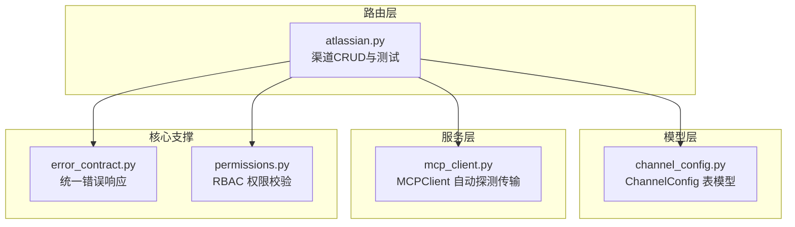
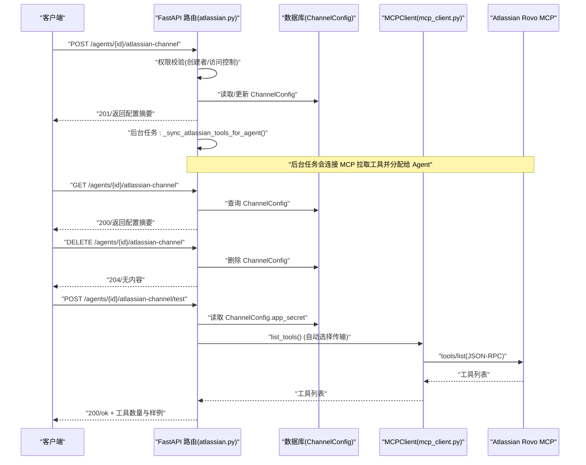
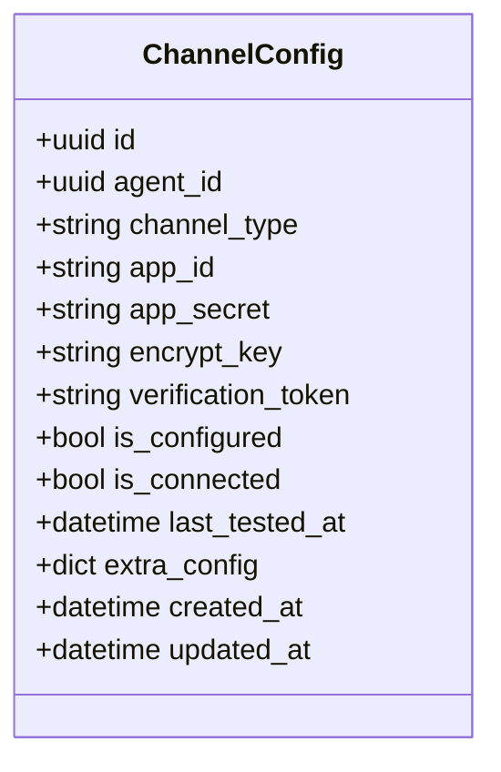
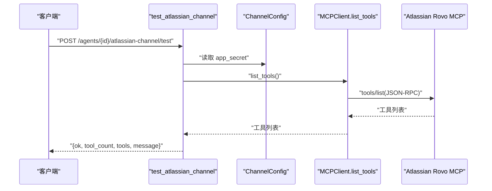
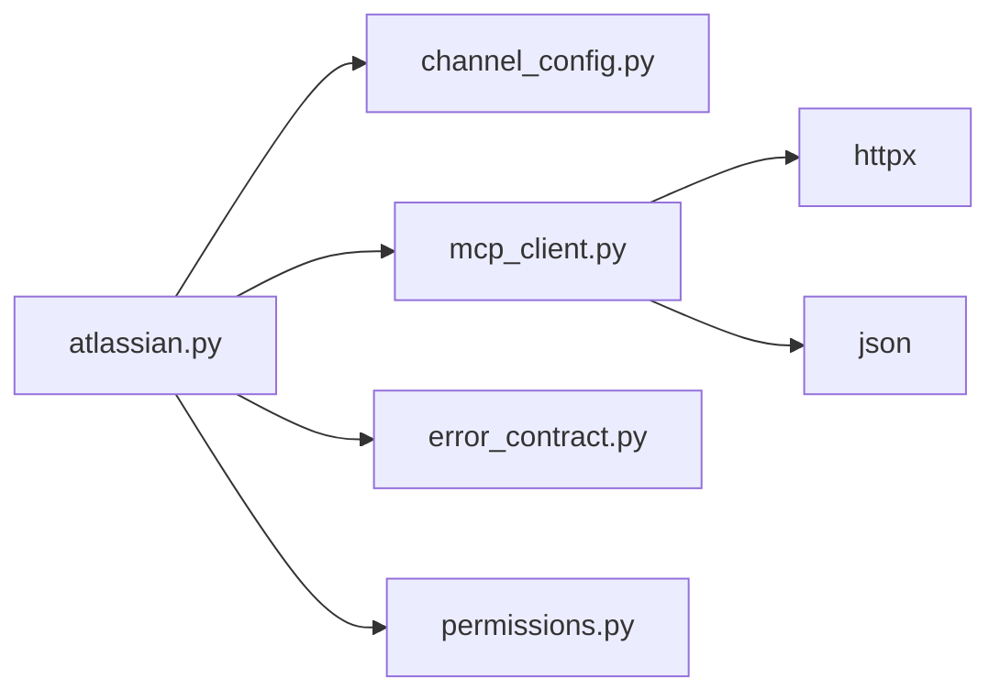

# 渠道API接口

<cite>
**本文引用的文件**   
- [backend/app/api/atlassian.py](file://backend/app/api/atlassian.py)
- [backend/app/models/channel_config.py](file://backend/app/models/channel_config.py)
- [backend/app/services/mcp_client.py](file://backend/app/services/mcp_client.py)
- [backend/app/core/error_contract.py](file://backend/app/core/error_contract.py)
- [backend/app/core/permissions.py](file://backend/app/core/permissions.py)
</cite>

## 目录
1. [简介](#简介)
2. [项目结构](#项目结构)
3. [核心组件](#核心组件)
4. [架构总览](#架构总览)
5. [详细组件分析](#详细组件分析)
6. [依赖关系分析](#依赖关系分析)
7. [性能与运维](#性能与运维)
8. [故障排查指南](#故障排查指南)
9. [结论](#结论)
10. [附录：接口规范与示例](#附录接口规范与示例)

## 简介
本文件为 Atlassian 渠道 API 的完整 RESTful 接口文档，覆盖以下端点：
- POST /agents/{agent_id}/atlassian-channel：配置 Atlassian 渠道（写入凭据、可选 cloud_id）
- GET /agents/{agent_id}/atlassian-channel：查询已配置的 Atlassian 渠道信息
- DELETE /agents/{agent_id}/atlassian-channel：删除 Atlassian 渠道配置
- POST /agents/{agent_id}/atlassian-channel/test：测试连接并列出可用工具

该能力通过 Atlassian Rovo MCP 服务暴露 Jira、Confluence、Compass 等工具，Agent 以“工具访问型渠道”的方式使用这些能力。

## 项目结构
Atlassian 渠道相关代码主要位于后端 FastAPI 路由模块、数据模型、MCP 客户端以及错误处理与权限校验模块中。整体组织方式按功能域划分，路由层负责鉴权、参数校验与业务编排；模型层定义持久化结构；MCP 客户端封装对外部服务的通信细节。

图表来源
- [backend/app/api/atlassian.py:1-303](file://backend/app/api/atlassian.py#L1-L303)
- [backend/app/models/channel_config.py:1-52](file://backend/app/models/channel_config.py#L1-L52)
- [backend/app/services/mcp_client.py:1-411](file://backend/app/services/mcp_client.py#L1-L411)
- [backend/app/core/error_contract.py:1-229](file://backend/app/core/error_contract.py#L1-L229)
- [backend/app/core/permissions.py:1-200](file://backend/app/core/permissions.py#L1-L200)

章节来源
- [backend/app/api/atlassian.py:1-303](file://backend/app/api/atlassian.py#L1-L303)
- [backend/app/models/channel_config.py:1-52](file://backend/app/models/channel_config.py#L1-L52)

## 核心组件
- 路由与控制器：提供 Atlassian 渠道的增删查测四个端点，包含权限校验、参数清洗、加密存储、后台工具同步与测试连接。
- 数据模型：ChannelConfig 用于存储每个 Agent 的渠道配置，支持扩展字段 extra_config。
- MCP 客户端：MCPClient 支持 Streamable HTTP 与 SSE 两种传输模式，自动探测并复用会话，完成 tools/list 与 tools/call。
- 错误处理：统一的 HTTP 异常处理器，输出标准化 error 对象，包含 code、message、trace_id 等字段。
- 权限控制：基于 RBAC 的 Agent 访问检查与创建者校验，确保只有合法用户可配置或移除渠道。

章节来源
- [backend/app/api/atlassian.py:28-158](file://backend/app/api/atlassian.py#L28-L158)
- [backend/app/models/channel_config.py:13-48](file://backend/app/models/channel_config.py#L13-L48)
- [backend/app/services/mcp_client.py:24-118](file://backend/app/services/mcp_client.py#L24-L118)
- [backend/app/core/error_contract.py:158-229](file://backend/app/core/error_contract.py#L158-L229)
- [backend/app/core/permissions.py:65-129](file://backend/app/core/permissions.py#L65-L129)

## 架构总览
下图展示了从客户端请求到外部 MCP 服务器的调用链路，包括鉴权、配置读写、后台工具同步与测试流程。

图表来源
- [backend/app/api/atlassian.py:28-158](file://backend/app/api/atlassian.py#L28-L158)
- [backend/app/services/mcp_client.py:342-364](file://backend/app/services/mcp_client.py#L342-L364)

## 详细组件分析

### 路由与控制器：Atlassian 渠道 CRUD 与测试
- 配置渠道（POST）
  - 路径：/agents/{agent_id}/atlassian-channel
  - 方法：POST
  - 状态码：201（成功）、403（非创建者）、422（缺少 api_key）
  - 请求体字段：
    - api_key：必填，Bearer token（以 ATSTT 开头）或 Basic base64(email:token)
    - cloud_id：可选，多站点场景下的云站点标识
  - 行为：
    - 校验用户权限（仅创建者可配置）
    - 加密存储 app_secret
    - 若已有记录则更新 is_configured 与 extra_config.cloud_id
    - 异步触发工具同步任务（拉取 MCP 工具并分配给 Agent）
    - 返回序列化后的配置摘要
- 查询渠道（GET）
  - 路径：/agents/{agent_id}/atlassian-channel
  - 方法：GET
  - 状态码：200（成功）、404（未配置）
  - 行为：根据 agent_id 与 channel_type="atlassian" 查询配置并返回摘要
- 删除渠道（DELETE）
  - 路径：/agents/{agent_id}/atlassian-channel
  - 方法：DELETE
  - 状态码：204（成功）、403（非创建者）、404（未配置）
  - 行为：校验权限后删除对应 ChannelConfig 记录
- 测试连接（POST）
  - 路径：/agents/{agent_id}/atlassian-channel/test
  - 方法：POST
  - 状态码：200（成功/失败均返回 JSON），失败时 ok=false
  - 行为：
    - 校验权限与配置存在性
    - 使用 MCPClient 连接 Atlassian Rovo MCP 并执行 tools/list
    - 返回工具数量与部分工具名称/描述样例

章节来源
- [backend/app/api/atlassian.py:28-85](file://backend/app/api/atlassian.py#L28-L85)
- [backend/app/api/atlassian.py:88-104](file://backend/app/api/atlassian.py#L88-L104)
- [backend/app/api/atlassian.py:107-127](file://backend/app/api/atlassian.py#L107-L127)
- [backend/app/api/atlassian.py:129-158](file://backend/app/api/atlassian.py#L129-L158)

#### 类图：ChannelConfig 模型

图表来源
- [backend/app/models/channel_config.py:13-48](file://backend/app/models/channel_config.py#L13-L48)

#### 序列图：测试连接流程

图表来源
- [backend/app/api/atlassian.py:129-158](file://backend/app/api/atlassian.py#L129-L158)
- [backend/app/services/mcp_client.py:342-364](file://backend/app/services/mcp_client.py#L342-L364)

### MCP 客户端：传输自动探测与工具调用
- 传输模式
  - Streamable HTTP：单次 POST JSON-RPC，支持会话 ID 复用
  - SSE：先 GET /sse 获取消息端点，再 POST /messages 发送请求，并从流中读取响应
- 自动探测
  - 首次请求通过只读探测（如 tools/list）确定传输模式，后续复用同一模式
- 超时与重试
  - httpx 默认超时：Streamable 30s，SSE 30s（tools/call 60s）
  - 未实现指数退避重试，可在上层调用处添加重试策略
- 认证
  - Authorization: Bearer <api_key>
  - 支持从 URL 查询参数提取 apiKey 并迁移至 Header

章节来源
- [backend/app/services/mcp_client.py:24-118](file://backend/app/services/mcp_client.py#L24-L118)
- [backend/app/services/mcp_client.py:119-178](file://backend/app/services/mcp_client.py#L119-L178)
- [backend/app/services/mcp_client.py:179-277](file://backend/app/services/mcp_client.py#L179-L277)
- [backend/app/services/mcp_client.py:279-339](file://backend/app/services/mcp_client.py#L279-L339)
- [backend/app/services/mcp_client.py:342-411](file://backend/app/services/mcp_client.py#L342-L411)

### 错误处理与统一响应
- HTTPException 处理器：将 detail 转换为标准 error 对象，包含 code、message、trace_id、retryable 等
- 请求校验错误：422 响应，附带 validation errors
- 未捕获异常：500 响应，隐藏内部细节，仅返回通用错误信息
- TraceId：所有错误响应携带 X-Trace-Id 头，便于追踪

章节来源
- [backend/app/core/error_contract.py:158-229](file://backend/app/core/error_contract.py#L158-L229)

### 权限与访问控制
- check_agent_access：校验用户对 Agent 的访问权限（租户、状态、访问模式等）
- is_agent_creator：仅创建者可配置或删除渠道
- can_manage_agent：管理权限判断（管理员或自定义授权）

章节来源
- [backend/app/core/permissions.py:65-129](file://backend/app/core/permissions.py#L65-L129)
- [backend/app/api/atlassian.py:40-42](file://backend/app/api/atlassian.py#L40-L42)
- [backend/app/api/atlassian.py:113-115](file://backend/app/api/atlassian.py#L113-L115)

## 依赖关系分析
- atlassian.py 依赖：
  - permissions.py：权限校验
  - models/channel_config.py：读写渠道配置
  - services/mcp_client.py：连接 Atlassian Rovo MCP
  - core/error_contract.py：统一错误响应
- mcp_client.py 依赖：
  - httpx：HTTP 客户端
  - json：JSON 解析
  - loguru：日志

图表来源
- [backend/app/api/atlassian.py:1-303](file://backend/app/api/atlassian.py#L1-L303)
- [backend/app/services/mcp_client.py:1-411](file://backend/app/services/mcp_client.py#L1-L411)

## 性能与运维
- 后台工具同步
  - 配置成功后异步触发工具同步，避免阻塞请求
  - 建议监控同步任务耗时与失败率
- 网络超时
  - MCP 客户端默认超时：30s（tools/list），60s（tools/call）
  - 建议在网关或反向代理设置合理超时（≥60s）
- 重试策略
  - 当前未内置重试，建议在调用方对幂等请求（如 list_tools）实施指数退避重试
- 缓存与连接复用
  - MCPClient 维护 session_id 与传输模式，减少握手开销
- 安全与审计
  - 凭据加密存储，错误响应包含 trace_id，便于审计与排障

[本节为通用指导，不直接分析具体文件]

## 故障排查指南
- 常见错误与定位
  - 403 非创建者：确认当前用户是否为 Agent 创建者
  - 422 缺少 api_key：检查请求体是否包含有效 api_key
  - 404 未配置：确认是否已调用配置接口并成功提交
  - 连接失败：检查网络可达性与 MCP 服务可用性，查看错误响应中的 error.message
- 调试步骤
  - 使用测试接口验证连接与工具列表
  - 检查 X-Trace-Id 头，结合服务端日志定位问题
  - 核对 api_key 格式（ATSTT 或 Basic base64）
- 常见问题
  - MCP 传输探测失败：可能是服务器不支持 Streamable HTTP，回退到 SSE
  - 工具列表为空：确认 api_key 权限与站点范围（cloud_id）

章节来源
- [backend/app/core/error_contract.py:158-229](file://backend/app/core/error_contract.py#L158-L229)
- [backend/app/api/atlassian.py:129-158](file://backend/app/api/atlassian.py#L129-L158)

## 结论
Atlassian 渠道 API 提供了完善的渠道配置、查询、删除与测试能力，并通过 MCP 客户端实现对 Atlassian Rovo 工具的动态发现与调用。系统采用统一错误响应与权限校验机制，具备较好的可观测性与安全性。建议在调用侧补充重试与超时策略，以提升稳定性与用户体验。

[本节为总结，不直接分析具体文件]

## 附录：接口规范与示例

### 接口定义与参数说明
- POST /agents/{agent_id}/atlassian-channel
  - 路径参数：agent_id（UUID）
  - 请求体：
    - api_key：字符串，必填
    - cloud_id：字符串，可选
  - 成功响应（201）：
    - id：字符串
    - agent_id：字符串
    - channel_type：字符串（固定为 atlassian）
    - is_configured：布尔
    - is_connected：布尔
    - cloud_id：字符串
    - extra_config：对象
    - created_at：时间戳
- GET /agents/{agent_id}/atlassian-channel
  - 成功响应（200）：同上
  - 未配置（404）：错误对象
- DELETE /agents/{agent_id}/atlassian-channel
  - 成功响应（204）：无内容
  - 未配置（404）：错误对象
- POST /agents/{agent_id}/atlassian-channel/test
  - 成功响应（200）：
    - ok：布尔
    - tool_count：整数
    - tools：数组（name、description）
    - message：字符串

章节来源
- [backend/app/api/atlassian.py:28-85](file://backend/app/api/atlassian.py#L28-L85)
- [backend/app/api/atlassian.py:88-104](file://backend/app/api/atlassian.py#L88-L104)
- [backend/app/api/atlassian.py:107-127](file://backend/app/api/atlassian.py#L107-L127)
- [backend/app/api/atlassian.py:129-158](file://backend/app/api/atlassian.py#L129-L158)

### curl 示例
- 配置渠道
  - curl -X POST "https://your-host/agents/{agent_id}/atlassian-channel" -H "Authorization: Bearer <token>" -H "Content-Type: application/json" -d '{"api_key":"ATSTT...","cloud_id":"your-cloud-id"}'
- 查询渠道
  - curl -X GET "https://your-host/agents/{agent_id}/atlassian-channel" -H "Authorization: Bearer <token>"
- 删除渠道
  - curl -X DELETE "https://your-host/agents/{agent_id}/atlassian-channel" -H "Authorization: Bearer <token>"
- 测试连接
  - curl -X POST "https://your-host/agents/{agent_id}/atlassian-channel/test" -H "Authorization: Bearer <token>"

[以上示例为通用用法，实际 host 与 token 请替换为部署环境值]

### Python SDK 调用示例
- 使用 httpx 发起请求（示例思路）
  - 构造 Base URL 与 Authorization 头
  - 调用上述四个端点，处理 2xx/4xx/5xx 响应
  - 对于测试接口，解析 ok、tool_count、tools 字段
- 使用 MCPClient（如需直接调用 MCP）
  - 初始化 MCPClient(server_url="https://mcp.atlassian.com/v1/mcp", api_key="<api_key>")
  - 调用 list_tools() 获取工具列表
  - 调用 call_tool_result(name, arguments) 执行工具

章节来源
- [backend/app/services/mcp_client.py:342-364](file://backend/app/services/mcp_client.py#L342-L364)
- [backend/app/services/mcp_client.py:365-411](file://backend/app/services/mcp_client.py#L365-L411)