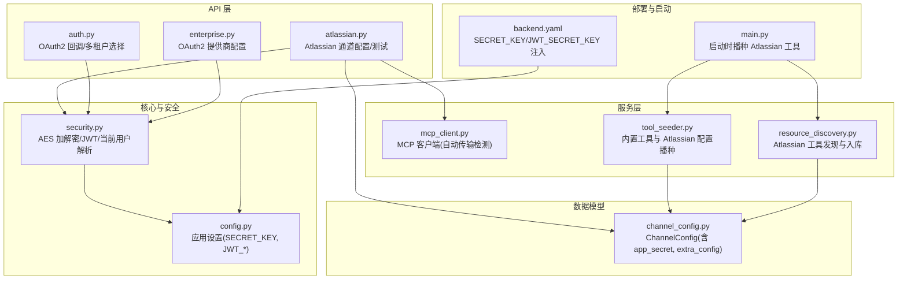
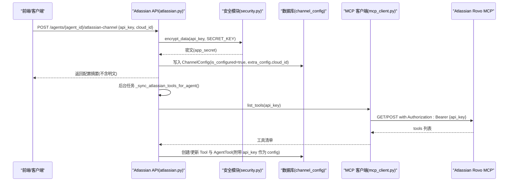
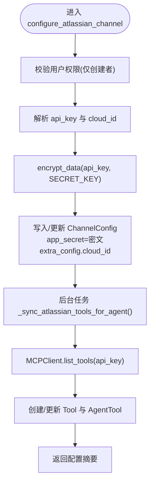
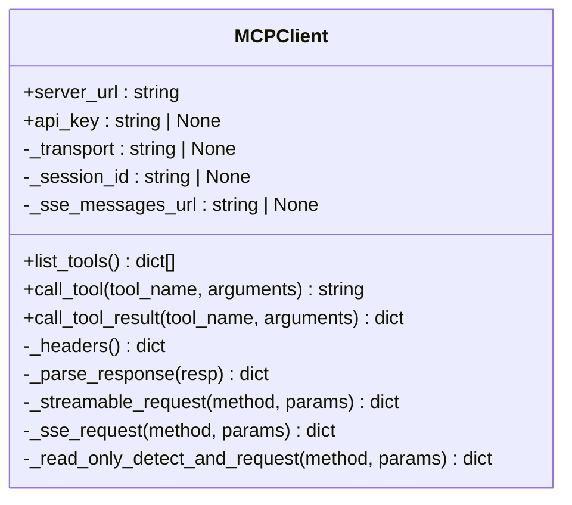
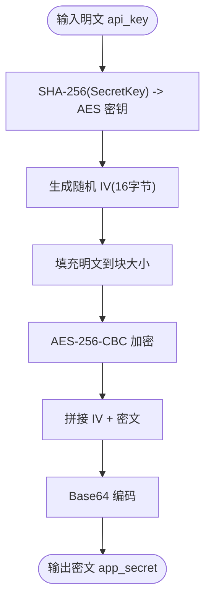
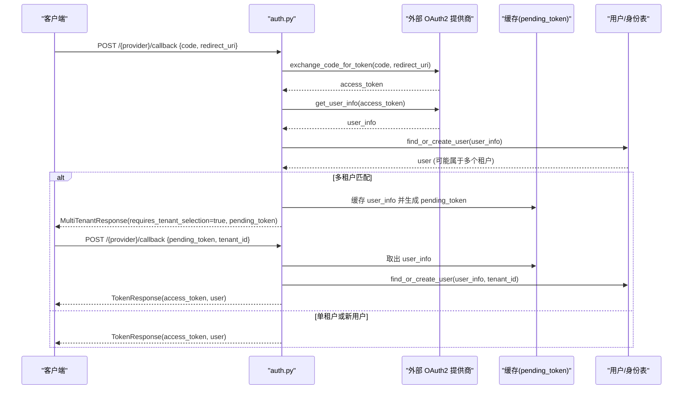
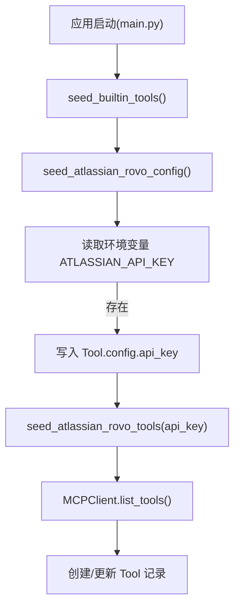
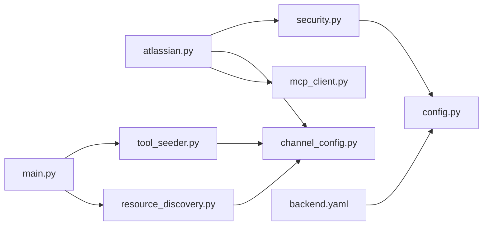

# 认证配置

<cite>
**本文引用的文件**   
- [backend/app/api/atlassian.py](file://backend/app/api/atlassian.py)
- [backend/app/core/security.py](file://backend/app/core/security.py)
- [backend/app/models/channel_config.py](file://backend/app/models/channel_config.py)
- [backend/app/services/mcp_client.py](file://backend/app/services/mcp_client.py)
- [backend/app/config.py](file://backend/app/config.py)
- [backend/app/api/auth.py](file://backend/app/api/auth.py)
- [backend/app/schemas/schemas.py](file://backend/app/schemas/schemas.py)
- [backend/app/api/enterprise.py](file://backend/app/api/enterprise.py)
- [backend/app/main.py](file://backend/app/main.py)
- [backend/app/services/tool_seeder.py](file://backend/app/services/tool_seeder.py)
- [backend/app/services/resource_discovery.py](file://backend/app/services/resource_discovery.py)
- [helm/clawith/templates/backend.yaml](file://helm/clawith/templates/backend.yaml)
</cite>

## 目录
1. [简介](#简介)
2. [项目结构](#项目结构)
3. [核心组件](#核心组件)
4. [架构总览](#架构总览)
5. [详细组件分析](#详细组件分析)
6. [依赖关系分析](#依赖关系分析)
7. [性能考虑](#性能考虑)
8. [故障排查指南](#故障排查指南)
9. [结论](#结论)
10. [附录：配置示例与最佳实践](#附录配置示例与最佳实践)

## 简介
本文件面向 Atlassian 集成的认证配置，覆盖以下要点：
- API 密钥格式：支持以 ATSTT 开头的 Bearer 令牌，或 Basic base64(email:token) 形式。
- cloud_id 配置：用于多站点（多云）场景的隔离标识。
- 加密存储机制：使用 AES-256-CBC 对敏感字段进行加密，密钥由应用级 SECRET_KEY 派生。
- OAuth2 认证流程：平台侧统一 OAuth2 登录、多租户选择与令牌签发。
- 令牌刷新策略：JWT 访问令牌过期时间可配；外部服务令牌（Atlassian）通过 MCP Client 每次请求携带。
- 多租户身份隔离：用户-租户边界清晰，工具与通道配置按 Agent 维度绑定。
- 完整配置示例与故障排查：提供端到端步骤与常见问题定位方法。
- 安全最佳实践：密钥轮换、权限最小化、传输与存储安全等。

## 项目结构
与 Atlassian 认证相关的关键代码分布在后端 API、安全模块、模型定义、MCP 客户端以及启动初始化流程中。整体组织遵循“功能域 + 分层”模式：API 层暴露路由，Service 层实现业务逻辑，Model 层定义数据模型，Security 层负责加解密与鉴权。

**图表来源** 
- [backend/app/api/atlassian.py:1-303](file://backend/app/api/atlassian.py#L1-L303)
- [backend/app/services/mcp_client.py:1-411](file://backend/app/services/mcp_client.py#L1-L411)
- [backend/app/core/security.py:1-227](file://backend/app/core/security.py#L1-L227)
- [backend/app/models/channel_config.py:1-52](file://backend/app/models/channel_config.py#L1-L52)
- [backend/app/config.py:1-268](file://backend/app/config.py#L1-L268)
- [backend/app/main.py:234-267](file://backend/app/main.py#L234-L267)
- [helm/clawith/templates/backend.yaml:67-100](file://helm/clawith/templates/backend.yaml#L67-L100)

**章节来源**
- [backend/app/api/atlassian.py:1-303](file://backend/app/api/atlassian.py#L1-L303)
- [backend/app/services/mcp_client.py:1-411](file://backend/app/services/mcp_client.py#L1-L411)
- [backend/app/core/security.py:1-227](file://backend/app/core/security.py#L1-L227)
- [backend/app/models/channel_config.py:1-52](file://backend/app/models/channel_config.py#L1-L52)
- [backend/app/config.py:1-268](file://backend/app/config.py#L1-L268)
- [backend/app/main.py:234-267](file://backend/app/main.py#L234-L267)
- [helm/clawith/templates/backend.yaml:67-100](file://helm/clawith/templates/backend.yaml#L67-L100)

## 核心组件
- Atlassian 通道配置 API：提供 per-agent 的 Atlassian Rovo MCP 配置、查询、删除与连通性测试。
- MCP 客户端：封装与 Atlassian Rovo MCP 的通信，自动检测 Streamable HTTP 或 SSE 传输，并在请求头中携带 Authorization: Bearer。
- 安全模块：提供 AES-256-CBC 加解密、JWT 生成与校验、当前用户解析。
- 通道配置模型：ChannelConfig 表存储 app_secret（加密后的 api_key）、extra_config（包含 cloud_id）。
- 启动播种：启动时根据环境变量或全局工具配置，自动发现并注册 Atlassian 工具。

**章节来源**
- [backend/app/api/atlassian.py:28-86](file://backend/app/api/atlassian.py#L28-L86)
- [backend/app/services/mcp_client.py:24-58](file://backend/app/services/mcp_client.py#L24-L58)
- [backend/app/core/security.py:54-123](file://backend/app/core/security.py#L54-L123)
- [backend/app/models/channel_config.py:13-41](file://backend/app/models/channel_config.py#L13-L41)
- [backend/app/main.py:234-267](file://backend/app/main.py#L234-L267)

## 架构总览
下图展示从前端到 Atlassian Rovo MCP 的认证与调用链路，包括 API Key 的传递方式、加密存储与工具同步过程。

**图表来源** 
- [backend/app/api/atlassian.py:28-86](file://backend/app/api/atlassian.py#L28-L86)
- [backend/app/core/security.py:54-84](file://backend/app/core/security.py#L54-L84)
- [backend/app/services/mcp_client.py:48-58](file://backend/app/services/mcp_client.py#L48-L58)
- [backend/app/models/channel_config.py:13-41](file://backend/app/models/channel_config.py#L13-L41)

## 详细组件分析

### Atlassian 通道配置 API
- 功能：为指定 Agent 配置 Atlassian Rovo MCP，支持新增与更新；支持可选 cloud_id；支持连通性测试。
- 关键行为：
  - 校验用户权限（仅 Agent 创建者可配置）。
  - 接收 api_key（ATSTT 开头的 Bearer 或 Basic base64(email:token)），并进行 AES 加密后存入 app_secret。
  - 将 cloud_id 写入 extra_config。
  - 后台异步同步工具：连接 MCP 服务器，拉取工具列表，创建/更新 Tool 记录，并为该 Agent 建立 AgentTool 关联，同时保存 api_key 到 AgentTool.config 作为备用。
  - 提供测试接口，直接调用 MCPClient.list_tools() 验证连通性与可用工具数量。

**图表来源** 
- [backend/app/api/atlassian.py:28-86](file://backend/app/api/atlassian.py#L28-L86)
- [backend/app/api/atlassian.py:178-274](file://backend/app/api/atlassian.py#L178-L274)

**章节来源**
- [backend/app/api/atlassian.py:28-86](file://backend/app/api/atlassian.py#L28-L86)
- [backend/app/api/atlassian.py:129-159](file://backend/app/api/atlassian.py#L129-L159)
- [backend/app/api/atlassian.py:178-274](file://backend/app/api/atlassian.py#L178-L274)

### MCP 客户端（Atlassian Rovo）
- 传输模式：自动检测 Streamable HTTP 或 SSE，首次通过只读探测选择稳定传输。
- 认证：在请求头中设置 Authorization: Bearer {api_key}；若 URL 中包含 apiKey 参数会被提取并移除，避免泄露。
- 会话：支持服务端返回 Mcp-Session-Id，后续请求携带以保持会话。
- 工具调用：tools/list 获取工具元信息；tools/call 执行具体工具，兼容 JSON 与 SSE 响应。

**图表来源** 
- [backend/app/services/mcp_client.py:24-58](file://backend/app/services/mcp_client.py#L24-L58)
- [backend/app/services/mcp_client.py:342-411](file://backend/app/services/mcp_client.py#L342-L411)

**章节来源**
- [backend/app/services/mcp_client.py:24-58](file://backend/app/services/mcp_client.py#L24-L58)
- [backend/app/services/mcp_client.py:119-131](file://backend/app/services/mcp_client.py#L119-L131)
- [backend/app/services/mcp_client.py:179-277](file://backend/app/services/mcp_client.py#L179-L277)
- [backend/app/services/mcp_client.py:342-411](file://backend/app/services/mcp_client.py#L342-L411)

### 安全与加密存储
- 加密算法：AES-256-CBC，随机 IV 前缀，Base64 编码输出。
- 密钥派生：使用 SHA-256 将应用级 SECRET_KEY 派生为 32 字节 AES 密钥。
- 解密失败保护：解密异常抛出 ValueError，读取 API Key 时回退到原始密文（便于调试）。
- JWT：HS256 算法，过期时间可配置；当前用户解析依赖 get_current_user。

**图表来源** 
- [backend/app/core/security.py:54-84](file://backend/app/core/security.py#L54-L84)
- [backend/app/core/security.py:87-123](file://backend/app/core/security.py#L87-L123)

**章节来源**
- [backend/app/core/security.py:54-123](file://backend/app/core/security.py#L54-L123)
- [backend/app/core/security.py:128-173](file://backend/app/core/security.py#L128-L173)

### OAuth2 认证流程与多租户选择
- 回调处理：支持两步式 OAuth 流程，第一步交换授权码并检测多租户，第二步基于 pending_token 与选择的 tenant_id 签发 JWT。
- 多租户响应：MultiTenantResponse 包含 requires_tenant_selection、login_identifier、tenants、pending_token。
- 提供商配置：企业级 OAuth2 提供商可通过 enterprise API 管理，支持更新 authorize/token/user_info URL、scope 等。

**图表来源** 
- [backend/app/api/auth.py:920-1080](file://backend/app/api/auth.py#L920-L1080)
- [backend/app/schemas/schemas.py:110-144](file://backend/app/schemas/schemas.py#L110-L144)
- [backend/app/api/enterprise.py:1460-1491](file://backend/app/api/enterprise.py#L1460-L1491)

**章节来源**
- [backend/app/api/auth.py:920-1080](file://backend/app/api/auth.py#L920-L1080)
- [backend/app/schemas/schemas.py:110-144](file://backend/app/schemas/schemas.py#L110-L144)
- [backend/app/api/enterprise.py:1460-1491](file://backend/app/api/enterprise.py#L1460-L1491)

### 启动时的 Atlassian 工具播种
- 启动流程：加载内置工具与 Atlassian Rovo 配置工具；若存在 ATLASSIAN_API_KEY，则写入工具配置并自动发现工具。
- 工具发现：连接 MCP 服务器，拉取工具元信息，创建/更新 Tool 记录，并将 api_key 写入 Tool.config 以便运行时调用。

**图表来源** 
- [backend/app/main.py:234-267](file://backend/app/main.py#L234-L267)
- [backend/app/services/tool_seeder.py:440-499](file://backend/app/services/tool_seeder.py#L440-L499)
- [backend/app/services/resource_discovery.py:1154-1207](file://backend/app/services/resource_discovery.py#L1154-L1207)

**章节来源**
- [backend/app/main.py:234-267](file://backend/app/main.py#L234-L267)
- [backend/app/services/tool_seeder.py:440-499](file://backend/app/services/tool_seeder.py#L440-L499)
- [backend/app/services/resource_discovery.py:1154-1207](file://backend/app/services/resource_discovery.py#L1154-L1207)

## 依赖关系分析
- Atlassian API 依赖安全模块进行加解密，依赖数据库持久化 ChannelConfig，依赖 MCP 客户端进行工具发现与连通性测试。
- MCP 客户端依赖 httpx 进行网络请求，自动处理两种传输模式，并在请求头中注入 Authorization。
- 启动流程依赖 tool_seeder 与 resource_discovery 完成工具播种与发现。
- 部署层面通过 Helm 模板注入 SECRET_KEY 与 JWT_SECRET_KEY，确保加解密与 JWT 签名一致性。

**图表来源** 
- [backend/app/api/atlassian.py:1-303](file://backend/app/api/atlassian.py#L1-L303)
- [backend/app/core/security.py:1-227](file://backend/app/core/security.py#L1-L227)
- [backend/app/models/channel_config.py:1-52](file://backend/app/models/channel_config.py#L1-L52)
- [backend/app/services/mcp_client.py:1-411](file://backend/app/services/mcp_client.py#L1-L411)
- [backend/app/main.py:234-267](file://backend/app/main.py#L234-L267)
- [backend/app/services/tool_seeder.py:440-499](file://backend/app/services/tool_seeder.py#L440-L499)
- [backend/app/services/resource_discovery.py:1154-1207](file://backend/app/services/resource_discovery.py#L1154-L1207)
- [helm/clawith/templates/backend.yaml:67-100](file://helm/clawith/templates/backend.yaml#L67-L100)

**章节来源**
- [backend/app/api/atlassian.py:1-303](file://backend/app/api/atlassian.py#L1-L303)
- [backend/app/core/security.py:1-227](file://backend/app/core/security.py#L1-L227)
- [backend/app/models/channel_config.py:1-52](file://backend/app/models/channel_config.py#L1-L52)
- [backend/app/services/mcp_client.py:1-411](file://backend/app/services/mcp_client.py#L1-L411)
- [backend/app/main.py:234-267](file://backend/app/main.py#L234-L267)
- [backend/app/services/tool_seeder.py:440-499](file://backend/app/services/tool_seeder.py#L440-L499)
- [backend/app/services/resource_discovery.py:1154-1207](file://backend/app/services/resource_discovery.py#L1154-L1207)
- [helm/clawith/templates/backend.yaml:67-100](file://helm/clawith/templates/backend.yaml#L67-L100)

## 性能考虑
- MCP 传输自动检测：首次请求通过只读探测选择最优传输，避免不必要的重试与握手开销。
- 后台异步任务：工具同步在后台执行，不阻塞主请求路径。
- 加密/解密：AES-256-CBC 计算开销低，配合合理的密钥派生策略，不影响高并发。
- JWT 过期时间：默认 24 小时，可根据业务需求调整以减少频繁重认证。

[本节为通用指导，无需引用具体文件]

## 故障排查指南
- API Key 无效或格式错误：
  - 确认 api_key 为 ATSTT 开头的 Bearer 或 Basic base64(email:token)。
  - 使用测试接口验证连通性，检查返回的 ok 与 error 字段。
- 无法列出工具：
  - 检查 MCP 客户端是否能成功连接 Atlassian Rovo MCP，关注 Authorization 头是否正确。
  - 查看日志中的 MCPTransportDetectionError 与网络连接错误。
- 解密失败：
  - 确认 SECRET_KEY 一致，检查数据库中 app_secret 是否被篡改。
  - 解密异常会抛出 ValueError，需检查密钥派生与 IV 处理。
- 多租户选择问题：
  - 检查 MultiTenantResponse 中的 pending_token 是否有效且未过期。
  - 确认回调流程中 code 与 redirect_uri 正确传递。
- 启动时工具播种失败：
  - 检查环境变量 ATLASSIAN_API_KEY 是否存在且有效。
  - 查看 main.py 启动日志中的播种与发现错误。

**章节来源**
- [backend/app/api/atlassian.py:129-159](file://backend/app/api/atlassian.py#L129-L159)
- [backend/app/services/mcp_client.py:342-411](file://backend/app/services/mcp_client.py#L342-L411)
- [backend/app/core/security.py:87-123](file://backend/app/core/security.py#L87-L123)
- [backend/app/api/auth.py:920-1080](file://backend/app/api/auth.py#L920-L1080)
- [backend/app/main.py:234-267](file://backend/app/main.py#L234-L267)

## 结论
本方案通过严格的 API Key 格式约束、AES 加密存储、MCP 客户端自动传输检测与 OAuth2 多租户流程，实现了安全、可扩展的 Atlassian 集成。建议在生产环境中严格管理 SECRET_KEY 与 JWT_SECRET_KEY，定期轮换 API Key，并遵循最小权限原则配置工具与通道。

[本节为总结，无需引用具体文件]

## 附录：配置示例与最佳实践

### API 密钥格式
- Bearer 令牌：以 ATSTT 开头，例如 ATSTT3x...
- Basic 认证：base64(email:api_token)，Authorization: Basic base64(email:token)

**章节来源**
- [backend/app/api/atlassian.py:37-38](file://backend/app/api/atlassian.py#L37-L38)
- [backend/app/services/tool_seeder.py:422-436](file://backend/app/services/tool_seeder.py#L422-L436)

### cloud_id 配置
- 在 ChannelConfig.extra_config 中存储 cloud_id，用于多站点隔离。
- 前端显示时可展示 cloud_id 以辅助定位。

**章节来源**
- [backend/app/api/atlassian.py:48-64](file://backend/app/api/atlassian.py#L48-L64)
- [backend/app/models/channel_config.py:39-41](file://backend/app/models/channel_config.py#L39-L41)

### 加密存储机制
- 使用 encrypt_data 对 api_key 进行 AES-256-CBC 加密，结果存入 app_secret。
- 读取时使用 decrypt_data 解密，失败时回退到原始密文。

**章节来源**
- [backend/app/core/security.py:54-84](file://backend/app/core/security.py#L54-L84)
- [backend/app/core/security.py:87-123](file://backend/app/core/security.py#L87-L123)
- [backend/app/api/atlassian.py:50-52](file://backend/app/api/atlassian.py#L50-L52)

### OAuth2 认证流程
- 支持两步式回调：第一步交换授权码并检测多租户，第二步基于 pending_token 与 tenant_id 签发 JWT。
- 企业级 OAuth2 提供商可通过 enterprise API 管理。

**章节来源**
- [backend/app/api/auth.py:920-1080](file://backend/app/api/auth.py#L920-L1080)
- [backend/app/schemas/schemas.py:110-144](file://backend/app/schemas/schemas.py#L110-L144)
- [backend/app/api/enterprise.py:1460-1491](file://backend/app/api/enterprise.py#L1460-L1491)

### 令牌刷新策略
- JWT 访问令牌过期时间由 JWT_ACCESS_TOKEN_EXPIRE_MINUTES 控制，默认 24 小时。
- Atlassian API Key 每次请求通过 MCP 客户端携带，无本地缓存刷新逻辑。

**章节来源**
- [backend/app/config.py:98-101](file://backend/app/config.py#L98-L101)
- [backend/app/services/mcp_client.py:48-58](file://backend/app/services/mcp_client.py#L48-L58)

### 多租户环境下的身份隔离
- 用户-租户边界清晰，Agent 与工具配置按 Agent 维度绑定。
- 多租户选择通过 MultiTenantResponse 与 pending_token 实现。

**章节来源**
- [backend/app/schemas/schemas.py:110-144](file://backend/app/schemas/schemas.py#L110-L144)
- [backend/app/api/auth.py:920-1080](file://backend/app/api/auth.py#L920-L1080)

### 安全最佳实践
- 密钥轮换：定期更换 SECRET_KEY、JWT_SECRET_KEY 与 Atlassian API Key。
- 权限最小化：仅授予必要的工具与通道权限，限制 Agent 创建者权限。
- 传输安全：确保 HTTPS 传输，避免在 URL 中暴露 apiKey。
- 存储安全：敏感字段必须加密存储，禁止明文记录日志。

**章节来源**
- [backend/app/core/security.py:54-123](file://backend/app/core/security.py#L54-L123)
- [backend/app/services/mcp_client.py:31-41](file://backend/app/services/mcp_client.py#L31-L41)
- [helm/clawith/templates/backend.yaml:79-88](file://helm/clawith/templates/backend.yaml#L79-L88)