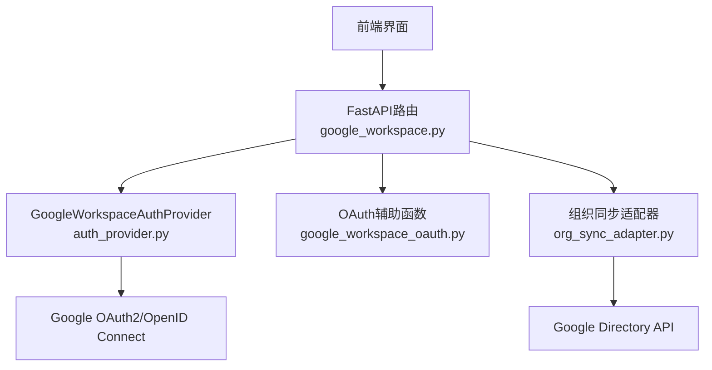
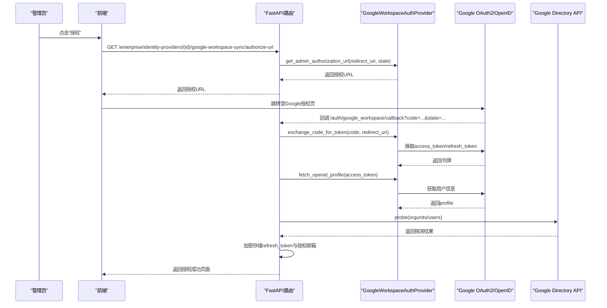
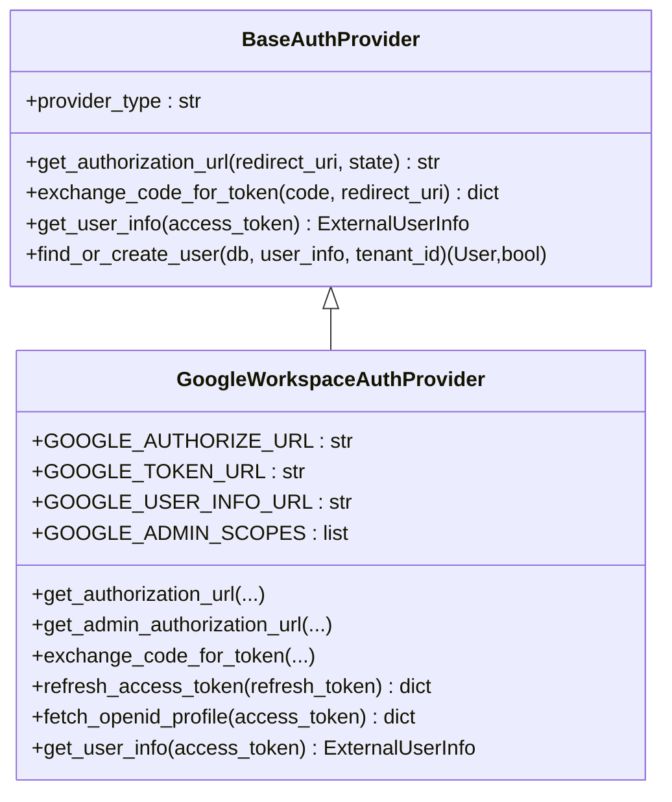
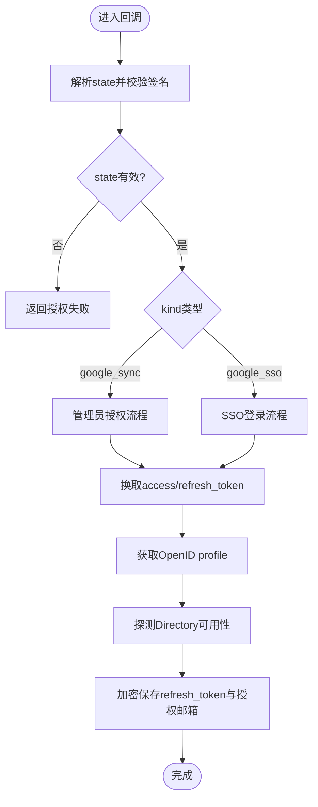
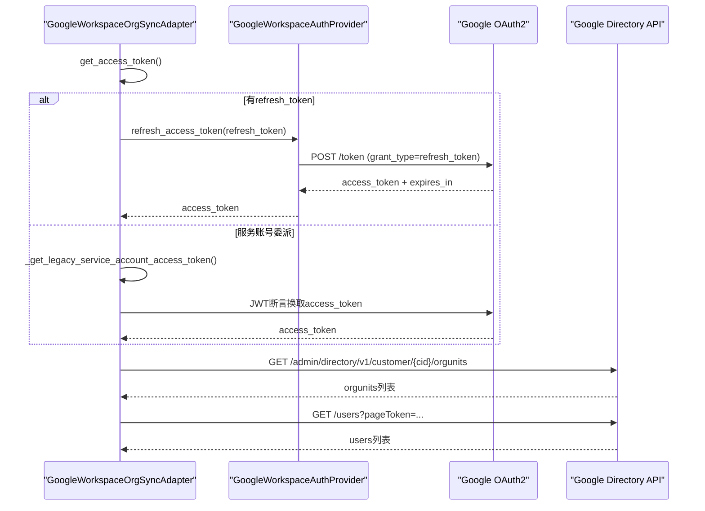
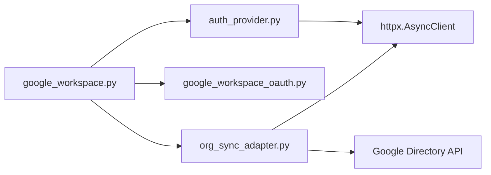

# Google API集成

<cite>
**本文引用的文件**   
- [backend/app/api/google_workspace.py](file://backend/app/api/google_workspace.py)
- [backend/app/services/google_workspace_oauth.py](file://backend/app/services/google_workspace_oauth.py)
- [backend/app/services/auth_provider.py](file://backend/app/services/auth_provider.py)
- [backend/app/services/org_sync_adapter.py](file://backend/app/services/org_sync_adapter.py)
</cite>

## 目录
1. [简介](#简介)
2. [项目结构](#项目结构)
3. [核心组件](#核心组件)
4. [架构总览](#架构总览)
5. [详细组件分析](#详细组件分析)
6. [依赖关系分析](#依赖关系分析)
7. [性能与限流](#性能与限流)
8. [故障排查指南](#故障排查指南)
9. [结论](#结论)
10. [附录：接口规范与示例](#附录接口规范与示例)

## 简介
本技术文档聚焦于Clawith平台与Google Workspace的集成现状与扩展方向。当前代码库已实现：
- Google Workspace SSO登录（OpenID Connect）
- 管理员授权与组织目录同步（Directory API，只读）
- OAuth状态签名与回调统一处理、刷新令牌管理与探测校验

尚未实现的Google Workspace服务API包括Gmail、Drive、Calendar、Docs等。本文在梳理现有实现的基础上，给出后续扩展的技术建议、权限与限流策略、批量与实时同步方案、错误重试机制以及密钥管理与调试工具使用指南，帮助团队安全、高效地补齐能力。

## 项目结构
Google Workspace相关能力主要分布在后端服务的API路由与OAuth/SSO服务层：
- API路由层：负责接收前端请求、构造授权URL、处理回调、保存管理员授权结果
- OAuth/SSO服务层：封装Google OAuth流程、状态签名、回调解析、用户信息获取、刷新令牌
- 组织同步适配器：基于管理员授权或兼容的服务账号委派模式，调用Directory API拉取部门与用户

**图表来源** 
- [backend/app/api/google_workspace.py:1-54](file://backend/app/api/google_workspace.py#L1-L54)
- [backend/app/services/auth_provider.py:637-756](file://backend/app/services/auth_provider.py#L637-L756)
- [backend/app/services/google_workspace_oauth.py:1-45](file://backend/app/services/google_workspace_oauth.py#L1-L45)
- [backend/app/services/org_sync_adapter.py:1344-1422](file://backend/app/services/org_sync_adapter.py#L1344-L1422)

**章节来源**
- [backend/app/api/google_workspace.py:1-54](file://backend/app/api/google_workspace.py#L1-L54)
- [backend/app/services/google_workspace_oauth.py:1-45](file://backend/app/services/google_workspace_oauth.py#L1-L45)
- [backend/app/services/auth_provider.py:637-756](file://backend/app/services/auth_provider.py#L637-L756)
- [backend/app/services/org_sync_adapter.py:1344-1422](file://backend/app/services/org_sync_adapter.py#L1344-L1422)

## 核心组件
- GoogleWorkspaceAuthProvider：封装Google OAuth2/OpenID Connect流程，支持生成授权URL、交换令牌、刷新令牌、获取用户信息；同时提供管理员授权范围以启用Directory读取权限。
- google_workspace_oauth：提供统一的回调路径、state签名与解析、重定向URI计算、Directory连通性探测。
- GoogleWorkspaceOrgSyncAdapter：组织同步适配器，优先使用管理员授权的refresh token刷新access token，兼容旧版服务账号委派模式；分页拉取部门与用户并映射到内部组织模型。

关键职责边界清晰：
- 路由层仅做鉴权、参数校验、流程编排与持久化
- 认证提供者专注OAuth交互与用户信息标准化
- 同步适配器专注外部数据拉取、转换与落库

**章节来源**
- [backend/app/services/auth_provider.py:637-756](file://backend/app/services/auth_provider.py#L637-L756)
- [backend/app/services/google_workspace_oauth.py:1-45](file://backend/app/services/google_workspace_oauth.py#L1-L45)
- [backend/app/services/org_sync_adapter.py:1344-1422](file://backend/app/services/org_sync_adapter.py#L1344-L1422)

## 架构总览
下图展示从前端触发管理员授权到完成目录同步的整体流程，涵盖OAuth回调、令牌刷新、Directory探测与数据拉取。

**图表来源** 
- [backend/app/api/google_workspace.py:35-54](file://backend/app/api/google_workspace.py#L35-L54)
- [backend/app/api/google_workspace.py:191-217](file://backend/app/api/google_workspace.py#L191-L217)
- [backend/app/services/auth_provider.py:697-756](file://backend/app/services/auth_provider.py#L697-L756)
- [backend/app/services/google_workspace_oauth.py:95-113](file://backend/app/services/google_workspace_oauth.py#L95-L113)

## 详细组件分析

### 组件A：GoogleWorkspaceAuthProvider（认证与令牌管理）
- 功能要点
  - 构建SSO与管理员授权URL，支持不同scope与prompt/access_type
  - 交换授权码为access_token，必要时返回refresh_token
  - 刷新access_token，避免频繁重新授权
  - 通过OpenID Connect获取用户信息，标准化为ExternalUserInfo
- 设计模式
  - 继承BaseAuthProvider，统一多身份提供方抽象
  - 配置来源于IdentityProvider记录或传入config字典
- 错误处理
  - 网络异常与HTTP错误均抛出异常，由上层捕获并返回友好提示
- 性能考虑
  - 使用httpx异步客户端，设置超时与可选代理
  - refresh_access_token复用client_id/client_secret，避免重复配置

**图表来源** 
- [backend/app/services/auth_provider.py:44-100](file://backend/app/services/auth_provider.py#L44-L100)
- [backend/app/services/auth_provider.py:637-756](file://backend/app/services/auth_provider.py#L637-L756)

**章节来源**
- [backend/app/services/auth_provider.py:637-756](file://backend/app/services/auth_provider.py#L637-L756)

### 组件B：OAuth辅助与回调处理（google_workspace_oauth）
- 功能要点
  - 定义统一回调路径与state签名/解析，防止CSRF与篡改
  - 根据租户与请求上下文计算重定向URI
  - 提供Directory连通性探测（orgunits/users），用于快速验证管理员授权有效性
- 安全要点
  - HMAC-SHA256对state进行签名，严格校验长度与类型
  - 支持HTTP代理配置，便于企业网络环境访问Google服务

**图表来源** 
- [backend/app/services/google_workspace_oauth.py:25-61](file://backend/app/services/google_workspace_oauth.py#L25-L61)
- [backend/app/services/google_workspace_oauth.py:86-93](file://backend/app/services/google_workspace_oauth.py#L86-L93)
- [backend/app/services/google_workspace_oauth.py:95-113](file://backend/app/services/google_workspace_oauth.py#L95-L113)

**章节来源**
- [backend/app/services/google_workspace_oauth.py:25-61](file://backend/app/services/google_workspace_oauth.py#L25-L61)
- [backend/app/services/google_workspace_oauth.py:86-93](file://backend/app/services/google_workspace_oauth.py#L86-L93)
- [backend/app/services/google_workspace_oauth.py:95-113](file://backend/app/services/google_workspace_oauth.py#L95-L113)

### 组件C：组织同步适配器（GoogleWorkspaceOrgSyncAdapter）
- 功能要点
  - 优先使用管理员授权的refresh_token刷新access_token
  - 兼容旧版服务账号委派模式（RS256 JWT断言）
  - 分页拉取部门与用户，映射到内部组织模型，保留原始数据便于审计
- 数据流
  - fetch_departments：拉取orgunits，构建路径与显示名称映射
  - fetch_users：按customer分页拉取用户，提取主邮箱、头像、职位、手机号、状态等
- 错误处理
  - HTTP错误直接抛出异常，包含响应体便于定位问题
  - 缺少必要配置时抛出明确错误（如未授权、缺省client_id/secret）

**图表来源** 
- [backend/app/services/org_sync_adapter.py:1410-1483](file://backend/app/services/org_sync_adapter.py#L1410-L1483)
- [backend/app/services/org_sync_adapter.py:1485-1537](file://backend/app/services/org_sync_adapter.py#L1485-L1537)
- [backend/app/services/org_sync_adapter.py:1539-1600](file://backend/app/services/org_sync_adapter.py#L1539-L1600)

**章节来源**
- [backend/app/services/org_sync_adapter.py:1410-1483](file://backend/app/services/org_sync_adapter.py#L1410-L1483)
- [backend/app/services/org_sync_adapter.py:1485-1537](file://backend/app/services/org_sync_adapter.py#L1485-L1537)
- [backend/app/services/org_sync_adapter.py:1539-1600](file://backend/app/services/org_sync_adapter.py#L1539-L1600)

## 依赖关系分析
- 路由层依赖认证提供者与OAuth辅助函数，完成授权URL生成与回调处理
- 认证提供者依赖httpx与OpenID Connect端点，不直接访问业务API
- 同步适配器依赖认证提供者进行令牌刷新，并直接调用Directory API
- 所有对外HTTP请求均通过httpx异步客户端，支持代理与超时控制

**图表来源** 
- [backend/app/api/google_workspace.py:1-54](file://backend/app/api/google_workspace.py#L1-L54)
- [backend/app/services/auth_provider.py:637-756](file://backend/app/services/auth_provider.py#L637-L756)
- [backend/app/services/google_workspace_oauth.py:1-45](file://backend/app/services/google_workspace_oauth.py#L1-L45)
- [backend/app/services/org_sync_adapter.py:1344-1422](file://backend/app/services/org_sync_adapter.py#L1344-L1422)

**章节来源**
- [backend/app/api/google_workspace.py:1-54](file://backend/app/api/google_workspace.py#L1-L54)
- [backend/app/services/auth_provider.py:637-756](file://backend/app/services/auth_provider.py#L637-L756)
- [backend/app/services/google_workspace_oauth.py:1-45](file://backend/app/services/google_workspace_oauth.py#L1-L45)
- [backend/app/services/org_sync_adapter.py:1344-1422](file://backend/app/services/org_sync_adapter.py#L1344-L1422)

## 性能与限流
- 令牌缓存
  - 适配器维护内存中的access_token与过期时间，减少刷新频率
- 分页与批处理
  - Directory API采用pageToken分页，适配器循环拉取直至无下一页
- 并发与超时
  - httpx异步客户端设置超时，避免阻塞；可结合队列与限流器控制并发
- 限流策略建议
  - 针对Directory API实施指数退避重试（429/5xx）
  - 限制每秒请求数，避免触发Google配额限制
  - 对大批量拉取任务分片执行，降低单次负载

[本节为通用指导，无需特定文件引用]

## 故障排查指南
- 常见问题
  - 未返回refresh_token：需重新授权并确保offline与consent参数正确
  - Directory探测失败：检查管理员权限、customer_id与网络代理
  - 令牌刷新失败：确认client_id/secret与refresh_token有效且未被撤销
- 日志与诊断
  - 查看回调处理与令牌交换的错误日志
  - 打印Directory响应体以便定位具体错误码
- 恢复步骤
  - 重新执行管理员授权流程
  - 清理失效的refresh_token并重新保存
  - 调整重试与超时参数后再次尝试

**章节来源**
- [backend/app/api/google_workspace.py:140-188](file://backend/app/api/google_workspace.py#L140-L188)
- [backend/app/services/google_workspace_oauth.py:95-113](file://backend/app/services/google_workspace_oauth.py#L95-L113)
- [backend/app/services/org_sync_adapter.py:1466-1483](file://backend/app/services/org_sync_adapter.py#L1466-L1483)

## 结论
当前Clawith平台已具备Google Workspace的SSO登录与组织目录同步能力，为后续扩展Gmail、Drive、Calendar、Docs等服务奠定了坚实基础。建议在现有OAuth与令牌管理机制上，按服务维度新增专用适配器，遵循相同的权限、限流与错误处理规范，逐步完善企业级集成能力。

[本节为总结性内容，无需特定文件引用]

## 附录：接口规范与示例

### 管理员授权与回调
- 获取管理员授权URL
  - 方法：GET
  - 路径：/enterprise/identity-providers/{provider_id}/google-workspace-sync/authorize-url
  - 说明：返回authorization_url供前端跳转
- 统一回调处理
  - 路径：/auth/google_workspace/callback
  - 参数：code、state
  - 说明：根据state_kind区分管理员授权与SSO登录流程

**章节来源**
- [backend/app/api/google_workspace.py:35-54](file://backend/app/api/google_workspace.py#L35-L54)
- [backend/app/api/google_workspace.py:191-217](file://backend/app/api/google_workspace.py#L191-L217)

### 组织同步（Directory API）
- 拉取部门
  - 端点：GET /admin/directory/v1/customer/{customer_id}/orgunits?type=all
  - 权限：admin.directory.orgunit.readonly
  - 说明：返回organizationUnits列表，构建路径映射
- 拉取用户
  - 端点：GET /admin/directory/v1/users?customer={customer_id}&maxResults=500&pageToken=...
  - 权限：admin.directory.user.readonly
  - 说明：分页拉取用户，提取邮箱、头像、职位、手机号、状态等

**章节来源**
- [backend/app/services/org_sync_adapter.py:1485-1537](file://backend/app/services/org_sync_adapter.py#L1485-L1537)
- [backend/app/services/org_sync_adapter.py:1539-1600](file://backend/app/services/org_sync_adapter.py#L1539-L1600)

### 后续扩展建议（Gmail/Drive/Calendar/Docs）
- 权限与Scope
  - Gmail：https://www.googleapis.com/auth/gmail.modify（读写）
  - Drive：https://www.googleapis.com/auth/drive（读写）
  - Calendar：https://www.googleapis.com/auth/calendar.events（事件读写）
  - Docs：https://www.googleapis.com/auth/documents（文档读写）
- 令牌管理
  - 复用现有refresh_access_token机制，按服务维度存储与刷新
- 批量与实时
  - 批量操作：使用Batch API或并行请求+限流
  - 实时同步：监听变更流（如Drive Change API、Gmail Watch、Calendar Events List with syncToken）
- 错误重试
  - 指数退避重试，处理429/5xx；对幂等操作进行去重
- 密钥与配额监控
  - 将refresh_token加密存储；监控配额使用率与错误率，设置告警

[本节为扩展建议，无需特定文件引用]