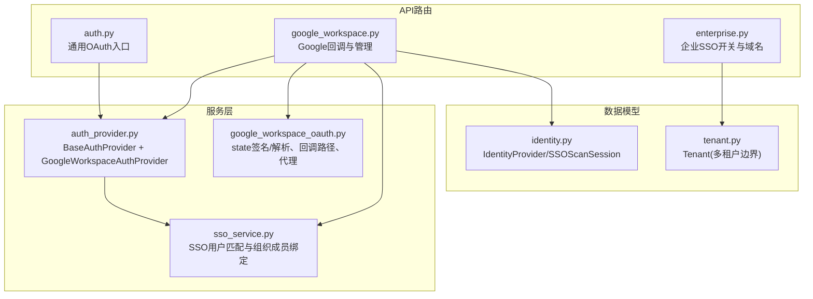
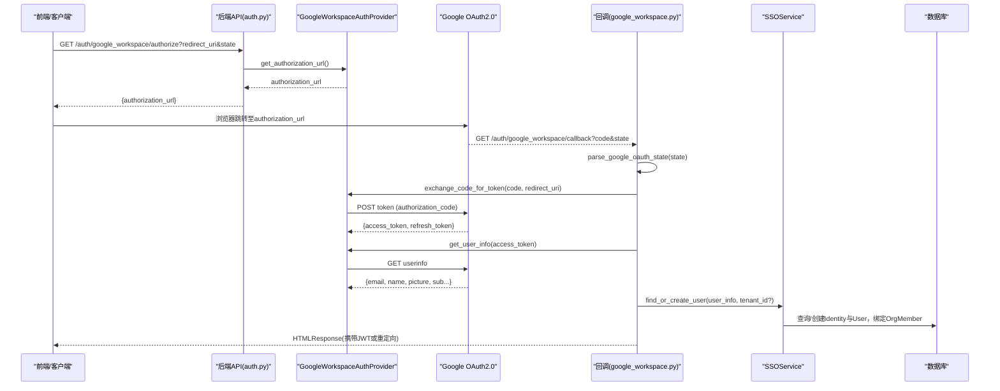
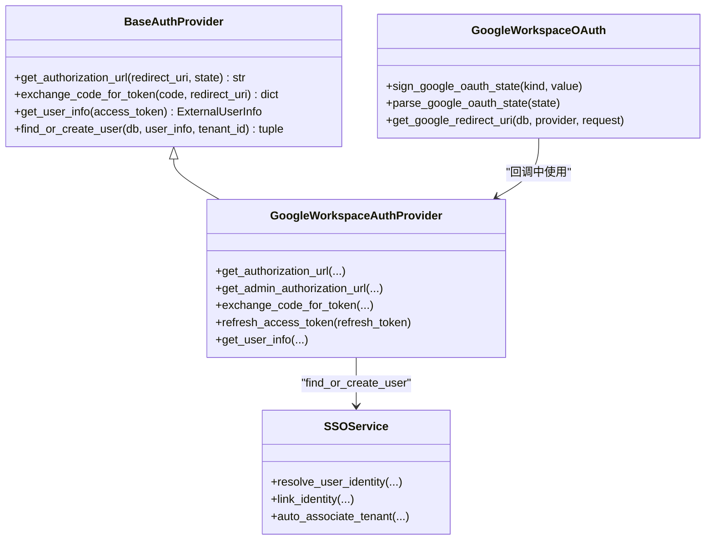

# Google OAuth2.0认证

<cite>
**本文引用的文件**   
- [backend/app/api/auth.py](file://backend/app/api/auth.py)
- [backend/app/api/google_workspace.py](file://backend/app/api/google_workspace.py)
- [backend/app/services/auth_provider.py](file://backend/app/services/auth_provider.py)
- [backend/app/services/google_workspace_oauth.py](file://backend/app/services/google_workspace_oauth.py)
- [backend/app/services/sso_service.py](file://backend/app/services/sso_service.py)
- [backend/app/models/identity.py](file://backend/app/models/identity.py)
- [backend/app/models/tenant.py](file://backend/app/models/tenant.py)
- [backend/app/api/enterprise.py](file://backend/app/api/enterprise.py)
</cite>

## 目录
1. [简介](#简介)
2. [项目结构](#项目结构)
3. [核心组件](#核心组件)
4. [架构总览](#架构总览)
5. [详细组件分析](#详细组件分析)
6. [依赖关系分析](#依赖关系分析)
7. [性能与可靠性](#性能与可靠性)
8. [故障排查指南](#故障排查指南)
9. [结论](#结论)
10. [附录：API定义与安全清单](#附录api定义与安全清单)

## 简介
本文件为Clawith平台的Google OAuth2.0认证系统提供完整的API文档，覆盖以下要点：
- 授权码流程（Authorization Code）与管理员授权（Admin Consent）
- 用户SSO登录流程（含多租户自动归属）
- authorize-url端点的请求参数、响应格式与错误处理
- state参数的签名验证、回调处理与令牌交换过程
- 多租户权限隔离、重定向URI配置与安全考虑
- 完整流程图与常见问题解决方案

## 项目结构
围绕Google Workspace OAuth2.0的关键代码分布在后端API与服务层：
- API路由：统一OAuth入口、Google Workspace回调、企业级管理接口
- 服务层：通用认证提供者框架、Google Workspace具体实现、SSO服务、状态签名与回调工具
- 模型：身份提供者、租户边界等

**图表来源**
- [backend/app/api/auth.py:894-917](file://backend/app/api/auth.py#L894-L917)
- [backend/app/api/google_workspace.py:35-54](file://backend/app/api/google_workspace.py#L35-L54)
- [backend/app/services/auth_provider.py:637-756](file://backend/app/services/auth_provider.py#L637-L756)
- [backend/app/services/google_workspace_oauth.py:19-93](file://backend/app/services/google_workspace_oauth.py#L19-L93)
- [backend/app/services/sso_service.py:183-226](file://backend/app/services/sso_service.py#L183-L226)
- [backend/app/models/identity.py:29-47](file://backend/app/models/identity.py#L29-L47)
- [backend/app/models/tenant.py:13-28](file://backend/app/models/tenant.py#L13-L28)

**章节来源**
- [backend/app/api/auth.py:894-917](file://backend/app/api/auth.py#L894-L917)
- [backend/app/api/google_workspace.py:35-54](file://backend/app/api/google_workspace.py#L35-L54)
- [backend/app/services/auth_provider.py:637-756](file://backend/app/services/auth_provider.py#L637-L756)
- [backend/app/services/google_workspace_oauth.py:19-93](file://backend/app/services/google_workspace_oauth.py#L19-L93)
- [backend/app/services/sso_service.py:183-226](file://backend/app/services/sso_service.py#L183-L226)
- [backend/app/models/identity.py:29-47](file://backend/app/models/identity.py#L29-L47)
- [backend/app/models/tenant.py:13-28](file://backend/app/models/tenant.py#L13-L28)

## 核心组件
- BaseAuthProvider抽象基类：定义授权URL生成、code换token、获取用户信息、find_or_create_user等标准能力。
- GoogleWorkspaceAuthProvider：实现Google Workspace的授权URL构建（用户与管理员两种模式）、code换token、刷新token、OpenID userinfo拉取。
- SSOService：基于OrgMember进行外部身份解析、邮箱/手机号匹配、自动租户关联、身份绑定与去绑。
- google_workspace_oauth：state签名/解析、回调路径常量、动态计算redirect_uri、Google目录探测。
- API路由：
  - /auth/{provider}/authorize：通用授权入口，返回authorization_url
  - /auth/google_workspace/callback：统一回调，区分SSO与管理员同步
  - /enterprise/.../google-workspace-sync/authorize-url：管理员授权URL生成

**章节来源**
- [backend/app/services/auth_provider.py:44-96](file://backend/app/services/auth_provider.py#L44-L96)
- [backend/app/services/auth_provider.py:637-756](file://backend/app/services/auth_provider.py#L637-L756)
- [backend/app/services/sso_service.py:183-226](file://backend/app/services/sso_service.py#L183-L226)
- [backend/app/services/google_workspace_oauth.py:19-93](file://backend/app/services/google_workspace_oauth.py#L19-L93)
- [backend/app/api/auth.py:894-917](file://backend/app/api/auth.py#L894-L917)
- [backend/app/api/google_workspace.py:35-54](file://backend/app/api/google_workspace.py#L35-L54)

## 架构总览
下图展示Google Workspace OAuth2.0在Clawith中的端到端交互：前端触发授权、Google鉴权、回调到后端、code换token、拉取用户信息、创建或匹配用户、签发JWT并返回。

**图表来源**
- [backend/app/api/auth.py:894-917](file://backend/app/api/auth.py#L894-L917)
- [backend/app/services/auth_provider.py:688-704](file://backend/app/services/auth_provider.py#L688-L704)
- [backend/app/services/auth_provider.py:706-756](file://backend/app/services/auth_provider.py#L706-L756)
- [backend/app/api/google_workspace.py:191-217](file://backend/app/api/google_workspace.py#L191-L217)
- [backend/app/services/google_workspace_oauth.py:38-61](file://backend/app/services/google_workspace_oauth.py#L38-L61)
- [backend/app/services/sso_service.py:183-226](file://backend/app/services/sso_service.py#L183-L226)

## 详细组件分析

### 通用授权入口 /auth/{provider}/authorize
- 功能：根据provider类型生成授权URL，供前端引导用户跳转至第三方授权页面。
- 关键逻辑：
  - 通过注册表获取对应provider实例
  - 调用provider.get_authorization_url(redirect_uri, state)
  - 返回{authorization_url}
- 错误处理：
  - provider不存在：404
  - 生成失败：500或501（未实现）

**章节来源**
- [backend/app/api/auth.py:894-917](file://backend/app/api/auth.py#L894-L917)

### Google Workspace 管理员授权 URL /enterprise/.../google-workspace-sync/authorize-url
- 功能：为管理员授权Google Workspace目录读取权限，生成管理员同意授权URL。
- 输入：
  - provider_id：标识已配置的Google Workspace身份提供者
  - request：用于计算当前租户的redirect_uri
- 输出：
  - {authorization_url}：指向Google管理员同意页面的链接
- 校验：
  - 仅平台管理员或该provider所属租户的管理员可访问
  - 必须已保存Client ID与Secret
- 内部流程：
  - 构造Google管理员授权URL（offline access、consent prompt、admin scopes）
  - state使用sign_google_oauth_state(GOOGLE_SYNC_STATE_KIND, provider_id)签名

**章节来源**
- [backend/app/api/google_workspace.py:35-54](file://backend/app/api/google_workspace.py#L35-L54)
- [backend/app/services/auth_provider.py:697-704](file://backend/app/services/auth_provider.py#L697-L704)
- [backend/app/services/google_workspace_oauth.py:30-31](file://backend/app/services/google_workspace_oauth.py#L30-L31)

### Google Workspace 统一回调 /auth/google_workspace/callback
- 功能：统一处理SSO登录与管理员同步两类回调。
- 输入：
  - code：Google返回的授权码
  - state：经签名校验的状态值（支持SSO与同步两种kind）
- 处理分支：
  - GOOGLE_SYNC_STATE_KIND：管理员同步流程，交换token并存储refresh_token，探测目录权限
  - GOOGLE_SSO_STATE_KIND：SSO登录流程，交换token、拉取userinfo、find_or_create_user、签发JWT
- 错误处理：
  - state无效：HTML错误页
  - code换token失败：记录日志并返回错误页
  - 用户解析失败：返回错误页

**章节来源**
- [backend/app/api/google_workspace.py:191-217](file://backend/app/api/google_workspace.py#L191-L217)
- [backend/app/services/google_workspace_oauth.py:38-61](file://backend/app/services/google_workspace_oauth.py#L38-L61)

### GoogleWorkspaceAuthProvider 实现要点
- 授权URL构建：
  - get_authorization_url：普通用户授权（online、select_account）
  - get_admin_authorization_url：管理员授权（offline、consent、admin scopes）
- 令牌交换：
  - exchange_code_for_token：POST https://oauth2.googleapis.com/token
  - refresh_access_token：刷新access_token
- 用户信息：
  - get_user_info：GET https://openidconnect.googleapis.com/v1/userinfo

**章节来源**
- [backend/app/services/auth_provider.py:688-704](file://backend/app/services/auth_provider.py#L688-L704)
- [backend/app/services/auth_provider.py:706-756](file://backend/app/services/auth_provider.py#L706-L756)

### SSOService 用户解析与绑定
- resolve_user_identity：通过OrgMember查找用户（unionid/open_id/external_id链式匹配）
- link_identity：将外部身份与用户绑定，必要时创建壳OrgMember并被动填充资料
- auto_associate_tenant：按邮箱域名或自定义域名自动归属租户

**章节来源**
- [backend/app/services/sso_service.py:183-226](file://backend/app/services/sso_service.py#L183-L226)
- [backend/app/services/sso_service.py:328-445](file://backend/app/services/sso_service.py#L328-L445)
- [backend/app/services/sso_service.py:142-181](file://backend/app/services/sso_service.py#L142-L181)

### state签名与回调路径
- sign_google_oauth_state：HMAC-SHA256对“kind:value”签名，返回payload:sig
- parse_google_oauth_state：校验sig、解析kind与values（UUID），限制长度与类型
- GOOGLE_CALLBACK_PATH：/auth/google_workspace/callback
- get_google_redirect_uri：根据provider所在租户或公共基础URL拼接回调地址

**章节来源**
- [backend/app/services/google_workspace_oauth.py:25-61](file://backend/app/services/google_workspace_oauth.py#L25-L61)
- [backend/app/services/google_workspace_oauth.py:86-93](file://backend/app/services/google_workspace_oauth.py#L86-L93)

### 多租户权限隔离与SSO开关
- Tenant模型作为多租户边界，所有用户与资源均受tenant_id约束
- IdentityProvider支持sso_login_enabled标志，控制是否允许SSO登录
- enterprise模块中当任一provider启用sso_login_enabled时，租户sso_enabled自动置位；IP模式下全平台仅一个租户可启用SSO

**章节来源**
- [backend/app/models/tenant.py:13-28](file://backend/app/models/tenant.py#L13-L28)
- [backend/app/models/identity.py:29-47](file://backend/app/models/identity.py#L29-L47)
- [backend/app/api/enterprise.py:1118-1146](file://backend/app/api/enterprise.py#L1118-L1146)
- [backend/app/services/sso_service.py:514-562](file://backend/app/services/sso_service.py#L514-L562)

## 依赖关系分析

**图表来源**
- [backend/app/services/auth_provider.py:44-96](file://backend/app/services/auth_provider.py#L44-L96)
- [backend/app/services/auth_provider.py:637-756](file://backend/app/services/auth_provider.py#L637-L756)
- [backend/app/services/sso_service.py:183-226](file://backend/app/services/sso_service.py#L183-L226)
- [backend/app/services/google_workspace_oauth.py:25-61](file://backend/app/services/google_workspace_oauth.py#L25-L61)

## 性能与可靠性
- 网络超时与代理：Google相关请求设置超时与HTTP_PROXY，避免阻塞与网络异常
- 事务边界：code换token、用户解析与写入尽量分离，减少长事务
- 幂等性：state签名防重放；回调中单读Redis待处理项（通用OAuth机制）确保一次性消费
- 降级策略：若敏感字段不可用（如WeCom场景），仍尽力返回可用信息；Google目录探测失败抛出明确异常

[本节为通用建议，不直接分析具体文件]

## 故障排查指南
- 常见错误与定位
  - state无效：检查state是否被篡改或过期，确认SECRET_KEY一致
  - code换token失败：核对client_id、client_secret、redirect_uri是否与Google后台一致
  - 管理员授权未返回refresh_token：需重新走consent流程
  - 用户解析失败：检查OrgMember绑定、邮箱/手机号匹配、租户归属规则
- 日志关键字
  - “Token exchange failed”、“user info fetch failed”、“Auth failed”
- 快速自检清单
  - 重定向URI是否在Google控制台白名单
  - scope是否包含openid/email/profile（SSO）或admin目录只读（管理员）
  - IP模式下的SSO独占限制是否满足

**章节来源**
- [backend/app/api/google_workspace.py:97-112](file://backend/app/api/google_workspace.py#L97-L112)
- [backend/app/services/auth_provider.py:706-756](file://backend/app/services/auth_provider.py#L706-L756)
- [backend/app/services/google_workspace_oauth.py:38-61](file://backend/app/services/google_workspace_oauth.py#L38-L61)

## 结论
Clawith的Google OAuth2.0认证体系以统一的BaseAuthProvider抽象为核心，结合严格的state签名与回调处理，实现了用户SSO登录与管理员授权的清晰分离。通过SSOService完成跨租户的用户匹配与绑定，并在enterprise模块中保障SSO开关与IP模式的合规性。整体设计兼顾安全性、可扩展性与可维护性。

[本节为总结，不直接分析具体文件]

## 附录：API定义与安全清单

### authorize-url端点（管理员授权）
- 路径：/api/enterprise/identity-providers/{provider_id}/google-workspace-sync/authorize-url
- 方法：GET
- 鉴权：需要管理员权限（平台管理员或该provider所属租户管理员）
- 请求参数：
  - provider_id：UUID，Google Workspace身份提供者ID
- 响应体：
  - authorization_url：字符串，Google管理员同意授权链接
- 错误码：
  - 400：未保存Client ID/Secret
  - 403：无权限访问该provider
  - 404：provider不存在

**章节来源**
- [backend/app/api/google_workspace.py:35-54](file://backend/app/api/google_workspace.py#L35-L54)

### 通用授权入口
- 路径：/api/auth/{provider}/authorize
- 方法：GET
- 请求参数：
  - provider：字符串，认证提供方名称（如google_workspace）
  - redirect_uri：字符串，回调地址
  - state：字符串，CSRF状态（可选，由上层生成）
- 响应体：
  - authorization_url：字符串，第三方授权链接
- 错误码：
  - 404：provider不支持
  - 501：provider未实现授权URL生成
  - 500：生成授权URL失败

**章节来源**
- [backend/app/api/auth.py:894-917](file://backend/app/api/auth.py#L894-L917)

### 统一回调
- 路径：/api/auth/google_workspace/callback
- 方法：GET
- 请求参数：
  - code：字符串，授权码
  - state：字符串，经签名的状态（区分SSO与管理员同步）
- 响应体：
  - HTML页面（成功则显示登录结果或重定向；失败则显示错误信息）
- 错误处理：
  - state无效：返回错误页
  - code换token失败：记录日志并返回错误页
  - 用户解析失败：返回错误页

**章节来源**
- [backend/app/api/google_workspace.py:191-217](file://backend/app/api/google_workspace.py#L191-L217)

### 安全清单
- state签名：HMAC-SHA256，SECRET_KEY参与签名，禁止明文传递
- redirect_uri：动态计算且严格匹配Google后台配置
- scope最小化：SSO使用openid/email/profile；管理员授权使用只读目录scope
- 网络防护：设置超时与HTTP_PROXY，避免阻塞与泄露
- 多租户隔离：所有用户与资源受tenant_id约束，SSO自动归属遵循邮箱域名与自定义域名规则

**章节来源**
- [backend/app/services/google_workspace_oauth.py:25-61](file://backend/app/services/google_workspace_oauth.py#L25-L61)
- [backend/app/services/google_workspace_oauth.py:86-93](file://backend/app/services/google_workspace_oauth.py#L86-L93)
- [backend/app/services/auth_provider.py:637-756](file://backend/app/services/auth_provider.py#L637-L756)
- [backend/app/services/sso_service.py:142-181](file://backend/app/services/sso_service.py#L142-L181)