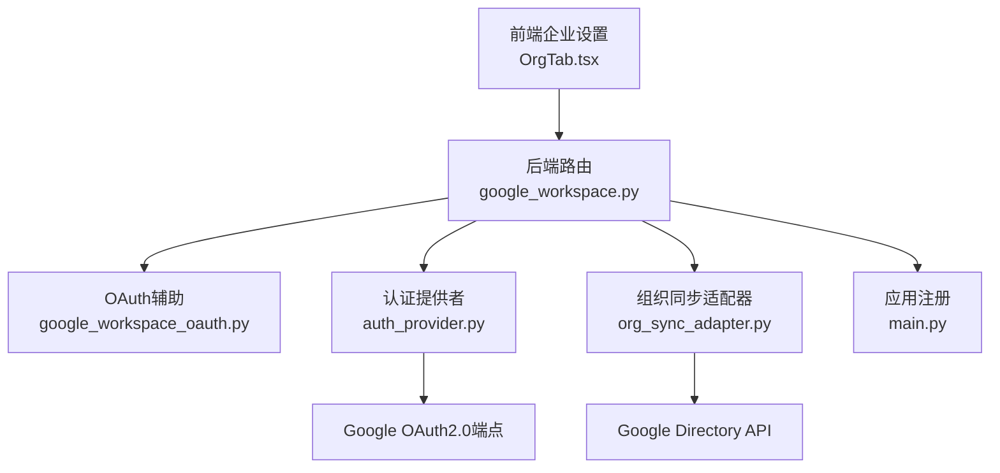
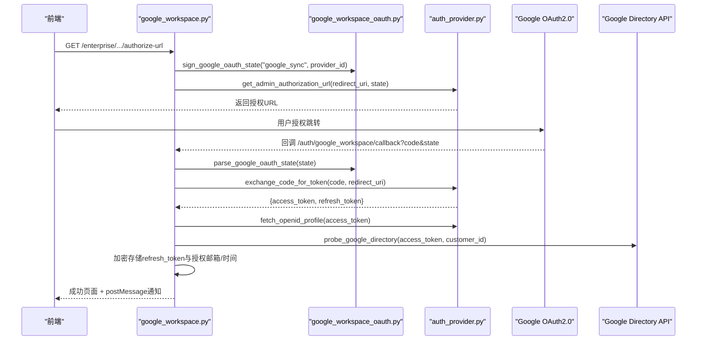
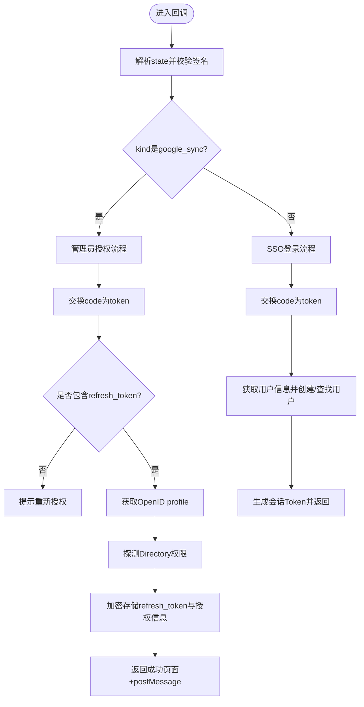
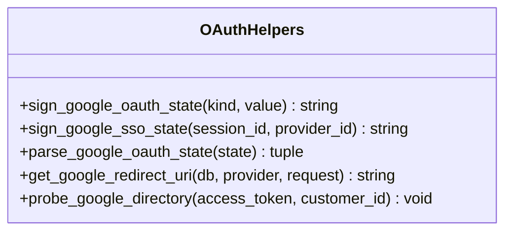
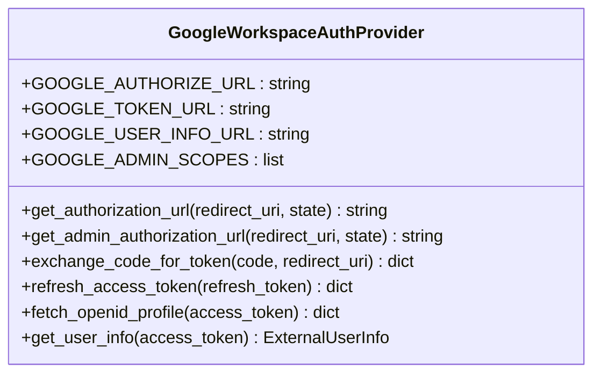
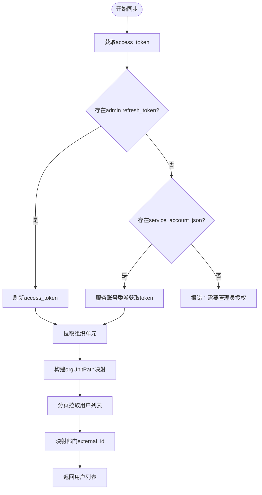
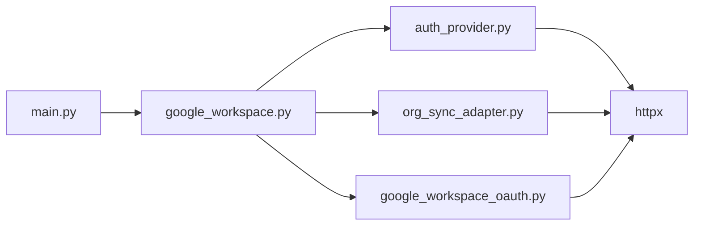

# Google Workspace集成接口

<cite>
**本文引用的文件**   
- [backend/app/api/google_workspace.py](file://backend/app/api/google_workspace.py)
- [backend/app/services/google_workspace_oauth.py](file://backend/app/services/google_workspace_oauth.py)
- [backend/app/services/auth_provider.py](file://backend/app/services/auth_provider.py)
- [backend/app/services/org_sync_adapter.py](file://backend/app/services/org_sync_adapter.py)
- [backend/app/main.py](file://backend/app/main.py)
- [backend/app/models/identity.py](file://backend/app/models/identity.py)
- [frontend/src/pages/enterprise-settings/tabs/OrgTab.tsx](file://frontend/src/pages/enterprise-settings/tabs/OrgTab.tsx)
</cite>

## 目录
1. [简介](#简介)
2. [项目结构](#项目结构)
3. [核心组件](#核心组件)
4. [架构总览](#架构总览)
5. [详细组件分析](#详细组件分析)
6. [依赖关系分析](#依赖关系分析)
7. [性能与配额管理](#性能与配额管理)
8. [故障排查指南](#故障排查指南)
9. [结论](#结论)
10. [附录](#附录)

## 简介
本文件为Clawith平台与Google Workspace集成的API文档，覆盖以下关键能力：
- Google OAuth2.0认证流程（用户SSO登录、管理员授权）
- API权限管理与Scope控制
- 令牌刷新机制（refresh_token）
- 组织目录同步（Directory API）
- 邮件处理、文件操作、日程管理等能力的集成方式与扩展点
- 批量操作、实时同步、冲突处理的实现方案
- 配额管理、错误恢复、审计日志等企业级特性说明

## 项目结构
Google Workspace集成相关代码主要分布在后端API路由、OAuth辅助服务、认证提供者实现以及组织同步适配器中。前端企业设置页面提供Client ID/Secret配置入口。

**图表来源** 
- [backend/app/api/google_workspace.py:1-217](file://backend/app/api/google_workspace.py#L1-L217)
- [backend/app/services/google_workspace_oauth.py:1-113](file://backend/app/services/google_workspace_oauth.py#L1-L113)
- [backend/app/services/auth_provider.py:640-839](file://backend/app/services/auth_provider.py#L640-L839)
- [backend/app/services/org_sync_adapter.py:1344-1657](file://backend/app/services/org_sync_adapter.py#L1344-L1657)
- [backend/app/main.py:403-446](file://backend/app/main.py#L403-L446)
- [frontend/src/pages/enterprise-settings/tabs/OrgTab.tsx:705-720](file://frontend/src/pages/enterprise-settings/tabs/OrgTab.tsx#L705-L720)

**章节来源**
- [backend/app/api/google_workspace.py:1-217](file://backend/app/api/google_workspace.py#L1-L217)
- [backend/app/services/google_workspace_oauth.py:1-113](file://backend/app/services/google_workspace_oauth.py#L1-L113)
- [backend/app/services/auth_provider.py:640-839](file://backend/app/services/auth_provider.py#L640-L839)
- [backend/app/services/org_sync_adapter.py:1344-1657](file://backend/app/services/org_sync_adapter.py#L1344-L1657)
- [backend/app/main.py:403-446](file://backend/app/main.py#L403-L446)
- [frontend/src/pages/enterprise-settings/tabs/OrgTab.tsx:705-720](file://frontend/src/pages/enterprise-settings/tabs/OrgTab.tsx#L705-L720)

## 核心组件
- Google Workspace OAuth回调路由：统一处理SSO登录与管理员授权的回调，解析state并分发到对应处理器。
- OAuth辅助函数：负责state签名/校验、重定向URI生成、Directory探测等。
- 认证提供者：封装Google OAuth2.0的授权URL构建、code换token、refresh token、OpenID Profile获取。
- 组织同步适配器：基于admin refresh token或兼容的服务账号委派模式，拉取组织单元与用户列表，完成目录同步。
- 应用路由注册：将Google Workspace路由挂载到API前缀下。

**章节来源**
- [backend/app/api/google_workspace.py:1-217](file://backend/app/api/google_workspace.py#L1-L217)
- [backend/app/services/google_workspace_oauth.py:1-113](file://backend/app/services/google_workspace_oauth.py#L1-L113)
- [backend/app/services/auth_provider.py:640-839](file://backend/app/services/auth_provider.py#L640-L839)
- [backend/app/services/org_sync_adapter.py:1344-1657](file://backend/app/services/org_sync_adapter.py#L1344-L1657)
- [backend/app/main.py:403-446](file://backend/app/main.py#L403-L446)

## 架构总览
下图展示了从前端触发管理员授权到后端回调、再到存储refresh token与验证Directory访问的完整流程。

**图表来源** 
- [backend/app/api/google_workspace.py:35-54](file://backend/app/api/google_workspace.py#L35-L54)
- [backend/app/api/google_workspace.py:140-188](file://backend/app/api/google_workspace.py#L140-L188)
- [backend/app/services/google_workspace_oauth.py:30-61](file://backend/app/services/google_workspace_oauth.py#L30-L61)
- [backend/app/services/auth_provider.py:697-744](file://backend/app/services/auth_provider.py#L697-L744)
- [backend/app/services/google_workspace_oauth.py:95-113](file://backend/app/services/google_workspace_oauth.py#L95-L113)

## 详细组件分析

### Google Workspace OAuth回调路由
- 功能要点
  - 提供管理员授权URL获取接口，要求保存Client ID与Client Secret。
  - 统一回调路径处理SSO登录与管理员授权两种场景，通过state区分。
  - 管理员授权成功后，交换code换取access_token与refresh_token，调用OpenID获取profile，探测Directory权限，并将加密后的refresh_token与授权信息持久化。
- 关键行为
  - 使用HMAC对state进行签名与校验，防止篡改。
  - 根据tenant与provider校验访问权限。
  - 回调成功后向前端窗口发送postMessage事件以关闭弹窗并通知结果。

**图表来源** 
- [backend/app/api/google_workspace.py:191-217](file://backend/app/api/google_workspace.py#L191-L217)
- [backend/app/api/google_workspace.py:57-137](file://backend/app/api/google_workspace.py#L57-L137)
- [backend/app/api/google_workspace.py:140-188](file://backend/app/api/google_workspace.py#L140-L188)
- [backend/app/services/google_workspace_oauth.py:38-61](file://backend/app/services/google_workspace_oauth.py#L38-L61)

**章节来源**
- [backend/app/api/google_workspace.py:35-54](file://backend/app/api/google_workspace.py#L35-L54)
- [backend/app/api/google_workspace.py:191-217](file://backend/app/api/google_workspace.py#L191-L217)
- [backend/app/services/google_workspace_oauth.py:38-61](file://backend/app/services/google_workspace_oauth.py#L38-L61)

### OAuth辅助函数
- 功能要点
  - state签名与解析：支持“google_sso”和“google_sync”两种类型，严格校验长度与签名。
  - 重定向URI生成：根据租户或公共基础URL拼接回调路径。
  - Directory探测：调用组织单元与用户列表接口验证权限。

**图表来源** 
- [backend/app/services/google_workspace_oauth.py:25-61](file://backend/app/services/google_workspace_oauth.py#L25-L61)
- [backend/app/services/google_workspace_oauth.py:86-113](file://backend/app/services/google_workspace_oauth.py#L86-L113)

**章节来源**
- [backend/app/services/google_workspace_oauth.py:25-61](file://backend/app/services/google_workspace_oauth.py#L25-L61)
- [backend/app/services/google_workspace_oauth.py:86-113](file://backend/app/services/google_workspace_oauth.py#L86-L113)

### 认证提供者（GoogleWorkspaceAuthProvider）
- 功能要点
  - 构建授权URL：支持普通SSO与管理员授权两种模式，分别设置scope、access_type与prompt。
  - 交换code为token：向Google Token端点发起POST请求。
  - 刷新access_token：使用refresh_token换取新的access_token。
  - 获取OpenID Profile：携带Bearer Token调用userinfo端点。

**图表来源** 
- [backend/app/services/auth_provider.py:640-755](file://backend/app/services/auth_provider.py#L640-L755)

**章节来源**
- [backend/app/services/auth_provider.py:640-755](file://backend/app/services/auth_provider.py#L640-L755)

### 组织同步适配器（GoogleWorkspaceOrgSyncAdapter）
- 功能要点
  - 优先使用admin refresh token获取access_token；若不存在则回退至服务账号委派模式（兼容性）。
  - 拉取组织单元树，映射orgUnitPath到external_id与显示路径。
  - 分页拉取用户列表，提取主邮箱、头像、职位、部门、状态等信息。
  - 缓存access_token并在过期前复用。

**图表来源** 
- [backend/app/services/org_sync_adapter.py:1410-1483](file://backend/app/services/org_sync_adapter.py#L1410-L1483)
- [backend/app/services/org_sync_adapter.py:1485-1537](file://backend/app/services/org_sync_adapter.py#L1485-L1537)
- [backend/app/services/org_sync_adapter.py:1539-1600](file://backend/app/services/org_sync_adapter.py#L1539-L1600)

**章节来源**
- [backend/app/services/org_sync_adapter.py:1344-1657](file://backend/app/services/org_sync_adapter.py#L1344-L1657)

### 前端企业设置（Google OAuth配置）
- 功能要点
  - 提供Client ID与Client Secret输入框，用于SSO与管理员授权共用同一套凭证。
  - 界面文案提示Google Workspace使用单一Client ID/Secret。

**章节来源**
- [frontend/src/pages/enterprise-settings/tabs/OrgTab.tsx:705-720](file://frontend/src/pages/enterprise-settings/tabs/OrgTab.tsx#L705-L720)

## 依赖关系分析
- 路由注册：google_workspace路由在应用启动时被挂载到API前缀下。
- 模型依赖：IdentityProvider标识provider_type为google_workspace。
- 外部依赖：httpx用于HTTP请求，Google OAuth2.0与Directory API为外部服务。

**图表来源** 
- [backend/app/main.py:403-446](file://backend/app/main.py#L403-L446)
- [backend/app/models/identity.py:20](file://backend/app/models/identity.py#L20)

**章节来源**
- [backend/app/main.py:403-446](file://backend/app/main.py#L403-L446)
- [backend/app/models/identity.py:20](file://backend/app/models/identity.py#L20)

## 性能与配额管理
- 令牌缓存
  - access_token在内存中缓存并在过期前复用，减少频繁刷新开销。
- 批量拉取
  - 用户列表采用分页（maxResults=500），避免单次请求过大。
- 超时与代理
  - 所有HTTP请求设置超时与可选代理，提升稳定性。
- 配额建议
  - Directory API存在速率限制，建议在后台任务中限流与重试。
  - 合理设置并发与重试退避策略，避免触发配额上限。

[本节为通用指导，不直接分析具体文件]

## 故障排查指南
- 常见错误
  - 未保存Client ID/Secret：获取授权URL时返回400。
  - refresh_token缺失：回调后提示需重新授权。
  - Directory探测失败：组织单元或用户接口返回错误。
  - 服务账号委派失败：缺少必要字段或委派邮箱未配置。
- 定位方法
  - 检查state签名解析是否成功。
  - 查看token交换响应与错误描述。
  - 确认租户与provider归属校验通过。
  - 检查加密存储的refresh_token解密是否成功。

**章节来源**
- [backend/app/api/google_workspace.py:46-54](file://backend/app/api/google_workspace.py#L46-L54)
- [backend/app/api/google_workspace.py:152-176](file://backend/app/api/google_workspace.py#L152-L176)
- [backend/app/services/google_workspace_oauth.py:95-113](file://backend/app/services/google_workspace_oauth.py#L95-L113)
- [backend/app/services/org_sync_adapter.py:1423-1464](file://backend/app/services/org_sync_adapter.py#L1423-L1464)

## 结论
本集成实现了Google Workspace的OAuth2.0认证、管理员授权与组织目录同步的核心能力，具备完善的state安全校验、令牌刷新与权限探测机制。后续可扩展Gmail、Drive、Calendar、Docs等服务，复用统一的OAuth与令牌管理机制，并通过适配器模式接入更多企业级能力。

[本节为总结性内容，不直接分析具体文件]

## 附录
- 扩展建议
  - Gmail：通过IMAP/SMTP或Gmail API实现邮件读取与发送，结合工具层封装为Agent工具。
  - Drive：通过Drive API实现文件上传、下载、元数据查询与版本管理。
  - Calendar：通过Calendar API实现日程创建、更新、查询与冲突检测。
  - Docs：通过Docs API实现文档内容读写与协作编辑。
- 实时同步
  - 使用Webhooks或轮询机制监听资源变更，结合队列与幂等写入保证一致性。
- 冲突处理
  - 引入版本号或ETag进行乐观锁控制，冲突时合并或提示用户选择。
- 审计日志
  - 记录授权、同步、API调用等关键操作，便于追踪与合规审计。

[本节为概念性内容，不直接分析具体文件]