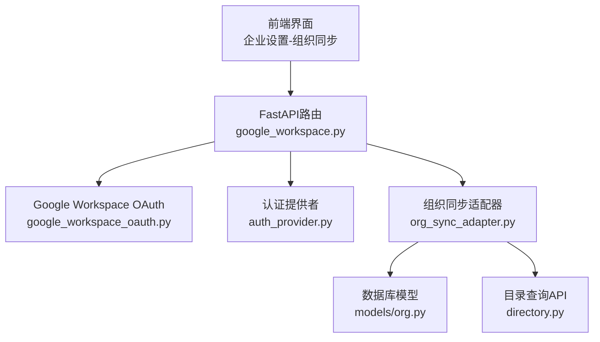
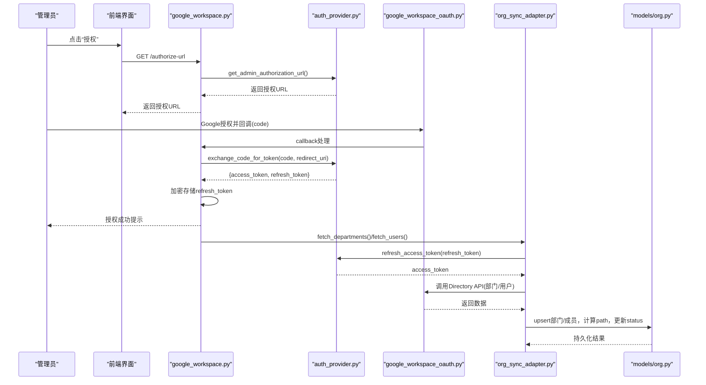
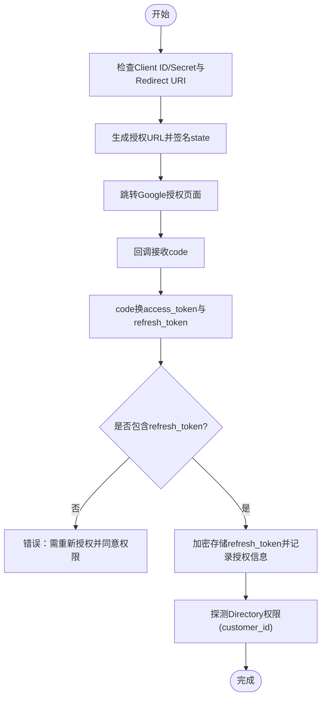
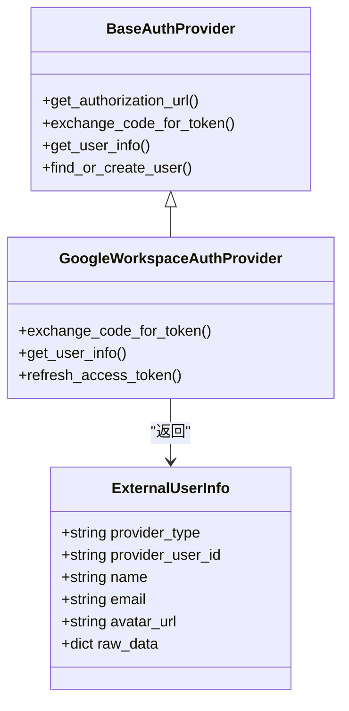
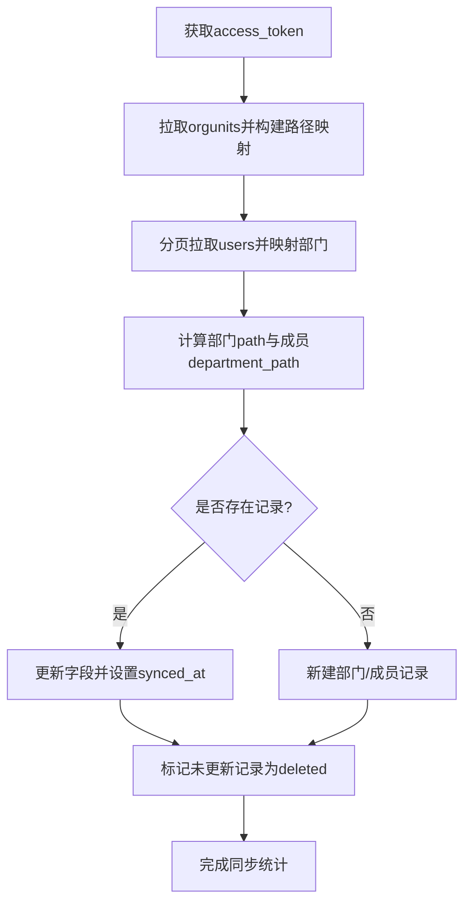
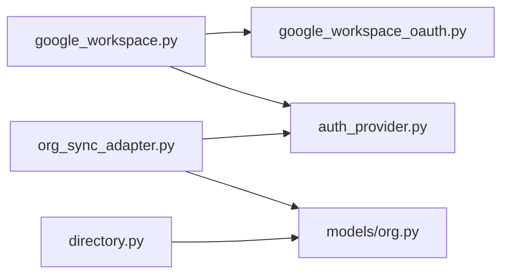

# Google目录同步

<cite>
**本文引用的文件**   
- [backend/app/api/google_workspace.py](file://backend/app/api/google_workspace.py)
- [backend/app/services/google_workspace_oauth.py](file://backend/app/services/google_workspace_oauth.py)
- [backend/app/services/auth_provider.py](file://backend/app/services/auth_provider.py)
- [backend/app/services/org_sync_adapter.py](file://backend/app/services/org_sync_adapter.py)
- [backend/app/models/org.py](file://backend/app/models/org.py)
- [backend/app/api/directory.py](file://backend/app/api/directory.py)
- [frontend/src/i18n/en.json](file://frontend/src/i18n/en.json)
</cite>

## 目录
1. [简介](#简介)
2. [项目结构](#项目结构)
3. [核心组件](#核心组件)
4. [架构总览](#架构总览)
5. [详细组件分析](#详细组件分析)
6. [依赖关系分析](#依赖关系分析)
7. [性能考虑](#性能考虑)
8. [故障排查指南](#故障排查指南)
9. [结论](#结论)
10. [附录](#附录)

## 简介
本技术文档面向Clawith平台的Google Workspace目录同步能力，覆盖管理员授权流程、权限范围与刷新令牌管理、用户信息获取、组织架构同步、用户状态管理、批量导入与增量同步策略、冲突处理、企业级特性（部门路径映射、组成员关系同步、权限继承机制），以及故障恢复、审计日志与性能优化最佳实践。读者可据此完成部署配置、日常运维与问题定位。

## 项目结构
与Google目录同步相关的后端代码主要分布在以下模块：
- API路由层：负责OAuth回调、管理员授权URL生成与回调处理
- OAuth与认证提供者：封装Google OAuth流程、令牌交换与用户信息获取
- 组织同步适配器：实现从Google Directory拉取部门与用户数据并落库
- 数据模型：部门与成员表结构，支撑路径映射与状态管理
- 前端国际化文案：指导管理员完成Google Cloud控制台配置与授权步骤

**图示来源** 
- [backend/app/api/google_workspace.py:35-54](file://backend/app/api/google_workspace.py#L35-L54)
- [backend/app/services/google_workspace_oauth.py:19-21](file://backend/app/services/google_workspace_oauth.py#L19-L21)
- [backend/app/services/auth_provider.py:800-837](file://backend/app/services/auth_provider.py#L800-L837)
- [backend/app/services/org_sync_adapter.py:1344-1488](file://backend/app/services/org_sync_adapter.py#L1344-L1488)
- [backend/app/models/org.py:13-62](file://backend/app/models/org.py#L13-L62)
- [backend/app/api/directory.py:49-74](file://backend/app/api/directory.py#L49-L74)

**章节来源**
- [backend/app/api/google_workspace.py:35-54](file://backend/app/api/google_workspace.py#L35-L54)
- [backend/app/services/google_workspace_oauth.py:19-21](file://backend/app/services/google_workspace_oauth.py#L19-L21)
- [backend/app/services/auth_provider.py:800-837](file://backend/app/services/auth_provider.py#L800-L837)
- [backend/app/services/org_sync_adapter.py:1344-1488](file://backend/app/services/org_sync_adapter.py#L1344-L1488)
- [backend/app/models/org.py:13-62](file://backend/app/models/org.py#L13-L62)
- [backend/app/api/directory.py:49-74](file://backend/app/api/directory.py#L49-L74)

## 核心组件
- 管理员授权与回调路由：提供“获取授权URL”和“回调处理”，完成code换token、刷新令牌加密存储、OpenID资料读取与目录探测
- Google OAuth提供者：实现授权URL构造、code换token、用户信息获取与refresh token刷新
- 组织同步适配器：基于admin授权或兼容的服务账号委派模式，拉取部门与用户，构建部门路径映射，执行增量同步与状态管理
- 数据模型：OrgDepartment与OrgMember承载部门树、成员信息与状态；支持department_path与status字段用于路径与生命周期管理
- 目录查询API：对外暴露只读的组织目录查询接口，结合OrgMember的department_path进行检索

**章节来源**
- [backend/app/api/google_workspace.py:35-54](file://backend/app/api/google_workspace.py#L35-L54)
- [backend/app/api/google_workspace.py:140-188](file://backend/app/api/google_workspace.py#L140-L188)
- [backend/app/services/auth_provider.py:800-837](file://backend/app/services/auth_provider.py#L800-L837)
- [backend/app/services/org_sync_adapter.py:1344-1488](file://backend/app/services/org_sync_adapter.py#L1344-L1488)
- [backend/app/models/org.py:13-62](file://backend/app/models/org.py#L13-L62)
- [backend/app/api/directory.py:49-74](file://backend/app/api/directory.py#L49-L74)

## 架构总览
下图展示管理员授权到目录同步的关键调用链：前端触发授权→后端生成授权URL→Google返回code→后端换取access_token与refresh_token→存储加密refresh_token→后续同步通过refresh刷新access_token→调用Directory API拉取数据→写入本地数据库→更新路径与状态。

**图示来源** 
- [backend/app/api/google_workspace.py:35-54](file://backend/app/api/google_workspace.py#L35-L54)
- [backend/app/api/google_workspace.py:140-188](file://backend/app/api/google_workspace.py#L140-L188)
- [backend/app/services/auth_provider.py:800-837](file://backend/app/services/auth_provider.py#L800-L837)
- [backend/app/services/google_workspace_oauth.py:95-113](file://backend/app/services/google_workspace_oauth.py#L95-L113)
- [backend/app/services/org_sync_adapter.py:1410-1488](file://backend/app/services/org_sync_adapter.py#L1410-L1488)
- [backend/app/services/org_sync_adapter.py:1485-1576](file://backend/app/services/org_sync_adapter.py#L1485-L1576)
- [backend/app/models/org.py:13-62](file://backend/app/models/org.py#L13-L62)

## 详细组件分析

### 管理员授权流程与刷新令牌管理
- 授权URL生成：校验租户权限与Provider配置，签名state并返回授权URL
- 回调处理：code换token，校验必须返回refresh_token；读取OpenID profile；探测Directory权限；将refresh_token加密后存入provider.config；记录授权邮箱与时间
- 刷新令牌：在同步前检查缓存access_token是否过期，若过期则使用refresh_token刷新；失败时回退至服务账号委派模式（兼容旧配置）

**图示来源** 
- [backend/app/api/google_workspace.py:35-54](file://backend/app/api/google_workspace.py#L35-L54)
- [backend/app/api/google_workspace.py:140-188](file://backend/app/api/google_workspace.py#L140-L188)
- [backend/app/services/google_workspace_oauth.py:95-113](file://backend/app/services/google_workspace_oauth.py#L95-L113)
- [backend/app/services/auth_provider.py:800-837](file://backend/app/services/auth_provider.py#L800-L837)

**章节来源**
- [backend/app/api/google_workspace.py:35-54](file://backend/app/api/google_workspace.py#L35-L54)
- [backend/app/api/google_workspace.py:140-188](file://backend/app/api/google_workspace.py#L140-L188)
- [backend/app/services/google_workspace_oauth.py:95-113](file://backend/app/services/google_workspace_oauth.py#L95-L113)
- [backend/app/services/auth_provider.py:800-837](file://backend/app/services/auth_provider.py#L800-L837)

### 用户信息获取与身份关联
- OpenID Profile：通过access_token获取用户基本信息（sub、name、email、avatar）
- 用户解析与创建：优先按provider_user_id匹配，其次按email/mobile匹配；不存在则创建新用户并绑定Identity；确保Web成员关系存在

**图示来源** 
- [backend/app/services/auth_provider.py:26-42](file://backend/app/services/auth_provider.py#L26-L42)
- [backend/app/services/auth_provider.py:800-837](file://backend/app/services/auth_provider.py#L800-L837)

**章节来源**
- [backend/app/services/auth_provider.py:26-42](file://backend/app/services/auth_provider.py#L26-L42)
- [backend/app/services/auth_provider.py:800-837](file://backend/app/services/auth_provider.py#L800-L837)

### 组织架构同步与部门路径映射
- 部门拉取：调用orgunits接口，建立orgUnitPath到external_id映射，标准化路径为以“/”开头；插入根部门
- 用户拉取：分页拉取users，根据orgUnitPath映射到部门external_id，提取主电话与组织信息
- 路径计算：基于内部部门树递归计算path，虚拟根（external_id=0）路径为空；成员department_path由所属部门推导
- 增量同步：标记未在本次同步中更新的部门/成员为deleted；upsert已存在的记录并更新时间戳

**图示来源** 
- [backend/app/services/org_sync_adapter.py:1485-1576](file://backend/app/services/org_sync_adapter.py#L1485-L1576)
- [backend/app/services/org_sync_adapter.py:57-99](file://backend/app/services/org_sync_adapter.py#L57-L99)
- [backend/app/services/org_sync_adapter.py:102-134](file://backend/app/services/org_sync_adapter.py#L102-L134)
- [backend/app/services/org_sync_adapter.py:331-352](file://backend/app/services/org_sync_adapter.py#L331-L352)

**章节来源**
- [backend/app/services/org_sync_adapter.py:1485-1576](file://backend/app/services/org_sync_adapter.py#L1485-L1576)
- [backend/app/services/org_sync_adapter.py:57-99](file://backend/app/services/org_sync_adapter.py#L57-L99)
- [backend/app/services/org_sync_adapter.py:102-134](file://backend/app/services/org_sync_adapter.py#L102-L134)
- [backend/app/services/org_sync_adapter.py:331-352](file://backend/app/services/org_sync_adapter.py#L331-L352)

### 用户状态管理与冲突处理
- 状态字段：OrgMember.status支持active与deleted；synced_at用于增量判断
- 冲突处理：当外部源删除或移动部门/成员时，通过reconcile逻辑将未更新的记录标记为deleted；upsert保证幂等性
- 路径一致性：每次同步后重建部门path映射并刷新成员的department_path，避免路径漂移

**章节来源**
- [backend/app/models/org.py:34-62](file://backend/app/models/org.py#L34-L62)
- [backend/app/services/org_sync_adapter.py:331-352](file://backend/app/services/org_sync_adapter.py#L331-L352)
- [backend/app/services/org_sync_adapter.py:507-538](file://backend/app/services/org_sync_adapter.py#L507-L538)

### 批量用户导入与增量同步策略
- 批量导入：users接口分页maxResults=500，按email排序；组织单位映射到部门external_id；提取phones中的primary phone
- 增量同步：以synced_at为基准，对未更新的记录执行软删除；新记录直接插入；更新记录仅覆盖必要字段
- 错误收集：同步过程中捕获异常并汇总errors，便于前端展示诊断信息

**章节来源**
- [backend/app/services/org_sync_adapter.py:1550-1576](file://backend/app/services/org_sync_adapter.py#L1550-L1576)
- [backend/app/services/org_sync_adapter.py:321-329](file://backend/app/services/org_sync_adapter.py#L321-L329)

### 企业级特性：部门路径映射、组成员关系与权限继承
- 部门路径映射：build_department_path_map递归生成“总部/研发部/平台组”形式的路径；虚拟根external_id=0对应空路径
- 组成员关系：OrgMember.department_id指向OrgDepartment.id；department_path冗余存储提升查询性能
- 权限继承：Agent目录查询结合OrgMember与User，按tenant_id与status过滤；支持按department_path模糊搜索

**章节来源**
- [backend/app/services/org_sync_adapter.py:57-99](file://backend/app/services/org_sync_adapter.py#L57-L99)
- [backend/app/models/org.py:13-62](file://backend/app/models/org.py#L13-L62)
- [backend/app/api/directory.py:122-178](file://backend/app/api/directory.py#L122-L178)

### 前端引导与配置说明
- 前端国际化文案指导管理员在Google Cloud Console创建OAuth Web App、配置Redirect URI、开启Contacts Permission Scope、保存Client ID/Secret并执行首次同步
- 授权成功后，系统自动加密存储refresh_token，后续定时同步自动刷新access_token

**章节来源**
- [frontend/src/i18n/en.json:1357-1364](file://frontend/src/i18n/en.json#L1357-L1364)

## 依赖关系分析
- google_workspace.py依赖google_workspace_oauth.py提供state签名、回调路径与目录探测
- google_workspace.py依赖auth_provider.py的GoogleWorkspaceAuthProvider进行code换token与用户信息获取
- org_sync_adapter.py依赖auth_provider.py进行refresh token刷新，并调用google_workspace_oauth.py的HTTP代理配置
- models/org.py定义OrgDepartment与OrgMember，被org_sync_adapter.py读写
- directory.py提供只读目录查询，依赖OrgMember与User模型

**图示来源** 
- [backend/app/api/google_workspace.py:35-54](file://backend/app/api/google_workspace.py#L35-L54)
- [backend/app/services/google_workspace_oauth.py:19-21](file://backend/app/services/google_workspace_oauth.py#L19-L21)
- [backend/app/services/auth_provider.py:800-837](file://backend/app/services/auth_provider.py#L800-L837)
- [backend/app/services/org_sync_adapter.py:1344-1488](file://backend/app/services/org_sync_adapter.py#L1344-L1488)
- [backend/app/models/org.py:13-62](file://backend/app/models/org.py#L13-L62)
- [backend/app/api/directory.py:49-74](file://backend/app/api/directory.py#L49-L74)

**章节来源**
- [backend/app/api/google_workspace.py:35-54](file://backend/app/api/google_workspace.py#L35-L54)
- [backend/app/services/google_workspace_oauth.py:19-21](file://backend/app/services/google_workspace_oauth.py#L19-L21)
- [backend/app/services/auth_provider.py:800-837](file://backend/app/services/auth_provider.py#L800-L837)
- [backend/app/services/org_sync_adapter.py:1344-1488](file://backend/app/services/org_sync_adapter.py#L1344-L1488)
- [backend/app/models/org.py:13-62](file://backend/app/models/org.py#L13-L62)
- [backend/app/api/directory.py:49-74](file://backend/app/api/directory.py#L49-L74)

## 性能考虑
- HTTP客户端超时与代理：统一通过GOOGLE_HTTP_PROXY配置，避免阻塞与网络抖动影响
- 分页与限流：users接口maxResults=500，orderBy=email提升顺序稳定性；next_cursor/pageToken控制分页
- 内存与CPU：部门路径计算采用递归+visited集合避免环路与重复计算；成员department_path冗余减少JOIN开销
- 重试与容错：refresh token失败时回退服务账号委派；同步错误收集并返回errors供前端诊断

[本节为通用指导，不直接分析具体文件]

## 故障排查指南
- 授权失败：检查Client ID/Secret与Redirect URI是否正确；确认Google Cloud控制台已添加授权域名与权限范围；确保回调返回refresh_token
- 目录探测失败：验证customer_id配置（默认my_customer）；检查Directory API权限与访问范围
- 刷新令牌失效：确认refresh_token未被撤销；必要时重新授权；查看日志中的refresh error详情
- 同步错误：查看syncResult.errors第一条提示；检查org_unit_path映射与用户组织字段；确认用户状态与部门归属

**章节来源**
- [backend/app/api/google_workspace.py:140-188](file://backend/app/api/google_workspace.py#L140-L188)
- [backend/app/services/google_workspace_oauth.py:95-113](file://backend/app/services/google_workspace_oauth.py#L95-L113)
- [backend/app/services/org_sync_adapter.py:1410-1488](file://backend/app/services/org_sync_adapter.py#L1410-L1488)
- [frontend/src/pages/enterprise-settings/tabs/OrgTab.tsx:881-895](file://frontend/src/pages/enterprise-settings/tabs/OrgTab.tsx#L881-L895)

## 结论
Clawith的Google Workspace目录同步通过标准化的OAuth授权与refresh token管理，结合灵活的适配器框架，实现了稳定的部门与用户数据同步。系统在企业级场景中提供了完善的部门路径映射、成员状态管理与权限继承支持，并通过增量同步与错误收集保障数据一致性与可观测性。建议在生产环境严格配置customer_id与权限范围，定期巡检refresh token有效性，并结合日志与前端提示快速定位问题。

[本节为总结，不直接分析具体文件]

## 附录
- 关键API端点
  - 获取管理员授权URL：GET /enterprise/identity-providers/{provider_id}/google-workspace-sync/authorize-url
  - 统一回调处理：GET /api/auth/google_workspace/callback
  - 只读目录查询：GET /agents/{agent_id}/directory?member_type=all&query=&limit=50&offset=0

**章节来源**
- [backend/app/api/google_workspace.py:35-54](file://backend/app/api/google_workspace.py#L35-L54)
- [backend/app/api/google_workspace.py:191-217](file://backend/app/api/google_workspace.py#L191-L217)
- [backend/app/api/directory.py:49-74](file://backend/app/api/directory.py#L49-L74)