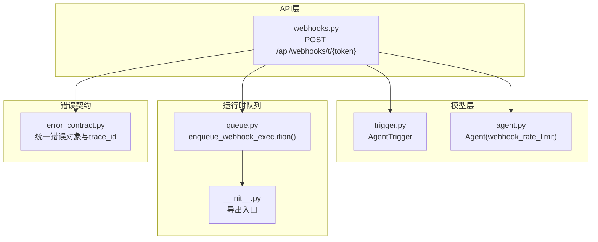
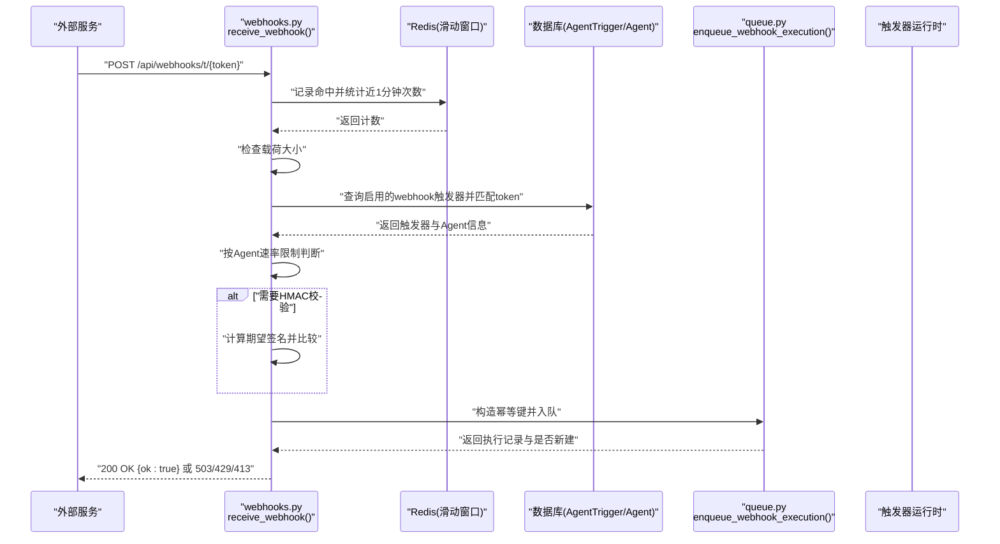
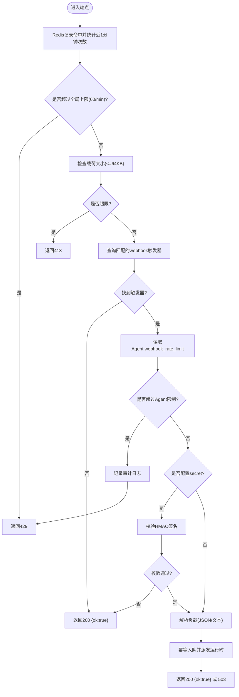
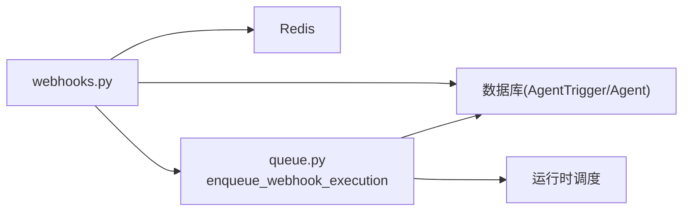

# Webhook回调接口

<cite>
**本文引用的文件**
- [webhooks.py](file://backend/app/api/webhooks.py)
- [trigger.py](file://backend/app/models/trigger.py)
- [queue.py](file://backend/app/services/trigger_runtime/queue.py)
- [__init__.py](file://backend/app/services/trigger_runtime/__init__.py)
- [agent.py](file://backend/app/models/agent.py)
- [error_contract.py](file://backend/app/core/error_contract.py)
- [test_webhooks_api.py](file://backend/tests/test_webhooks_api.py)
</cite>

## 目录
1. [简介](#简介)
2. [项目结构](#项目结构)
3. [核心组件](#核心组件)
4. [架构总览](#架构总览)
5. [详细组件分析](#详细组件分析)
6. [依赖关系分析](#依赖关系分析)
7. [性能考量](#性能考量)
8. [故障排查指南](#故障排查指南)
9. [结论](#结论)
10. [附录](#附录)

## 简介
本文件为Clawith平台的Webhook回调接口提供完整的API文档，聚焦于POST /api/webhooks/t/{token}端点。该端点用于接收外部服务（如GitHub、Grafana等）的事件，触发对应Agent执行。安全与稳定性方面包含：
- 基于URL token的公开接入
- 可选的HMAC签名校验
- 基于Redis的每分钟速率限制（全局硬上限与按Agent粒度限制）
- 请求体大小限制
- 幂等去重（通过请求头或请求体哈希生成idempotency key）
- 统一的错误响应结构与可观测性（trace_id）

## 项目结构
Webhook相关代码主要分布在以下模块：
- API层：路由定义与请求处理
- 模型层：触发器与Agent配置
- 运行时队列：事件入队与幂等控制
- 错误契约：统一错误格式与Trace ID

图表来源
- [webhooks.py:45-182](file://backend/app/api/webhooks.py#L45-L182)
- [trigger.py:13-48](file://backend/app/models/trigger.py#L13-L48)
- [agent.py:102-106](file://backend/app/models/agent.py#L102-L106)
- [queue.py:156-186](file://backend/app/services/trigger_runtime/queue.py#L156-L186)
- [__init__.py:18](file://backend/app/services/trigger_runtime/__init__.py#L18)
- [error_contract.py:158-181](file://backend/app/core/error_contract.py#L158-L181)

章节来源
- [webhooks.py:1-183](file://backend/app/api/webhooks.py#L1-L183)
- [trigger.py:1-48](file://backend/app/models/trigger.py#L1-L48)
- [agent.py:1-200](file://backend/app/models/agent.py#L1-L200)
- [queue.py:1-186](file://backend/app/services/trigger_runtime/queue.py#L1-L186)
- [__init__.py:1-33](file://backend/app/services/trigger_runtime/__init__.py#L1-L33)
- [error_contract.py:1-229](file://backend/app/core/error_contract.py#L1-L229)

## 核心组件
- 路由与处理器
  - POST /api/webhooks/t/{token}：接收外部事件，进行速率限制、载荷大小检查、触发器匹配、可选HMAC校验、解析负载并排队执行。
- 触发器模型
  - AgentTrigger：存储触发器类型、配置（含token与secret）、启用状态、冷却时间、最大触发次数等。
- Agent模型
  - Agent：包含webhook_rate_limit字段，用于按Agent维度限制Webhook频率。
- 队列与幂等
  - enqueue_webhook_execution：从请求头或请求体计算幂等键，插入执行记录并派发至运行时。
- 错误契约
  - 统一错误对象、trace_id注入、HTTP异常处理器。

章节来源
- [webhooks.py:45-182](file://backend/app/api/webhooks.py#L45-L182)
- [trigger.py:13-48](file://backend/app/models/trigger.py#L13-L48)
- [agent.py:102-106](file://backend/app/models/agent.py#L102-L106)
- [queue.py:156-186](file://backend/app/services/trigger_runtime/queue.py#L156-L186)
- [error_contract.py:158-181](file://backend/app/core/error_contract.py#L158-L181)

## 架构总览
Webhook请求进入FastAPI路由后，依次完成：
- Redis滑动窗口计数（每分钟）
- 载荷大小校验
- 数据库查询匹配的webhook触发器
- 按Agent维度的速率限制
- 可选HMAC签名验证
- 负载解析与格式化
- 幂等入队与异步执行

图表来源
- [webhooks.py:45-182](file://backend/app/api/webhooks.py#L45-L182)
- [queue.py:156-186](file://backend/app/services/trigger_runtime/queue.py#L156-L186)

## 详细组件分析

### 端点：POST /api/webhooks/t/{token}
- 功能概述
  - 接收外部事件，匹配webhook触发器，进行安全校验与限流，将事件入队由运行时异步处理。
- 路径参数
  - token：触发器配置中的唯一标识，用于定位具体触发器。
- 请求头
  - x-hub-signature-256：可选，HMAC-SHA256签名，值为“sha256=...”。
  - x-idempotency-key：可选，幂等键（优先使用）。
  - x-github-delivery：可选，当未提供x-idempotency-key时回退使用。
  - x-request-id / x-event-id：其他回退键。
  - 其他任意请求头将被透传至运行时上下文。
- 请求体
  - 支持JSON与非JSON文本；JSON会被尝试解析并美化输出以便日志可读。
  - 最大载荷：64KB。
- 响应
  - 成功：200 OK，{"ok": true}
  - 速率限制：429，{"ok": true}（避免泄露是否存在token）
  - 载荷过大：413，{"ok": true}
  - 运行时不可用：503，{"ok": false, "error": "runtime_unavailable"}
  - 未知错误：遵循全局错误契约，包含trace_id。
- 安全机制
  - URL token：公开但不可猜测。
  - HMAC签名：可选，若触发器配置了secret则必须校验。
  - 速率限制：全局硬上限（60次/分钟），以及按Agent配置的webhook_rate_limit。
  - 载荷大小限制：64KB。
  - 幂等：通过请求头或请求体哈希生成idempotency_key，避免重复处理。

章节来源
- [webhooks.py:45-182](file://backend/app/api/webhooks.py#L45-L182)
- [queue.py:156-186](file://backend/app/services/trigger_runtime/queue.py#L156-L186)
- [error_contract.py:158-181](file://backend/app/core/error_contract.py#L158-L181)

### 速率限制机制
- 全局硬上限：每个token每分钟最多60次，超过即返回429。
- 按Agent限制：读取Agent.webhook_rate_limit（默认5次/分钟），当前命中已计入计数，因此判断条件为大于限制值。
- 实现方式：Redis有序集合，滑动窗口统计最近60秒内的命中数。

图表来源
- [webhooks.py:30-182](file://backend/app/api/webhooks.py#L30-L182)
- [agent.py:102-106](file://backend/app/models/agent.py#L102-L106)

章节来源
- [webhooks.py:30-182](file://backend/app/api/webhooks.py#L30-L182)
- [agent.py:102-106](file://backend/app/models/agent.py#L102-L106)

### HMAC签名验证
- 触发器配置项：config.secret（可选）
- 客户端需设置请求头：x-hub-signature-256 = "sha256=" + HMAC-SHA256(body, secret)
- 服务端计算期望签名并与请求头比较，不匹配则返回200以避免泄露信息。

章节来源
- [webhooks.py:134-142](file://backend/app/api/webhooks.py#L134-L142)

### 幂等与去重
- 幂等键优先级：
  1) x-idempotency-key
  2) x-github-delivery
  3) x-request-id
  4) x-event-id
  5) SHA256(body)
- 相同触发器+相同幂等键的请求被视为重复，直接忽略。

章节来源
- [queue.py:170-176](file://backend/app/services/trigger_runtime/queue.py#L170-L176)

### 触发器与Agent模型
- AgentTrigger
  - type: webhook
  - config.token: 匹配URL中的token
  - config.secret: 可选，用于HMAC校验
  - is_enabled: 是否启用
  - cooldown_seconds: 冷却时间（秒）
  - max_fires: 最大触发次数（可选）
- Agent
  - webhook_rate_limit: 每Agent的Webhook速率限制（默认5次/分钟）

章节来源
- [trigger.py:13-48](file://backend/app/models/trigger.py#L13-L48)
- [agent.py:102-106](file://backend/app/models/agent.py#L102-L106)

### 错误处理策略
- 统一错误对象包含code、message、trace_id等字段，便于追踪。
- HTTP异常处理器会注入trace_id到响应头X-Trace-Id。
- 针对Webhook特定场景：
  - 429：速率限制
  - 413：载荷过大
  - 503：运行时不可用（{"ok": false, "error": "runtime_unavailable"}）

章节来源
- [error_contract.py:158-181](file://backend/app/core/error_contract.py#L158-L181)
- [webhooks.py:169-178](file://backend/app/api/webhooks.py#L169-L178)

## 依赖关系分析
- webhooks.py依赖：
  - Redis（速率限制）
  - 数据库会话（查询触发器与Agent）
  - trigger_runtime.queue.enqueue_webhook_execution（入队）
- queue.py依赖：
  - 数据库（插入TriggerExecution、更新AgentTrigger状态）
  - 运行时调度（enqueue_trigger_runtime）

图表来源
- [webhooks.py:45-182](file://backend/app/api/webhooks.py#L45-L182)
- [queue.py:156-186](file://backend/app/services/trigger_runtime/queue.py#L156-L186)

章节来源
- [webhooks.py:45-182](file://backend/app/api/webhooks.py#L45-L182)
- [queue.py:156-186](file://backend/app/services/trigger_runtime/queue.py#L156-L186)

## 性能考量
- Redis滑动窗口：O(1)写入与计数，过期时间120秒保证清理。
- 数据库操作：仅读取必要标量字段并在处理后expunge，避免Greenlet泄漏。
- 负载解析：JSON美化仅用于日志，失败时回退为原始字节前缀。
- 幂等键长度截断至255字符，减少索引开销。
- 建议：
  - 合理设置Agent.webhook_rate_limit，避免频繁重试导致堆积。
  - 使用x-idempotency-key确保外部服务重试时的幂等性。
  - 监控Redis命中率与数据库锁等待。

[本节为通用指导，无需引用具体文件]

## 故障排查指南
- 常见问题
  - 429速率限制：检查token是否被滥用或Agent.webhook_rate_limit过小。
  - 413载荷过大：确认外部服务发送的payload不超过64KB。
  - 503运行时不可用：检查统一运行时是否启用与可用。
  - 签名不匹配：核对secret与x-hub-signature-256是否正确。
- 调试工具
  - 使用curl或Postman模拟请求，携带x-hub-signature-256与x-idempotency-key。
  - 查看响应头X-Trace-Id，结合后端日志定位问题。
  - 参考测试用例快速验证基本流程。

章节来源
- [test_webhooks_api.py:75-147](file://backend/tests/test_webhooks_api.py#L75-L147)
- [error_contract.py:158-181](file://backend/app/core/error_contract.py#L158-L181)

## 结论
POST /api/webhooks/t/{token}提供了安全、稳定且可扩展的外部事件接入能力。通过URL token、可选HMAC、速率限制、载荷限制与幂等机制，平台能够可靠地接收来自GitHub、Grafana等外部服务的Webhook事件，并驱动Agent自动化执行。建议在生产环境中启用HMAC校验与合理的速率限制，并结合trace_id进行全链路追踪。

[本节为总结，无需引用具体文件]

## 附录

### 配置步骤
- 创建触发器
  - 在Agent下新增类型为webhook的触发器，设置name、reason、cooldown_seconds、max_fires等。
  - 在config中设置token（必填）与secret（可选）。
- 设置Agent速率限制
  - 调整Agent.webhook_rate_limit以控制每分钟允许的Webhook数量。
- 外部服务集成示例
  - GitHub：在仓库Webhook设置中填写回调URL为/api/webhooks/t/{token}，选择事件类型，开启HMAC并填入secret。
  - Grafana：在Alerting通知渠道中添加Webhook，设置URL与Headers（x-hub-signature-256、x-idempotency-key等）。

章节来源
- [trigger.py:13-48](file://backend/app/models/trigger.py#L13-L48)
- [agent.py:102-106](file://backend/app/models/agent.py#L102-L106)
- [webhooks.py:134-142](file://backend/app/api/webhooks.py#L134-L142)

### 请求与响应规范
- 请求
  - 方法：POST
  - 路径：/api/webhooks/t/{token}
  - 头部：x-hub-signature-256（可选）、x-idempotency-key（可选）、其他自定义头（透传）
  - 主体：JSON或文本，最大64KB
- 响应
  - 200 OK：{"ok": true}
  - 429：{"ok": true}
  - 413：{"ok": true}
  - 503：{"ok": false, "error": "runtime_unavailable"}
  - 其他错误：遵循统一错误对象，包含trace_id

章节来源
- [webhooks.py:45-182](file://backend/app/api/webhooks.py#L45-L182)
- [error_contract.py:158-181](file://backend/app/core/error_contract.py#L158-L181)