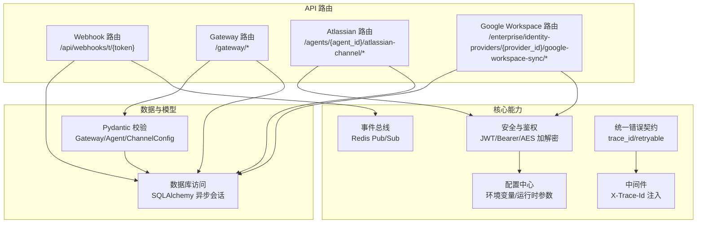
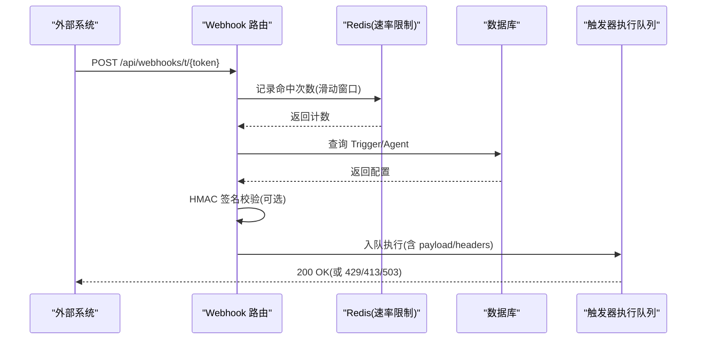
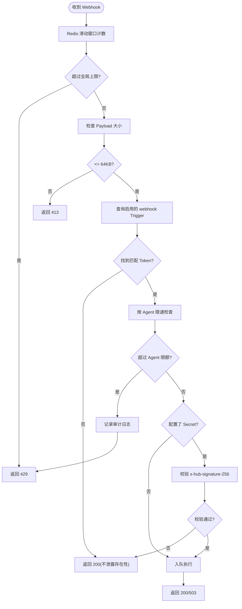
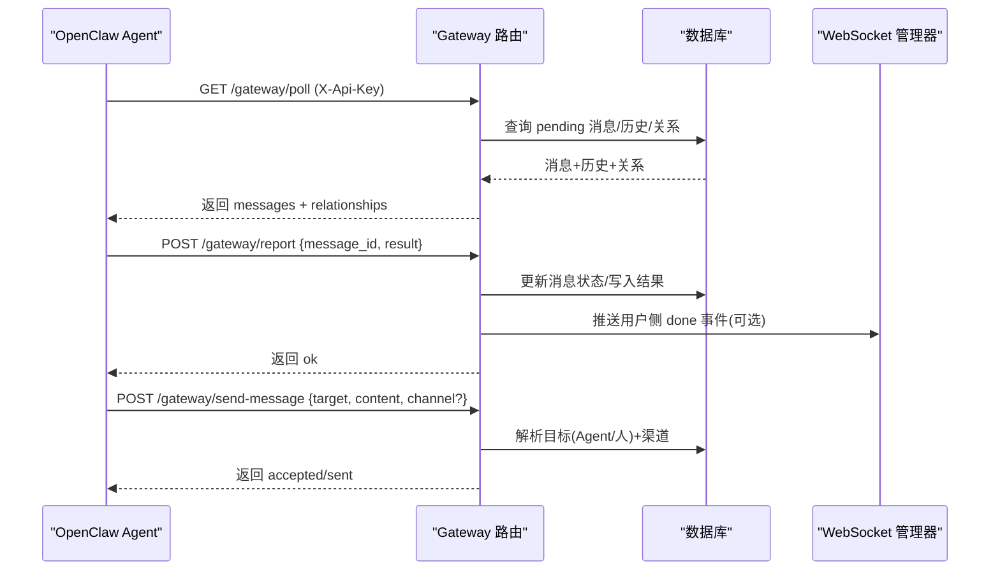
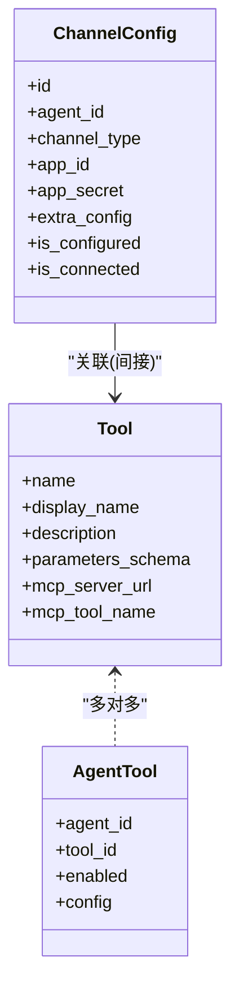
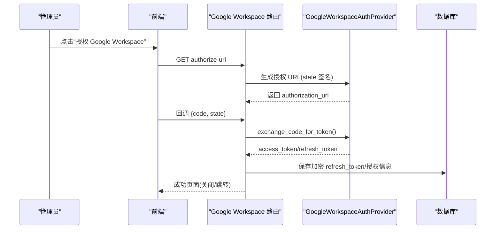
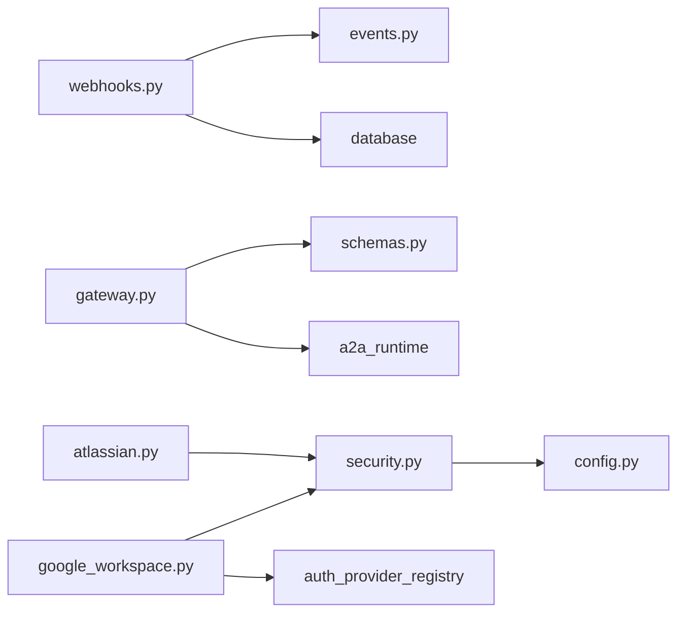

# 集成接口API

<cite>
**本文引用的文件**
- [webhooks.py](file://backend/app/api/webhooks.py)
- [gateway.py](file://backend/app/api/gateway.py)
- [atlassian.py](file://backend/app/api/atlassian.py)
- [google_workspace.py](file://backend/app/api/google_workspace.py)
- [security.py](file://backend/app/core/security.py)
- [events.py](file://backend/app/core/events.py)
- [error_contract.py](file://backend/app/core/error_contract.py)
- [middleware.py](file://backend/app/core/middleware.py)
- [config.py](file://backend/app/config.py)
- [schemas.py](file://backend/app/schemas/schemas.py)
- [test_webhooks_api.py](file://backend/tests/test_webhooks_api.py)
</cite>

## 目录
1. [简介](#简介)
2. [项目结构](#项目结构)
3. [核心组件](#核心组件)
4. [架构总览](#架构总览)
5. [详细组件分析](#详细组件分析)
6. [依赖关系分析](#依赖关系分析)
7. [性能与限流](#性能与限流)
8. [监控与可观测性](#监控与可观测性)
9. [故障排查指南](#故障排查指南)
10. [结论](#结论)
11. [附录：SDK与客户端集成示例](#附录sdk与客户端集成示例)

## 简介
本文件为 Clawith 平台的系统集成接口文档，覆盖以下外部交互能力：
- Webhook 回调接口：接收外部系统事件并触发 Agent 执行。
- API 网关接口（OpenClaw）：供 OpenClaw Agent 轮询消息、上报结果、发送消息与心跳保活。
- 第三方服务集成：Atlassian（Jira/Confluence/Compass）MCP 工具通道；Google Workspace OAuth SSO 与管理员同步授权。
- 事件驱动架构：基于 Redis Pub/Sub 的事件通道与统一错误契约、追踪 ID。
- 安全机制：HMAC 签名校验、速率限制、Payload 大小限制、JWT/Bearer 鉴权、敏感数据加密存储。
- 运维要点：限流策略、监控告警、错误重试、故障排查。

## 项目结构
后端采用 FastAPI 模块化路由组织，关键模块如下：
- API 层：webhooks、gateway、atlassian、google_workspace
- 核心能力：security（鉴权与加解密）、events（Redis 事件）、error_contract（统一错误）、middleware（请求追踪）
- 配置：config（环境变量与运行时参数）
- 数据模型与 Schema：models、schemas（Pydantic 校验）
- 测试：针对 Webhook 的端到端用例

图表来源
- [webhooks.py:1-183](file://backend/app/api/webhooks.py#L1-L183)
- [gateway.py:1-712](file://backend/app/api/gateway.py#L1-L712)
- [atlassian.py:1-303](file://backend/app/api/atlassian.py#L1-L303)
- [google_workspace.py:1-217](file://backend/app/api/google_workspace.py#L1-L217)
- [security.py:1-227](file://backend/app/core/security.py#L1-L227)
- [events.py:1-34](file://backend/app/core/events.py#L1-L34)
- [error_contract.py:1-229](file://backend/app/core/error_contract.py#L1-L229)
- [middleware.py:1-53](file://backend/app/core/middleware.py#L1-L53)
- [config.py:1-268](file://backend/app/config.py#L1-L268)
- [schemas.py:1-608](file://backend/app/schemas/schemas.py#L1-L608)

章节来源
- [webhooks.py:1-183](file://backend/app/api/webhooks.py#L1-L183)
- [gateway.py:1-712](file://backend/app/api/gateway.py#L1-L712)
- [atlassian.py:1-303](file://backend/app/api/atlassian.py#L1-L303)
- [google_workspace.py:1-217](file://backend/app/api/google_workspace.py#L1-L217)
- [security.py:1-227](file://backend/app/core/security.py#L1-L227)
- [events.py:1-34](file://backend/app/core/events.py#L1-L34)
- [error_contract.py:1-229](file://backend/app/core/error_contract.py#L1-L229)
- [middleware.py:1-53](file://backend/app/core/middleware.py#L1-L53)
- [config.py:1-268](file://backend/app/config.py#L1-L268)
- [schemas.py:1-608](file://backend/app/schemas/schemas.py#L1-L608)

## 核心组件
- Webhook 接收器：对外公开 POST /api/webhooks/t/{token}，支持 HMAC 签名校验、按 token 与按 Agent 的速率限制、Payload 大小限制、去重与审计日志。
- Gateway 网关：OpenClaw Agent 通过 X-Api-Key 认证，提供 poll/report/send-message/heartbeat 等能力，支持 A2A 与人类成员投递（如飞书）。
- Atlassian MCP 通道：为 Agent 配置 Atlassian Rovo MCP，自动发现并分配工具，支持连接测试。
- Google Workspace OAuth：统一的 SSO 登录与管理员同步授权回调，支持状态签名与租户隔离。
- 安全与鉴权：JWT 访问令牌、Bearer 校验、AES 加解密、角色权限控制。
- 事件与错误：Redis Pub/Sub 事件通道；统一错误对象包含 code/message/trace_id/retryable 等字段；全局异常处理器标准化响应。
- 中间件：X-Trace-Id 注入与请求耗时记录。

章节来源
- [webhooks.py:1-183](file://backend/app/api/webhooks.py#L1-L183)
- [gateway.py:1-712](file://backend/app/api/gateway.py#L1-L712)
- [atlassian.py:1-303](file://backend/app/api/atlassian.py#L1-L303)
- [google_workspace.py:1-217](file://backend/app/api/google_workspace.py#L1-L217)
- [security.py:1-227](file://backend/app/core/security.py#L1-L227)
- [events.py:1-34](file://backend/app/core/events.py#L1-L34)
- [error_contract.py:1-229](file://backend/app/core/error_contract.py#L1-L229)
- [middleware.py:1-53](file://backend/app/core/middleware.py#L1-L53)

## 架构总览
下图展示外部系统与 Clawith 平台的关键交互路径：外部事件通过 Webhook 进入，经速率限制与签名校验后入队执行；OpenClaw Agent 通过网关轮询与上报；Atlassian/Google Workspace 作为工具与身份源接入。

图表来源
- [webhooks.py:1-183](file://backend/app/api/webhooks.py#L1-L183)
- [events.py:1-34](file://backend/app/core/events.py#L1-L34)

章节来源
- [webhooks.py:1-183](file://backend/app/api/webhooks.py#L1-L183)

## 详细组件分析

### Webhook 回调接口
- 端点：POST /api/webhooks/t/{token}
- 功能：接收外部事件，进行速率限制、负载大小检查、Trigger 匹配、可选 HMAC 签名校验，随后入队执行。
- 安全与防护：
  - 速率限制：按 token 的全局上限（每分钟 60 次），以及按 Agent 的配置上限（默认 5 次/分钟）。
  - Payload 大小限制：最大 64KB。
  - HMAC 校验：若 Trigger 配置了 secret，则校验 x-hub-signature-256 头。
  - 审计日志：被限流的请求会写入审计表，便于排查。
- 响应语义：
  - 成功：200 {"ok": true}
  - 超限：429 {"ok": true}
  - 负载过大：413 {"ok": true}
  - 运行时无可用：503 {"ok": false, "error": "runtime_unavailable"}

图表来源
- [webhooks.py:1-183](file://backend/app/api/webhooks.py#L1-L183)

章节来源
- [webhooks.py:1-183](file://backend/app/api/webhooks.py#L1-L183)
- [test_webhooks_api.py:1-147](file://backend/tests/test_webhooks_api.py#L1-L147)

### API 网关接口（OpenClaw）
- 认证：通过请求头 X-Api-Key 识别 Agent，支持明文与哈希兼容。
- 主要端点：
  - GET /gateway/poll：拉取待处理消息，标记已投递，附带历史消息与“通讯录”（relationships）。
  - POST /gateway/report：上报处理结果，持久化结果消息，必要时回写发送方。
  - POST /gateway/send-message：向人或 Agent 发消息，自动选择渠道（Agent 或飞书）。
  - POST /gateway/heartbeat：心跳保活，更新在线状态。
  - GET /gateway/setup-guide/{agent_id}：生成 Skill 与 Heartbeat 指令模板。
- 业务逻辑要点：
  - poll 返回 messages 与 relationships，用于兼容旧协议与目标解析。
  - report 成功后可能触发 A2A 完成流程或 WebSocket 推送。
  - send-message 优先尝试 Agent-to-Agent，其次走飞书通道（需 ChannelConfig 配置）。

图表来源
- [gateway.py:1-712](file://backend/app/api/gateway.py#L1-L712)
- [schemas.py:1-608](file://backend/app/schemas/schemas.py#L1-L608)

章节来源
- [gateway.py:1-712](file://backend/app/api/gateway.py#L1-L712)
- [schemas.py:1-608](file://backend/app/schemas/schemas.py#L1-L608)

### Atlassian 集成（Rovo MCP 工具通道）
- 端点：
  - POST /agents/{agent_id}/atlassian-channel：配置 Atlassian MCP（api_key/cloud_id），后台异步同步工具并分配给 Agent。
  - GET /agents/{agent_id}/atlassian-channel：获取配置。
  - DELETE /agents/{agent_id}/atlassian-channel：删除配置。
  - POST /agents/{agent_id}/atlassian-channel/test：连通性测试与工具列表预览。
- 行为说明：
  - 使用 MCPClient 连接 Atlassian Rovo MCP，发现工具并创建 Tool 记录，同时为当前 Agent 建立 AgentTool 绑定。
  - api_key 支持 Bearer(ATSTT*) 或 Basic(base64(email:token))。
  - 配置加密存储，读取时解密。

图表来源
- [atlassian.py:1-303](file://backend/app/api/atlassian.py#L1-L303)
- [schemas.py:1-608](file://backend/app/schemas/schemas.py#L1-L608)

章节来源
- [atlassian.py:1-303](file://backend/app/api/atlassian.py#L1-L303)

### Google Workspace 集成（OAuth SSO 与管理员同步）
- 端点：
  - GET /enterprise/identity-providers/{provider_id}/google-workspace-sync/authorize-url：获取管理员授权 URL。
  - GET {GOOGLE_CALLBACK_PATH}：统一回调处理（SSO 登录/管理员同步授权）。
- 行为说明：
  - 使用 state 签名区分不同流程（SSO/同步），支持租户隔离。
  - 交换 code 获取 access_token，拉取用户信息或探测目录权限，保存刷新令牌（加密）。
  - 成功回调返回 HTML 页面并携带跳转或 postMessage 通知。

图表来源
- [google_workspace.py:1-217](file://backend/app/api/google_workspace.py#L1-L217)
- [security.py:1-227](file://backend/app/core/security.py#L1-L227)

章节来源
- [google_workspace.py:1-217](file://backend/app/api/google_workspace.py#L1-L217)
- [security.py:1-227](file://backend/app/core/security.py#L1-L227)

## 依赖关系分析
- API 路由依赖：
  - webhooks 依赖 events（Redis）、database（异步会话）、trigger_runtime（入队执行）。
  - gateway 依赖 schemas（请求/响应模型）、a2a_runtime（A2A 完成/入队）、websocket（推送）。
  - atlassian 依赖 mcp_client（工具发现）、security（加解密）。
  - google_workspace 依赖 auth_provider_registry、google_workspace_oauth、security。
- 安全与配置：
  - security 提供 JWT、密码哈希、AES 加解密、角色校验。
  - config 集中管理环境变量与运行时参数（如 Redis、JWT、代理、沙箱等）。

图表来源
- [webhooks.py:1-183](file://backend/app/api/webhooks.py#L1-L183)
- [gateway.py:1-712](file://backend/app/api/gateway.py#L1-L712)
- [atlassian.py:1-303](file://backend/app/api/atlassian.py#L1-L303)
- [google_workspace.py:1-217](file://backend/app/api/google_workspace.py#L1-L217)
- [security.py:1-227](file://backend/app/core/security.py#L1-L227)
- [events.py:1-34](file://backend/app/core/events.py#L1-L34)
- [config.py:1-268](file://backend/app/config.py#L1-L268)

章节来源
- [webhooks.py:1-183](file://backend/app/api/webhooks.py#L1-L183)
- [gateway.py:1-712](file://backend/app/api/gateway.py#L1-L712)
- [atlassian.py:1-303](file://backend/app/api/atlassian.py#L1-L303)
- [google_workspace.py:1-217](file://backend/app/api/google_workspace.py#L1-L217)
- [security.py:1-227](file://backend/app/core/security.py#L1-L227)
- [events.py:1-34](file://backend/app/core/events.py#L1-L34)
- [config.py:1-268](file://backend/app/config.py#L1-L268)

## 性能与限流
- Webhook 速率限制：
  - 全局上限：每个 token 每分钟最多 60 次（硬上限）。
  - 每 Agent 上限：默认 5 次/分钟，可通过 Agent 配置调整。
  - 实现：Redis 有序集合滑动窗口，原子管道操作保证一致性。
- Payload 限制：最大 64KB，避免内存滥用。
- Gateway 性能：
  - poll 批量返回 pending 消息并标记 delivered，减少重复拉取。
  - heartbeat 轻量更新 last_seen 与 status。
- 资源释放：在调用外部 HTTP（如飞书）前主动提交并关闭数据库会话，避免连接占用。

章节来源
- [webhooks.py:1-183](file://backend/app/api/webhooks.py#L1-L183)
- [gateway.py:1-712](file://backend/app/api/gateway.py#L1-L712)

## 监控与可观测性
- 追踪 ID：
  - 中间件从请求头 X-Trace-Id 提取或生成新 ID，注入 request.state.trace_id，并在响应头回传。
  - 错误契约统一附加 trace_id，便于链路追踪。
- 日志：
  - 中间件记录请求/响应方法与耗时。
  - Webhook/Gateway/Atlassian/Google 等关键路径均有结构化日志。
- 审计：
  - Webhook 被限流时写入审计日志，便于问题定位。

章节来源
- [middleware.py:1-53](file://backend/app/core/middleware.py#L1-L53)
- [error_contract.py:1-229](file://backend/app/core/error_contract.py#L1-L229)
- [webhooks.py:1-183](file://backend/app/api/webhooks.py#L1-L183)

## 故障排查指南
- Webhook 常见问题：
  - 429：检查 token 是否达到全局或 Agent 级限速；查看审计日志确认被限流。
  - 413：检查 Payload 是否超过 64KB。
  - 503：运行时不可用，检查 A2A/Durable Runtime 是否启用。
  - 签名失败：核对 Trigger 配置的 secret 与 x-hub-signature-256 头。
- Gateway 常见问题：
  - 401：X-Api-Key 无效或不匹配；检查 Agent 的 api_key_hash。
  - 404：消息不存在或目标未找到；检查 poll 返回的 relationships。
  - 502：飞书发送失败；检查 ChannelConfig 与外部 API 返回码。
- Atlassian 集成：
  - 工具未出现：检查 MCP 连通性与 api_key；查看 test 端点返回。
  - 权限不足：确认 Atlassian 账号具备 Jira/Confluence/Compass 相应权限。
- Google Workspace：
  - 授权失败：检查 Client ID/Secret、redirect_uri、state 签名；查看回调错误页。
  - 刷新令牌缺失：需要重新授权以获取 refresh_token。

章节来源
- [webhooks.py:1-183](file://backend/app/api/webhooks.py#L1-L183)
- [gateway.py:1-712](file://backend/app/api/gateway.py#L1-L712)
- [atlassian.py:1-303](file://backend/app/api/atlassian.py#L1-L303)
- [google_workspace.py:1-217](file://backend/app/api/google_workspace.py#L1-L217)

## 结论
Clawith 平台通过标准化的 Webhook、Gateway、Atlassian 与 Google Workspace 集成，构建了可扩展的外部交互体系。借助 Redis 事件、统一错误契约与追踪 ID，系统在安全性、可观测性与可维护性方面具备良好基础。建议在生产环境严格配置速率限制、签名校验与加密密钥，并结合审计与日志完善监控告警。

## 附录：SDK与客户端集成示例
- Webhook 客户端（外部系统）：
  - 方法：POST /api/webhooks/t/{token}
  - 头部：x-hub-signature-256（可选，值为 sha256(secret, body)）
  - 载荷：JSON，不超过 64KB
  - 重试策略：遇到 429/503 指数退避重试；413 需减小载荷
- OpenClaw Agent（Gateway 客户端）：
  - 认证：请求头 X-Api-Key
  - 轮询：GET /gateway/poll，处理 messages 并调用 report
  - 上报：POST /gateway/report，携带 message_id 与 result
  - 发送：POST /gateway/send-message，指定 target/content/channel
  - 心跳：POST /gateway/heartbeat 定期保活
- Atlassian 配置（管理端）：
  - 调用 POST /agents/{agent_id}/atlassian-channel 设置 api_key/cloud_id
  - 调用 test 端点验证连通性与工具列表
- Google Workspace（管理端）：
  - 获取授权 URL 并引导管理员授权
  - 处理回调保存刷新令牌，完成目录探测

章节来源
- [webhooks.py:1-183](file://backend/app/api/webhooks.py#L1-L183)
- [gateway.py:1-712](file://backend/app/api/gateway.py#L1-L712)
- [atlassian.py:1-303](file://backend/app/api/atlassian.py#L1-L303)
- [google_workspace.py:1-217](file://backend/app/api/google_workspace.py#L1-L217)
- [schemas.py:1-608](file://backend/app/schemas/schemas.py#L1-L608)