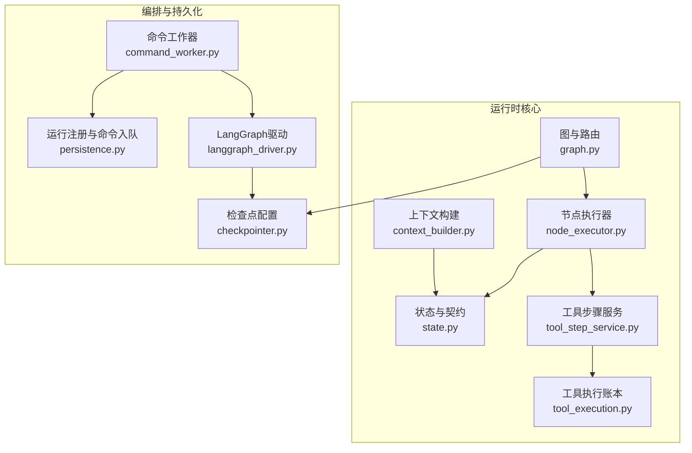
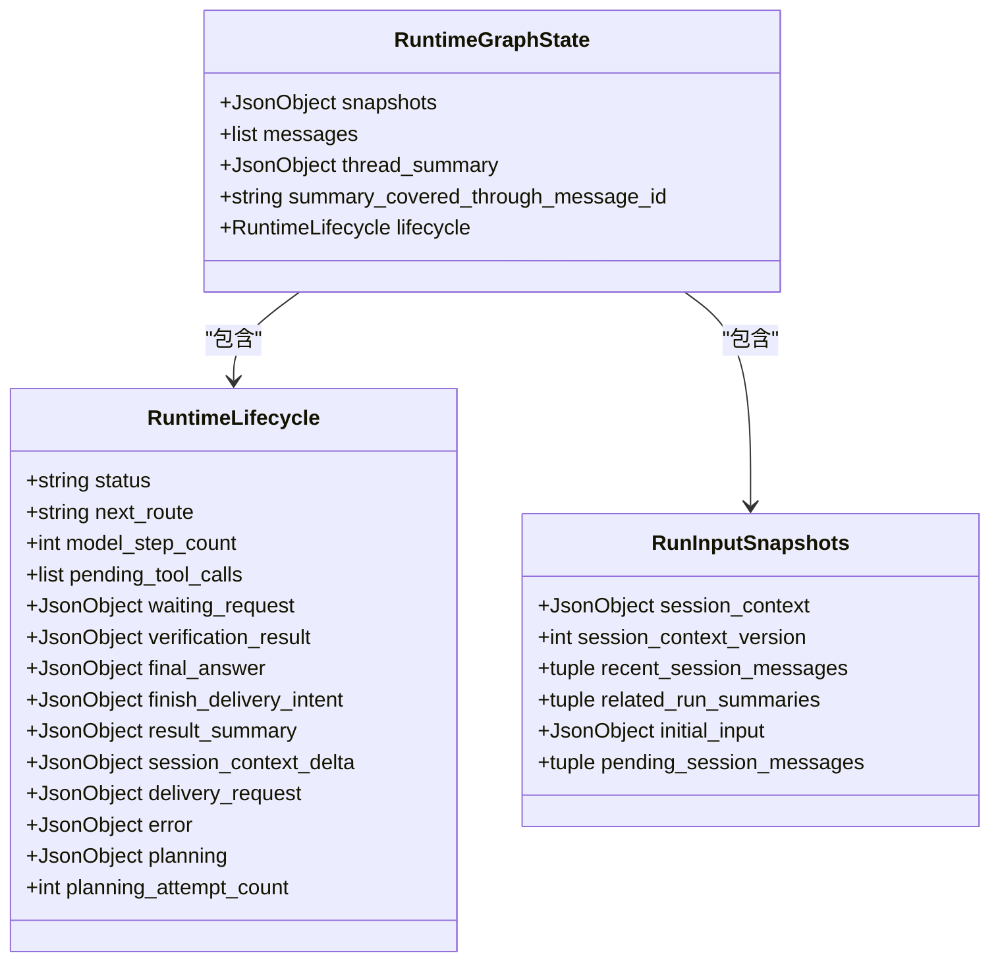
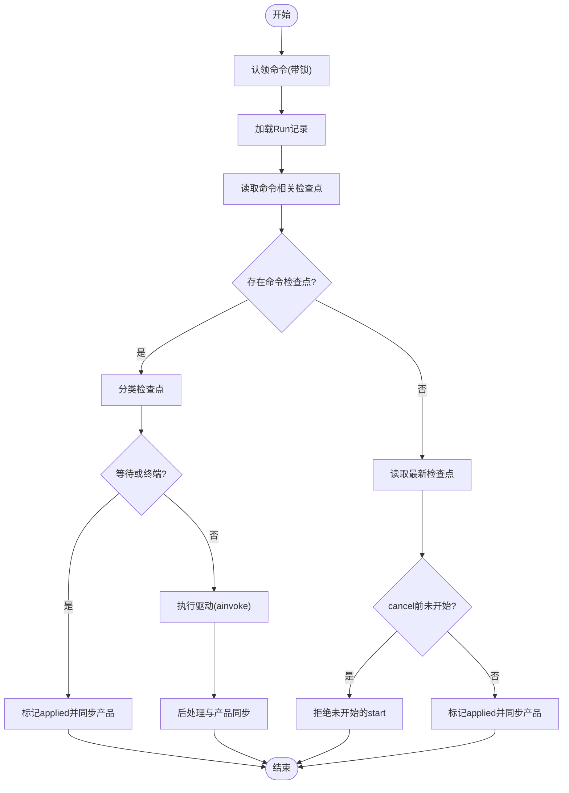
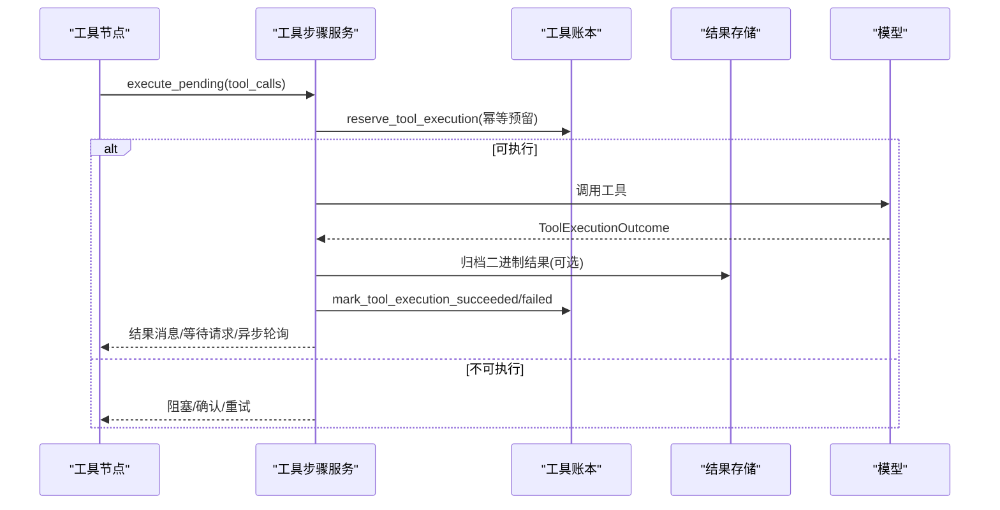
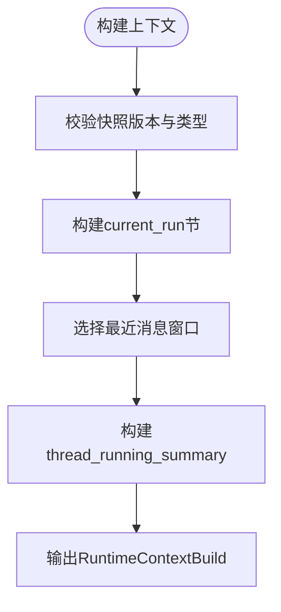
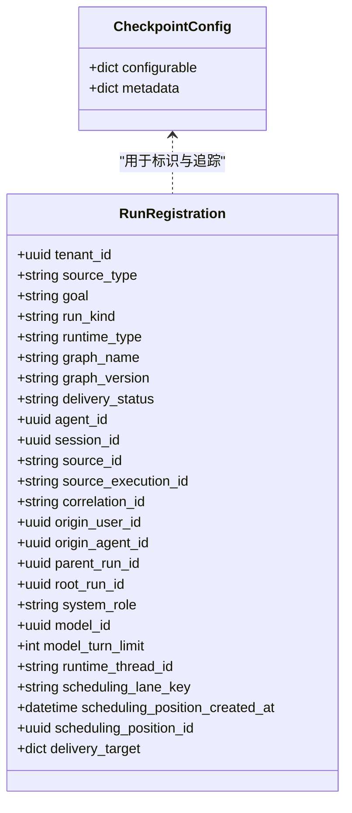
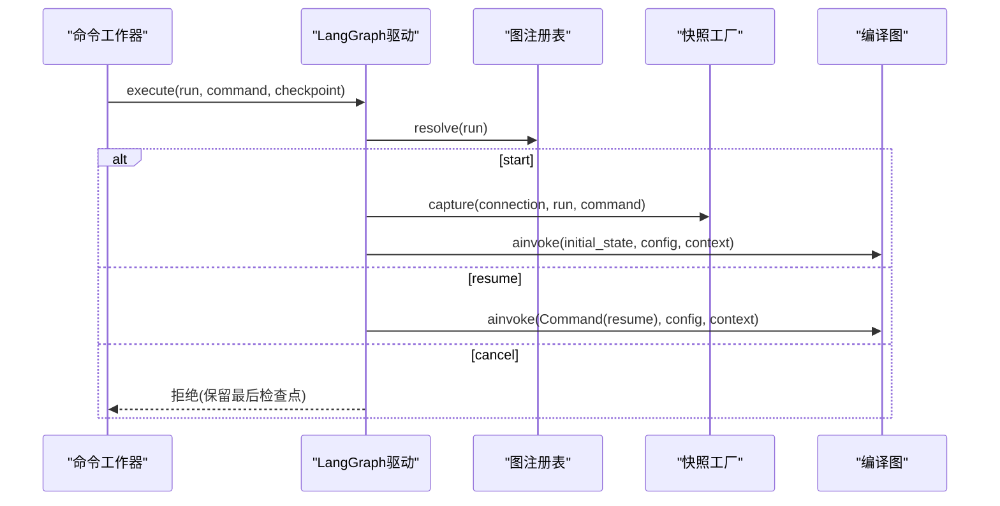
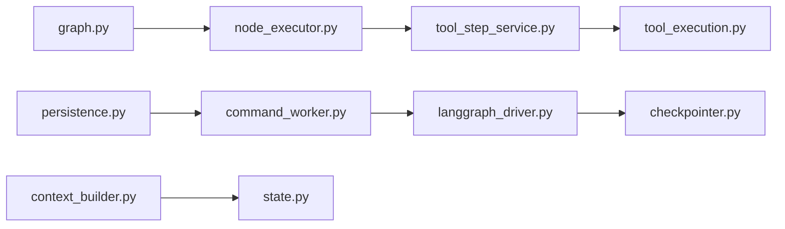

# Agent运行时

<cite>
**本文引用的文件**   
- [langgraph_driver.py](file://backend/app/services/agent_runtime/langgraph_driver.py)
- [state.py](file://backend/app/services/agent_runtime/state.py)
- [checkpointer.py](file://backend/app/services/agent_runtime/checkpointer.py)
- [persistence.py](file://backend/app/services/agent_runtime/persistence.py)
- [graph.py](file://backend/app/services/agent_runtime/graph.py)
- [node_executor.py](file://backend/app/services/agent_runtime/node_executor.py)
- [context_builder.py](file://backend/app/services/agent_runtime/context_builder.py)
- [command_worker.py](file://backend/app/services/agent_runtime/command_worker.py)
- [tool_execution.py](file://backend/app/services/agent_runtime/tool_execution.py)
- [tool_step_service.py](file://backend/app/services/agent_runtime/tool_step_service.py)
</cite>

## 目录
1. [简介](#简介)
2. [项目结构](#项目结构)
3. [核心组件](#核心组件)
4. [架构总览](#架构总览)
5. [详细组件分析](#详细组件分析)
6. [依赖关系分析](#依赖关系分析)
7. [性能考量](#性能考量)
8. [故障排查指南](#故障排查指南)
9. [结论](#结论)
10. [附录：扩展与自定义指南](#附录扩展与自定义指南)

## 简介
本技术文档围绕Clawith的Agent运行时系统，系统性阐述基于LangGraph的状态机驱动引擎、确定性工作流设计、工具执行框架、上下文管理、检查点与恢复策略、Agent生命周期与内存持久化、技能加载机制、异步任务处理、错误恢复与性能监控等。文档面向不同技术背景的读者，提供从高层架构到代码级细节的分层说明，并给出可视化图表、最佳实践与故障排查方法。

## 项目结构
Agent运行时位于后端服务模块中，采用按功能域划分的组织方式：
- 状态与契约：定义可序列化状态、生命周期、消息通道与节点执行器接口
- 图与工作流：编译LangGraph状态图、控制守卫与路由策略
- 命令编排：命令入队、认领、重试、应用与产品侧同步
- 检查点与持久化：PostgreSQL检查点、加密序列化、线程与命令配置
- 工具执行：幂等性账本、结果归档、异步轮询与恢复
- 上下文构建：会话上下文快照、消息窗口选择、组上下文裁剪



**图示来源** 
- [graph.py:241-292](file://backend/app/services/agent_runtime/graph.py#L241-L292)
- [state.py:124-135](file://backend/app/services/agent_runtime/state.py#L124-L135)
- [context_builder.py:374-494](file://backend/app/services/agent_runtime/context_builder.py#L374-L494)
- [node_executor.py:469-800](file://backend/app/services/agent_runtime/node_executor.py#L469-L800)
- [tool_step_service.py:583-800](file://backend/app/services/agent_runtime/tool_step_service.py#L583-L800)
- [tool_execution.py:568-615](file://backend/app/services/agent_runtime/tool_execution.py#L568-L615)
- [command_worker.py:312-433](file://backend/app/services/agent_runtime/command_worker.py#L312-L433)
- [persistence.py:321-401](file://backend/app/services/agent_runtime/persistence.py#L321-L401)
- [checkpointer.py:169-178](file://backend/app/services/agent_runtime/checkpointer.py#L169-L178)
- [langgraph_driver.py:323-491](file://backend/app/services/agent_runtime/langgraph_driver.py#L323-L491)

**章节来源**
- [graph.py:241-292](file://backend/app/services/agent_runtime/graph.py#L241-L292)
- [state.py:124-135](file://backend/app/services/agent_runtime/state.py#L124-L135)
- [command_worker.py:312-433](file://backend/app/services/agent_runtime/command_worker.py#L312-L433)
- [checkpointer.py:169-178](file://backend/app/services/agent_runtime/checkpointer.py#L169-L178)

## 核心组件
- 状态与契约（state.py）：定义RuntimeGraphState、RuntimeLifecycle、RunInputSnapshots、RuntimeContext等，确保状态可序列化、可回滚、可恢复。
- 图与工作流（graph.py）：编译LangGraph状态图，定义控制守卫、压缩、模型调用、工具执行、验证、等待与终态节点及路由策略。
- 节点执行器（node_executor.py）：将业务逻辑注入为确定性节点转换，协调模型、工具、压缩、验证与最终化。
- 上下文构建（context_builder.py）：冻结新Run输入、构建会话上下文快照、选择工具安全消息窗口、支持组上下文裁剪。
- 工具执行（tool_execution.py）：幂等性决策、参数清洗、结果规范化、元数据边界、敏感信息脱敏。
- 工具步骤服务（tool_step_service.py）：顺序执行工具批次、异步轮询调度、结果归档、等待请求生成。
- 检查点（checkpointer.py）：PostgreSQL检查点、JSON+序列化、AES可选加密、线程与命令配置。
- 运行持久化（persistence.py）：Run注册、命令入队、认领锁、尝试计数、应用标记与产品同步。
- LangGraph驱动（langgraph_driver.py）：读取最新或命令相关检查点、启动/恢复/取消命令、构造初始状态与上下文。
- 命令工作器（command_worker.py）：认领命令、分类检查点、执行驱动、后处理与拒绝处理、心跳续租。

**章节来源**
- [state.py:124-135](file://backend/app/services/agent_runtime/state.py#L124-L135)
- [graph.py:241-292](file://backend/app/services/agent_runtime/graph.py#L241-L292)
- [node_executor.py:469-800](file://backend/app/services/agent_runtime/node_executor.py#L469-L800)
- [context_builder.py:374-494](file://backend/app/services/agent_runtime/context_builder.py#L374-L494)
- [tool_execution.py:568-615](file://backend/app/services/agent_runtime/tool_execution.py#L568-L615)
- [tool_step_service.py:583-800](file://backend/app/services/agent_runtime/tool_step_service.py#L583-L800)
- [checkpointer.py:169-178](file://backend/app/services/agent_runtime/checkpointer.py#L169-L178)
- [persistence.py:321-401](file://backend/app/services/agent_runtime/persistence.py#L321-L401)
- [langgraph_driver.py:323-491](file://backend/app/services/agent_runtime/langgraph_driver.py#L323-L491)
- [command_worker.py:312-433](file://backend/app/services/agent_runtime/command_worker.py#L312-L433)

## 架构总览
Agent运行时以“命令-检查点”为核心，通过LangGraph状态机实现确定性工作流。命令入队后由工作器认领，驱动LangGraph在指定线程上推进状态；每次推进写入检查点，保证崩溃恢复与跨进程一致性。工具执行通过幂等账本保障重复调用不产生副作用，支持异步轮询与结果归档。上下文构建确保模型可见输入稳定且可压缩，避免历史膨胀。

```mermaid
sequenceDiagram
participant Client as "客户端/上游"
participant Persistence as "持久化层<br/>persistence.py"
participant Worker as "命令工作器<br/>command_worker.py"
participant Driver as "LangGraph驱动<br/>langgraph_driver.py"
participant Graph as "状态图<br/>graph.py"
participant Checkpoint as "检查点<br/>checkpointer.py"
participant ToolLedger as "工具账本<br/>tool_execution.py"
participant ToolSvc as "工具步骤服务<br/>tool_step_service.py"
Client->>Persistence : 注册Run并入队start命令
Persistence-->>Client : 返回已存在或新建Run与命令
Worker->>Persistence : 认领命令(带锁)
Worker->>Driver : 读取命令相关检查点
alt 存在命令检查点
Worker->>Worker : 分类检查点(等待/终端/不一致)
opt 等待或终端
Worker-->>Client : 直接应用并同步产品
else 可执行
Worker->>Driver : 执行命令(ainvoke)
Driver->>Graph : 推进状态(compact/model/tool/verify/wait/terminal)
Graph->>Checkpoint : 写入检查点
Graph->>ToolSvc : 执行工具批次
ToolSvc->>ToolLedger : 幂等预留/结算
ToolSvc-->>Graph : 结果消息/等待请求/异步轮询
end
else 无命令检查点
Worker->>Driver : 读取最新检查点
Driver->>Graph : 启动/恢复/取消
Graph->>Checkpoint : 写入检查点
end
Worker->>Persistence : 标记applied/产品同步
```

**图示来源** 
- [persistence.py:321-401](file://backend/app/services/agent_runtime/persistence.py#L321-L401)
- [command_worker.py:717-800](file://backend/app/services/agent_runtime/command_worker.py#L717-L800)
- [langgraph_driver.py:395-491](file://backend/app/services/agent_runtime/langgraph_driver.py#L395-L491)
- [graph.py:241-292](file://backend/app/services/agent_runtime/graph.py#L241-L292)
- [checkpointer.py:169-178](file://backend/app/services/agent_runtime/checkpointer.py#L169-L178)
- [tool_execution.py:568-615](file://backend/app/services/agent_runtime/tool_execution.py#L568-L615)
- [tool_step_service.py:583-800](file://backend/app/services/agent_runtime/tool_step_service.py#L583-L800)

## 详细组件分析

### 状态机与确定性工作流（graph.py + state.py）
- 状态字段：messages使用LangGraph消息通道reducer，lifecycle记录权威状态与路由，snapshots冻结Run输入。
- 路由策略：control_guard根据lifecycle.status与next_route决定进入compact/model/tool/verify/wait/terminal。
- 重试策略：compact与tool节点分别配置RetryPolicy，仅对特定异常重试，保证确定性。
- 等待与中断：wait节点通过interrupt挂起，resume时携带correlation_id校验。



**图示来源** 
- [state.py:124-135](file://backend/app/services/agent_runtime/state.py#L124-L135)
- [state.py:100-122](file://backend/app/services/agent_runtime/state.py#L100-L122)
- [state.py:70-98](file://backend/app/services/agent_runtime/state.py#L70-L98)

**章节来源**
- [graph.py:241-292](file://backend/app/services/agent_runtime/graph.py#L241-L292)
- [state.py:124-135](file://backend/app/services/agent_runtime/state.py#L124-L135)

### 命令工作器与检查点分类（command_worker.py + checkpointer.py）
- 认领与续租：claim_next_command使用with_for_update(skip_locked=True)获取最老可用命令，支持lane持有与重试上限。
- 检查点分类：classify_checkpoint依据values/next/tasks/interrupts一致性判定not_started/runnable/waiting/terminal/inconsistent。
- 应用与产品同步：mark_command_applied记录applied_checkpoint_id并设置product_sync_pending标记，后续独立重试。



**图示来源** 
- [command_worker.py:635-674](file://backend/app/services/agent_runtime/command_worker.py#L635-L674)
- [command_worker.py:717-800](file://backend/app/services/agent_runtime/command_worker.py#L717-L800)
- [checkpointer.py:29-49](file://backend/app/services/agent_runtime/checkpointer.py#L29-L49)

**章节来源**
- [command_worker.py:312-433](file://backend/app/services/agent_runtime/command_worker.py#L312-L433)
- [command_worker.py:717-800](file://backend/app/services/agent_runtime/command_worker.py#L717-L800)
- [checkpointer.py:29-49](file://backend/app/services/agent_runtime/checkpointer.py#L29-L49)

### 工具执行框架与幂等性（tool_execution.py + tool_step_service.py）
- 幂等预留：reserve_tool_execution基于tool_call_id与run_id唯一键，防止重复执行。
- 参数清洗：sanitize_tool_arguments递归清理敏感键、URL与DSN，限制元数据大小。
- 结果规范化：normalize_tool_outcome统一status/retryable/metadata，超大摘要归档至私有存储。
- 异步轮询：_async_poll_schedule_metadata生成poll指令，tool_step_service组装proposal与waiting_request。



**图示来源** 
- [tool_execution.py:568-615](file://backend/app/services/agent_runtime/tool_execution.py#L568-L615)
- [tool_execution.py:409-565](file://backend/app/services/agent_runtime/tool_execution.py#L409-L565)
- [tool_step_service.py:583-800](file://backend/app/services/agent_runtime/tool_step_service.py#L583-L800)

**章节来源**
- [tool_execution.py:568-615](file://backend/app/services/agent_runtime/tool_execution.py#L568-L615)
- [tool_step_service.py:583-800](file://backend/app/services/agent_runtime/tool_step_service.py#L583-L800)

### 上下文管理与会话快照（context_builder.py + state.py）
- 输入快照：capture_run_inputs冻结initial_input、session_context、recent/pending消息，确保恢复一致性。
- 消息窗口：build_recent_tool_safe_window基于工具账本选择最近安全窗口，避免历史膨胀。
- 组上下文：Group裁剪支持cutoff位置重建，保证确定性水印。



**图示来源** 
- [context_builder.py:374-494](file://backend/app/services/agent_runtime/context_builder.py#L374-L494)
- [context_builder.py:496-576](file://backend/app/services/agent_runtime/context_builder.py#L496-L576)
- [state.py:124-135](file://backend/app/services/agent_runtime/state.py#L124-L135)

**章节来源**
- [context_builder.py:374-494](file://backend/app/services/agent_runtime/context_builder.py#L374-L494)
- [context_builder.py:496-576](file://backend/app/services/agent_runtime/context_builder.py#L496-L576)

### 检查点与持久化（checkpointer.py + persistence.py）
- 检查点配置：runtime_thread_config与runtime_command_config绑定thread_id与clawith_run_id/command_id。
- 数据库URL：checkpoint_database_url强制search_path到专用schema，支持sslmode解析。
- 运行注册：register_run_with_start原子创建Run与start命令，并发冲突回退到已有记录。



**图示来源** 
- [checkpointer.py:29-68](file://backend/app/services/agent_runtime/checkpointer.py#L29-L68)
- [persistence.py:34-63](file://backend/app/services/agent_runtime/persistence.py#L34-L63)

**章节来源**
- [checkpointer.py:169-178](file://backend/app/services/agent_runtime/checkpointer.py#L169-L178)
- [persistence.py:321-401](file://backend/app/services/agent_runtime/persistence.py#L321-L401)

### LangGraph驱动与命令执行（langgraph_driver.py）
- 图注册：RuntimeGraphRegistry区分普通与group_planning拓扑，确保兼容旧检查点。
- 输入快照工厂：RuntimeInputSnapshotFactory捕获start输入，Static版本用于可信快照。
- 执行流程：execute分支start/resume/cancel，构造config与context，调用compiled.ainvoke。



**图示来源** 
- [langgraph_driver.py:323-491](file://backend/app/services/agent_runtime/langgraph_driver.py#L323-L491)
- [langgraph_driver.py:82-152](file://backend/app/services/agent_runtime/langgraph_driver.py#L82-L152)

**章节来源**
- [langgraph_driver.py:323-491](file://backend/app/services/agent_runtime/langgraph_driver.py#L323-L491)

## 依赖关系分析
- 低耦合高内聚：各模块通过Protocol与TypedDict解耦，如RuntimeNodeExecutor、RuntimeModelStepService等。
- 外部依赖：LangGraph状态图、SQLAlchemy异步会话、PostgreSQL检查点、可选AES加密。
- 潜在循环：graph依赖node_executor，node_executor依赖tool_step_service，tool_step_service依赖tool_execution，无循环引用。



**图示来源** 
- [graph.py:241-292](file://backend/app/services/agent_runtime/graph.py#L241-L292)
- [node_executor.py:469-800](file://backend/app/services/agent_runtime/node_executor.py#L469-L800)
- [tool_step_service.py:583-800](file://backend/app/services/agent_runtime/tool_step_service.py#L583-L800)
- [tool_execution.py:568-615](file://backend/app/services/agent_runtime/tool_execution.py#L568-L615)
- [command_worker.py:312-433](file://backend/app/services/agent_runtime/command_worker.py#L312-L433)
- [langgraph_driver.py:323-491](file://backend/app/services/agent_runtime/langgraph_driver.py#L323-L491)
- [checkpointer.py:169-178](file://backend/app/services/agent_runtime/checkpointer.py#L169-L178)
- [persistence.py:321-401](file://backend/app/services/agent_runtime/persistence.py#L321-L401)
- [context_builder.py:374-494](file://backend/app/services/agent_runtime/context_builder.py#L374-L494)
- [state.py:124-135](file://backend/app/services/agent_runtime/state.py#L124-L135)

**章节来源**
- [graph.py:241-292](file://backend/app/services/agent_runtime/graph.py#L241-L292)
- [command_worker.py:312-433](file://backend/app/services/agent_runtime/command_worker.py#L312-L433)

## 性能考量
- 检查点体积：通过Thread Compact与消息窗口选择减少历史长度，降低序列化与传输开销。
- 工具结果归档：大结果走私有存储，仅保留引用与哈希，避免检查点膨胀。
- 重试策略：仅对safe read与瞬态错误重试，避免无效重放。
- 数据库锁：with_for_update(skip_locked=True)提升并发吞吐，减少争用。
- 连接池与TTL：命令认领TTL与续租间隔平衡可靠性与资源占用。

[本节为通用指导，无需具体文件引用]

## 故障排查指南
- 检查点不一致：若classify_checkpoint返回inconsistent，检查values/next/tasks/interrupts是否一致，必要时回滚到上一稳定检查点。
- 工具幂等失败：查看tool_execution_ledger中reservation状态与attempt_count，确认lease_owner与TTL。
- 命令被拒绝：根据error_code定位原因（如unsupported_command、run_not_found、already_terminal），检查persistence入队与认领逻辑。
- 上下文构建错误：校验session_context版本与snapshot一致性，确认消息角色与ID合法性。
- 异步轮询未触发：核对async_operation.poll指令与due_at时间戳，确认调度器是否成功提交。

**章节来源**
- [command_worker.py:717-800](file://backend/app/services/agent_runtime/command_worker.py#L717-L800)
- [tool_execution.py:409-565](file://backend/app/services/agent_runtime/tool_execution.py#L409-L565)
- [context_builder.py:496-576](file://backend/app/services/agent_runtime/context_builder.py#L496-L576)

## 结论
Clawith Agent运行时以LangGraph状态机为核心，结合幂等工具账本与健壮的检查点机制，实现了确定性、可恢复、可扩展的Agent执行环境。通过严格的上下文构建与消息窗口控制，系统在长对话与复杂工具链场景下保持高效与稳定。未来可在技能加载、多租户隔离与监控埋点上进一步增强。

[本节为总结，无需具体文件引用]

## 附录：扩展与自定义指南
- 自定义工具开发
  - 定义工具名称、参数与返回值，遵循tool_execution的side_effect_classification与retry_policy约定。
  - 在tool_step_service中注册工具提供者与执行器，确保幂等预留与结果归档路径正确。
  - 使用sanitize_tool_arguments进行参数清洗，避免敏感信息泄露。
- 状态扩展方法
  - 在state.py中扩展RuntimeGraphState或RuntimeLifecycle字段，确保向后兼容与序列化安全。
  - 在graph.py的路由与节点中处理新增字段，避免破坏现有检查点解码。
- 调试技巧
  - 启用检查点观察：通过read_latest/read_for_command打印checkpoint_id与lifecycle状态。
  - 工具执行审计：查看AgentRunEvent中的activity日志，跟踪thinking/progress/tool_call事件。
  - 上下文快照对比：比较capture_run_inputs与build输出的RuntimeContextBuild，定位差异。

**章节来源**
- [tool_execution.py:323-349](file://backend/app/services/agent_runtime/tool_execution.py#L323-L349)
- [tool_step_service.py:583-800](file://backend/app/services/agent_runtime/tool_step_service.py#L583-L800)
- [state.py:124-135](file://backend/app/services/agent_runtime/state.py#L124-L135)
- [graph.py:241-292](file://backend/app/services/agent_runtime/graph.py#L241-L292)
- [context_builder.py:374-494](file://backend/app/services/agent_runtime/context_builder.py#L374-L494)