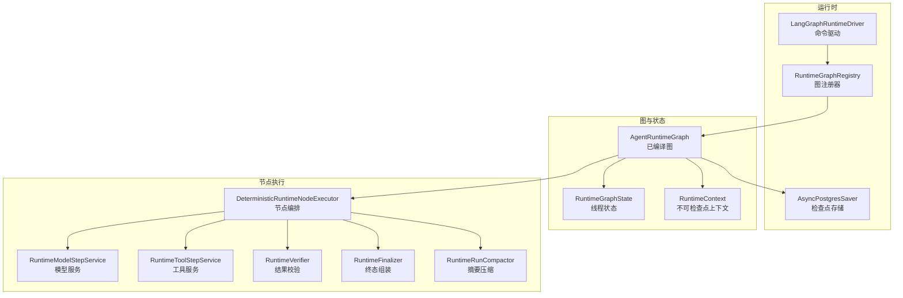
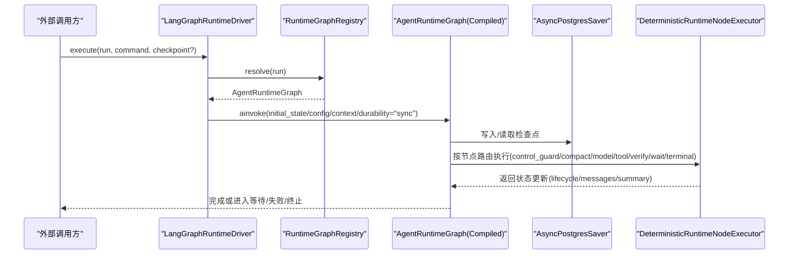
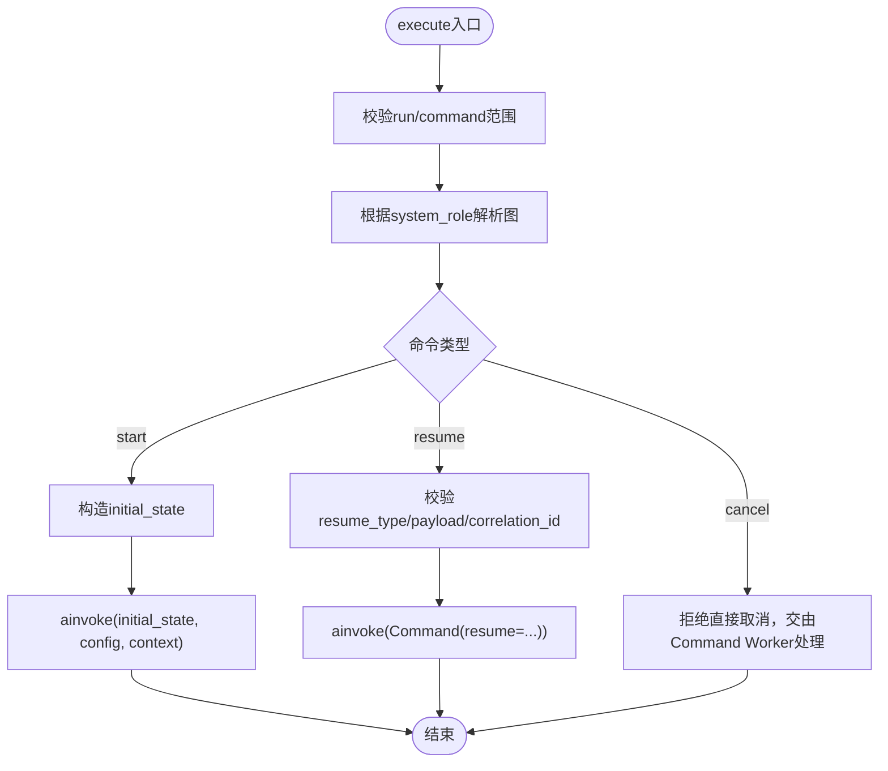
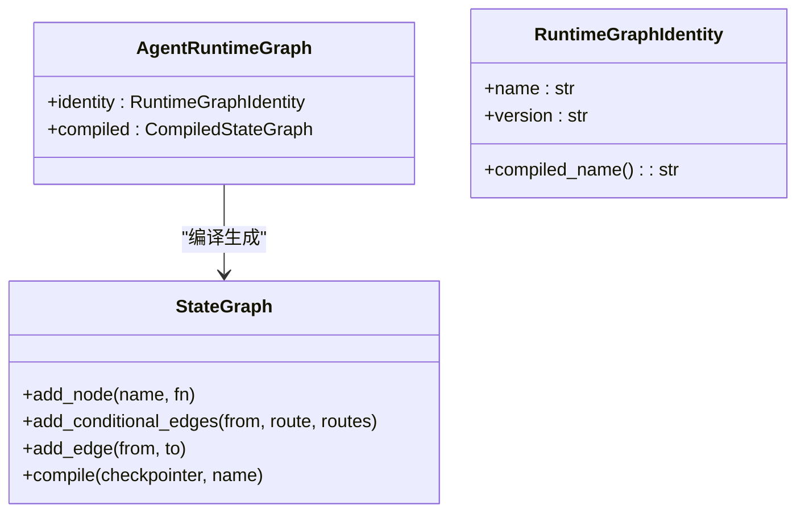
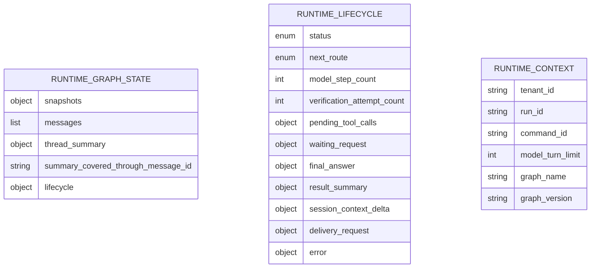
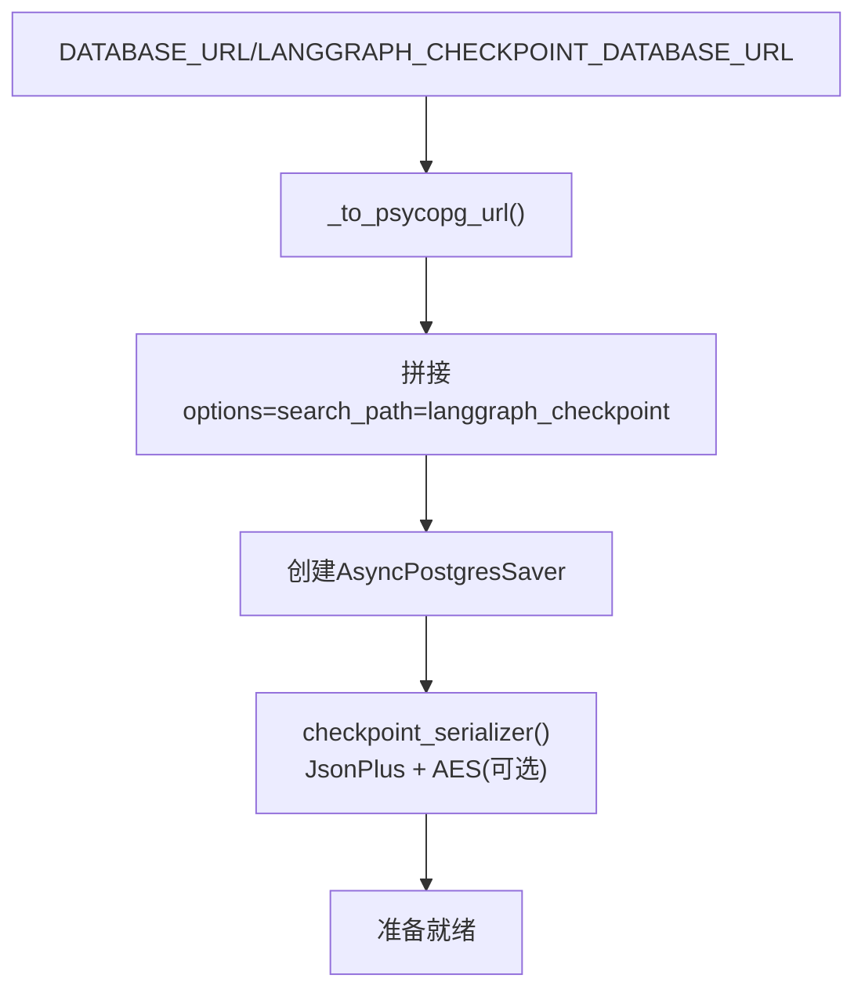
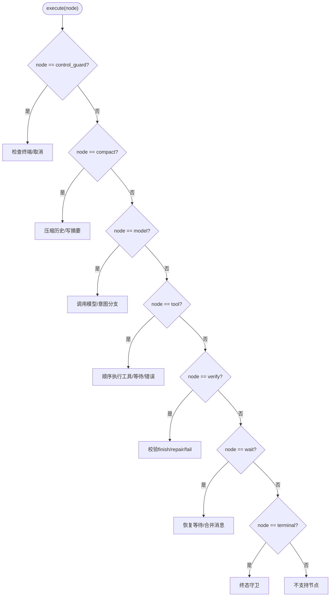
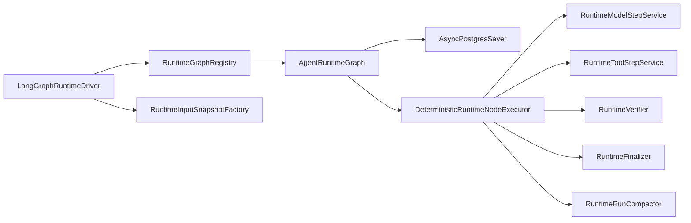

# LangGraph状态机引擎

<cite>
**本文引用的文件**   
- [backend/app/services/agent_runtime/langgraph_driver.py](file://backend/app/services/agent_runtime/langgraph_driver.py)
- [backend/app/services/agent_runtime/graph.py](file://backend/app/services/agent_runtime/graph.py)
- [backend/app/services/agent_runtime/state.py](file://backend/app/services/agent_runtime/state.py)
- [backend/app/services/agent_runtime/checkpointer.py](file://backend/app/services/agent_runtime/checkpointer.py)
- [backend/app/services/agent_runtime/node_executor.py](file://backend/app/services/agent_runtime/node_executor.py)
- [backend/app/scripts/setup_langgraph_checkpoints.py](file://backend/app/scripts/setup_langgraph_checkpoints.py)
- [backend/tests/test_agent_runtime_langgraph_driver.py](file://backend/tests/test_agent_runtime_langgraph_driver.py)
</cite>

## 目录
1. [简介](#简介)
2. [项目结构](#项目结构)
3. [核心组件](#核心组件)
4. [架构总览](#架构总览)
5. [详细组件分析](#详细组件分析)
6. [依赖关系分析](#依赖关系分析)
7. [性能考虑](#性能考虑)
8. [故障排查指南](#故障排查指南)
9. [结论](#结论)
10. [附录：自定义节点与扩展指南](#附录自定义节点与扩展指南)

## 简介
本技术文档面向Clawith的LangGraph状态机引擎，系统性阐述确定性工作流的设计原理与实现机制。内容覆盖状态转换规则、节点执行流程、错误处理策略；图构建过程、节点定义方式、边连接逻辑；状态管理、上下文传递、数据流转机制；以及自定义节点开发、状态扩展方法与调试技巧。同时提供性能优化建议与故障排查方法，帮助读者快速理解并高效使用该系统。

## 项目结构
该引擎位于后端服务中，围绕LangGraph的StateGraph与Checkpointer构建可持久化、可恢复、可重试的确定性工作流。关键模块包括：
- 驱动层：负责命令调度、快照读取、运行生命周期控制
- 图构建层：定义节点、边、路由策略与编译配置
- 状态层：定义线程状态、生命周期、消息通道与上下文契约
- 检查点层：封装PostgreSQL持久化、序列化与加密
- 节点执行层：实现各业务节点的确定性逻辑（模型调用、工具执行、校验、等待等）
- 脚本层：初始化或升级检查点表结构

**图表来源** 
- [backend/app/services/agent_runtime/langgraph_driver.py:323-491](file://backend/app/services/agent_runtime/langgraph_driver.py#L323-L491)
- [backend/app/services/agent_runtime/graph.py:241-291](file://backend/app/services/agent_runtime/graph.py#L241-L291)
- [backend/app/services/agent_runtime/state.py:124-144](file://backend/app/services/agent_runtime/state.py#L124-L144)
- [backend/app/services/agent_runtime/checkpointer.py:169-178](file://backend/app/services/agent_runtime/checkpointer.py#L169-L178)
- [backend/app/services/agent_runtime/node_executor.py:469-492](file://backend/app/services/agent_runtime/node_executor.py#L469-L492)

**章节来源**
- [backend/app/services/agent_runtime/langgraph_driver.py:1-501](file://backend/app/services/agent_runtime/langgraph_driver.py#L1-L501)
- [backend/app/services/agent_runtime/graph.py:1-292](file://backend/app/services/agent_runtime/graph.py#L1-L292)
- [backend/app/services/agent_runtime/state.py:1-216](file://backend/app/services/agent_runtime/state.py#L1-L216)
- [backend/app/services/agent_runtime/checkpointer.py:1-178](file://backend/app/services/agent_runtime/checkpointer.py#L1-L178)
- [backend/app/services/agent_runtime/node_executor.py:1-1207](file://backend/app/services/agent_runtime/node_executor.py#L1-L1207)
- [backend/app/scripts/setup_langgraph_checkpoints.py:1-74](file://backend/app/scripts/setup_langgraph_checkpoints.py#L1-L74)

## 核心组件
- 驱动层（LangGraphRuntimeDriver）：统一入口，负责读取最新/指定检查点、解析命令（start/resume/cancel）、构造初始状态、调用图的ainvoke推进执行。
- 图构建（build_agent_runtime_graph）：基于StateGraph声明式构建节点与边，注入RetryPolicy，编译为CompiledStateGraph。
- 状态契约（RuntimeGraphState/RuntimeLifecycle）：以TypedDict描述线程状态与生命周期，消息通过LangChain消息通道与add_messages归约器维护。
- 检查点（checkpointer）：封装PostgreSQL连接、搜索路径隔离、JSON+序列化与可选AES加密，提供thread/command配置绑定。
- 节点执行（DeterministicRuntimeNodeExecutor）：实现control_guard/compact/model/tool/verify/wait/terminal等节点逻辑，严格校验状态与过渡。

**章节来源**
- [backend/app/services/agent_runtime/langgraph_driver.py:323-491](file://backend/app/services/agent_runtime/langgraph_driver.py#L323-L491)
- [backend/app/services/agent_runtime/graph.py:241-291](file://backend/app/services/agent_runtime/graph.py#L241-L291)
- [backend/app/services/agent_runtime/state.py:124-144](file://backend/app/services/agent_runtime/state.py#L124-L144)
- [backend/app/services/agent_runtime/checkpointer.py:29-68](file://backend/app/services/agent_runtime/checkpointer.py#L29-L68)
- [backend/app/services/agent_runtime/node_executor.py:469-492](file://backend/app/services/agent_runtime/node_executor.py#L469-L492)

## 架构总览
下图展示从命令到执行的端到端流程，强调检查点持久化与确定性路由。

**图表来源** 
- [backend/app/services/agent_runtime/langgraph_driver.py:395-491](file://backend/app/services/agent_runtime/langgraph_driver.py#L395-L491)
- [backend/app/services/agent_runtime/graph.py:241-291](file://backend/app/services/agent_runtime/graph.py#L241-L291)
- [backend/app/services/agent_runtime/checkpointer.py:169-178](file://backend/app/services/agent_runtime/checkpointer.py#L169-L178)
- [backend/app/services/agent_runtime/node_executor.py:1154-1184](file://backend/app/services/agent_runtime/node_executor.py#L1154-L1184)

## 详细组件分析

### 驱动层：LangGraphRuntimeDriver
职责
- 根据run选择当前部署的图（支持group_planning拓扑）
- 读取最新或指定command的检查点快照
- 处理start/resume/cancel三类命令，构造初始状态或Command.resume
- 通过ainvoke推进执行，durability="sync"确保检查点同步落盘

关键点
- 输入快照工厂：在start时捕获不可变输入，保证resume一致性
- 范围校验：tenant_id/run_id/command_id必须匹配，防止越权
- 等待恢复：resume_type与correlation_id需与waiting_request一致

**图表来源** 
- [backend/app/services/agent_runtime/langgraph_driver.py:395-491](file://backend/app/services/agent_runtime/langgraph_driver.py#L395-L491)

**章节来源**
- [backend/app/services/agent_runtime/langgraph_driver.py:46-80](file://backend/app/services/agent_runtime/langgraph_driver.py#L46-L80)
- [backend/app/services/agent_runtime/langgraph_driver.py:82-152](file://backend/app/services/agent_runtime/langgraph_driver.py#L82-L152)
- [backend/app/services/agent_runtime/langgraph_driver.py:176-214](file://backend/app/services/agent_runtime/langgraph_driver.py#L176-L214)
- [backend/app/services/agent_runtime/langgraph_driver.py:216-257](file://backend/app/services/agent_runtime/langgraph_driver.py#L216-L257)
- [backend/app/services/agent_runtime/langgraph_driver.py:337-394](file://backend/app/services/agent_runtime/langgraph_driver.py#L337-L394)
- [backend/app/services/agent_runtime/langgraph_driver.py:395-491](file://backend/app/services/agent_runtime/langgraph_driver.py#L395-L491)

### 图构建：build_agent_runtime_graph
职责
- 声明式添加节点：control_guard、compact、model、tool、verify、wait、terminal
- 设置条件边：由route_after_control依据lifecycle决定下一跳
- 注入RetryPolicy：compact与tool节点具备重试能力
- 编译图：绑定checkpointer与名称标识

路由策略
- compact：running或waiting_*均可进入
- model：仅running
- tool：仅running
- verify：verifying
- wait：waiting_user/waiting_external/waiting_agent
- terminal：completed/failed/cancelled

**图表来源** 
- [backend/app/services/agent_runtime/graph.py:76-114](file://backend/app/services/agent_runtime/graph.py#L76-L114)
- [backend/app/services/agent_runtime/graph.py:241-291](file://backend/app/services/agent_runtime/graph.py#L241-L291)

**章节来源**
- [backend/app/services/agent_runtime/graph.py:30-47](file://backend/app/services/agent_runtime/graph.py#L30-L47)
- [backend/app/services/agent_runtime/graph.py:229-239](file://backend/app/services/agent_runtime/graph.py#L229-L239)
- [backend/app/services/agent_runtime/graph.py:241-291](file://backend/app/services/agent_runtime/graph.py#L241-L291)

### 状态与上下文：RuntimeGraphState与RuntimeContext
- RuntimeGraphState：包含snapshots、messages（带add_messages归约）、thread_summary、lifecycle等
- RuntimeLifecycle：权威的状态机字段，含status、next_route、计数器等
- RuntimeContext：不可检查点的运行时上下文，携带租户、运行、命令身份及模型限制等

消息通道
- messages字段采用LangChain消息通道，支持规范化与兼容旧格式迁移

**图表来源** 
- [backend/app/services/agent_runtime/state.py:124-144](file://backend/app/services/agent_runtime/state.py#L124-L144)
- [backend/app/services/agent_runtime/state.py:100-122](file://backend/app/services/agent_runtime/state.py#L100-L122)
- [backend/app/services/agent_runtime/state.py:194-216](file://backend/app/services/agent_runtime/state.py#L194-L216)

**章节来源**
- [backend/app/services/agent_runtime/state.py:1-216](file://backend/app/services/agent_runtime/state.py#L1-L216)

### 检查点与持久化：checkpointer
- runtime_thread_config：精确绑定thread_id与checkpoint_id
- runtime_command_config：附加clawith_run_id与clawith_command_id元数据
- 数据库URL处理：强制search_path隔离至langgraph_checkpoint，统一ssl参数
- 序列化：JsonPlusSerializer，允许白名单msgpack类型，可选AES加密

**图表来源** 
- [backend/app/services/agent_runtime/checkpointer.py:71-136](file://backend/app/services/agent_runtime/checkpointer.py#L71-L136)
- [backend/app/services/agent_runtime/checkpointer.py:145-167](file://backend/app/services/agent_runtime/checkpointer.py#L145-L167)
- [backend/app/scripts/setup_langgraph_checkpoints.py:56-66](file://backend/app/scripts/setup_langgraph_checkpoints.py#L56-L66)

**章节来源**
- [backend/app/services/agent_runtime/checkpointer.py:29-68](file://backend/app/services/agent_runtime/checkpointer.py#L29-L68)
- [backend/app/services/agent_runtime/checkpointer.py:138-178](file://backend/app/services/agent_runtime/checkpointer.py#L138-L178)
- [backend/app/scripts/setup_langgraph_checkpoints.py:1-74](file://backend/app/scripts/setup_langgraph_checkpoints.py#L1-L74)

### 节点执行：DeterministicRuntimeNodeExecutor
节点职责
- control_guard：终端状态拦截、取消信号检测
- compact：按需压缩历史，替换messages并写回摘要
- model：调用模型服务，处理tool_calls/wait/finish/text/error意图
- tool：顺序执行待调用工具，支持等待/取消/错误分支
- verify：对finish候选进行校验，支持repair与fail
- wait：等待外部输入，支持user/agent/external三种等待类型
- terminal：终态守卫，禁止非终态进入

重试与修复
- compact与tool节点具备RetryPolicy
- model text意图支持有限次修复（含write_file协议特殊限制）
- verify支持最多N次repair尝试

**图表来源** 
- [backend/app/services/agent_runtime/node_executor.py:493-512](file://backend/app/services/agent_runtime/node_executor.py#L493-L512)
- [backend/app/services/agent_runtime/node_executor.py:513-571](file://backend/app/services/agent_runtime/node_executor.py#L513-L571)
- [backend/app/services/agent_runtime/node_executor.py:572-806](file://backend/app/services/agent_runtime/node_executor.py#L572-L806)
- [backend/app/services/agent_runtime/node_executor.py:807-940](file://backend/app/services/agent_runtime/node_executor.py#L807-L940)
- [backend/app/services/agent_runtime/node_executor.py:941-1070](file://backend/app/services/agent_runtime/node_executor.py#L941-L1070)
- [backend/app/services/agent_runtime/node_executor.py:1071-1153](file://backend/app/services/agent_runtime/node_executor.py#L1071-L1153)
- [backend/app/services/agent_runtime/node_executor.py:1154-1184](file://backend/app/services/agent_runtime/node_executor.py#L1154-L1184)

**章节来源**
- [backend/app/services/agent_runtime/node_executor.py:1-1207](file://backend/app/services/agent_runtime/node_executor.py#L1-L1207)

## 依赖关系分析
- 驱动层依赖图注册器与快照工厂，解耦图版本与输入捕获
- 图构建依赖checkpointer与Settings，编译后持有CompiledStateGraph
- 节点执行依赖多个服务接口（模型、工具、校验、终态、压缩），便于测试与替换
- 检查点层依赖PostgreSQL与序列化器，支持加密与隔离schema

**图表来源** 
- [backend/app/services/agent_runtime/langgraph_driver.py:323-336](file://backend/app/services/agent_runtime/langgraph_driver.py#L323-L336)
- [backend/app/services/agent_runtime/graph.py:241-291](file://backend/app/services/agent_runtime/graph.py#L241-L291)
- [backend/app/services/agent_runtime/node_executor.py:469-492](file://backend/app/services/agent_runtime/node_executor.py#L469-L492)

**章节来源**
- [backend/app/services/agent_runtime/langgraph_driver.py:1-501](file://backend/app/services/agent_runtime/langgraph_driver.py#L1-L501)
- [backend/app/services/agent_runtime/graph.py:1-292](file://backend/app/services/agent_runtime/graph.py#L1-L292)
- [backend/app/services/agent_runtime/node_executor.py:1-1207](file://backend/app/services/agent_runtime/node_executor.py#L1-L1207)

## 性能考虑
- 检查点同步写入：ainvoke使用durability="sync"，保障强一致但可能增加延迟，适合关键路径
- 重试预算：compact与tool节点分别配置RetryPolicy，避免无限重试
- 消息压缩：compact节点按需替换历史，减少状态体积，提升后续推理效率
- 模型步数限制：context.model_turn_limit限制循环次数，防止死循环
- 验证修复上限：verification_attempt_count限制repair次数，避免反复修复
- 数据库隔离：search_path隔离langgraph_checkpoint schema，避免主库负载影响

[本节为通用指导，不直接分析具体文件]

## 故障排查指南
常见问题与定位要点
- 命令范围不匹配：检查tenant_id/run_id/command_id是否一致
- 线程未启动：resume/cancel需要已有检查点
- 等待类型不匹配：resume_type需与checkpoint中的waiting_request一致
- correlation_id不一致：resume时需与waiting_request.correlation_id相同
- 终端运行：completed/failed/cancelled不接受新命令
- 检查点配置无效：snapshot.config或configurable缺失
- 消息通道异常：messages必须为列表且角色合法
- 工具调用ID重复或缺失：pending_tool_calls需唯一非空ID
- 模型协议违规：text意图修复超过限制将失败
- 验证修复超限：verification_attempt_count超过阈值将失败

定位手段
- 使用read_latest/read_for_command读取最近检查点观察状态
- 检查lifecycle.status与next_route是否符合预期
- 查看metadata中的clawith_run_id与clawith_command_id
- 通过测试用例模拟不同场景（如WaitingExecutor/SummaryCompletingExecutor）

**章节来源**
- [backend/app/services/agent_runtime/langgraph_driver.py:176-257](file://backend/app/services/agent_runtime/langgraph_driver.py#L176-L257)
- [backend/app/services/agent_runtime/node_executor.py:310-432](file://backend/app/services/agent_runtime/node_executor.py#L310-L432)
- [backend/tests/test_agent_runtime_langgraph_driver.py:59-172](file://backend/tests/test_agent_runtime_langgraph_driver.py#L59-L172)

## 结论
Clawith的LangGraph状态机引擎通过严格的确定性路由、可持久化的检查点与细粒度的重试/修复策略，实现了高可靠、可观测、可扩展的Agent工作流。其分层设计清晰，组件职责明确，便于定制与集成。在生产环境中，应重点关注检查点配置、消息通道规范、模型步数与验证修复上限，以确保系统稳定与性能。

[本节为总结性内容，不直接分析具体文件]

## 附录：自定义节点与扩展指南

### 自定义节点开发
- 在graph.py中添加新节点：使用builder.add_node注册函数，并在add_conditional_edges中配置路由
- 在node_executor.py中实现节点逻辑：遵循RuntimeStateUpdate契约，仅允许lifecycle/messages/thread_summary/summary_covered_through_message_id字段
- 若涉及外部服务，注入对应Protocol接口（如RuntimeModelStepService、RuntimeToolStepService）

示例步骤
- 定义节点名与路由常量
- 编写异步函数接收state与runtime上下文
- 返回标准化更新字典，必要时追加消息
- 在route_after_control中新增分支映射

**章节来源**
- [backend/app/services/agent_runtime/graph.py:241-291](file://backend/app/services/agent_runtime/graph.py#L241-L291)
- [backend/app/services/agent_runtime/node_executor.py:1154-1184](file://backend/app/services/agent_runtime/node_executor.py#L1154-L1184)

### 状态扩展方法
- 在RuntimeGraphState中新增字段（保持向后兼容）
- 在RuntimeLifecycle中扩展控制字段（如计数、标志位）
- 在消息规范化函数中适配新字段（如runtime_intent、runtime_run_id）

注意事项
- 避免破坏现有检查点解码
- 使用NotRequired标注可选字段
- 在迁移路径中清理废弃字段

**章节来源**
- [backend/app/services/agent_runtime/state.py:124-144](file://backend/app/services/agent_runtime/state.py#L124-L144)
- [backend/app/services/agent_runtime/state.py:100-122](file://backend/app/services/agent_runtime/state.py#L100-L122)

### 调试技巧
- 使用InMemorySaver进行单元测试，快速验证节点逻辑
- 打印lifecycle与messages变化，确认路由正确
- 模拟WaitingExecutor/SummaryCompletingExecutor等场景
- 通过read_checkpoint按checkpoint_id精确定位状态

**章节来源**
- [backend/tests/test_agent_runtime_langgraph_driver.py:1-200](file://backend/tests/test_agent_runtime_langgraph_driver.py#L1-L200)