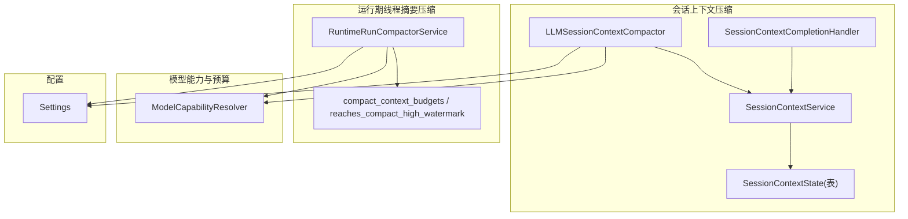
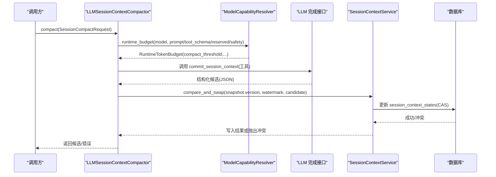
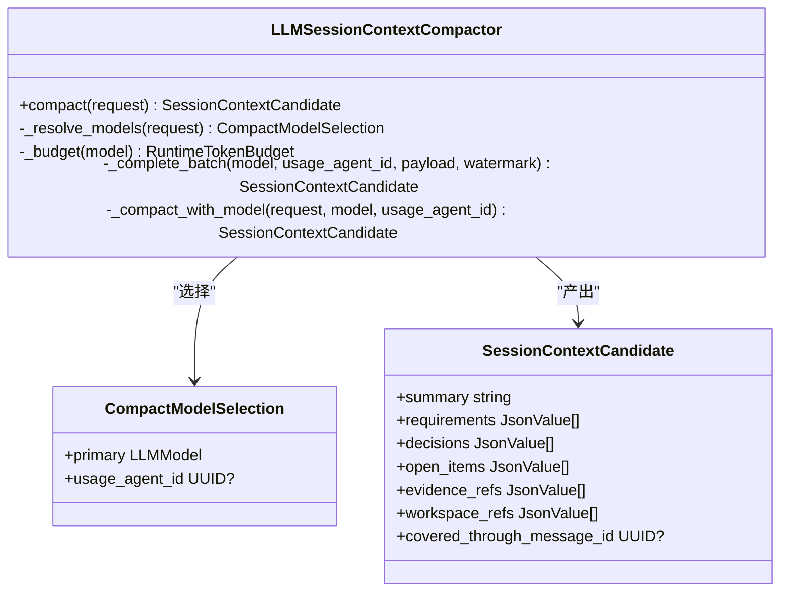
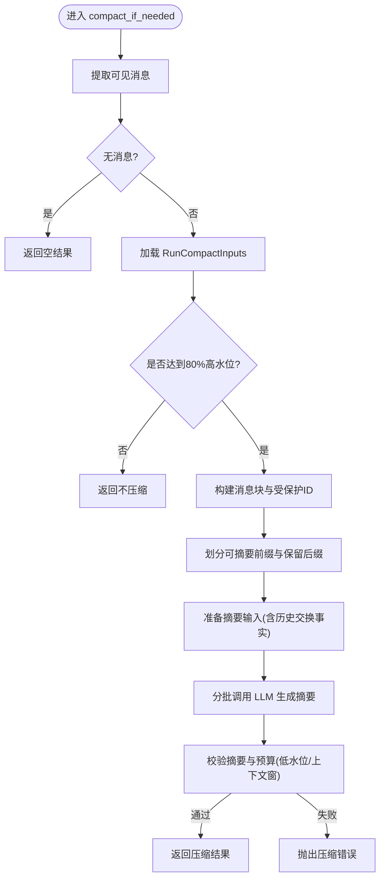
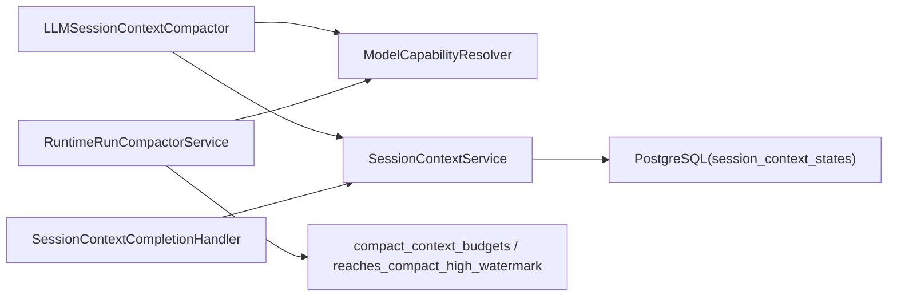

# 上下文压缩

<cite>
**本文引用的文件**   
- [session_context_compactor.py](file://backend/app/services/agent_runtime/session_context_compactor.py)
- [run_compactor.py](file://backend/app/services/agent_runtime/run_compactor.py)
- [session_context_service.py](file://backend/app/services/agent_runtime/session_context_service.py)
- [session_context_completion.py](file://backend/app/services/agent_runtime/session_context_completion.py)
- [model_capabilities.py](file://backend/app/services/agent_runtime/model_capabilities.py)
- [config.py](file://backend/app/config.py)
- [session_context_state.py](file://backend/app/models/session_context_state.py)
- [test_agent_runtime_session_context_compactor.py](file://backend/tests/test_agent_runtime_session_context_compactor.py)
- [CONTEXT_COMPACT_DESIGN.md](file://.clawith-local-designs/CONTEXT_COMPACT_DESIGN.md)
</cite>

## 目录
1. [简介](#简介)
2. [项目结构](#项目结构)
3. [核心组件](#核心组件)
4. [架构总览](#架构总览)
5. [详细组件分析](#详细组件分析)
6. [依赖关系分析](#依赖关系分析)
7. [性能与内存优化](#性能与内存优化)
8. [故障排查指南](#故障排查指南)
9. [结论](#结论)
10. [附录：配置与参数调优](#附录配置与参数调优)

## 简介
本技术文档围绕 Clawith 的“上下文压缩系统”展开，重点解析 SessionContextCompactor 的工作原理、触发条件、策略选择、质量评估、数据结构与恢复流程，并给出运行期 Thread Running Summary 压缩（Run Compactor）的配合机制。文档同时覆盖配置项、性能调优、内存优化、调试与问题诊断方法，帮助读者在生产环境中稳定部署与排障。

## 项目结构
- 会话级上下文压缩（Session Context Compact）
  - 入口与实现：LLMSessionContextCompactor
  - 数据模型与持久化：SessionContextState、SessionContextService
  - 终端合并与幂等写入：SessionContextCompletionHandler
- 运行期线程摘要压缩（Thread Running Summary Compact）
  - 入口与实现：RuntimeRunCompactorService
  - 输入预算与阈值：compact_context_budgets、reaches_compact_high_watermark
- 能力与预算计算：ModelCapabilityResolver
- 配置项：Settings（运行时开关、阈值、扫描周期等）

图表来源
- [session_context_compactor.py:266-456](file://backend/app/services/agent_runtime/session_context_compactor.py#L266-L456)
- [session_context_service.py:553-800](file://backend/app/services/agent_runtime/session_context_service.py#L553-L800)
- [session_context_state.py:25-101](file://backend/app/models/session_context_state.py#L25-L101)
- [session_context_completion.py:123-301](file://backend/app/services/agent_runtime/session_context_completion.py#L123-L301)
- [run_compactor.py:521-724](file://backend/app/services/agent_runtime/run_compactor.py#L521-L724)
- [model_capabilities.py:76-203](file://backend/app/services/agent_runtime/model_capabilities.py#L76-L203)
- [config.py:143-154](file://backend/app/config.py#L143-L154)

章节来源
- [session_context_compactor.py:1-464](file://backend/app/services/agent_runtime/session_context_compactor.py#L1-L464)
- [run_compactor.py:1-732](file://backend/app/services/agent_runtime/run_compactor.py#L1-L732)
- [session_context_service.py:1-800](file://backend/app/services/agent_runtime/session_context_service.py#L1-L800)
- [session_context_completion.py:1-310](file://backend/app/services/agent_runtime/session_context_completion.py#L1-L310)
- [model_capabilities.py:1-307](file://backend/app/services/agent_runtime/model_capabilities.py#L1-L307)
- [config.py:120-160](file://backend/app/config.py#L120-L160)
- [session_context_state.py:1-101](file://backend/app/models/session_context_state.py#L1-L101)
- [CONTEXT_COMPACT_DESIGN.md:1-356](file://.clawith-local-designs/CONTEXT_COMPACT_DESIGN.md#L1-L356)

## 核心组件
- LLMSessionContextCompactor：基于 LLM 工具调用生成“会话上下文候选”，严格校验输出字段与类型，支持分批压缩与水印推进。
- RuntimeRunCompactorService：在 LangGraph 线程内生成“运行期摘要”，维护最近消息窗口与受保护边界，确保原子性与可恢复性。
- SessionContextService：会话上下文的读取、打包（快照+近期消息）、增量重建与 CAS 写入。
- SessionContextCompletionHandler：终端 Run 的 delta 合并，保证幂等与一致性。
- ModelCapabilityResolver：统一模型能力解析与请求预算计算，支撑压缩阈值与批大小。
- Settings：运行时开关与阈值（如 SUMMARY_THRESHOLD_RATIO、SESSION_RECENT_MESSAGES、RUN_COMPACT_* 等）。

章节来源
- [session_context_compactor.py:266-456](file://backend/app/services/agent_runtime/session_context_compactor.py#L266-L456)
- [run_compactor.py:521-724](file://backend/app/services/agent_runtime/run_compactor.py#L521-L724)
- [session_context_service.py:553-800](file://backend/app/services/agent_runtime/session_context_service.py#L553-L800)
- [session_context_completion.py:123-301](file://backend/app/services/agent_runtime/session_context_completion.py#L123-L301)
- [model_capabilities.py:76-203](file://backend/app/services/agent_runtime/model_capabilities.py#L76-L203)
- [config.py:143-154](file://backend/app/config.py#L143-L154)

## 架构总览
下图展示从“会话上下文压缩”到“运行期线程摘要压缩”的整体协作关系，以及模型能力与配置的参与点。

图表来源
- [session_context_compactor.py:356-456](file://backend/app/services/agent_runtime/session_context_compactor.py#L356-L456)
- [model_capabilities.py:156-203](file://backend/app/services/agent_runtime/model_capabilities.py#L156-L203)
- [session_context_service.py:553-800](file://backend/app/services/agent_runtime/session_context_service.py#L553-L800)

## 详细组件分析

### 会话上下文压缩器（LLMSessionContextCompactor）
- 目标：在不修改源状态的前提下，为会话生成一个“可替换”的上下文候选，并通过版本与水印进行 CAS 写入。
- 关键流程
  - 模型选择：区分 group/direct 会话，按租户/代理解析实际使用的模型。
  - 预算计算：根据模型能力与静态提示、工具 schema、保留与安全余量计算 compact_threshold。
  - 分批压缩：当新消息过多时，按 token 预算切分批次，逐批调用 LLM 生成候选；最后一条消息 ID 作为 watermark。
  - 输出校验：强制使用唯一工具 commit_session_context，严格校验字段集合与类型，拒绝自由文本输出。
  - 错误处理：区分平台配置错误、模型失败、非法输入等，保持旧上下文不变。

图表来源
- [session_context_compactor.py:92-116](file://backend/app/services/agent_runtime/session_context_compactor.py#L92-L116)
- [session_context_compactor.py:266-456](file://backend/app/services/agent_runtime/session_context_compactor.py#L266-L456)

章节来源
- [session_context_compactor.py:1-464](file://backend/app/services/agent_runtime/session_context_compactor.py#L1-L464)
- [test_agent_runtime_session_context_compactor.py:152-388](file://backend/tests/test_agent_runtime_session_context_compactor.py#L152-L388)

### 运行期线程摘要压缩（RuntimeRunCompactorService）
- 目标：在 LangGraph 线程中生成“运行期摘要”，保留最近的 API 安全块与当前输入，避免截断导致任务中断。
- 触发条件：当完整请求达到有效输入预算的 80% 高水位时触发。
- 策略要点
  - 安全块划分：将对话划分为 API 安全块（含 tool_calls 与对应结果），不可拆分。
  - 受保护边界：当前 run 的精确输入、修复态、resume 消息被保护，不被摘要吞没。
  - 预算分配：summary_tokens 与 recent_tokens 上限由 effective_input_budget 按比例分配。
  - 批量压缩：对可摘要的前缀进行分批压缩，最终验证 summary+recent 不超过预算且满足低水位要求。
  - 错误分类：区分可重试与确定性失败，必要时回退到仅丢弃策略。

图表来源
- [run_compactor.py:201-211](file://backend/app/services/agent_runtime/run_compactor.py#L201-L211)
- [run_compactor.py:282-358](file://backend/app/services/agent_runtime/run_compactor.py#L282-L358)
- [run_compactor.py:554-621](file://backend/app/services/agent_runtime/run_compactor.py#L554-L621)
- [run_compactor.py:622-724](file://backend/app/services/agent_runtime/run_compactor.py#L622-L724)

章节来源
- [run_compactor.py:1-732](file://backend/app/services/agent_runtime/run_compactor.py#L1-L732)
- [CONTEXT_COMPACT_DESIGN.md:59-149](file://.clawith-local-designs/CONTEXT_COMPACT_DESIGN.md#L59-L149)

### 会话上下文服务（SessionContextService）
- 职责：提供会话快照、近期消息、增量重建、CAS 写入等能力。
- 关键点
  - 快照结构：包含 version、summary、requirements/decisions/open_items/evidence_refs/workspace_refs、covered_through_message_id。
  - 消息范围：仅 user/assistant 角色可见；watermark 用于增量定位。
  - 打包策略：一次查询获取“待压缩区”和“近期窗口”，避免多次往返。
  - 一致性：compare_and_swap 基于 version 与 watermark 双重校验，防止并发覆盖。

章节来源
- [session_context_service.py:52-103](file://backend/app/services/agent_runtime/session_context_service.py#L52-L103)
- [session_context_service.py:240-256](file://backend/app/services/agent_runtime/session_context_service.py#L240-L256)
- [session_context_service.py:677-720](file://backend/app/services/agent_runtime/session_context_service.py#L677-L720)

### 终端合并（SessionContextCompletionHandler）
- 职责：从终端 checkpoint 中提取 delta，合并到现有快照，并以幂等方式写入。
- 关键点
  - 幂等保障：通过 receipt（已应用的 checkpoint_id）去重。
  - 水印保护：delta 不得推进 covered_through_message_id，仅背景消息窗口压缩器可推进。
  - 冲突重试：遇到并发冲突时有限次重试，最终抛错。

章节来源
- [session_context_completion.py:85-121](file://backend/app/services/agent_runtime/session_context_completion.py#L85-L121)
- [session_context_completion.py:210-301](file://backend/app/services/agent_runtime/session_context_completion.py#L210-L301)

### 模型能力与预算（ModelCapabilityResolver）
- 职责：统一解析模型能力（context_window/max_input/max_output），计算请求输入限制与运行时预算。
- 关键点
  - 共享上下文窗口需显式输出限制，否则拒绝。
  - runtime_budget 考虑 static_prompt、tool_schema、reserved、safety 等开销，得出 compact_threshold。
  - 多智能体场景下，group 会话使用 MULTI_AGENT_COMPACT_MODEL_ID 解析平台模型。

章节来源
- [model_capabilities.py:76-203](file://backend/app/services/agent_runtime/model_capabilities.py#L76-L203)
- [model_capabilities.py:265-284](file://backend/app/services/agent_runtime/model_capabilities.py#L265-L284)

## 依赖关系分析
- 模块耦合
  - LLMSessionContextCompactor 依赖 ModelCapabilityResolver 与 SessionContextService。
  - RuntimeRunCompactorService 依赖 ModelCapabilityResolver 与内部预算函数。
  - SessionContextCompletionHandler 依赖 SessionContextService 与数据库事务。
- 外部依赖
  - LLM 完成接口（complete_llm_once）用于工具调用与结构化输出。
  - 数据库（PostgreSQL）用于会话上下文状态持久化与 CAS。

图表来源
- [session_context_compactor.py:266-456](file://backend/app/services/agent_runtime/session_context_compactor.py#L266-L456)
- [run_compactor.py:521-724](file://backend/app/services/agent_runtime/run_compactor.py#L521-L724)
- [session_context_service.py:553-800](file://backend/app/services/agent_runtime/session_context_service.py#L553-L800)
- [session_context_state.py:25-101](file://backend/app/models/session_context_state.py#L25-L101)

章节来源
- [session_context_compactor.py:1-464](file://backend/app/services/agent_runtime/session_context_compactor.py#L1-L464)
- [run_compactor.py:1-732](file://backend/app/services/agent_runtime/run_compactor.py#L1-L732)
- [session_context_service.py:1-800](file://backend/app/services/agent_runtime/session_context_service.py#L1-L800)
- [session_context_state.py:1-101](file://backend/app/models/session_context_state.py#L1-L101)

## 性能与内存优化
- 预算与阈值
  - 使用 MODEL 能力解析出的 context_window/max_output 计算 compact_threshold，避免硬编码。
  - 合理设置 reserved_runtime_tokens 与 safety_margin_tokens，预留系统开销与容错空间。
- 分批与窗口
  - 会话压缩按 token 预算切分批次，避免单次请求过大。
  - 运行期压缩保留 recent_tokens 与 summary_tokens 上限，确保低水位达标。
- 内存控制
  - 使用 JSON 估算与投影（project_multimodal_for_summary）减少不必要负载。
  - 仅加载必要字段与近期消息，避免全量拉取。
- 并发与重试
  - 终端合并支持有限次冲突重试，避免阻塞主流程。
  - 运行期压缩对可重试错误进行分类，必要时回退到丢弃策略。

[本节为通用指导，无需特定文件引用]

## 故障排查指南
- 常见错误码与含义
  - invalid_session_compact_output：LLM 未按要求调用 commit_session_context 或输出字段不符。
  - session_compact_model_unavailable：模型不可用或配置错误。
  - session_compact_input_too_large：输入超出 compact 模型容量。
  - unsafe_exchange_exceeds_recent_budget：未解决的 Tool Exchange 超过近期预算。
  - input_exceeds_model_context：压缩后仍超出模型上下文窗口。
  - thread_compact_low_watermark_unmet：压缩后未达到低水位要求。
- 诊断步骤
  - 检查模型能力与预算：确认 context_window/max_output 配置正确。
  - 查看日志中的错误码与消息，定位具体阶段（模型选择、预算、分批、校验、写入）。
  - 验证 watermark 与 version 的一致性，避免并发覆盖。
  - 对于运行期压缩，检查受保护消息与 Tool Exchange 边界是否正确。

章节来源
- [session_context_compactor.py:84-90](file://backend/app/services/agent_runtime/session_context_compactor.py#L84-L90)
- [run_compactor.py:125-141](file://backend/app/services/agent_runtime/run_compactor.py#L125-L141)
- [session_context_service.py:33-49](file://backend/app/services/agent_runtime/session_context_service.py#L33-L49)

## 结论
Clawith 的上下文压缩系统通过“会话上下文压缩”与“运行期线程摘要压缩”双轨并行，既保证了长会话的可扩展性，又维持了运行任务的连续性与可恢复性。严格的输出校验、预算驱动的分批策略、以及基于版本与水印的 CAS 写入，共同构成了高可靠性的压缩管线。配合合理的配置与监控，可在大规模生产环境中稳定运行。

[本节为总结，无需特定文件引用]

## 附录：配置与参数调优
- 关键配置项（Settings）
  - AGENT_RUNTIME_SUMMARY_THRESHOLD_RATIO：压缩阈值比例（默认 0.85）。
  - AGENT_RUNTIME_SESSION_RECENT_MESSAGES：会话近期消息数量（默认 20）。
  - AGENT_RUNTIME_RUN_COMPACT_MESSAGE_THRESHOLD：运行期压缩的消息阈值（可选）。
  - AGENT_RUNTIME_RUN_COMPACT_TOOL_RESULT_BYTES：工具结果字节阈值（可选）。
  - AGENT_RUNTIME_VERIFY_REPAIR_COMPACT_ROUNDS：验证修复轮次（可选）。
  - AGENT_RUNTIME_FALLBACK_CONTEXT_WINDOW_TOKENS：未知模型的上下文窗口回退值（默认 131072）。
  - MULTI_AGENT_COMPACT_MODEL_ID：多智能体压缩模型 ID。
- 调优建议
  - 根据模型能力调整 SUMMARY_THRESHOLD_RATIO，平衡压缩时机与稳定性。
  - 增大 SESSION_RECENT_MESSAGES 以保留更多近期上下文，但需关注内存占用。
  - 针对大窗口模型，适当提高 RUN_COMPACT_* 阈值，避免频繁压缩。
  - 在多租户环境下，确保 MULTI_AGENT_COMPACT_MODEL_ID 指向可用平台模型。

章节来源
- [config.py:143-154](file://backend/app/config.py#L143-L154)
- [model_capabilities.py:156-203](file://backend/app/services/agent_runtime/model_capabilities.py#L156-L203)
- [CONTEXT_COMPACT_DESIGN.md:151-215](file://.clawith-local-designs/CONTEXT_COMPACT_DESIGN.md#L151-L215)