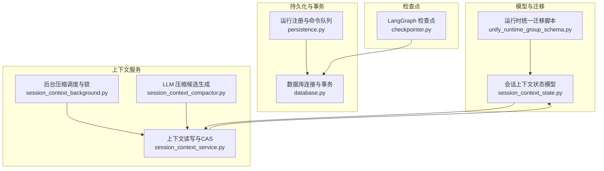
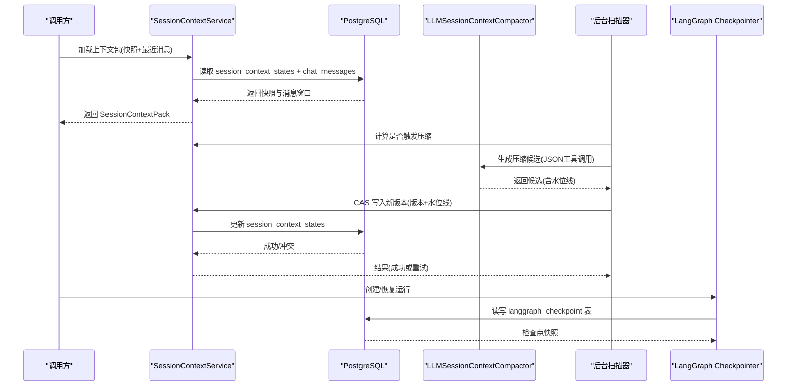
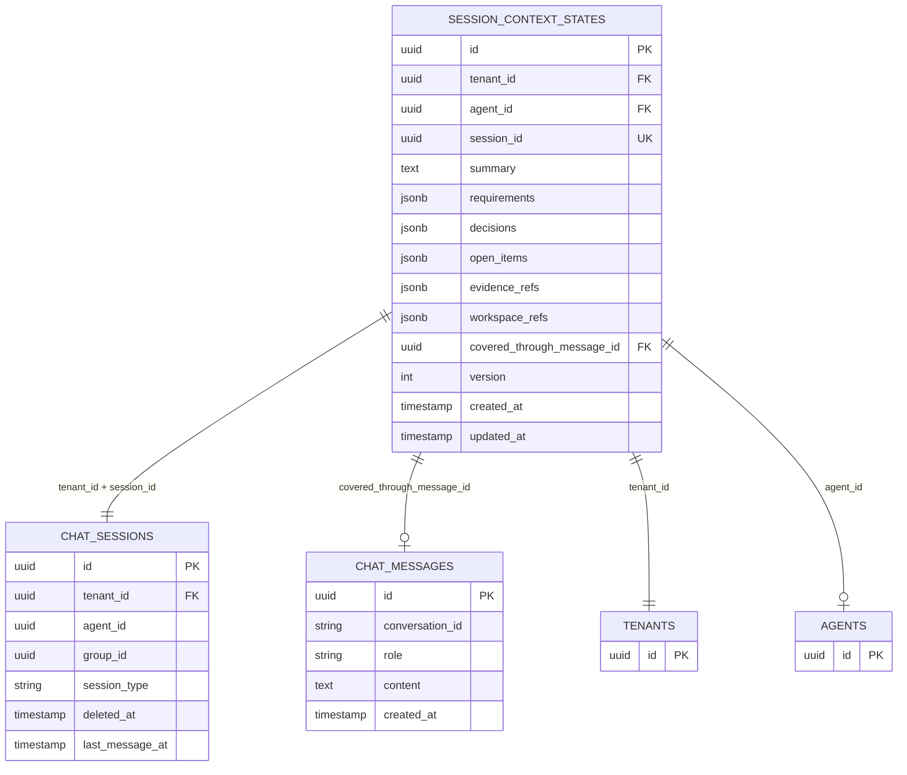
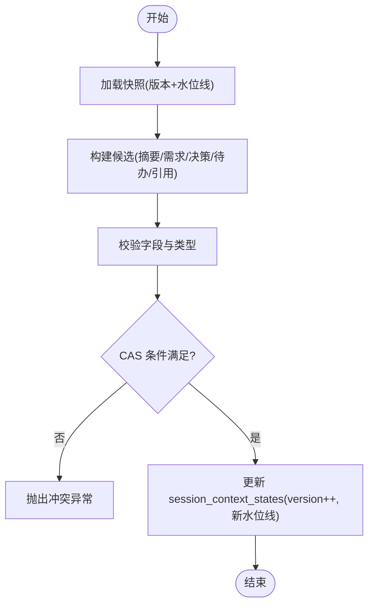
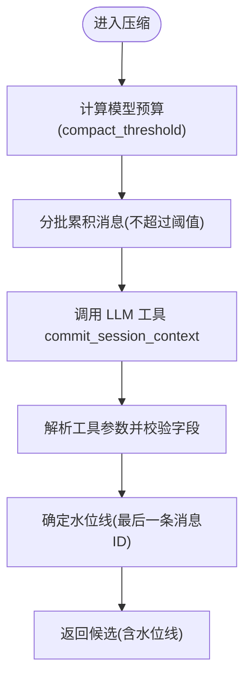
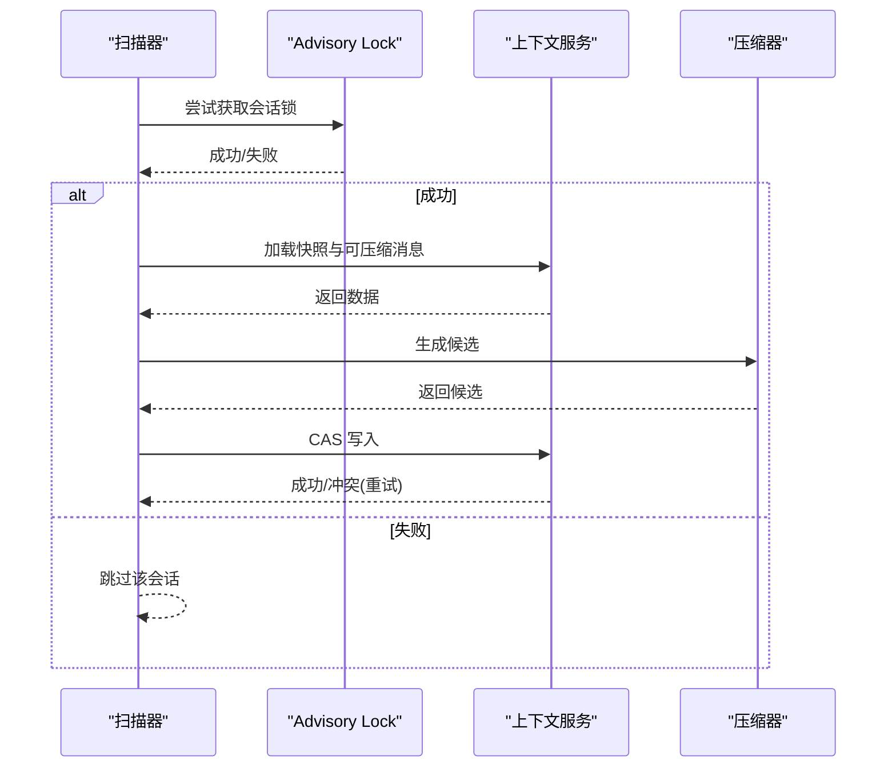
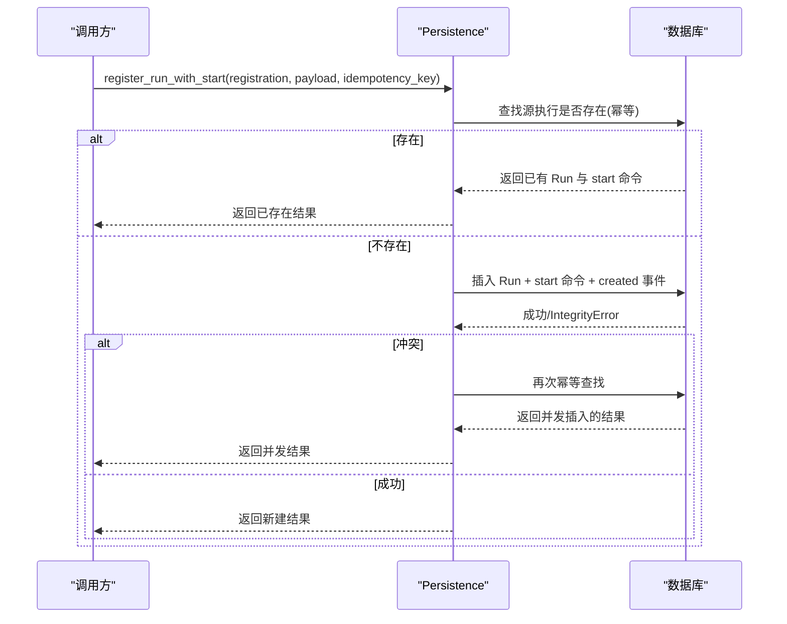
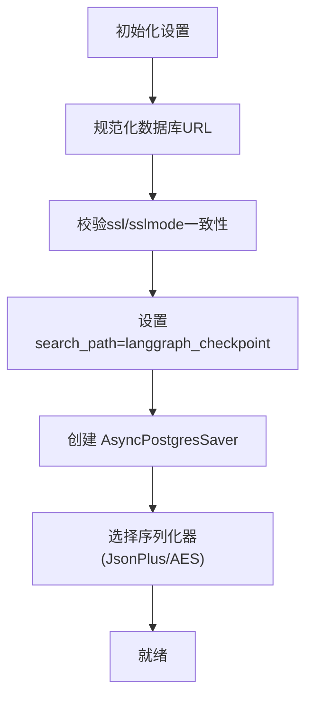
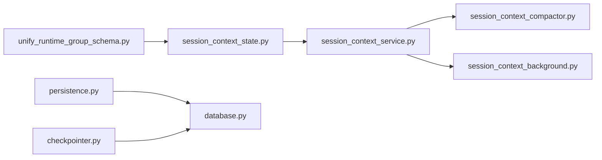

# 上下文持久化

<cite>
**本文引用的文件**   
- [session_context_state.py](file://backend/app/models/session_context_state.py)
- [persistence.py](file://backend/app/services/agent_runtime/persistence.py)
- [checkpointer.py](file://backend/app/services/agent_runtime/checkpointer.py)
- [session_context_service.py](file://backend/app/services/agent_runtime/session_context_service.py)
- [session_context_compactor.py](file://backend/app/services/agent_runtime/session_context_compactor.py)
- [session_context_background.py](file://backend/app/services/agent_runtime/session_context_background.py)
- [database.py](file://backend/app/database.py)
- [202607161200_unify_runtime_group_schema.py](file://backend/alembic/versions/202607161200_unify_runtime_group_schema.py)
</cite>

## 目录
1. [简介](#简介)
2. [项目结构](#项目结构)
3. [核心组件](#核心组件)
4. [架构总览](#架构总览)
5. [详细组件分析](#详细组件分析)
6. [依赖关系分析](#依赖关系分析)
7. [性能与存储优化](#性能与存储优化)
8. [故障排查指南](#故障排查指南)
9. [结论](#结论)
10. [附录](#附录)

## 简介
本技术文档聚焦于 Clawith 的“上下文持久化系统”，围绕会话级上下文（Session Context）的存储、版本控制、压缩与回滚、事务与并发控制、数据迁移与监控恢复等方面，提供从数据库表结构到运行时服务的全链路说明。该体系将“产品级会话摘要”与“LangGraph 检查点”解耦：前者用于为新启动的运行实例提供稳定的历史摘要与近期消息窗口；后者用于单条运行（Run）的状态恢复与断点续跑。

## 项目结构
与上下文持久化相关的代码主要分布在以下模块：
- 模型层：会话上下文状态表定义与索引
- 持久化层：运行注册、命令入队、幂等与并发控制
- 检查点层：LangGraph 检查点的序列化、加密与连接配置
- 上下文服务：快照读取、增量消息窗口、CAS 写入
- 压缩器：基于 LLM 的上下文压缩候选生成
- 后台任务：按策略触发、锁保护与冲突重试的批量压缩
- 数据库基础：异步引擎、会话与事务封装
- 迁移脚本：统一运行时与群组域 schema，包含索引与约束

**图表来源** 
- [session_context_state.py:25-101](file://backend/app/models/session_context_state.py#L25-L101)
- [202607161200_unify_runtime_group_schema.py:244-303](file://backend/alembic/versions/202607161200_unify_runtime_group_schema.py#L244-L303)
- [persistence.py:321-401](file://backend/app/services/agent_runtime/persistence.py#L321-L401)
- [database.py:14-79](file://backend/app/database.py#L14-L79)
- [checkpointer.py:138-178](file://backend/app/services/agent_runtime/checkpointer.py#L138-L178)
- [session_context_service.py:553-800](file://backend/app/services/agent_runtime/session_context_service.py#L553-L800)
- [session_context_background.py:254-395](file://backend/app/services/agent_runtime/session_context_background.py#L254-L395)
- [session_context_compactor.py:266-457](file://backend/app/services/agent_runtime/session_context_compactor.py#L266-L457)

**章节来源**
- [session_context_state.py:25-101](file://backend/app/models/session_context_state.py#L25-L101)
- [202607161200_unify_runtime_group_schema.py:244-303](file://backend/alembic/versions/202607161200_unify_runtime_group_schema.py#L244-L303)
- [persistence.py:321-401](file://backend/app/services/agent_runtime/persistence.py#L321-L401)
- [database.py:14-79](file://backend/app/database.py#L14-L79)
- [checkpointer.py:138-178](file://backend/app/services/agent_runtime/checkpointer.py#L138-L178)
- [session_context_service.py:553-800](file://backend/app/services/agent_runtime/session_context_service.py#L553-L800)
- [session_context_background.py:254-395](file://backend/app/services/agent_runtime/session_context_background.py#L254-L395)
- [session_context_compactor.py:266-457](file://backend/app/services/agent_runtime/session_context_compactor.py#L266-L457)

## 核心组件
- 会话上下文状态表（session_context_states）
  - 字段包括租户、Agent、会话、摘要、需求、决策、待办、证据引用、工作区引用、覆盖水位线、版本号、时间戳等
  - 唯一键与外键保证每会话仅一个当前上下文，且与聊天会话、消息、租户、Agent 关联一致
  - 索引优化查询与更新路径
- 运行注册与命令队列（AgentRun/AgentRunCommand/AgentRunEvent）
  - 支持 start/resume/cancel 命令，具备幂等键、尝试次数、认领过期、错误码等
  - 通过 CAS 与 for update skip locked 实现高并发安全
- LangGraph 检查点（AsyncPostgresSaver）
  - 独立 search_path 隔离，可选 AES 加密序列化，严格校验 URL 参数
- 上下文服务（SessionContextService）
  - 提供快照读取、最近消息窗口、增量消息窗口、CAS 写入（版本+水位线）
- 压缩器（LLMSessionContextCompactor）
  - 使用工具调用强制输出固定字段，严格校验 JSON 结构与 token 预算
- 后台压缩（SessionContextBackground）
  - 基于会话级 advisory lock 防并发，策略阈值触发，冲突重试

**章节来源**
- [session_context_state.py:25-101](file://backend/app/models/session_context_state.py#L25-L101)
- [persistence.py:321-401](file://backend/app/services/agent_runtime/persistence.py#L321-L401)
- [checkpointer.py:138-178](file://backend/app/services/agent_runtime/checkpointer.py#L138-L178)
- [session_context_service.py:553-800](file://backend/app/services/agent_runtime/session_context_service.py#L553-L800)
- [session_context_compactor.py:266-457](file://backend/app/services/agent_runtime/session_context_compactor.py#L266-L457)
- [session_context_background.py:254-395](file://backend/app/services/agent_runtime/session_context_background.py#L254-L395)

## 架构总览
上下文持久化由“产品上下文”和“运行检查点”两条主线组成：
- 产品上下文：以 session_context_states 为中心，结合 ChatMessage 的窗口与水位线，为新的 Run 提供稳定快照与增量消息
- 运行检查点：LangGraph 检查点负责单条 Run 的状态恢复，与产品上下文解耦

**图表来源** 
- [session_context_service.py:677-721](file://backend/app/services/agent_runtime/session_context_service.py#L677-L721)
- [session_context_compactor.py:356-436](file://backend/app/services/agent_runtime/session_context_compactor.py#L356-L436)
- [session_context_background.py:355-395](file://backend/app/services/agent_runtime/session_context_background.py#L355-L395)
- [checkpointer.py:169-178](file://backend/app/services/agent_runtime/checkpointer.py#L169-L178)

## 详细组件分析

### 数据库表结构与索引优化
- 表：session_context_states
  - 主键 id，唯一键 session_id，外键 tenant_id、agent_id、covered_through_message_id
  - 检查约束 version >= 1
  - 索引 ix_session_context_states_tenant_agent_updated(tenant_id, agent_id, updated_at DESC)
- 迁移脚本中定义了运行时相关表的索引与约束，确保查询与并发控制性能

**图表来源** 
- [session_context_state.py:25-101](file://backend/app/models/session_context_state.py#L25-L101)
- [202607161200_unify_runtime_group_schema.py:145-176](file://backend/alembic/versions/202607161200_unify_runtime_group_schema.py#L145-L176)

**章节来源**
- [session_context_state.py:25-101](file://backend/app/models/session_context_state.py#L25-L101)
- [202607161200_unify_runtime_group_schema.py:244-303](file://backend/alembic/versions/202607161200_unify_runtime_group_schema.py#L244-L303)

### 上下文版本管理与 CAS 写入
- 版本字段 version 单调递增，配合 covered_through_message_id 作为水位线
- 写入采用 compare_and_swap：期望版本与水位线必须匹配，否则抛出冲突异常
- 读取时根据水位线决定是否需要重建增量窗口

**图表来源** 
- [session_context_service.py:553-800](file://backend/app/services/agent_runtime/session_context_service.py#L553-L800)

**章节来源**
- [session_context_service.py:553-800](file://backend/app/services/agent_runtime/session_context_service.py#L553-L800)

### 上下文压缩算法与预算控制
- 压缩器通过 LLM 工具调用强制输出固定字段，严格校验 JSON 结构
- 预算控制：根据模型能力与最大输出 token 计算 compact_threshold，分批追加消息直到接近阈值
- 失败保护：若输入过大或单条消息过大，直接报错并保留旧上下文

**图表来源** 
- [session_context_compactor.py:356-436](file://backend/app/services/agent_runtime/session_context_compactor.py#L356-L436)

**章节来源**
- [session_context_compactor.py:266-457](file://backend/app/services/agent_runtime/session_context_compactor.py#L266-L457)

### 后台压缩调度与并发控制
- 使用 PostgreSQL advisory lock 对会话级别加锁，避免多 worker 同时压缩同一会话
- 策略阈值：消息数量阈值或估算 token 超过阈值即触发压缩
- 冲突重试：CAS 失败最多重试 N 次，仍失败则上报错误

**图表来源** 
- [session_context_background.py:231-252](file://backend/app/services/agent_runtime/session_context_background.py#L231-L252)
- [session_context_background.py:355-395](file://backend/app/services/agent_runtime/session_context_background.py#L355-L395)

**章节来源**
- [session_context_background.py:254-395](file://backend/app/services/agent_runtime/session_context_background.py#L254-L395)

### 运行注册与命令队列（事务与并发）
- 注册运行并插入 start 命令与事件，使用嵌套事务与 IntegrityError 处理并发重复
- 命令入队支持幂等键，冲突时校验输入一致性后返回已有记录
- claim_next_command 使用 with_for_update(skip_locked=True) 公平抢占，start 命令需额外 lane 持有检查

**图表来源** 
- [persistence.py:321-401](file://backend/app/services/agent_runtime/persistence.py#L321-L401)
- [persistence.py:403-475](file://backend/app/services/agent_runtime/persistence.py#L403-L475)
- [persistence.py:635-674](file://backend/app/services/agent_runtime/persistence.py#L635-L674)

**章节来源**
- [persistence.py:321-401](file://backend/app/services/agent_runtime/persistence.py#L321-L401)
- [persistence.py:403-475](file://backend/app/services/agent_runtime/persistence.py#L403-L475)
- [persistence.py:635-674](file://backend/app/services/agent_runtime/persistence.py#L635-L674)

### LangGraph 检查点持久化
- 通过 AsyncPostgresSaver 连接 PostgreSQL，强制 search_path 隔离至专用 schema
- 支持 AES 加密序列化，要求密钥长度为 16/24/32 字节
- URL 规范化与 ssl/sslmode 参数校验，防止配置错误

**图表来源** 
- [checkpointer.py:71-136](file://backend/app/services/agent_runtime/checkpointer.py#L71-L136)
- [checkpointer.py:145-178](file://backend/app/services/agent_runtime/checkpointer.py#L145-L178)

**章节来源**
- [checkpointer.py:71-136](file://backend/app/services/agent_runtime/checkpointer.py#L71-L136)
- [checkpointer.py:145-178](file://backend/app/services/agent_runtime/checkpointer.py#L145-L178)

### 事务管理与并发控制
- 数据库层提供 get_db 与 transaction 上下文管理器，自动提交/回滚
- 持久化层使用 begin_nested 与 with_for_update(skip_locked=True) 保障并发安全
- 后台压缩使用 advisory lock 跨进程互斥

**章节来源**
- [database.py:30-79](file://backend/app/database.py#L30-L79)
- [persistence.py:382-401](file://backend/app/services/agent_runtime/persistence.py#L382-L401)
- [persistence.py:635-674](file://backend/app/services/agent_runtime/persistence.py#L635-L674)
- [session_context_background.py:231-252](file://backend/app/services/agent_runtime/session_context_background.py#L231-L252)

## 依赖关系分析
- 模型与迁移：session_context_states 表由 ORM 模型与 Alembic 迁移共同维护
- 服务层：SessionContextService 依赖数据库模型与消息表；压缩器依赖 LLM 客户端与模型能力解析
- 检查点：Checkpointer 依赖 Settings 与 psycopg/asyncpg
- 事务：database.py 提供统一的异步会话与事务边界

**图表来源** 
- [session_context_state.py:25-101](file://backend/app/models/session_context_state.py#L25-L101)
- [202607161200_unify_runtime_group_schema.py:244-303](file://backend/alembic/versions/202607161200_unify_runtime_group_schema.py#L244-L303)
- [session_context_service.py:553-800](file://backend/app/services/agent_runtime/session_context_service.py#L553-L800)
- [session_context_compactor.py:266-457](file://backend/app/services/agent_runtime/session_context_compactor.py#L266-L457)
- [session_context_background.py:254-395](file://backend/app/services/agent_runtime/session_context_background.py#L254-L395)
- [persistence.py:321-401](file://backend/app/services/agent_runtime/persistence.py#L321-L401)
- [database.py:14-79](file://backend/app/database.py#L14-L79)
- [checkpointer.py:138-178](file://backend/app/services/agent_runtime/checkpointer.py#L138-L178)

**章节来源**
- [session_context_state.py:25-101](file://backend/app/models/session_context_state.py#L25-L101)
- [202607161200_unify_runtime_group_schema.py:244-303](file://backend/alembic/versions/202607161200_unify_runtime_group_schema.py#L244-L303)
- [session_context_service.py:553-800](file://backend/app/services/agent_runtime/session_context_service.py#L553-L800)
- [session_context_compactor.py:266-457](file://backend/app/services/agent_runtime/session_context_compactor.py#L266-L457)
- [session_context_background.py:254-395](file://backend/app/services/agent_runtime/session_context_background.py#L254-L395)
- [persistence.py:321-401](file://backend/app/services/agent_runtime/persistence.py#L321-L401)
- [database.py:14-79](file://backend/app/database.py#L14-L79)
- [checkpointer.py:138-178](file://backend/app/services/agent_runtime/checkpointer.py#L138-L178)

## 性能与存储优化
- 索引优化
  - session_context_states 使用 (tenant_id, agent_id, updated_at DESC) 加速按租户与 Agent 的更新排序查询
  - 迁移脚本为运行时表添加多组索引，如命令状态与认领过期、run 创建顺序、工具执行状态等
- 查询性能
  - 使用窗口与水位线减少全量消息扫描，仅拉取增量与最近消息
  - claim_next_command 使用 skip_locked 提升并发吞吐
- 存储优化
  - 上下文 JSONB 字段存储结构化摘要与引用，避免大文本冗余
  - 检查点序列化可选择 AES 加密，平衡安全与性能
- 压缩策略
  - 基于模型能力动态计算 compact_threshold，避免超预算
  - 后台扫描批次大小与间隔可调，降低热点负载

**章节来源**
- [202607161200_unify_runtime_group_schema.py:244-303](file://backend/alembic/versions/202607161200_unify_runtime_group_schema.py#L244-L303)
- [session_context_service.py:677-721](file://backend/app/services/agent_runtime/session_context_service.py#L677-L721)
- [persistence.py:635-674](file://backend/app/services/agent_runtime/persistence.py#L635-L674)
- [checkpointer.py:145-178](file://backend/app/services/agent_runtime/checkpointer.py#L145-L178)
- [session_context_compactor.py:340-355](file://backend/app/services/agent_runtime/session_context_compactor.py#L340-L355)
- [session_context_background.py:478-493](file://backend/app/services/agent_runtime/session_context_background.py#L478-L493)

## 故障排查指南
- 上下文冲突
  - 现象：CAS 写入失败，抛出冲突异常
  - 排查：检查版本与水位线是否被其他操作更新；确认后台压缩与前台写入无竞争
- 压缩失败
  - 现象：输入过大或单条消息过大导致压缩失败
  - 排查：调整 compact_threshold 或限制消息大小；查看日志中的错误码
- 命令认领失败
  - 现象：claim_next_command 未返回命令
  - 排查：检查命令状态与认领过期时间；确认 lane 持有与优先级
- 检查点配置错误
  - 现象：URL 参数冲突或缺少必需项
  - 排查：核对 ssl/sslmode 一致性；确保 search_path 正确设置

**章节来源**
- [session_context_service.py:553-800](file://backend/app/services/agent_runtime/session_context_service.py#L553-L800)
- [session_context_compactor.py:392-406](file://backend/app/services/agent_runtime/session_context_compactor.py#L392-L406)
- [persistence.py:635-674](file://backend/app/services/agent_runtime/persistence.py#L635-L674)
- [checkpointer.py:71-136](file://backend/app/services/agent_runtime/checkpointer.py#L71-L136)

## 结论
Clawith 的上下文持久化系统通过“产品上下文 + 运行检查点”的双轨设计，实现了高可靠、高性能与强一致的会话状态管理。借助严格的版本与水位线控制、幂等命令队列、并发安全的 CAS 与 advisory lock，以及基于模型能力的压缩预算，系统在大规模并发场景下仍能保持稳定与高效。迁移脚本与索引优化进一步保障了可扩展性与可维护性。

## 附录
- API 接口概览（概念性）
  - 加载上下文包：返回快照与最近消息窗口
  - 压缩候选生成：基于 LLM 工具调用产出固定结构的候选
  - CAS 写入：版本与水位线双重校验
  - 命令入队与认领：幂等键与公平抢占
- 备份与恢复（概念性）
  - 建议定期导出 session_context_states 与 chat_messages 增量
  - 检查点数据可通过专用 schema 备份，恢复时确保 search_path 一致
- 监控指标（概念性）
  - 压缩成功率、冲突重试次数、命令认领延迟、检查点读写耗时

[本节为概念性内容，不直接分析具体文件]