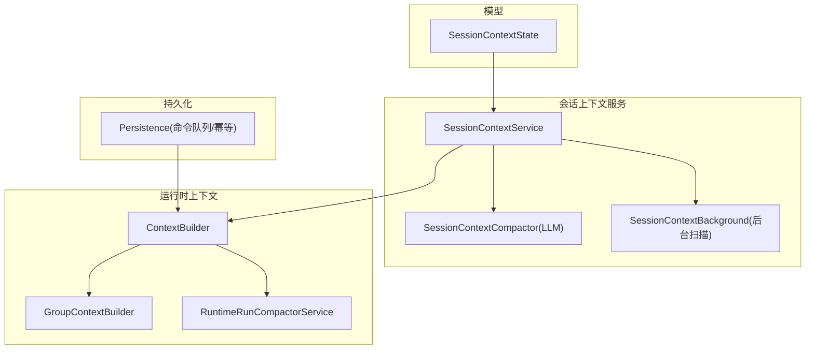
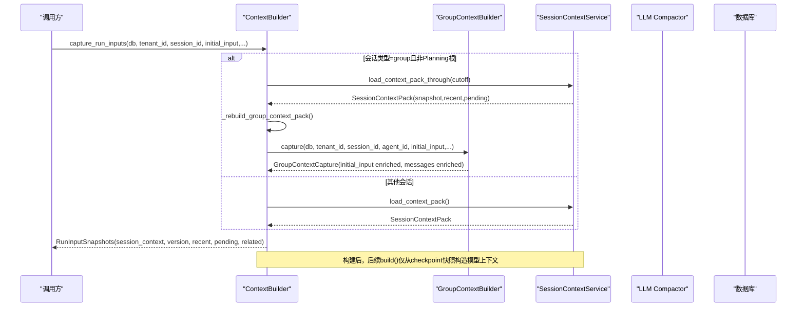
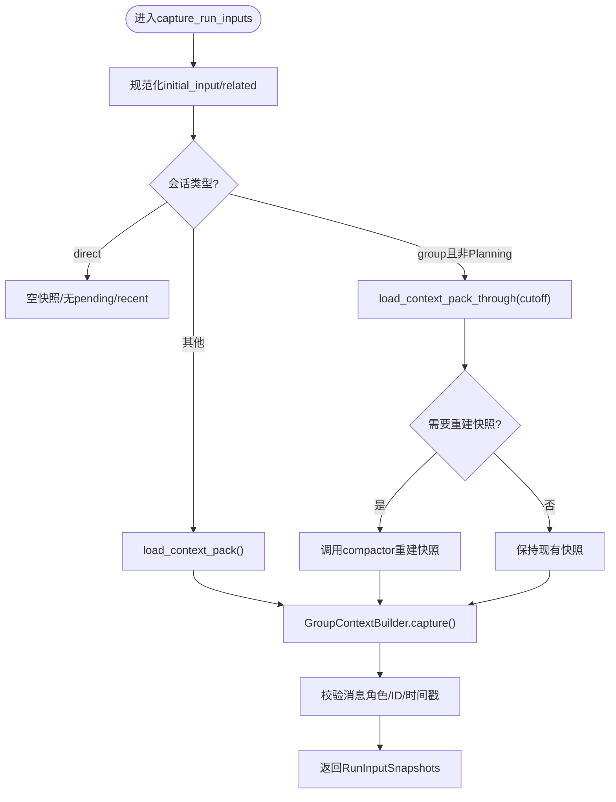
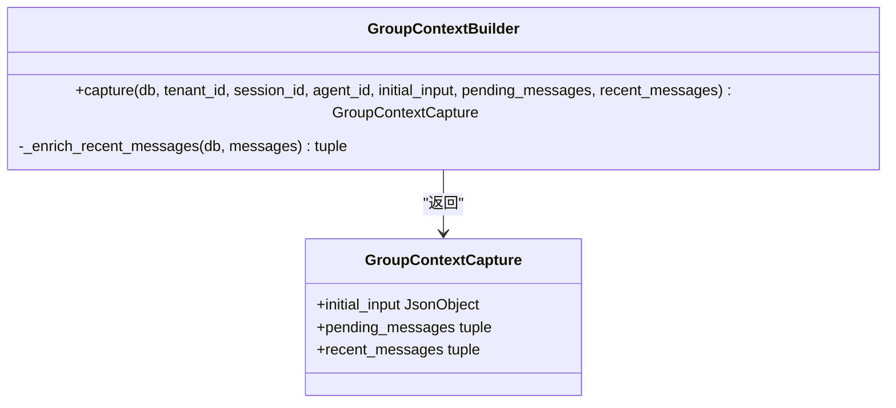
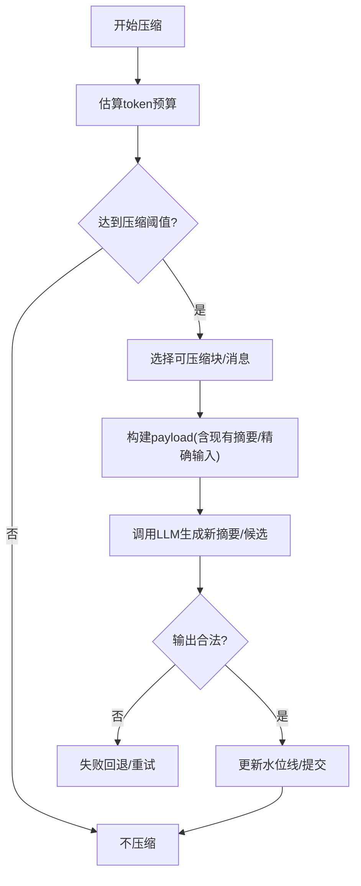
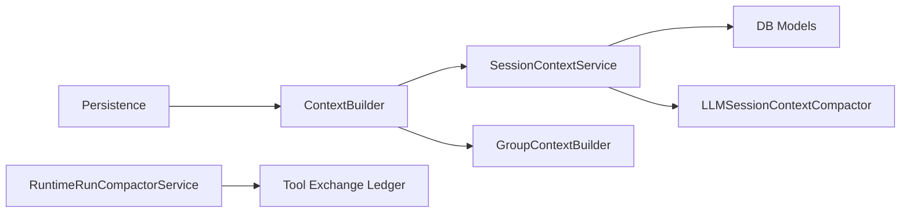

# 上下文管理系统

<cite>
**本文引用的文件**   
- [session_context_state.py](file://backend/app/models/session_context_state.py)
- [context_builder.py](file://backend/app/services/agent_runtime/context_builder.py)
- [group_context_builder.py](file://backend/app/services/agent_runtime/group_context_builder.py)
- [session_context_service.py](file://backend/app/services/agent_runtime/session_context_service.py)
- [session_context_compactor.py](file://backend/app/services/agent_runtime/session_context_compactor.py)
- [session_context_background.py](file://backend/app/services/agent_runtime/session_context_background.py)
- [run_compactor.py](file://backend/app/services/agent_runtime/run_compactor.py)
- [persistence.py](file://backend/app/services/agent_runtime/persistence.py)
- [CONTEXT_COMPACT_DESIGN.md](file://.clawith-local-designs/CONTEXT_COMPACT_DESIGN.md)
</cite>

## 目录
1. [简介](#简介)
2. [项目结构](#项目结构)
3. [核心组件](#核心组件)
4. [架构总览](#架构总览)
5. [详细组件分析](#详细组件分析)
6. [依赖关系分析](#依赖关系分析)
7. [性能与内存优化](#性能与内存优化)
8. [故障排查指南](#故障排查指南)
9. [结论](#结论)
10. [附录](#附录)

## 简介
本技术文档聚焦于Clawith的上下文管理系统，覆盖会话上下文构建、群组上下文管理、上下文持久化机制、版本控制与增量更新策略、多租户隔离与权限控制、数据同步机制、上下文压缩算法、内存优化与缓存策略，以及扩展方法与调试技巧。系统通过“会话级滚动摘要”和“线程内运行摘要”双层上下文设计，结合严格的输入校验、乐观锁与水位线（watermark）机制，保障在长对话、群聊协作与多Agent编排场景下的稳定性与一致性。

## 项目结构
后端关键代码位于 backend/app/services/agent_runtime 与 backend/app/models 下：
- 模型层：会话上下文状态表定义
- 服务层：会话上下文读取/写入、后台压缩、运行时上下文构建、群组上下文捕获、线程运行摘要压缩、命令持久化等
- 设计文档：上下文压缩策略与设计目标

图表来源
- [session_context_state.py:25-101](file://backend/app/models/session_context_state.py#L25-L101)
- [session_context_service.py:553-800](file://backend/app/services/agent_runtime/session_context_service.py#L553-L800)
- [session_context_compactor.py:266-464](file://backend/app/services/agent_runtime/session_context_compactor.py#L266-L464)
- [session_context_background.py:254-502](file://backend/app/services/agent_runtime/session_context_background.py#L254-L502)
- [context_builder.py:286-584](file://backend/app/services/agent_runtime/context_builder.py#L286-L584)
- [group_context_builder.py:72-389](file://backend/app/services/agent_runtime/group_context_builder.py#L72-L389)
- [run_compactor.py:521-732](file://backend/app/services/agent_runtime/run_compactor.py#L521-L732)
- [persistence.py:321-800](file://backend/app/services/agent_runtime/persistence.py#L321-L800)

章节来源
- [session_context_state.py:25-101](file://backend/app/models/session_context_state.py#L25-L101)
- [CONTEXT_COMPACT_DESIGN.md:1-356](file://.clawith-local-designs/CONTEXT_COMPACT_DESIGN.md#L1-L356)

## 核心组件
- 会话上下文快照与状态
  - SessionContextSnapshot：不可变快照，包含版本、摘要、需求、决策、待办、证据引用与工作区引用，以及覆盖到的消息水位线。
  - SessionContextState：数据库持久化的当前滚动上下文，含乐观锁version与covered_through_message_id。
- 会话上下文服务
  - SessionContextService：提供加载快照、最近消息窗口、增量消息、按截止位点（cutoff）的打包、CAS原子更新等能力。
- 会话上下文压缩器（LLM驱动）
  - LLMSessionContextCompactor：将历史消息与当前快照压缩为新的候选上下文，严格输出字段校验与确定性水位线。
- 后台压缩调度
  - SessionCompactPolicyResolver：计算触发阈值（基于模型能力）。
  - SessionContextMessageCompactionService：无额外Agent/Run的情况下对旧消息进行压缩并原子提交。
  - SessionContextCompactionScanner：轮询活跃会话，公平扫描与批处理。
- 运行时上下文构建
  - ContextBuilder：冻结新Run输入，选择工具安全的活动消息窗口，组装模型可见上下文。
  - GroupContextBuilder：为具体Agent Run注入群组事实（公告、记忆、工作区索引、触发消息、成员信息等），并进行权限校验。
- 线程运行摘要压缩
  - RuntimeRunCompactorService：在LangGraph Thread内生成“运行摘要”，保证工具交换边界安全、保留最近原始消息、满足预算与水位线。
- 持久化与命令队列
  - Persistence：Run注册、命令入队、幂等重试、Lane抢占、命令生命周期标记等。

章节来源
- [session_context_state.py:25-101](file://backend/app/models/session_context_state.py#L25-L101)
- [session_context_service.py:553-800](file://backend/app/services/agent_runtime/session_context_service.py#L553-L800)
- [session_context_compactor.py:266-464](file://backend/app/services/agent_runtime/session_context_compactor.py#L266-L464)
- [session_context_background.py:254-502](file://backend/app/services/agent_runtime/session_context_background.py#L254-L502)
- [context_builder.py:286-584](file://backend/app/services/agent_runtime/context_builder.py#L286-L584)
- [group_context_builder.py:72-389](file://backend/app/services/agent_runtime/group_context_builder.py#L72-L389)
- [run_compactor.py:521-732](file://backend/app/services/agent_runtime/run_compactor.py#L521-L732)
- [persistence.py:321-800](file://backend/app/services/agent_runtime/persistence.py#L321-L800)

## 架构总览
上下文系统采用“会话级滚动摘要 + 线程内运行摘要”的双层设计，配合严格的输入校验、乐观锁与水位线，确保在多租户、多Agent、群聊协作场景下的强一致性与可恢复性。

图表来源
- [context_builder.py:374-494](file://backend/app/services/agent_runtime/context_builder.py#L374-L494)
- [session_context_service.py:677-800](file://backend/app/services/agent_runtime/session_context_service.py#L677-L800)
- [group_context_builder.py:115-385](file://backend/app/services/agent_runtime/group_context_builder.py#L115-L385)

## 详细组件分析

### 会话上下文数据结构与持久化
- SessionContextState
  - 关键字段：tenant_id、agent_id、session_id、summary、requirements、decisions、open_items、evidence_refs、workspace_refs、covered_through_message_id、version、时间戳。
  - 约束：主键、唯一约束（session_id）、外键（chat_sessions、chat_messages）、检查约束（version>=1）。
- SessionContextSnapshot
  - 不可变快照，to_json序列化时做深度拷贝与类型校验。
- 增量与水位线
  - covered_through_message_id作为水位线，用于确定哪些消息已纳入上下文；增量更新通过比较水位线与最新消息排序键（created_at,message_id.int）实现。

章节来源
- [session_context_state.py:25-101](file://backend/app/models/session_context_state.py#L25-L101)
- [session_context_service.py:63-103](file://backend/app/services/agent_runtime/session_context_service.py#L63-L103)

### 会话上下文构建流程（ContextBuilder）
- capture_run_inputs
  - 规范化initial_input与related_run_summaries，区分direct/group/other会话类型。
  - group会话需传入context_cutoff，并通过load_context_pack_through获取受限包，必要时重建快照。
  - 调用GroupContextBuilder注入群组上下文，并对消息进行增强与校验。
- build
  - 从checkpoint快照构建模型可见上下文，校验session_context_version一致性。
  - 使用Tool Exchange选择最近工具安全窗口，组装thread_summary与recent_thread_messages。

图表来源
- [context_builder.py:374-494](file://backend/app/services/agent_runtime/context_builder.py#L374-L494)
- [context_builder.py:496-576](file://backend/app/services/agent_runtime/context_builder.py#L496-L576)

章节来源
- [context_builder.py:286-584](file://backend/app/services/agent_runtime/context_builder.py#L286-L584)

### 群组上下文管理（GroupContextBuilder）
- 权限与范围校验
  - 校验group_id、target_participant_id、sender_participant_id、message_id、session_id一致性。
  - 通过group_chat_service.authorize_*系列方法验证会话、成员、触发消息与mention有效性。
- 上下文注入
  - 注入trigger（触发消息内容、发送者、mention目标）、agent（身份、角色）、group（名称、描述）、session（标题、是否主会话）、announcement（公告）、agent_group_memory（记忆）、workspace_index（工作区索引，限制条目数）。
  - 对文本内容进行截断与truncated标记，避免超出预算。
- 消息增强
  - 批量查询Participant，填充sender_name/sender_type，提升下游可读性。

图表来源
- [group_context_builder.py:72-389](file://backend/app/services/agent_runtime/group_context_builder.py#L72-L389)

章节来源
- [group_context_builder.py:72-389](file://backend/app/services/agent_runtime/group_context_builder.py#L72-L389)

### 上下文压缩算法（会话级与线程级）
- 会话级压缩（LLMSessionContextCompactor）
  - 输入：当前快照、待压缩消息、可选delta。
  - 输出：严格字段校验的SessionContextCandidate，包含summary、requirements、decisions、open_items、evidence_refs、workspace_refs与覆盖水位线。
  - 预算：根据模型能力计算compact_threshold，分批拼装消息，确保单条消息与整体payload不超限。
  - 失败保护：若失败则保留上一版本上下文，避免破坏一致性。
- 线程级压缩（RuntimeRunCompactorService）
  - 输入：LangGraph State/RuntimeContext，Ledger，有效输入预算。
  - 输出：thread_summary与recent_messages，保证工具交换边界完整、受保护消息不被压缩。
  - 预算：summary_tokens与recent_tokens上限，低水位线要求压缩后不超过有效预算的50%。
  - 失败保护：区分瞬态错误与确定性错误，支持重试与回退到丢弃策略。

图表来源
- [session_context_compactor.py:266-464](file://backend/app/services/agent_runtime/session_context_compactor.py#L266-L464)
- [run_compactor.py:521-732](file://backend/app/services/agent_runtime/run_compactor.py#L521-L732)
- [CONTEXT_COMPACT_DESIGN.md:107-162](file://.clawith-local-designs/CONTEXT_COMPACT_DESIGN.md#L107-L162)

章节来源
- [session_context_compactor.py:266-464](file://backend/app/services/agent_runtime/session_context_compactor.py#L266-L464)
- [run_compactor.py:521-732](file://backend/app/services/agent_runtime/run_compactor.py#L521-L732)
- [CONTEXT_COMPACT_DESIGN.md:1-356](file://.clawith-local-designs/CONTEXT_COMPACT_DESIGN.md#L1-L356)

### 版本控制与增量更新策略
- 乐观锁version
  - SessionContextState.version用于compare-and-swap，防止并发写冲突。
- 水位线covered_through_message_id
  - 以消息排序键（created_at,message_id.int）作为稳定顺序键，确保增量只处理水位线之后的消息。
- CAS原子更新
  - compare_and_swap(expected_version, expected_covered_through_message_id, candidate)保证一致性。

章节来源
- [session_context_service.py:553-800](file://backend/app/services/agent_runtime/session_context_service.py#L553-L800)

### 多租户上下文隔离与权限控制
- 多租户隔离
  - 所有查询均限定tenant_id，会话与上下文状态按tenant_id+session_id隔离。
- 权限控制
  - GroupContextBuilder通过authorize_group_session/authorize_group_member校验参与者与Agent身份，确保只有授权用户/Agent能访问群组上下文。
  - Agent状态过滤（active、未过期、非私有模式）确保上下文构建的安全性。

章节来源
- [group_context_builder.py:115-385](file://backend/app/services/agent_runtime/group_context_builder.py#L115-L385)
- [session_context_service.py:571-608](file://backend/app/services/agent_runtime/session_context_service.py#L571-L608)

### 数据同步机制
- 后台压缩扫描
  - SessionContextCompactionScanner轮询活跃group会话，按批次扫描并触发压缩。
  - 使用PostgreSQL advisory lock避免同一会话并发压缩。
- 命令队列与幂等
  - Persistence提供register_run_with_start、enqueue_resume/cancel、claim_next_command等接口，保证命令幂等与顺序执行。
  - Lane抢占与位置排序确保公平调度。

章节来源
- [session_context_background.py:397-502](file://backend/app/services/agent_runtime/session_context_background.py#L397-L502)
- [persistence.py:321-800](file://backend/app/services/agent_runtime/persistence.py#L321-L800)

## 依赖关系分析
- ContextBuilder依赖SessionContextService与GroupContextBuilder，负责统一入口与上下文组装。
- SessionContextService依赖数据库模型ChatSession、ChatMessage、SessionContextState，提供读写与增量能力。
- LLMSessionContextCompactor依赖LLM客户端与模型能力解析，确保压缩输出合法性。
- RuntimeRunCompactorService依赖Thread可见消息与Tool Exchange Ledger，保证压缩边界安全。
- Persistence独立于上下文逻辑，提供Run与命令的持久化与调度。

图表来源
- [context_builder.py:286-584](file://backend/app/services/agent_runtime/context_builder.py#L286-L584)
- [session_context_service.py:553-800](file://backend/app/services/agent_runtime/session_context_service.py#L553-L800)
- [session_context_compactor.py:266-464](file://backend/app/services/agent_runtime/session_context_compactor.py#L266-L464)
- [run_compactor.py:521-732](file://backend/app/services/agent_runtime/run_compactor.py#L521-L732)
- [persistence.py:321-800](file://backend/app/services/agent_runtime/persistence.py#L321-L800)

章节来源
- [context_builder.py:286-584](file://backend/app/services/agent_runtime/context_builder.py#L286-L584)
- [session_context_service.py:553-800](file://backend/app/services/agent_runtime/session_context_service.py#L553-L800)
- [session_context_compactor.py:266-464](file://backend/app/services/agent_runtime/session_context_compactor.py#L266-L464)
- [run_compactor.py:521-732](file://backend/app/services/agent_runtime/run_compactor.py#L521-L732)
- [persistence.py:321-800](file://backend/app/services/agent_runtime/persistence.py#L321-L800)

## 性能与内存优化
- 预算与阈值
  - 会话压缩：compact_threshold由模型能力决定，消息分批拼装，避免单次请求过大。
  - 线程压缩：summary_tokens与recent_tokens上限，低水位线要求压缩后不超过有效预算的50%。
- 内存优化
  - 使用不可变数据类与tuple减少拷贝开销。
  - 对大文本进行截断与truncated标记，控制上下文大小。
  - 批量查询Participant与消息，减少往返次数。
- 缓存策略
  - 最近消息窗口（recent_limit）限制查询量，避免全量加载。
  - 后台压缩扫描按批次处理，避免长时间占用资源。
- 并发与锁
  - PostgreSQL advisory lock避免同一会话并发压缩。
  - 命令队列使用with_for_update(skip_locked=True)提高吞吐。

章节来源
- [session_context_compactor.py:340-355](file://backend/app/services/agent_runtime/session_context_compactor.py#L340-L355)
- [run_compactor.py:93-123](file://backend/app/services/agent_runtime/run_compactor.py#L93-L123)
- [session_context_background.py:231-252](file://backend/app/services/agent_runtime/session_context_background.py#L231-L252)
- [persistence.py:524-597](file://backend/app/services/agent_runtime/persistence.py#L524-L597)

## 故障排查指南
- 常见错误码与原因
  - invalid_runtime_context：上下文包含非JSON可序列化值或非有限浮点数。
  - invalid_group_context_cutoff：群组上下文截止位点不一致或时间戳缺少时区。
  - invalid_session_context_snapshot：checkpoint版本与快照不一致。
  - invalid_session_compact_output：压缩输出字段不匹配或非法。
  - thread_compact_provider_failed：线程压缩提供者调用失败。
- 排查步骤
  - 检查initial_input与related_run_summaries的JSON合法性。
  - 确认context_cutoff的message_id与created_at与调度位置一致。
  - 查看SessionContextState.version与snapshot.version是否一致。
  - 检查LLM压缩输出是否符合schema，必要时调整budget。
  - 查看命令队列状态与Lane抢占情况，确认是否存在竞态。

章节来源
- [context_builder.py:52-128](file://backend/app/services/agent_runtime/context_builder.py#L52-L128)
- [session_context_compactor.py:84-143](file://backend/app/services/agent_runtime/session_context_compactor.py#L84-L143)
- [run_compactor.py:125-141](file://backend/app/services/agent_runtime/run_compactor.py#L125-L141)

## 结论
Clawith的上下文管理系统通过双层摘要（会话级与线程级）、严格输入校验、乐观锁与水位线、后台压缩与命令队列，实现了在高并发、多租户、多Agent协作场景下的稳定与高效。未来可扩展方向包括更细粒度的上下文缓存、动态预算调整、跨会话知识迁移与前端可视化控制。

## 附录
- 扩展方法
  - 自定义压缩策略：替换LLMSessionContextCompactor的completion端口，实现特定模型的压缩逻辑。
  - 扩展群组上下文：在GroupContextBuilder中增加新的上下文字段（如日程、任务列表）。
  - 自定义预算计算：修改compact_context_budgets与_model_threshold函数，适配不同模型特性。
- 调试技巧
  - 启用详细日志，记录压缩前后的token估算与payload大小。
  - 使用单元测试验证输入校验与错误路径。
  - 监控命令队列长度与Lane抢占成功率，评估调度健康度。