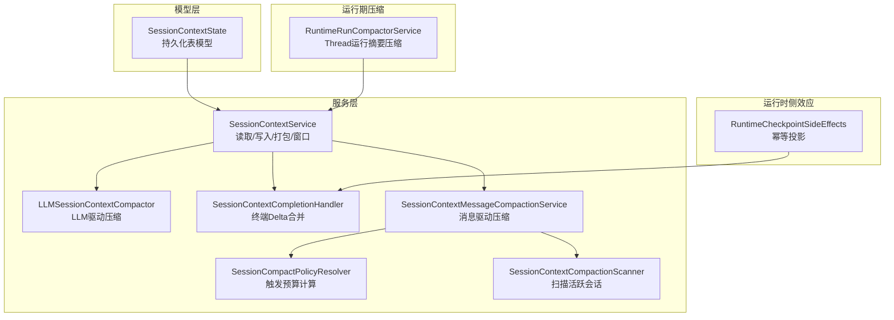
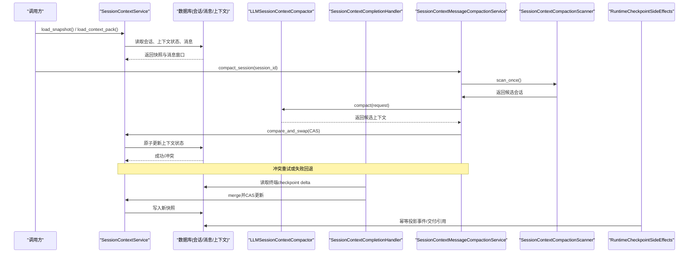
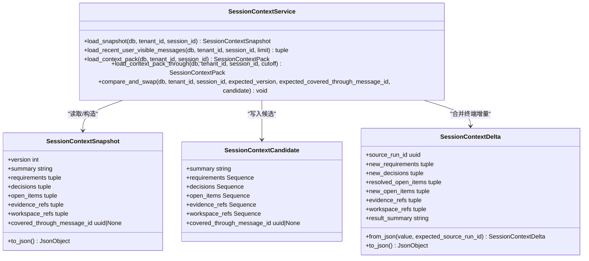
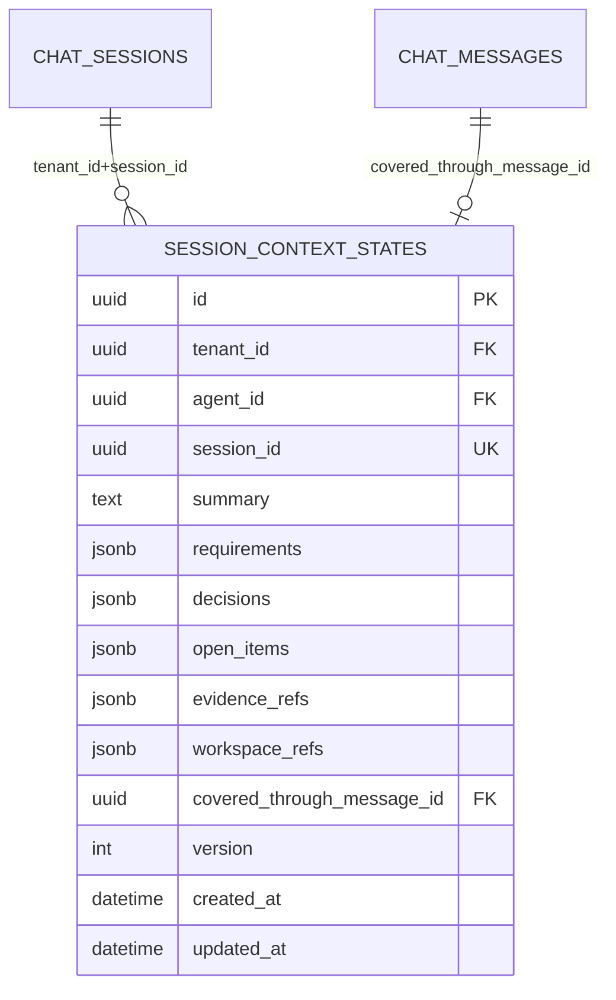
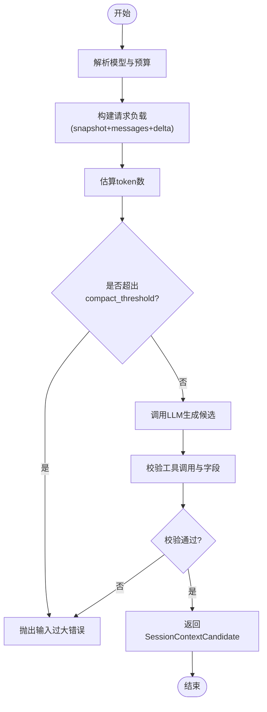
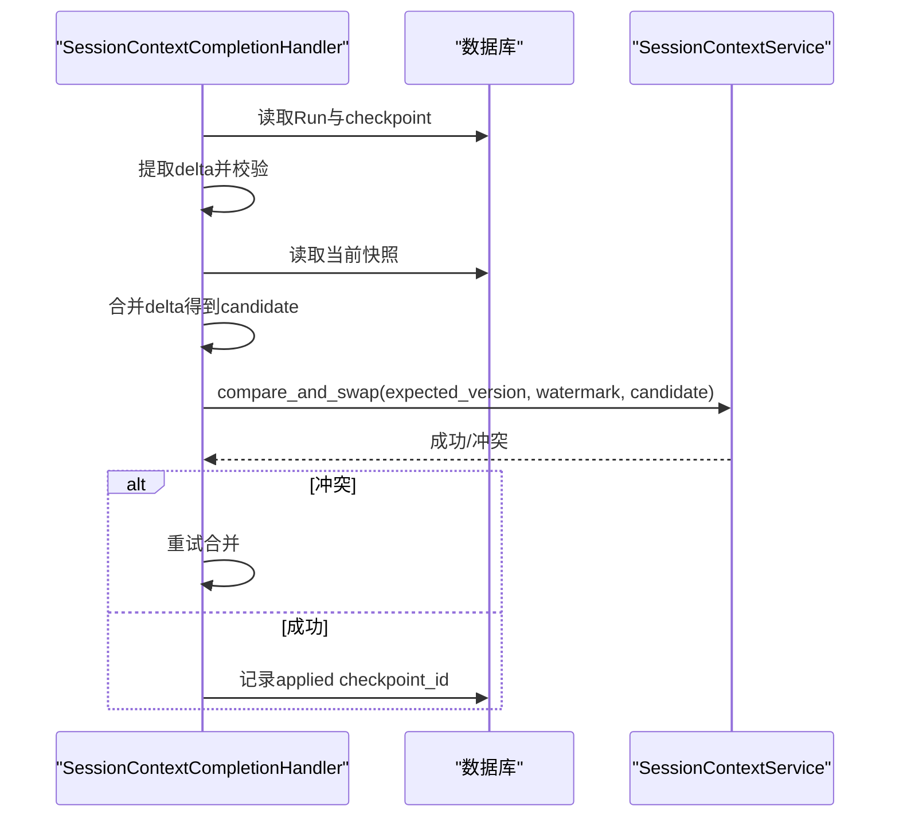
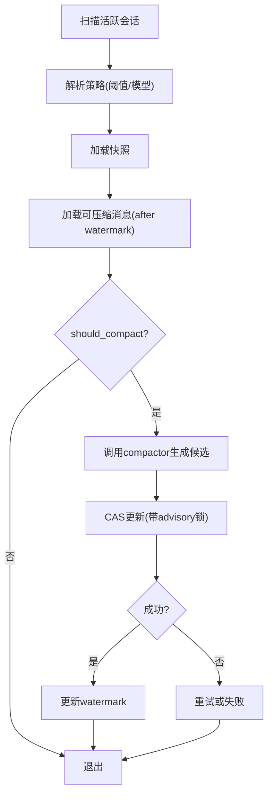
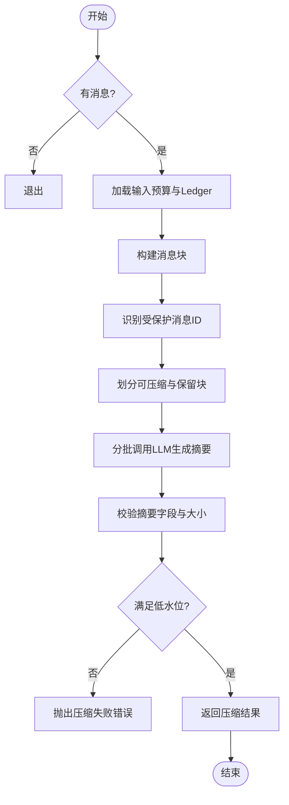
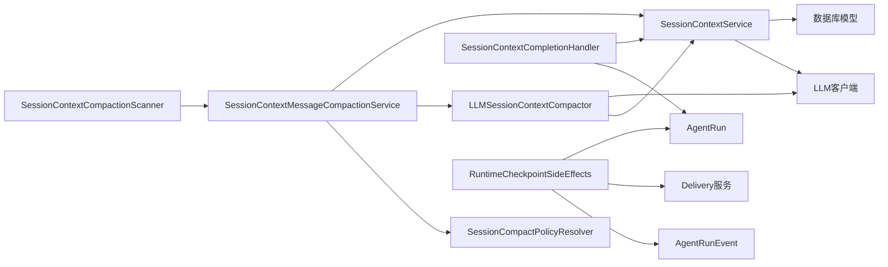

# 会话上下文管理

<cite>
**本文引用的文件**   
- [session_context_service.py](file://backend/app/services/agent_runtime/session_context_service.py)
- [session_context_state.py](file://backend/app/models/session_context_state.py)
- [session_context_compactor.py](file://backend/app/services/agent_runtime/session_context_compactor.py)
- [session_context_completion.py](file://backend/app/services/agent_runtime/session_context_completion.py)
- [session_context_background.py](file://backend/app/services/agent_runtime/session_context_background.py)
- [checkpoint_side_effects.py](file://backend/app/services/agent_runtime/checkpoint_side_effects.py)
- [run_compactor.py](file://backend/app/services/agent_runtime/run_compactor.py)
- [CONTEXT_COMPACT_DESIGN.md](file://.clawith-local-designs/CONTEXT_COMPACT_DESIGN.md)
- [LONG_RUNNING_CHECKPOINT_DESIGN.md](file://.clawith-local-designs/LONG_RUNNING_CHECKPOINT_DESIGN.md)
</cite>

## 目录
1. [简介](#简介)
2. [项目结构](#项目结构)
3. [核心组件](#核心组件)
4. [架构总览](#架构总览)
5. [详细组件分析](#详细组件分析)
6. [依赖关系分析](#依赖关系分析)
7. [性能考量](#性能考量)
8. [故障排查指南](#故障排查指南)
9. [结论](#结论)
10. [附录](#附录)

## 简介
本技术文档聚焦于Clawith的会话上下文管理系统，围绕SessionContextService的核心能力展开：上下文打包与加载、版本控制与乐观并发、持久化策略、增量更新算法、消息窗口管理、压缩与重建流程（含checkpoint机制）、数据一致性保证。同时提供数据结构定义、API接口说明、错误处理策略、性能优化技巧、调试方法与常见问题解决方案，帮助读者从整体到细节全面理解该子系统。

## 项目结构
会话上下文管理位于后端服务模块中，主要涉及以下文件：
- 模型层：会话上下文状态持久化表模型
- 服务层：会话上下文读写、合并、压缩、后台扫描与触发
- 运行时侧效应：基于已提交checkpoint的幂等产品态投影
- 运行期线程摘要压缩：LangGraph Thread内的运行摘要压缩
- 设计文档：上下文压缩策略与长任务checkpoint规划

图表来源
- [session_context_service.py:1-120](file://backend/app/services/agent_runtime/session_context_service.py#L1-L120)
- [session_context_state.py:1-101](file://backend/app/models/session_context_state.py#L1-L101)
- [session_context_compactor.py:1-120](file://backend/app/services/agent_runtime/session_context_compactor.py#L1-L120)
- [session_context_completion.py:1-120](file://backend/app/services/agent_runtime/session_context_completion.py#L1-L120)
- [session_context_background.py:1-120](file://backend/app/services/agent_runtime/session_context_background.py#L1-L120)
- [checkpoint_side_effects.py:1-120](file://backend/app/services/agent_runtime/checkpoint_side_effects.py#L1-L120)
- [run_compactor.py:1-120](file://backend/app/services/agent_runtime/run_compactor.py#L1-L120)

章节来源
- [session_context_service.py:1-120](file://backend/app/services/agent_runtime/session_context_service.py#L1-L120)
- [session_context_state.py:1-101](file://backend/app/models/session_context_state.py#L1-L101)

## 核心组件
- SessionContextService：负责会话上下文的读取、打包、窗口选择、增量查询与CAS更新；维护version与watermark（covered_through_message_id）实现乐观并发。
- LLMSessionContextCompactor：调用LLM生成新的上下文候选（summary、requirements、decisions、open_items、evidence_refs、workspace_refs），严格校验输出字段与JSON可序列化性。
- SessionContextCompletionHandler：在终端checkpoint时，将结构化delta与当前快照合并，使用CAS确保幂等与一致性。
- SessionContextMessageCompactionService：基于消息水位与预算策略，周期性对旧消息进行压缩，避免阻塞主流程。
- SessionCompactPolicyResolver：根据会话类型、Agent模型能力与配置计算触发阈值。
- SessionContextCompactionScanner：公平扫描活跃Group会话，批量触发压缩。
- RuntimeCheckpointSideEffects：基于已提交checkpoint进行幂等产品态投影（事件、交付、引用记录等）。
- RuntimeRunCompactorService：针对LangGraph Thread的运行摘要压缩，保障最近消息与受保护输入不被破坏。

章节来源
- [session_context_service.py:553-700](file://backend/app/services/agent_runtime/session_context_service.py#L553-L700)
- [session_context_compactor.py:266-464](file://backend/app/services/agent_runtime/session_context_compactor.py#L266-L464)
- [session_context_completion.py:123-310](file://backend/app/services/agent_runtime/session_context_completion.py#L123-L310)
- [session_context_background.py:254-502](file://backend/app/services/agent_runtime/session_context_background.py#L254-L502)
- [checkpoint_side_effects.py:554-815](file://backend/app/services/agent_runtime/checkpoint_side_effects.py#L554-L815)
- [run_compactor.py:521-732](file://backend/app/services/agent_runtime/run_compactor.py#L521-L732)

## 架构总览
下图展示会话上下文从“读取-压缩-合并-持久化”的端到端流程，以及后台扫描与checkpoint侧效应的协作关系。

图表来源
- [session_context_service.py:624-720](file://backend/app/services/agent_runtime/session_context_service.py#L624-L720)
- [session_context_background.py:355-395](file://backend/app/services/agent_runtime/session_context_background.py#L355-L395)
- [session_context_compactor.py:437-457](file://backend/app/services/agent_runtime/session_context_compactor.py#L437-L457)
- [session_context_completion.py:269-302](file://backend/app/services/agent_runtime/session_context_completion.py#L269-L302)
- [checkpoint_side_effects.py:654-815](file://backend/app/services/agent_runtime/checkpoint_side_effects.py#L654-L815)

## 详细组件分析

### SessionContextService：上下文打包、加载与版本控制
- 数据结构
  - MessagePosition：稳定排序键（created_at + message_id.int）
  - SessionContextSnapshot：不可变快照，包含version、summary、requirements、decisions、open_items、evidence_refs、workspace_refs、covered_through_message_id
  - SessionContextCandidate：待写入的候选上下文
  - SessionContextDelta：终端Run贡献的结构化增量
  - SessionContextPack：快照+近期消息+待处理消息
- 关键方法
  - load_snapshot：按tenant_id与session_id读取最新快照
  - load_recent_user_visible_messages：按限制返回用户可见角色消息
  - load_context_pack：一次快照+分区消息（recent/pending）
  - load_context_pack_through：Group会话按权威cutoff边界打包
  - compare_and_swap：基于expected_version与expected_covered_through_message_id的CAS更新
- 版本与水印
  - version：每次更新递增，用于乐观锁
  - covered_through_message_id：标记已覆盖的消息水位，确保增量不重复、不遗漏
- 错误处理
  - SessionContextError及其子类：非法输入、范围不一致、冲突等

图表来源
- [session_context_service.py:52-120](file://backend/app/services/agent_runtime/session_context_service.py#L52-L120)
- [session_context_service.py:553-700](file://backend/app/services/agent_runtime/session_context_service.py#L553-L700)

章节来源
- [session_context_service.py:52-120](file://backend/app/services/agent_runtime/session_context_service.py#L52-L120)
- [session_context_service.py:553-700](file://backend/app/services/agent_runtime/session_context_service.py#L553-L700)

### 持久化模型：SessionContextState
- 字段
  - tenant_id、agent_id、session_id：租户、Agent与会话标识
  - summary、requirements、decisions、open_items、evidence_refs、workspace_refs：JSONB存储上下文内容
  - covered_through_message_id：外键指向chat_messages.id，表示已覆盖的水位
  - version：乐观锁版本号
  - created_at、updated_at：时间戳
- 约束与索引
  - PrimaryKeyConstraint、UniqueConstraint(session_id)、CheckConstraint(version>=1)
  - Index(tenant_id, agent_id, updated_at DESC)

图表来源
- [session_context_state.py:25-101](file://backend/app/models/session_context_state.py#L25-L101)

章节来源
- [session_context_state.py:25-101](file://backend/app/models/session_context_state.py#L25-L101)

### LLM驱动的上下文压缩：LLMSessionContextCompactor
- 目标：在不修改产品或checkpoint状态的前提下，生成新的上下文候选
- 输入：SessionCompactRequest（tenant_id、session_id、source_agent_id、checkpoint_id、snapshot、messages、delta）
- 过程
  - 预算计算：依据模型max_output_tokens与系统提示、工具schema估算token预算
  - 分批请求：逐步累积消息直到接近compact_threshold，调用LLM生成候选
  - 输出校验：严格检查commit_session_context工具调用次数与字段集合
- 错误处理
  - SessionContextCompactorError：输入过大、单条消息过大、模型不可用、调用失败等

图表来源
- [session_context_compactor.py:356-457](file://backend/app/services/agent_runtime/session_context_compactor.py#L356-L457)

章节来源
- [session_context_compactor.py:266-464](file://backend/app/services/agent_runtime/session_context_compactor.py#L266-L464)

### 终端Checkpoint合并：SessionContextCompletionHandler
- 职责：在Run结束时，从checkpoint提取session_context_delta，与当前快照合并并通过CAS更新
- 关键步骤
  - 提取delta：仅当lifecycle为terminal且存在session_context_delta
  - 读取Run与快照：校验receipt避免重复应用
  - 合并策略：去重合并requirements/decisions/open_items/evidence_refs/workspace_refs，拼接summary
  - CAS更新：确保expected_version与watermark一致，写入后记录applied checkpoint_id
- 冲突重试：最多重试指定次数，超过则抛错

图表来源
- [session_context_completion.py:175-302](file://backend/app/services/agent_runtime/session_context_completion.py#L175-L302)

章节来源
- [session_context_completion.py:123-310](file://backend/app/services/agent_runtime/session_context_completion.py#L123-L310)

### 后台消息驱动压缩：SessionContextMessageCompactionService
- 触发条件：消息数量阈值或估计token数达到policy.threshold_tokens
- 流程
  - 获取快照与可压缩消息（after watermark）
  - 计算recent消息与策略阈值
  - 调用compactor生成候选
  - CAS更新，确保watermark与预期一致
- 并发控制：使用PostgreSQL advisory lock避免同一会话并发压缩

图表来源
- [session_context_background.py:274-395](file://backend/app/services/agent_runtime/session_context_background.py#L274-L395)

章节来源
- [session_context_background.py:254-502](file://backend/app/services/agent_runtime/session_context_background.py#L254-L502)

### 运行期Thread摘要压缩：RuntimeRunCompactorService
- 目标：在LangGraph Thread内生成运行摘要，保留最近消息与受保护输入
- 关键点
  - 预算分配：summary_tokens与recent_tokens按比例分配
  - 安全块选择：Tool Exchange边界不可分割，受保护消息ID不参与压缩
  - 分批压缩：逐步累积消息块，调用LLM生成摘要，校验输出字段
  - 低水位检查：压缩后需满足50%低水位要求

图表来源
- [run_compactor.py:622-732](file://backend/app/services/agent_runtime/run_compactor.py#L622-L732)

章节来源
- [run_compactor.py:521-732](file://backend/app/services/agent_runtime/run_compactor.py#L521-L732)

### 运行时侧效应：RuntimeCheckpointSideEffects
- 职责：基于已提交的checkpoint进行幂等产品态投影（事件、交付、引用记录）
- 关键点
  - 验证scope与checkpoint identity
  - 推导delivery_request与terminal状态
  - 记录lifecycle事件与工具调用历史
  - 发布群组实时消息与经验引用

章节来源
- [checkpoint_side_effects.py:554-815](file://backend/app/services/agent_runtime/checkpoint_side_effects.py#L554-L815)

## 依赖关系分析
- 组件耦合
  - SessionContextService依赖数据库模型ChatSession、ChatMessage、SessionContextState
  - LLMSessionContextCompactor依赖LLM客户端与模型能力解析
  - SessionContextCompletionHandler依赖SessionContextService与AgentRun
  - SessionContextMessageCompactionService依赖SessionContextService、LLMSessionContextCompactor与策略解析器
  - RuntimeCheckpointSideEffects依赖AgentRunEvent、Delivery、ExperienceCitations等
- 外部依赖
  - PostgreSQL：advisory锁、JSONB、外键约束
  - LLM服务：多提供商兼容，支持failover与预算控制

图表来源
- [session_context_service.py:1-120](file://backend/app/services/agent_runtime/session_context_service.py#L1-L120)
- [session_context_compactor.py:1-120](file://backend/app/services/agent_runtime/session_context_compactor.py#L1-L120)
- [session_context_completion.py:1-120](file://backend/app/services/agent_runtime/session_context_completion.py#L1-L120)
- [session_context_background.py:1-120](file://backend/app/services/agent_runtime/session_context_background.py#L1-L120)
- [checkpoint_side_effects.py:1-120](file://backend/app/services/agent_runtime/checkpoint_side_effects.py#L1-L120)

章节来源
- [session_context_service.py:1-120](file://backend/app/services/agent_runtime/session_context_service.py#L1-L120)
- [session_context_compactor.py:1-120](file://backend/app/services/agent_runtime/session_context_compactor.py#L1-L120)
- [session_context_completion.py:1-120](file://backend/app/services/agent_runtime/session_context_completion.py#L1-L120)
- [session_context_background.py:1-120](file://backend/app/services/agent_runtime/session_context_background.py#L1-L120)
- [checkpoint_side_effects.py:1-120](file://backend/app/services/agent_runtime/checkpoint_side_effects.py#L1-L120)

## 性能考量
- 预算控制
  - 使用模型metadata中的context_window_tokens与max_output_tokens动态计算预算
  - 80%触发阈值，预留安全余量
- 增量更新
  - 基于watermark（covered_through_message_id）避免重复处理
  - 分批请求减少单次负载
- 并发控制
  - PostgreSQL advisory锁避免同一会话并发压缩
  - CAS乐观锁减少写冲突
- 消息窗口
  - recent_limit限制最近消息数量，平衡上下文长度与性能
- 压缩策略
  - Tool Exchange边界不可分割，避免破坏一致性
  - 受保护消息ID不参与压缩，确保当前输入完整

章节来源
- [CONTEXT_COMPACT_DESIGN.md:1-356](file://.clawith-local-designs/CONTEXT_COMPACT_DESIGN.md#L1-L356)
- [LONG_RUNNING_CHECKPOINT_DESIGN.md:1-86](file://.clawith-local-designs/LONG_RUNNING_CHECKPOINT_DESIGN.md#L1-L86)

## 故障排查指南
- 常见错误
  - SessionContextConflict：版本或水印过期，需重试合并
  - SessionContextCompactorError：输入过大、模型不可用、调用失败
  - SessionContextBackgroundError：会话不存在、策略不可用、冲突超限
  - RuntimeCheckpointSideEffectError：scope不匹配、checkpoint缺失、终端内容缺失
- 调试方法
  - 检查SessionContextState表的version与updated_at
  - 查看AgentRun的session_context_applied_checkpoint_id
  - 监控LLM调用日志与预算估算
  - 使用advisory锁状态确认并发情况
- 恢复策略
  - 冲突重试：最多指定次数
  - 失败回退：降级为drop-only截断
  - 幂等投影：基于checkpoint_id避免重复应用

章节来源
- [session_context_service.py:33-50](file://backend/app/services/agent_runtime/session_context_service.py#L33-L50)
- [session_context_compactor.py:84-153](file://backend/app/services/agent_runtime/session_context_compactor.py#L84-L153)
- [session_context_background.py:50-120](file://backend/app/services/agent_runtime/session_context_background.py#L50-L120)
- [checkpoint_side_effects.py:44-120](file://backend/app/services/agent_runtime/checkpoint_side_effects.py#L44-L120)

## 结论
Clawith的会话上下文管理系统通过SessionContextService为核心，结合LLM驱动的压缩、后台扫描与checkpoint侧效应，实现了高可用、可扩展、一致的会话上下文管理。其版本控制与水印机制确保了增量更新的正确性，预算控制与消息窗口管理保障了性能与稳定性。未来可进一步探索工作空间checkpoint与更细粒度的压缩策略。

## 附录
- API接口说明
  - SessionContextService.load_snapshot：读取会话上下文快照
  - SessionContextService.load_context_pack：打包快照与消息窗口
  - SessionContextService.compare_and_swap：CAS更新上下文
  - LLMSessionContextCompactor.compact：生成上下文候选
  - SessionContextCompletionHandler.handle：合并终端delta
  - SessionContextMessageCompactionService.compact_session：触发后台压缩
- 数据结构定义
  - SessionContextSnapshot、SessionContextCandidate、SessionContextDelta、SessionContextPack
- 最佳实践
  - 合理设置recent_message_limit与compact阈值
  - 监控LLM调用成功率与预算使用情况
  - 定期清理过期checkpoint与工作空间文件