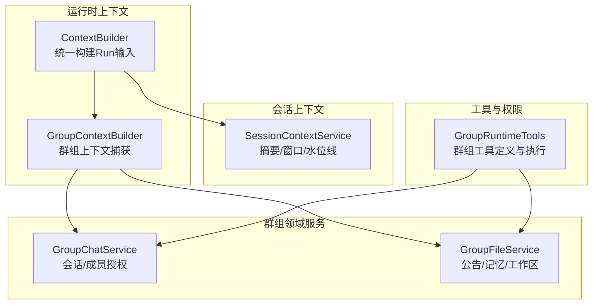
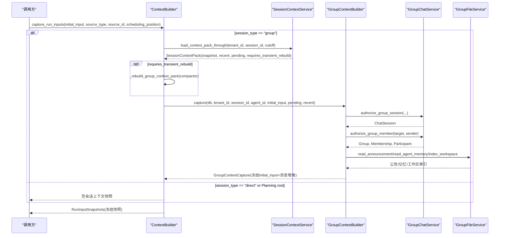
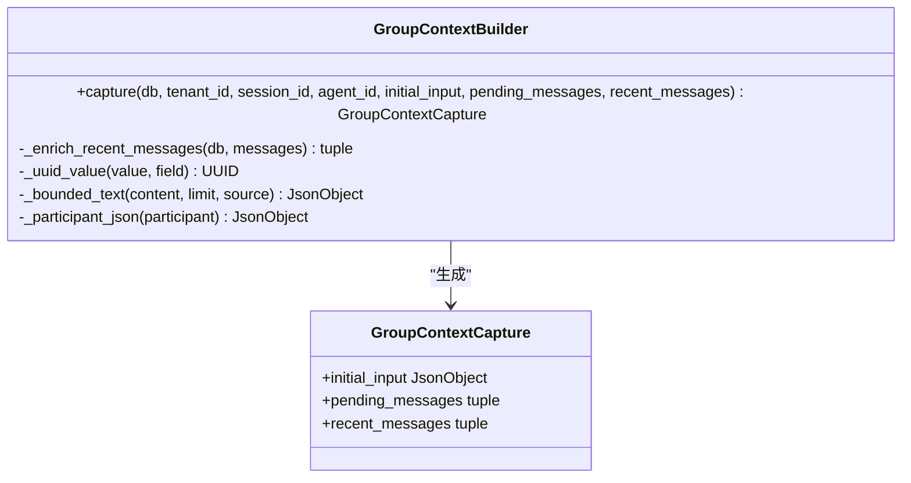
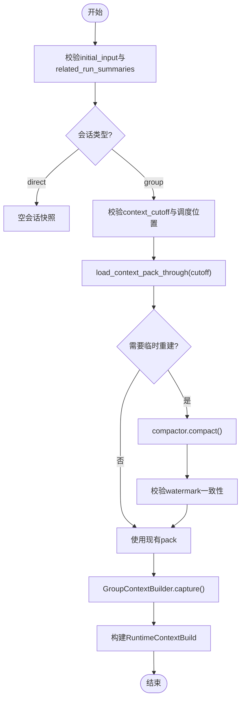
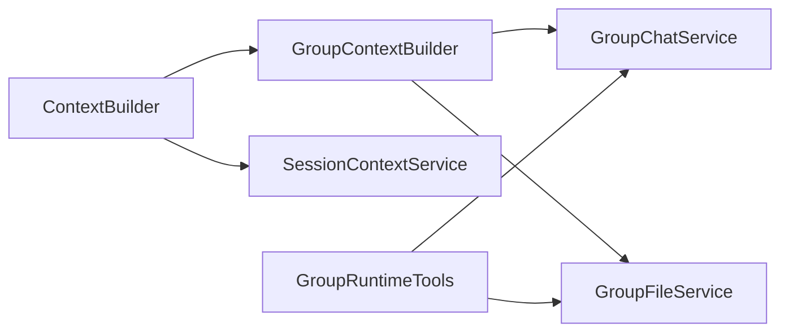
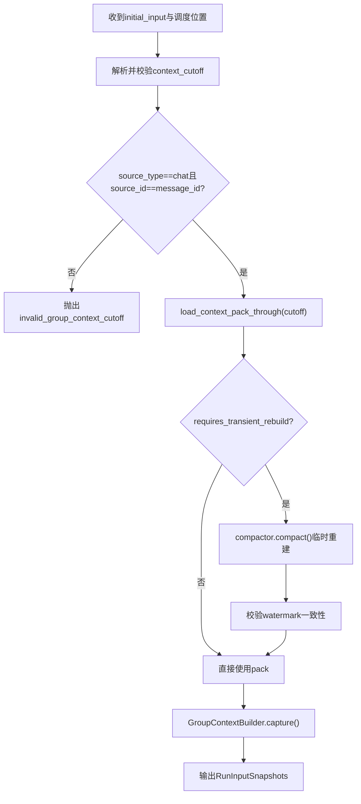

# 群组上下文构建

<cite>
**本文引用的文件**
- [backend/app/services/agent_runtime/group_context_builder.py](file://backend/app/services/agent_runtime/group_context_builder.py)
- [backend/app/services/agent_runtime/context_builder.py](file://backend/app/services/agent_runtime/context_builder.py)
- [backend/app/services/group_chat_service.py](file://backend/app/services/group_chat_service.py)
- [backend/app/services/group_file_service.py](file://backend/app/services/group_file_service.py)
- [backend/app/services/agent_runtime/session_context_service.py](file://backend/app/services/agent_runtime/session_context_service.py)
- [backend/app/services/agent_runtime/group_runtime_tools.py](file://backend/app/services/agent_runtime/group_runtime_tools.py)
- [backend/tests/test_agent_runtime_group_context_builder.py](file://backend/tests/test_agent_runtime_group_context_builder.py)
- [backend/tests/test_agent_runtime_group_cutoff.py](file://backend/tests/test_agent_runtime_group_cutoff.py)
</cite>

## 目录
1. [简介](#简介)
2. [项目结构](#项目结构)
3. [核心组件](#核心组件)
4. [架构总览](#架构总览)
5. [详细组件分析](#详细组件分析)
6. [依赖关系分析](#依赖关系分析)
7. [性能考虑](#性能考虑)
8. [故障排查指南](#故障排查指南)
9. [结论](#结论)
10. [附录](#附录)

## 简介
本技术文档聚焦于Clawith的群组上下文构建系统，围绕GroupContextBuilder的设计与实现，系统性阐述：
- 群组消息过滤、上下文裁剪与权限控制机制
- 群组上下文的构建流程（消息位置验证、时间戳检查、安全边界控制）
- 群组特有的上下文隔离策略、多租户支持、数据同步机制
- 群组上下文的数据模型、构建算法与性能考量
- 扩展方法、调试工具与故障排查指南

该子系统确保在群组会话中，Agent运行时仅获得“可信、有界、可审计”的上下文输入，避免越权访问与上下文污染。

## 项目结构
群组上下文构建相关代码主要位于后端服务层，关键模块包括：
- 群组上下文捕获器：负责校验并冻结群组侧不可变上下文片段
- 运行期上下文构建器：统一组装Run输入快照与模型可见上下文窗口
- 群组聊天服务：成员与会话授权、消息定位与一致性保障
- 群组文件服务：公告、记忆与工作区文件的读写与版本控制
- 会话上下文服务：会话级摘要、滚动窗口与水位线管理
- 群组运行时工具：按权限暴露群组能力，限制工作区作用域

图表来源
- [backend/app/services/agent_runtime/context_builder.py:286-494](file://backend/app/services/agent_runtime/context_builder.py#L286-L494)
- [backend/app/services/agent_runtime/group_context_builder.py:72-385](file://backend/app/services/agent_runtime/group_context_builder.py#L72-L385)
- [backend/app/services/group_chat_service.py:255-332](file://backend/app/services/group_chat_service.py#L255-L332)
- [backend/app/services/group_file_service.py:713-800](file://backend/app/services/group_file_service.py#L713-L800)
- [backend/app/services/agent_runtime/session_context_service.py:51-102](file://backend/app/services/agent_runtime/session_context_service.py#L51-L102)
- [backend/app/services/agent_runtime/group_runtime_tools.py:140-174](file://backend/app/services/agent_runtime/group_runtime_tools.py#L140-L174)

章节来源
- [backend/app/services/agent_runtime/context_builder.py:286-494](file://backend/app/services/agent_runtime/context_builder.py#L286-L494)
- [backend/app/services/agent_runtime/group_context_builder.py:72-385](file://backend/app/services/agent_runtime/group_context_builder.py#L72-L385)

## 核心组件
- GroupContextBuilder：捕获并冻结群组侧不可变上下文片段，包含触发消息、目标Agent、群组信息、会话信息、公告、Agent记忆、工作区索引与规划提示等；对参与者、会话、触发消息进行强校验与权限校验。
- ContextBuilder：统一构建新Run的输入快照与模型可见上下文窗口，处理直接对话与群组对话的差异，强制使用context_cutoff保证确定性裁剪，并在需要时临时重建会话上下文。
- GroupChatService：提供群组与会话的授权、成员有效性校验、消息定位与一致性约束。
- GroupFileService：提供群组公告、Agent记忆与工作区的读取与写入，严格路径与内容校验，基于存储后端的CAS操作保证原子性。
- SessionContextService：维护会话级摘要、滚动消息窗口与水位线，支持通过cutoff精确加载历史范围。
- GroupRuntimeTools：为群组运行时注入受控工具集，限定工作区作用域与读写权限。

章节来源
- [backend/app/services/agent_runtime/group_context_builder.py:72-385](file://backend/app/services/agent_runtime/group_context_builder.py#L72-L385)
- [backend/app/services/agent_runtime/context_builder.py:286-494](file://backend/app/services/agent_runtime/context_builder.py#L286-L494)
- [backend/app/services/group_chat_service.py:255-332](file://backend/app/services/group_chat_service.py#L255-L332)
- [backend/app/services/group_file_service.py:713-800](file://backend/app/services/group_file_service.py#L713-L800)
- [backend/app/services/agent_runtime/session_context_service.py:51-102](file://backend/app/services/agent_runtime/session_context_service.py#L51-L102)
- [backend/app/services/agent_runtime/group_runtime_tools.py:140-174](file://backend/app/services/agent_runtime/group_runtime_tools.py#L140-L174)

## 架构总览
群组上下文构建的核心流程如下：
- 入口：ContextBuilder.capture_run_inputs接收初始输入与调度位置信息
- 会话类型判断：区分direct与group；direct不加载会话历史，group需按cutoff加载
- 群组上下文捕获：GroupContextBuilder.capture完成身份、会话、触发消息、Agent、用户与组织信息的校验与增强
- 会话上下文打包：SessionContextService.load_context_pack_through按cutoff返回快照与消息窗口
- 可选临时重建：若pending消息超出cutoff，则通过compactor临时重建快照，不写共享状态
- 输出：RunInputSnapshots冻结输入，后续build阶段仅从快照构建模型上下文

图表来源
- [backend/app/services/agent_runtime/context_builder.py:374-494](file://backend/app/services/agent_runtime/context_builder.py#L374-L494)
- [backend/app/services/agent_runtime/group_context_builder.py:115-385](file://backend/app/services/agent_runtime/group_context_builder.py#L115-L385)
- [backend/app/services/group_chat_service.py:310-332](file://backend/app/services/group_chat_service.py#L310-L332)
- [backend/app/services/group_file_service.py:713-800](file://backend/app/services/group_file_service.py#L713-L800)

## 详细组件分析

### GroupContextBuilder：群组上下文捕获与校验
职责与要点：
- 输入校验：UUID字段校验、session_id一致性校验、必需字段存在性
- 权限校验：authorize_group_session与authorize_group_member双重校验，确保target_participant为当前运行的Agent且属于活跃成员
- 触发消息权威引用：从数据库查询trigger_message，校验其created_at非空、sender与payload一致、mentions快照权威有效且triggers_agent为真
- Agent可用性校验：状态为active、未过期、未删除
- 发送者画像增强：若sender为用户，则加载User与OrgMember以补充title与department
- 文件读取：公告、Agent记忆、工作区索引，均通过GroupFileService并按配置限制大小
- 规划提示：mode、plan_prompt、current_responsibility透传至planning_hint
- 输出：GroupContextCapture冻结initial_input并附加group_context，同时增强recent/pending消息的sender_name/sender_type

图表来源
- [backend/app/services/agent_runtime/group_context_builder.py:29-36](file://backend/app/services/agent_runtime/group_context_builder.py#L29-L36)
- [backend/app/services/agent_runtime/group_context_builder.py:72-385](file://backend/app/services/agent_runtime/group_context_builder.py#L72-L385)

章节来源
- [backend/app/services/agent_runtime/group_context_builder.py:72-385](file://backend/app/services/agent_runtime/group_context_builder.py#L72-L385)

### ContextBuilder：统一上下文构建与裁剪
职责与要点：
- JSON值校验：递归校验initial_input与related_run_summaries，拒绝非JSON序列化值与非有限浮点数
- 会话上下文选择：direct或Planning root使用空快照；group使用load_context_pack_through按cutoff加载
- 群组cutoff校验：_group_cutoff强制source_type=chat、source_id与message_id一致，scheduling_position_created_at必须带时区且与cutoff.created_at相等
- 临时重建：当requires_transient_rebuild为真且无compactor时抛出错误；否则用compactor构造transient snapshot，确保watermark不变
- 构建模型上下文：从checkpoint快照构建RuntimeContextBuild，选择最近工具安全窗口，合并thread_summary与selected_thread_messages

图表来源
- [backend/app/services/agent_runtime/context_builder.py:194-237](file://backend/app/services/agent_runtime/context_builder.py#L194-L237)
- [backend/app/services/agent_runtime/context_builder.py:308-372](file://backend/app/services/agent_runtime/context_builder.py#L308-L372)
- [backend/app/services/agent_runtime/context_builder.py:374-494](file://backend/app/services/agent_runtime/context_builder.py#L374-L494)

章节来源
- [backend/app/services/agent_runtime/context_builder.py:286-494](file://backend/app/services/agent_runtime/context_builder.py#L286-L494)

### GroupChatService：群组与会话授权、消息定位
职责与要点：
- 成员与会话授权：authorize_group_member与authorize_group_session确保参与者活跃、角色有效、会话归属正确
- 消息定位：_session_message确保message_id属于指定session_id，_message_position提供稳定的排序键
- 成员候选与邀请：list_tenant_member_candidates/list_group_member_candidates结合权限与可见性规则筛选
- 事务安全：多处使用with_for_update锁定关键行，防止并发冲突

章节来源
- [backend/app/services/group_chat_service.py:255-332](file://backend/app/services/group_chat_service.py#L255-L332)
- [backend/app/services/group_chat_service.py:335-357](file://backend/app/services/group_chat_service.py#L335-L357)

### GroupFileService：群组文件与版本控制
职责与要点：
- 路径与安全校验：禁止绝对路径与“..”，禁止.exe后缀，文本文件禁止NUL字节与非法UTF-8
- 版本与CAS：prepare_*与apply_*成对出现，基于WriteCondition(version_token或require_absent)保证原子更新
- 工作区重放：reconcile_runtime_workspace_operation在不重复写入的情况下证明最终状态并finalize
- 读取限制：announcement与memory读取需成员授权，memory仅限特定agent_id

章节来源
- [backend/app/services/group_file_service.py:129-177](file://backend/app/services/group_file_service.py#L129-L177)
- [backend/app/services/group_file_service.py:292-371](file://backend/app/services/group_file_service.py#L292-L371)
- [backend/app/services/group_file_service.py:426-519](file://backend/app/services/group_file_service.py#L426-L519)
- [backend/app/services/group_file_service.py:713-800](file://backend/app/services/group_file_service.py#L713-L800)

### SessionContextService：会话摘要与水位线
职责与要点：
- MessagePosition：由created_at与message_id.int构成稳定排序键
- SessionContextSnapshot：版本化摘要，包含requirements/decisions/open_items/evidence_refs/workspace_refs与covered_through_message_id
- Pack语义：snapshot+recent_window+pending_window，支持requires_transient_rebuild标记

章节来源
- [backend/app/services/agent_runtime/session_context_service.py:51-102](file://backend/app/services/agent_runtime/session_context_service.py#L51-L102)

### GroupRuntimeTools：群组工具与权限控制
职责与要点：
- 工具注入：仅在state.snapshots.initial_input包含group_context时追加群组工具
- 作用域限制：为通用文件工具注入workspace_scope参数，默认group，明确区分Agent私有工作区与群组工作区
- 读写分离：GROUP_READ_TOOL_NAMES与GROUP_WRITE_TOOL_NAMES分类控制，工作区变更工具受限

章节来源
- [backend/app/services/agent_runtime/group_runtime_tools.py:140-174](file://backend/app/services/agent_runtime/group_runtime_tools.py#L140-L174)

## 依赖关系分析
- GroupContextBuilder依赖GroupChatService与GroupFileService进行授权与文件读取，依赖Settings获取裁剪阈值
- ContextBuilder依赖SessionContextService与GroupContextBuilder，必要时依赖SessionContextCompactor进行临时重建
- GroupRuntimeTools依赖GroupChatService与GroupFileService，并通过builtin_tool_definitions注入工具定义
- 所有服务均通过AsyncSession进行异步数据库访问，遵循多租户tenant_id隔离

图表来源
- [backend/app/services/agent_runtime/group_context_builder.py:115-385](file://backend/app/services/agent_runtime/group_context_builder.py#L115-L385)
- [backend/app/services/agent_runtime/context_builder.py:374-494](file://backend/app/services/agent_runtime/context_builder.py#L374-L494)
- [backend/app/services/agent_runtime/group_runtime_tools.py:140-174](file://backend/app/services/agent_runtime/group_runtime_tools.py#L140-L174)

章节来源
- [backend/app/services/agent_runtime/group_context_builder.py:115-385](file://backend/app/services/agent_runtime/group_context_builder.py#L115-L385)
- [backend/app/services/agent_runtime/context_builder.py:374-494](file://backend/app/services/agent_runtime/context_builder.py#L374-L494)
- [backend/app/services/agent_runtime/group_runtime_tools.py:140-174](file://backend/app/services/agent_runtime/group_runtime_tools.py#L140-L174)

## 性能考虑
- 上下文裁剪：通过GROUP_CONTEXT_ANNOUNCEMENT_MAX_CHARS、GROUP_CONTEXT_MEMORY_MAX_CHARS、GROUP_CONTEXT_WORKSPACE_MAX_ENTRIES限制输入体积，避免LLM上下文溢出
- 数据库查询优化：批量加载参与者信息以减少往返；使用select().where(...).in_(...)减少多次查询
- 临时重建避免写锁竞争：_rebuild_group_context_pack仅在内存中重建transient snapshot，不修改共享状态
- 工具窗口选择：build_recent_tool_safe_window基于token预算与工具执行账本选择最近消息窗口，降低无效调用

[本节为通用指导，无需具体文件引用]

## 故障排查指南
常见错误码与定位建议：
- invalid_group_runtime_input：UUID字段格式错误或session_id不一致，检查initial_input字段类型与一致性
- invalid_group_runtime_scope：会话、目标参与者与运行时Agent不匹配，核对authorize_group_session与authorize_group_member返回值
- group_trigger_message_unavailable：触发消息不存在或created_at为空，确认消息存在于会话且时间戳完整
- agent_unavailable：Agent状态非活跃、已过期或被删除，检查Agent记录状态
- group_sender_invalid：发送者不再是活跃租户用户，检查User.is_active与tenant_id
- invalid_group_context_cutoff：context_cutoff缺失或与调度位置不一致，核对source_type/source_id/message_id与scheduling_position_created_at
- group_context_cutoff_rebuild_failed：compactor重建失败或watermark变化，检查compactor实现与请求一致性
- group_workspace_path_invalid / group_file_content_invalid：路径或内容校验失败，检查相对路径、编码与禁止后缀
- group_file_conflict：CAS失败，重试或检查version_token

章节来源
- [backend/app/services/agent_runtime/context_builder.py:52-58](file://backend/app/services/agent_runtime/context_builder.py#L52-L58)
- [backend/app/services/agent_runtime/group_context_builder.py:115-385](file://backend/app/services/agent_runtime/group_context_builder.py#L115-L385)
- [backend/app/services/group_file_service.py:129-177](file://backend/app/services/group_file_service.py#L129-L177)

## 结论
群组上下文构建系统通过严格的输入校验、权限控制与上下文裁剪，确保Agent在群组环境中获得安全、有界、一致的上下文。GroupContextBuilder与ContextBuilder协同工作，结合SessionContextService与GroupFileService，实现了多租户隔离、确定性裁剪与原子更新。通过工具作用域限制与临时重建机制，系统在功能性与性能之间取得平衡。测试覆盖关键路径与回归场景，有助于持续维护系统稳定性。

[本节为总结，无需具体文件引用]

## 附录

### 数据模型概览
- GroupContextCapture：冻结群组输入与增强后的消息集合
- SessionContextSnapshot：版本化会话摘要与水位线
- MessagePosition：稳定的消息排序键
- PreparedRuntimeWorkspaceOperation：工作区操作的准备态，含条件与哈希

章节来源
- [backend/app/services/agent_runtime/group_context_builder.py:29-36](file://backend/app/services/agent_runtime/group_context_builder.py#L29-L36)
- [backend/app/services/agent_runtime/session_context_service.py:51-102](file://backend/app/services/agent_runtime/session_context_service.py#L51-L102)
- [backend/app/services/group_file_service.py:86-114](file://backend/app/services/group_file_service.py#L86-L114)

### 构建算法流程图（群组cutoff）

图表来源
- [backend/app/services/agent_runtime/context_builder.py:194-237](file://backend/app/services/agent_runtime/context_builder.py#L194-L237)
- [backend/app/services/agent_runtime/context_builder.py:308-372](file://backend/app/services/agent_runtime/context_builder.py#L308-L372)

### 调试与测试要点
- 单元测试覆盖群组上下文冻结、sender元数据增强、规划提示透传与权限拒绝场景
- 群组cutoff测试验证临时重建不写共享状态、队列兄弟节点输入一致性、cutoff缺失或不匹配的早期失败
- 建议在本地启用详细日志，关注authorize_group_session/authorize_group_member与compactor调用链

章节来源
- [backend/tests/test_agent_runtime_group_context_builder.py:61-285](file://backend/tests/test_agent_runtime_group_context_builder.py#L61-L285)
- [backend/tests/test_agent_runtime_group_cutoff.py:184-220](file://backend/tests/test_agent_runtime_group_cutoff.py#L184-L220)
- [backend/tests/test_agent_runtime_group_cutoff.py:270-294](file://backend/tests/test_agent_runtime_group_cutoff.py#L270-L294)