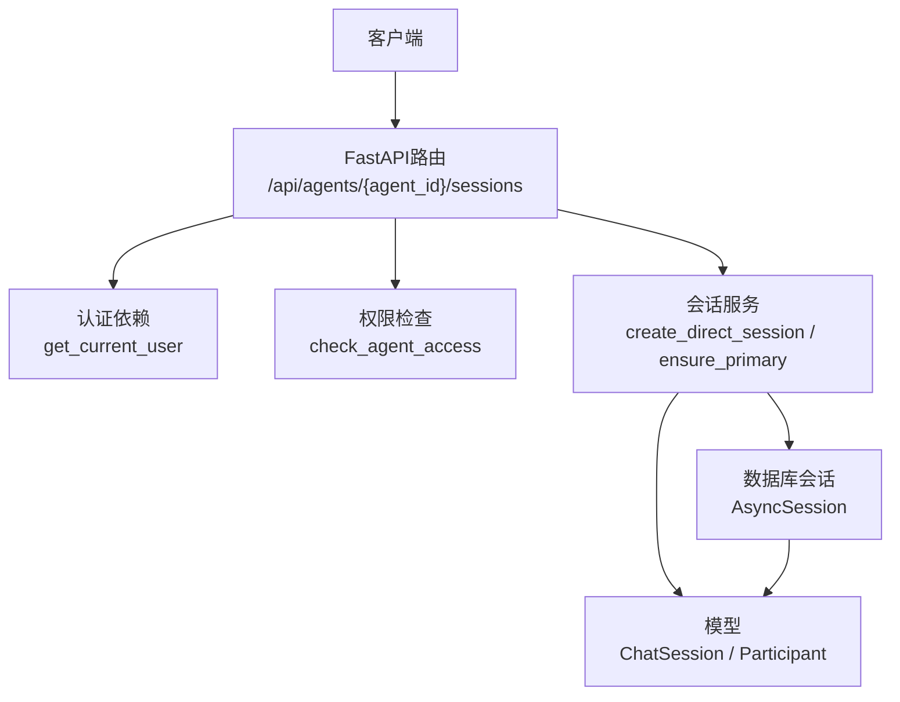
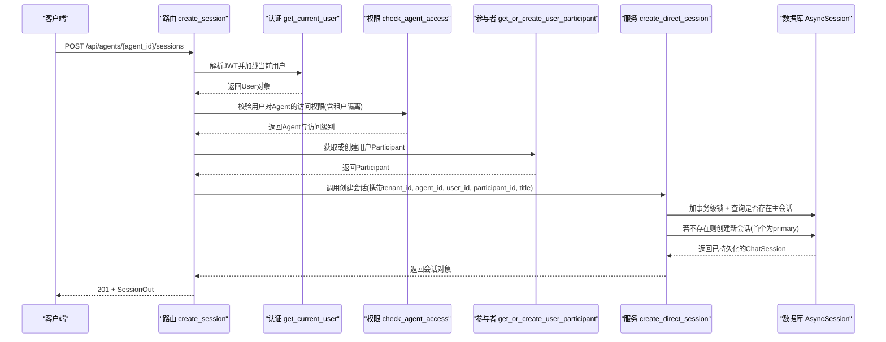
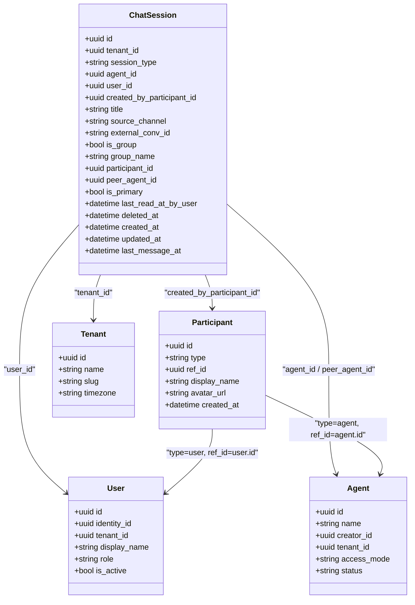

# 会话创建与初始化

<cite>
**本文引用的文件**   
- [chat_sessions.py](file://backend/app/api/chat_sessions.py)
- [chat_session_service.py](file://backend/app/services/chat_session_service.py)
- [chat_session.py](file://backend/app/models/chat_session.py)
- [participant_identity.py](file://backend/app/services/participant_identity.py)
- [participant.py](file://backend/app/models/participant.py)
- [permissions.py](file://backend/app/core/permissions.py)
- [security.py](file://backend/app/core/security.py)
- [user.py](file://backend/app/models/user.py)
- [agent.py](file://backend/app/models/agent.py)
- [tenant.py](file://backend/app/models/tenant.py)
- [test_chat_session_service.py](file://backend/tests/test_chat_session_service.py)
</cite>

## 目录
1. [简介](#简介)
2. [项目结构](#项目结构)
3. [核心组件](#核心组件)
4. [架构总览](#架构总览)
5. [详细组件分析](#详细组件分析)
6. [依赖关系分析](#依赖关系分析)
7. [性能考量](#性能考量)
8. [故障排查指南](#故障排查指南)
9. [结论](#结论)
10. [附录](#附录)

## 简介
本文件聚焦于Clawith的“会话创建与初始化”阶段，系统性阐述：
- ChatSession模型的初始化逻辑、初始状态设置与上下文环境准备
- 租户隔离机制与权限验证流程
- 参与者身份绑定（Participant）与会话元数据管理
- Agent关联关系的建立
- 会话创建API接口、错误处理机制与并发控制策略
- 最佳实践与常见问题解决方案

## 项目结构
围绕会话创建的关键代码分布在以下模块：
- API层：定义并暴露会话创建接口，负责鉴权、参数校验与事务提交
- 服务层：封装会话生命周期操作，保证并发安全与主会话策略
- 模型层：定义ChatSession、Participant、User、Agent、Tenant等实体及约束
- 安全与权限：JWT认证、角色与RBAC访问控制、租户边界检查

**图表来源** 
- [chat_sessions.py:358-394](file://backend/app/api/chat_sessions.py#L358-L394)
- [chat_session_service.py:175-210](file://backend/app/services/chat_session_service.py#L175-L210)
- [security.py:153-173](file://backend/app/core/security.py#L153-L173)
- [permissions.py:481-518](file://backend/app/core/permissions.py#L481-L518)

**章节来源**
- [chat_sessions.py:358-394](file://backend/app/api/chat_sessions.py#L358-L394)
- [chat_session_service.py:175-210](file://backend/app/services/chat_session_service.py#L175-L210)

## 核心组件
- ChatSession模型：统一会话载体，支持direct/group/a2a/trigger类型，包含租户、Agent、用户、参与者、是否为主会话、最后阅读时间等字段与索引约束
- Participant模型：统一参与者身份（User或Agent），用于会话与消息的作者归属
- 会话服务：提供创建、确保主会话、软删除与取消运行等原子化能力，内置并发锁与主会话策略
- 权限与安全：基于JWT的用户认证与RBAC访问控制，强制租户隔离

**章节来源**
- [chat_session.py:23-116](file://backend/app/models/chat_session.py#L23-L116)
- [participant.py:13-32](file://backend/app/models/participant.py#L13-L32)
- [chat_session_service.py:175-210](file://backend/app/services/chat_session_service.py#L175-L210)
- [permissions.py:481-518](file://backend/app/core/permissions.py#L481-L518)
- [security.py:153-173](file://backend/app/core/security.py#L153-L173)

## 架构总览
下图展示一次“创建直接对话会话”的端到端调用链：从HTTP请求进入，到鉴权、权限校验、参与者身份获取、会话创建与持久化。

**图表来源** 
- [chat_sessions.py:358-394](file://backend/app/api/chat_sessions.py#L358-L394)
- [security.py:153-173](file://backend/app/core/security.py#L153-L173)
- [permissions.py:481-518](file://backend/app/core/permissions.py#L481-L518)
- [participant_identity.py:105-118](file://backend/app/services/participant_identity.py#L105-L118)
- [chat_session_service.py:175-210](file://backend/app/services/chat_session_service.py#L175-L210)

## 详细组件分析

### 会话创建API接口
- 路由：POST /api/agents/{agent_id}/sessions
- 输入：可选title
- 输出：SessionOut（包含id、agent_id、user_id、username、source_channel、title、created_at、last_message_at、message_count、unread_count、is_primary、peer_agent_id、participant_type、is_group、group_name等）
- 关键步骤：
  - 通过get_current_user完成JWT鉴权并加载User
  - 通过check_agent_access进行Agent访问权限校验与租户一致性检查
  - 通过get_or_create_user_participant获取或创建用户Participant
  - 调用create_direct_session创建会话，并在同一事务中commit与refresh

**章节来源**
- [chat_sessions.py:358-394](file://backend/app/api/chat_sessions.py#L358-L394)
- [security.py:153-173](file://backend/app/core/security.py#L153-L173)
- [permissions.py:481-518](file://backend/app/core/permissions.py#L481-L518)
- [participant_identity.py:105-118](file://backend/app/services/participant_identity.py#L105-L118)

### ChatSession模型与初始状态
- 关键字段：tenant_id、session_type、agent_id、user_id、created_by_participant_id、title、source_channel、external_conv_id、is_group、group_name、participant_id、peer_agent_id、is_primary、last_read_at_by_user、deleted_at、created_at、updated_at、last_message_at
- 约束与索引：
  - (agent_id, external_conv_id)唯一约束
  - (tenant_id, id)唯一约束
  - session_type枚举校验
  - 针对primary direct与primary group的条件唯一索引
  - tenant_id、group_id等常用查询字段索引
- 初始状态：
  - 首次创建的direct会话自动标记为is_primary=true
  - source_channel默认web；is_group=false；deleted_at为空
  - created_at/updated_at由服务层设置

**章节来源**
- [chat_session.py:23-116](file://backend/app/models/chat_session.py#L23-L116)
- [chat_session_service.py:108-133](file://backend/app/services/chat_session_service.py#L108-L133)

### 参与者身份绑定（Participant）
- Participant统一表示User或Agent作为会话/消息的参与者
- get_or_create_user_participant在事务内以savepoint方式尝试创建，避免并发冲突导致外层事务回滚
- 同步display_name与avatar_url时不覆盖已有值

**章节来源**
- [participant.py:13-32](file://backend/app/models/participant.py#L13-L32)
- [participant_identity.py:47-103](file://backend/app/services/participant_identity.py#L47-L103)
- [participant_identity.py:105-118](file://backend/app/services/participant_identity.py#L105-L118)

### Agent关联关系建立
- 会话创建时需明确agent_id，并通过check_agent_access确认用户对该Agent的访问级别（use/manage）
- 对于A2A会话，peer_agent_id用于标识对端Agent；迁移脚本展示了历史数据回填过程

**章节来源**
- [permissions.py:481-518](file://backend/app/core/permissions.py#L481-L518)
- [chat_session.py:99-101](file://backend/app/models/chat_session.py#L99-L101)
- [006_add_participants.py:70-161](file://backend/alembic/versions/006_add_participants.py#L70-L161)

### 租户隔离机制
- 所有会话与Agent均绑定tenant_id，API层强制校验当前用户的tenant_id与Agent一致
- User模型包含tenant_id，Agent模型亦包含tenant_id，权限检查函数会严格比对
- Tenant模型定义了公司级默认配额与时区等配置

**章节来源**
- [chat_sessions.py:50-54](file://backend/app/api/chat_sessions.py#L50-L54)
- [permissions.py:30-37](file://backend/app/core/permissions.py#L30-L37)
- [permissions.py:481-518](file://backend/app/core/permissions.py#L481-L518)
- [user.py:52-119](file://backend/app/models/user.py#L52-L119)
- [agent.py:19-160](file://backend/app/models/agent.py#L19-L160)
- [tenant.py:13-73](file://backend/app/models/tenant.py#L13-L73)

### 权限验证流程
- JWT解码与用户加载：get_current_user
- Agent访问检查：check_agent_access（考虑creator、admin、access_mode、custom权限）
- 会话所有者校验：仅会话拥有者或具备管理权限者可查看/修改/删除

**章节来源**
- [security.py:153-173](file://backend/app/core/security.py#L153-L173)
- [permissions.py:481-518](file://backend/app/core/permissions.py#L481-L518)
- [chat_sessions.py:107-110](file://backend/app/api/chat_sessions.py#L107-L110)

### 并发控制策略
- 使用PostgreSQL advisory xact lock按(tenant_id, agent_id, user_id)哈希键序列化直聊会话的主会话变更
- 确保首次会话成为primary，后续会话为非primary；删除primary时会提升最近活跃会话为新primary
- 软删除时同时编排取消相关前台协作Run

**章节来源**
- [chat_session_service.py:33-55](file://backend/app/services/chat_session_service.py#L33-L55)
- [chat_session_service.py:175-210](file://backend/app/services/chat_session_service.py#L175-L210)
- [chat_session_service.py:271-323](file://backend/app/services/chat_session_service.py#L271-L323)
- [test_chat_session_service.py:94-154](file://backend/tests/test_chat_session_service.py#L94-L154)

### 会话元数据管理与未读计数
- last_read_at_by_user用于计算未读消息数（基于该时间戳之后的assistant/system/tool_call消息）
- list_sessions接口聚合消息计数与未读计数，并按last_message_at、created_at、id排序

**章节来源**
- [chat_session.py:104-107](file://backend/app/models/chat_session.py#L104-L107)
- [chat_sessions.py:264-280](file://backend/app/api/chat_sessions.py#L264-L280)

### 运行时状态与Lane持有
- runtime-state接口用于查询Direct Chat的foreground lane持有者与运行状态
- 当执行状态为waiting_user时，需校验correlation_id与待恢复命令，以及工具执行的对账项

**章节来源**
- [chat_sessions.py:397-557](file://backend/app/api/chat_sessions.py#L397-L557)

## 依赖关系分析

**图表来源** 
- [chat_session.py:23-116](file://backend/app/models/chat_session.py#L23-L116)
- [participant.py:13-32](file://backend/app/models/participant.py#L13-L32)
- [user.py:52-119](file://backend/app/models/user.py#L52-L119)
- [agent.py:19-160](file://backend/app/models/agent.py#L19-L160)
- [tenant.py:13-73](file://backend/app/models/tenant.py#L13-L73)

**章节来源**
- [chat_session.py:23-116](file://backend/app/models/chat_session.py#L23-L116)
- [participant.py:13-32](file://backend/app/models/participant.py#L13-L32)
- [user.py:52-119](file://backend/app/models/user.py#L52-L119)
- [agent.py:19-160](file://backend/app/models/agent.py#L19-L160)
- [tenant.py:13-73](file://backend/app/models/tenant.py#L13-L73)

## 性能考量
- 使用PostgreSQL advisory xact lock避免竞争条件，保证主会话策略的正确性
- 查询优化：按tenant_id、agent_id、user_id过滤，结合条件唯一索引快速定位主会话
- 批量统计消息与未读数时使用聚合查询减少往返
- 参与者创建采用savepoint隔离并发冲突，降低外层事务失败概率

[本节为通用指导，无需引用具体文件]

## 故障排查指南
- 常见错误码与场景：
  - 401 未授权：JWT无效或用户不存在/非激活
  - 403 无权限：租户不一致、用户无Agent访问权限、非会话所有者
  - 404 未找到：会话或运行不存在
  - 409 冲突：多lane持有者、运行时状态不匹配、等待用户状态异常
  - 422 参数校验失败：缺少必填字段（如对账note）
- 排查要点：
  - 确认用户tenant_id与Agent.tenant_id一致
  - 检查会话是否为active且未被软删除
  - 核对runtime-state中的execution_status与waiting_correlation_id
  - 查看pending tool reconciliations是否需要人工确认

**章节来源**
- [chat_sessions.py:397-557](file://backend/app/api/chat_sessions.py#L397-L557)
- [chat_sessions.py:562-667](file://backend/app/api/chat_sessions.py#L562-L667)

## 结论
Clawith的会话创建与初始化通过清晰的API分层、严谨的权限与租户隔离、稳健的并发控制与主会话策略，确保了多租户环境下会话的一致性与可追溯性。Participant统一身份抽象简化了参与者建模，而运行时状态与Lane持有机制保障了对话执行的确定性。遵循本文的最佳实践可有效避免常见错误并提升系统稳定性。

[本节为总结性内容，无需引用具体文件]

## 附录
- 最佳实践
  - 始终通过API创建会话，避免绕过服务层导致的并发问题
  - 在创建前确保用户处于目标租户且处于激活状态
  - 合理设置title以便前端展示与检索
  - 关注runtime-state，及时处理waiting_user与tool reconciliation
- 常见问题
  - “当前用户不在该租户激活”：检查用户租户与激活状态
  - “无此Agent访问权限”：检查Agent的access_mode与用户权限
  - “会话不存在”：检查soft-delete与scope过滤条件
  - “运行时状态不匹配”：核对lane_key、run_kind与runtime_type

[本节为补充信息，无需引用具体文件]