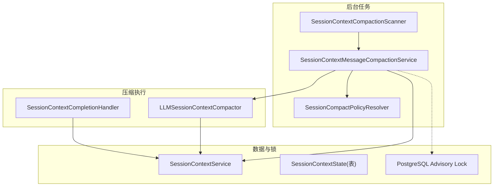
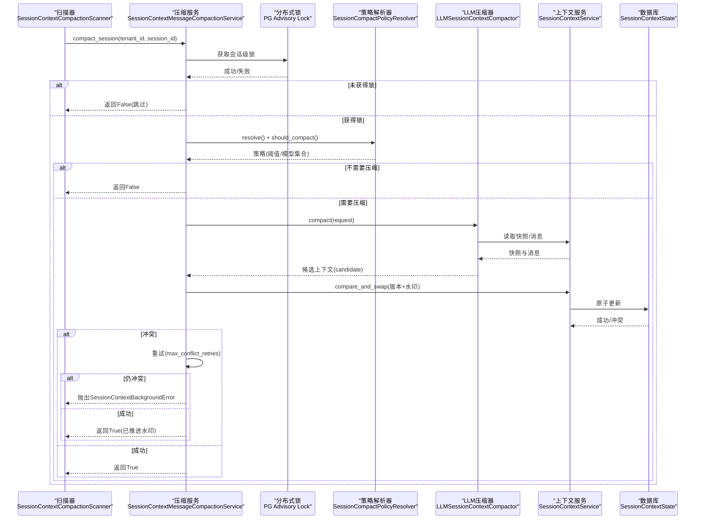
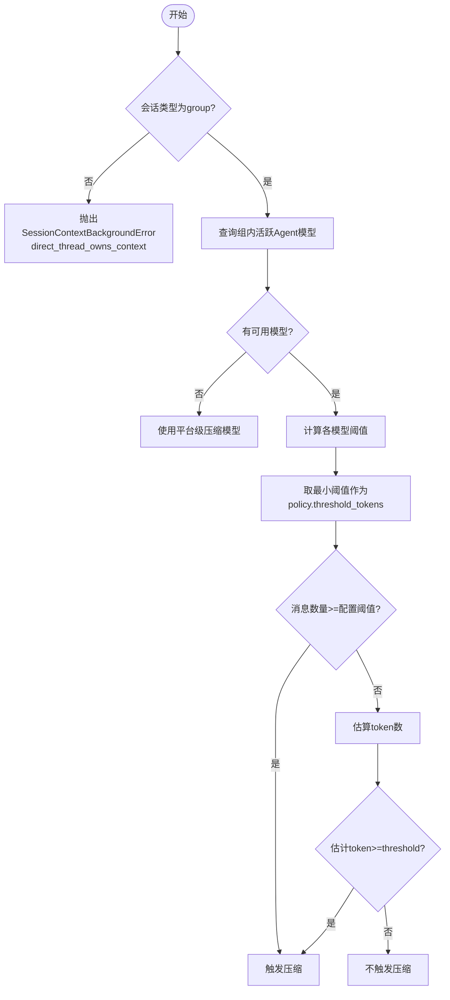
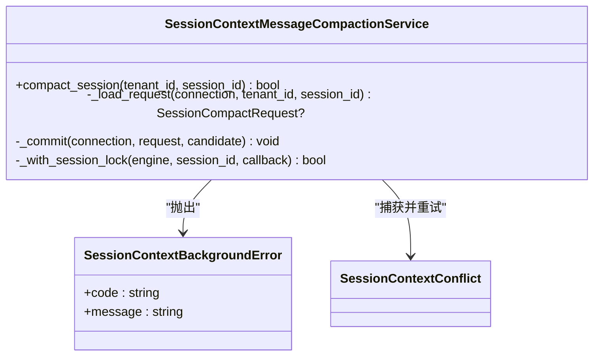
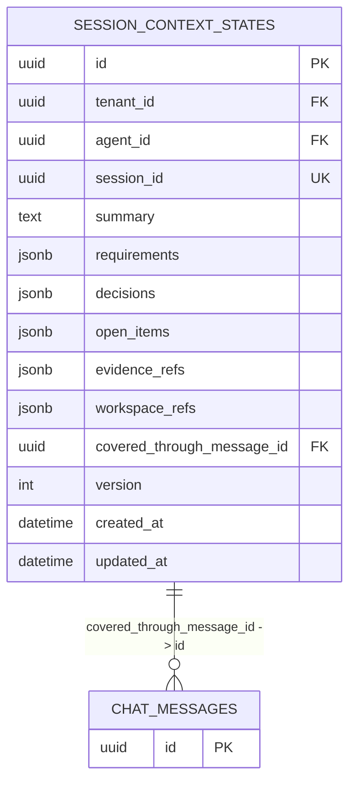
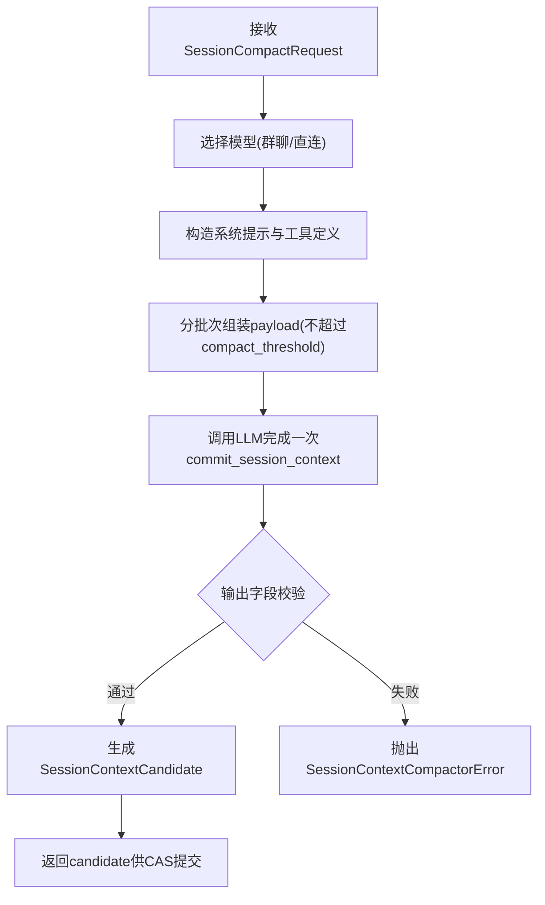
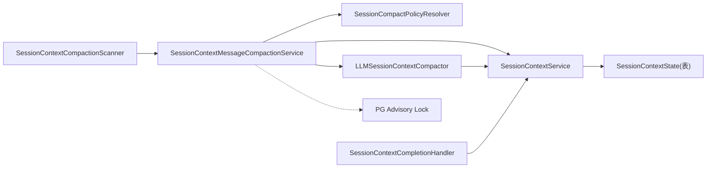

# 会话压缩后台任务

<cite>
**本文引用的文件**
- [session_context_background.py](file://backend/app/services/agent_runtime/session_context_background.py)
- [session_context_compactor.py](file://backend/app/services/agent_runtime/session_context_compactor.py)
- [session_context_service.py](file://backend/app/services/agent_runtime/session_context_service.py)
- [session_context_completion.py](file://backend/app/services/agent_runtime/session_context_completion.py)
- [thread_lock.py](file://backend/app/services/agent_runtime/thread_lock.py)
- [session_context_state.py](file://backend/app/models/session_context_state.py)
- [config.py](file://backend/app/config.py)
- [test_agent_runtime_session_context_background.py](file://backend/tests/test_agent_runtime_session_context_background.py)
</cite>

## 目录
1. [简介](#简介)
2. [项目结构](#项目结构)
3. [核心组件](#核心组件)
4. [架构总览](#架构总览)
5. [详细组件分析](#详细组件分析)
6. [依赖关系分析](#依赖关系分析)
7. [性能与资源优化](#性能与资源优化)
8. [故障排查指南](#故障排查指南)
9. [结论](#结论)
10. [附录](#附录)

## 简介
本技术文档聚焦于Clawith的“会话上下文自动压缩”后台任务，系统性阐述以下方面：
- 会话上下文的自动压缩机制、触发条件判断与策略选择
- SessionContextBackgroundError异常处理、分布式锁机制与冲突重试策略
- 消息水印（watermark）管理、版本控制与一致性保证
- 压缩性能调优、内存管理与磁盘空间优化
- 压缩任务监控、日志分析与问题诊断方法

该能力通过后台扫描器周期性发现需要压缩的群聊会话，基于模型能力预算与消息阈值判定是否触发压缩；LLM压缩器生成结构化候选上下文并通过乐观并发控制写入数据库；终端运行结果通过合并通道更新上下文但不改变消息水印。整体设计确保多进程/多实例安全、幂等与可恢复。

## 项目结构
与“会话压缩后台任务”相关的代码主要位于后端服务层与模型层：
- 后台调度与扫描：SessionContextCompactionScanner
- 压缩策略与触发：SessionCompactPolicyResolver
- LLM压缩执行：LLMSessionContextCompactor
- 上下文读写与CAS：SessionContextService
- 终端Delta合并：SessionContextCompletionHandler
- 分布式锁：PostgreSQL advisory lock封装
- 持久化模型：SessionContextState

图表来源
- [session_context_background.py:397-476](file://backend/app/services/agent_runtime/session_context_background.py#L397-L476)
- [session_context_background.py:97-219](file://backend/app/services/agent_runtime/session_context_background.py#L97-L219)
- [session_context_background.py:254-395](file://backend/app/services/agent_runtime/session_context_background.py#L254-L395)
- [session_context_compactor.py:266-456](file://backend/app/services/agent_runtime/session_context_compactor.py#L266-L456)
- [session_context_service.py:553-800](file://backend/app/services/agent_runtime/session_context_service.py#L553-L800)
- [session_context_completion.py:123-301](file://backend/app/services/agent_runtime/session_context_completion.py#L123-L301)
- [thread_lock.py:60-89](file://backend/app/services/agent_runtime/thread_lock.py#L60-L89)
- [session_context_state.py:25-101](file://backend/app/models/session_context_state.py#L25-L101)

章节来源
- [session_context_background.py:1-502](file://backend/app/services/agent_runtime/session_context_background.py#L1-L502)
- [session_context_compactor.py:1-464](file://backend/app/services/agent_runtime/session_context_compactor.py#L1-L464)
- [session_context_service.py:1-800](file://backend/app/services/agent_runtime/session_context_service.py#L1-L800)
- [session_context_completion.py:1-310](file://backend/app/services/agent_runtime/session_context_completion.py#L1-L310)
- [thread_lock.py:1-89](file://backend/app/services/agent_runtime/thread_lock.py#L1-L89)
- [session_context_state.py:1-101](file://backend/app/models/session_context_state.py#L1-L101)

## 核心组件
- SessionContextCompactionScanner：按批次扫描活跃群聊会话，调用压缩服务推进水印。
- SessionCompactPolicyResolver：计算共享上下文触发预算（token阈值），并基于消息数量与估计token数判定是否压缩。
- SessionContextMessageCompactionService：在会话级分布式锁保护下加载请求、调用压缩器、CAS提交，支持冲突重试。
- LLMSessionContextCompactor：根据会话类型选择模型，构造系统提示与工具定义，分批次调用LLM生成候选上下文，严格校验输出字段。
- SessionContextService：提供快照读取、增量消息查询、最近窗口消息、以及带版本和水印的compare-and-swap写入。
- SessionContextCompletionHandler：将终端Run的delta合并到上下文，不改变消息水印，具备幂等回执检查与冲突重试。
- PostgreSQL Advisory Lock：基于会话级锁实现跨进程互斥，避免同一会话并发压缩。

章节来源
- [session_context_background.py:397-476](file://backend/app/services/agent_runtime/session_context_background.py#L397-L476)
- [session_context_background.py:97-219](file://backend/app/services/agent_runtime/session_context_background.py#L97-L219)
- [session_context_background.py:254-395](file://backend/app/services/agent_runtime/session_context_background.py#L254-L395)
- [session_context_compactor.py:266-456](file://backend/app/services/agent_runtime/session_context_compactor.py#L266-L456)
- [session_context_service.py:553-800](file://backend/app/services/agent_runtime/session_context_service.py#L553-L800)
- [session_context_completion.py:123-301](file://backend/app/services/agent_runtime/session_context_completion.py#L123-L301)
- [thread_lock.py:60-89](file://backend/app/services/agent_runtime/thread_lock.py#L60-L89)

## 架构总览
后台扫描器周期性地从数据库中挑选符合条件的群聊会话，进入压缩流程。每个会话由分布式锁串行化，防止重复压缩。策略解析器决定是否需要压缩，若满足则构建压缩请求，交由LLM压缩器生成候选上下文，最后通过CAS原子更新状态。

图表来源
- [session_context_background.py:355-395](file://backend/app/services/agent_runtime/session_context_background.py#L355-L395)
- [session_context_background.py:231-252](file://backend/app/services/agent_runtime/session_context_background.py#L231-L252)
- [session_context_background.py:97-219](file://backend/app/services/agent_runtime/session_context_background.py#L97-L219)
- [session_context_compactor.py:437-456](file://backend/app/services/agent_runtime/session_context_compactor.py#L437-L456)
- [session_context_service.py:553-800](file://backend/app/services/agent_runtime/session_context_service.py#L553-L800)

## 详细组件分析

### 触发条件与策略选择
- 策略解析器会校验会话类型必须为群聊，且存在有效Agent模型；若无可用模型则回退至平台级压缩模型。
- 阈值计算依据模型能力预算（context_window_tokens、max_output_tokens、预留与安全余量）得出compact_threshold。
- 触发条件包括：
  - 旧消息数量超过配置阈值（AGENT_RUNTIME_SESSION_COMPACT_MESSAGE_THRESHOLD）
  - 估计token数（快照+待压缩消息+近期消息）超过阈值

图表来源
- [session_context_background.py:103-196](file://backend/app/services/agent_runtime/session_context_background.py#L103-L196)
- [session_context_background.py:198-219](file://backend/app/services/agent_runtime/session_context_background.py#L198-L219)

章节来源
- [session_context_background.py:97-219](file://backend/app/services/agent_runtime/session_context_background.py#L97-L219)
- [test_agent_runtime_session_context_background.py:83-263](file://backend/tests/test_agent_runtime_session_context_background.py#L83-L263)

### 分布式锁与冲突重试
- 使用PostgreSQL会话级advisory锁，以会话ID哈希生成锁键，确保同一会话在同一时刻仅一个worker进行压缩。
- 获取锁失败时直接返回False，避免阻塞其他会话。
- CAS提交失败（SessionContextConflict）会在最大重试次数内循环重试；超过上限抛出SessionContextBackgroundError。

图表来源
- [session_context_background.py:231-252](file://backend/app/services/agent_runtime/session_context_background.py#L231-L252)
- [session_context_background.py:322-395](file://backend/app/services/agent_runtime/session_context_background.py#L322-L395)
- [session_context_service.py:41-48](file://backend/app/services/agent_runtime/session_context_service.py#L41-L48)

章节来源
- [session_context_background.py:231-252](file://backend/app/services/agent_runtime/session_context_background.py#L231-L252)
- [session_context_background.py:355-395](file://backend/app/services/agent_runtime/session_context_background.py#L355-L395)
- [session_context_service.py:41-48](file://backend/app/services/agent_runtime/session_context_service.py#L41-L48)

### 消息水印管理与版本控制
- 水印（covered_through_message_id）表示已压缩覆盖到的最新消息ID，用于增量读取后续消息。
- 每次压缩成功后，CAS提交要求expected_version与expected_covered_through_message_id与当前快照一致，确保一致性。
- 终端Delta合并不得改变水印，仅合并业务事实（需求、决策、开放项等）。

图表来源
- [session_context_state.py:25-101](file://backend/app/models/session_context_state.py#L25-L101)
- [session_context_service.py:536-551](file://backend/app/services/agent_runtime/session_context_service.py#L536-L551)

章节来源
- [session_context_state.py:25-101](file://backend/app/models/session_context_state.py#L25-L101)
- [session_context_service.py:536-551](file://backend/app/services/agent_runtime/session_context_service.py#L536-L551)
- [session_context_completion.py:210-267](file://backend/app/services/agent_runtime/session_context_completion.py#L210-L267)

### LLM压缩器与输出校验
- 针对群聊会话使用平台级压缩模型；直连会话使用对应Agent模型。
- 系统提示与工具定义强制LLM调用commit_session_context一次，参数包含summary、requirements、decisions、open_items、evidence_refs、workspace_refs。
- 输出经过严格JSON校验，非法值或字段缺失将抛出SessionContextCompactorError。
- 输入过大或单条消息过大时会抛出错误，避免无效压缩尝试。

图表来源
- [session_context_compactor.py:266-456](file://backend/app/services/agent_runtime/session_context_compactor.py#L266-L456)

章节来源
- [session_context_compactor.py:266-456](file://backend/app/services/agent_runtime/session_context_compactor.py#L266-L456)

### 终端Delta合并与幂等性
- 终端运行完成后，若包含session_context_delta，则合并到上下文，但不改变水印。
- 通过Run记录中的session_context_applied_checkpoint_id实现幂等：若已应用相同checkpoint_id则直接返回。
- 合并过程同样采用CAS与冲突重试，确保最终一致性。

章节来源
- [session_context_completion.py:123-301](file://backend/app/services/agent_runtime/session_context_completion.py#L123-L301)

## 依赖关系分析
- 后台扫描器依赖数据库连接工厂与压缩服务。
- 压缩服务依赖策略解析器、上下文服务与LLM压缩器。
- 上下文服务依赖SQLAlchemy ORM与数据库表SessionContextState。
- 分布式锁依赖PostgreSQL advisory lock。
- 终端合并依赖AgentRun与上下文服务。

图表来源
- [session_context_background.py:397-476](file://backend/app/services/agent_runtime/session_context_background.py#L397-L476)
- [session_context_background.py:254-395](file://backend/app/services/agent_runtime/session_context_background.py#L254-L395)
- [session_context_compactor.py:266-456](file://backend/app/services/agent_runtime/session_context_compactor.py#L266-L456)
- [session_context_service.py:553-800](file://backend/app/services/agent_runtime/session_context_service.py#L553-L800)
- [session_context_completion.py:123-301](file://backend/app/services/agent_runtime/session_context_completion.py#L123-L301)
- [thread_lock.py:60-89](file://backend/app/services/agent_runtime/thread_lock.py#L60-L89)
- [session_context_state.py:25-101](file://backend/app/models/session_context_state.py#L25-L101)

章节来源
- [session_context_background.py:1-502](file://backend/app/services/agent_runtime/session_context_background.py#L1-L502)
- [session_context_compactor.py:1-464](file://backend/app/services/agent_runtime/session_context_compactor.py#L1-L464)
- [session_context_service.py:1-800](file://backend/app/services/agent_runtime/session_context_service.py#L1-L800)
- [session_context_completion.py:1-310](file://backend/app/services/agent_runtime/session_context_completion.py#L1-L310)
- [thread_lock.py:1-89](file://backend/app/services/agent_runtime/thread_lock.py#L1-L89)
- [session_context_state.py:1-101](file://backend/app/models/session_context_state.py#L1-L101)

## 性能与资源优化
- 扫描批大小与间隔：
  - AGENT_RUNTIME_SESSION_COMPACT_SCAN_BATCH_SIZE：单次扫描会话数量，默认50，上限500。
  - AGENT_RUNTIME_SESSION_COMPACT_SCAN_SECONDS：扫描轮次间隔秒数，默认5.0。
- 触发阈值：
  - AGENT_RUNTIME_SESSION_COMPACT_MESSAGE_THRESHOLD：早期消息数量阈值，可为空。
  - AGENT_RUNTIME_SUMMARY_THRESHOLD_RATIO：模型预算比例，默认0.85。
- 最近消息窗口：
  - AGENT_RUNTIME_SESSION_RECENT_MESSAGES：保留最近消息数量，默认20。
- 内存与I/O：
  - 使用异步数据库连接与批量查询，减少阻塞。
  - 估计token数采用轻量序列化估算，避免过度开销。
  - 分批次组装payload，避免单次请求过大导致失败。
- 磁盘空间：
  - 压缩后旧消息被摘要替代，减少历史长度；但原始消息仍保留在聊天历史中，需结合消息归档策略。

章节来源
- [config.py:143-158](file://backend/app/config.py#L143-L158)
- [session_context_background.py:412-476](file://backend/app/services/agent_runtime/session_context_background.py#L412-L476)
- [session_context_compactor.py:340-435](file://backend/app/services/agent_runtime/session_context_compactor.py#L340-L435)

## 故障排查指南
- 常见异常与含义：
  - SessionContextBackgroundError：后台压缩不可继续，包含具体code如session_context_unavailable、direct_thread_owns_context、session_context_watermark_mismatch、session_context_conflict_limit等。
  - SessionContextConflict：CAS冲突，通常因并发修改导致，应重试。
  - SessionContextCompactorError：压缩器输出校验失败或输入过大，检查LLM输出结构与输入大小。
  - ThreadLockNotAcquired/ThreadLockReleaseError：分布式锁获取或释放失败，检查数据库连接与会话生命周期。
- 定位步骤：
  - 查看扫描日志与异常堆栈，确认会话ID与租户ID。
  - 检查SessionContextState的版本与水印是否与预期一致。
  - 验证模型能力与预算配置是否正确（context_window_tokens、max_output_tokens）。
  - 确认分布式锁是否被正确释放，避免死锁。
- 建议措施：
  - 调整扫描批大小与间隔，降低负载峰值。
  - 增大最近消息窗口或调整阈值，减少频繁压缩。
  - 对LLM压缩失败场景增加重试与降级策略。

章节来源
- [session_context_background.py:50-56](file://backend/app/services/agent_runtime/session_context_background.py#L50-L56)
- [session_context_background.py:331-385](file://backend/app/services/agent_runtime/session_context_background.py#L331-L385)
- [session_context_compactor.py:84-90](file://backend/app/services/agent_runtime/session_context_compactor.py#L84-L90)
- [thread_lock.py:18-38](file://backend/app/services/agent_runtime/thread_lock.py#L18-L38)

## 结论
Clawith的会话压缩后台任务通过策略驱动、分布式锁与CAS一致性控制，实现了安全、高效、可恢复的上下文压缩。其设计兼顾了不同模型能力与群聊场景，同时保持终端Delta合并的幂等性与水印不变性。在生产环境中，合理配置阈值与扫描参数，配合完善的日志与监控，可有效保障系统稳定性与性能。

## 附录
- 相关测试用例覆盖了策略解析、触发条件、锁行为与扫描SQL等关键路径，可作为行为参考。
- 设计文档明确了压缩目标、触发预算、摘要注入与重试降级策略，为后续迭代提供指导。

章节来源
- [test_agent_runtime_session_context_background.py:1-477](file://backend/tests/test_agent_runtime_session_context_background.py#L1-L477)
- [.clawith-local-designs/CONTEXT_COMPACT_DESIGN.md:1-356](file://clawith-local-designs/CONTEXT_COMPACT_DESIGN.md#L1-L356)