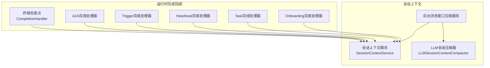
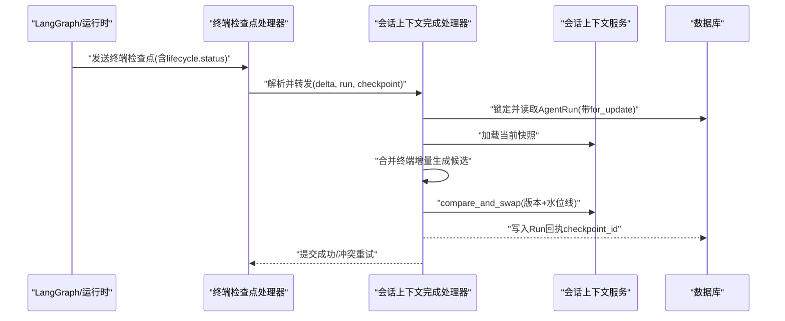
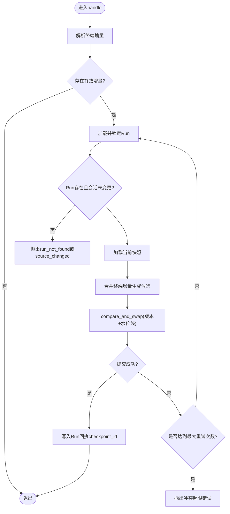
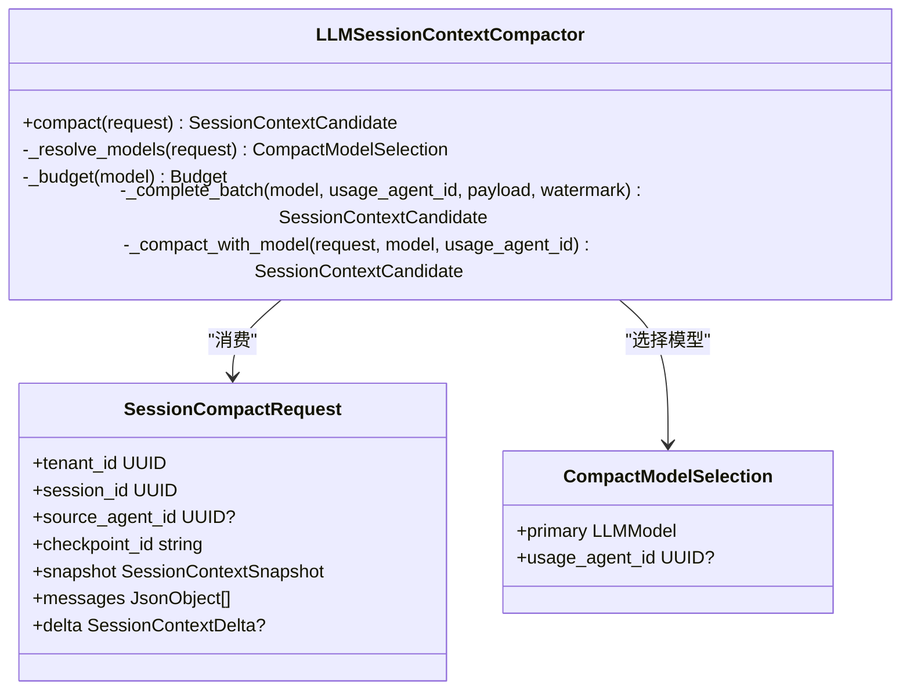
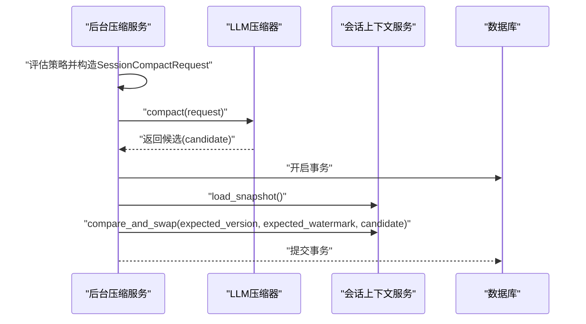
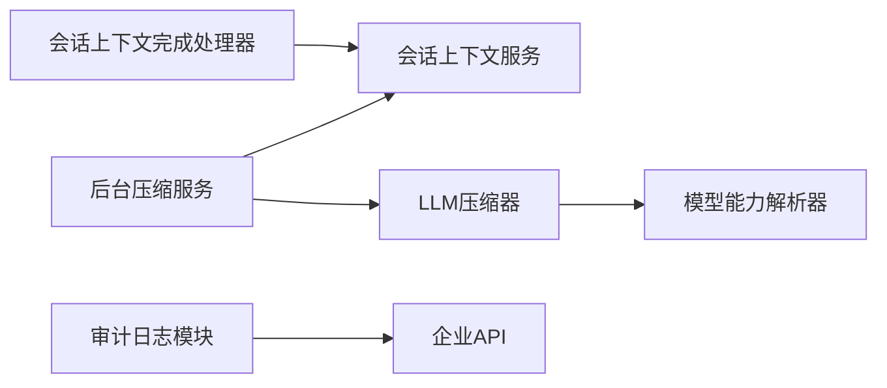

# 会话完成回调机制

<cite>
**本文引用的文件**   
- [session_context_completion.py](file://backend/app/services/agent_runtime/session_context_completion.py)
- [session_context_compactor.py](file://backend/app/services/agent_runtime/session_context_compactor.py)
- [session_context_background.py](file://backend/app/services/agent_runtime/session_context_background.py)
- [session_context_service.py](file://backend/app/services/agent_runtime/session_context_service.py)
- [model_step_service.py](file://backend/app/services/agent_runtime/model_step_service.py)
- [a2a_completion.py](file://backend/app/services/agent_runtime/a2a_completion.py)
- [trigger_completion.py](file://backend/app/services/agent_runtime/trigger_completion.py)
- [heartbeat_completion.py](file://backend/app/services/agent_runtime/heartbeat_completion.py)
- [task_completion.py](file://backend/app/services/agent_runtime/task_completion.py)
- [onboarding_completion.py](file://backend/app/services/agent_runtime/onboarding_completion.py)
- [audit_logger.py](file://backend/app/services/audit_logger.py)
- [audit.py](file://backend/app/models/audit.py)
- [enterprise.py](file://backend/app/api/enterprise.py)
- [test_agent_runtime_session_context_compactor.py](file://backend/tests/test_agent_runtime_session_context_compactor.py)
- [test_agent_runtime_session_context_background.py](file://backend/tests/test_agent_runtime_session_context_background.py)
- [test_agent_runtime_a2a_completion.py](file://backend/tests/test_agent_runtime_a2a_completion.py)
- [test_agent_runtime_trigger_completion.py](file://backend/tests/test_agent_runtime_trigger_completion.py)
</cite>

## 目录
1. [简介](#简介)
2. [项目结构](#项目结构)
3. [核心组件](#核心组件)
4. [架构总览](#架构总览)
5. [详细组件分析](#详细组件分析)
6. [依赖关系分析](#依赖关系分析)
7. [性能考量](#性能考量)
8. [故障排查指南](#故障排查指南)
9. [结论](#结论)
10. [附录](#附录)

## 简介
本文件面向Clawith的“会话完成回调机制”，聚焦于会话结束时上下文合并、清理与资源释放策略，以及SessionCompactRequest请求处理、候选状态生成、原子性更新操作。文档还覆盖完成回调的执行顺序、错误处理与回滚机制，并说明会话数据归档、审计日志记录与统计信息收集的实现要点。最后提供回调机制的配置建议、性能监控与调试方法，帮助读者快速定位问题并优化系统行为。

## 项目结构
围绕会话完成回调的核心代码位于后端服务的agent_runtime子模块中，主要包含：
- 终端检查点完成处理器：负责将运行结束时的“会话上下文增量”与运行回执在事务内合并，保证幂等与一致性。
- LLM驱动的会话压缩器：基于模型输出严格校验生成候选状态，不直接写入产品或检查点状态。
- 后台消息窗口压缩服务：按策略触发压缩，构造SessionCompactRequest，并在事务中执行compare-and-swap原子更新。
- 其他完成处理器：A2A、Trigger、Heartbeat、Task、Onboarding等，统一以“terminal checkpoint”为入口，确保最终一致性与幂等。

图表来源 
- [session_context_completion.py:123-301](file://backend/app/services/agent_runtime/session_context_completion.py#L123-L301)
- [session_context_compactor.py:266-456](file://backend/app/services/agent_runtime/session_context_compactor.py#L266-L456)
- [session_context_background.py:307-353](file://backend/app/services/agent_runtime/session_context_background.py#L307-L353)

章节来源
- [session_context_completion.py:1-310](file://backend/app/services/agent_runtime/session_context_completion.py#L1-L310)
- [session_context_compactor.py:1-464](file://backend/app/services/agent_runtime/session_context_compactor.py#L1-L464)
- [session_context_background.py:307-353](file://backend/app/services/agent_runtime/session_context_background.py#L307-L353)

## 核心组件
- SessionContextCompletionHandler：从终端检查点提取“会话上下文增量”，加载Run与快照，合并候选并在同一事务内原子更新会话上下文与Run回执，支持冲突重试与幂等。
- LLMSessionContextCompactor：根据当前快照与消息窗口（可选delta）调用模型生成候选状态，严格校验工具调用与字段，返回不可变候选对象。
- SessionContextMessageCompactionService（后台）：依据策略生成SessionCompactRequest，调用压缩器得到候选，使用compare-and-swap进行原子提交，确保水位线一致。
- 其他完成处理器：A2A、Trigger、Heartbeat、Task、Onboarding等，遵循统一的terminal checkpoint语义，确保最终一致性与幂等投递。

章节来源
- [session_context_completion.py:123-301](file://backend/app/services/agent_runtime/session_context_completion.py#L123-L301)
- [session_context_compactor.py:266-456](file://backend/app/services/agent_runtime/session_context_compactor.py#L266-L456)
- [session_context_background.py:307-353](file://backend/app/services/agent_runtime/session_context_background.py#L307-L353)
- [a2a_completion.py](file://backend/app/services/agent_runtime/a2a_completion.py)
- [trigger_completion.py](file://backend/app/services/agent_runtime/trigger_completion.py)
- [heartbeat_completion.py](file://backend/app/services/agent_runtime/heartbeat_completion.py)
- [task_completion.py](file://backend/app/services/agent_runtime/task_completion.py)
- [onboarding_completion.py](file://backend/app/services/agent_runtime/onboarding_completion.py)

## 架构总览
下图展示了会话完成回调的整体流程：终端检查点驱动各类完成处理器；对于会话上下文合并，由CompletionHandler在事务内读取Run与快照、合并候选并提交；后台压缩服务按策略触发压缩，生成候选并通过原子比较交换更新上下文。

图表来源 
- [session_context_completion.py:175-267](file://backend/app/services/agent_runtime/session_context_completion.py#L175-L267)
- [session_context_service.py](file://backend/app/services/agent_runtime/session_context_service.py)

章节来源
- [session_context_completion.py:175-267](file://backend/app/services/agent_runtime/session_context_completion.py#L175-L267)

## 详细组件分析

### 会话上下文完成处理器（SessionContextCompletionHandler）
- 输入：终端检查点观察结果与运行记录。
- 关键逻辑：
  - 仅对处于终态（completed/failed/cancelled）的检查点进行处理。
  - 直连对话（Direct Chat）的线程即短期上下文真相，不在此处合并公共会话增量；其他类型可合并。
  - 通过Run回执字段避免重复应用同一检查点，实现幂等。
  - 在同一事务内加锁读取Run、加载快照、合并候选、执行compare-and-swap，失败则抛出冲突异常供外层重试。
  - 水位线保护：终端增量不得推进消息水位线，仅后台消息窗口压缩器可推进。
- 错误与重试：
  - 冲突时抛出特定冲突异常，上层最多重试若干次。
  - 若Run不存在或会话变更，抛出明确错误码。

图表来源 
- [session_context_completion.py:175-301](file://backend/app/services/agent_runtime/session_context_completion.py#L175-L301)

章节来源
- [session_context_completion.py:123-301](file://backend/app/services/agent_runtime/session_context_completion.py#L123-L301)

### LLM会话压缩器（LLMSessionContextCompactor）
- 目标：在不写入任何产品或检查点状态的前提下，生成可信的候选状态。
- 输入：SessionCompactRequest（包含tenant_id、session_id、source_agent_id、checkpoint_id、snapshot、messages、delta）。
- 关键逻辑：
  - 模型选择：区分群会话与直连会话，分别解析多智能体压缩模型或活跃Agent模型。
  - 预算控制：根据模型能力计算compact阈值，估算token用量，分批拼装消息，防止超出限制。
  - 工具约束：强制模型调用唯一工具commit_session_context，参数必须严格匹配schema。
  - 候选校验：对summary、数组字段、数值等进行严格校验，非法输出立即报错。
  - 水位线：消息驱动压缩会推进covered_through_message_id；终端增量不会推进水位线。
- 错误处理：
  - 输入过大、单条消息过大、模型不可用、输出非法等均抛出明确的SessionContextCompactorError。

图表来源 
- [session_context_compactor.py:92-115](file://backend/app/services/agent_runtime/session_context_compactor.py#L92-L115)
- [session_context_compactor.py:266-456](file://backend/app/services/agent_runtime/session_context_compactor.py#L266-L456)
- [session_context_completion.py:41-52](file://backend/app/services/agent_runtime/session_context_completion.py#L41-L52)

章节来源
- [session_context_compactor.py:1-464](file://backend/app/services/agent_runtime/session_context_compactor.py#L1-L464)
- [session_context_completion.py:41-52](file://backend/app/services/agent_runtime/session_context_completion.py#L41-L52)

### 后台消息窗口压缩服务（SessionContextMessageCompactionService）
- 职责：按策略决定何时触发压缩，构造SessionCompactRequest，调用压缩器生成候选，并在事务内执行原子更新。
- 关键逻辑：
  - 构造checkpoint_id为“message-window:{version}:{last_message_id}”。
  - 提交前校验candidate的水位线与期望一致，否则抛出背景错误。
  - 使用compare_and_swap确保版本与水位线双重一致性。
- 错误处理：
  - 水位线不一致抛出背景错误；快照不一致抛出冲突异常。

图表来源 
- [session_context_background.py:307-353](file://backend/app/services/agent_runtime/session_context_background.py#L307-L353)
- [session_context_compactor.py:437-456](file://backend/app/services/agent_runtime/session_context_compactor.py#L437-L456)

章节来源
- [session_context_background.py:307-353](file://backend/app/services/agent_runtime/session_context_background.py#L307-L353)

### 其他完成处理器（A2A、Trigger、Heartbeat、Task、Onboarding）
- 共同特征：
  - 接收终端检查点，判断终态，生成或跳过终端消息。
  - 通过幂等键（如receipt_id或idempotency_key）避免重复处理。
  - 在需要时恢复或调度下游任务（例如A2A的resume_run），但受幂等保护。
- 示例验证：
  - A2A完成处理器在已有终端消息时保持幂等，不重复投递。
  - Trigger完成处理器在已存在回执时确保幂等。

章节来源
- [test_agent_runtime_a2a_completion.py:372-408](file://backend/tests/test_agent_runtime_a2a_completion.py#L372-L408)
- [test_agent_runtime_trigger_completion.py:189-224](file://backend/tests/test_agent_runtime_trigger_completion.py#L189-L224)
- [a2a_completion.py](file://backend/app/services/agent_runtime/a2a_completion.py)
- [trigger_completion.py](file://backend/app/services/agent_runtime/trigger_completion.py)
- [heartbeat_completion.py](file://backend/app/services/agent_runtime/heartbeat_completion.py)
- [task_completion.py](file://backend/app/services/agent_runtime/task_completion.py)
- [onboarding_completion.py](file://backend/app/services/agent_runtime/onboarding_completion.py)

## 依赖关系分析
- 完成处理器依赖会话上下文服务进行快照加载与原子更新。
- 后台压缩服务依赖LLM压缩器生成候选，再依赖会话上下文服务提交。
- 模型能力与配置由模型能力解析器与设置项决定，影响压缩阈值与模型选择。
- 审计日志通过独立模块写入，便于企业级审计与统计。

图表来源 
- [session_context_completion.py:123-301](file://backend/app/services/agent_runtime/session_context_completion.py#L123-L301)
- [session_context_background.py:307-353](file://backend/app/services/agent_runtime/session_context_background.py#L307-L353)
- [session_context_compactor.py:282-338](file://backend/app/services/agent_runtime/session_context_compactor.py#L282-L338)
- [audit_logger.py:1-58](file://backend/app/services/audit_logger.py#L1-L58)
- [enterprise.py:668-691](file://backend/app/api/enterprise.py#L668-L691)

章节来源
- [session_context_completion.py:123-301](file://backend/app/services/agent_runtime/session_context_completion.py#L123-L301)
- [session_context_background.py:307-353](file://backend/app/services/agent_runtime/session_context_background.py#L307-L353)
- [session_context_compactor.py:282-338](file://backend/app/services/agent_runtime/session_context_compactor.py#L282-L338)
- [audit_logger.py:1-58](file://backend/app/services/audit_logger.py#L1-L58)
- [enterprise.py:668-691](file://backend/app/api/enterprise.py#L668-L691)

## 性能考量
- 预算与批处理：压缩器根据模型能力计算compact阈值，动态分批拼装消息，避免单次请求过大导致失败。
- 幂等与重试：完成处理器对冲突进行有限重试，减少并发竞争带来的开销。
- 水位线保护：终端增量不推进水位线，避免频繁大事务；消息窗口压缩仅在策略满足时推进。
- 模型调用成本：严格校验输出，减少无效重试；必要时可通过设置项调整阈值比例。

[本节为通用指导，无需引用具体文件]

## 故障排查指南
- 常见错误码与含义：
  - session_context_receipt_conflict：Run已记录不同终端检查点，幂等保护生效。
  - session_context_source_changed：Run会话在合并过程中发生变更。
  - session_context_watermark_mismatch：终端增量试图推进水位线，被拒绝。
  - session_compact_input_too_large / message_too_large：输入超过compact阈值或单条消息过大。
  - invalid_session_compact_output：模型输出不符合schema或缺少必需字段。
  - session_compact_model_unavailable / failed：模型不可用或调用失败。
- 排查步骤：
  - 检查终端检查点的lifecycle.status是否为终态。
  - 确认Run回执字段与checkpoint_id一致，避免重复处理。
  - 查看压缩器日志中的预算与批次信息，确认是否因token限制失败。
  - 核对模型能力与设置项，确保可用模型与阈值合理。
  - 审计日志与企业API可用于追踪后台操作与统计。

章节来源
- [session_context_completion.py:163-267](file://backend/app/services/agent_runtime/session_context_completion.py#L163-L267)
- [session_context_compactor.py:373-456](file://backend/app/services/agent_runtime/session_context_compactor.py#L373-L456)
- [audit_logger.py:1-58](file://backend/app/services/audit_logger.py#L1-L58)
- [enterprise.py:668-691](file://backend/app/api/enterprise.py#L668-L691)

## 结论
会话完成回调机制通过终端检查点驱动的多类完成处理器，结合会话上下文服务与LLM压缩器，实现了高可靠、幂等、原子性的上下文合并与状态同步。严格的输入输出校验、预算控制与水位线保护确保了系统的稳定性与可扩展性。配合审计日志与企业API，可实现完整的可观测性与运维能力。

[本节为总结性内容，无需引用具体文件]

## 附录
- 配置建议：
  - AGENT_RUNTIME_SUMMARY_THRESHOLD_RATIO：调整压缩阈值比例，平衡吞吐与质量。
  - MULTI_AGENT_COMPACT_MODEL_ID：群会话压缩模型ID，确保多智能体场景下的模型可用性。
- 监控与调试：
  - 启用审计日志接口，过滤后台动作与业务动作，辅助定位问题。
  - 关注压缩器的错误码与重试次数，识别模型能力不足或输入过大问题。
  - 使用测试用例作为参考，验证幂等性与冲突处理路径。

章节来源
- [session_context_compactor.py:282-338](file://backend/app/services/agent_runtime/session_context_compactor.py#L282-L338)
- [enterprise.py:668-691](file://backend/app/api/enterprise.py#L668-L691)
- [test_agent_runtime_session_context_compactor.py:46-224](file://backend/tests/test_agent_runtime_session_context_compactor.py#L46-L224)
- [test_agent_runtime_session_context_background.py:366-411](file://backend/tests/test_agent_runtime_session_context_background.py#L366-L411)