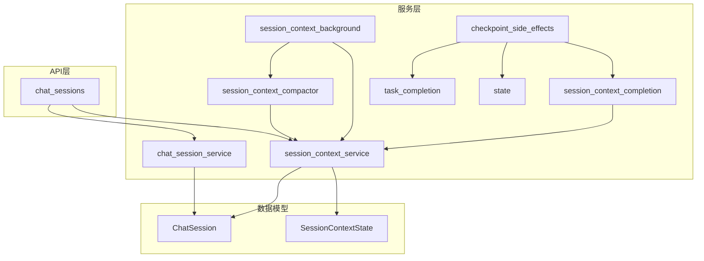
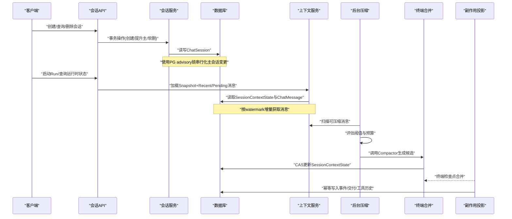
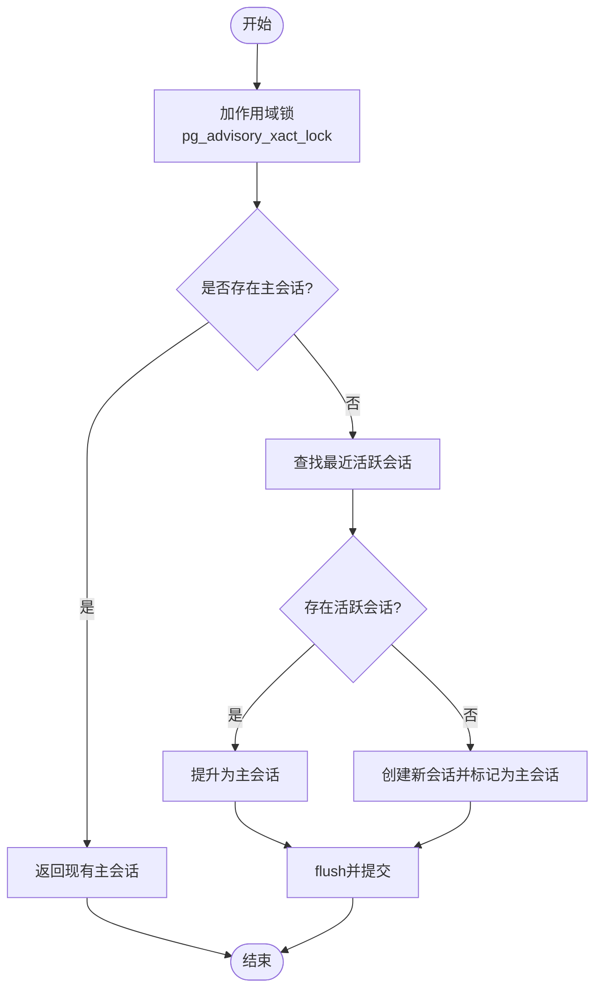
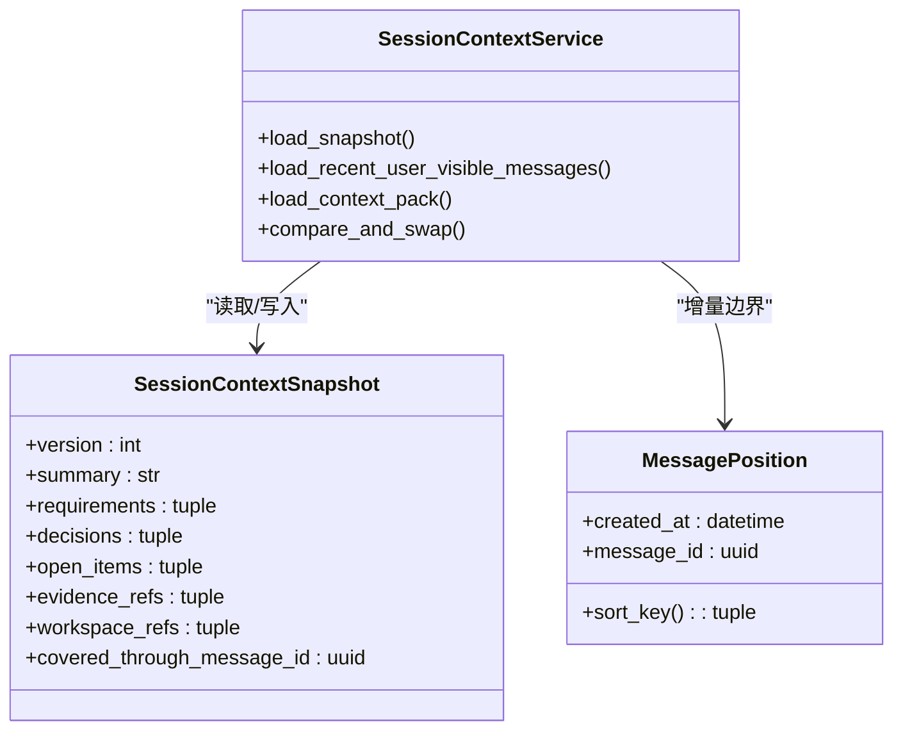
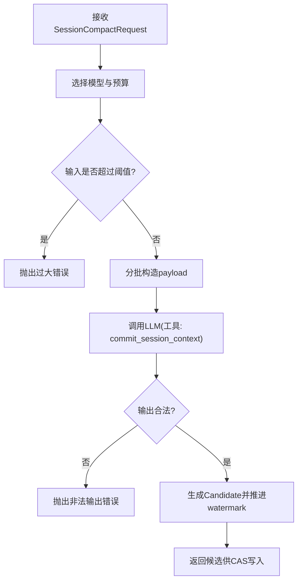
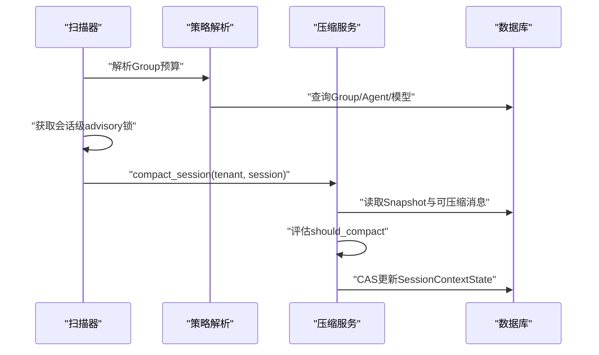
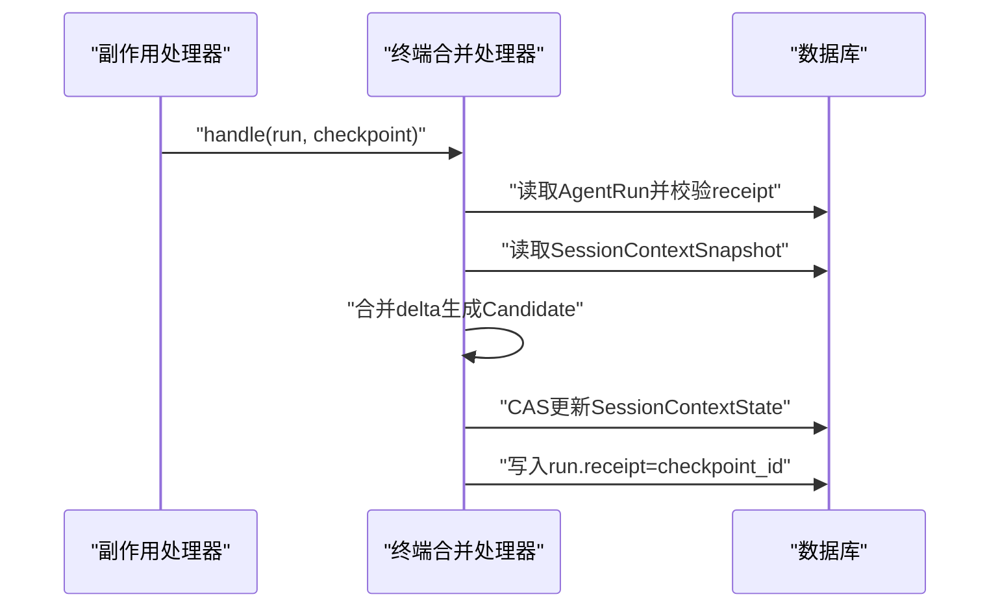
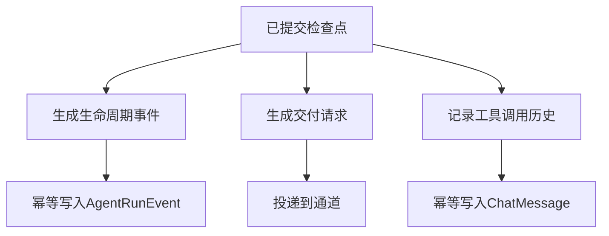
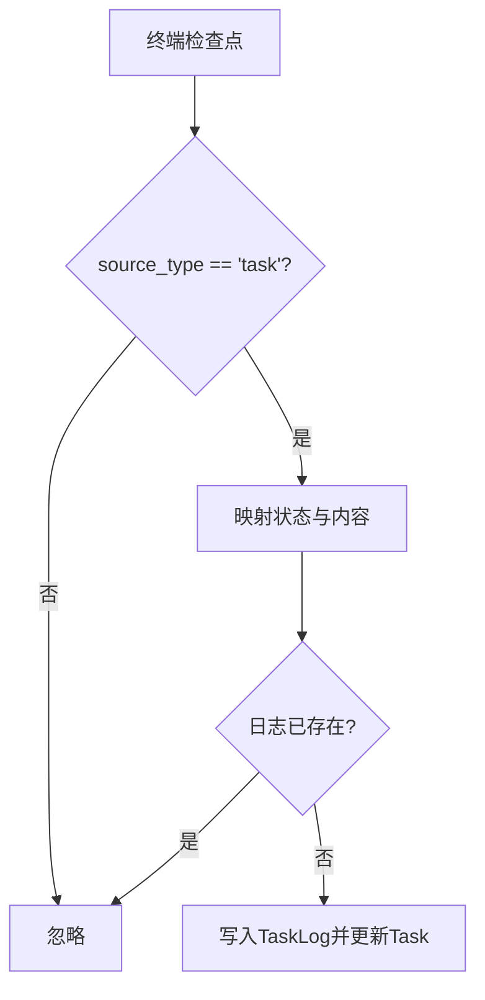
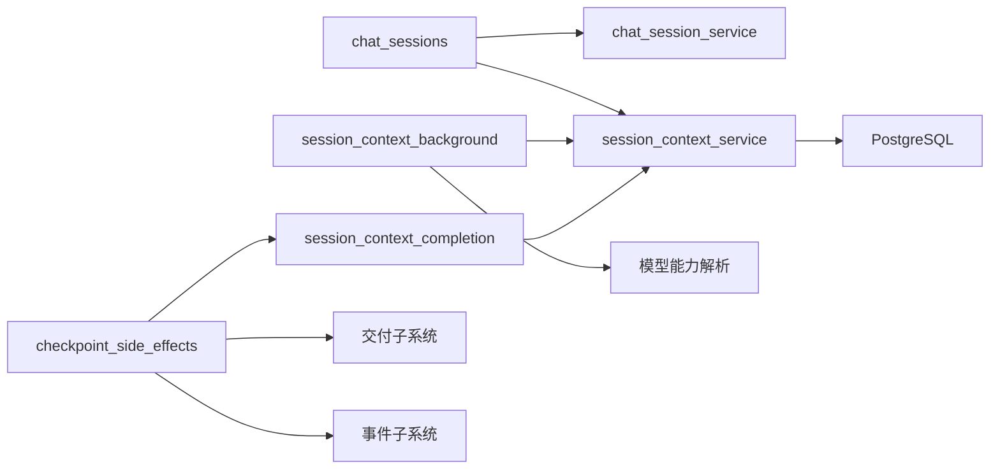

# 会话生命周期管理

<cite>
**本文引用的文件**   
- [chat_session.py](file://backend/app/models/chat_session.py)
- [session_context_state.py](file://backend/app/models/session_context_state.py)
- [chat_session_service.py](file://backend/app/services/chat_session_service.py)
- [session_context_service.py](file://backend/app/services/agent_runtime/session_context_service.py)
- [session_context_compactor.py](file://backend/app/services/agent_runtime/session_context_compactor.py)
- [session_context_background.py](file://backend/app/services/agent_runtime/session_context_background.py)
- [session_context_completion.py](file://backend/app/services/agent_runtime/session_context_completion.py)
- [state.py](file://backend/app/services/agent_runtime/state.py)
- [checkpoint_side_effects.py](file://backend/app/services/agent_runtime/checkpoint_side_effects.py)
- [task_completion.py](file://backend/app/services/agent_runtime/task_completion.py)
- [chat_sessions.py](file://backend/app/api/chat_sessions.py)
</cite>

## 目录
1. [引言](#引言)
2. [项目结构](#项目结构)
3. [核心组件](#核心组件)
4. [架构总览](#架构总览)
5. [详细组件分析](#详细组件分析)
6. [依赖关系分析](#依赖关系分析)
7. [性能考量](#性能考量)
8. [故障排查指南](#故障排查指南)
9. [结论](#结论)
10. [附录：API与最佳实践](#附录api与最佳实践)

## 引言
本技术文档围绕Clawith的“会话生命周期管理”展开，覆盖会话创建、初始化、运行、清理等全生命周期阶段；深入解析后台任务处理、上下文压缩（Session Context Compact）、完成回调机制；阐述会话状态转换、资源释放、异常恢复；并提供会话监控、性能分析与问题诊断方法，以及会话管理API与最佳实践。

## 项目结构
- 数据模型层
  - ChatSession：统一会话实体，支持direct/group/a2a/trigger类型，维护主会话标记、最后阅读时间、软删除等。
  - SessionContextState：会话级滚动摘要与乐观锁版本，持久化需求、决策、待办项、证据与工作区引用等。
- 服务层
  - chat_session_service：直接对话会话的事务性生命周期辅助（创建、提升为主会话、软删除与取消关联Run）。
  - session_context_service：会话上下文的读取与CAS写入，消息窗口与增量构建。
  - session_context_compactor：基于LLM的确定性上下文压缩，严格输出校验与预算控制。
  - session_context_background：面向公共群聊的后台压缩调度与扫描器。
  - session_context_completion：终端Run检查点的一次性合并，保证幂等与一致性。
  - checkpoint_side_effects：已提交检查点的副作用投影（事件、交付、工具历史等）。
  - task_completion：Task类Run的终端结果落库。
  - state：运行时图状态、生命周期枚举、节点路由、消息规范化等。
- API层
  - chat_sessions：租户隔离的直接对话会话管理端点（列表、创建、重命名、删除、运行时状态、工具执行对账等）。

图表来源 
- [chat_session.py:23-116](file://backend/app/models/chat_session.py#L23-L116)
- [session_context_state.py:25-101](file://backend/app/models/session_context_state.py#L25-L101)
- [chat_session_service.py:1-424](file://backend/app/services/chat_session_service.py#L1-L424)
- [session_context_service.py:1-800](file://backend/app/services/agent_runtime/session_context_service.py#L1-L800)
- [session_context_compactor.py:1-464](file://backend/app/services/agent_runtime/session_context_compactor.py#L1-L464)
- [session_context_background.py:1-502](file://backend/app/services/agent_runtime/session_context_background.py#L1-L502)
- [session_context_completion.py:1-310](file://backend/app/services/agent_runtime/session_context_completion.py#L1-L310)
- [checkpoint_side_effects.py:1-800](file://backend/app/services/agent_runtime/checkpoint_side_effects.py#L1-L800)
- [task_completion.py:1-169](file://backend/app/services/agent_runtime/task_completion.py#L1-L169)
- [state.py:1-216](file://backend/app/services/agent_runtime/state.py#L1-L216)
- [chat_sessions.py:1-800](file://backend/app/api/chat_sessions.py#L1-L800)

章节来源
- [chat_session.py:23-116](file://backend/app/models/chat_session.py#L23-L116)
- [session_context_state.py:25-101](file://backend/app/models/session_context_state.py#L25-L101)
- [chat_session_service.py:1-424](file://backend/app/services/chat_session_service.py#L1-L424)
- [session_context_service.py:1-800](file://backend/app/services/agent_runtime/session_context_service.py#L1-L800)
- [session_context_compactor.py:1-464](file://backend/app/services/agent_runtime/session_context_compactor.py#L1-L464)
- [session_context_background.py:1-502](file://backend/app/services/agent_runtime/session_context_background.py#L1-L502)
- [session_context_completion.py:1-310](file://backend/app/services/agent_runtime/session_context_completion.py#L1-L310)
- [checkpoint_side_effects.py:1-800](file://backend/app/services/agent_runtime/checkpoint_side_effects.py#L1-L800)
- [task_completion.py:1-169](file://backend/app/services/agent_runtime/task_completion.py#L1-L169)
- [state.py:1-216](file://backend/app/services/agent_runtime/state.py#L1-L216)
- [chat_sessions.py:1-800](file://backend/app/api/chat_sessions.py#L1-L800)

## 核心组件
- 会话模型与主会话策略
  - ChatSession通过is_primary标记主会话，配合索引与唯一约束保障租户/用户/代理维度的主会话唯一性与快速定位。
  - last_read_at_by_user用于未读计数推导；deleted_at实现软删除。
- 会话上下文快照与增量
  - SessionContextState以version与covered_through_message_id作为CAS键，确保并发安全更新。
  - session_context_service提供load_snapshot/load_recent_user_visible_messages/load_context_pack等方法，按watermark增量获取消息。
- 上下文压缩（Compact）
  - session_context_compactor使用固定工具commit_session_context强制LLM输出确定结构，结合预算计算与批处理，生成候选上下文。
  - session_context_background针对群聊场景进行后台扫描与触发，避免阻塞前台。
- 终端Run合并与幂等
  - session_context_completion从终端检查点提取delta，合并到会话上下文，并通过run记录receipt防止重复应用。
- 运行时副作用与交付
  - checkpoint_side_effects将已提交检查点投影为事件、交付请求、工具调用历史等，保证最终一致。
- 任务完成落库
  - task_completion根据终端检查点设置Task状态并追加日志，支持督办与普通任务。

章节来源
- [chat_session.py:23-116](file://backend/app/models/chat_session.py#L23-L116)
- [session_context_state.py:25-101](file://backend/app/models/session_context_state.py#L25-L101)
- [session_context_service.py:553-800](file://backend/app/services/agent_runtime/session_context_service.py#L553-L800)
- [session_context_compactor.py:266-464](file://backend/app/services/agent_runtime/session_context_compactor.py#L266-L464)
- [session_context_background.py:254-502](file://backend/app/services/agent_runtime/session_context_background.py#L254-L502)
- [session_context_completion.py:123-310](file://backend/app/services/agent_runtime/session_context_completion.py#L123-L310)
- [checkpoint_side_effects.py:554-800](file://backend/app/services/agent_runtime/checkpoint_side_effects.py#L554-L800)
- [task_completion.py:56-169](file://backend/app/services/agent_runtime/task_completion.py#L56-L169)

## 架构总览
下图展示会话生命周期关键路径：创建主会话、运行期上下文构建、后台压缩、终端合并、副作用投影与交付。

图表来源 
- [chat_sessions.py:358-395](file://backend/app/api/chat_sessions.py#L358-L395)
- [chat_session_service.py:136-211](file://backend/app/services/chat_session_service.py#L136-L211)
- [session_context_service.py:677-721](file://backend/app/services/agent_runtime/session_context_service.py#L677-L721)
- [session_context_background.py:397-477](file://backend/app/services/agent_runtime/session_context_background.py#L397-L477)
- [session_context_compactor.py:437-457](file://backend/app/services/agent_runtime/session_context_compactor.py#L437-L457)
- [session_context_completion.py:269-301](file://backend/app/services/agent_runtime/session_context_completion.py#L269-L301)
- [checkpoint_side_effects.py:654-800](file://backend/app/services/agent_runtime/checkpoint_side_effects.py#L654-L800)

## 详细组件分析

### 会话创建与主会话策略
- 创建流程
  - 通过API创建会话，服务层在事务内锁定作用域，查找是否已有活跃会话，若存在则提升为主会话，否则新建并标记为主会话。
  - 使用PG advisory_xact_lock序列化同一tenant/agent/user作用域的变更，避免竞态。
- 主会话修复
  - 软删除当前主会话时，自动选择最近活跃会话提升为新主会话，保证前端始终有可用主会话。
- 取消关联Run
  - 删除会话时，递归查找foreground/orchestration根Run及其delegated子Run，批量入队取消，确保资源释放。

图表来源 
- [chat_session_service.py:136-211](file://backend/app/services/chat_session_service.py#L136-L211)
- [chat_session_service.py:271-323](file://backend/app/services/chat_session_service.py#L271-L323)

章节来源
- [chat_session_service.py:41-86](file://backend/app/services/chat_session_service.py#L41-L86)
- [chat_session_service.py:136-211](file://backend/app/services/chat_session_service.py#L136-L211)
- [chat_session_service.py:271-323](file://backend/app/services/chat_session_service.py#L271-L323)

### 会话上下文构建与增量
- 快照与窗口
  - load_snapshot读取最新SessionContextState；load_recent_user_visible_messages取最近N条可见消息；load_context_pack按watermark拼接pending与recent。
- 位置与排序
  - MessagePosition以created_at与message_id构成稳定排序键，避免UUID无序导致的歧义。
- 增量与重建
  - 当snapshot.version>0且watermark落后于cutoff或状态被更新后，需要重建pack，保证一致性。

图表来源 
- [session_context_service.py:553-800](file://backend/app/services/agent_runtime/session_context_service.py#L553-L800)
- [session_context_service.py:51-88](file://backend/app/services/agent_runtime/session_context_service.py#L51-L88)

章节来源
- [session_context_service.py:553-800](file://backend/app/services/agent_runtime/session_context_service.py#L553-L800)
- [session_context_service.py:51-88](file://backend/app/services/agent_runtime/session_context_service.py#L51-L88)

### 上下文压缩（Compact）
- 模型选择与预算
  - 根据会话类型与Agent模型能力计算compact_threshold，限制输入大小与输出token上限。
- 批处理与水印
  - 将消息分批送入LLM，要求必须调用commit_session_context一次，输出字段严格校验；watermark推进至批次最后一条消息ID。
- 错误与回退
  - 任何非法输出或模型配置错误都会抛出明确错误码，不修改既有上下文，保持前次快照有效。

图表来源 
- [session_context_compactor.py:340-457](file://backend/app/services/agent_runtime/session_context_compactor.py#L340-L457)

章节来源
- [session_context_compactor.py:266-464](file://backend/app/services/agent_runtime/session_context_compactor.py#L266-L464)

### 后台压缩调度（群聊）
- 策略解析
  - 解析Group成员Agent的有效模型，取最小threshold作为共享预算；若无可用模型则回退到多Agent专用compact模型。
- 扫描与锁定
  - 扫描活跃群会话，按会话ID哈希获取PG advisory锁，避免并发重复压缩；冲突重试有限次数。
- 触发条件
  - 旧消息数量达到阈值或估计token数超过阈值即触发压缩。

图表来源 
- [session_context_background.py:97-220](file://backend/app/services/agent_runtime/session_context_background.py#L97-L220)
- [session_context_background.py:397-477](file://backend/app/services/agent_runtime/session_context_background.py#L397-L477)

章节来源
- [session_context_background.py:97-220](file://backend/app/services/agent_runtime/session_context_background.py#L97-L220)
- [session_context_background.py:397-477](file://backend/app/services/agent_runtime/session_context_background.py#L397-L477)

### 终端Run合并与幂等
- 检查点提取
  - 仅当run.thread_id==session_id（Direct Chat）时跳过合并；其他Run类型可从lifecycle.session_context_delta提取结构化增量。
- 幂等保证
  - 通过AgentRun.session_context_applied_checkpoint_id记录已应用的checkpoint_id，重复检查点直接忽略。
- CAS写入
  - 合并时校验snapshot版本与watermark不变，再执行compare_and_swap，失败则重试。

图表来源 
- [session_context_completion.py:123-310](file://backend/app/services/agent_runtime/session_context_completion.py#L123-L310)

章节来源
- [session_context_completion.py:123-310](file://backend/app/services/agent_runtime/session_context_completion.py#L123-L310)

### 运行时副作用与交付
- 事件投影
  - 将Runtime消息转换为Web Chat活动事件（思考、进度、工具调用），并持久化为AgentRunEvent，具备幂等键。
- 交付请求
  - 根据checkpoint状态生成waiting或terminal交付请求，驱动下游通道投递。
- 工具历史
  - 对Direct Chat的工具调用结果持久化为ChatMessage，便于刷新与断线重连恢复。

图表来源 
- [checkpoint_side_effects.py:271-386](file://backend/app/services/agent_runtime/checkpoint_side_effects.py#L271-L386)
- [checkpoint_side_effects.py:388-456](file://backend/app/services/agent_runtime/checkpoint_side_effects.py#L388-L456)
- [checkpoint_side_effects.py:654-800](file://backend/app/services/agent_runtime/checkpoint_side_effects.py#L654-L800)

章节来源
- [checkpoint_side_effects.py:271-386](file://backend/app/services/agent_runtime/checkpoint_side_effects.py#L271-L386)
- [checkpoint_side_effects.py:388-456](file://backend/app/services/agent_runtime/checkpoint_side_effects.py#L388-L456)
- [checkpoint_side_effects.py:654-800](file://backend/app/services/agent_runtime/checkpoint_side_effects.py#L654-L800)

### 任务完成落库
- 终端状态映射
  - completed→done（普通任务）或pending（督办），failed/cancelled→pending并记录原因。
- 幂等日志
  - 基于run_id与checkpoint_id生成TaskLog ID，避免重复写入。

图表来源 
- [task_completion.py:56-169](file://backend/app/services/agent_runtime/task_completion.py#L56-L169)

章节来源
- [task_completion.py:56-169](file://backend/app/services/agent_runtime/task_completion.py#L56-L169)

## 依赖关系分析
- 模块耦合
  - API层依赖会话服务与上下文服务；上下文服务依赖数据库模型；后台压缩依赖上下文服务与LLM能力解析；终端合并依赖运行时工厂与上下文服务；副作用处理器依赖事件与交付子系统。
- 外部依赖
  - PostgreSQL advisory锁用于并发控制；LangGraph检查点用于运行时状态；LLM模型能力解析用于预算与阈值计算。
- 潜在循环
  - 各服务间通过协议接口解耦，未发现直接循环导入；通过RuntimeSessionFactory与Protocol降低耦合。

图表来源 
- [chat_sessions.py:1-800](file://backend/app/api/chat_sessions.py#L1-L800)
- [session_context_service.py:1-800](file://backend/app/services/agent_runtime/session_context_service.py#L1-L800)
- [session_context_background.py:1-502](file://backend/app/services/agent_runtime/session_context_background.py#L1-L502)
- [session_context_completion.py:1-310](file://backend/app/services/agent_runtime/session_context_completion.py#L1-L310)
- [checkpoint_side_effects.py:1-800](file://backend/app/services/agent_runtime/checkpoint_side_effects.py#L1-L800)

章节来源
- [chat_sessions.py:1-800](file://backend/app/api/chat_sessions.py#L1-L800)
- [session_context_service.py:1-800](file://backend/app/services/agent_runtime/session_context_service.py#L1-L800)
- [session_context_background.py:1-502](file://backend/app/services/agent_runtime/session_context_background.py#L1-L502)
- [session_context_completion.py:1-310](file://backend/app/services/agent_runtime/session_context_completion.py#L1-L310)
- [checkpoint_side_effects.py:1-800](file://backend/app/services/agent_runtime/checkpoint_side_effects.py#L1-L800)

## 性能考量
- 数据库层面
  - 使用PG advisory锁串行化主会话变更，避免热点行竞争；会话与上下文表建立必要索引（tenant_id、group_id、updated_at等）。
- 上下文压缩
  - 通过预算与阈值控制减少LLM调用频率；消息分批与watermark推进避免重复处理；群聊后台扫描批量处理，避免阻塞。
- 运行时状态
  - 使用Reducer-backed消息通道与规范化适配器，降低序列化开销；终端合并采用CAS与幂等键，避免重复写入。
- 监控建议
  - 统计会话创建/删除速率、主会话切换次数、压缩触发率、平均token消耗、检查点合并成功率与重试次数。

[本节为通用指导，无需特定文件来源]

## 故障排查指南
- 常见错误码与含义
  - session_context_unavailable：会话不存在或已被删除。
  - session_compact_model_unavailable：Agent无可用模型或配置错误。
  - invalid_session_compact_output：压缩输出不符合契约。
  - session_context_conflict：CAS冲突，需重试。
  - command_scope_mismatch / checkpoint_identity_mismatch：命令或检查点归属不一致。
- 定位步骤
  - 查看AgentRunEvent事件序列，确认状态流转与错误码。
  - 检查SessionContextState版本与watermark是否一致。
  - 核对PG advisory锁持有情况与锁超时。
  - 审查LLM模型能力与预算配置。
- 恢复策略
  - 对于CAS冲突，自动重试；对于模型不可用，回退到备用模型或提示配置修复；对于检查点缺失，等待下次检查点或回滚到上一快照。

章节来源
- [session_context_service.py:33-49](file://backend/app/services/agent_runtime/session_context_service.py#L33-L49)
- [session_context_compactor.py:84-90](file://backend/app/services/agent_runtime/session_context_compactor.py#L84-L90)
- [session_context_background.py:50-61](file://backend/app/services/agent_runtime/session_context_background.py#L50-L61)
- [checkpoint_side_effects.py:44-52](file://backend/app/services/agent_runtime/checkpoint_side_effects.py#L44-L52)

## 结论
Clawith的会话生命周期管理通过清晰的模型设计、严格的上下文压缩契约、幂等的终端合并与副作用投影，实现了高可靠、可扩展的会话系统。借助PG锁、CAS与watermark机制，系统在并发与一致性之间取得平衡；后台压缩与预算控制保障了性能与成本可控。建议在部署中完善监控指标与告警规则，持续优化阈值与模型选择策略。

[本节为总结性内容，无需特定文件来源]

## 附录：API与最佳实践
- 会话管理API
  - 列表会话：GET /api/agents/{agent_id}/sessions?scope=mine|all
  - 创建会话：POST /api/agents/{agent_id}/sessions
  - 重命名会话：PATCH /api/agents/{agent_id}/sessions/{session_id}
  - 删除会话：DELETE /api/agents/{agent_id}/sessions/{session_id}
  - 运行时状态：GET /api/agents/{agent_id}/sessions/{session_id}/runtime-state
  - 工具执行对账：POST /api/agents/{agent_id}/sessions/{session_id}/runs/{run_id}/tool-executions/{execution_id}/reconcile
- 最佳实践
  - 主会话策略：优先复用已有活跃会话，必要时提升为主会话，避免频繁创建。
  - 上下文压缩：合理设置消息阈值与token预算，避免过度压缩导致信息丢失。
  - 幂等与重试：所有写操作应支持幂等键与重试，尤其是终端合并与事件写入。
  - 监控与诊断：关注会话状态机、压缩触发率、模型调用耗时与错误码分布。
  - 资源释放：删除会话时确保取消关联Run，避免僵尸线程占用资源。

章节来源
- [chat_sessions.py:216-395](file://backend/app/api/chat_sessions.py#L216-L395)
- [chat_sessions.py:397-560](file://backend/app/api/chat_sessions.py#L397-L560)
- [chat_sessions.py:670-731](file://backend/app/api/chat_sessions.py#L670-L731)