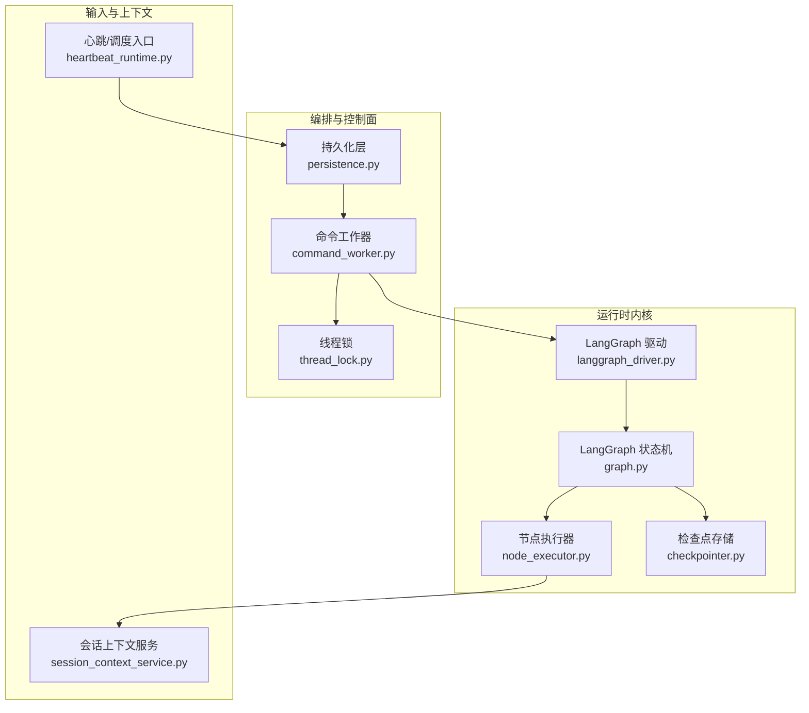
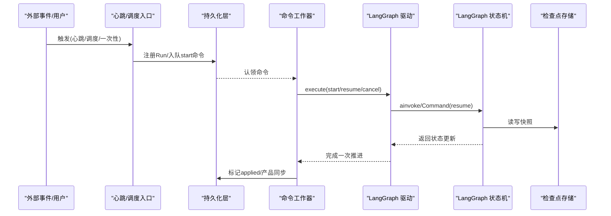
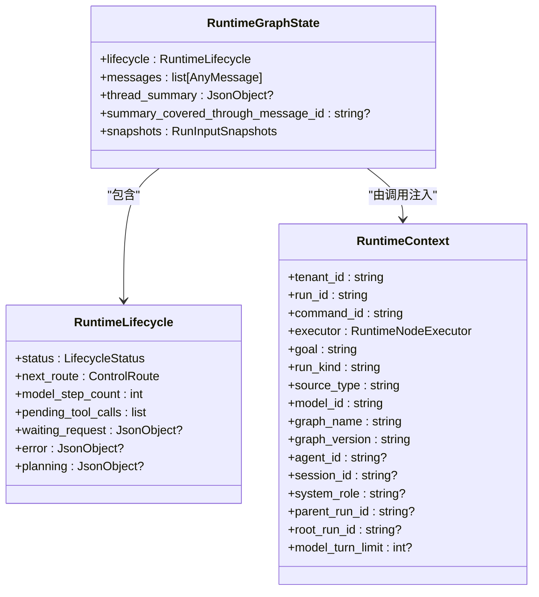
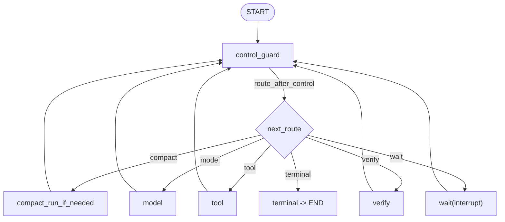
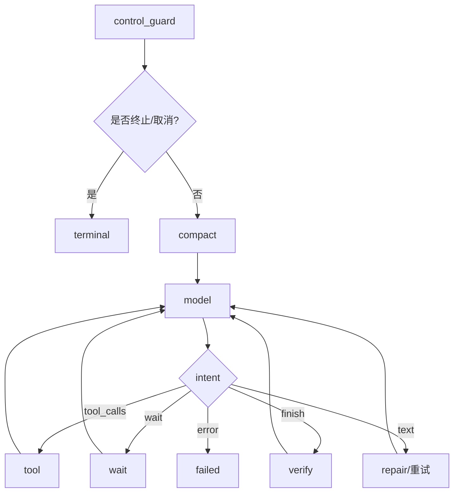
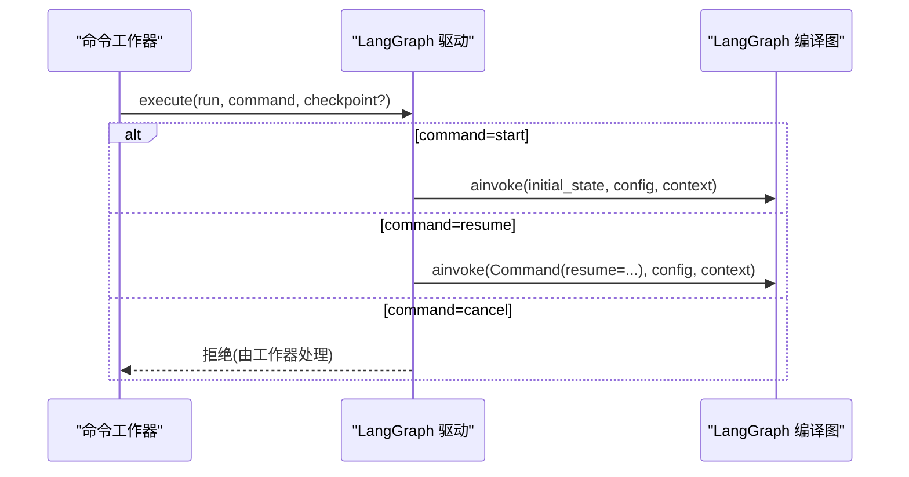
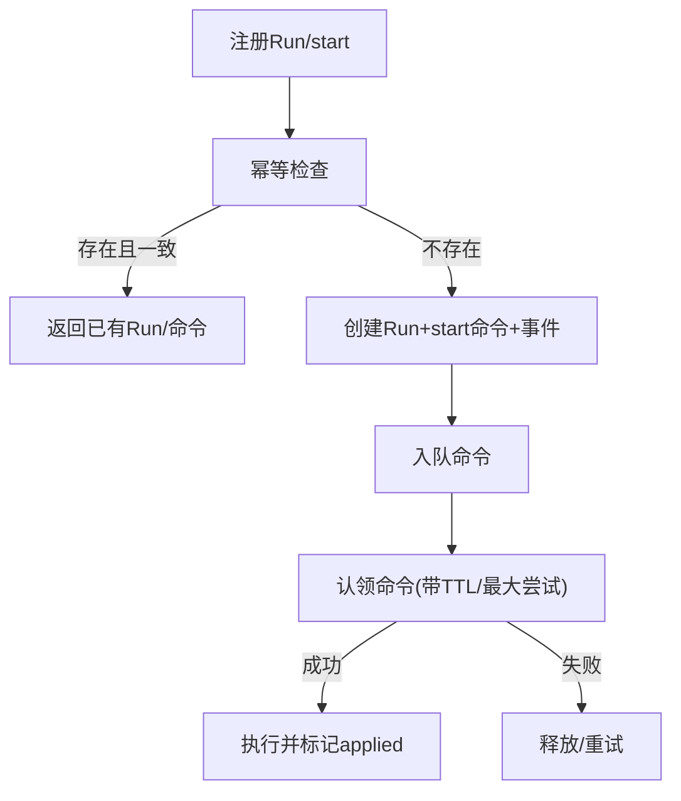
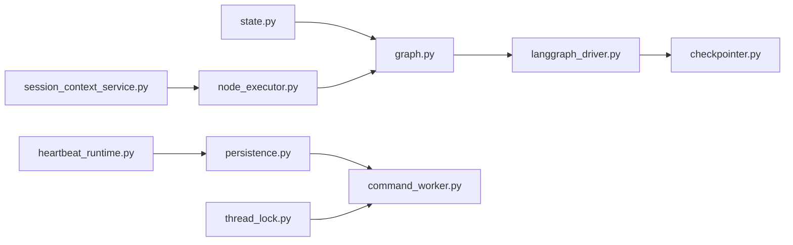

# 会话运行生命周期

<cite>
**本文引用的文件**
- [state.py](file://backend/app/services/agent_runtime/state.py)
- [graph.py](file://backend/app/services/agent_runtime/graph.py)
- [node_executor.py](file://backend/app/services/agent_runtime/node_executor.py)
- [langgraph_driver.py](file://backend/app/services/agent_runtime/langgraph_driver.py)
- [checkpointer.py](file://backend/app/services/agent_runtime/checkpointer.py)
- [command_worker.py](file://backend/app/services/agent_runtime/command_worker.py)
- [persistence.py](file://backend/app/services/agent_runtime/persistence.py)
- [thread_lock.py](file://backend/app/services/agent_runtime/thread_lock.py)
- [heartbeat_runtime.py](file://backend/app/services/agent_runtime/heartbeat_runtime.py)
- [session_context_service.py](file://backend/app/services/agent_runtime/session_context_service.py)
</cite>

## 目录
1. [引言](#引言)
2. [项目结构](#项目结构)
3. [核心组件](#核心组件)
4. [架构总览](#架构总览)
5. [详细组件分析](#详细组件分析)
6. [依赖关系分析](#依赖关系分析)
7. [性能与可伸缩性](#性能与可伸缩性)
8. [故障排查指南](#故障排查指南)
9. [结论](#结论)
10. [附录：监控指标与排障清单](#附录监控指标与排障清单)

## 引言
本文件面向Clawith的“会话运行生命周期”，系统性阐述会话在运行期间的状态转换、消息处理流程、上下文维护机制，以及LangGraph状态机的执行逻辑、节点调度策略、异步任务管理。文档还覆盖心跳触发、超时与重试、资源监控、运行状态持久化、异常恢复策略与性能优化技巧，并提供监控指标与故障排查指南，帮助读者从高层到代码级全面理解系统行为。

## 项目结构
后端以“Agent Runtime”为核心，围绕LangGraph构建确定性的会话图（StateGraph），通过命令工作器（Command Worker）驱动，结合PostgreSQL持久化与检查点存储，实现高可靠、可恢复、可观测的会话执行。关键模块包括：
- 状态与上下文契约：定义运行时状态、生命周期、消息格式与上下文对象
- 图与节点：定义控制流、节点路由、等待与终止语义
- 驱动与检查点：封装LangGraph调用、配置、序列化与加密
- 命令工作器：认领命令、读取检查点、分类状态、执行与结算
- 持久化层：注册Run、入队命令、幂等与并发控制
- 线程锁：基于PostgreSQL advisory lock保证单线程串行
- 心跳与一次性任务：后台任务的统一入口
- 会话上下文服务：会话级摘要与增量消息窗口

**图表来源**
- [graph.py:241-292](file://backend/app/services/agent_runtime/graph.py#L241-L292)
- [node_executor.py:469-800](file://backend/app/services/agent_runtime/node_executor.py#L469-L800)
- [langgraph_driver.py:323-491](file://backend/app/services/agent_runtime/langgraph_driver.py#L323-L491)
- [checkpointer.py:169-178](file://backend/app/services/agent_runtime/checkpointer.py#L169-L178)
- [command_worker.py:312-800](file://backend/app/services/agent_runtime/command_worker.py#L312-L800)
- [persistence.py:321-522](file://backend/app/services/agent_runtime/persistence.py#L321-L522)
- [thread_lock.py:60-89](file://backend/app/services/agent_runtime/thread_lock.py#L60-L89)
- [heartbeat_runtime.py:81-131](file://backend/app/services/agent_runtime/heartbeat_runtime.py#L81-L131)
- [session_context_service.py:553-800](file://backend/app/services/agent_runtime/session_context_service.py#L553-L800)

**章节来源**
- [graph.py:241-292](file://backend/app/services/agent_runtime/graph.py#L241-L292)
- [command_worker.py:312-800](file://backend/app/services/agent_runtime/command_worker.py#L312-L800)
- [persistence.py:321-522](file://backend/app/services/agent_runtime/persistence.py#L321-L522)

## 核心组件
- 状态与上下文契约
  - 运行时状态包含消息历史、生命周期、摘要与水印；生命周期字段承载状态机当前状态、下一步路由、计数与中间结果
  - 运行时上下文为每次调用注入的不可检查点化的依赖与作用域
- LangGraph 图与节点
  - 控制守卫、压缩、模型、工具、验证、等待、终止等节点构成确定性控制流
  - 路由仅依据检查点中的权威生命周期值
- 驱动与检查点
  - 驱动负责根据命令类型（start/resume/cancel）选择分支，构造初始状态或注入resume值
  - 检查点使用专用PostgreSQL schema，支持JSON+与可选AES加密
- 命令工作器
  - 认领命令、加载Run、读取检查点、分类状态、执行并标记已应用，必要时进行产品侧同步
- 持久化层
  - Run注册与命令入队具备幂等性与严格校验；支持队列槽位与顺序约束
- 线程锁
  - 基于PostgreSQL advisory lock确保同一Thread在同一时刻仅被一个worker推进
- 心跳与一次性任务
  - 将心跳/调度/一次性任务统一转换为Runtime v2命令，进入相同执行流水线
- 会话上下文服务
  - 提供会话级摘要快照与最近消息窗口，支持版本与水印CAS更新

**章节来源**
- [state.py:100-144](file://backend/app/services/agent_runtime/state.py#L100-L144)
- [state.py:194-216](file://backend/app/services/agent_runtime/state.py#L194-L216)
- [graph.py:241-292](file://backend/app/services/agent_runtime/graph.py#L241-L292)
- [checkpointer.py:138-178](file://backend/app/services/agent_runtime/checkpointer.py#L138-L178)
- [command_worker.py:312-800](file://backend/app/services/agent_runtime/command_worker.py#L312-L800)
- [persistence.py:321-522](file://backend/app/services/agent_runtime/persistence.py#L321-L522)
- [thread_lock.py:60-89](file://backend/app/services/agent_runtime/thread_lock.py#L60-L89)
- [heartbeat_runtime.py:81-131](file://backend/app/services/agent_runtime/heartbeat_runtime.py#L81-L131)
- [session_context_service.py:553-800](file://backend/app/services/agent_runtime/session_context_service.py#L553-L800)

## 架构总览
下图展示从外部事件到LangGraph执行的端到端路径，以及检查点与命令工作器的协作关系。

**图表来源**
- [heartbeat_runtime.py:81-131](file://backend/app/services/agent_runtime/heartbeat_runtime.py#L81-L131)
- [persistence.py:321-522](file://backend/app/services/agent_runtime/persistence.py#L321-L522)
- [command_worker.py:312-800](file://backend/app/services/agent_runtime/command_worker.py#L312-L800)
- [langgraph_driver.py:395-491](file://backend/app/services/agent_runtime/langgraph_driver.py#L395-L491)
- [graph.py:241-292](file://backend/app/services/agent_runtime/graph.py#L241-L292)
- [checkpointer.py:169-178](file://backend/app/services/agent_runtime/checkpointer.py#L169-L178)

## 详细组件分析

### 状态与上下文契约
- 运行时状态（RuntimeGraphState）
  - 包含消息通道（reducer-backed）、摘要与水印、以及权威的生命周期字典
  - 生命周期字段涵盖状态、下一步路由、计数、待处理工具调用、等待请求、错误与计划等
- 运行时上下文（RuntimeContext）
  - 携带租户、Run、命令、模型、图身份、角色、父/根Run、限制等，不进入检查点
- 消息规范化
  - 统一将LangChain消息转为OpenAI兼容结构，保留id与扩展字段

**图表来源**
- [state.py:100-144](file://backend/app/services/agent_runtime/state.py#L100-L144)
- [state.py:194-216](file://backend/app/services/agent_runtime/state.py#L194-L216)

**章节来源**
- [state.py:100-144](file://backend/app/services/agent_runtime/state.py#L100-L144)
- [state.py:194-216](file://backend/app/services/agent_runtime/state.py#L194-L216)

### LangGraph 状态机与节点调度
- 节点集合：control_guard、compact、model、tool、verify、wait、terminal
- 路由规则：仅依据checkpoint中lifecycle.next_route与status组合判定，非法组合抛出契约错误
- 重试策略：compact与tool节点分别配置重试策略，仅对特定错误重试
- 等待语义：wait节点通过interrupt挂起，resume时注入resume_value继续执行

**图表来源**
- [graph.py:241-292](file://backend/app/services/agent_runtime/graph.py#L241-L292)

**章节来源**
- [graph.py:241-292](file://backend/app/services/agent_runtime/graph.py#L241-L292)

### 节点执行器与确定性过渡
- control_guard：检查终止态与取消信号，若取消则抛出取消信号
- compact：仅在running状态下执行，失败时按确定性错误码落盘failed
- model：调用业务模型，根据intent分流至tool/wait/finish/text/error，含协议修复与上限保护
- tool：执行待处理工具调用，支持批量与回执
- verify：对finish候选进行确定性校验（默认回退校验器）
- terminal：保持终态不变，结束图执行

**图表来源**
- [node_executor.py:469-800](file://backend/app/services/agent_runtime/node_executor.py#L469-L800)

**章节来源**
- [node_executor.py:469-800](file://backend/app/services/agent_runtime/node_executor.py#L469-L800)

### LangGraph 驱动与命令分发
- start：捕获输入快照，构造初始状态，设置初始lifecycle与next_route
- resume：校验waiting状态与correlation_id，注入Command(resume=...)继续
- cancel：禁止直接写入新检查点，交由工作器在控制面标记applied
- 读检查点：按run_id与command_id精确匹配，避免“最新”歧义

**图表来源**
- [langgraph_driver.py:395-491](file://backend/app/services/agent_runtime/langgraph_driver.py#L395-L491)

**章节来源**
- [langgraph_driver.py:395-491](file://backend/app/services/agent_runtime/langgraph_driver.py#L395-L491)

### 检查点与持久化
- 检查点配置：强制search_path隔离schema，支持AES加密序列化
- 运行注册：幂等注册Run与start命令，校验字段与约束
- 命令入队：幂等入队resume/cancel，严格payload一致性校验
- 认领与尝试：带TTL与最大尝试次数，支持start lane抢占与顺序约束

**图表来源**
- [checkpointer.py:138-178](file://backend/app/services/agent_runtime/checkpointer.py#L138-L178)
- [persistence.py:321-522](file://backend/app/services/agent_runtime/persistence.py#L321-L522)
- [persistence.py:635-674](file://backend/app/services/agent_runtime/persistence.py#L635-L674)

**章节来源**
- [checkpointer.py:138-178](file://backend/app/services/agent_runtime/checkpointer.py#L138-L178)
- [persistence.py:321-522](file://backend/app/services/agent_runtime/persistence.py#L321-L522)
- [persistence.py:635-674](file://backend/app/services/agent_runtime/persistence.py#L635-L674)

### 线程锁与会话并发控制
- 基于PostgreSQL advisory lock，按thread_id派生稳定bigint键
- 同一thread仅允许一个连接持有锁，确保检查点读写与invoke串行
- 未获取锁或释放失败均抛出自定义异常，便于上层重试与告警

**章节来源**
- [thread_lock.py:60-89](file://backend/app/services/agent_runtime/thread_lock.py#L60-L89)

### 心跳与一次性任务
- 统一入口将心跳/调度/一次性任务转换为Runtime v2命令
- 生成稳定的source_execution_id与idempotency_key，避免重复执行
- 将instruction/prompt等归一化为goal与payload，进入标准执行流

**章节来源**
- [heartbeat_runtime.py:81-131](file://backend/app/services/agent_runtime/heartbeat_runtime.py#L81-L131)

### 会话上下文服务
- 提供会话级摘要快照（version、summary、requirements/decisions/open_items/evidence_refs/workspace_refs、covered_through_message_id）
- 支持增量消息窗口与watermark定位，保证一致性重建
- 支持group会话的cutoff定位与重建判断

**章节来源**
- [session_context_service.py:553-800](file://backend/app/services/agent_runtime/session_context_service.py#L553-L800)

## 依赖关系分析
- 低耦合接口
  - RuntimeNodeExecutor、RuntimeModelStepService、RuntimeToolStepService、RuntimeVerifier、RuntimeFinalizer等Protocol解耦具体实现
- 图与驱动分离
  - graph.py仅定义拓扑与路由；driver负责配置与调用
- 检查点与数据库
  - checkpointer.py屏蔽序列化与加密细节；persistence.py专注事务与幂等
- 工作器编排
  - command_worker.py串联认领、分类、执行、结算与产品同步

**图表来源**
- [state.py:100-144](file://backend/app/services/agent_runtime/state.py#L100-L144)
- [graph.py:241-292](file://backend/app/services/agent_runtime/graph.py#L241-L292)
- [langgraph_driver.py:323-491](file://backend/app/services/agent_runtime/langgraph_driver.py#L323-L491)
- [checkpointer.py:169-178](file://backend/app/services/agent_runtime/checkpointer.py#L169-L178)
- [node_executor.py:469-800](file://backend/app/services/agent_runtime/node_executor.py#L469-L800)
- [persistence.py:321-522](file://backend/app/services/agent_runtime/persistence.py#L321-L522)
- [thread_lock.py:60-89](file://backend/app/services/agent_runtime/thread_lock.py#L60-L89)
- [heartbeat_runtime.py:81-131](file://backend/app/services/agent_runtime/heartbeat_runtime.py#L81-L131)
- [session_context_service.py:553-800](file://backend/app/services/agent_runtime/session_context_service.py#L553-L800)

**章节来源**
- [graph.py:241-292](file://backend/app/services/agent_runtime/graph.py#L241-L292)
- [command_worker.py:312-800](file://backend/app/services/agent_runtime/command_worker.py#L312-L800)

## 性能与可伸缩性
- 检查点与序列化
  - JSON+序列化与可选AES加密，建议在生产环境启用加密并确保密钥长度合规
  - 独立schema与search_path隔离，避免跨库干扰
- 重试与限流
  - compact与tool节点分别配置重试策略，仅对可重试错误重试，避免放大副作用
  - model_turn_limit防止无限循环，超限即失败
- 并发与锁
  - PostgreSQL advisory lock保证单thread串行，减少竞争与死锁风险
  - 命令认领带TTL与最大尝试次数，避免僵尸任务
- 上下文与消息
  - 会话上下文快照+最近消息窗口，降低长对话上下文膨胀
  - 压缩仅在running前执行，避免频繁IO

[本节为通用指导，无需源码引用]

## 故障排查指南
- 常见错误与定位
  - 检查点不一致：values/next/tasks/interrupts不一致，需回滚到稳定检查点
  - 命令作用域不匹配：tenant/run/command ID不一致，检查入队与认领链路
  - 等待状态resume不匹配：correlation_id或payload类型不符，核对上游事件
  - 模型协议修复超限：write_file或空输出等修复达到上限，需调整模型或提示词
  - 线程锁冲突：另一worker持有锁，稍后重试或扩容worker
- 诊断步骤
  - 查看命令状态与applied_checkpoint_id，确认是否已应用
  - 读取对应run_id的检查点历史，观察lifecycle.status与next_route
  - 检查会话上下文snapshot.version与covered_through_message_id是否漂移
  - 核对心跳/调度source_execution_id与幂等key是否重复

**章节来源**
- [command_worker.py:150-184](file://backend/app/services/agent_runtime/command_worker.py#L150-L184)
- [langgraph_driver.py:216-256](file://backend/app/services/agent_runtime/langgraph_driver.py#L216-L256)
- [node_executor.py:276-308](file://backend/app/services/agent_runtime/node_executor.py#L276-L308)
- [thread_lock.py:18-38](file://backend/app/services/agent_runtime/thread_lock.py#L18-L38)

## 结论
Clawith的会话运行生命周期以LangGraph为核心，结合命令工作器、检查点与幂等持久化，实现了强一致、可恢复、可观测的会话执行。通过严格的契约校验、确定性路由与细粒度重试策略，系统在复杂交互与长时间运行场景下保持稳定。配合会话上下文服务与心跳入口，能够高效支撑多源触发与大规模并发。

[本节为总结，无需源码引用]

## 附录：监控指标与排障清单
- 关键指标
  - 命令认领成功率、重试次数、最大尝试次数命中次数
  - 检查点读写延迟、序列化大小、加密开关状态
  - 节点执行耗时分布（compact/model/tool/verify/wait/terminal）
  - model_turn_limit命中率、协议修复次数与类型分布
  - 会话上下文snapshot版本漂移率、recent消息窗口大小
- 排障清单
  - 确认source_execution_id与idempotency_key唯一性
  - 核对waiting_request.correlation_id与resume payload一致性
  - 检查线程锁持有者与锁释放日志
  - 审查product_sync_pending标记是否清理
  - 评估模型turn限制与提示词质量，减少协议修复

[本节为通用指导，无需源码引用]