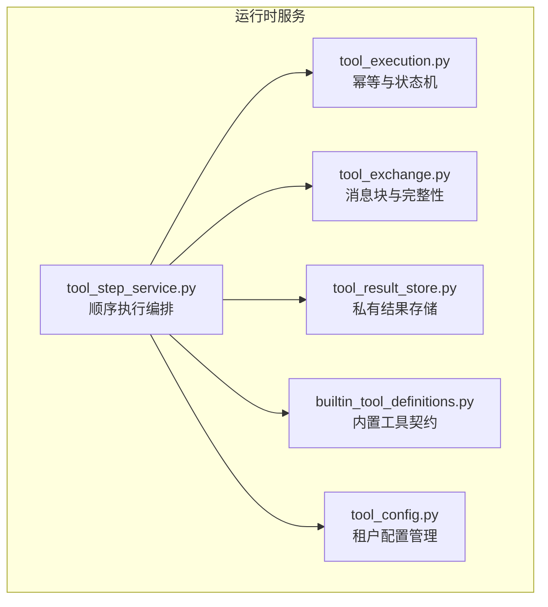
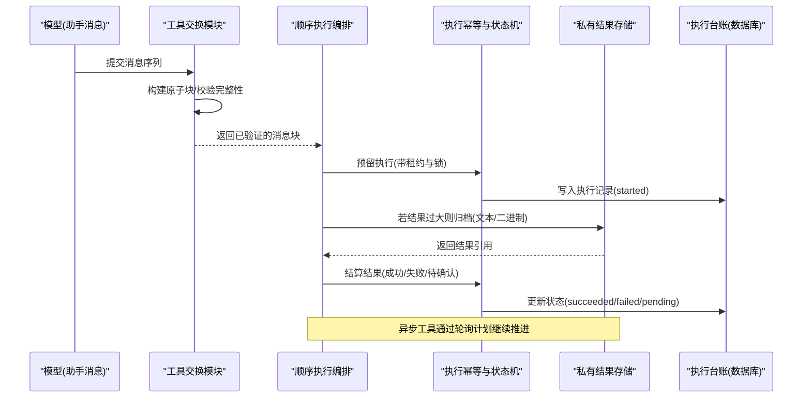
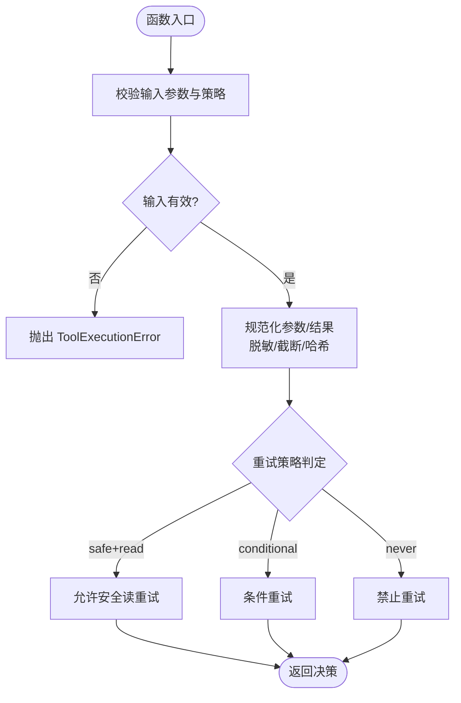
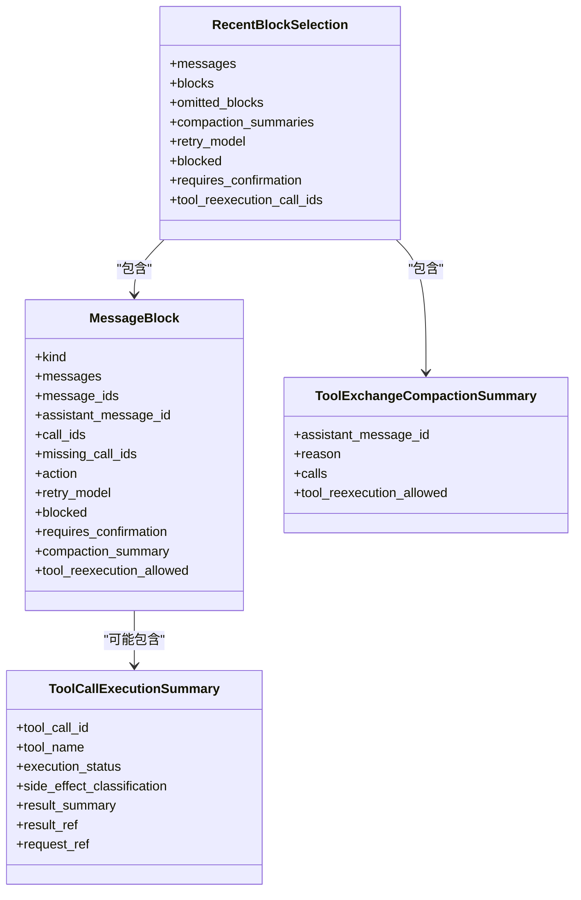
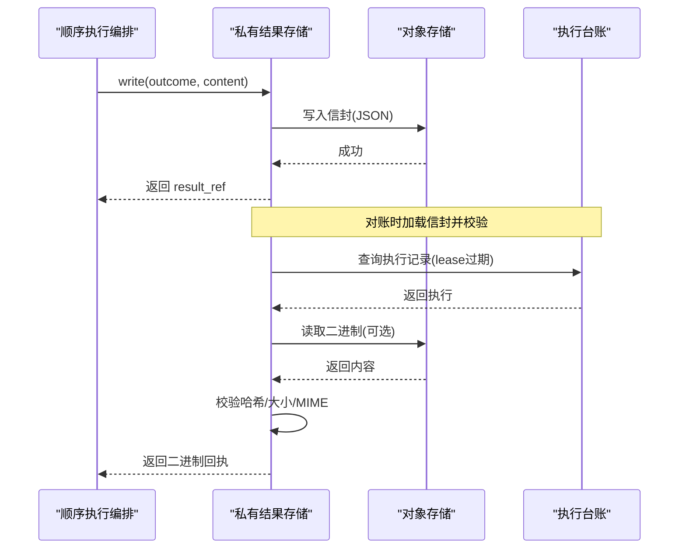
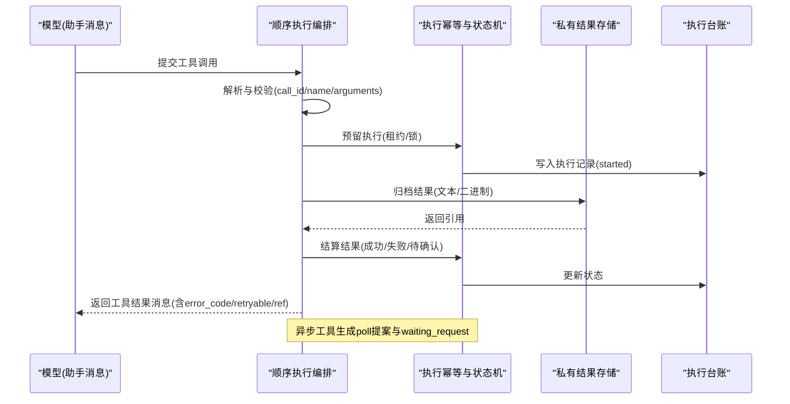
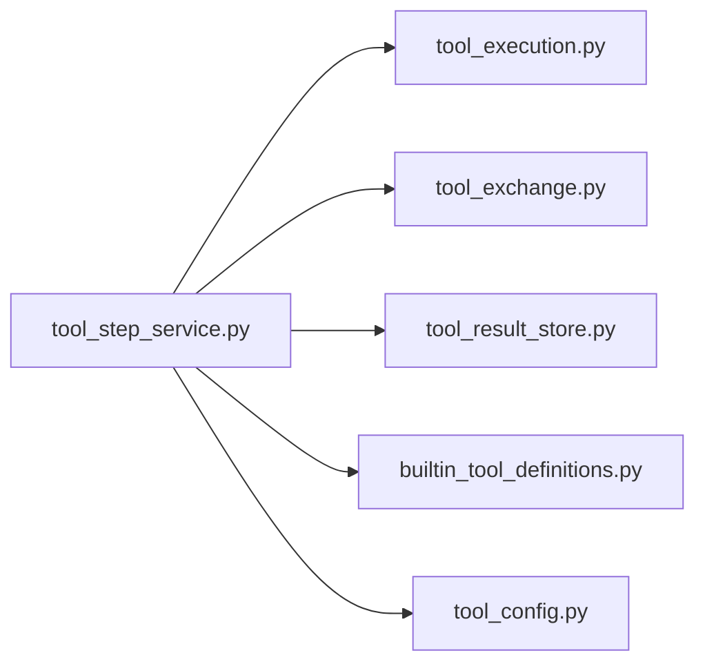

# 工具执行框架

<cite>
**本文引用的文件**   
- [tool_execution.py](file://backend/app/services/agent_runtime/tool_execution.py)
- [tool_exchange.py](file://backend/app/services/agent_runtime/tool_exchange.py)
- [tool_result_store.py](file://backend/app/services/agent_runtime/tool_result_store.py)
- [tool_step_service.py](file://backend/app/services/agent_runtime/tool_step_service.py)
- [builtin_tool_definitions.py](file://backend/app/services/builtin_tool_definitions.py)
- [tool_config.py](file://backend/app/services/tool_config.py)
</cite>

## 目录
1. [简介](#简介)
2. [项目结构](#项目结构)
3. [核心组件](#核心组件)
4. [架构总览](#架构总览)
5. [详细组件分析](#详细组件分析)
6. [依赖关系分析](#依赖关系分析)
7. [性能考量](#性能考量)
8. [故障排查指南](#故障排查指南)
9. [结论](#结论)
10. [附录](#附录)

## 简介
本技术文档面向 Clawith 的工具执行框架，系统性阐述工具注册机制、参数校验与脱敏、执行调度、结果存储、异步支持、超时控制、错误恢复策略、工具间通信协议、数据交换格式、结果缓存机制，以及自定义工具开发指南、接口规范、安全沙箱机制、性能监控与调试技巧、最佳实践。读者可据此理解并扩展该框架，确保在大规模 Agent 运行时中稳定、安全、可观测地执行工具。

## 项目结构
Clawith 后端将工具执行相关能力集中在 agent_runtime 服务层，关键模块如下：
- tool_execution.py：工具执行的幂等性、状态机、元数据规范化、敏感信息脱敏、重试策略与持久化决策。
- tool_exchange.py：消息块原子化、工具调用与结果配对、上下文窗口选择、完整性校验。
- tool_result_store.py：私有结果存储（文本与二进制）、信封封装、一致性校验、过期收据对账。
- tool_step_service.py：顺序执行编排、租约与锁、活动事件记录、异步轮询调度、结果归档与结算。
- builtin_tool_definitions.py：内置工具的模型契约、参数 Schema、分类与默认策略。
- tool_config.py：租户级配置加密/解密、敏感字段掩码、配置读写。

图表来源
- [tool_step_service.py:583-616](file://backend/app/services/agent_runtime/tool_step_service.py#L583-L616)
- [tool_execution.py:177-207](file://backend/app/services/agent_runtime/tool_execution.py#L177-L207)
- [tool_exchange.py:513-553](file://backend/app/services/agent_runtime/tool_exchange.py#L513-L553)
- [tool_result_store.py:190-244](file://backend/app/services/agent_runtime/tool_result_store.py#L190-L244)
- [builtin_tool_definitions.py:20-120](file://backend/app/services/builtin_tool_definitions.py#L20-L120)
- [tool_config.py:93-110](file://backend/app/services/tool_config.py#L93-L110)

章节来源
- [tool_step_service.py:583-616](file://backend/app/services/agent_runtime/tool_step_service.py#L583-L616)
- [tool_execution.py:177-207](file://backend/app/services/agent_runtime/tool_execution.py#L177-L207)
- [tool_exchange.py:513-553](file://backend/app/services/agent_runtime/tool_exchange.py#L513-L553)
- [tool_result_store.py:190-244](file://backend/app/services/agent_runtime/tool_result_store.py#L190-L244)
- [builtin_tool_definitions.py:20-120](file://backend/app/services/builtin_tool_definitions.py#L20-L120)
- [tool_config.py:93-110](file://backend/app/services/tool_config.py#L93-L110)

## 核心组件
- 工具执行幂等与状态机：定义工具执行生命周期、副作用分类、重试策略、元数据边界与敏感信息处理。
- 工具交换与上下文窗口：将消息序列归并为原子块，保证“一次调用对应一个结果”，并在令牌预算内选择最近上下文。
- 私有结果存储：为超大结果或二进制内容提供确定性引用与完整性校验，支持过期收据的对账与结算。
- 顺序执行编排：基于租约与锁的顺序执行，记录运行活动，支持异步轮询与外部等待，统一产出标准化结果消息。
- 内置工具契约：以声明式方式描述工具名称、Schema、分类、默认策略与参数约束，驱动 UI 与运行时解析。
- 租户配置管理：按租户隔离配置，自动识别敏感字段进行加密/解密与掩码展示。

章节来源
- [tool_execution.py:29-45](file://backend/app/services/agent_runtime/tool_execution.py#L29-L45)
- [tool_exchange.py:14-28](file://backend/app/services/agent_runtime/tool_exchange.py#L14-L28)
- [tool_result_store.py:81-111](file://backend/app/services/agent_runtime/tool_result_store.py#L81-L111)
- [tool_step_service.py:583-616](file://backend/app/services/agent_runtime/tool_step_service.py#L583-L616)
- [builtin_tool_definitions.py:20-120](file://backend/app/services/builtin_tool_definitions.py#L20-L120)
- [tool_config.py:22-37](file://backend/app/services/tool_config.py#L22-L37)

## 架构总览
下图展示了工具从模型提议到执行、归档、结算的端到端流程，包含消息块构建、执行预留、结果存储与对账、异步轮询与等待请求。

图表来源
- [tool_exchange.py:513-553](file://backend/app/services/agent_runtime/tool_exchange.py#L513-L553)
- [tool_step_service.py:649-731](file://backend/app/services/agent_runtime/tool_step_service.py#L649-L731)
- [tool_execution.py:743-774](file://backend/app/services/agent_runtime/tool_execution.py#L743-L774)
- [tool_result_store.py:245-295](file://backend/app/services/agent_runtime/tool_result_store.py#L245-L295)

## 详细组件分析

### 工具执行幂等与状态机 (tool_execution.py)
- 功能要点
  - 定义工具执行状态、副作用分类与重试策略，限制元数据大小与键集合，防止越界与注入。
  - 参数与结果规范化：JSON 拷贝、控制字符替换、URL/DSN 脱敏、敏感键匹配与替换。
  - 指纹生成：对参数做稳定哈希，避免重复执行；支持“安全读”条件重试。
  - 异常类型：ToolExecutionError、RetryableToolNodeError、ToolExecutionReconciliationPending，用于区分不可执行、可重试与需对账场景。
- 复杂度与性能
  - 参数与结果规范化时间复杂度 O(n)，n 为 JSON 节点数；元数据过滤与序列化有固定上限，避免大对象阻塞。
- 错误处理
  - 输入非法直接抛出 ToolExecutionError；结果不合法拒绝结算；对账失败标记 pending 并延迟处理。
- 优化建议
  - 使用批量操作减少 DB 往返；对大结果优先归档再结算；合理设置 inline_max_bytes 降低内存占用。

图表来源
- [tool_execution.py:323-349](file://backend/app/services/agent_runtime/tool_execution.py#L323-L349)
- [tool_execution.py:409-565](file://backend/app/services/agent_runtime/tool_execution.py#L409-L565)
- [tool_execution.py:683-693](file://backend/app/services/agent_runtime/tool_execution.py#L683-L693)

章节来源
- [tool_execution.py:29-45](file://backend/app/services/agent_runtime/tool_execution.py#L29-L45)
- [tool_execution.py:323-349](file://backend/app/services/agent_runtime/tool_execution.py#L323-L349)
- [tool_execution.py:409-565](file://backend/app/services/agent_runtime/tool_execution.py#L409-L565)
- [tool_execution.py:683-693](file://backend/app/services/agent_runtime/tool_execution.py#L683-L693)

### 工具交换与上下文窗口 (tool_exchange.py)
- 功能要点
  - 将消息序列归并为 MessageBlock，保证“助手调用”与“工具结果”成对出现，缺失时根据台账决定 block/retry/summarize。
  - 令牌预算选择：按 token_counter 估算，超出预算则回退摘要并提示重试。
  - 完整性校验：拒绝重复 ID、冲突 ID、空 ID 与非法 tool_calls 结构。
- 数据结构
  - MessageBlock、RecentBlockSelection、ToolCallExecutionSummary、ToolExchangeCompactionSummary。
- 错误处理
  - 遇到不完整或孤儿结果，抛出 ToolExchangeIntegrityError 并给出明确原因。
- 优化建议
  - 使用稳定的消息 ID 与 call_id；对长对话定期压缩为摘要块以减少上下文压力。

图表来源
- [tool_exchange.py:65-98](file://backend/app/services/agent_runtime/tool_exchange.py#L65-L98)
- [tool_exchange.py:42-63](file://backend/app/services/agent_runtime/tool_exchange.py#L42-L63)

章节来源
- [tool_exchange.py:513-553](file://backend/app/services/agent_runtime/tool_exchange.py#L513-L553)
- [tool_exchange.py:684-784](file://backend/app/services/agent_runtime/tool_exchange.py#L684-L784)

### 私有结果存储 (tool_result_store.py)
- 功能要点
  - 为超大文本结果与二进制内容提供确定性引用（tool-result:// 与 tool-result-binary://），写入前生成信封并计算内容哈希。
  - 解析与校验：读取信封时校验版本、身份、内容与哈希一致性，拒绝篡改或不完整数据。
  - 过期收据对账：扫描 lease 过期的 started 状态，仅当信封证明成功才结算，避免重复执行。
- 数据结构
  - ToolResultEnvelope、ToolBinaryReceipt、ToolResultReconcileResult。
- 错误处理
  - 针对无效引用、范围不匹配、不可用、完整性失败等抛出 ToolResultStoreError。
- 优化建议
  - 对二进制内容限定 MIME 类型（如 image/*）；对大结果先归档后结算，减少主库负载。

图表来源
- [tool_result_store.py:245-295](file://backend/app/services/agent_runtime/tool_result_store.py#L245-L295)
- [tool_result_store.py:297-348](file://backend/app/services/agent_runtime/tool_result_store.py#L297-L348)
- [tool_result_store.py:485-586](file://backend/app/services/agent_runtime/tool_result_store.py#L485-L586)

章节来源
- [tool_result_store.py:190-244](file://backend/app/services/agent_runtime/tool_result_store.py#L190-L244)
- [tool_result_store.py:245-295](file://backend/app/services/agent_runtime/tool_result_store.py#L245-L295)
- [tool_result_store.py:297-348](file://backend/app/services/agent_runtime/tool_result_store.py#L297-L348)
- [tool_result_store.py:485-586](file://backend/app/services/agent_runtime/tool_result_store.py#L485-L586)

### 顺序执行编排 (tool_step_service.py)
- 功能要点
  - 解析模型调用的 function 与 arguments，提取 call_id、name、arguments，并进行严格校验。
  - 预留执行：写入执行记录、记录活动事件、生成租约所有者标识，确保并发安全。
  - 结果结算：规范化结果、归档二进制、更新台账、产出标准化工具结果消息。
  - 异步轮询：当工具返回 pending 且含 poll 指令时，生成下一次调用提案与等待请求。
- 数据结构
  - ToolPolicy、ToolExecutor、RuntimeToolStepService。
- 错误处理
  - 非法调用、缺少助手消息、异步轮询计划无效等抛出 ToolExecutionError。
- 优化建议
  - 对心跳源工具施加限额；对删除类操作增加审批范围校验；合理设置租约 TTL。

图表来源
- [tool_step_service.py:170-209](file://backend/app/services/agent_runtime/tool_step_service.py#L170-L209)
- [tool_step_service.py:649-731](file://backend/app/services/agent_runtime/tool_step_service.py#L649-L731)
- [tool_step_service.py:733-800](file://backend/app/services/agent_runtime/tool_step_service.py#L733-L800)
- [tool_step_service.py:307-354](file://backend/app/services/agent_runtime/tool_step_service.py#L307-L354)

章节来源
- [tool_step_service.py:170-209](file://backend/app/services/agent_runtime/tool_step_service.py#L170-L209)
- [tool_step_service.py:649-731](file://backend/app/services/agent_runtime/tool_step_service.py#L649-L731)
- [tool_step_service.py:733-800](file://backend/app/services/agent_runtime/tool_step_service.py#L733-L800)
- [tool_step_service.py:307-354](file://backend/app/services/agent_runtime/tool_step_service.py#L307-L354)

### 内置工具契约 (builtin_tool_definitions.py)
- 功能要点
  - 以声明式列表定义工具名称、显示名、描述、分类、图标、是否默认、参数 Schema、配置与配置 Schema。
  - 覆盖文件操作、文档转换、触发器管理、通信、搜索等类别，便于 UI 渲染与运行时解析。
- 扩展建议
  - 新增工具时补充参数校验与敏感字段标注；为写操作设置合适的副作用分类与重试策略。

章节来源
- [builtin_tool_definitions.py:20-120](file://backend/app/services/builtin_tool_definitions.py#L20-L120)

### 租户配置管理 (tool_config.py)
- 功能要点
  - 按租户隔离工具配置，自动识别敏感字段（api_key、private_key、auth_code、password、secret 等）进行加密/解密与掩码。
  - 提供获取、设置、删除租户配置的便捷方法，兼容内置工具与第三方工具。
- 安全建议
  - 始终使用 get_sensitive_keys 与 mask_sensitive_fields 保护敏感值；避免明文落盘。

章节来源
- [tool_config.py:22-37](file://backend/app/services/tool_config.py#L22-L37)
- [tool_config.py:93-110](file://backend/app/services/tool_config.py#L93-L110)
- [tool_config.py:146-151](file://backend/app/services/tool_config.py#L146-L151)

## 依赖关系分析
- 组件耦合
  - tool_step_service 依赖 tool_execution（幂等与状态机）、tool_exchange（消息块）、tool_result_store（结果存储）、builtin_tool_definitions（工具契约）、tool_config（租户配置）。
- 外部依赖
  - SQLAlchemy 异步会话、对象存储后端、UUID 与哈希库。
- 循环依赖
  - 各模块职责清晰，无循环导入；通过 Protocol 与回调解耦执行器与提供者。

图表来源
- [tool_step_service.py:583-616](file://backend/app/services/agent_runtime/tool_step_service.py#L583-L616)
- [tool_execution.py:177-207](file://backend/app/services/agent_runtime/tool_execution.py#L177-L207)
- [tool_exchange.py:513-553](file://backend/app/services/agent_runtime/tool_exchange.py#L513-L553)
- [tool_result_store.py:190-244](file://backend/app/services/agent_runtime/tool_result_store.py#L190-L244)
- [builtin_tool_definitions.py:20-120](file://backend/app/services/builtin_tool_definitions.py#L20-L120)
- [tool_config.py:93-110](file://backend/app/services/tool_config.py#L93-L110)

章节来源
- [tool_step_service.py:583-616](file://backend/app/services/agent_runtime/tool_step_service.py#L583-L616)
- [tool_execution.py:177-207](file://backend/app/services/agent_runtime/tool_execution.py#L177-L207)
- [tool_exchange.py:513-553](file://backend/app/services/agent_runtime/tool_exchange.py#L513-L553)
- [tool_result_store.py:190-244](file://backend/app/services/agent_runtime/tool_result_store.py#L190-L244)
- [builtin_tool_definitions.py:20-120](file://backend/app/services/builtin_tool_definitions.py#L20-L120)
- [tool_config.py:93-110](file://backend/app/services/tool_config.py#L93-L110)

## 性能考量
- 结果归档与截断：对超过 inline_max_bytes 的结果进行截断与归档，降低主库负载与网络传输成本。
- 令牌预算控制：select_recent_blocks 依据 token_budget 与 token_counter 裁剪上下文，避免超限。
- 租约与锁：短租约 TTL 提升吞吐，配合幂等与对账保障可靠性。
- 批量对账：ToolResultReconciler 批量扫描过期收据，减少 DB 压力。
- 敏感字段处理：仅在必要时脱敏与加密，避免频繁加解密开销。

[本节为通用指导，无需源码引用]

## 故障排查指南
- 常见错误
  - 参数非法：检查 arguments 是否为 JSON 对象，字段类型与长度是否符合 Schema。
  - 工具调用不完整：确认助手消息存在且 tool_calls 与结果一一对应。
  - 结果不可用：核对 result_ref 与 tenant/run 范围，检查对象存储可用性。
  - 异步轮询失败：校验 poll 指令中的 tool、arguments、interval_ms 合法性。
- 定位步骤
  - 查看执行台账状态与活动事件，确认 started/succeeded/failed/pending。
  - 检查工具交换块的 action 与 blocked/requires_confirmation 标志。
  - 对账日志关注 unavailable/deferred 状态与错误码。
- 修复建议
  - 修正参数结构与必填项；调整租约 TTL 与重试策略；修复对象存储权限与路径。

章节来源
- [tool_execution.py:743-774](file://backend/app/services/agent_runtime/tool_execution.py#L743-L774)
- [tool_exchange.py:667-682](file://backend/app/services/agent_runtime/tool_exchange.py#L667-L682)
- [tool_result_store.py:485-586](file://backend/app/services/agent_runtime/tool_result_store.py#L485-L586)
- [tool_step_service.py:307-354](file://backend/app/services/agent_runtime/tool_step_service.py#L307-L354)

## 结论
Clawith 工具执行框架通过严格的幂等与状态机、原子化的消息交换、健壮的结果存储与对账、以及灵活的异步轮询机制，实现了高可靠、可扩展、可观测的工具执行能力。结合内置工具契约与租户配置管理，开发者可以快速扩展新工具并确保安全与合规。建议在新增工具时遵循参数校验、敏感字段保护、副作用分类与重试策略的最佳实践，以获得稳定高效的执行体验。

[本节为总结，无需源码引用]

## 附录
- 自定义工具开发指南
  - 在 builtin_tool_definitions.py 中声明工具名称、Schema、分类与默认策略。
  - 实现工具执行逻辑，返回 ToolExecutionOutcome，必要时附带 private_binary 与 metadata。
  - 使用 sanitize_tool_arguments 与 normalize_tool_outcome 处理参数与结果。
  - 对于写操作，设置 side_effect_classification 与 retry_policy，确保幂等与可恢复。
- 工具接口规范
  - 调用：function.name、function.arguments（JSON 对象）、唯一 call_id。
  - 结果：status、result_summary/result_ref、error_code、retryable、artifact_refs/evidence_refs、metadata。
- 安全沙箱机制
  - 参数与结果脱敏、URL/DSN 清理、敏感键匹配替换；二进制内容限定 MIME 类型；租户隔离配置与访问控制。
- 性能监控与调试技巧
  - 启用活动事件记录（thinking/progress/tool_call）；观察令牌预算与上下文裁剪；对账日志与错误码分析。
- 最佳实践
  - 小步提交、分块写入；合理使用归档与引用；避免在大结果中嵌入敏感信息；谨慎设置重试策略与租约 TTL。

[本节为通用指导，无需源码引用]