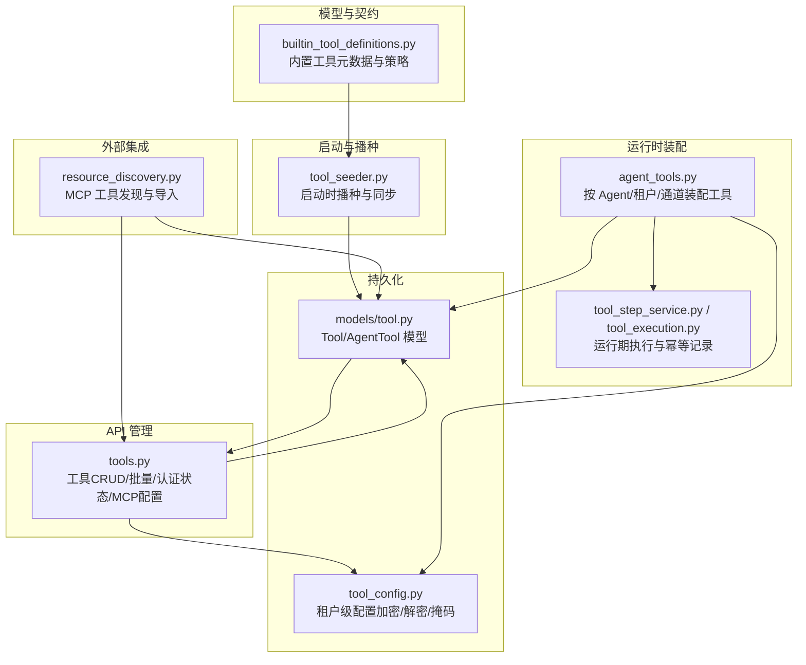
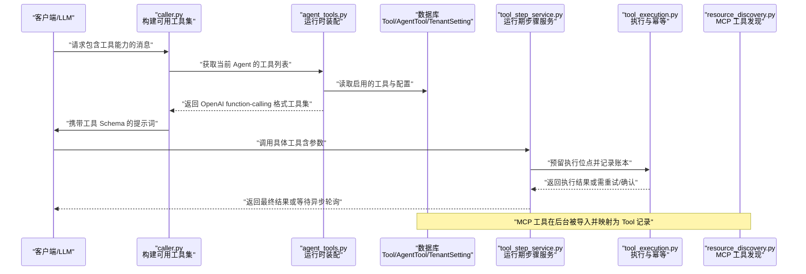
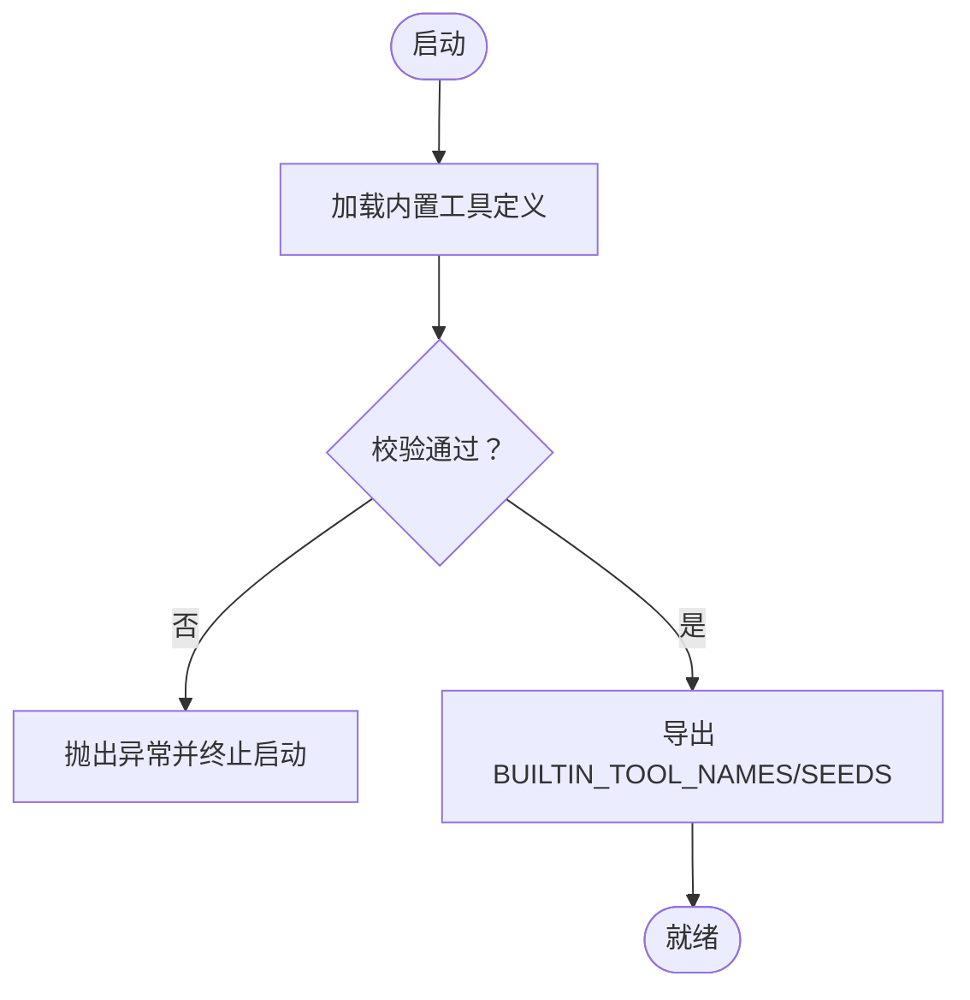
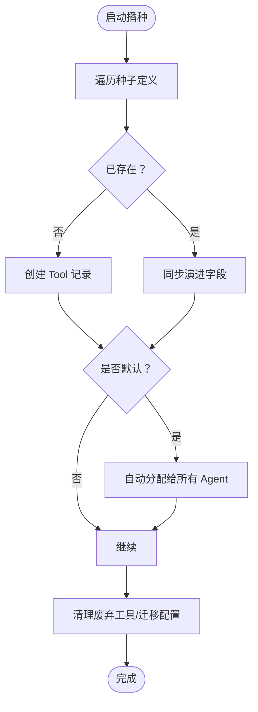
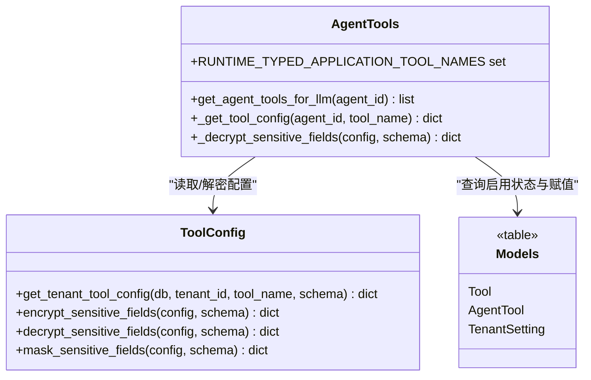
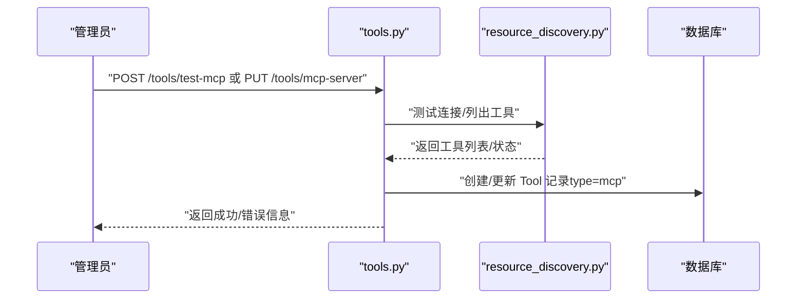
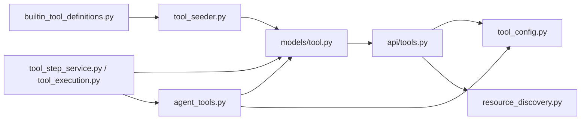

# 工具注册系统

<cite>
**本文引用的文件**   
- [backend/app/services/builtin_tool_definitions.py](file://backend/app/services/builtin_tool_definitions.py)
- [backend/app/services/agent_tools.py](file://backend/app/services/agent_tools.py)
- [backend/app/services/tool_seeder.py](file://backend/app/services/tool_seeder.py)
- [backend/app/models/tool.py](file://backend/app/models/tool.py)
- [backend/app/api/tools.py](file://backend/app/api/tools.py)
- [backend/app/services/tool_config.py](file://backend/app/services/tool_config.py)
- [backend/app/services/resource_discovery.py](file://backend/app/services/resource_discovery.py)
- [backend/app/services/llm/caller.py](file://backend/app/services/llm/caller.py)
- [backend/app/services/llm/client.py](file://backend/app/services/llm/client.py)
- [backend/app/services/agent_runtime/tool_step_service.py](file://backend/app/services/agent_runtime/tool_step_service.py)
- [backend/app/services/agent_runtime/tool_execution.py](file://backend/app/services/agent_runtime/tool_execution.py)
- [frontend/src/pages/EnterpriseSettings.tsx](file://frontend/src/pages/EnterpriseSettings.tsx)
</cite>

## 目录
1. [简介](#简介)
2. [项目结构](#项目结构)
3. [核心组件](#核心组件)
4. [架构总览](#架构总览)
5. [详细组件分析](#详细组件分析)
6. [依赖关系分析](#依赖关系分析)
7. [性能考量](#性能考量)
8. [故障排查指南](#故障排查指南)
9. [结论](#结论)
10. [附录](#附录)

## 简介
本技术文档围绕 Clawith 的工具注册系统，系统性阐述工具的动态注册机制、插件加载流程与依赖注入体系；详细说明工具元数据定义、接口规范校验、版本兼容策略；描述内置工具发现机制、外部工具（MCP）集成方式、工具分类与标签体系；并提供自定义工具开发指南、安全权限控制、最佳实践、性能优化建议与故障排查方法。读者无需深入代码即可理解整体设计与运行机制。

## 项目结构
工具注册系统由“模型定义 + 启动播种 + 运行时装配 + API 管理 + 持久化模型”五部分构成：
- 模型定义：集中声明内置工具的元数据与执行策略，作为模型侧契约的唯一来源。
- 启动播种：在应用启动时将内置工具写入数据库，并自动完成默认分配与字段同步。
- 运行时装配：根据租户、通道配置、Agent 能力等上下文动态拼装 LLM 可用的工具列表。
- API 管理：提供工具 CRUD、批量启用/禁用、MCP 服务器级凭据更新、Smithery 授权状态查询等。
- 持久化模型：Tool/AgentTool 表承载工具定义、可见性、启用状态与 Agent 级配置覆盖。

**图表来源** 
- [backend/app/services/builtin_tool_definitions.py:1-120](file://backend/app/services/builtin_tool_definitions.py#L1-L120)
- [backend/app/services/tool_seeder.py:68-178](file://backend/app/services/tool_seeder.py#L68-L178)
- [backend/app/services/agent_tools.py:752-800](file://backend/app/services/agent_tools.py#L752-L800)
- [backend/app/api/tools.py:195-338](file://backend/app/api/tools.py#L195-L338)
- [backend/app/models/tool.py:13-63](file://backend/app/models/tool.py#L13-L63)
- [backend/app/services/tool_config.py:93-151](file://backend/app/services/tool_config.py#L93-L151)
- [backend/app/services/resource_discovery.py:920-942](file://backend/app/services/resource_discovery.py#L920-L942)

**章节来源**
- [backend/app/services/builtin_tool_definitions.py:1-120](file://backend/app/services/builtin_tool_definitions.py#L1-L120)
- [backend/app/services/tool_seeder.py:68-178](file://backend/app/services/tool_seeder.py#L68-L178)
- [backend/app/services/agent_tools.py:752-800](file://backend/app/services/agent_tools.py#L752-L800)
- [backend/app/api/tools.py:195-338](file://backend/app/api/tools.py#L195-L338)
- [backend/app/models/tool.py:13-63](file://backend/app/models/tool.py#L13-L63)
- [backend/app/services/tool_config.py:93-151](file://backend/app/services/tool_config.py#L93-L151)
- [backend/app/services/resource_discovery.py:920-942](file://backend/app/services/resource_discovery.py#L920-L942)

## 核心组件
- 内置工具元数据与策略：以结构化数据定义工具名称、显示名、描述、分类、图标、参数 Schema、默认配置、配置 Schema 以及执行策略（副作用分类、重试策略、并行安全性）。
- 启动播种器：将内置工具写入数据库，同步可能演进的字段，修正历史默认值，自动为已有 Agent 分配新默认工具，清理废弃工具，迁移旧配置到租户设置。
- 运行时装配器：基于 Agent ID、租户、通道配置（如飞书）、OKR 专用工具、AgentBay 环境 OS 类型等，动态生成 LLM 可用的工具列表，并对敏感路径进行脱敏。
- API 管理层：提供工具清单、创建、更新、删除、批量启用/禁用、按 Agent 的启用状态管理、MCP 服务器级凭据批量更新、Smithery 授权状态查询等。
- 配置中心：对敏感字段进行加密/解密/掩码，支持按工具 Schema 识别密码类字段，避免跨租户泄露。
- 外部工具集成：通过 MCP 协议发现远端工具，映射为 Tool 记录并自动建立 AgentTool 关联，支持 Atlassian Rovo 等预置集成。
- 运行期执行与幂等：以工具账本记录执行结果，支持安全读重试、条件重试、永不重试策略，保证分布式场景下的幂等与可恢复性。

**章节来源**
- [backend/app/services/builtin_tool_definitions.py:3981-4060](file://backend/app/services/builtin_tool_definitions.py#L3981-L4060)
- [backend/app/services/tool_seeder.py:101-178](file://backend/app/services/tool_seeder.py#L101-L178)
- [backend/app/services/agent_tools.py:752-800](file://backend/app/services/agent_tools.py#L752-L800)
- [backend/app/api/tools.py:195-338](file://backend/app/api/tools.py#L195-L338)
- [backend/app/services/tool_config.py:93-151](file://backend/app/services/tool_config.py#L93-L151)
- [backend/app/services/resource_discovery.py:920-942](file://backend/app/services/resource_discovery.py#L920-L942)
- [backend/app/services/agent_runtime/tool_execution.py:1-200](file://backend/app/services/agent_runtime/tool_execution.py#L1-L200)

## 架构总览
下图展示从 LLM 调用到工具执行的完整链路，包括工具发现、权限过滤、运行时装配、执行与幂等记录。

**图表来源** 
- [backend/app/services/llm/caller.py:528-554](file://backend/app/services/llm/caller.py#L528-L554)
- [backend/app/services/agent_tools.py:752-800](file://backend/app/services/agent_tools.py#L752-L800)
- [backend/app/services/agent_runtime/tool_step_service.py:99-146](file://backend/app/services/agent_runtime/tool_step_service.py#L99-L146)
- [backend/app/services/agent_runtime/tool_execution.py:1180-1225](file://backend/app/services/agent_runtime/tool_execution.py#L1180-L1225)
- [backend/app/services/resource_discovery.py:920-942](file://backend/app/services/resource_discovery.py#L920-L942)

## 详细组件分析

### 内置工具元数据与校验
- 元数据结构：每个内置工具包含 name、display_name、description、category、icon、is_default、parameters_schema、config、config_schema 等字段，确保 UI 渲染、参数校验与运行时行为一致。
- 校验机制：启动时执行 validate_builtin_tool_definitions，检查名称唯一性、非空描述、Schema 类型正确性与 required 字段合法性，防止畸形定义进入生产。
- 策略定义：为每个工具标注副作用分类（read/write/external_write）、重试策略（safe/conditional/never）、并行安全性，驱动运行期幂等与重试逻辑。

**图表来源** 
- [backend/app/services/builtin_tool_definitions.py:3981-4060](file://backend/app/services/builtin_tool_definitions.py#L3981-L4060)

**章节来源**
- [backend/app/services/builtin_tool_definitions.py:3981-4060](file://backend/app/services/builtin_tool_definitions.py#L3981-L4060)

### 启动播种与字段同步
- 播种流程：遍历 BUILTIN_TOOL_SEEDS，若不存在则创建 Tool 记录；若存在则同步 category/description/display_name/icon/is_default/config_schema/parameters_schema 等可能演进的字段。
- 默认分配：新增 is_default=True 的工具会自动分配给所有已有 Agent，保持 UI 与运行时一致性。
- 历史修复：修正 AgentBay 工具不应为 is_default=True 的历史错误；清理废弃工具；迁移全局配置到租户设置，避免跨租户泄露。

**图表来源** 
- [backend/app/services/tool_seeder.py:101-178](file://backend/app/services/tool_seeder.py#L101-L178)

**章节来源**
- [backend/app/services/tool_seeder.py:101-178](file://backend/app/services/tool_seeder.py#L101-L178)

### 运行时工具装配与依赖注入
- 装配入口：get_agent_tools_for_llm 根据 Agent ID 判断通道能力（如飞书）、系统 Agent 标志、OS 类型（AgentBay），合并 Always Core 工具与 Channel Tools，再读取 DB 中的启用状态。
- 配置优先级：Agent 级配置 > 租户级配置 > 全局默认配置；敏感字段按 config_schema 识别并解密。
- 动态裁剪：隐藏某些内部工具（如 query_roster、send_feishu_message）；对无 typed boundary 的应用工具在 Durable Runtime 中隐藏，直到具备明确边界。
- 上下文注入：通过 ContextVar 注入 channel_file_sender、channel_web_agent_id、agentbay_session_scope_id 等运行时上下文，供工具实现使用。

**图表来源** 
- [backend/app/services/agent_tools.py:752-800](file://backend/app/services/agent_tools.py#L752-L800)
- [backend/app/services/tool_config.py:93-151](file://backend/app/services/tool_config.py#L93-L151)
- [backend/app/models/tool.py:13-63](file://backend/app/models/tool.py#L13-L63)

**章节来源**
- [backend/app/services/agent_tools.py:752-800](file://backend/app/services/agent_tools.py#L752-L800)
- [backend/app/services/tool_config.py:93-151](file://backend/app/services/tool_config.py#L93-L151)
- [backend/app/models/tool.py:13-63](file://backend/app/models/tool.py#L13-L63)

### 外部工具集成（MCP）
- 发现与导入：resource_discovery 连接 MCP Server，拉取工具列表，映射为 Tool 记录（type=mcp），并自动建立 AgentTool 关联，支持 Atlassian Rovo 预置集成。
- 凭据管理：MCP 服务器级凭据可通过 API 批量更新，优先使用 tool.config['api_key']，其次 URL 查询参数；运行时由 MCPClient 处理鉴权。
- Smithery 授权：针对特定 MCP 工具，支持查询授权状态（connected/auth_required/unavailable），前端据此引导用户完成授权。

**图表来源** 
- [backend/app/api/tools.py:581-664](file://backend/app/api/tools.py#L581-L664)
- [backend/app/services/resource_discovery.py:920-942](file://backend/app/services/resource_discovery.py#L920-L942)

**章节来源**
- [backend/app/api/tools.py:581-664](file://backend/app/api/tools.py#L581-L664)
- [backend/app/services/resource_discovery.py:920-942](file://backend/app/services/resource_discovery.py#L920-L942)

### 工具分类与标签系统
- 分类维度：file、task、communication、search、aware、social、code、discovery、email、feishu、custom、general、agentbay、atlassian 等，用于 UI 分组与权限控制。
- 标签与图标：每个工具定义 icon 与 category，前端根据 category 渲染分组与图标，支持 MCP 服务器级别分组。
- 特殊分组：system 分类为协议层工具，不在公司管理中暴露；OKR 专用工具仅对系统 Agent 可见。

**章节来源**
- [frontend/src/pages/EnterpriseSettings.tsx:237-253](file://frontend/src/pages/EnterpriseSettings.tsx#L237-L253)
- [backend/app/api/tools.py:33-35](file://backend/app/api/tools.py#L33-L35)

### 工具接口规范验证与版本兼容
- 接口规范：OpenAI function-calling 格式（type=function，function.name/arguments/description），参数 Schema 遵循 JSON Schema object 类型，required 字段强制校验。
- 版本兼容：validate_builtin_tool_definitions 确保名称唯一与 Schema 合法；seeder 同步演进字段，修正历史默认值；legacy 工具重命名与合并（如 send_web_message -> send_platform_message）。
- 运行时兼容：_canonicalize_llm_tool 用最新模型契约替换过时 DB Schema，保证 LLM 看到的始终是最新定义。

**章节来源**
- [backend/app/services/builtin_tool_definitions.py:3981-4060](file://backend/app/services/builtin_tool_definitions.py#L3981-L4060)
- [backend/app/services/tool_seeder.py:74-99](file://backend/app/services/tool_seeder.py#L74-L99)
- [backend/app/services/agent_tools.py:754-759](file://backend/app/services/agent_tools.py#L754-L759)

### 安全权限控制
- 可见性规则：builtin 工具全局可见；admin 工具仅对同租户或平台级可见；agent 工具需显式分配；系统分类工具不可禁用。
- 敏感字段：config_schema 中标记 password 类型的字段会被加密存储，读取时解密，UI 显示时掩码（****后缀）。
- 租户隔离：tenant_settings 存储租户级工具配置，避免跨租户泄露；API 操作均基于当前用户 tenant_id 或显式 target_tenant_id。

**章节来源**
- [backend/app/api/tools.py:55-90](file://backend/app/api/tools.py#L55-L90)
- [backend/app/services/tool_config.py:40-76](file://backend/app/services/tool_config.py#L40-L76)
- [backend/app/services/tool_config.py:146-151](file://backend/app/services/tool_config.py#L146-L151)

### 自定义工具开发指南
- 元数据定义：参照 builtin_tool_definitions 的结构，提供 name、display_name、description、category、icon、parameters_schema、config、config_schema。
- 接口规范：遵循 OpenAI function-calling 格式，确保 parameters_schema.type=object，required 字段齐全。
- 执行策略：标注 side_effect_classification、retry_policy、parallel_safe，便于运行期幂等与重试。
- 注册方式：通过 API POST /tools 创建（type=mcp/admin），或由 resource_discovery 自动导入 MCP 工具。
- 配置管理：使用 tool_config 模块加密敏感字段，支持租户级覆盖。

**章节来源**
- [backend/app/services/builtin_tool_definitions.py:1-120](file://backend/app/services/builtin_tool_definitions.py#L1-L120)
- [backend/app/api/tools.py:239-281](file://backend/app/api/tools.py#L239-L281)
- [backend/app/services/tool_config.py:93-151](file://backend/app/services/tool_config.py#L93-L151)

## 依赖关系分析
工具注册系统的核心依赖如下：
- builtin_tool_definitions 为唯一权威源，seeder 依赖其导出 SEEDS 进行播种。
- agent_tools 依赖 models/tool、tool_config 与数据库会话，装配运行时工具集。
- api/tools 依赖 models/tool、tool_config、resource_discovery，提供管理与集成能力。
- resource_discovery 依赖 MCP 客户端，发现并导入外部工具。
- 运行期 tool_step_service 与 tool_execution 依赖模型与数据库，确保执行幂等与可恢复。

**图表来源** 
- [backend/app/services/builtin_tool_definitions.py:1-120](file://backend/app/services/builtin_tool_definitions.py#L1-L120)
- [backend/app/services/tool_seeder.py:68-178](file://backend/app/services/tool_seeder.py#L68-L178)
- [backend/app/models/tool.py:13-63](file://backend/app/models/tool.py#L13-L63)
- [backend/app/api/tools.py:195-338](file://backend/app/api/tools.py#L195-L338)
- [backend/app/services/tool_config.py:93-151](file://backend/app/services/tool_config.py#L93-L151)
- [backend/app/services/resource_discovery.py:920-942](file://backend/app/services/resource_discovery.py#L920-L942)
- [backend/app/services/agent_tools.py:752-800](file://backend/app/services/agent_tools.py#L752-L800)
- [backend/app/services/agent_runtime/tool_step_service.py:99-146](file://backend/app/services/agent_runtime/tool_step_service.py#L99-L146)
- [backend/app/services/agent_runtime/tool_execution.py:1-200](file://backend/app/services/agent_runtime/tool_execution.py#L1-L200)

**章节来源**
- [backend/app/services/builtin_tool_definitions.py:1-120](file://backend/app/services/builtin_tool_definitions.py#L1-L120)
- [backend/app/services/tool_seeder.py:68-178](file://backend/app/services/tool_seeder.py#L68-L178)
- [backend/app/models/tool.py:13-63](file://backend/app/models/tool.py#L13-L63)
- [backend/app/api/tools.py:195-338](file://backend/app/api/tools.py#L195-L338)
- [backend/app/services/tool_config.py:93-151](file://backend/app/services/tool_config.py#L93-L151)
- [backend/app/services/resource_discovery.py:920-942](file://backend/app/services/resource_discovery.py#L920-L942)
- [backend/app/services/agent_tools.py:752-800](file://backend/app/services/agent_tools.py#L752-L800)
- [backend/app/services/agent_runtime/tool_step_service.py:99-146](file://backend/app/services/agent_runtime/tool_step_service.py#L99-L146)
- [backend/app/services/agent_runtime/tool_execution.py:1-200](file://backend/app/services/agent_runtime/tool_execution.py#L1-L200)

## 性能考量
- 配置缓存：agent_tools 中对 _get_tool_config 使用内存缓存（TTL 60s），减少频繁 DB 查询。
- 批量操作：API 提供 /tools/bulk 批量启用/禁用，降低网络与事务开销。
- 懒加载与裁剪：运行时仅返回当前 Agent 可用的工具，隐藏未配置通道或无 typed boundary 的工具，减少 LLM 上下文长度。
- 幂等与重试：tool_execution 以账本记录执行结果，安全读允许有限重试，条件写避免重复提交，提升鲁棒性。
- MCP 批量更新：/tools/mcp-server 支持按服务器批量更新凭据，避免逐个工具修改。

[本节为通用性能指导，不直接分析具体文件]

## 故障排查指南
- 工具不可见：检查 visibility 规则（builtin/admin/agent/source/tenant_id），确认 AgentTool 是否存在且 enabled。
- 配置未生效：确认 config 优先级（Agent > 租户 > 全局），检查敏感字段是否加密/解密失败，查看 tool_config 缓存。
- MCP 连接失败：使用 /tools/test-mcp 测试连接，检查 server_url 与 api_key；查看 Smithery 授权状态。
- 执行失败：查看 tool_execution 账本状态（started/succeeded/failed/unknown），根据 retry_policy 调整重试策略。
- 历史问题：检查 seeder 日志，确认是否完成字段同步、默认分配与配置迁移。

**章节来源**
- [backend/app/api/tools.py:55-90](file://backend/app/api/tools.py#L55-L90)
- [backend/app/services/tool_config.py:40-76](file://backend/app/services/tool_config.py#L40-L76)
- [backend/app/services/agent_runtime/tool_execution.py:1-200](file://backend/app/services/agent_runtime/tool_execution.py#L1-L200)
- [backend/app/services/tool_seeder.py:318-371](file://backend/app/services/tool_seeder.py#L318-L371)

## 结论
Clawith 的工具注册系统以“单一权威元数据 + 启动播种 + 运行时装配 + API 管理 + 持久化模型”为核心架构，实现了内置与外部工具的无缝集成、严格的接口校验与版本兼容、细粒度的权限与租户隔离、以及高可靠的运行期执行与幂等保障。通过合理的性能优化与完善的故障排查手段，系统能够支撑大规模、多租户、多通道的复杂业务场景。

[本节为总结性内容，不直接分析具体文件]

## 附录
- 最佳实践：
  - 始终使用 validate_builtin_tool_definitions 校验定义。
  - 通过 tool_config 管理敏感配置，避免硬编码。
  - 使用 /tools/bulk 与 /tools/mcp-server 进行批量操作。
  - 在运行时仅暴露必要工具，减少 LLM 上下文压力。
- 参考路径：
  - 内置工具定义：[backend/app/services/builtin_tool_definitions.py](file://backend/app/services/builtin_tool_definitions.py)
  - 启动播种：[backend/app/services/tool_seeder.py](file://backend/app/services/tool_seeder.py)
  - 运行时装配：[backend/app/services/agent_tools.py](file://backend/app/services/agent_tools.py)
  - API 管理：[backend/app/api/tools.py](file://backend/app/api/tools.py)
  - 配置中心：[backend/app/services/tool_config.py](file://backend/app/services/tool_config.py)
  - MCP 集成：[backend/app/services/resource_discovery.py](file://backend/app/services/resource_discovery.py)
  - 运行期执行：[backend/app/services/agent_runtime/tool_execution.py](file://backend/app/services/agent_runtime/tool_execution.py)

[本节为附录内容，不直接分析具体文件]