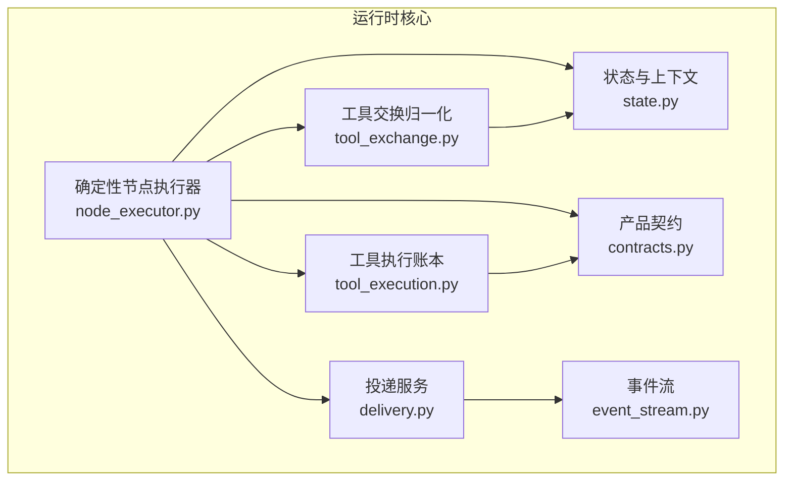
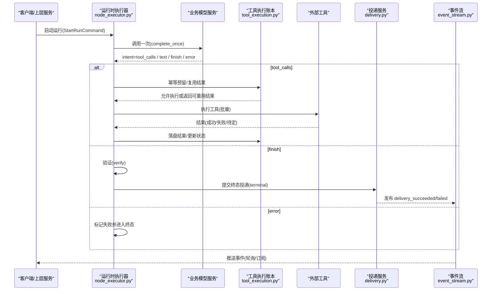
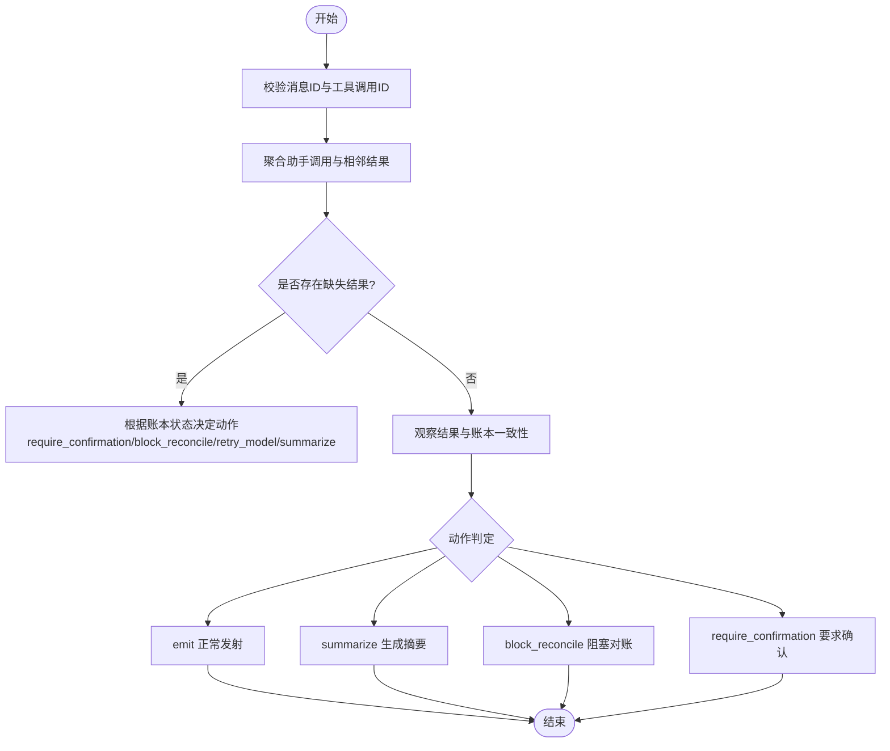
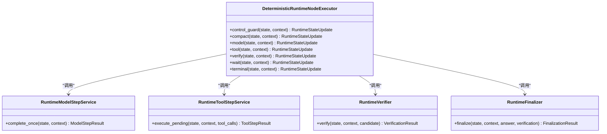
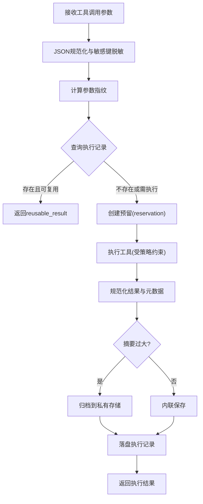
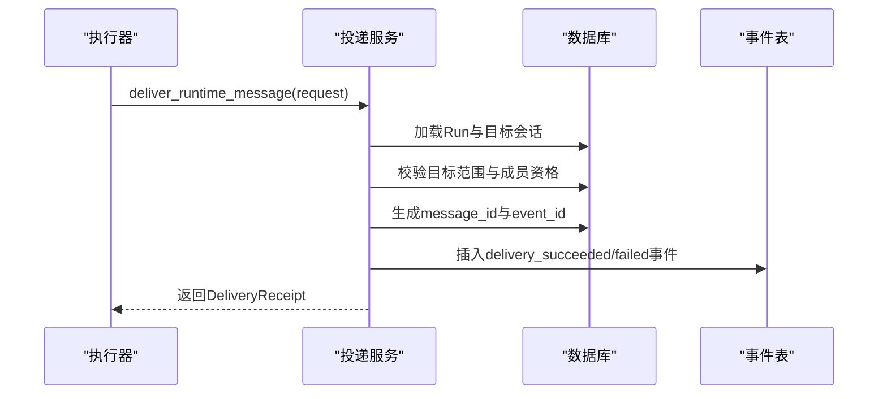
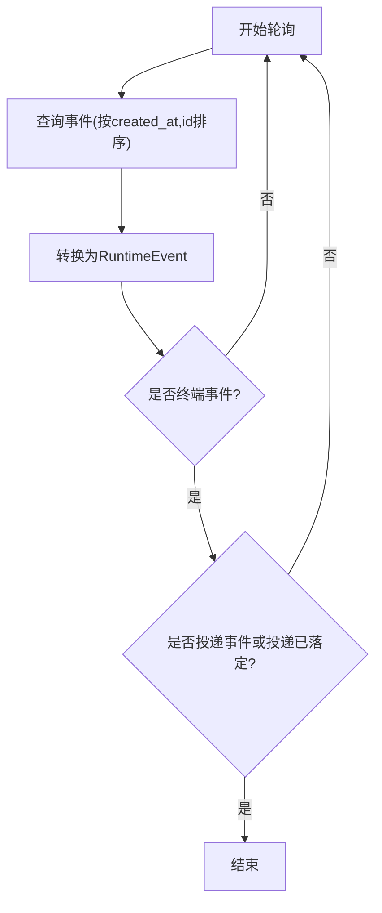
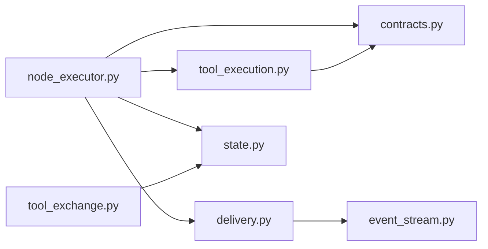

# 工具通信协议

<cite>
**本文引用的文件**   
- [tool_exchange.py](file://backend/app/services/agent_runtime/tool_exchange.py)
- [node_executor.py](file://backend/app/services/agent_runtime/node_executor.py)
- [delivery.py](file://backend/app/services/agent_runtime/delivery.py)
- [event_stream.py](file://backend/app/services/agent_runtime/event_stream.py)
- [tool_execution.py](file://backend/app/services/agent_runtime/tool_execution.py)
- [state.py](file://backend/app/services/agent_runtime/state.py)
- [contracts.py](file://backend/app/services/agent_runtime/contracts.py)
</cite>

## 目录
1. [简介](#简介)
2. [项目结构](#项目结构)
3. [核心组件](#核心组件)
4. [架构总览](#架构总览)
5. [详细组件分析](#详细组件分析)
6. [依赖关系分析](#依赖关系分析)
7. [性能考量](#性能考量)
8. [故障排查指南](#故障排查指南)
9. [结论](#结论)
10. [附录](#附录)

## 简介
本技术文档面向Clawith的“工具通信协议”，聚焦于Agent运行时与工具之间的消息传递机制、数据交换格式、序列化与幂等策略，以及同步调用、异步回调、事件驱动通信的实现方式。同时覆盖错误传播、状态同步、事务边界、协议版本管理、向后兼容与安全认证要点，并提供扩展指南、调试工具与性能分析建议，帮助开发者在复杂多Agent协作环境中稳定地编排与执行工具调用。

## 项目结构
围绕工具通信协议的核心代码位于后端服务 agent_runtime 子系统中，关键模块包括：
- 工具交换归一化与上下文窗口选择：tool_exchange.py
- 确定性节点执行器（模型/工具/验证/等待/终态）：node_executor.py
- 幂等投递服务（用户可见消息/等待提示/终态结果）：delivery.py
- 产品侧事件流（轮询、断线重连、终止条件）：event_stream.py
- 工具执行账本（幂等决策、重试策略、元数据归档）：tool_execution.py
- 运行时状态与上下文契约：state.py
- 产品级命令/事件契约：contracts.py

图表来源 
- [node_executor.py:1-200](file://backend/app/services/agent_runtime/node_executor.py#L1-L200)
- [tool_exchange.py:1-120](file://backend/app/services/agent_runtime/tool_exchange.py#L1-L120)
- [tool_execution.py:1-120](file://backend/app/services/agent_runtime/tool_execution.py#L1-L120)
- [delivery.py:1-120](file://backend/app/services/agent_runtime/delivery.py#L1-L120)
- [event_stream.py:1-80](file://backend/app/services/agent_runtime/event_stream.py#L1-L80)
- [state.py:1-120](file://backend/app/services/agent_runtime/state.py#L1-L120)
- [contracts.py:1-80](file://backend/app/services/agent_runtime/contracts.py#L1-L80)

章节来源
- [node_executor.py:1-200](file://backend/app/services/agent_runtime/node_executor.py#L1-L200)
- [tool_exchange.py:1-120](file://backend/app/services/agent_runtime/tool_exchange.py#L1-L120)
- [tool_execution.py:1-120](file://backend/app/services/agent_runtime/tool_execution.py#L1-L120)
- [delivery.py:1-120](file://backend/app/services/agent_runtime/delivery.py#L1-L120)
- [event_stream.py:1-80](file://backend/app/services/agent_runtime/event_stream.py#L1-L80)
- [state.py:1-120](file://backend/app/services/agent_runtime/state.py#L1-L120)
- [contracts.py:1-80](file://backend/app/services/agent_runtime/contracts.py#L1-L80)

## 核心组件
- 工具交换归一化（Tool Exchange）
  - 将原始消息序列归一化为原子块（MessageBlock），保证“一次助手调用+若干结果”的原子性，避免向模型发送不完整的工具交换历史。
  - 支持根据执行账本判定“待确认/需对账/可重试/阻塞”等动作，确保不会丢失副作用或重复执行。
- 确定性节点执行器（Deterministic Runtime Node Executor）
  - 统一控制图节点流转：compact → model → tool → verify → wait → terminal。
  - 维护生命周期状态、模型步数限制、修复指令计数、等待请求、最终答案校验与交付意图。
- 工具执行账本（Tool Execution Ledger）
  - 以幂等方式决定是否可以执行某次工具调用，或在恢复时复用已有结果；提供安全重试策略与副作用分类。
  - 规范化输出摘要、引用、元数据，并对敏感信息进行脱敏与截断归档。
- 投递服务（Delivery Service）
  - 基于检查点生成幂等的用户可见投递请求（等待/终态），锁定Run行并发写入，生成稳定的回执与事件。
  - 支持会话/群组/直接投递的目标解析与回退策略，并记录失败原因与错误码。
- 事件流（Event Stream）
  - 通过数据库轮询暴露稳定的产品事件流，支持按时间戳+ID游标断线重连，直到终端事件与投递落定。
- 状态与契约（State & Contracts）
  - 定义运行时状态、生命周期、节点名、上下文字段，以及产品级命令、事件类型与句柄。

章节来源
- [tool_exchange.py:1-120](file://backend/app/services/agent_runtime/tool_exchange.py#L1-L120)
- [node_executor.py:1-200](file://backend/app/services/agent_runtime/node_executor.py#L1-L200)
- [tool_execution.py:1-120](file://backend/app/services/agent_runtime/tool_execution.py#L1-L120)
- [delivery.py:1-120](file://backend/app/services/agent_runtime/delivery.py#L1-L120)
- [event_stream.py:1-120](file://backend/app/services/agent_runtime/event_stream.py#L1-L120)
- [state.py:1-120](file://backend/app/services/agent_runtime/state.py#L1-L120)
- [contracts.py:1-120](file://backend/app/services/agent_runtime/contracts.py#L1-L120)

## 架构总览
下图展示了一次典型的“模型调用→工具执行→结果汇总→投递→事件通知”的端到端流程，体现同步调用、异步回调与事件驱动的协同。

图表来源 
- [node_executor.py:560-780](file://backend/app/services/agent_runtime/node_executor.py#L560-L780)
- [tool_execution.py:740-820](file://backend/app/services/agent_runtime/tool_execution.py#L740-L820)
- [delivery.py:794-800](file://backend/app/services/agent_runtime/delivery.py#L794-L800)
- [event_stream.py:180-232](file://backend/app/services/agent_runtime/event_stream.py#L180-L232)

章节来源
- [node_executor.py:560-780](file://backend/app/services/agent_runtime/node_executor.py#L560-L780)
- [tool_execution.py:740-820](file://backend/app/services/agent_runtime/tool_execution.py#L740-L820)
- [delivery.py:794-800](file://backend/app/services/agent_runtime/delivery.py#L794-L800)
- [event_stream.py:180-232](file://backend/app/services/agent_runtime/event_stream.py#L180-L232)

## 详细组件分析

### 工具交换归一化（Tool Exchange）
- 目标
  - 将消息序列分组为原子块，保证“助手调用→结果”的完整性，避免向模型发送不完整历史。
  - 结合执行账本判定是否需“阻塞对账/要求确认/总结后重试”。
- 关键数据结构
  - MessageBlock：包含消息、消息ID、助手消息ID、调用ID集合、缺失调用ID、动作标志、是否需要确认、压缩摘要等。
  - RecentBlockSelection：最近窗口选择结果，包含选中/省略的块、压缩摘要、重试/阻塞/确认标志。
- 处理逻辑
  - 构建消息块：遍历消息，识别assistant的tool_calls与后续tool/tool_result，聚合为组；若存在缺失结果，依据账本状态决定动作。
  - 完整性校验：拒绝重复ID、冲突ID、非法角色或空ID等。
  - 最近窗口选择：按消息数量或token预算回溯选择，遇到完整工具交换则可能生成压缩摘要，保持原子性。
- 错误与保护
  - 当出现未知副作用或未完成状态时，强制阻塞并要求确认或对账，防止副作用丢失或重复执行。

图表来源 
- [tool_exchange.py:513-653](file://backend/app/services/agent_runtime/tool_exchange.py#L513-L653)
- [tool_exchange.py:684-784](file://backend/app/services/agent_runtime/tool_exchange.py#L684-L784)

章节来源
- [tool_exchange.py:1-120](file://backend/app/services/agent_runtime/tool_exchange.py#L1-L120)
- [tool_exchange.py:513-653](file://backend/app/services/agent_runtime/tool_exchange.py#L513-L653)
- [tool_exchange.py:684-784](file://backend/app/services/agent_runtime/tool_exchange.py#L684-L784)

### 确定性节点执行器（Node Executor）
- 目标
  - 统一控制运行时图节点流转，确保状态机确定性与可恢复性。
- 关键状态与流转
  - lifecycle.status：created/queued/running/waiting_*/verifying/completed/failed/cancelled
  - next_route：compact/model/tool/verify/wait/terminal
  - pending_tool_calls：待执行工具调用列表
  - waiting_request：等待请求（user/agent/external）
  - final_answer/verification_result/finalization_result：终态产物
- 模型步骤
  - complete_once返回intent：tool_calls/text/finish/error
  - 对text进行修复循环，限制修复次数，必要时进入失败终态
  - tool_calls进入工具节点；finish进入验证与终态
- 工具步骤
  - execute_pending通过工具执行账本批量执行，处理等待信号、取消信号、错误与结果聚合
- 验证与终态
  - verifier校验finish候选（非空、无待执行工具等）
  - finalizer生成result_summary、session_context_delta、delivery_request

图表来源 
- [node_executor.py:469-800](file://backend/app/services/agent_runtime/node_executor.py#L469-L800)
- [node_executor.py:132-196](file://backend/app/services/agent_runtime/node_executor.py#L132-L196)

章节来源
- [node_executor.py:1-200](file://backend/app/services/agent_runtime/node_executor.py#L1-L200)
- [node_executor.py:469-800](file://backend/app/services/agent_runtime/node_executor.py#L469-L800)

### 工具执行账本（Tool Execution Ledger）
- 目标
  - 在工具执行前做出幂等决策：是否允许执行、是否复用已有结果、是否需要恢复对账。
- 关键概念
  - ToolExecutionStatus：not_started/started/succeeded/failed/unknown
  - SideEffectClassification：read/write/external_write
  - RetryPolicy：safe/conditional/never
  - ToolExecutionOutcome：status/result_summary/result_ref/error_code/retryable/artifact_refs/evidence_refs/metadata/private_binary
- 处理逻辑
  - 参数清洗与敏感信息脱敏（URL、DSN、密钥等）
  - 输出摘要截断与归档（超过阈值转私有二进制归档）
  - 元数据规范化与大小限制
  - 幂等指纹计算（arguments标准化后SHA-256）
  - 执行预留/接管（reservation/takeover）与重试策略判定
- 错误与保护
  - 输入校验失败抛出ToolExecutionError
  - 对账未完成抛出ToolExecutionReconciliationPending，指示不得假装已知结果

图表来源 
- [tool_execution.py:323-349](file://backend/app/services/agent_runtime/tool_execution.py#L323-L349)
- [tool_execution.py:409-566](file://backend/app/services/agent_runtime/tool_execution.py#L409-L566)
- [tool_execution.py:683-730](file://backend/app/services/agent_runtime/tool_execution.py#L683-L730)

章节来源
- [tool_execution.py:1-120](file://backend/app/services/agent_runtime/tool_execution.py#L1-L120)
- [tool_execution.py:323-349](file://backend/app/services/agent_runtime/tool_execution.py#L323-L349)
- [tool_execution.py:409-566](file://backend/app/services/agent_runtime/tool_execution.py#L409-L566)
- [tool_execution.py:683-730](file://backend/app/services/agent_runtime/tool_execution.py#L683-L730)

### 投递服务（Delivery Service）
- 目标
  - 基于检查点的幂等投递，生成稳定的回执与事件，确保用户可见消息/等待提示/终态结果的可靠送达。
- 关键概念
  - DeliveryRequest：tenant_id/run_id/kind/content/checkpoint_id/lifecycle_status/interrupt_id/group_handoff_intent/failure_*
  - DeliveryReceipt：status/delivery_kind/message_id/requested_session_id/actual_session_id/fallback_reason/error_code
  - 目标解析：session/group/direct，支持回退到主会话
- 处理逻辑
  - 校验请求形状与合法性（kind、lifecycle_status、group_handoff等）
  - 解析并验证目标会话范围与成员资格
  - 生成message_id与event_id（基于run_id与idempotency_key）
  - 记录事件（delivery_succeeded/delivery_failed），设置run.delivery_status
- 错误与保护
  - 目标不可用/不一致抛出DeliveryServiceError，附带fallback_reason
  - 失败内容安全格式化，隐藏敏感信息

图表来源 
- [delivery.py:794-800](file://backend/app/services/agent_runtime/delivery.py#L794-L800)
- [delivery.py:692-755](file://backend/app/services/agent_runtime/delivery.py#L692-L755)
- [delivery.py:757-792](file://backend/app/services/agent_runtime/delivery.py#L757-L792)

章节来源
- [delivery.py:1-120](file://backend/app/services/agent_runtime/delivery.py#L1-L120)
- [delivery.py:692-755](file://backend/app/services/agent_runtime/delivery.py#L692-L755)
- [delivery.py:757-792](file://backend/app/services/agent_runtime/delivery.py#L757-L792)
- [delivery.py:794-800](file://backend/app/services/agent_runtime/delivery.py#L794-L800)

### 事件流（Event Stream）
- 目标
  - 暴露稳定的产品事件流，支持断线重连与终止条件判断。
- 关键概念
  - RuntimeEvent：tenant_id/run_id/event_id/event_type/payload/checkpoint_id/created_at
  - RuntimeEventCursor：created_at + event_id作为游标
  - 终端事件：run_completed/run_failed/run_cancelled
  - 投递事件：delivery_succeeded/delivery_failed
- 处理逻辑
  - 按created_at与event_id排序拉取，限制批次大小
  - 校验payload与artifact_refs为JSON可序列化
  - 当出现终端事件且投递已落定时停止轮询

图表来源 
- [event_stream.py:180-232](file://backend/app/services/agent_runtime/event_stream.py#L180-L232)
- [event_stream.py:50-73](file://backend/app/services/agent_runtime/event_stream.py#L50-L73)

章节来源
- [event_stream.py:1-120](file://backend/app/services/agent_runtime/event_stream.py#L1-L120)
- [event_stream.py:180-232](file://backend/app/services/agent_runtime/event_stream.py#L180-L232)

### 状态与契约（State & Contracts）
- 目标
  - 定义运行时状态、生命周期、节点名、上下文字段，以及产品级命令、事件类型与句柄。
- 关键概念
  - RuntimeGraphState：messages、lifecycle、thread_summary、summary_covered_through_message_id
  - RuntimeLifecycle：status、next_route、pending_tool_calls、waiting_request、final_answer、verification_result、delivery_request等
  - RuntimeContext：tenant_id、run_id、command_id、executor、goal、run_kind、source_type、model_id、graph_name/version、agent_id、session_id、system_role、parent_run_id、root_run_id、model_turn_limit、actor_user_id/agent_id
  - 命令：StartRunCommand、ResumeRunCommand、CancelRunCommand
  - 事件：RuntimeEventType（run_created/status_changed/waiting_started/resumed/evidence_added/verification_updated/run_completed/run_failed/run_cancelled/delivery_succeeded/delivery_failed）
  - 句柄：RunHandle（tenant_id、run_id、thread_id、command_id、runtime_type、created）

章节来源
- [state.py:1-216](file://backend/app/services/agent_runtime/state.py#L1-L216)
- [contracts.py:1-149](file://backend/app/services/agent_runtime/contracts.py#L1-L149)

## 依赖关系分析
- 组件耦合
  - node_executor.py依赖tool_execution.py与delivery.py，并通过state.py与contracts.py进行状态与契约交互。
  - tool_exchange.py独立于持久层，仅依赖消息与账本映射，用于上下文窗口选择与完整性校验。
  - event_stream.py读取持久事件表，向上游提供稳定事件流。
- 外部依赖
  - SQLAlchemy异步会话用于数据库访问
  - LangChain/LangGraph消息通道用于消息归一化与还原
- 潜在循环依赖
  - 当前模块间职责清晰，未见循环导入；通过Protocol与TypedDict解耦接口实现。

图表来源 
- [node_executor.py:1-200](file://backend/app/services/agent_runtime/node_executor.py#L1-L200)
- [tool_exchange.py:1-120](file://backend/app/services/agent_runtime/tool_exchange.py#L1-L120)
- [tool_execution.py:1-120](file://backend/app/services/agent_runtime/tool_execution.py#L1-L120)
- [delivery.py:1-120](file://backend/app/services/agent_runtime/delivery.py#L1-L120)
- [event_stream.py:1-120](file://backend/app/services/agent_runtime/event_stream.py#L1-L120)
- [state.py:1-120](file://backend/app/services/agent_runtime/state.py#L1-L120)
- [contracts.py:1-120](file://backend/app/services/agent_runtime/contracts.py#L1-L120)

章节来源
- [node_executor.py:1-200](file://backend/app/services/agent_runtime/node_executor.py#L1-L200)
- [tool_exchange.py:1-120](file://backend/app/services/agent_runtime/tool_exchange.py#L1-L120)
- [tool_execution.py:1-120](file://backend/app/services/agent_runtime/tool_execution.py#L1-L120)
- [delivery.py:1-120](file://backend/app/services/agent_runtime/delivery.py#L1-L120)
- [event_stream.py:1-120](file://backend/app/services/agent_runtime/event_stream.py#L1-L120)
- [state.py:1-120](file://backend/app/services/agent_runtime/state.py#L1-L120)
- [contracts.py:1-120](file://backend/app/services/agent_runtime/contracts.py#L1-L120)

## 性能考量
- 工具交换归一化
  - 使用不可变数据结构与slots提升内存效率；按消息顺序线性扫描，复杂度O(n)。
  - token预算与计数器传入，避免不必要的上下文膨胀。
- 工具执行账本
  - 参数指纹与JSON规范化减少重复执行；结果摘要截断与归档降低存储压力。
  - 安全重试策略（safe read）提高鲁棒性，但需控制重试上限。
- 投递服务
  - 基于检查点的幂等键避免重复写入；数据库行级锁串行化并发投递。
  - 事件表分页拉取，批大小与轮询间隔可调。
- 事件流
  - 游标按created_at与event_id排序，避免重复与遗漏；终端事件+投递落定快速退出。

[本节为通用指导，无需特定文件来源]

## 故障排查指南
- 常见错误类型
  - ToolExchangeIntegrityError：消息ID冲突或缺失、工具调用ID重复、角色非法等。
  - ToolExecutionError：输入非法、元数据越界、JSON不可序列化等。
  - DeliveryServiceError：目标不可用、会话不一致、权限不足等。
  - RuntimeEventStreamError：事件类型不支持、位置无效、身份不匹配等。
- 定位方法
  - 查看事件流中的delivery_succeeded/delivery_failed与run_completed/run_failed事件，获取error_code与trace_id。
  - 检查工具执行账本中execution.status与metadata（retryable、content_hash、archive_status）。
  - 核对MessageBlock的action与blocked标志，确认是否需要人工对账或确认。
- 恢复策略
  - 对于unknown状态且may_have_side_effect=true的工具调用，必须对账后再继续。
  - 对于pending_tool_exchange，根据missing_call_ids与ledger状态决定重试或总结。
  - 投递失败时检查original_target_outcome与primary_session可用性，必要时回退到主会话。

章节来源
- [tool_exchange.py:33-39](file://backend/app/services/agent_runtime/tool_exchange.py#L33-L39)
- [tool_execution.py:177-207](file://backend/app/services/agent_runtime/tool_execution.py#L177-L207)
- [delivery.py:52-65](file://backend/app/services/agent_runtime/delivery.py#L52-L65)
- [event_stream.py:42-49](file://backend/app/services/agent_runtime/event_stream.py#L42-L49)

## 结论
Clawith的工具通信协议以“原子工具交换+幂等执行账本+确定性节点执行器+稳定事件流”为核心，构建了高可靠、可扩展、易观测的多Agent工具协作体系。通过严格的完整性校验、副作用分类、安全重试与归档策略，系统在复杂网络与外部依赖环境下仍能保持稳定。配合事件流与投递回执，上层应用可实现同步调用、异步回调与事件驱动的混合模式，满足多样化业务场景。

[本节为总结，无需特定文件来源]

## 附录

### 协议版本管理与向后兼容性
- 事件版本
  - 投递回执payload.version=1，旧版ack保留只读兼容，新请求仅接受waiting/terminal。
- 状态迁移
  - 运行时状态从legacy checkpoint迁移至LangGraph原生消息通道，首次写入自动升级。
- 工具执行元数据
  - 使用__clawith_tool_execution__元数据键与版本号，旧行保守视为external_write，禁止自动重试。

章节来源
- [delivery.py:32-35](file://backend/app/services/agent_runtime/delivery.py#L32-L35)
- [state.py:167-178](file://backend/app/services/agent_runtime/state.py#L167-L178)
- [tool_execution.py:709-724](file://backend/app/services/agent_runtime/tool_execution.py#L709-L724)

### 安全认证与敏感数据处理
- 敏感键脱敏
  - URL查询参数、DSN、密钥赋值等自动替换为[REDACTED]。
- 元数据白名单
  - 仅允许预定义keys，超限或非法值抛出错误。
- 身份与权限
  - 投递服务校验租户、会话类型、群组成员资格与用户活跃状态。

章节来源
- [tool_execution.py:247-272](file://backend/app/services/agent_runtime/tool_execution.py#L247-L272)
- [tool_execution.py:369-406](file://backend/app/services/agent_runtime/tool_execution.py#L369-L406)
- [delivery.py:461-539](file://backend/app/services/agent_runtime/delivery.py#L461-L539)

### 协议扩展指南
- 新增事件类型
  - 在RuntimeEventType中添加枚举，并在event_stream的事件白名单中注册。
- 扩展工具元数据
  - 在_RESULT_METADATA_KEYS中添加新键，并确保JSON有限值与大小限制。
- 扩展投递目标
  - 在_TARGET_KINDS中添加新类型，并在目标解析与校验逻辑中补充分支。

章节来源
- [contracts.py:18-30](file://backend/app/services/agent_runtime/contracts.py#L18-L30)
- [event_stream.py:25-39](file://backend/app/services/agent_runtime/event_stream.py#L25-L39)
- [tool_execution.py:46-139](file://backend/app/services/agent_runtime/tool_execution.py#L46-L139)
- [delivery.py:46-49](file://backend/app/services/agent_runtime/delivery.py#L46-L49)

### 调试工具与性能分析建议
- 启用trace_id
  - 投递服务在payload中注入trace_id，便于跨系统追踪。
- 事件流监控
  - 观察delivery_succeeded/delivery_failed与run_*事件，统计延迟与失败率。
- 工具执行审计
  - 检查execution.status、metadata.retryable、archive_status与content_hash，评估重试与归档效果。
- 上下文窗口优化
  - 调整target_messages与token_budget，结合select_recent_blocks的compaction_summaries分析压缩效果。

章节来源
- [delivery.py:738-740](file://backend/app/services/agent_runtime/delivery.py#L738-L740)
- [event_stream.py:180-232](file://backend/app/services/agent_runtime/event_stream.py#L180-L232)
- [tool_execution.py:514-565](file://backend/app/services/agent_runtime/tool_execution.py#L514-L565)
- [tool_exchange.py:684-784](file://backend/app/services/agent_runtime/tool_exchange.py#L684-L784)