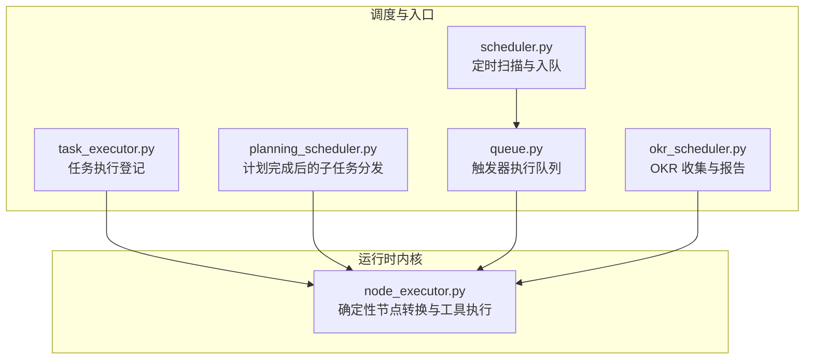
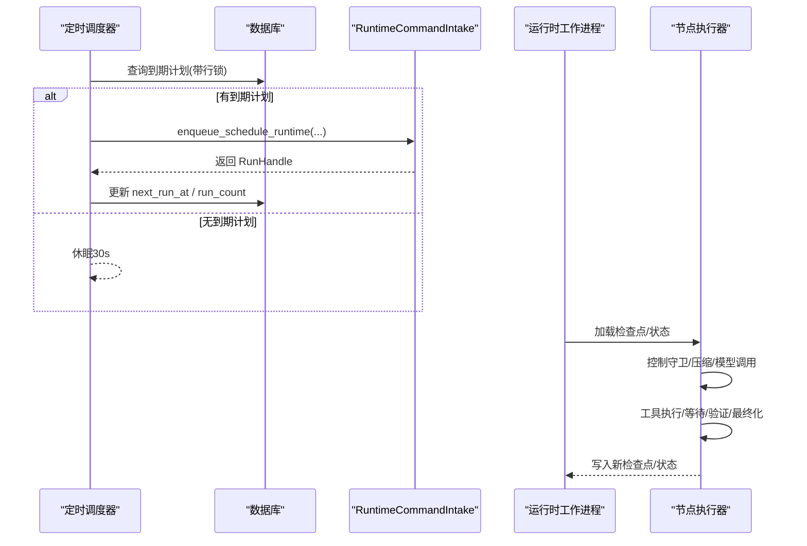
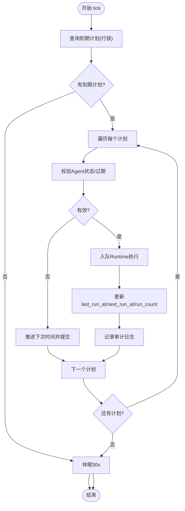
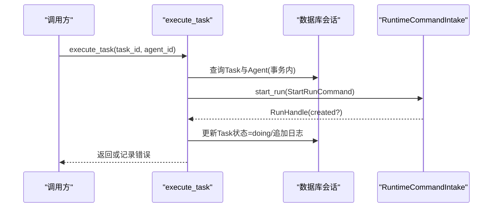
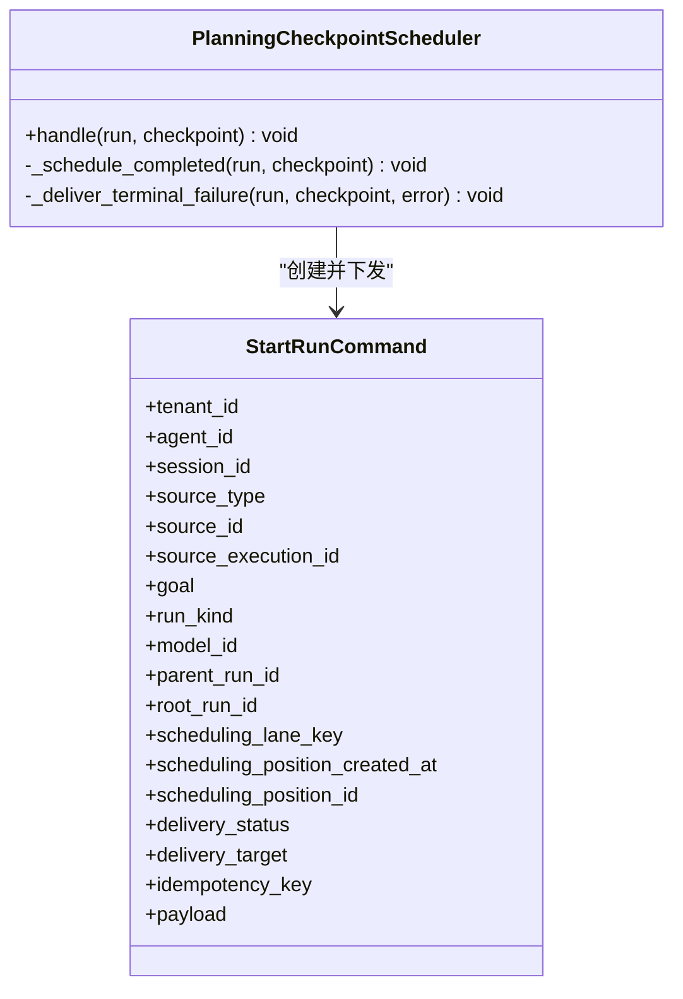
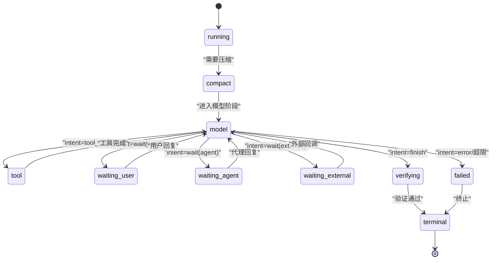
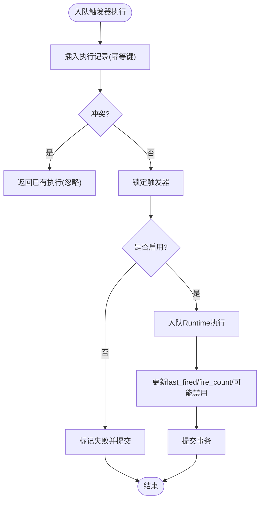
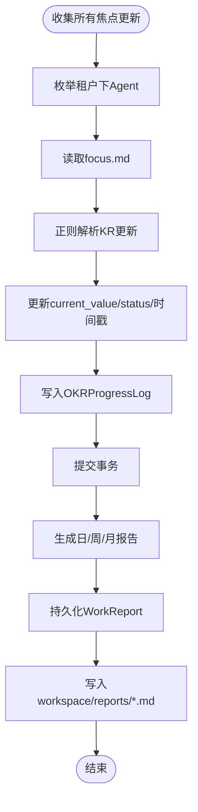
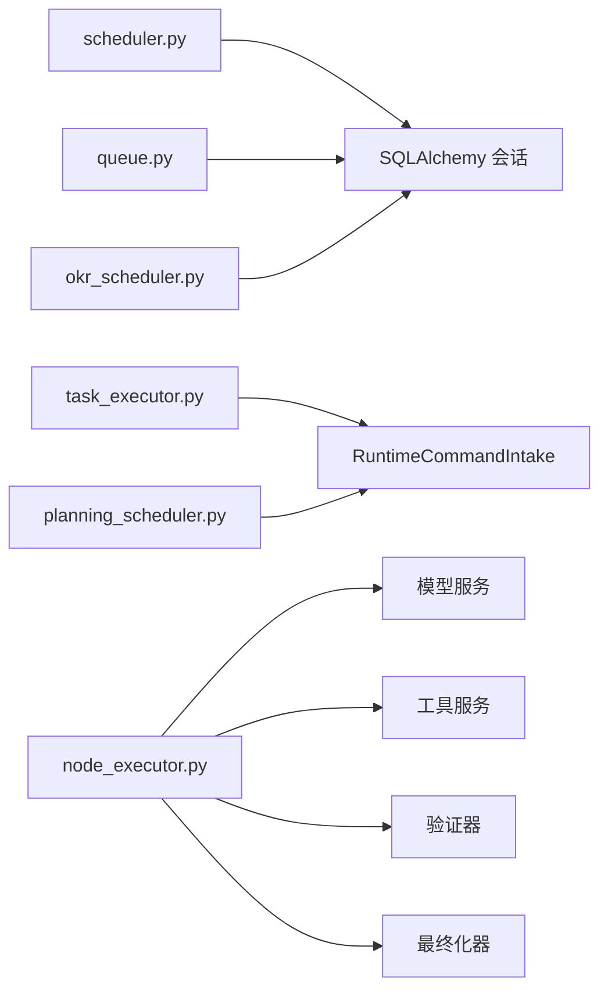

# 执行调度器

<cite>
**本文引用的文件**   
- [scheduler.py](file://backend/app/services/scheduler.py)
- [task_executor.py](file://backend/app/services/task_executor.py)
- [planning_scheduler.py](file://backend/app/services/agent_runtime/planning_scheduler.py)
- [node_executor.py](file://backend/app/services/agent_runtime/node_executor.py)
- [queue.py](file://backend/app/services/trigger_runtime/queue.py)
- [okr_scheduler.py](file://backend/app/services/okr_scheduler.py)
</cite>

## 目录
1. [简介](#简介)
2. [项目结构](#项目结构)
3. [核心组件](#核心组件)
4. [架构总览](#架构总览)
5. [详细组件分析](#详细组件分析)
6. [依赖关系分析](#依赖关系分析)
7. [性能考虑](#性能考虑)
8. [故障排查指南](#故障排查指南)
9. [结论](#结论)
10. [附录](#附录)

## 简介
本技术文档围绕 Clawith 的执行调度器，系统性阐述异步任务调度机制、并发控制策略、资源分配算法与优先级管理、负载均衡、死锁检测与预防、超时控制、重试策略配置与失败恢复流程，并覆盖分布式任务协调、队列管理与监控告警。同时给出调度性能调优、资源利用率优化与故障恢复最佳实践，帮助读者从整体到细节全面理解系统设计与实现。

## 项目结构
执行调度相关代码主要位于后端 services 层：
- 轻量级定时调度器（Cron）：scheduler.py
- 任务执行入口（Task）：task_executor.py
- 计划编排调度（Planning v2）：planning_scheduler.py
- 运行时节点执行器（确定性状态机）：node_executor.py
- 触发器执行队列（Trigger）：queue.py
- OKR 周期报告与收集：okr_scheduler.py

**图表来源** 
- [scheduler.py:1-125](file://backend/app/services/scheduler.py#L1-L125)
- [task_executor.py:1-202](file://backend/app/services/task_executor.py#L1-L202)
- [planning_scheduler.py:1-549](file://backend/app/services/agent_runtime/planning_scheduler.py#L1-L549)
- [node_executor.py:1-800](file://backend/app/services/agent_runtime/node_executor.py#L1-L800)
- [queue.py:1-186](file://backend/app/services/trigger_runtime/queue.py#L1-L186)
- [okr_scheduler.py:1-800](file://backend/app/services/okr_scheduler.py#L1-L800)

**章节来源**
- [scheduler.py:1-125](file://backend/app/services/scheduler.py#L1-L125)
- [task_executor.py:1-202](file://backend/app/services/task_executor.py#L1-L202)
- [planning_scheduler.py:1-549](file://backend/app/services/agent_runtime/planning_scheduler.py#L1-L549)
- [node_executor.py:1-800](file://backend/app/services/agent_runtime/node_executor.py#L1-L800)
- [queue.py:1-186](file://backend/app/services/trigger_runtime/queue.py#L1-L186)
- [okr_scheduler.py:1-800](file://backend/app/services/okr_scheduler.py#L1-L800)

## 核心组件
- 轻量级 Cron 调度器：每 30 秒扫描到期计划，使用数据库行级锁避免重复执行，将触发事件入队至统一 Runtime。
- 任务执行入口：校验任务类型与 Agent 归属，构造 StartRunCommand 并通过 RuntimeCommandIntake 登记为后台运行。
- 计划编排调度：在 Planning v2 检查点稳定完成后，按候选参与者与群消息引用解析结果，批量创建子 Run 并设置调度车道与位置。
- 运行时节点执行器：基于确定性状态机驱动模型调用、工具执行、等待与终止；内置验证器与最终化器保证一致性。
- 触发器执行队列：原子插入执行记录与幂等键，支持 Webhook 去重、禁用触发器快速失败、最大触发次数限制。
- OKR 调度：周期性收集 focus.md 更新 KR 进度，生成日/周/月报告并持久化到数据库与工作区。

**章节来源**
- [scheduler.py:1-125](file://backend/app/services/scheduler.py#L1-L125)
- [task_executor.py:1-202](file://backend/app/services/task_executor.py#L1-L202)
- [planning_scheduler.py:1-549](file://backend/app/services/agent_runtime/planning_scheduler.py#L1-L549)
- [node_executor.py:1-800](file://backend/app/services/agent_runtime/node_executor.py#L1-L800)
- [queue.py:1-186](file://backend/app/services/trigger_runtime/queue.py#L1-L186)
- [okr_scheduler.py:1-800](file://backend/app/services/okr_scheduler.py#L1-L800)

## 架构总览
下图展示从“调度入口”到“运行时执行”的端到端流程，包括计划编排、任务登记、触发器入队与节点执行。

**图表来源** 
- [scheduler.py:27-117](file://backend/app/services/scheduler.py#L27-L117)
- [task_executor.py:42-121](file://backend/app/services/task_executor.py#L42-L121)
- [planning_scheduler.py:375-546](file://backend/app/services/agent_runtime/planning_scheduler.py#L375-L546)
- [node_executor.py:469-800](file://backend/app/services/agent_runtime/node_executor.py#L469-L800)

## 详细组件分析

### 轻量级 Cron 调度器（scheduler.py）
- 调度循环：每 30 秒执行一次 tick，查询 is_enabled 且 next_run_at <= now 的计划，使用 with_for_update(skip_locked=True) 避免多实例竞争。
- 执行前校验：检查 Agent 存在且未过期，状态允许运行；否则跳过并推进下次时间。
- 入队与审计：通过 enqueue_schedule_runtime 将 occurrence 入队，记录审计日志并更新 last_run_at、next_run_at、run_count。
- 错误处理：异常时回滚并记录审计日志，确保调度器健壮性。

**图表来源** 
- [scheduler.py:27-117](file://backend/app/services/scheduler.py#L27-L117)

**章节来源**
- [scheduler.py:1-125](file://backend/app/services/scheduler.py#L1-L125)

### 任务执行入口（task_executor.py）
- 类型校验：仅支持 todo 与 supervision 两类任务。
- 运行时决策：根据 decide_runtime_v2 决定是否走统一 Runtime v2。
- 参数构建：构造 StartRunCommand，包含 tenant_id、agent_id、source_type、goal、model_id、delivery_status、idempotency_key、payload 等。
- 事务与日志：在调用方事务中登记执行，成功则更新 Task 状态为 doing，并追加 TaskLog。

**图表来源** 
- [task_executor.py:163-202](file://backend/app/services/task_executor.py#L163-L202)
- [task_executor.py:42-121](file://backend/app/services/task_executor.py#L42-L121)

**章节来源**
- [task_executor.py:1-202](file://backend/app/services/task_executor.py#L1-L202)

### 计划编排调度（planning_scheduler.py）
- 触发条件：当 Planning v2 检查点状态为 completed 且 system_role 为 group_planning 时处理。
- 身份校验：严格校验根 Run、初始输入、触发消息、提及目标的一致性。
- 候选参与者：从 initial_input.candidate_agents 解析至少两个候选 Agent，确保唯一性。
- 批量创建子 Run：对每个 entry 生成 StartRunCommand，设置 scheduling_lane_key 与 position_created_at/id 以支持优先级与排序。
- 失败终态：若校验失败，投递 terminal 失败消息并尝试实时发布。

**图表来源** 
- [planning_scheduler.py:363-546](file://backend/app/services/agent_runtime/planning_scheduler.py#L363-L546)

**章节来源**
- [planning_scheduler.py:1-549](file://backend/app/services/agent_runtime/planning_scheduler.py#L1-L549)

### 运行时节点执行器（node_executor.py）
- 确定性状态机：维护 lifecycle.status、next_route、pending_tool_calls、waiting_request 等字段，驱动 compact/model/tool/verify/finalize 等阶段。
- 控制守卫：检查终止状态与取消信号，遇到取消立即抛出取消异常。
- 模型调用：限制 model_step_count，支持 text/finish/tool_calls/wait/error 意图，含协议修复与上限控制。
- 工具执行：通过 ToolStepService 执行待处理工具调用，支持等待外部/用户/代理响应。
- 验证与最终化：默认验证器检查空输出与未完成工具调用；最终化器生成摘要、上下文增量与交付请求。

**图表来源** 
- [node_executor.py:469-800](file://backend/app/services/agent_runtime/node_executor.py#L469-L800)

**章节来源**
- [node_executor.py:1-800](file://backend/app/services/agent_runtime/node_executor.py#L1-L800)

### 触发器执行队列（queue.py）
- 幂等性：使用 idempotency_key 去重，捕获 IntegrityError 后返回已存在执行记录。
- 原子性：嵌套事务插入执行记录，随后锁定触发器并决定启用/禁用。
- 失败快速路径：触发器被禁用或 Agent 不存在时直接标记失败并提交。
- Webhook 支持：从请求头或 body 哈希推导 delivery_key，保证外部事件幂等。

**图表来源** 
- [queue.py:60-153](file://backend/app/services/trigger_runtime/queue.py#L60-L153)

**章节来源**
- [queue.py:1-186](file://backend/app/services/trigger_runtime/queue.py#L1-L186)

### OKR 调度（okr_scheduler.py）
- 进度收集：读取各 Agent 的 focus.md，正则提取 KR ID、当前值与备注，更新 OKRKeyResult.current_value 与状态，并写入 OKRProgressLog。
- 报告生成：按频率计算周期，聚合 Objective/KR 数据，生成 Markdown 报告，持久化到 WorkReport 表与工作区文件。
- 容错设计：单 Agent 解析失败不影响整体批次，统计 updated/skipped/error 计数并返回操作结果。

**图表来源** 
- [okr_scheduler.py:104-260](file://backend/app/services/okr_scheduler.py#L104-L260)
- [okr_scheduler.py:487-590](file://backend/app/services/okr_scheduler.py#L487-L590)

**章节来源**
- [okr_scheduler.py:1-800](file://backend/app/services/okr_scheduler.py#L1-L800)

## 依赖关系分析
- 调度器与数据库：广泛使用 SQLAlchemy 异步会话与 select(...).with_for_update() 实现强一致性与防抖。
- 运行时集成：通过 RuntimeCommandIntake 统一接入 v2 运行时，支持父/根 Run 关系、调度车道与位置。
- 触发器与任务：均通过幂等键与唯一约束保障重复事件不重复执行。
- 节点执行器：依赖模型服务、工具服务、压缩器、验证器与最终化器等可插拔组件，形成高内聚低耦合。

**图表来源** 
- [scheduler.py:1-125](file://backend/app/services/scheduler.py#L1-L125)
- [task_executor.py:1-202](file://backend/app/services/task_executor.py#L1-L202)
- [planning_scheduler.py:1-549](file://backend/app/services/agent_runtime/planning_scheduler.py#L1-L549)
- [queue.py:1-186](file://backend/app/services/trigger_runtime/queue.py#L1-L186)
- [okr_scheduler.py:1-800](file://backend/app/services/okr_scheduler.py#L1-L800)
- [node_executor.py:1-800](file://backend/app/services/agent_runtime/node_executor.py#L1-L800)

**章节来源**
- [scheduler.py:1-125](file://backend/app/services/scheduler.py#L1-L125)
- [task_executor.py:1-202](file://backend/app/services/task_executor.py#L1-L202)
- [planning_scheduler.py:1-549](file://backend/app/services/agent_runtime/planning_scheduler.py#L1-L549)
- [queue.py:1-186](file://backend/app/services/trigger_runtime/queue.py#L1-L186)
- [okr_scheduler.py:1-800](file://backend/app/services/okr_scheduler.py#L1-L800)
- [node_executor.py:1-800](file://backend/app/services/agent_runtime/node_executor.py#L1-L800)

## 性能考虑
- 并发控制
  - 数据库行级锁：调度 tick 使用 with_for_update(skip_locked=True)，避免多实例争抢同一计划。
  - 幂等键与唯一约束：触发器与工具执行通过唯一索引防止重复执行与竞态。
  - 线程/进程隔离：节点执行器通过检查点与事务边界保证状态一致性。
- 资源分配与优先级
  - 调度车道与位置：planning_scheduler 为每个 entry 设置 scheduling_lane_key 与 position_created_at/id，支持按租户/Agent 分车道与时间顺序。
  - 模型步数限制：node_executor 限制 model_turn_limit，防止长尾占用。
- 超时与重试
  - 模型协议修复：text 意图支持有限次修复，超过阈值转为失败，避免无限重试。
  - 触发器最大触发次数：达到 max_fires 自动禁用，降低无效负载。
- 吞吐与延迟
  - 批量处理：OKR 收集与报告生成采用批处理与最小化 I/O。
  - 压缩策略：Thread Compact 在模型调用前压缩历史消息，减少上下文开销。

[本节为通用指导，无需特定文件引用]

## 故障排查指南
- 调度器 tick 异常
  - 现象：tick 报错但调度器继续运行
  - 排查：查看审计日志 schedule_error，确认 cron 表达式合法性与数据库连接
  - 参考：[scheduler.py:114-117](file://backend/app/services/scheduler.py#L114-L117)
- 任务执行登记失败
  - 现象：Task 未进入 doing 状态，出现错误日志
  - 排查：检查 task_type_unsupported、task_agent_mismatch、agent_tenant_missing、agent_model_missing 等错误码
  - 参考：[task_executor.py:20-80](file://backend/app/services/task_executor.py#L20-L80)
- 计划编排校验失败
  - 现象：Planning 检查点完成但未创建子 Run
  - 排查：检查 planning_identity_mismatch、planning_source_invalid、planning_entry_unavailable 等错误
  - 参考：[planning_scheduler.py:387-440](file://backend/app/services/agent_runtime/planning_scheduler.py#L387-L440)
- 触发器执行幂等与禁用
  - 现象：重复事件未重复执行或触发器被禁用
  - 排查：检查 IntegrityError 分支与 _mark_trigger_fired 逻辑
  - 参考：[queue.py:84-118](file://backend/app/services/trigger_runtime/queue.py#L84-L118)
- 节点执行器协议违规
  - 现象：模型反复 text 意图或 finish 为空导致失败
  - 排查：查看 model_protocol_repairs 计数与 repair_limit 配置
  - 参考：[node_executor.py:668-752](file://backend/app/services/agent_runtime/node_executor.py#L668-L752)

**章节来源**
- [scheduler.py:114-117](file://backend/app/services/scheduler.py#L114-L117)
- [task_executor.py:20-80](file://backend/app/services/task_executor.py#L20-L80)
- [planning_scheduler.py:387-440](file://backend/app/services/agent_runtime/planning_scheduler.py#L387-L440)
- [queue.py:84-118](file://backend/app/services/trigger_runtime/queue.py#L84-L118)
- [node_executor.py:668-752](file://backend/app/services/agent_runtime/node_executor.py#L668-L752)

## 结论
Clawith 的执行调度器以数据库为中心，结合幂等键、行级锁与检查点机制，实现了高可靠、可观测、可扩展的异步任务调度与执行体系。通过调度车道与位置、模型步数限制、协议修复与最终化器，系统在并发控制、优先级与一致性方面具备良好平衡。建议在生产环境中结合监控指标（tick 间隔、入队成功率、节点执行时长、失败率）持续优化，并根据业务峰值调整并发度与超时策略。

[本节为总结性内容，无需特定文件引用]

## 附录
- 关键术语
  - 调度车道（Scheduling Lane）：按租户/Agent 划分并行通道，避免跨域干扰
  - 幂等键（Idempotency Key）：保证相同事件只执行一次
  - 检查点（Checkpoint）：持久化的运行时状态快照，支持恢复与回溯
  - 协议修复（Protocol Repair）：针对模型输出不符合预期的有限次重试
- 最佳实践
  - 合理设置 cron 表达式与 tick 间隔，避免频繁扫描
  - 为高频触发器配置合理的 max_fires 与幂等键
  - 监控模型步数限制与修复次数，必要时调整模型能力或提示词
  - 使用审计日志与错误码定位问题，建立告警规则

[本节为补充信息，无需特定文件引用]