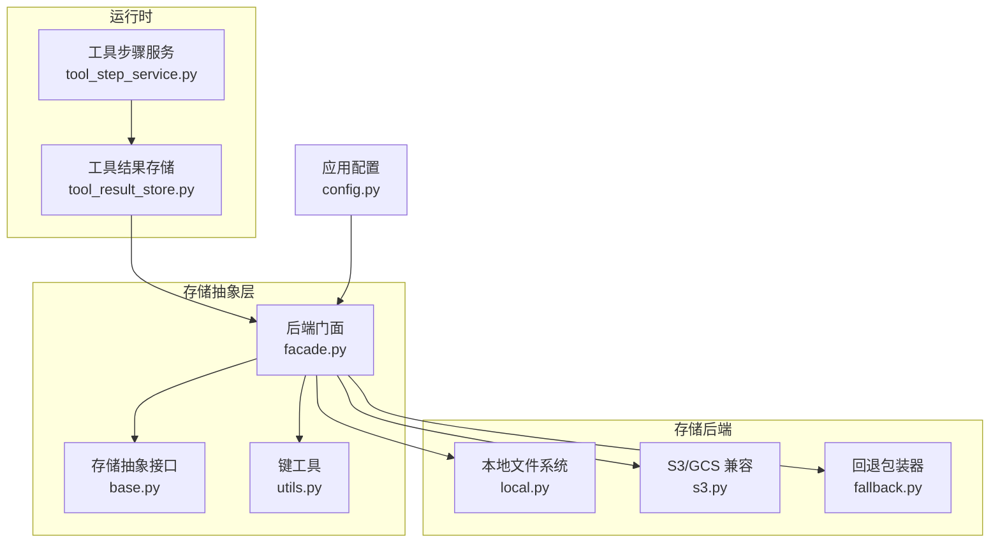
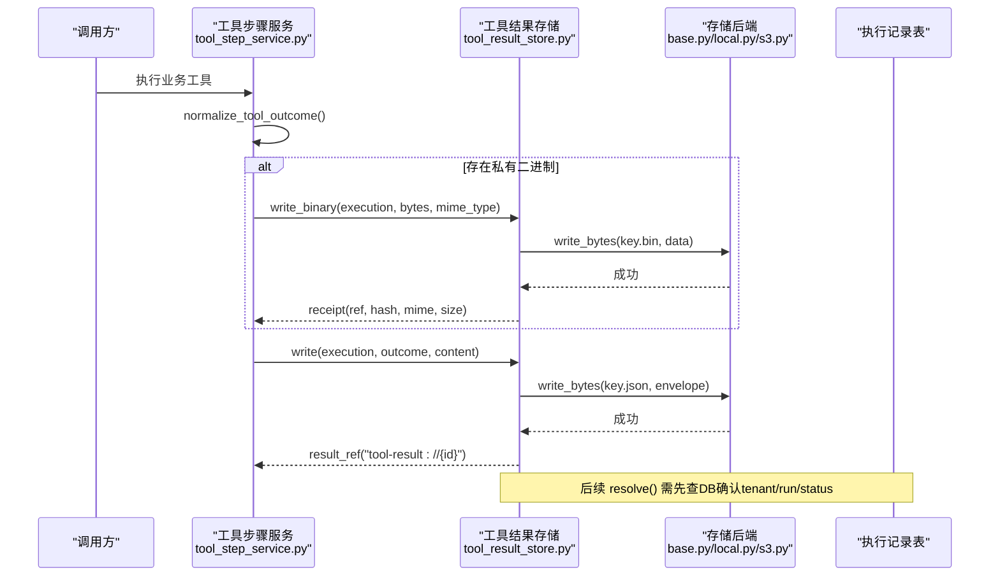
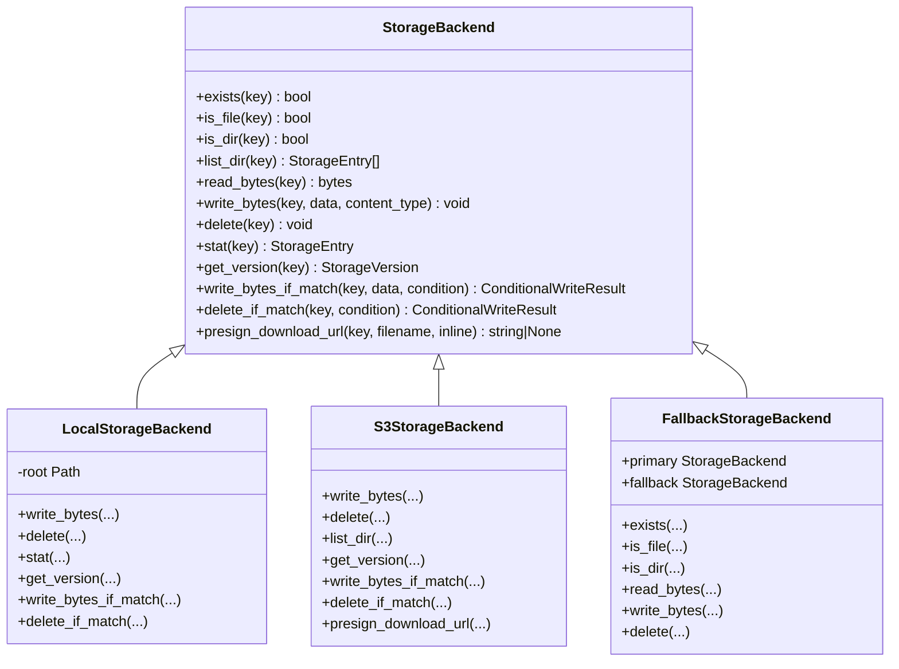
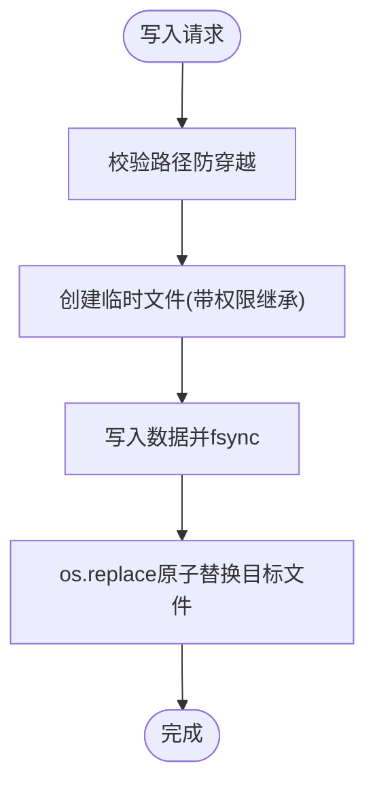
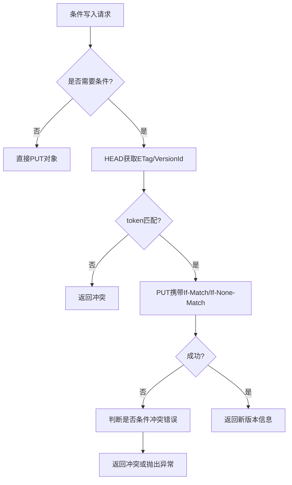
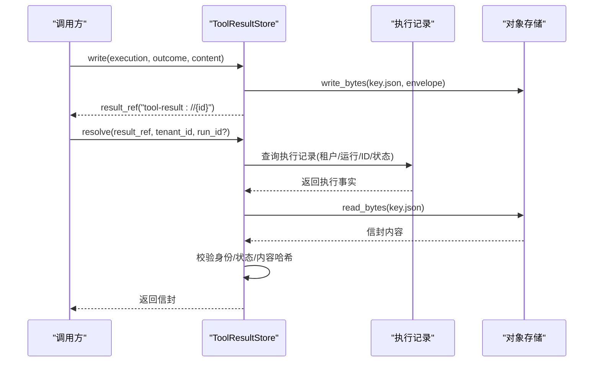
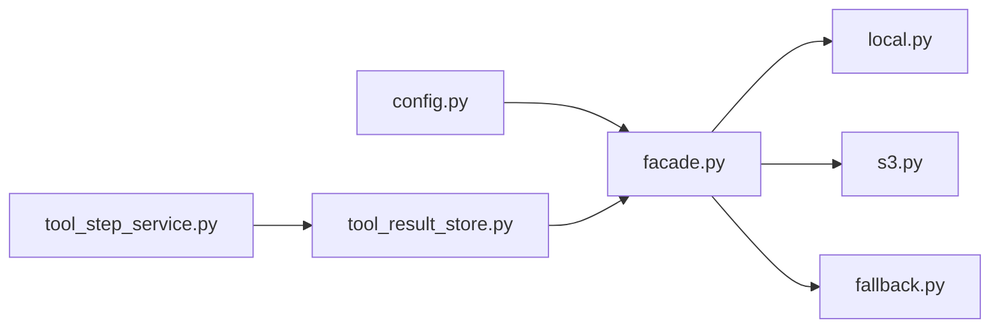

# 结果存储系统

<cite>
**本文引用的文件**   
- [tool_result_store.py](file://backend/app/services/agent_runtime/tool_result_store.py)
- [base.py](file://backend/app/services/storage_runtime/base.py)
- [local.py](file://backend/app/services/storage_runtime/local.py)
- [s3.py](file://backend/app/services/storage_runtime/s3.py)
- [fallback.py](file://backend/app/services/storage_runtime/fallback.py)
- [facade.py](file://backend/app/services/storage_runtime/facade.py)
- [utils.py](file://backend/app/services/storage_runtime/utils.py)
- [config.py](file://backend/app/config.py)
- [tool_step_service.py](file://backend/app/services/agent_runtime/tool_step_service.py)
- [test_storage_fallback.py](file://backend/tests/test_storage_fallback.py)
- [test_storage_conditional_atomicity.py](file://backend/tests/test_storage_conditional_atomicity.py)
- [test_storage_s3.py](file://backend/tests/test_storage_s3.py)
</cite>

## 目录
1. [简介](#简介)
2. [项目结构](#项目结构)
3. [核心组件](#核心组件)
4. [架构总览](#架构总览)
5. [详细组件分析](#详细组件分析)
6. [依赖关系分析](#依赖关系分析)
7. [性能与容量规划](#性能与容量规划)
8. [故障排查指南](#故障排查指南)
9. [结论](#结论)
10. [附录：配置项与键空间约定](#附录配置项与键空间约定)

## 简介
本技术文档围绕 Clawith 工具结果存储系统，系统性阐述其持久化机制、缓存策略、数据一致性、事务管理、备份恢复、多后端抽象与扩展、以及性能优化与容量规划。该系统以“确定性的结果信封 + 二进制证据分离”为核心设计，结合本地文件系统与 S3 兼容对象存储双后端，提供强一致的条件写入、版本令牌、完整性校验与离线对账能力，确保工具执行结果的可靠性与可追溯性。

## 项目结构
存储子系统位于 backend/app/services/storage_runtime 与 backend/app/services/agent_runtime/tool_result_store.py 中，配合配置模块统一选择后端。关键组织方式如下：
- 存储抽象与实现：base.py（接口）、local.py（本地磁盘）、s3.py（S3/GCS 兼容）、fallback.py（主从回退）
- 门面与工具：facade.py（后端选择与内容类型推断）、utils.py（键规范化与命名前缀）
- 工具结果存储：tool_result_store.py（信封与二进制归档、解析与对账）
- 调用入口：tool_step_service.py（将工具结果归一化后写入存储）
- 配置：config.py（环境变量驱动的后端选择与参数）

**图表来源** 
- [tool_step_service.py:733-793](file://backend/app/services/agent_runtime/tool_step_service.py#L733-L793)
- [tool_result_store.py:190-348](file://backend/app/services/agent_runtime/tool_result_store.py#L190-L348)
- [base.py:51-146](file://backend/app/services/storage_runtime/base.py#L51-L146)
- [local.py:28-116](file://backend/app/services/storage_runtime/local.py#L28-L116)
- [s3.py:21-110](file://backend/app/services/storage_runtime/s3.py#L21-L110)
- [fallback.py:16-35](file://backend/app/services/storage_runtime/fallback.py#L16-L35)
- [facade.py:34-60](file://backend/app/services/storage_runtime/facade.py#L34-L60)
- [utils.py:4-16](file://backend/app/services/storage_runtime/utils.py#L4-L16)
- [config.py:105-119](file://backend/app/config.py#L105-L119)

**章节来源**
- [tool_result_store.py:190-348](file://backend/app/services/agent_runtime/tool_result_store.py#L190-L348)
- [base.py:51-146](file://backend/app/services/storage_runtime/base.py#L51-L146)
- [local.py:28-116](file://backend/app/services/storage_runtime/local.py#L28-L116)
- [s3.py:21-110](file://backend/app/services/storage_runtime/s3.py#L21-L110)
- [fallback.py:16-35](file://backend/app/services/storage_runtime/fallback.py#L16-L35)
- [facade.py:34-60](file://backend/app/services/storage_runtime/facade.py#L34-L60)
- [utils.py:4-16](file://backend/app/services/storage_runtime/utils.py#L4-L16)
- [config.py:105-119](file://backend/app/config.py#L105-L119)

## 核心组件
- 存储抽象接口 StorageBackend：定义 exists/is_file/is_dir/list_dir/read/write/delete/stat/get_version 等能力，并提供条件写入 write_bytes_if_match 与 delete_if_match 的通用实现，支持 version_token 与 require_absent 语义。
- 本地后端 LocalStorageBackend：基于 aiofiles 异步 I/O，原子写（临时文件 + fsync + os.replace），进程级互斥锁（fcntl.flock）保证跨进程安全；stat/get_version 计算内容哈希作为 etag/content_hash/version_id。
- S3 后端 S3StorageBackend：使用 boto3/aioboto3，支持 list_objects_v2 分页、Conditional Put/Delete（If-Match/If-None-Match）、预签名下载 URL、GCS 兼容路径与签名处理。
- 回退包装 FallbackStorageBackend：读优先走 primary，miss 时从 fallback 读取并回写至 primary，实现“渐进式迁移”。
- 门面 Facade get_storage_backend：根据配置选择 local 或 s3，并可组合 fallback 包装器。
- 工具结果存储 ToolResultStore：生成确定性信封（JSON）与二进制证据（image/*），通过 tenant/run/execution 三维度隔离，读写均做范围与完整性校验；ToolResultReconciler 负责过期“已启动”收据的对账与落库。

**章节来源**
- [base.py:51-146](file://backend/app/services/storage_runtime/base.py#L51-L146)
- [local.py:78-116](file://backend/app/services/storage_runtime/local.py#L78-L116)
- [s3.py:200-276](file://backend/app/services/storage_runtime/s3.py#L200-L276)
- [fallback.py:16-35](file://backend/app/services/storage_runtime/fallback.py#L16-L35)
- [facade.py:34-60](file://backend/app/services/storage_runtime/facade.py#L34-L60)
- [tool_result_store.py:190-348](file://backend/app/services/agent_runtime/tool_result_store.py#L190-L348)

## 架构总览
下图展示一次工具结果落盘的端到端流程：工具步骤服务归一化结果，必要时将二进制证据写入独立存储，随后由结果存储写入信封并返回引用；后续解析需先通过数据库事实校验所有权与状态，再读取并校验内容完整性。

**图表来源** 
- [tool_step_service.py:733-793](file://backend/app/services/agent_runtime/tool_step_service.py#L733-L793)
- [tool_result_store.py:245-295](file://backend/app/services/agent_runtime/tool_result_store.py#L245-L295)
- [base.py:71-76](file://backend/app/services/storage_runtime/base.py#L71-L76)
- [local.py:78-86](file://backend/app/services/storage_runtime/local.py#L78-L86)
- [s3.py:200-212](file://backend/app/services/storage_runtime/s3.py#L200-L212)

## 详细组件分析

### 存储抽象与条件写入
- StorageBackend 提供统一的读写与元信息接口，并通过 get_version 聚合 size/modified_at/etag/version_id/content_hash，供上层进行 CAS（Compare-And-Swap）语义。
- write_bytes_if_match 与 delete_if_match 默认实现基于当前版本 token 比较，S3 与 Local 分别利用 ETag/VersionId 或本地 stat+hash 增强一致性。

**图表来源** 
- [base.py:51-146](file://backend/app/services/storage_runtime/base.py#L51-L146)
- [local.py:28-116](file://backend/app/services/storage_runtime/local.py#L28-L116)
- [s3.py:21-110](file://backend/app/services/storage_runtime/s3.py#L21-L110)
- [fallback.py:16-35](file://backend/app/services/storage_runtime/fallback.py#L16-L35)

**章节来源**
- [base.py:51-146](file://backend/app/services/storage_runtime/base.py#L51-L146)
- [local.py:144-186](file://backend/app/services/storage_runtime/local.py#L144-L186)
- [s3.py:278-367](file://backend/app/services/storage_runtime/s3.py#L278-L367)

### 本地文件系统后端
- 原子写：临时文件写入 + fsync + os.replace，避免部分写入导致损坏。
- 并发安全：根目录级别 fcntl.flock 互斥锁，序列化跨进程变更。
- 版本令牌：stat 时间戳 + 文件大小 + 内容哈希，构成稳定 token。
- 删除树：递归删除但保护根目录不被误删。

**图表来源** 
- [local.py:228-248](file://backend/app/services/storage_runtime/local.py#L228-L248)

**章节来源**
- [local.py:78-116](file://backend/app/services/storage_runtime/local.py#L78-L116)
- [local.py:188-207](file://backend/app/services/storage_runtime/local.py#L188-L207)
- [local.py:228-248](file://backend/app/services/storage_runtime/local.py#L228-L248)

### S3/GCS 兼容后端
- 连接与配置：boto3/aioboto3 客户端复用，botocore Config 设置 addressing_style、signature_version、超时与连接池大小。
- 列表与统计：list_objects_v2 分页遍历，head_object 获取元信息；ETag/VersionId 用于条件操作。
- 条件写入/删除：If-Match/If-None-Match 头，冲突时返回 ConditionalWriteResult。
- 预签名下载：generate_presigned_url，针对 MinIO/GCS 做 URL 重写适配。

**图表来源** 
- [s3.py:278-367](file://backend/app/services/storage_runtime/s3.py#L278-L367)

**章节来源**
- [s3.py:21-110](file://backend/app/services/storage_runtime/s3.py#L21-L110)
- [s3.py:141-183](file://backend/app/services/storage_runtime/s3.py#L141-L183)
- [s3.py:200-212](file://backend/app/services/storage_runtime/s3.py#L200-L212)
- [s3.py:278-367](file://backend/app/services/storage_runtime/s3.py#L278-L367)
- [s3.py:388-409](file://backend/app/services/storage_runtime/s3.py#L388-L409)

### 回退包装器（渐进式迁移）
- 读路径：优先 primary，未命中则从 fallback 读取并回写 primary，逐步将旧数据迁移到新后端。
- 写路径：始终写入 primary，保证单一写源。

**章节来源**
- [fallback.py:16-35](file://backend/app/services/storage_runtime/fallback.py#L16-L35)

### 工具结果存储（信封与二进制）
- 信封（JSON）：包含 execution/tenant/run/tool_call_id/status/summary/artifact/evidence/metadata/content_hash/content，严格字段校验与 JSON 净化。
- 二进制（image/*）：独立 key 存储，receipt 含 ref/hash/mime/size；resolve 时需验证执行记录归属与状态，并对内容做 hash/size 双重校验。
- 对账（Reconciler）：扫描过期的“started”执行记录，仅当信封证明成功时才更新数据库为 succeeded，避免重复执行。

**图表来源** 
- [tool_result_store.py:245-295](file://backend/app/services/agent_runtime/tool_result_store.py#L245-L295)
- [tool_result_store.py:350-389](file://backend/app/services/agent_runtime/tool_result_store.py#L350-L389)
- [tool_result_store.py:409-437](file://backend/app/services/agent_runtime/tool_result_store.py#L409-L437)

**章节来源**
- [tool_result_store.py:190-348](file://backend/app/services/agent_runtime/tool_result_store.py#L190-L348)
- [tool_result_store.py:485-641](file://backend/app/services/agent_runtime/tool_result_store.py#L485-L641)

### 工具步骤服务集成点
- 在工具执行结算阶段，若结果包含私有二进制，则调用 write_binary 归档，并将 receipt 引用注入到 evidence_refs；失败时降级为失败结果并记录 archive_error_code。

**章节来源**
- [tool_step_service.py:733-793](file://backend/app/services/agent_runtime/tool_step_service.py#L733-L793)

## 依赖关系分析
- facade.get_storage_backend 依据配置决定后端实例，可能返回 S3 或 Local，或在启用回退时返回 Fallback(Local,S3)。
- tool_result_store 依赖 facade 获取后端，并通过 base 接口进行读写。
- 测试用例覆盖条件原子性与回退行为，验证 CAS 与迁移逻辑。

**图表来源** 
- [facade.py:34-60](file://backend/app/services/storage_runtime/facade.py#L34-L60)
- [config.py:105-119](file://backend/app/config.py#L105-L119)
- [tool_result_store.py:190-201](file://backend/app/services/agent_runtime/tool_result_store.py#L190-L201)
- [tool_step_service.py:733-793](file://backend/app/services/agent_runtime/tool_step_service.py#L733-L793)

**章节来源**
- [facade.py:34-60](file://backend/app/services/storage_runtime/facade.py#L34-L60)
- [config.py:105-119](file://backend/app/config.py#L105-L119)
- [test_storage_fallback.py:1-37](file://backend/tests/test_storage_fallback.py#L1-L37)
- [test_storage_conditional_atomicity.py:1-38](file://backend/tests/test_storage_conditional_atomicity.py#L1-L38)
- [test_storage_s3.py:1-94](file://backend/tests/test_storage_s3.py#L1-L94)

## 性能与容量规划
- 写入吞吐
  - 本地后端：单进程内原子写，跨进程通过根目录锁串行化；适合单机或小规模部署。
  - S3 后端：连接池 max_pool_connections 可调，建议按 QPS 与带宽评估；大对象直传，避免内存峰值。
- 读取延迟
  - 本地：顺序/随机 IO 取决于磁盘类型；stat/get_version 会触发全量读取计算哈希，冷路径注意开销。
  - S3：head_object 获取元信息快，get_object 受网络影响；合理使用 presign 直连下载减少代理转发。
- 条件写入
  - S3 条件 PUT/DELETE 需要 HEAD 获取 ETag，增加一次往返；批量场景可缓存版本 token。
- 压缩与分片
  - 当前二进制归档限制 image/*，体积通常可控；如需大文件分片上传，可在 S3 后端扩展 multipart 上传并在 facade 暴露 API。
- 容量规划
  - 键空间：runtime/tool-results/{tenant}/{run}/{id}.json/.bin，随执行增长线性扩张；建议按租户/日期分层归档。
  - 清理策略：结合执行生命周期与保留策略，定期删除过期 run 目录；S3 可使用生命周期规则自动归档/删除。
- 监控指标
  - 后端读写延迟、错误率、条件冲突率、S3 预签名命中率、本地磁盘使用率与 inode 占用。

[本节为通用指导，不直接分析具体文件]

## 故障排查指南
- 二进制不可用
  - 现象：resolve_binary 抛出不可用错误。
  - 排查：检查对象是否存在、网络连通性、S3 权限与 endpoint；核对 metadata 中的 content_hash/size。
- 完整性校验失败
  - 现象：content_hash 或 size 不一致。
  - 排查：确认写入路径未被篡改；检查 S3 服务端 ETag 与本地计算差异；定位写入链路日志。
- 条件写入冲突
  - 现象：ConditionalWriteResult.conflict=True。
  - 排查：确认 version_token 是否正确传递；S3 场景检查 ETag 有效性；重试策略应退避并重取版本。
- 回退迁移问题
  - 现象：读路径 miss 频繁或迁移停滞。
  - 排查：确认 primary/fallback 可达性；观察回写是否成功；检查权限与路径规范。
- 本地锁竞争
  - 现象：高并发写入阻塞。
  - 排查：降低并发或拆分根目录；评估磁盘 IO 瓶颈；考虑切换 S3 后端。

**章节来源**
- [tool_result_store.py:326-348](file://backend/app/services/agent_runtime/tool_result_store.py#L326-L348)
- [s3.py:278-367](file://backend/app/services/storage_runtime/s3.py#L278-L367)
- [local.py:188-207](file://backend/app/services/storage_runtime/local.py#L188-L207)
- [test_storage_conditional_atomicity.py:1-38](file://backend/tests/test_storage_conditional_atomicity.py#L1-L38)

## 结论
Clawith 的结果存储系统以“信封 + 二进制分离”、“租户/运行/执行三维度隔离”、“条件写入与版本令牌”、“离线对账”为核心，构建了高可靠、可扩展的工具结果持久化方案。通过本地与 S3 双后端抽象与回退包装，既满足单机快速迭代，也支撑云原生大规模部署。建议在生产环境开启 S3 后端，并结合生命周期策略与监控告警，持续优化性能与成本。

[本节为总结性内容，不直接分析具体文件]

## 附录：配置项与键空间约定
- 存储后端选择
  - STORAGE_BACKEND：local 或 s3
  - STORAGE_LOCAL_ROOT：本地根目录
  - STORAGE_LOCAL_FALLBACK_ENABLED：是否启用本地回退
  - S3_*：桶、区域、端点、密钥、前缀、预签名 TTL、连接池与写工作线程数
- 键空间约定
  - 文本信封：runtime/tool-results/{tenant}/{run}/{id}.json
  - 二进制证据：runtime/tool-results/{tenant}/{run}/{id}.bin
  - 工具结果引用：tool-result://{execution_id}
  - 二进制引用：tool-result-binary://{execution_id}
- 内容类型推断
  - 根据后缀猜测 Content-Type，.webp 强制映射 image/webp

**章节来源**
- [config.py:105-119](file://backend/app/config.py#L105-L119)
- [facade.py:71-78](file://backend/app/services/storage_runtime/facade.py#L71-L78)
- [tool_result_store.py:207-222](file://backend/app/services/agent_runtime/tool_result_store.py#L207-L222)
- [utils.py:4-16](file://backend/app/services/storage_runtime/utils.py#L4-L16)