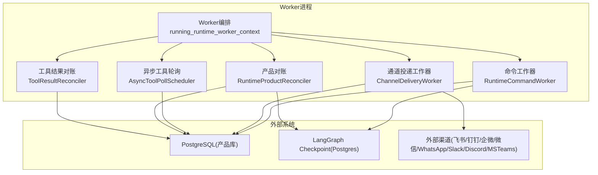
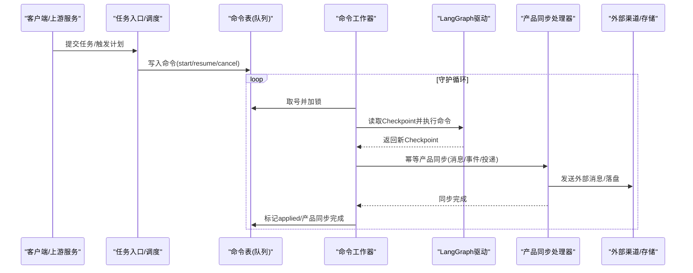
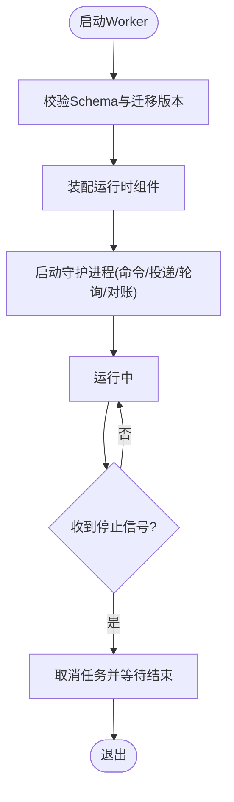
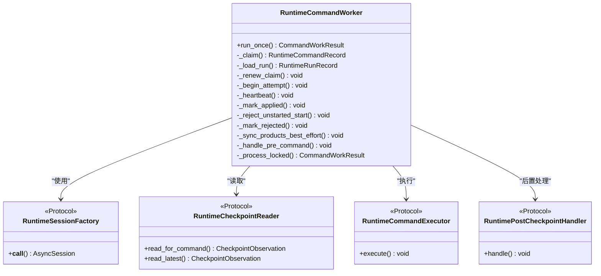
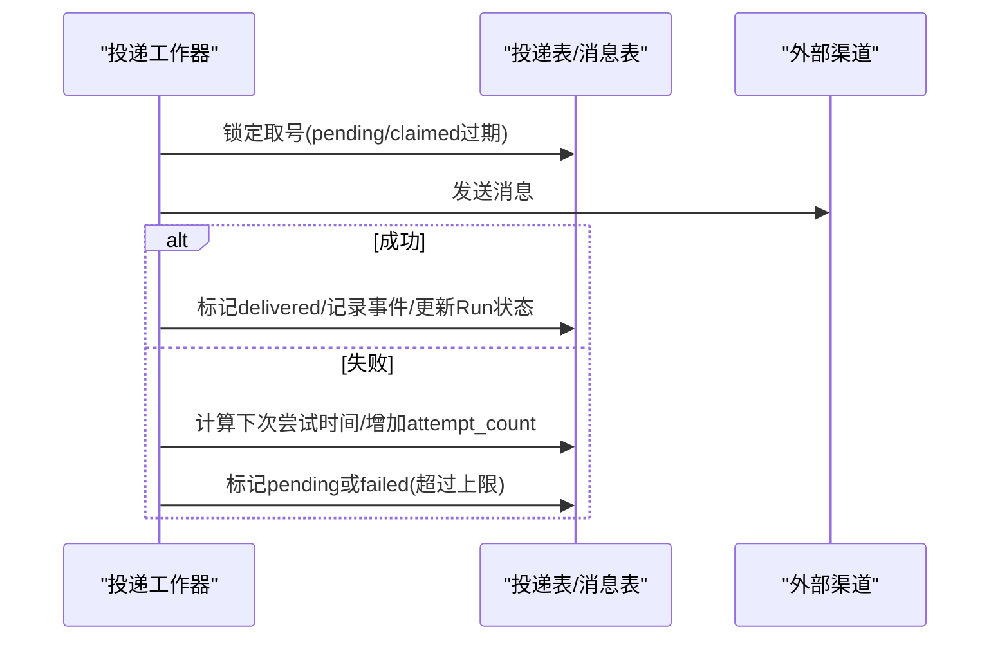
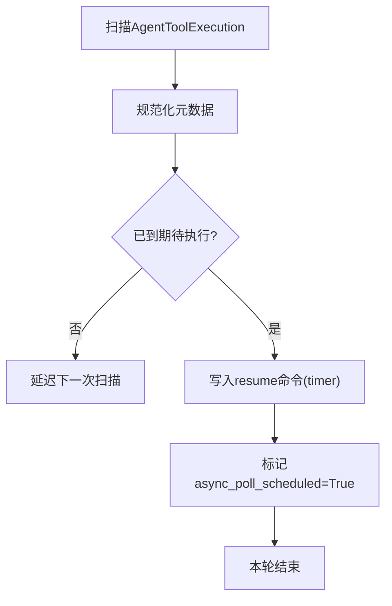
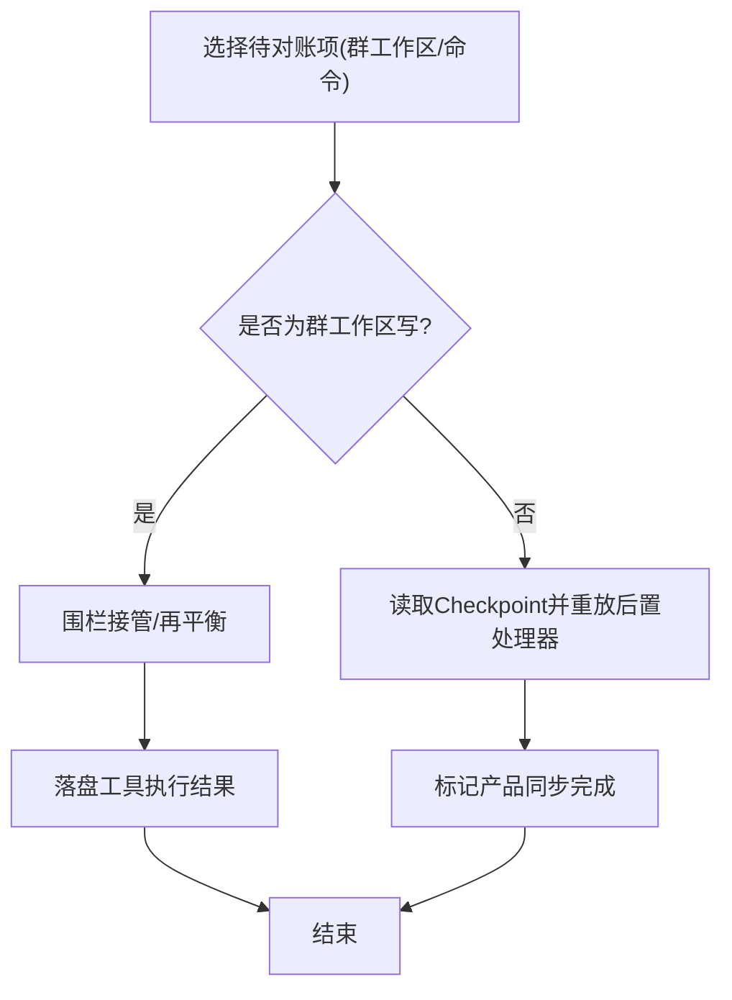
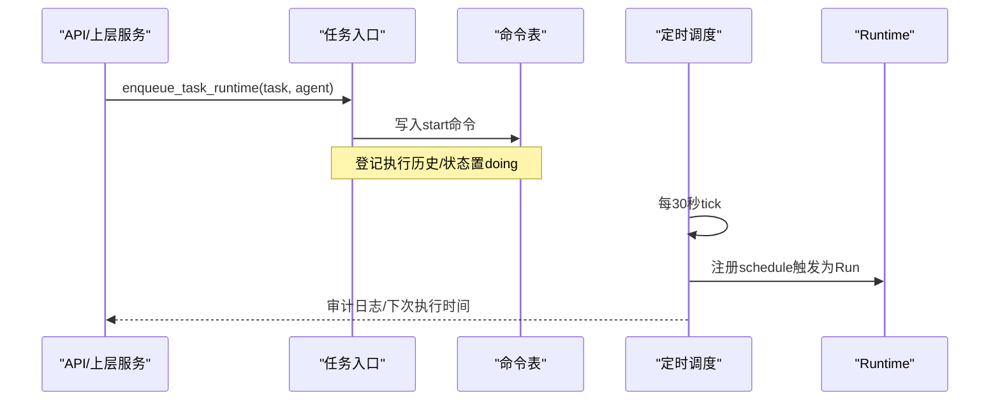
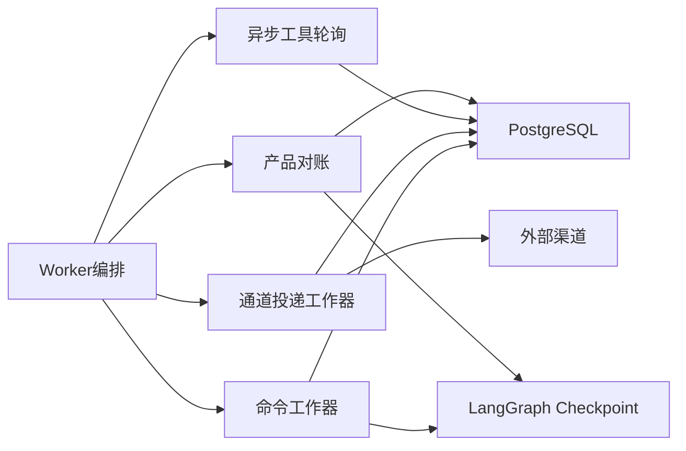

# Worker服务架构

<cite>
**本文引用的文件**   
- [worker_service.py](file://backend/app/services/agent_runtime/worker_service.py)
- [command_worker.py](file://backend/app/services/agent_runtime/command_worker.py)
- [channel_delivery.py](file://backend/app/services/agent_runtime/channel_delivery.py)
- [async_tool_poll.py](file://backend/app/services/agent_runtime/async_tool_poll.py)
- [product_reconciler.py](file://backend/app/services/agent_runtime/product_reconciler.py)
- [task_executor.py](file://backend/app/services/task_executor.py)
- [scheduler.py](file://backend/app/services/scheduler.py)
- [config.py](file://backend/app/config.py)
</cite>

## 目录
1. [引言](#引言)
2. [项目结构](#项目结构)
3. [核心组件](#核心组件)
4. [架构总览](#架构总览)
5. [详细组件分析](#详细组件分析)
6. [依赖关系分析](#依赖关系分析)
7. [性能与扩展性](#性能与扩展性)
8. [健康检查、监控与日志](#健康检查监控与日志)
9. [配置管理](#配置管理)
10. [部署模式与运维指南](#部署模式与运维指南)
11. [故障排查](#故障排查)
12. [结论](#结论)

## 引言
本文件面向Clawith的Worker服务架构，系统性阐述任务队列管理、负载均衡、故障转移、进程生命周期、任务分发与结果回传、水平扩容与资源隔离、健康检查与监控指标、日志记录、配置管理与部署运维等关键主题。文档以代码级事实为依据，辅以可视化图示，帮助读者从整体到细节全面理解Worker服务的运行机制与最佳实践。

## 项目结构
Worker服务位于后端Python应用中，围绕“持久化命令入队—可恢复执行—幂等产品同步”的核心思想构建。关键模块包括：
- Worker编排与守护进程：负责组装运行时组件、启动多类后台任务（命令消费、通道投递、异步工具轮询、产品对账、工具结果对账）。
- 命令工作器：基于数据库命令表实现分布式锁与重试、心跳续租、状态分类与幂等控制。
- 外部通道投递：独立于Graph执行的可靠出队与重试机制。
- 异步工具轮询：将声明式异步操作转为LangGraph定时器恢复调用。
- 产品对账：在Graph边界之外重放幂等产品副作用，保证最终一致性。
- 任务入口与调度：将Task与Cron触发纳入统一Runtime v2流程。
- 配置中心：集中管理运行时参数、并发度、超时与扫描间隔等。

**图表来源** 
- [worker_service.py:587-668](file://backend/app/services/agent_runtime/worker_service.py#L587-L668)
- [command_worker.py:312-800](file://backend/app/services/agent_runtime/command_worker.py#L312-L800)
- [channel_delivery.py:192-429](file://backend/app/services/agent_runtime/channel_delivery.py#L192-L429)
- [async_tool_poll.py:103-239](file://backend/app/services/agent_runtime/async_tool_poll.py#L103-L239)
- [product_reconciler.py:63-443](file://backend/app/services/agent_runtime/product_reconciler.py#L63-L443)

**章节来源**
- [worker_service.py:1-685](file://backend/app/services/agent_runtime/worker_service.py#L1-L685)
- [command_worker.py:1-800](file://backend/app/services/agent_runtime/command_worker.py#L1-L800)
- [channel_delivery.py:1-429](file://backend/app/services/agent_runtime/channel_delivery.py#L1-L429)
- [async_tool_poll.py:1-239](file://backend/app/services/agent_runtime/async_tool_poll.py#L1-L239)
- [product_reconciler.py:1-443](file://backend/app/services/agent_runtime/product_reconciler.py#L1-L443)

## 核心组件
- Worker编排与上下文：提供运行期组件装配、Schema就绪校验、Checkpointer生命周期管理、以及守护进程的启动与优雅关闭。
- 命令工作器：从命令表取号、加锁、读取Checkpoint、执行命令、标记应用、幂等产品同步、拒绝处理与重试策略。
- 通道投递工作器：从投递表取号、发送外部消息、失败重试与指数退避、事件落盘与Run状态更新。
- 异步工具轮询：扫描待轮询的工具执行记录，生成定时器恢复命令并写入命令表。
- 产品对账：对已应用但未完成产品同步的命令进行幂等重放；对群工作区写操作进行围栏与再平衡。
- 工具结果对账：在不重新执行工具的前提下，恢复归档结果，确保工具执行状态一致。
- 任务入口：将Task类型任务转入统一Runtime v2流程，构造StartRunCommand并登记执行历史。
- 定时调度：每30秒扫描到期计划，将触发事件注册为Runtime Run。

**章节来源**
- [worker_service.py:201-353](file://backend/app/services/agent_runtime/worker_service.py#L201-L353)
- [command_worker.py:312-800](file://backend/app/services/agent_runtime/command_worker.py#L312-L800)
- [channel_delivery.py:192-429](file://backend/app/services/agent_runtime/channel_delivery.py#L192-L429)
- [async_tool_poll.py:103-239](file://backend/app/services/agent_runtime/async_tool_poll.py#L103-L239)
- [product_reconciler.py:63-443](file://backend/app/services/agent_runtime/product_reconciler.py#L63-L443)
- [task_executor.py:42-121](file://backend/app/services/task_executor.py#L42-L121)
- [scheduler.py:27-125](file://backend/app/services/scheduler.py#L27-L125)

## 架构总览
Worker采用“命令驱动+持久化Checkpoint+幂等产品同步”的三段式架构：
- 命令驱动：所有变更通过命令表（start/resume/cancel）进入，具备重试、限流与幂等保障。
- 持久化Checkpoint：LangGraph驱动的图状态持久化，支持断点续跑与确定性回放。
- 幂等产品同步：在Graph边界外，对产物（消息、事件、会话上下文、外部投递等）进行幂等重放，避免重复副作用。

**图表来源** 
- [task_executor.py:42-121](file://backend/app/services/task_executor.py#L42-L121)
- [scheduler.py:27-125](file://backend/app/services/scheduler.py#L27-L125)
- [command_worker.py:312-800](file://backend/app/services/agent_runtime/command_worker.py#L312-L800)
- [product_reconciler.py:63-443](file://backend/app/services/agent_runtime/product_reconciler.py#L63-L443)

## 详细组件分析

### Worker编排与守护进程
- 组件装配：构建Graph、Planning Graph、节点执行器、驱动、命令工作器、异步工具轮询、产品对账、通道投递、会话上下文压缩扫描等。
- Schema就绪校验：检查产品表与Checkpoint迁移版本，不满足则阻止启动。
- 守护进程：按配置并发度启动多个命令消费者；同时启动会话上下文压缩、通道投递、异步工具轮询、产品对账、工具结果对账等后台任务；统一停止信号与优雅退出。

**图表来源** 
- [worker_service.py:549-668](file://backend/app/services/agent_runtime/worker_service.py#L549-L668)
- [worker_service.py:164-200](file://backend/app/services/agent_runtime/worker_service.py#L164-L200)

**章节来源**
- [worker_service.py:201-353](file://backend/app/services/agent_runtime/worker_service.py#L201-L353)
- [worker_service.py:549-668](file://backend/app/services/agent_runtime/worker_service.py#L549-L668)

### 命令工作器（任务分发与结果回传）
- 取号与加锁：从命令表取下一条未处理命令，设置claimant与TTL，周期性续租。
- 状态分类：根据Checkpoint的lifecycle、next_nodes、tasks、interrupts判定是否可执行、等待或终端。
- 执行与幂等：通过驱动执行命令，验证Checkpoint元数据一致性，确保幂等。
- 产品同步：在Graph边界外调用后置处理器，完成消息、事件、会话上下文等幂等副作用。
- 拒绝与重试：对不支持/非法/已终止等场景给出稳定错误码，必要时释放claim并允许重试。

**图表来源** 
- [command_worker.py:312-800](file://backend/app/services/agent_runtime/command_worker.py#L312-L800)

**章节来源**
- [command_worker.py:312-800](file://backend/app/services/agent_runtime/command_worker.py#L312-L800)

### 外部通道投递（结果回传）
- 投递路由：校验渠道与目标合法性，绑定会话与Run信息。
- 出队与发送：按优先级与过期时间取号，幂等发送外部消息，记录provider_message_id。
- 失败重试：指数退避，达到最大尝试次数后标记失败并记录事件。
- 状态更新：仅影响Run的delivery_status，不触发Graph重入。

**图表来源** 
- [channel_delivery.py:192-429](file://backend/app/services/agent_runtime/channel_delivery.py#L192-L429)

**章节来源**
- [channel_delivery.py:192-429](file://backend/app/services/agent_runtime/channel_delivery.py#L192-L429)

### 异步工具轮询（定时器恢复）
- 扫描候选：查找处于started且标记为异步待处理的工具执行记录。
- 规范化元数据：补齐due_at、correlation_id、poll_call_id等字段。
- 生成恢复命令：将定时器恢复写入命令表，确保幂等与可追踪。

**图表来源** 
- [async_tool_poll.py:103-239](file://backend/app/services/agent_runtime/async_tool_poll.py#L103-L239)

**章节来源**
- [async_tool_poll.py:103-239](file://backend/app/services/agent_runtime/async_tool_poll.py#L103-L239)

### 产品对账（最终一致性）
- 优先处理群工作区写操作的围栏与再平衡，避免并发冲突。
- 对已应用但未完成产品同步的命令，读取Checkpoint并幂等重放后置处理器。
- 记录对账结果与错误码，支持重试与隔离。

**图表来源** 
- [product_reconciler.py:63-443](file://backend/app/services/agent_runtime/product_reconciler.py#L63-L443)

**章节来源**
- [product_reconciler.py:63-443](file://backend/app/services/agent_runtime/product_reconciler.py#L63-L443)

### 任务入口与定时调度
- 任务入口：校验任务类型、租户与模型配置，构造StartRunCommand并登记执行历史。
- 定时调度：每30秒扫描到期计划，若Agent可用则注册为Runtime Run，并记录审计日志。

**图表来源** 
- [task_executor.py:42-121](file://backend/app/services/task_executor.py#L42-L121)
- [scheduler.py:27-125](file://backend/app/services/scheduler.py#L27-L125)

**章节来源**
- [task_executor.py:42-121](file://backend/app/services/task_executor.py#L42-L121)
- [scheduler.py:27-125](file://backend/app/services/scheduler.py#L27-L125)

## 依赖关系分析
- 组件内聚与耦合：
  - Worker编排高内聚地装配各子组件，降低外部依赖复杂度。
  - 命令工作器通过Protocol抽象解耦Checkpoint读取与命令执行。
  - 通道投递与异步轮询独立于Graph执行，避免副作用重入。
- 外部依赖：
  - PostgreSQL承载命令表、投递表、工具执行表、会话上下文等。
  - LangGraph Checkpoint（Postgres）用于图状态持久化与断点续跑。
  - 外部渠道（飞书、钉钉、企微、微信、WhatsApp、Slack、Discord、MSTeams）通过投递工作器可靠送达。
- 潜在循环依赖：
  - 通过Protocol与接口隔离，避免直接循环导入。
  - 产品对账仅在Graph边界外重放，不反向依赖Graph执行路径。

**图表来源** 
- [worker_service.py:201-353](file://backend/app/services/agent_runtime/worker_service.py#L201-L353)
- [command_worker.py:312-800](file://backend/app/services/agent_runtime/command_worker.py#L312-L800)
- [channel_delivery.py:192-429](file://backend/app/services/agent_runtime/channel_delivery.py#L192-L429)
- [async_tool_poll.py:103-239](file://backend/app/services/agent_runtime/async_tool_poll.py#L103-L239)
- [product_reconciler.py:63-443](file://backend/app/services/agent_runtime/product_reconciler.py#L63-L443)

**章节来源**
- [worker_service.py:201-353](file://backend/app/services/agent_runtime/worker_service.py#L201-L353)
- [command_worker.py:312-800](file://backend/app/services/agent_runtime/command_worker.py#L312-L800)
- [channel_delivery.py:192-429](file://backend/app/services/agent_runtime/channel_delivery.py#L192-L429)
- [async_tool_poll.py:103-239](file://backend/app/services/agent_runtime/async_tool_poll.py#L103-L239)
- [product_reconciler.py:63-443](file://backend/app/services/agent_runtime/product_reconciler.py#L63-L443)

## 性能与扩展性
- 水平扩容策略：
  - 命令消费者并发度由配置控制，每个Worker进程独立claim与心跳续租，天然支持多实例横向扩展。
  - 通道投递、异步轮询、产品对账、工具结果对账均为独立守护进程，可按负载单独扩缩容。
- 资源隔离：
  - 不同守护进程职责单一，避免相互阻塞；失败隔离（异常不影响其他守护进程）。
  - 数据库层面通过with_for_update(skip_locked=True)实现无锁竞争与公平排队。
- 吞吐优化：
  - 批量扫描与限制limit减少数据库压力。
  - 指数退避与最小扫描间隔平衡实时性与资源消耗。
- 容量规划建议：
  - 根据AGENT_RUNTIME_COMMAND_CONCURRENCY与外部渠道QPS调整进程数。
  - 针对长尾任务与外部依赖延迟，适当增大扫描间隔与重试上限。

[本节为通用指导，无需特定文件引用]

## 健康检查、监控与日志
- 健康检查：
  - 启动时校验产品表与Checkpoint迁移版本，缺失或版本不一致则拒绝启动。
  - 守护进程内部异常捕获与日志输出，便于外部探针检测存活。
- 监控指标（建议采集）：
  - 命令队列长度、applied/rejected/retry计数、平均处理耗时。
  - 投递成功率、失败原因分布、重试次数与退避曲线。
  - 异步轮询调度频率、定时器恢复数量。
  - 产品对账成功率、隔离与重试比例。
  - 数据库连接池使用率、慢查询与锁等待。
- 日志记录：
  - 结构化日志包含trace_id、run_id、command_id、checkpoint_id等上下文。
  - 关键路径异常均记录堆栈与业务错误码，便于定位与告警。

**章节来源**
- [worker_service.py:164-200](file://backend/app/services/agent_runtime/worker_service.py#L164-L200)
- [command_worker.py:312-800](file://backend/app/services/agent_runtime/command_worker.py#L312-L800)
- [channel_delivery.py:192-429](file://backend/app/services/agent_runtime/channel_delivery.py#L192-L429)
- [async_tool_poll.py:103-239](file://backend/app/services/agent_runtime/async_tool_poll.py#L103-L239)
- [product_reconciler.py:63-443](file://backend/app/services/agent_runtime/product_reconciler.py#L63-L443)

## 配置管理
- 关键运行时配置：
  - AGENT_RUNTIME_COMMAND_CONCURRENCY：单进程命令并发度。
  - AGENT_RUNTIME_COMMAND_CLAIM_TTL_SECONDS / RENEW_SECONDS：命令认领TTL与续租间隔。
  - AGENT_RUNTIME_ASYNC_TOOL_POLL_SCAN_SECONDS / CHANNEL_DELIVERY_SCAN_SECONDS：扫描间隔。
  - AGENT_RUNTIME_CHANNEL_DELIVERY_MAX_ATTEMPTS / CLAIM_TTL_SECONDS：投递重试与认领TTL。
  - LANGGRAPH_CHECKPOINT_DATABASE_URL / AES_KEY：Checkpoint存储与加密。
  - AGENT_RUNTIME_GRAPH_NAME / VERSION：图标识。
- 配置校验：
  - 非空校验、取值范围校验、依赖关系校验（如RENEW < TTL）。
- 环境变量加载：
  - 支持.env与相对路径.env文件，大小写敏感，忽略多余字段。

**章节来源**
- [config.py:79-268](file://backend/app/config.py#L79-L268)

## 部署模式与运维指南
- 部署模式：
  - 单进程多守护线程：适合中小规模，易于调试与观测。
  - 多进程水平扩展：按负载拆分命令消费者与各类守护进程，分别扩缩容。
- 启动流程：
  - 初始化Settings与数据库连接。
  - 校验Schema与Checkpoint迁移版本。
  - 装配组件并启动守护进程。
  - 监听停止信号，优雅关闭所有任务。
- 运维要点：
  - 监控命令队列积压与投递失败率。
  - 定期清理过期Checkpoint与归档数据。
  - 关注外部渠道限流与认证密钥轮换。
  - 数据库连接池与慢查询优化。

**章节来源**
- [worker_service.py:549-668](file://backend/app/services/agent_runtime/worker_service.py#L549-L668)
- [config.py:79-268](file://backend/app/config.py#L79-L268)

## 故障排查
- 常见错误与处理：
  - 产品表缺失或Checkpoint迁移版本不匹配：检查迁移脚本与数据库连通性。
  - 命令认领失败或心跳续租失败：检查数据库锁与网络抖动，确认claimant唯一性。
  - 投递失败：查看错误码与URL/Bearer脱敏日志，核对渠道配置与限流。
  - 异步轮询未触发：检查元数据规范化与due_at计算逻辑。
  - 产品对账卡住：观察隔离与围栏状态，确认群工作区作用域可用性。
- 诊断步骤：
  - 查看守护进程日志与trace_id关联的上下游链路。
  - 检查命令表、投递表、工具执行表的最新状态与错误码。
  - 核对Checkpoint元数据一致性（run_id、command_id）。
  - 评估数据库锁等待与连接池使用情况。

**章节来源**
- [command_worker.py:312-800](file://backend/app/services/agent_runtime/command_worker.py#L312-L800)
- [channel_delivery.py:192-429](file://backend/app/services/agent_runtime/channel_delivery.py#L192-L429)
- [async_tool_poll.py:103-239](file://backend/app/services/agent_runtime/async_tool_poll.py#L103-L239)
- [product_reconciler.py:63-443](file://backend/app/services/agent_runtime/product_reconciler.py#L63-L443)

## 结论
Clawith的Worker服务以“命令驱动+持久化Checkpoint+幂等产品同步”为核心，实现了高可靠的任务队列管理、灵活的负载均衡与健壮的故障转移。通过多守护进程的职责分离与数据库层面的无锁竞争，系统在水平扩展与资源隔离方面具备良好表现。配合完善的健康检查、监控指标与日志记录，可在生产环境中稳定运行并快速定位问题。合理配置并发度、扫描间隔与重试策略，结合外部依赖的限流与鉴权管理，可进一步提升吞吐与可靠性。