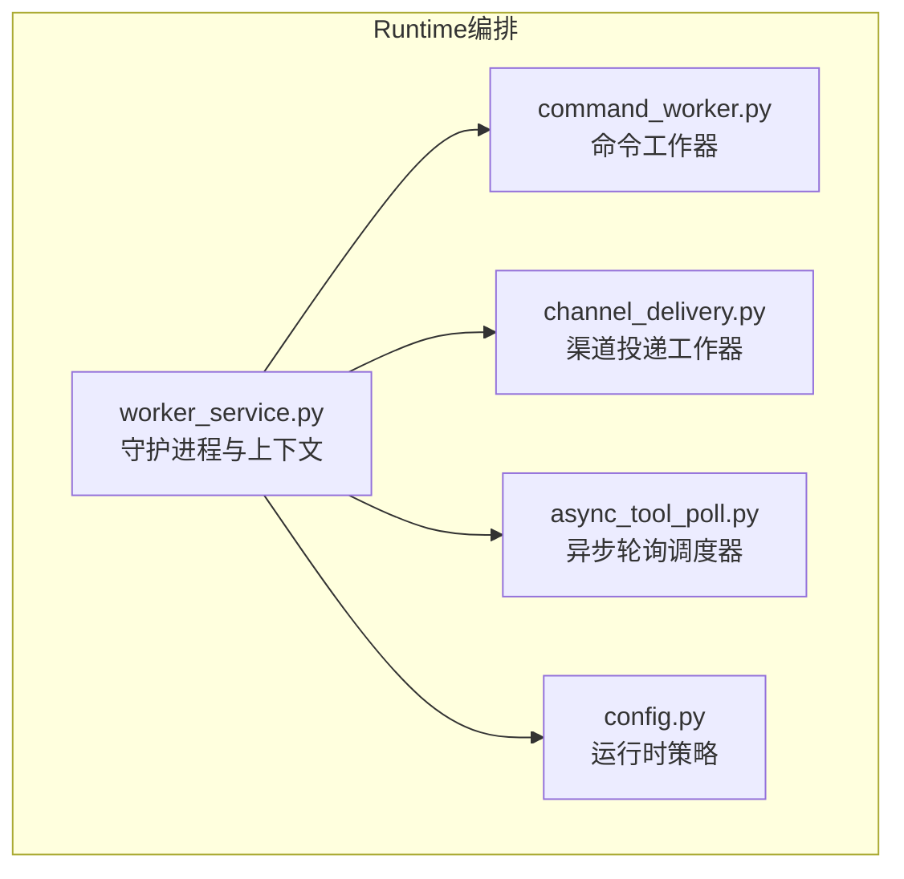
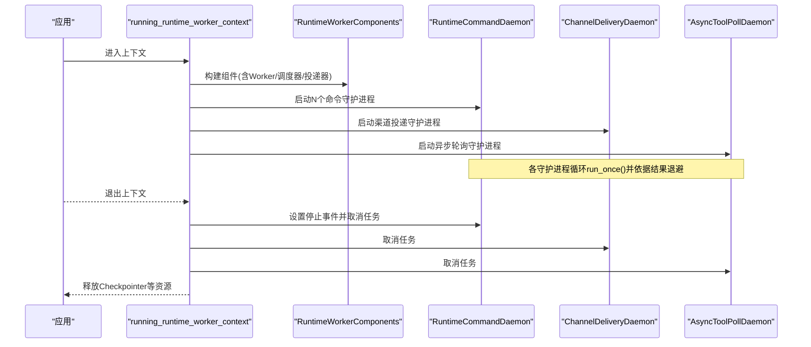
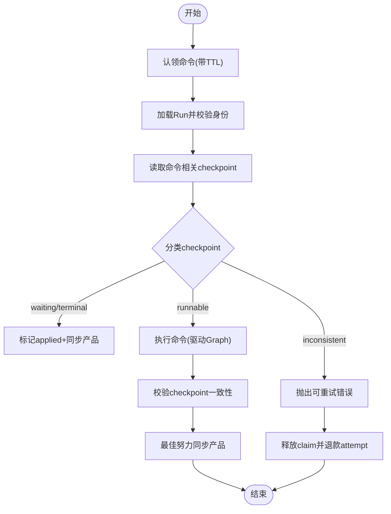
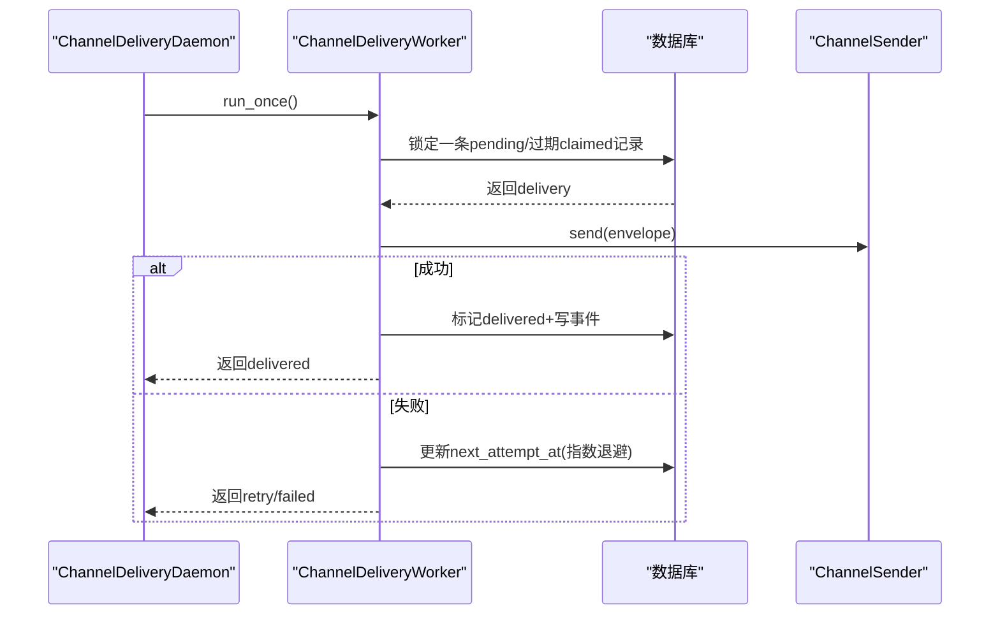
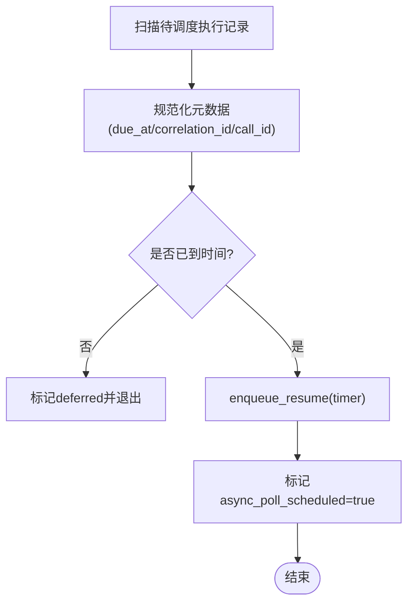
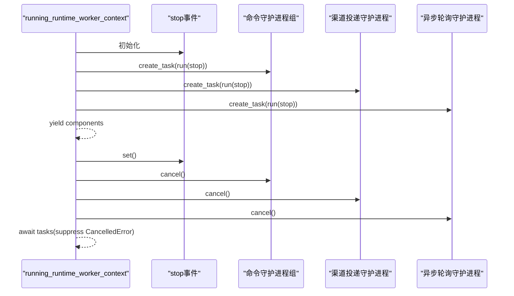
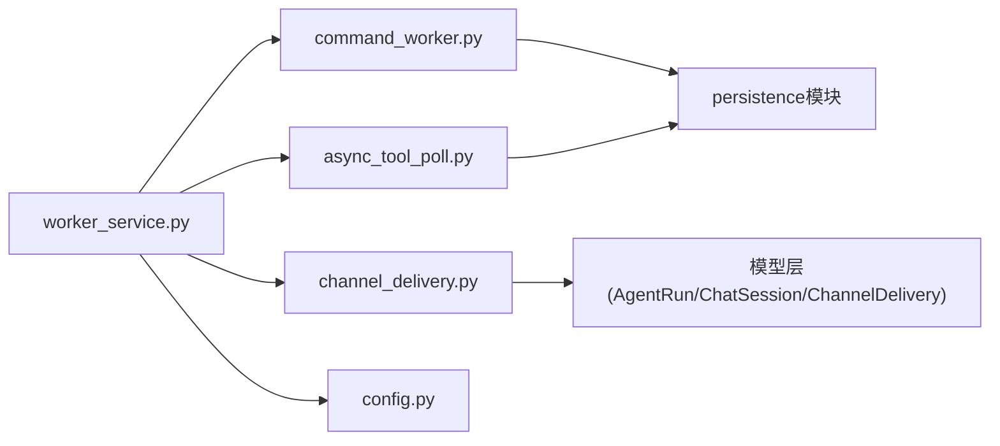
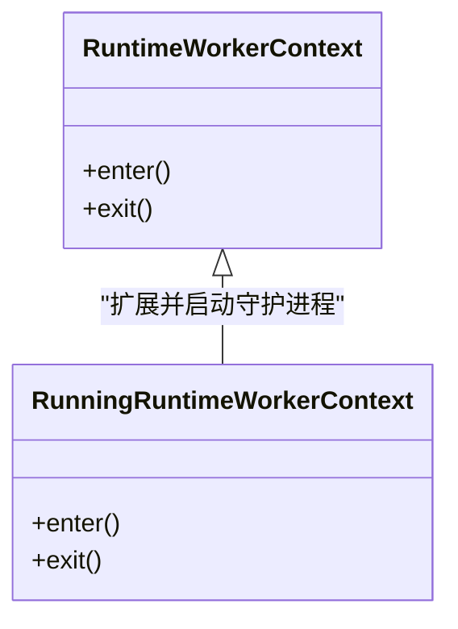

# Worker生命周期管理

<cite>
**本文引用的文件**   
- [command_worker.py](file://backend/app/services/agent_runtime/command_worker.py)
- [channel_delivery.py](file://backend/app/services/agent_runtime/channel_delivery.py)
- [async_tool_poll.py](file://backend/app/services/agent_runtime/async_tool_poll.py)
- [worker_service.py](file://backend/app/services/agent_runtime/worker_service.py)
- [config.py](file://backend/app/services/agent_runtime/config.py)
- [test_agent_runtime_worker_service.py](file://backend/tests/test_agent_runtime_worker_service.py)
</cite>

## 目录
1. [简介](#简介)
2. [项目结构](#项目结构)
3. [核心组件](#核心组件)
4. [架构总览](#架构总览)
5. [详细组件分析](#详细组件分析)
6. [依赖关系分析](#依赖关系分析)
7. [性能与配置调优](#性能与配置调优)
8. [故障排查指南](#故障排查指南)
9. [结论](#结论)
10. [附录：上下文管理器对比](#附录：上下文管理器对比)

## 简介
本技术文档聚焦于Clawith Agent Runtime的Worker生命周期管理，围绕以下守护进程展开：
- RuntimeCommandDaemon：命令入队、认领、执行与落盘的可靠工作流
- ChannelDeliveryDaemon：外部渠道投递（如飞书、钉钉等）的独立出队与重试
- AsyncToolPollDaemon：异步工具轮询的定时调度，避免在Graph外执行副作用

文档将深入解释启动流程、优雅关闭、资源清理；说明asynccontextmanager的使用模式及runtime_worker_context与running_runtime_worker_context的区别；阐述Worker进程的claimant机制、唯一性保证与故障恢复；并给出健康检查、监控指标、日志策略以及配置参数调优建议。

## 项目结构
与Worker生命周期相关的核心代码位于后端服务的agent_runtime子模块中，主要包含：
- 命令工作器与守护进程编排：worker_service.py
- 命令处理与幂等控制：command_worker.py
- 外部渠道投递：channel_delivery.py
- 异步工具轮询调度：async_tool_poll.py
- 运行时开关与灰度策略：config.py

图表来源 
- [worker_service.py:355-475](file://backend/app/services/agent_runtime/worker_service.py#L355-L475)
- [command_worker.py:312-470](file://backend/app/services/agent_runtime/command_worker.py#L312-L470)
- [channel_delivery.py:192-416](file://backend/app/services/agent_runtime/channel_delivery.py#L192-L416)
- [async_tool_poll.py:103-233](file://backend/app/services/agent_runtime/async_tool_poll.py#L103-L233)
- [config.py:80-147](file://backend/app/services/agent_runtime/config.py#L80-L147)

章节来源
- [worker_service.py:355-475](file://backend/app/services/agent_runtime/worker_service.py#L355-L475)
- [command_worker.py:312-470](file://backend/app/services/agent_runtime/command_worker.py#L312-L470)
- [channel_delivery.py:192-416](file://backend/app/services/agent_runtime/channel_delivery.py#L192-L416)
- [async_tool_poll.py:103-233](file://backend/app/services/agent_runtime/async_tool_poll.py#L103-L233)
- [config.py:80-147](file://backend/app/services/agent_runtime/config.py#L80-L147)

## 核心组件
- RuntimeCommandWorker：负责从命令队列认领、校验、执行、落盘与幂等结算，支持心跳续期、最大尝试次数、拒绝处理与产品侧最终一致性。
- ChannelDeliveryWorker：从投递表认领待发送消息，调用具体渠道发送器，失败按指数退避重试，成功记录事件与状态。
- AsyncToolPollScheduler：扫描“已启动但未完成”的工具执行记录，根据元数据生成定时器resume任务，确保仅在LangGraph内触发后续逻辑。
- 守护进程（Daemon）：为上述工作器提供循环驱动、错误退避与停止信号协调。
- 上下文管理器：runtime_worker_context用于构建组件并保持Checkpointer连接；running_runtime_worker_context在此基础上启动所有守护进程并在退出时统一取消。

章节来源
- [command_worker.py:312-470](file://backend/app/services/agent_runtime/command_worker.py#L312-L470)
- [channel_delivery.py:192-416](file://backend/app/services/agent_runtime/channel_delivery.py#L192-L416)
- [async_tool_poll.py:103-233](file://backend/app/services/agent_runtime/async_tool_poll.py#L103-L233)
- [worker_service.py:355-475](file://backend/app/services/agent_runtime/worker_service.py#L355-L475)
- [worker_service.py:549-668](file://backend/app/services/agent_runtime/worker_service.py#L549-L668)

## 架构总览
下图展示了Worker生命周期关键路径：上下文创建→组件装配→守护进程启动→循环拉取任务→结果落盘与幂等结算→优雅关闭。

图表来源 
- [worker_service.py:549-668](file://backend/app/services/agent_runtime/worker_service.py#L549-L668)
- [worker_service.py:355-475](file://backend/app/services/agent_runtime/worker_service.py#L355-L475)

## 详细组件分析

### RuntimeCommandDaemon与RuntimeCommandWorker
- 启动流程
  - Daemon.run循环调用worker.run_once()，根据返回状态决定下一次等待时间（idle/retry/error）。
  - worker内部通过claim_next_command进行原子认领，使用claim TTL与心跳续期保证独占执行。
- 执行与幂等
  - 读取checkpoint并分类（可运行/等待/终端/不一致），对cancel等命令做特殊约束。
  - 执行前后分别调用pre/post处理器，标记applied/product_synced，必要时持久化拒绝原因。
- 优雅关闭
  - Daemon收到停止事件后退出循环；worker的心跳续期在异常或取消时安全返回。
- 资源清理
  - 数据库会话在事务边界内自动提交/回滚；claim释放失败仅记录日志，TTL到期后仍可被重新认领。

图表来源 
- [command_worker.py:362-590](file://backend/app/services/agent_runtime/command_worker.py#L362-L590)
- [command_worker.py:694-716](file://backend/app/services/agent_runtime/command_worker.py#L694-L716)
- [command_worker.py:665-693](file://backend/app/services/agent_runtime/command_worker.py#L665-L693)

章节来源
- [command_worker.py:312-800](file://backend/app/services/agent_runtime/command_worker.py#L312-L800)
- [worker_service.py:355-403](file://backend/app/services/agent_runtime/worker_service.py#L355-L403)

### ChannelDeliveryDaemon与ChannelDeliveryWorker
- 启动流程
  - Daemon.run循环调用worker.run_once()，根据投递状态选择退避间隔。
- 认领与发送
  - 使用select ... with_for_update(skip_locked=True)锁定一条pending或过期claimed记录。
  - 校验关联ChatMessage存在且角色合法，更新claimed状态与过期时间。
  - 调用sender.send(envelope)，成功则标记delivered并写入事件；失败则按指数退避重试。
- 幂等与一致性
  - delivery_id由run_id与idempotency_key派生，避免重复投递。
  - 最新投递影响run.delivery_status，便于上层观测。

图表来源 
- [channel_delivery.py:213-276](file://backend/app/services/agent_runtime/channel_delivery.py#L213-L276)
- [channel_delivery.py:348-406](file://backend/app/services/agent_runtime/channel_delivery.py#L348-L406)
- [worker_service.py:405-438](file://backend/app/services/agent_runtime/worker_service.py#L405-L438)

章节来源
- [channel_delivery.py:192-416](file://backend/app/services/agent_runtime/channel_delivery.py#L192-L416)
- [worker_service.py:405-438](file://backend/app/services/agent_runtime/worker_service.py#L405-L438)

### AsyncToolPollDaemon与AsyncToolPollScheduler
- 启动流程
  - Daemon.run循环调用scheduler.run_once()，根据状态选择退避。
- 调度逻辑
  - 扫描status=started且runtime_async_pending=true的记录，过滤未scheduled的候选。
  - 解析metadata中的async_operation/poll信息，计算due_at与correlation_id。
  - 若due_at未到则defer；否则enqueue_resume生成timer resume，并标记scheduled。
- 幂等与一致性
  - 使用idempotency_key=f"async-poll:{execution.id}"保证幂等。
  - 仅写入调度信息，不直接执行工具，避免副作用。

图表来源 
- [async_tool_poll.py:119-233](file://backend/app/services/agent_runtime/async_tool_poll.py#L119-L233)
- [worker_service.py:441-475](file://backend/app/services/agent_runtime/worker_service.py#L441-L475)

章节来源
- [async_tool_poll.py:103-233](file://backend/app/services/agent_runtime/async_tool_poll.py#L103-L233)
- [worker_service.py:441-475](file://backend/app/services/agent_runtime/worker_service.py#L441-L475)

### 守护进程生命周期与优雅关闭
- 启动
  - running_runtime_worker_context创建stop事件，并行启动多个命令守护进程、渠道投递、异步轮询、产品与工具结果对账等任务。
- 运行
  - 各守护进程基于run_once返回的状态选择不同退避策略，避免忙轮询。
- 关闭
  - 退出上下文时设置stop事件，依次cancel所有任务，并以suppress(asyncio.CancelledError)等待任务退出，最后释放Checkpointer。

图表来源 
- [worker_service.py:587-668](file://backend/app/services/agent_runtime/worker_service.py#L587-L668)

章节来源
- [worker_service.py:587-668](file://backend/app/services/agent_runtime/worker_service.py#L587-L668)

### claimant机制、唯一性与故障恢复
- 唯一性
  - runtime_worker_claimant()基于主机名+PID+随机UUID生成不超过128字符的唯一标识，作为claim_owner。
- 认领与续期
  - command_worker通过claim_next_command以claim TTL锁定命令；_heartbeat周期性renew_command_claim延长持有时间。
  - channel_delivery同样设置claimed_by与claim_expires_at，超时即释放。
- 故障恢复
  - 若心跳失败或进程崩溃，TTL到期后其他实例可重新认领；release_command_claim失败不影响TTL释放语义。
  - async poll与channel delivery均使用幂等键与状态机保证重放安全。

章节来源
- [worker_service.py:138-142](file://backend/app/services/agent_runtime/worker_service.py#L138-L142)
- [command_worker.py:434-469](file://backend/app/services/agent_runtime/command_worker.py#L434-L469)
- [channel_delivery.py:213-276](file://backend/app/services/agent_runtime/channel_delivery.py#L213-L276)

### 健康检查、监控指标与日志策略
- 健康检查
  - assert_runtime_schema_ready在启动时校验产品表与checkpoint迁移版本，不满足则快速失败。
- 监控指标（建议）
  - 各daemon每轮迭代计数、idle/retry/error比例、平均耗时、队列长度（pending/claimed）、失败率与退避分布。
- 日志策略
  - 关键路径记录extra字段（run_id、command_id、delivery_id、execution_id等），敏感信息脱敏（URL/Bearer）。
  - 非致命异常仅记录日志并继续运行，避免单点失败导致守护进程崩溃。

章节来源
- [worker_service.py:164-199](file://backend/app/services/agent_runtime/worker_service.py#L164-L199)
- [channel_delivery.py:177-186](file://backend/app/services/agent_runtime/channel_delivery.py#L177-L186)
- [command_worker.py:456-469](file://backend/app/services/agent_runtime/command_worker.py#L456-L469)

## 依赖关系分析
- 组件耦合
  - worker_service.py聚合所有守护进程与工作器，并通过settings注入行为差异。
  - command_worker依赖persistence与thread_lock实现强一致与并发控制。
  - channel_delivery依赖模型层AgentRun/ChatSession/ChannelDelivery与事件表。
  - async_tool_poll依赖AgentToolExecution与persistence.enqueue_resume。
- 外部依赖
  - LangGraph Checkpointer（Postgres）用于状态快照与恢复。
  - SQLAlchemy异步引擎与会话工厂用于事务与锁。

图表来源 
- [worker_service.py:201-352](file://backend/app/services/agent_runtime/worker_service.py#L201-L352)
- [command_worker.py:21-36](file://backend/app/services/agent_runtime/command_worker.py#L21-L36)
- [channel_delivery.py:14-19](file://backend/app/services/agent_runtime/channel_delivery.py#L14-L19)
- [async_tool_poll.py:13-16](file://backend/app/services/agent_runtime/async_tool_poll.py#L13-L16)

章节来源
- [worker_service.py:201-352](file://backend/app/services/agent_runtime/worker_service.py#L201-L352)

## 性能与配置调优
- 并发与吞吐
  - AGENT_RUNTIME_COMMAND_CONCURRENCY：命令守护进程数量，建议按CPU核数与IO瓶颈调整。
  - scan_batch_size（异步轮询）：批量扫描大小，过大增加内存与锁竞争，过小降低吞吐。
- 退避与延迟
  - idle/retry/error_delay_seconds：根据系统负载与下游响应时间调优，避免雪崩。
  - channel delivery指数退避上限（默认300秒）与最大尝试次数需结合业务SLA。
- 资源与连接
  - Checkpointer连接保持范围由runtime_worker_context控制，避免频繁建连。
  - lock_engine用于分布式锁，确保同一时刻仅一个实例推进状态。
- 灰度与开关
  - AGENT_RUNTIME_V2_ENABLED、AGENT_RUNTIME_V2_AGENT_IDS、AGENT_RUNTIME_V2_SOURCE_TYPES控制v2路由策略。

章节来源
- [worker_service.py:355-475](file://backend/app/services/agent_runtime/worker_service.py#L355-L475)
- [async_tool_poll.py:106-118](file://backend/app/services/agent_runtime/async_tool_poll.py#L106-L118)
- [channel_delivery.py:188-189](file://backend/app/services/agent_runtime/channel_delivery.py#L188-L189)
- [config.py:80-147](file://backend/app/services/agent_runtime/config.py#L80-L147)

## 故障排查指南
- 启动失败
  - 检查assert_runtime_schema_ready是否通过，确认产品表与checkpoint迁移版本匹配。
- 命令卡住
  - 查看claim TTL与心跳续期是否正常；检查renew_command_claim是否抛错；观察attempt_count是否耗尽。
- 渠道投递失败
  - 检查next_attempt_at与attempt_count；关注last_error_code与脱敏后的last_error；确认message是否存在。
- 异步轮询未触发
  - 核对result_metadata中的async_operation/poll字段完整性；确认due_at计算正确；检查async_poll_scheduled标记。
- 优雅关闭问题
  - 确认stop事件已设置；检查task.cancel与await suppress(CancelledError)是否正确执行。

章节来源
- [worker_service.py:164-199](file://backend/app/services/agent_runtime/worker_service.py#L164-L199)
- [command_worker.py:434-469](file://backend/app/services/agent_runtime/command_worker.py#L434-L469)
- [channel_delivery.py:377-406](file://backend/app/services/agent_runtime/channel_delivery.py#L377-L406)
- [async_tool_poll.py:157-184](file://backend/app/services/agent_runtime/async_tool_poll.py#L157-L184)
- [worker_service.py:587-668](file://backend/app/services/agent_runtime/worker_service.py#L587-L668)

## 结论
Clawith的Worker生命周期管理通过清晰的守护进程分工、严格的claim/TTL与心跳续期、幂等与最终一致性设计，实现了高可靠的命令处理、渠道投递与异步轮询。配合完善的上下文管理与优雅关闭机制，系统在启动、运行与停机阶段均具备健壮性。通过合理的配置调优与监控指标建设，可在生产环境中获得稳定高效的执行表现。

## 附录：上下文管理器对比
- runtime_worker_context
  - 作用：构建RuntimeWorkerComponents并保持Checkpointer连接，适合需要自行编排守护进程的场景。
- running_runtime_worker_context
  - 作用：在runtime_worker_context基础上启动全部守护进程，并在退出时统一取消与清理，适合大多数生产场景。

图表来源 
- [worker_service.py:549-668](file://backend/app/services/agent_runtime/worker_service.py#L549-L668)

章节来源
- [worker_service.py:549-668](file://backend/app/services/agent_runtime/worker_service.py#L549-L668)
- [test_agent_runtime_worker_service.py:333-371](file://backend/tests/test_agent_runtime_worker_service.py#L333-L371)
- [test_agent_runtime_worker_service.py:373-406](file://backend/tests/test_agent_runtime_worker_service.py#L373-L406)