# 任务队列系统

<cite>
**本文引用的文件**   
- [command_worker.py](file://backend/app/services/agent_runtime/command_worker.py)
- [persistence.py](file://backend/app/services/agent_runtime/persistence.py)
- [thread_lock.py](file://backend/app/services/agent_runtime/thread_lock.py)
- [worker_service.py](file://backend/app/services/agent_runtime/worker_service.py)
- [config.py](file://backend/app/services/agent_runtime/config.py)
- [scheduling_lane.py](file://backend/app/services/agent_runtime/scheduling_lane.py)
- [agent_run_command.py](file://backend/app/models/agent_run_command.py)
- [agent_run.py](file://backend/app/models/agent_run.py)
- [task.py](file://backend/app/models/task.py)
- [logging_config.py](file://backend/app/core/logging_config.py)
</cite>

## 目录
1. [简介](#简介)
2. [项目结构](#项目结构)
3. [核心组件](#核心组件)
4. [架构总览](#架构总览)
5. [详细组件分析](#详细组件分析)
6. [依赖关系分析](#依赖关系分析)
7. [性能与扩展性](#性能与扩展性)
8. [故障排查指南](#故障排查指南)
9. [结论](#结论)
10. [附录](#附录)

## 简介
本技术文档聚焦于 Clawith 的任务队列系统，围绕 RuntimeCommandWorker 的任务分发机制展开，涵盖命令入队、优先级排序、并发控制、任务状态管理、重试与失败处理、数据库驱动实现（锁机制、事务、一致性）、调度策略、负载均衡与水平扩展方案，以及监控、调试与性能分析方法。该队列以 PostgreSQL 为权威持久化层，结合 LangGraph Checkpoint 作为执行状态的唯一真实来源，确保在分布式 Worker 环境下具备幂等、可恢复与强一致性的能力。

## 项目结构
- 模型层：定义 AgentRun、AgentRunCommand、Task 等数据模型，约束字段与索引，保障数据完整性与查询性能。
- 持久化层：提供命令入队、认领、标记应用、产品同步、重试释放等原子操作，使用 SQL 条件与 for update skip locked 保证并发安全。
- 工作器层：RuntimeCommandWorker 负责认领、校验、执行、结算；Daemon 循环驱动多实例并发消费。
- 线程锁：基于 PostgreSQL Advisory Lock 的会话级锁，确保同一 Run 的并发串行化。
- 配置与路由：根据全局开关、Agent 白名单、Source Type 决定 v2 运行时的启用策略。
- 监控与日志：统一 trace_id、结构化日志、后台任务隔离，便于追踪与排障。

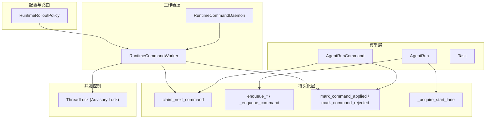

图表来源 
- [agent_run.py:1-195](file://backend/app/models/agent_run.py#L1-L195)
- [agent_run_command.py:1-104](file://backend/app/models/agent_run_command.py#L1-L104)
- [persistence.py:524-632](file://backend/app/services/agent_runtime/persistence.py#L524-L632)
- [command_worker.py:312-800](file://backend/app/services/agent_runtime/command_worker.py#L312-L800)
- [thread_lock.py:1-89](file://backend/app/services/agent_runtime/thread_lock.py#L1-L89)
- [config.py:80-147](file://backend/app/services/agent_runtime/config.py#L80-L147)

章节来源
- [agent_run.py:1-195](file://backend/app/models/agent_run.py#L1-L195)
- [agent_run_command.py:1-104](file://backend/app/models/agent_run_command.py#L1-L104)
- [persistence.py:1-800](file://backend/app/services/agent_runtime/persistence.py#L1-L800)
- [command_worker.py:1-800](file://backend/app/services/agent_runtime/command_worker.py#L1-L800)
- [thread_lock.py:1-89](file://backend/app/services/agent_runtime/thread_lock.py#L1-L89)
- [config.py:1-147](file://backend/app/services/agent_runtime/config.py#L1-L147)

## 核心组件
- RuntimeCommandWorker：单条命令的生命周期管理者，包含认领、加载 Run、心跳续租、尝试计数、校验检查点、执行、应用标记、拒绝处理、产品同步、释放重试等。
- 持久化模块：封装所有对 agent_runs 与 agent_run_commands 的原子读写，包括入队、认领、开始 lane 抢占、应用标记、产品同步清理、重试释放等。
- ThreadLock：基于 PostgreSQL Advisory Lock 的会话级锁，确保同一 run thread 的串行执行。
- Worker 服务：构建并启动多个 Daemon（命令消费、通道投递、异步工具轮询、产品对账、工具结果对账），通过上下文管理器协调生命周期。
- 配置与路由：决定新 Run 是否进入 v2 运行时，支持全局开关、Agent 白名单、Source Type 白名单。
- SchedulingLane：基于检查点的终态释放 lane，避免 start 命令竞争导致的死锁或饥饿。

章节来源
- [command_worker.py:312-800](file://backend/app/services/agent_runtime/command_worker.py#L312-L800)
- [persistence.py:403-632](file://backend/app/services/agent_runtime/persistence.py#L403-L632)
- [thread_lock.py:1-89](file://backend/app/services/agent_runtime/thread_lock.py#L1-L89)
- [worker_service.py:201-353](file://backend/app/services/agent_runtime/worker_service.py#L201-L353)
- [config.py:80-147](file://backend/app/services/agent_runtime/config.py#L80-L147)
- [scheduling_lane.py:1-45](file://backend/app/services/agent_runtime/scheduling_lane.py#L1-L45)

## 架构总览
下图展示了从命令入队到执行落盘的全链路流程，以及各守护进程的职责边界。

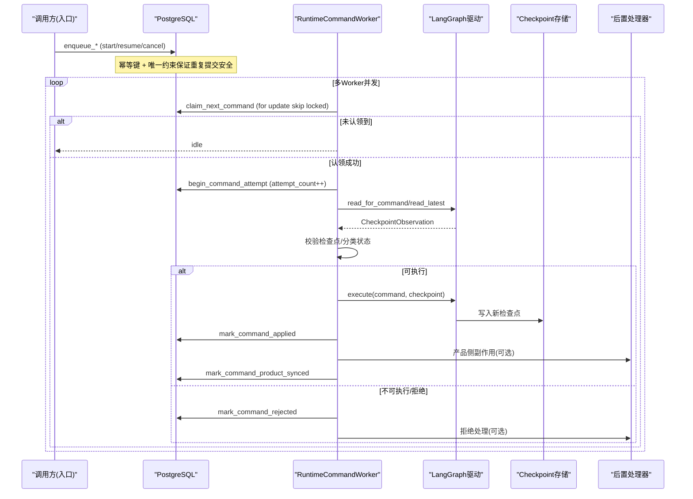

图表来源 
- [persistence.py:403-632](file://backend/app/services/agent_runtime/persistence.py#L403-L632)
- [command_worker.py:312-800](file://backend/app/services/agent_runtime/command_worker.py#L312-L800)
- [worker_service.py:587-685](file://backend/app/services/agent_runtime/worker_service.py#L587-L685)

## 详细组件分析

### 命令入队与幂等
- 入队接口：enqueue_resume、enqueue_cancel、register_run_with_start 内部均调用 _enqueue_command，校验 idempotency_key 与 payload，插入 AgentRunCommand 并设置 status="pending"。
- 幂等保护：通过唯一约束 (run_id, idempotency_key) 与异常回退后的二次查询，确保并发重复提交返回已有记录。
- 事件记录：注册 Run 时同时写入 AgentRunEvent，用于审计与回放。

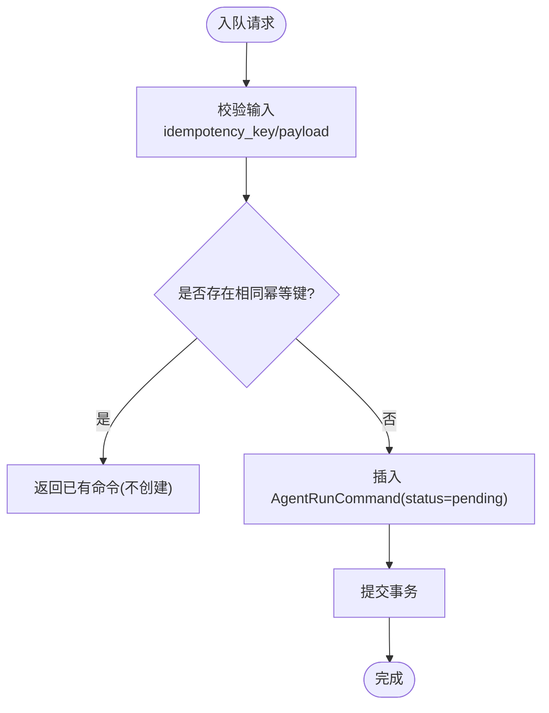

图表来源 
- [persistence.py:403-475](file://backend/app/services/agent_runtime/persistence.py#L403-L475)

章节来源
- [persistence.py:321-475](file://backend/app/services/agent_runtime/persistence.py#L321-L475)

### 认领与优先级排序
- 认领语句：_claim_statement 使用 with_for_update(skip_locked=True) 选择 oldest pending 或已过期 claimed 的命令，按 created_at, id 排序，保证 FIFO。
- Lane 限制：对于 start 命令，若 Run 设置了 scheduling_lane_key，则需满足 lane_held 或无活跃持有者，否则跳过，避免同 lane 内竞争。
- 认领更新：将 command.status 置为 claimed，设置 claimed_by、claim_expires_at，清空 error_code/applied_at。

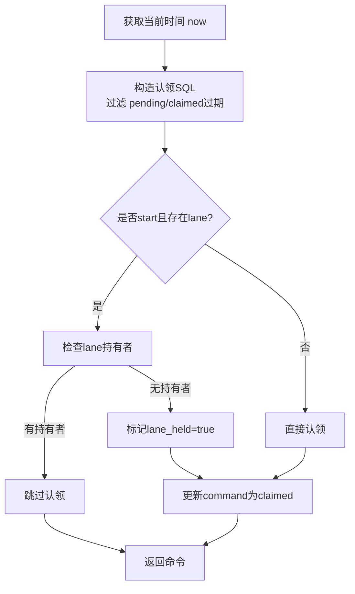

图表来源 
- [persistence.py:524-632](file://backend/app/services/agent_runtime/persistence.py#L524-L632)

章节来源
- [persistence.py:524-632](file://backend/app/services/agent_runtime/persistence.py#L524-L632)

### 并发控制与线程锁
- 线程锁：run_with_thread_lock 使用 pg_try_advisory_lock 获取会话级锁，key 由 thread_id 经 blake2b 生成，确保同一 run thread 串行执行。
- 锁范围：仅包裹 checkpoint/invoke/reconcile 关键路径，回调结束后释放锁，失败不会误释放。
- 错误类型：ThreadLockNotAcquired、ThreadLockReleaseError 明确区分获取失败与释放失败。

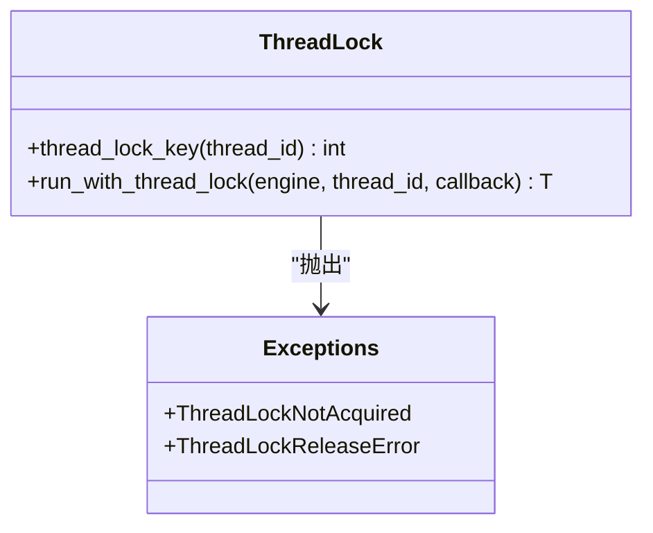

图表来源 
- [thread_lock.py:1-89](file://backend/app/services/agent_runtime/thread_lock.py#L1-L89)

章节来源
- [thread_lock.py:1-89](file://backend/app/services/agent_runtime/thread_lock.py#L1-L89)

### 任务状态管理与重试机制
- 状态机：AgentRunCommand.status ∈ {pending, claimed, applied, rejected}；attempt_count 记录业务重试次数。
- 重试策略：begin_command_attempt 在持有线程锁后消耗一次 attempt_count，超过 max_attempts 则拒绝并需要人工干预。
- 释放重试：release_command_claim 在失败时仍可通过 TTL 过期重新被认领，避免死锁。

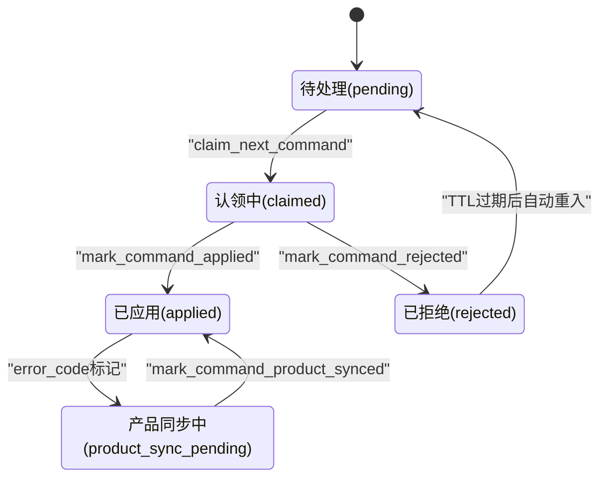

图表来源 
- [agent_run_command.py:25-104](file://backend/app/models/agent_run_command.py#L25-L104)
- [persistence.py:724-800](file://backend/app/services/agent_runtime/persistence.py#L724-L800)

章节来源
- [agent_run_command.py:25-104](file://backend/app/models/agent_run_command.py#L25-L104)
- [persistence.py:724-800](file://backend/app/services/agent_runtime/persistence.py#L724-L800)

### 检查点校验与分类
- 检查点读取：read_for_command 优先按命令关联的检查点读取，否则 fallback 到 latest。
- 校验规则：checkpoint_id 非空、lifecycle.status 合法、metadata.clawith_run_id/command_id 匹配。
- 分类逻辑：classify_checkpoint 根据 lifecycle.status、next_nodes、tasks、interrupts 判断 not_started/runnable/waiting/terminal/execution_error_recoverable/inconsistent。

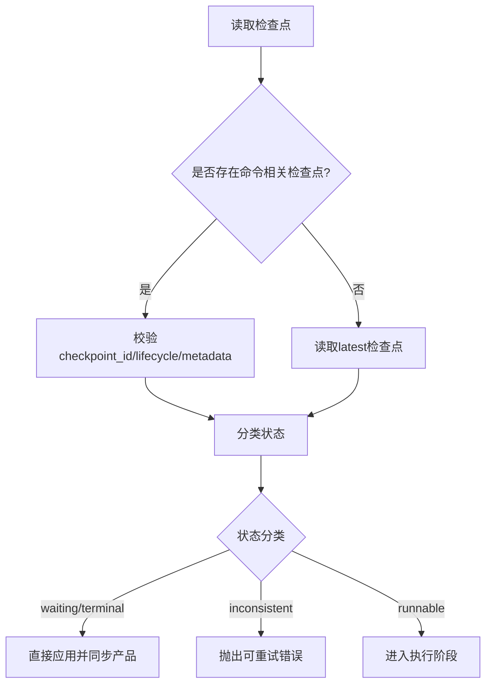

图表来源 
- [command_worker.py:591-629](file://backend/app/services/agent_runtime/command_worker.py#L591-L629)
- [command_worker.py:150-184](file://backend/app/services/agent_runtime/command_worker.py#L150-L184)

章节来源
- [command_worker.py:591-629](file://backend/app/services/agent_runtime/command_worker.py#L591-L629)
- [command_worker.py:150-184](file://backend/app/services/agent_runtime/command_worker.py#L150-L184)

### 执行与结算
- 执行路径：execute 通过 LangGraph 驱动执行图节点，写入新检查点。
- 应用标记：mark_command_applied 设置 applied_checkpoint_id、applied_at，并标记 product_sync_pending。
- 产品同步：post_checkpoint_handler 执行副作用（如计划任务、A2A 完成、会话上下文等），成功后清除 product_sync_pending。

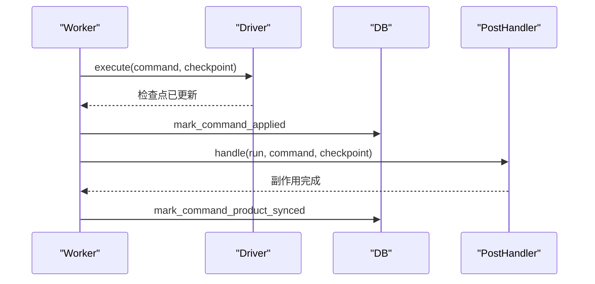

图表来源 
- [command_worker.py:665-693](file://backend/app/services/agent_runtime/command_worker.py#L665-L693)
- [persistence.py:763-800](file://backend/app/services/agent_runtime/persistence.py#L763-L800)

章节来源
- [command_worker.py:665-693](file://backend/app/services/agent_runtime/command_worker.py#L665-L693)
- [persistence.py:763-800](file://backend/app/services/agent_runtime/persistence.py#L763-L800)

### 拒绝处理与取消语义
- 拒绝码映射：command_rejection_message 将稳定错误码转换为人类可读消息。
- 取消语义：cancel 不允许创建新检查点，必须保留已有检查点；若尚未开始，reject_unstarted_run_for_cancel 清理未开始的 start 命令。
- 拒绝流程：mark_command_rejected 记录 error_code，必要时触发 rejection_handler 发送通知。

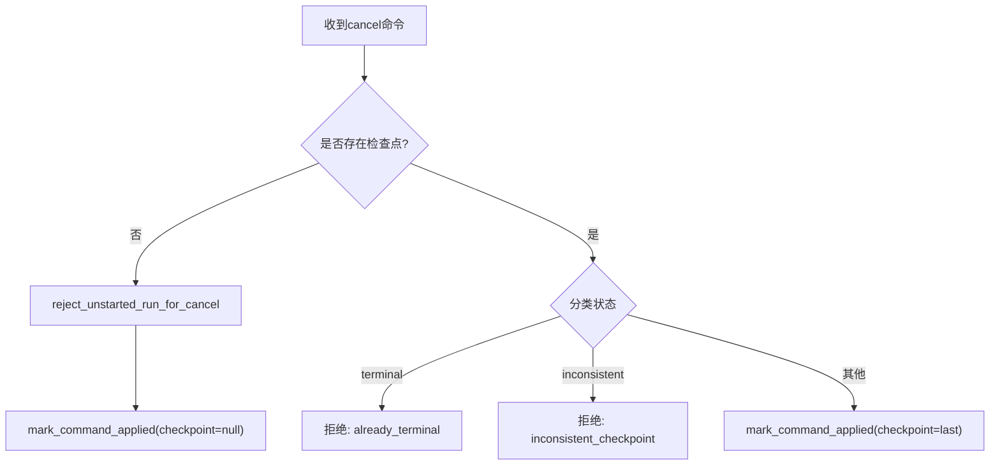

图表来源 
- [command_worker.py:485-494](file://backend/app/services/agent_runtime/command_worker.py#L485-L494)
- [command_worker.py:768-800](file://backend/app/services/agent_runtime/command_worker.py#L768-L800)

章节来源
- [command_worker.py:485-494](file://backend/app/services/agent_runtime/command_worker.py#L485-L494)
- [command_worker.py:768-800](file://backend/app/services/agent_runtime/command_worker.py#L768-L800)

### 调度策略与负载均衡
- 调度策略：FIFO 基于 created_at, id；lane 机制保证同组 mention 的顺序性与互斥。
- 负载均衡：多 Worker 实例并行认领，skip locked 避免热点行竞争；lane 持有者防止同一 lane 的多实例争抢。
- 水平扩展：增加 Worker 数量即可线性提升吞吐；checkpointer 与 DB 连接池需相应扩容。

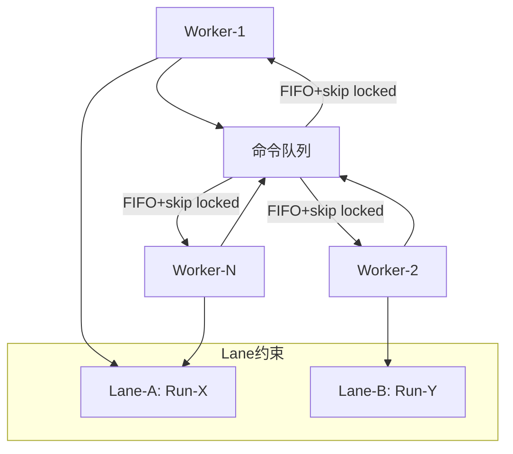

图表来源 
- [persistence.py:524-632](file://backend/app/services/agent_runtime/persistence.py#L524-L632)
- [worker_service.py:587-685](file://backend/app/services/agent_runtime/worker_service.py#L587-L685)

章节来源
- [persistence.py:524-632](file://backend/app/services/agent_runtime/persistence.py#L524-L632)
- [worker_service.py:587-685](file://backend/app/services/agent_runtime/worker_service.py#L587-L685)

### 监控、调试与性能分析
- 日志追踪：loguru 统一格式，trace_id 跨上下文传递，背景任务通过 new_trace_id 绑定。
- 指标采集：Daemon 根据 result.status 调整延迟（idle/retry/error），可结合外部监控系统收集。
- 性能优化：DB 索引（status, claim_expires_at, created_at, id）；skip locked 减少锁等待；lane 减少竞争。

章节来源
- [logging_config.py:1-129](file://backend/app/core/logging_config.py#L1-L129)
- [worker_service.py:355-403](file://backend/app/services/agent_runtime/worker_service.py#L355-L403)
- [agent_run_command.py:47-54](file://backend/app/models/agent_run_command.py#L47-L54)

## 依赖关系分析
- 模型依赖：AgentRunCommand 引用 AgentRun、tenants、users、agents；AgentRun 引用 tenants、chat_sessions、llm_models。
- 服务依赖：Worker 依赖 persistence、thread_lock、driver、post_checkpoint_handler。
- 外部依赖：PostgreSQL（Advisory Lock、for update skip locked）、LangGraph Checkpoint（PostgresSaver）。

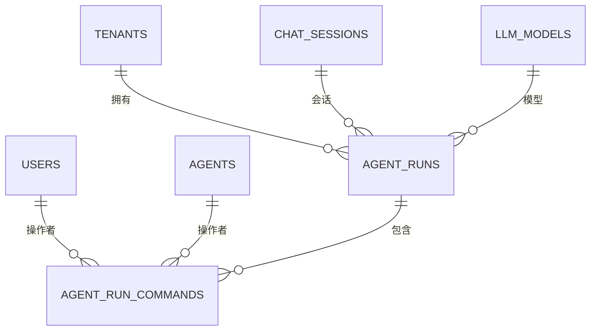

图表来源 
- [agent_run.py:1-195](file://backend/app/models/agent_run.py#L1-L195)
- [agent_run_command.py:1-104](file://backend/app/models/agent_run_command.py#L1-L104)

章节来源
- [agent_run.py:1-195](file://backend/app/models/agent_run.py#L1-L195)
- [agent_run_command.py:1-104](file://backend/app/models/agent_run_command.py#L1-L104)

## 性能与扩展性
- 吞吐优化：多 Worker 并发认领，skip locked 避免阻塞；lane 机制降低热点冲突。
- 资源隔离：Checkpointer 独立连接池，DB 连接数与 Worker 数量匹配。
- 水平扩展：无状态 Worker 可横向扩展；DB 主从或分库分表需评估 lane 与命令分布。
- 监控建议：采集认领延迟、执行时长、重试率、拒绝率、产品同步失败率。

[本节为通用指导，无需特定文件引用]

## 故障排查指南
- 常见问题：
  - 认领不到命令：检查 status 与 claim_expires_at 索引；确认 lane 持有者。
  - 检查点不一致：核对 lifecycle.status、next_nodes、tasks、interrupts 一致性。
  - 产品同步失败：查看 error_code=product_sync_pending 的命令，手动重试。
- 调试步骤：
  - 使用 trace_id 定位日志；查看 AgentRunCommand 状态流转。
  - 检查 ThreadLock 是否被正确释放；确认 Checkpoint 版本迁移。
- 恢复策略：
  - 超时命令自动重入；超限命令需人工介入；lane 废弃后可修复。

章节来源
- [command_worker.py:434-469](file://backend/app/services/agent_runtime/command_worker.py#L434-L469)
- [persistence.py:676-698](file://backend/app/services/agent_runtime/persistence.py#L676-L698)
- [worker_service.py:164-199](file://backend/app/services/agent_runtime/worker_service.py#L164-L199)

## 结论
Clawith 的任务队列系统以 PostgreSQL 为核心，结合 LangGraph Checkpoint 实现了高可靠、幂等、可恢复的命令处理流水线。RuntimeCommandWorker 通过严格的检查点校验、状态机与重试机制，确保在分布式环境下的强一致性。Lane 机制与 FIFO 策略保障了顺序性与公平性，多 Worker 并发与 skip locked 提升了吞吐。完善的日志与监控体系为运维提供了有力支撑。

[本节为总结，无需特定文件引用]

## 附录
- 配置项参考：AGENT_RUNTIME_COMMAND_CONCURRENCY、AGENT_RUNTIME_COMMAND_CLAIM_TTL_SECONDS、AGENT_RUNTIME_COMMAND_MAX_ATTEMPTS 等。
- 数据模型字段说明：AgentRunCommand 的 status、attempt_count、applied_checkpoint_id、error_code 等关键字段含义。
- 最佳实践：合理设置 claim TTL 与重试间隔；监控 lane 持有时间；定期清理历史命令。

章节来源
- [config.py:80-147](file://backend/app/services/agent_runtime/config.py#L80-L147)
- [agent_run_command.py:92-104](file://backend/app/models/agent_run_command.py#L92-L104)