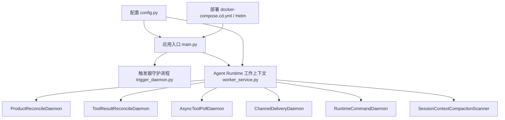
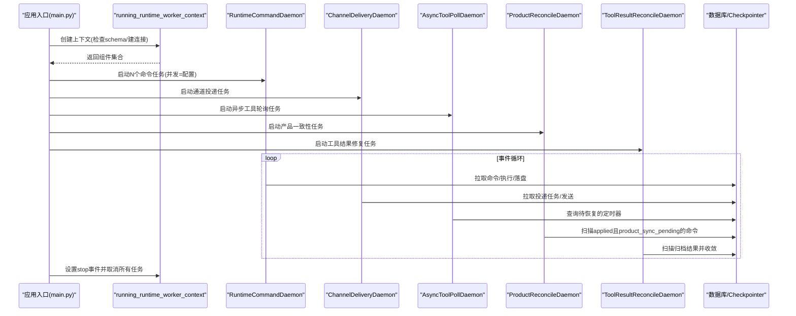
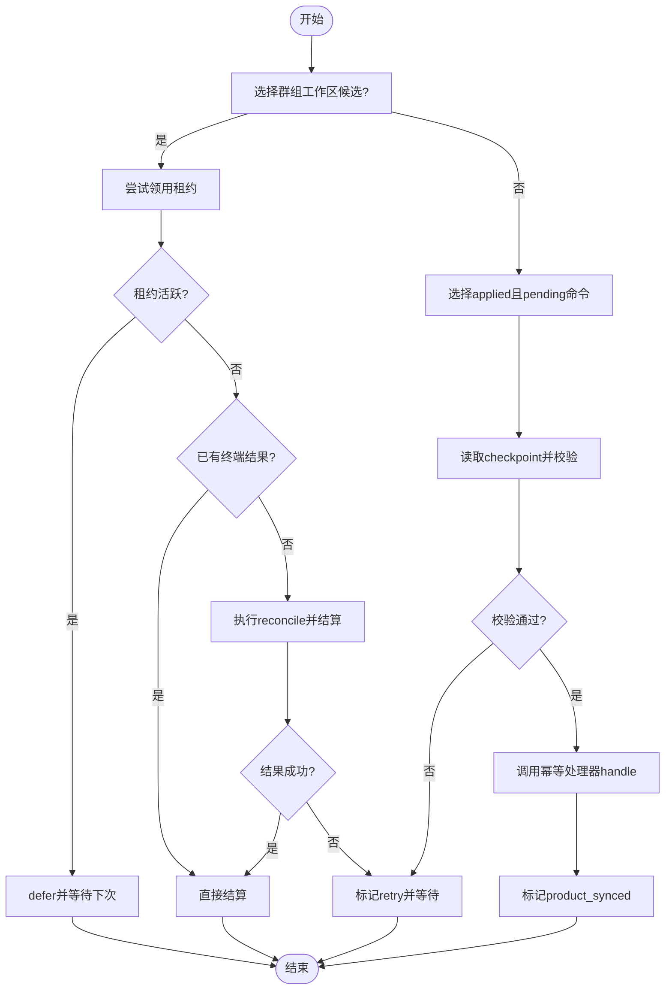
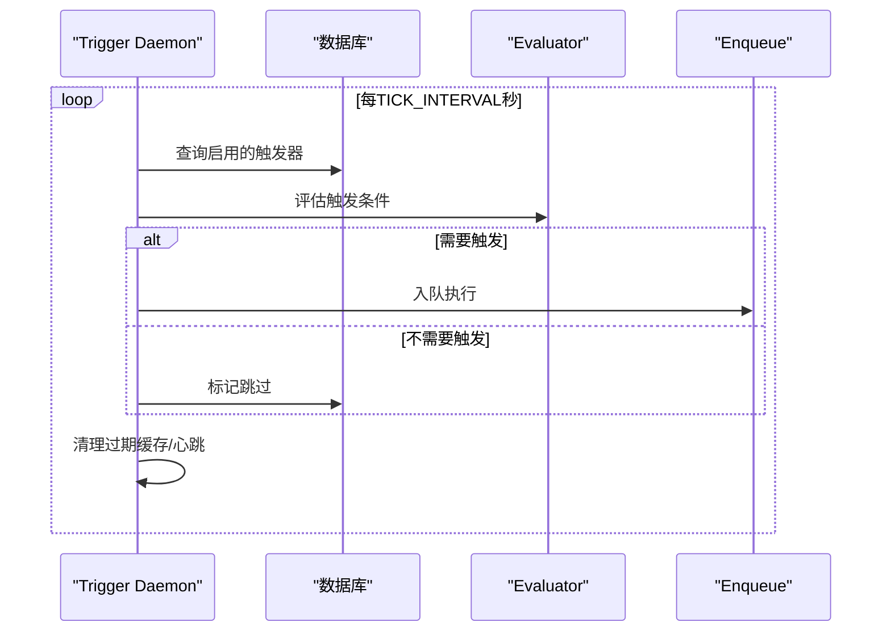
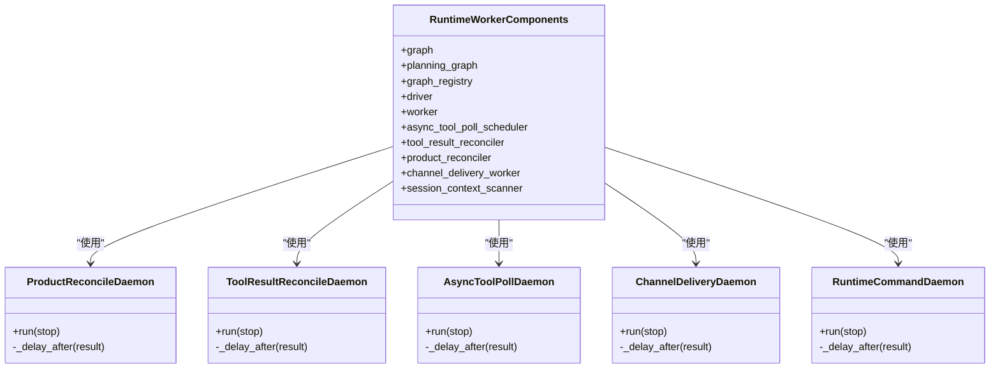

# 后台守护进程

<cite>
**本文引用的文件**   
- [worker_service.py](file://backend/app/services/agent_runtime/worker_service.py)
- [product_reconciler.py](file://backend/app/services/agent_runtime/product_reconciler.py)
- [trigger_daemon.py](file://backend/app/services/trigger_daemon.py)
- [config.py](file://backend/app/config.py)
- [main.py](file://backend/app/main.py)
- [test_agent_runtime_product_reconciler.py](file://backend/tests/test_agent_runtime_product_reconciler.py)
- [docker-compose.cd.yml](file://docker-compose.cd.yml)
- [helm/clawith/templates/backend.yaml](file://helm/clawith/templates/backend.yaml)
- [helm/QUICKSTART.md](file://helm/QUICKSTART.md)
</cite>

## 目录
1. [简介](#简介)
2. [项目结构](#项目结构)
3. [核心组件](#核心组件)
4. [架构总览](#架构总览)
5. [详细组件分析](#详细组件分析)
6. [依赖关系分析](#依赖关系分析)
7. [性能与资源隔离](#性能与资源隔离)
8. [配置管理与参数调优](#配置管理与参数调优)
9. [部署模式与容器化](#部署模式与容器化)
10. [监控与告警](#监控与告警)
11. [故障排查指南](#故障排查指南)
12. [结论](#结论)

## 简介
本技术文档聚焦于 Clawith 后台守护进程，重点解析 ProductReconcileDaemon、ToolResultReconcileDaemon 等后台任务的运行机制，包括扫描策略、批量处理、错误恢复；阐述异步执行模型（asyncio 事件循环、任务调度、资源隔离）；说明配置管理、参数调优、监控告警；并给出部署模式、容器化配置与运维指南，以及故障排查方法与性能优化建议。

## 项目结构
- 后端服务入口负责启动各类后台守护进程与触发器守护进程，并通过环境变量控制角色与功能开关。
- Agent Runtime 工作区提供命令驱动、通道投递、异步工具轮询、产品一致性修复、工具结果修复等守护进程。
- Trigger Daemon 负责定时评估触发器、限流与过期清理、健康心跳等。
- 配置通过 Settings 集中管理，支持环境变量覆盖与校验。
- 部署层面提供 Docker Compose 与 Helm Chart，便于本地与生产环境部署。

图表来源
- [main.py:121-200](file://backend/app/main.py#L121-L200)
- [worker_service.py:587-668](file://backend/app/services/agent_runtime/worker_service.py#L587-L668)
- [trigger_daemon.py:173-201](file://backend/app/services/trigger_daemon.py#L173-L201)
- [config.py:79-247](file://backend/app/config.py#L79-L247)
- [docker-compose.cd.yml:1-36](file://docker-compose.cd.yml#L1-L36)
- [helm/clawith/templates/backend.yaml:40-67](file://helm/clawith/templates/backend.yaml#L40-L67)

章节来源
- [main.py:121-200](file://backend/app/main.py#L121-L200)
- [worker_service.py:587-668](file://backend/app/services/agent_runtime/worker_service.py#L587-L668)
- [trigger_daemon.py:173-201](file://backend/app/services/trigger_daemon.py#L173-L201)
- [config.py:79-247](file://backend/app/config.py#L79-L247)
- [docker-compose.cd.yml:1-36](file://docker-compose.cd.yml#L1-L36)
- [helm/clawith/templates/backend.yaml:40-67](file://helm/clawith/templates/backend.yaml#L40-L67)

## 核心组件
- ProductReconcileDaemon：独立于命令与图执行的“产品一致性”重试守护进程，针对已应用但产品同步未完成的命令进行幂等回放，避免重新进入 Agent Graph。
- ToolResultReconcileDaemon：独立恢复归档的工具结果，不重执行工具，仅基于持久化事实进行状态收敛。
- AsyncToolPollDaemon：在 LangGraph 之外调度定时器恢复，避免越权执行工具。
- ChannelDeliveryDaemon：持续拉取并投递消息到外部渠道，独立于图执行。
- RuntimeCommandDaemon：持续从命令收件箱中消费命令，具备空闲/重试/错误退避策略。
- SessionContextCompactionScanner：会话上下文压缩扫描与执行。

章节来源
- [worker_service.py:355-546](file://backend/app/services/agent_runtime/worker_service.py#L355-L546)

## 架构总览
后台守护进程采用 asyncio 事件循环驱动，各守护进程以独立任务运行，共享同一 Checkpointer 与数据库连接池，通过配置控制并发度与扫描间隔。启动时由应用入口统一拉起，停止时通过 Event 信号协调优雅退出。

图表来源
- [main.py:121-200](file://backend/app/main.py#L121-L200)
- [worker_service.py:587-668](file://backend/app/services/agent_runtime/worker_service.py#L587-L668)

## 详细组件分析

### ProductReconcileDaemon 与 RuntimeProductReconciler
- 目标：对“已应用但产品同步未完成”的命令进行幂等回放，确保最终一致，且不重新进入 Agent Graph。
- 扫描策略：
  - 优先处理“群组工作区”相关工具执行项（存在锁租约或未知状态），通过领用机制避免重复处理。
  - 其次扫描 agent_run_commands 表中 status=applied 且 error_code=product_sync_pending 的记录，按 applied_at、created_at、id 排序，保证顺序性。
- 幂等性与一致性：
  - 读取原始 checkpoint，校验 run_id/command_id 匹配与稳定性（waiting/terminal）。
  - 调用后置处理器 handle(run, command, checkpoint) 完成幂等副作用，成功后标记 product_synced。
- 错误恢复：
  - 失败记录 retry 状态，带 error_code，供后续轮次重试。
  - 群组工作区场景下，若租约活跃则 defer；若终端结果存在则直接 settle；否则尝试 reconcile 并 settle。
- 复杂度与吞吐：
  - 单次迭代只处理一条候选，避免长事务与锁竞争；通过 scan_delay_seconds 控制频率。
- 关键路径参考：
  - 扫描与判定：_next_group_workspace/_next
  - 领用与结算：_takeover_group_workspace/_settle_group_workspace
  - 主循环：run_once

图表来源
- [product_reconciler.py:85-435](file://backend/app/services/agent_runtime/product_reconciler.py#L85-L435)

章节来源
- [product_reconciler.py:85-435](file://backend/app/services/agent_runtime/product_reconciler.py#L85-L435)
- [test_agent_runtime_product_reconciler.py:147-449](file://backend/tests/test_agent_runtime_product_reconciler.py#L147-L449)

### ToolResultReconcileDaemon 与 ToolResultReconciler
- 目标：在不重执行工具的前提下，恢复归档的结果，将“未知/进行中”的状态收敛为确定终态。
- 扫描策略：按 idle/deferred 状态退避，避免忙轮询。
- 错误恢复：异常记录日志并延迟重试，保持守护进程存活。
- 与 ProductReconcileDaemon 的区别：后者关注命令级产品一致性，前者专注工具执行结果的归档收敛。

章节来源
- [worker_service.py:513-546](file://backend/app/services/agent_runtime/worker_service.py#L513-L546)

### AsyncToolPollDaemon
- 目标：在 LangGraph 之外调度定时器恢复，避免越权执行工具。
- 行为：周期性扫描待恢复的定时器，根据状态决定 idle/retry/deferred 的退避时间。

章节来源
- [worker_service.py:441-475](file://backend/app/services/agent_runtime/worker_service.py#L441-L475)

### ChannelDeliveryDaemon
- 目标：持续拉取并投递消息到外部渠道，独立于图执行。
- 行为：根据投递结果状态选择 idle/retry/failed 的退避策略。

章节来源
- [worker_service.py:405-439](file://backend/app/services/agent_runtime/worker_service.py#L405-L439)

### RuntimeCommandDaemon
- 目标：持续从命令收件箱中消费命令，具备空闲/重试/错误退避策略。
- 行为：每次迭代调用 worker.run_once()，根据返回状态调整下一次等待时间。

章节来源
- [worker_service.py:355-403](file://backend/app/services/agent_runtime/worker_service.py#L355-L403)

### Trigger Daemon（触发器守护进程）
- 目标：定时评估启用的触发器，分组后入队执行；包含 on_message 速率限制、过期清理、心跳与健康检查。
- 行为：每 TICK_INTERVAL 秒执行一次 tick，评估触发器，必要时自动禁用超限触发器，定期清理历史缓存与下架经验条目。

图表来源
- [trigger_daemon.py:107-201](file://backend/app/services/trigger_daemon.py#L107-L201)

章节来源
- [trigger_daemon.py:107-201](file://backend/app/services/trigger_daemon.py#L107-L201)

## 依赖关系分析
- 守护进程之间松耦合，通过共享的 session_factory、checkpointer、lock_engine 协作。
- ProductReconcileDaemon 依赖 LangGraph 的 checkpoint 读取能力与后置处理器，但不执行图节点。
- ToolResultReconcileDaemon 依赖工具执行结果存储与收敛逻辑。
- 配置来自 Settings，影响并发度、扫描间隔、超时与保留策略。

图表来源
- [worker_service.py:122-352](file://backend/app/services/agent_runtime/worker_service.py#L122-L352)

章节来源
- [worker_service.py:122-352](file://backend/app/services/agent_runtime/worker_service.py#L122-L352)

## 性能与资源隔离
- 并发控制：
  - 命令并发度由 AGENT_RUNTIME_COMMAND_CONCURRENCY 控制，默认 10，上限 100。
  - 各守护进程通过独立的 asyncio.Task 运行，互不阻塞。
- 退避策略：
  - idle/retry/deferred/failed 等状态对应不同等待时间，避免忙轮询与雪崩。
- 资源隔离：
  - 每个守护进程持有自己的 session_factory 上下文，避免跨任务共享连接导致死锁。
  - 群组工作区操作通过租约（lease）与 fence 机制防止并发冲突。
- 数据一致性：
  - 产品一致性回放严格校验 checkpoint 元数据与稳定性，确保幂等。
  - 工具结果修复仅在归档层收敛，不重放图执行。

章节来源
- [worker_service.py:355-546](file://backend/app/services/agent_runtime/worker_service.py#L355-L546)
- [product_reconciler.py:85-435](file://backend/app/services/agent_runtime/product_reconciler.py#L85-L435)

## 配置管理与参数调优
- 关键配置项（Settings）：
  - AGENT_RUNTIME_COMMAND_CONCURRENCY：命令并发度
  - AGENT_RUNTIME_ASYNC_TOOL_POLL_SCAN_SECONDS：异步工具轮询扫描间隔
  - AGENT_RUNTIME_CHANNEL_DELIVERY_SCAN_SECONDS：通道投递扫描间隔
  - AGENT_RUNTIME_SESSION_COMPACT_SCAN_SECONDS：会话压缩扫描间隔
  - AGENT_RUNTIME_CHECKPOINT_RETENTION_DAYS：checkpoint 保留天数
  - DATABASE_URL、REDIS_URL、LANGGRAPH_CHECKPOINT_DATABASE_URL：数据源
  - PROCESS_ROLE：进程角色（all/api/bootstrap 等）
- 调优建议：
  - 高负载场景提高 COMMAND_CONCURRENCY，但需评估数据库与外部 API 容量。
  - 合理设置扫描间隔，避免频繁 IO；对热点表可结合索引优化查询。
  - 调整 CHECKPOINT_RETENTION_DAYS 平衡存储与回溯需求。
- 校验与约束：
  - 部分字段有范围校验（如并发度上下限、必填非空）。
  - 某些值必须小于其他值（如 claim renew < claim ttl）。

章节来源
- [config.py:79-247](file://backend/app/config.py#L79-L247)

## 部署模式与容器化
- Docker Compose：
  - 通过环境变量注入运行时配置，例如 AGENT_RUNTIME_COMMAND_CONCURRENCY、AGENT_RUNTIME_V2_ENABLED 等。
  - 网络隔离通过 DOCKER_NETWORK 实现，便于同主机多实例隔离。
- Helm Chart：
  - 支持原生 Agent 部署模式，不支持 OpenClaw Agent 托管模式。
  - 可通过 values.yaml 集中管理镜像、存储、Ingress、Secrets、资源限制等。
  - 支持外部 PostgreSQL/Redis 与私有镜像仓库。
- 启动流程：
  - 应用入口在 lifespan 中启动触发器守护进程与其他后台服务。
  - 守护进程通过 running_runtime_worker_context 统一生命周期管理。

章节来源
- [docker-compose.cd.yml:1-36](file://docker-compose.cd.yml#L1-L36)
- [helm/clawith/templates/backend.yaml:40-67](file://helm/clawith/templates/backend.yaml#L40-L67)
- [helm/QUICKSTART.md:1-583](file://helm/QUICKSTART.md#L1-L583)
- [main.py:121-200](file://backend/app/main.py#L121-L200)

## 监控与告警
- 日志：
  - 各守护进程在异常时记录堆栈与上下文信息（如 command_id、run_id、tool_execution_id）。
  - 触发器守护进程对 on_message 超频触发进行警告并自动禁用。
- 健康检查：
  - CI/CD 流程中包含健康检查（/api/health），用于发布后验证。
- 指标建议（实践建议）：
  - 暴露各守护进程的迭代次数、平均延迟、错误率、队列长度等指标。
  - 对数据库慢查询与连接池使用情况进行监控。

章节来源
- [trigger_daemon.py:107-201](file://backend/app/services/trigger_daemon.py#L107-L201)
- [docker-compose.ci.yml:1-30](file://docker-compose.ci.yml#L1-L30)

## 故障排查指南
- 常见症状与定位：
  - 产品一致性卡住：检查 product_sync_pending 命令数量与 checkpoint 是否存在且稳定。
  - 工具结果长期 unknown：查看是否被其他任务持有租约或处于 active 状态。
  - 触发器未触发：确认 is_enabled、expires_at、on_message 速率限制。
- 诊断步骤：
  - 查看守护进程日志中的 error_code 与上下文信息。
  - 检查数据库表状态（agent_run_commands、agent_tool_executions、agent_triggers）。
  - 核对配置项（并发度、扫描间隔、保留策略）。
- 恢复策略：
  - 对于临时性错误，等待下一轮扫描重试。
  - 对于不可恢复错误，人工介入修正数据或重置状态。

章节来源
- [product_reconciler.py:85-435](file://backend/app/services/agent_runtime/product_reconciler.py#L85-L435)
- [worker_service.py:355-546](file://backend/app/services/agent_runtime/worker_service.py#L355-L546)
- [trigger_daemon.py:107-201](file://backend/app/services/trigger_daemon.py#L107-L201)

## 结论
Clawith 的后台守护进程以 asyncio 为核心，采用多任务并行与细粒度退避策略，确保高可用与强一致性。ProductReconcileDaemon 与 ToolResultReconcileDaemon 分别解决命令级产品一致性与工具结果归档收敛问题，避免重放图执行带来的副作用。通过统一的配置管理与容器化部署方案，可在本地与生产环境中稳定运行。建议在生产中完善指标与告警体系，并结合数据库与外部系统容量进行参数调优。