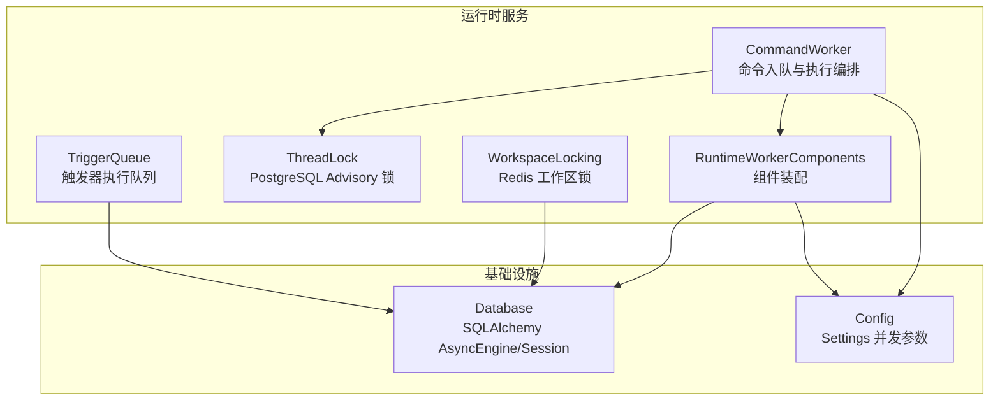
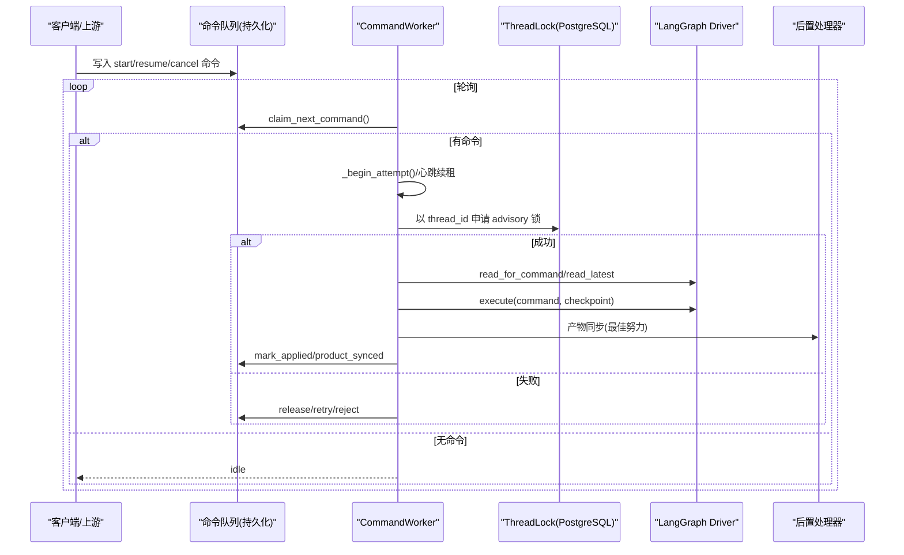
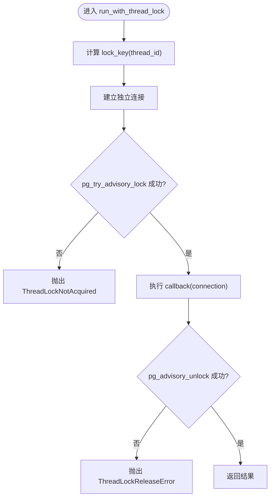
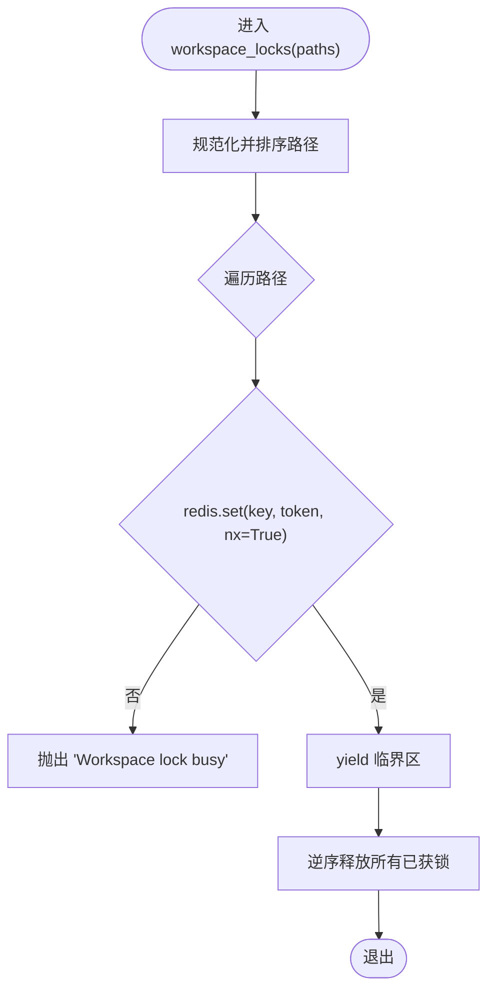
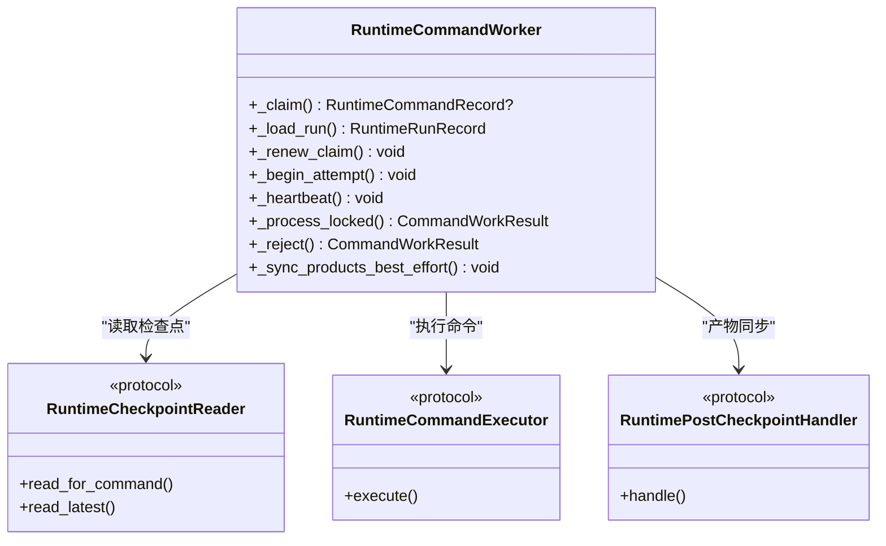
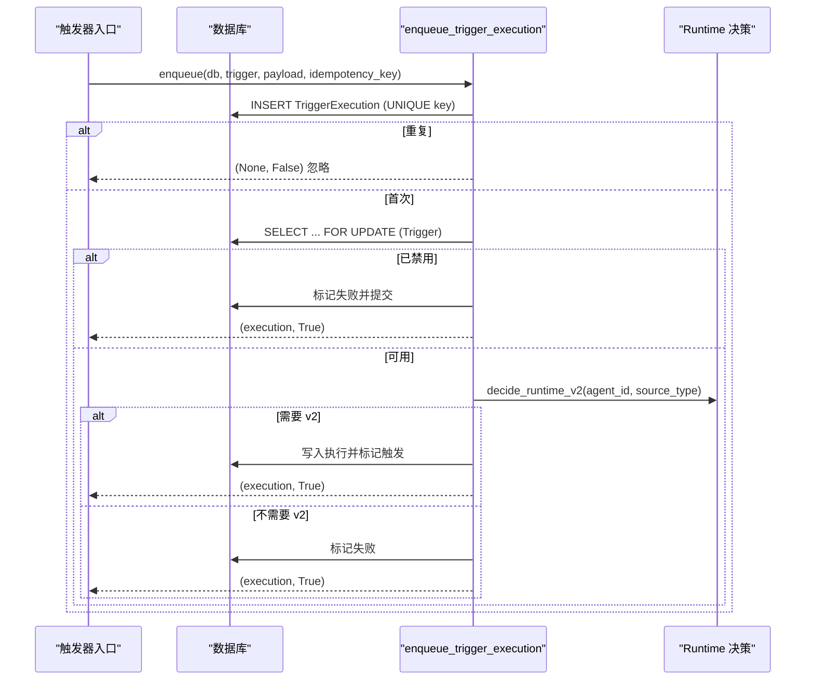
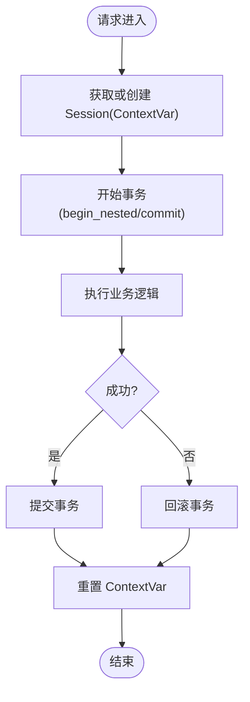
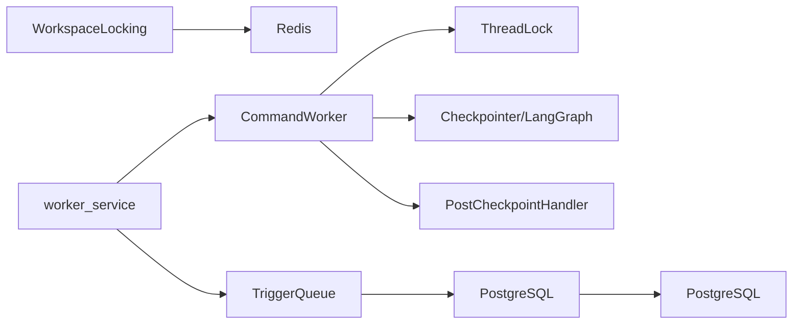

# 并发控制机制

<cite>
**本文引用的文件**   
- [thread_lock.py](file://backend/app/services/agent_runtime/thread_lock.py)
- [workspace_locking.py](file://backend/app/services/workspace_locking.py)
- [worker_service.py](file://backend/app/services/agent_runtime/worker_service.py)
- [command_worker.py](file://backend/app/services/agent_runtime/command_worker.py)
- [queue.py](file://backend/app/services/trigger_runtime/queue.py)
- [database.py](file://backend/app/database.py)
- [config.py](file://backend/app/config.py)
</cite>

## 目录
1. [简介](#简介)
2. [项目结构](#项目结构)
3. [核心组件](#核心组件)
4. [架构总览](#架构总览)
5. [详细组件分析](#详细组件分析)
6. [依赖关系分析](#依赖关系分析)
7. [性能考虑](#性能考虑)
8. [故障排查指南](#故障排查指南)
9. [结论](#结论)
10. [附录：并发测试与压测指南](#附录并发测试与压测指南)

## 简介
本技术文档聚焦于 Clawith 的并发控制机制，围绕多 Worker 进程间的锁机制、线程安全设计、并发度控制策略、监控与优化以及并发测试方法展开。系统采用“数据库会话级 advisory 锁 + Redis 短生命周期分布式锁 + 内存上下文隔离”的组合方案，确保在分布式环境下对 Agent Run 线程、工作区写操作、触发器执行等关键路径具备强一致性与高吞吐能力。

## 项目结构
与并发控制直接相关的后端模块主要位于 backend/app/services/agent_runtime 与 backend/app/services/trigger_runtime，同时依赖全局数据库连接池与配置中心。

图表来源 
- [worker_service.py:201-352](file://backend/app/services/agent_runtime/worker_service.py#L201-L352)
- [command_worker.py:312-361](file://backend/app/services/agent_runtime/command_worker.py#L312-L361)
- [thread_lock.py:60-89](file://backend/app/services/agent_runtime/thread_lock.py#L60-L89)
- [workspace_locking.py:40-81](file://backend/app/services/workspace_locking.py#L40-L81)
- [queue.py:60-153](file://backend/app/services/trigger_runtime/queue.py#L60-L153)
- [database.py:14-21](file://backend/app/database.py#L14-L21)
- [config.py:132-161](file://backend/app/config.py#L132-L161)

章节来源
- [worker_service.py:201-352](file://backend/app/services/agent_runtime/worker_service.py#L201-L352)
- [command_worker.py:312-361](file://backend/app/services/agent_runtime/command_worker.py#L312-L361)
- [thread_lock.py:60-89](file://backend/app/services/agent_runtime/thread_lock.py#L60-L89)
- [workspace_locking.py:40-81](file://backend/app/services/workspace_locking.py#L40-L81)
- [queue.py:60-153](file://backend/app/services/trigger_runtime/queue.py#L60-L153)
- [database.py:14-21](file://backend/app/database.py#L14-L21)
- [config.py:132-161](file://backend/app/config.py#L132-L161)

## 核心组件
- PostgreSQL 会话级 Advisory 锁（ThreadLock）
  - 为每个 Agent Runtime 线程提供独占访问，避免同一 run/thread 的多进程竞争。
  - 通过专用连接持有锁，失败不回调，释放时校验所有权，异常抛出明确错误类型。
- Redis 工作区锁（WorkspaceLocking）
  - 针对工作区路径的短生命周期分布式锁，使用 owner_token 原子释放，防止误删。
  - 支持批量归一化路径后顺序获取，失败快速回滚已获锁集合。
- 命令工作者（CommandWorker）
  - 负责从持久化命令队列中 claim、renew、执行、结算；结合 ThreadLock 保证单线程串行执行。
  - 内置重试、拒绝、心跳续租、幂等校验与产物同步。
- 触发器执行队列（TriggerQueue）
  - 基于唯一 idempotency_key 去重插入执行记录，配合 with_for_update 行级锁保障一致性。
- 数据库连接与事务上下文（Database）
  - 异步引擎与 Session 工厂，ContextVar 传递当前事务上下文，统一提交/回滚。
- 配置（Config）
  - 集中管理并发度、Claim TTL、扫描间隔、压缩阈值等关键并发参数。

章节来源
- [thread_lock.py:18-89](file://backend/app/services/agent_runtime/thread_lock.py#L18-L89)
- [workspace_locking.py:10-81](file://backend/app/services/workspace_locking.py#L10-L81)
- [command_worker.py:312-361](file://backend/app/services/agent_runtime/command_worker.py#L312-L361)
- [queue.py:60-153](file://backend/app/services/trigger_runtime/queue.py#L60-L153)
- [database.py:30-79](file://backend/app/database.py#L30-L79)
- [config.py:132-161](file://backend/app/config.py#L132-L161)

## 架构总览
下图展示了多 Worker 进程间的关键并发控制流程：命令入队、Claim、Advisory 锁、Graph 执行、产物同步与重试。

图表来源 
- [command_worker.py:362-454](file://backend/app/services/agent_runtime/command_worker.py#L362-L454)
- [thread_lock.py:60-89](file://backend/app/services/agent_runtime/thread_lock.py#L60-L89)
- [worker_service.py:587-668](file://backend/app/services/agent_runtime/worker_service.py#L587-L668)

章节来源
- [command_worker.py:362-454](file://backend/app/services/agent_runtime/command_worker.py#L362-L454)
- [thread_lock.py:60-89](file://backend/app/services/agent_runtime/thread_lock.py#L60-L89)
- [worker_service.py:587-668](file://backend/app/services/agent_runtime/worker_service.py#L587-L668)

## 详细组件分析

### PostgreSQL 会话级 Advisory 锁（ThreadLock）
- 设计要点
  - 通过 blake2b 将 thread_id 映射为稳定的 bigint 键，避免冲突。
  - 使用独立连接执行 pg_try_advisory_lock/pg_advisory_unlock，失败即抛错，确保调用方感知。
  - 释放时校验返回值，若非所有者则抛出释放错误，便于定位问题。
- 复杂度与影响
  - 时间复杂度 O(1)，空间复杂度 O(1)。
  - 跨进程串行化同一 thread_id 的执行，避免竞态条件与重复执行。
- 错误处理
  - 未获得锁：ThreadLockNotAcquired
  - 释放失败：ThreadLockReleaseError

图表来源 
- [thread_lock.py:40-89](file://backend/app/services/agent_runtime/thread_lock.py#L40-L89)

章节来源
- [thread_lock.py:18-89](file://backend/app/services/agent_runtime/thread_lock.py#L18-L89)

### Redis 工作区锁（WorkspaceLocking）
- 设计要点
  - 路径规范化后生成 key，set NX + TTL 实现原子加锁。
  - 使用 Lua 脚本按 owner_token 原子删除，避免误删其他持有者锁。
  - 批量获取时排序并顺序尝试，任一失败立即回滚已获锁。
- 复杂度与影响
  - 单次 set/eval 均为 O(1)，批量获取线性于路径数。
  - 适合短时写操作的互斥保护，TTL 防死锁。
- 错误处理
  - 获取失败：抛出 RuntimeError 提示路径忙。

图表来源 
- [workspace_locking.py:40-81](file://backend/app/services/workspace_locking.py#L40-L81)

章节来源
- [workspace_locking.py:10-81](file://backend/app/services/workspace_locking.py#L10-L81)

### 命令工作者（CommandWorker）与调度守护
- 设计要点
  - Claim/TTL/Renew/MaxAttempts 构成可靠的工作单元边界。
  - 结合 ThreadLock 保证同一 run/thread 的串行执行。
  - 分类 Checkpoint 状态，区分 runnable/waiting/terminal/inconsistent。
  - 产物同步采用“最佳努力”，失败不影响主事务一致性。
- 并发度控制
  - 由 worker_service 启动 N 个 CommandDaemon，N 来自 AGENT_RUNTIME_COMMAND_CONCURRENCY。
  - 各 Daemon 独立轮询，内部通过 DB 行级锁与 Claim 表实现去重与公平调度。
- 错误与重试
  - RetryableCommandError 允许重新 claim；Rejected 表示确定性拒绝。
  - 心跳续租失败仅记录日志，不影响主流程。

图表来源 
- [command_worker.py:312-361](file://backend/app/services/agent_runtime/command_worker.py#L312-L361)
- [command_worker.py:694-800](file://backend/app/services/agent_runtime/command_worker.py#L694-L800)
- [worker_service.py:355-403](file://backend/app/services/agent_runtime/worker_service.py#L355-L403)

章节来源
- [command_worker.py:312-361](file://backend/app/services/agent_runtime/command_worker.py#L312-L361)
- [command_worker.py:694-800](file://backend/app/services/agent_runtime/command_worker.py#L694-L800)
- [worker_service.py:355-403](file://backend/app/services/agent_runtime/worker_service.py#L355-L403)

### 触发器执行队列（TriggerQueue）
- 设计要点
  - 使用 idempotency_key 唯一约束避免重复执行。
  - 插入执行记录后，使用 with_for_update 锁定 Trigger 行，判断是否启用并决定后续动作。
  - 根据 decide_runtime_v2 决策是否走统一 Runtime v2，否则标记失败。
- 并发特性
  - 数据库层行级锁保证并发插入与状态检查的一致性。
  - 失败路径快速回写状态，避免悬挂任务。

图表来源 
- [queue.py:60-153](file://backend/app/services/trigger_runtime/queue.py#L60-L153)

章节来源
- [queue.py:60-153](file://backend/app/services/trigger_runtime/queue.py#L60-L153)

### 数据库连接与事务上下文（Database）
- 设计要点
  - 使用 SQLAlchemy AsyncEngine 创建连接池，pool_size/max_overflow 控制并发上限。
  - ContextVar 传递当前事务上下文，确保嵌套调用共享同一 Session。
  - get_db 与 transaction 管理器统一 commit/rollback，简化错误恢复。
- 并发特性
  - 连接池限制整体并发 IO 能力，避免数据库过载。
  - 事务边界清晰，减少长事务导致的锁竞争。

图表来源 
- [database.py:30-79](file://backend/app/database.py#L30-L79)

章节来源
- [database.py:30-79](file://backend/app/database.py#L30-L79)

### 配置与并发度控制（Config）
- 关键并发参数
  - AGENT_RUNTIME_COMMAND_CONCURRENCY：单进程内并发执行的命令数量。
  - AGENT_RUNTIME_COMMAND_CLAIM_TTL_SECONDS / CLAIM_RENEW_SECONDS：Claim 生命周期与续租周期。
  - AGENT_RUNTIME_COMMAND_MAX_ATTEMPTS：最大尝试次数。
  - 通道投递、异步工具轮询、会话压缩等扫描间隔与批大小。
- 校验与默认值
  - 模型验证确保续租小于过期时间，必填字段非空。
  - 容器环境自动选择合适默认路径与行为。

章节来源
- [config.py:132-161](file://backend/app/config.py#L132-L161)
- [config.py:227-234](file://backend/app/config.py#L227-L234)

## 依赖关系分析
- 组件耦合
  - CommandWorker 依赖 ThreadLock、Checkpointer、PostCheckpointHandler。
  - WorkspaceLocking 依赖 Redis 事件总线。
  - TriggerQueue 依赖数据库行级锁与 Runtime 决策。
- 外部依赖
  - PostgreSQL（advisory lock、行级锁、迁移版本）。
  - Redis（分布式锁、事件）。
  - LangGraph（检查点与图驱动）。
- 潜在循环依赖
  - 通过 Protocol 与接口解耦，避免直接循环导入。
- 集成点
  - worker_service 组装所有组件并启动守护进程。
  - database.py 提供统一的连接与事务上下文。

图表来源 
- [worker_service.py:201-352](file://backend/app/services/agent_runtime/worker_service.py#L201-L352)
- [command_worker.py:312-361](file://backend/app/services/agent_runtime/command_worker.py#L312-L361)
- [workspace_locking.py:40-81](file://backend/app/services/workspace_locking.py#L40-L81)
- [queue.py:60-153](file://backend/app/services/trigger_runtime/queue.py#L60-L153)

章节来源
- [worker_service.py:201-352](file://backend/app/services/agent_runtime/worker_service.py#L201-L352)
- [command_worker.py:312-361](file://backend/app/services/agent_runtime/command_worker.py#L312-L361)
- [workspace_locking.py:40-81](file://backend/backend/app/services/workspace_locking.py#L40-L81)
- [queue.py:60-153](file://backend/app/services/trigger_runtime/queue.py#L60-L153)

## 性能考虑
- 连接池与超时
  - 调整 pool_size/max_overflow 匹配数据库容量与业务峰值。
  - 合理设置 Claim TTL 与续租间隔，避免频繁锁竞争与长事务。
- 锁粒度与范围
  - ThreadLock 以 thread_id 为粒度，最小化锁范围。
  - WorkspaceLocking 以路径为单位，避免全量锁。
- 重试与退避
  - 使用指数退避与最大重试次数，降低雪崩风险。
  - 产物同步采用最佳努力，避免阻塞主流程。
- 监控指标建议
  - 命令队列长度、Claim 成功率、Advisory 锁等待时长、Redis 锁争用率、数据库连接池使用率、错误率与延迟分布。

[本节为通用指导，无需特定文件引用]

## 故障排查指南
- 常见错误与定位
  - ThreadLockNotAcquired：检查 thread_id 唯一性、PostgreSQL 连接与锁键生成。
  - ThreadLockReleaseError：确认释放连接是否为持有锁的连接。
  - Workspace lock busy：检查 TTL 与 owner_token 是否正确，是否存在长时间未释放的锁。
  - Trigger execution failed：查看 idempotency_key 冲突、Trigger 是否禁用、Runtime v2 决策原因。
- 诊断步骤
  - 查看命令重试与拒绝码，定位具体错误码与消息。
  - 检查数据库迁移版本与表存在性，确保 schema 就绪。
  - 观察守护进程的扫描间隔与错误延迟，评估负载与背压。

章节来源
- [thread_lock.py:18-38](file://backend/app/services/agent_runtime/thread_lock.py#L18-L38)
- [workspace_locking.py:74-76](file://backend/app/services/workspace_locking.py#L74-L76)
- [queue.py:108-153](file://backend/app/services/trigger_runtime/queue.py#L108-L153)
- [worker_service.py:164-199](file://backend/app/services/agent_runtime/worker_service.py#L164-L199)

## 结论
Clawith 的并发控制机制通过“数据库 advisory 锁 + Redis 分布式锁 + 连接池与事务上下文”的组合，实现了在多 Worker 进程下的高一致性与高吞吐。CommandWorker 与 TriggerQueue 分别承担命令与工作流调度的职责，配合严格的 Claim/TTL/重试策略与幂等控制，确保系统在复杂场景下的稳定性。通过合理的配置与监控，可进一步优化性能与可靠性。

[本节为总结，无需特定文件引用]

## 附录：并发测试与压测指南
- 并发测试方法
  - 单元测试：模拟 Claim/Release、Advisory 锁获取失败、Redis 锁争用与释放失败场景。
  - 集成测试：启动多 Worker 进程，注入大量命令与触发器，验证幂等与一致性。
  - 端到端测试：模拟真实负载，观察队列堆积、锁等待与错误率。
- 压力测试工具使用
  - 使用并发客户端发送 start/resume/cancel 命令，逐步提升 QPS。
  - 监控数据库连接池、Redis 命中率与锁争用指标。
  - 调整 AGENT_RUNTIME_COMMAND_CONCURRENCY、Claim TTL、扫描间隔等参数，观察吞吐与延迟变化。
- 常见问题定位
  - 若出现锁争用过高，检查 thread_id 分布与路径热点。
  - 若数据库连接耗尽，调整 pool_size 与查询耗时。
  - 若 Redis 锁频繁超时，检查业务执行时间与 TTL 配置。

[本节为通用指导，无需特定文件引用]