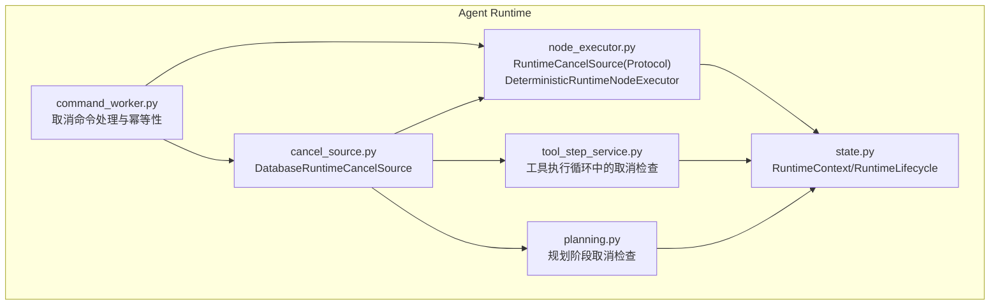
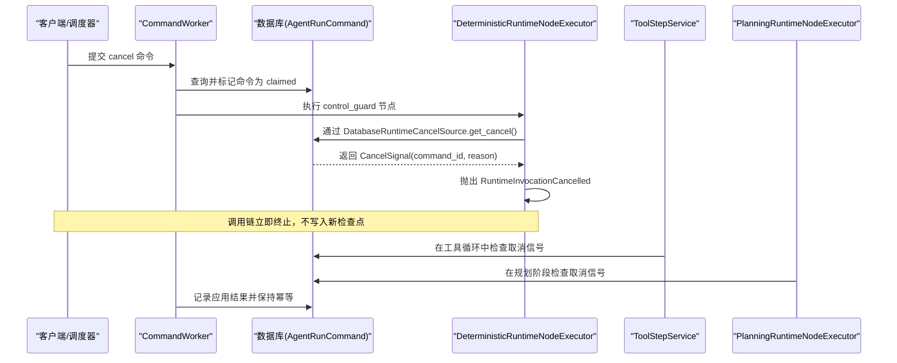
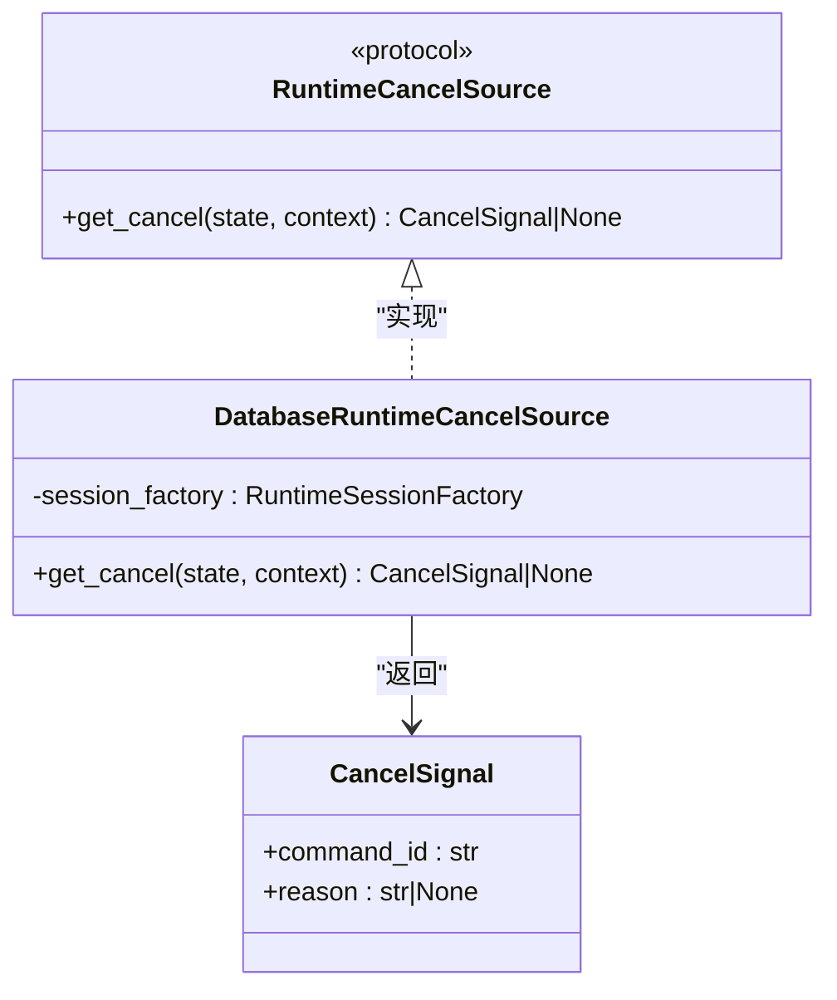
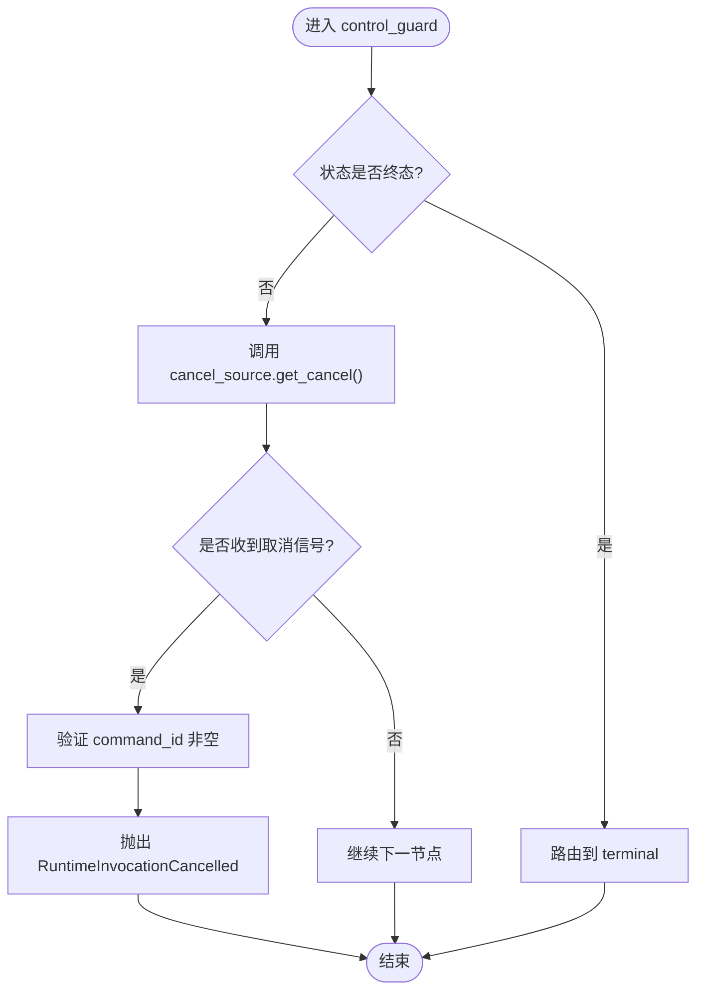
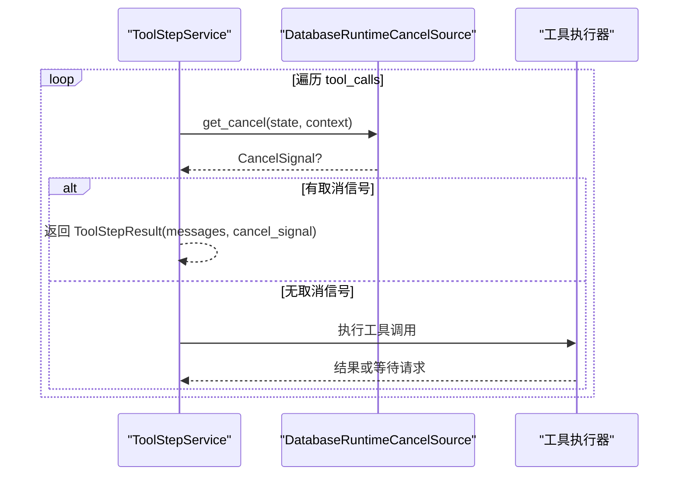
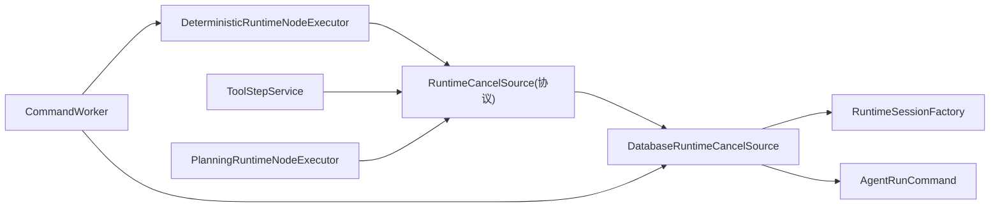

# 取消源管理

<cite>
**本文引用的文件**   
- [backend/app/services/agent_runtime/cancel_source.py](file://backend/app/services/agent_runtime/cancel_source.py)
- [backend/app/services/agent_runtime/node_executor.py](file://backend/app/services/agent_runtime/node_executor.py)
- [backend/app/services/agent_runtime/tool_step_service.py](file://backend/app/services/agent_runtime/tool_step_service.py)
- [backend/app/services/agent_runtime/planning.py](file://backend/app/services/agent_runtime/planning.py)
- [backend/app/services/agent_runtime/command_worker.py](file://backend/app/services/agent_runtime/command_worker.py)
- [backend/app/services/agent_runtime/state.py](file://backend/app/services/agent_runtime/state.py)
- [backend/tests/test_agent_runtime_cancel_source.py](file://backend/tests/test_agent_runtime_cancel_source.py)
- [backend/tests/test_agent_runtime_node_executor.py](file://backend/tests/test_agent_runtime_node_executor.py)
</cite>

## 目录
1. [简介](#简介)
2. [项目结构](#项目结构)
3. [核心组件](#核心组件)
4. [架构总览](#架构总览)
5. [详细组件分析](#详细组件分析)
6. [依赖关系分析](#依赖关系分析)
7. [性能考量](#性能考量)
8. [故障排查指南](#故障排查指南)
9. [结论](#结论)
10. [附录](#附录)

## 简介
本技术文档围绕 Clawith 的“取消源管理系统”展开，聚焦于 CancelSource 的设计模式与实现原理。内容涵盖：
- 取消信号的传播机制与优先级
- 资源清理策略与幂等性保证
- 与异步任务、工具执行、模型调用的集成方式
- 取消状态的监控与调试方法
- 最佳实践与常见问题解决方案

该系统的核心思想是：通过一个“持久化的取消源”在运行时节点间传播取消信号，确保在任何可恢复的检查点处都能快速响应取消请求，避免资源泄漏和状态不一致。

## 项目结构
取消源相关代码主要位于后端 agent_runtime 服务中，关键文件包括：
- cancel_source.py：定义取消源接口与数据库实现
- node_executor.py：定义取消信号、取消协议与节点执行器中的控制守卫
- tool_step_service.py：工具执行过程中的取消检查
- planning.py：规划阶段的取消检查
- command_worker.py：命令工作器对取消命令的处理与幂等性
- state.py：运行时上下文与生命周期状态定义
- tests/*：单元测试覆盖取消源行为与异常路径

**图表来源** 
- [backend/app/services/agent_runtime/cancel_source.py:55-81](file://backend/app/services/agent_runtime/cancel_source.py#L55-L81)
- [backend/app/services/agent_runtime/node_executor.py:122-129](file://backend/app/services/agent_runtime/node_executor.py#L122-L129)
- [backend/app/services/agent_runtime/tool_step_service.py:1300-1350](file://backend/app/services/agent_runtime/tool_step_service.py#L1300-L1350)
- [backend/app/services/agent_runtime/planning.py:560-572](file://backend/app/services/agent_runtime/planning.py#L560-L572)
- [backend/app/services/agent_runtime/command_worker.py:717-800](file://backend/app/services/agent_runtime/command_worker.py#L717-L800)
- [backend/app/services/agent_runtime/state.py:100-135](file://backend/app/services/agent_runtime/state.py#L100-L135)

**章节来源**
- [backend/app/services/agent_runtime/cancel_source.py:1-88](file://backend/app/services/agent_runtime/cancel_source.py#L1-L88)
- [backend/app/services/agent_runtime/node_executor.py:1-1207](file://backend/app/services/agent_runtime/node_executor.py#L1-L1207)
- [backend/app/services/agent_runtime/tool_step_service.py:560-688](file://backend/app/services/agent_runtime/tool_step_service.py#L560-L688)
- [backend/app/services/agent_runtime/planning.py:533-688](file://backend/app/services/agent_runtime/planning.py#L533-L688)
- [backend/app/services/agent_runtime/command_worker.py:1-800](file://backend/app/services/agent_runtime/command_worker.py#L1-L800)
- [backend/app/services/agent_runtime/state.py:1-200](file://backend/app/services/agent_runtime/state.py#L1-L200)

## 核心组件
- RuntimeCancelSource（协议）：定义 get_cancel(state, context) -> CancelSignal | None
- DatabaseRuntimeCancelSource：从命令表读取持久化取消请求，返回第一个待处理的取消信号
- CancelSignal：包含 command_id 与可选 reason 的不可变数据结构
- DeterministicRuntimeNodeExecutor：在每个控制守卫节点检查取消信号，若存在则抛出 RuntimeInvocationCancelled
- ToolStepService：在工具调用循环中逐次检查取消信号，支持部分消息返回与中断
- PlanningRuntimeNodeExecutor：在规划阶段同样检查取消信号
- CommandWorker：处理“cancel”命令，确保幂等性与一致性，不修改已保存的检查点

**章节来源**
- [backend/app/services/agent_runtime/node_executor.py:122-129](file://backend/app/services/agent_runtime/node_executor.py#L122-L129)
- [backend/app/services/agent_runtime/cancel_source.py:55-81](file://backend/app/services/agent_runtime/cancel_source.py#L55-L81)
- [backend/app/services/agent_runtime/tool_step_service.py:1300-1350](file://backend/app/services/agent_runtime/tool_step_service.py#L1300-L1350)
- [backend/app/services/agent_runtime/planning.py:560-572](file://backend/app/services/agent_runtime/planning.py#L560-L572)
- [backend/app/services/agent_runtime/command_worker.py:717-800](file://backend/app/services/agent_runtime/command_worker.py#L717-L800)

## 架构总览
取消源系统采用“协议 + 实现”的分层设计：
- 上层节点执行器（NodeExecutor）通过 RuntimeCancelSource 协议获取取消信号
- 具体实现 DatabaseRuntimeCancelSource 从命令表查询“pending/claimed”状态的 cancel 命令
- 一旦检测到取消信号，立即抛出 RuntimeInvocationCancelled，终止当前调用链
- 工具执行与规划阶段均嵌入取消检查点，确保细粒度中断能力
- 命令工作器负责将 cancel 命令应用到控制边界，保持幂等与一致性

**图表来源** 
- [backend/app/services/agent_runtime/command_worker.py:717-800](file://backend/app/services/agent_runtime/command_worker.py#L717-L800)
- [backend/app/services/agent_runtime/node_executor.py:493-511](file://backend/app/services/agent_runtime/node_executor.py#L493-L511)
- [backend/app/services/agent_runtime/tool_step_service.py:1300-1350](file://backend/app/services/agent_runtime/tool_step_service.py#L1300-L1350)
- [backend/app/services/agent_runtime/planning.py:560-572](file://backend/app/services/agent_runtime/planning.py#L560-L572)

## 详细组件分析

### 取消源协议与实现
- RuntimeCancelSource 协议定义了统一的 get_cancel 接口，解耦上层逻辑与底层存储
- DatabaseRuntimeCancelSource 使用 SQLAlchemy 查询 AgentRunCommand 表中 tenant_id/run_id/command_type="cancel"/status in ("pending","claimed") 的记录，按 created_at 与 id 排序返回第一条
- 校验 payload 结构，确保 reason 字段类型正确，否则抛出 RuntimeCancelSourceError

**图表来源** 
- [backend/app/services/agent_runtime/node_executor.py:122-129](file://backend/app/services/agent_runtime/node_executor.py#L122-L129)
- [backend/app/services/agent_runtime/cancel_source.py:55-81](file://backend/app/services/agent_runtime/cancel_source.py#L55-L81)

**章节来源**
- [backend/app/services/agent_runtime/cancel_source.py:16-53](file://backend/app/services/agent_runtime/cancel_source.py#L16-L53)
- [backend/app/services/agent_runtime/cancel_source.py:55-81](file://backend/app/services/agent_runtime/cancel_source.py#L55-L81)

### 节点执行器中的取消检查
- DeterministicRuntimeNodeExecutor._control_guard 在每个控制点调用 cancel_source.get_cancel
- 若返回非空 CancelSignal，验证 command_id 非空后抛出 RuntimeInvocationCancelled
- 该异常携带 command_id 与 reason，用于上层日志与监控

**图表来源** 
- [backend/app/services/agent_runtime/node_executor.py:493-511](file://backend/app/services/agent_runtime/node_executor.py#L493-L511)

**章节来源**
- [backend/app/services/agent_runtime/node_executor.py:472-491](file://backend/app/services/agent_runtime/node_executor.py#L472-L491)
- [backend/app/services/agent_runtime/node_executor.py:493-511](file://backend/app/services/agent_runtime/node_executor.py#L493-L511)

### 工具执行中的取消集成
- ToolStepService 在工具调用循环中，每次迭代前检查取消信号
- 若检测到取消，立即返回 ToolStepResult，包含已收集的消息与 cancel_signal
- 支持部分完成与尾调用延迟，确保取消不影响已完成的工具结果

**图表来源** 
- [backend/app/services/agent_runtime/tool_step_service.py:1300-1350](file://backend/app/services/agent_runtime/tool_step_service.py#L1300-L1350)

**章节来源**
- [backend/app/services/agent_runtime/tool_step_service.py:1300-1350](file://backend/app/services/agent_runtime/tool_step_service.py#L1300-L1350)

### 规划阶段的取消检查
- PlanningRuntimeNodeExecutor 在 control 节点中同样调用 cancel_source.get_cancel
- 若存在取消信号，抛出 RuntimeInvocationCancelled，确保规划过程可被及时中断

**章节来源**
- [backend/app/services/agent_runtime/planning.py:560-572](file://backend/app/services/agent_runtime/planning.py#L560-L572)

### 命令工作器对取消命令的处理
- CommandWorker 在处理 cancel 命令时：
  - 若检查点不存在，调用 reject_unstarted_run_for_cancel 并标记应用
  - 若检查点存在且非终态，保留最后检查点作为取消边界，标记命令已应用
  - 确保 cancel 命令不创建新检查点，仅作为控制事实
- 提供心跳续租与重试机制，保证分布式环境下的可靠性

**章节来源**
- [backend/app/services/agent_runtime/command_worker.py:717-800](file://backend/app/services/agent_runtime/command_worker.py#L717-L800)

## 依赖关系分析
- NodeExecutor 依赖 RuntimeCancelSource 协议，解耦具体实现
- DatabaseRuntimeCancelSource 依赖 RuntimeSessionFactory 与 AgentRunCommand 模型
- ToolStepService 与 PlanningRuntimeNodeExecutor 直接注入 cancel_source 实例
- CommandWorker 与 cancel_source 协同，确保命令级幂等与一致性

**图表来源** 
- [backend/app/services/agent_runtime/node_executor.py:472-491](file://backend/app/services/agent_runtime/node_executor.py#L472-L491)
- [backend/app/services/agent_runtime/tool_step_service.py:586-619](file://backend/app/services/agent_runtime/tool_step_service.py#L586-L619)
- [backend/app/services/agent_runtime/planning.py:533-544](file://backend/app/services/agent_runtime/planning.py#L533-L544)
- [backend/app/services/agent_runtime/cancel_source.py:55-81](file://backend/app/services/agent_runtime/cancel_source.py#L55-L81)
- [backend/app/services/agent_runtime/command_worker.py:312-361](file://backend/app/services/agent_runtime/command_worker.py#L312-L361)

**章节来源**
- [backend/app/services/agent_runtime/node_executor.py:472-491](file://backend/app/services/agent_runtime/node_executor.py#L472-L491)
- [backend/app/services/agent_runtime/tool_step_service.py:586-619](file://backend/app/services/agent_runtime/tool_step_service.py#L586-L619)
- [backend/app/services/agent_runtime/planning.py:533-544](file://backend/app/services/agent_runtime/planning.py#L533-L544)
- [backend/app/services/agent_runtime/cancel_source.py:55-81](file://backend/app/services/agent_runtime/cancel_source.py#L55-L81)
- [backend/app/services/agent_runtime/command_worker.py:312-361](file://backend/app/services/agent_runtime/command_worker.py#L312-L361)

## 性能考量
- 取消查询仅在控制守卫与工具循环关键点触发，避免频繁数据库访问
- DatabaseRuntimeCancelSource 使用索引友好的查询条件（tenant_id, run_id, command_type, status）
- 工具执行支持部分结果返回，减少长耗时操作的阻塞
- 命令工作器的心跳续租机制防止长时间运行任务被误释放

[本节为通用指导，无需特定文件引用]

## 故障排查指南
常见错误与处理方法：
- RuntimeCancelSourceError：payload 结构非法，检查命令数据完整性
- RuntimeInvocationCancelled：取消信号有效但 command_id 为空，需修正上游生成逻辑
- 取消未生效：确认命令状态为 pending/claimed，且租户与运行 ID 匹配
- 资源泄漏：确保工具执行循环中正确处理 cancel_signal，避免忽略部分结果

**章节来源**
- [backend/app/services/agent_runtime/cancel_source.py:16-34](file://backend/app/services/agent_runtime/cancel_source.py#L16-L34)
- [backend/app/services/agent_runtime/node_executor.py:47-54](file://backend/app/services/agent_runtime/node_executor.py#L47-L54)
- [backend/tests/test_agent_runtime_cancel_source.py:180-195](file://backend/tests/test_agent_runtime_cancel_source.py#L180-L195)

## 结论
Clawith 的取消源管理系统通过协议抽象、持久化命令与细粒度检查点，实现了高效、可靠且幂等的取消机制。其设计确保了：
- 快速响应取消请求，避免资源浪费
- 与工具执行、模型调用无缝集成
- 分布式环境下的容错与一致性
- 易于监控与调试的错误传播

建议在生产环境中：
- 合理配置命令 TTL 与心跳间隔
- 监控取消命令的积压与处理延迟
- 定期审计取消原因与频率，优化用户体验

[本节为总结性内容，无需特定文件引用]

## 附录
- 最佳实践：
  - 在所有长耗时操作前插入取消检查点
  - 使用 cancel_signal.reason 记录用户意图，便于分析
  - 避免在取消后执行副作用操作，确保幂等性
- 测试建议：
  - 模拟不同状态的取消命令，验证幂等性
  - 覆盖工具执行中途取消的场景，确保部分结果正确返回
  - 验证检查点一致性，避免状态漂移

[本节为补充信息，无需特定文件引用]