# 异步任务处理

<cite>
**本文引用的文件**   
- [backend/app/services/agent_runtime/worker_service.py](file://backend/app/services/agent_runtime/worker_service.py)
- [backend/app/services/agent_runtime/command_worker.py](file://backend/app/services/agent_runtime/command_worker.py)
- [backend/app/api/tasks.py](file://backend/app/api/tasks.py)
- [backend/app/models/task.py](file://backend/app/models/task.py)
- [backend/app/services/task_executor.py](file://backend/app/services/task_executor.py)
- [backend/app/services/agent_runtime/task_completion.py](file://backend/app/services/agent_runtime/task_completion.py)
- [backend/app/services/agent_runtime/thread_lock.py](file://backend/app/services/agent_runtime/thread_lock.py)
- [backend/app/services/agent_runtime/cancel_source.py](file://backend/app/services/agent_runtime/cancel_source.py)
- [backend/app/services/agent_runtime/async_tool_poll.py](file://backend/app/services/agent_runtime/async_tool_poll.py)
- [backend/app/services/agent_runtime/scheduling_lane.py](file://backend/app/services/agent_runtime/scheduling_lane.py)
- [backend/app/services/agent_runtime/config.py](file://backend/app/services/agent_runtime/config.py)
- [backend/tests/test_agent_runtime_worker_service.py](file://backend/tests/test_agent_runtime_worker_service.py)
- [backend/tests/test_agent_runtime_command_worker.py](file://backend/tests/test_agent_runtime_command_worker.py)
- [backend/tests/test_agent_runtime_task_completion.py](file://backend/tests/test_agent_runtime_task_completion.py)
</cite>

## 目录
1. [简介](#简介)
2. [项目结构](#项目结构)
3. [核心组件](#核心组件)
4. [架构总览](#架构总览)
5. [详细组件分析](#详细组件分析)
6. [依赖关系分析](#依赖关系分析)
7. [性能考量](#性能考量)
8. [故障排查指南](#故障排查指南)
9. [结论](#结论)
10. [附录](#附录)

## 简介
本技术文档聚焦于 Clawith 的异步任务处理系统，围绕以下主题展开：
- 异步任务调度与轮询机制
- 取消源管理与任务生命周期控制
- 线程锁、并发控制与资源竞争处理
- Worker 服务架构、任务队列与负载均衡
- 任务优先级、重试策略与超时处理
- 异步编程模式与性能调优建议

该文档面向开发者与运维人员，既提供高层架构视图，也深入到关键模块的实现细节，帮助读者理解并优化系统的稳定性与吞吐能力。

## 项目结构
与异步任务处理相关的代码主要分布在后端服务的 agent_runtime 子系统中，包括 Worker 服务、命令工作器、任务模型、API 入口、执行器以及辅助能力（线程锁、取消源、轮询等）。测试用例覆盖关键路径，便于回归验证。

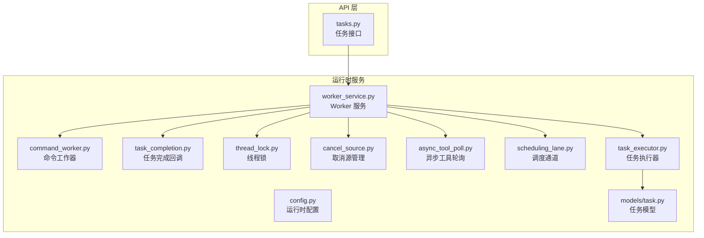

图表来源
- [backend/app/api/tasks.py](file://backend/app/api/tasks.py)
- [backend/app/services/agent_runtime/worker_service.py](file://backend/app/services/agent_runtime/worker_service.py)
- [backend/app/services/agent_runtime/command_worker.py](file://backend/app/services/agent_runtime/command_worker.py)
- [backend/app/services/agent_runtime/task_completion.py](file://backend/app/services/agent_runtime/task_completion.py)
- [backend/app/services/agent_runtime/thread_lock.py](file://backend/app/services/agent_runtime/thread_lock.py)
- [backend/app/services/agent_runtime/cancel_source.py](file://backend/app/services/agent_runtime/cancel_source.py)
- [backend/app/services/agent_runtime/async_tool_poll.py](file://backend/app/services/agent_runtime/async_tool_poll.py)
- [backend/app/services/agent_runtime/scheduling_lane.py](file://backend/app/services/agent_runtime/scheduling_lane.py)
- [backend/app/services/agent_runtime/config.py](file://backend/app/services/agent_runtime/config.py)
- [backend/app/services/task_executor.py](file://backend/app/services/task_executor.py)
- [backend/app/models/task.py](file://backend/app/models/task.py)

章节来源
- [backend/app/api/tasks.py](file://backend/app/api/tasks.py)
- [backend/app/services/agent_runtime/worker_service.py](file://backend/app/services/agent_runtime/worker_service.py)
- [backend/app/services/agent_runtime/command_worker.py](file://backend/app/services/agent_runtime/command_worker.py)
- [backend/app/services/agent_runtime/task_completion.py](file://backend/app/services/agent_runtime/task_completion.py)
- [backend/app/services/agent_runtime/thread_lock.py](file://backend/app/services/agent_runtime/thread_lock.py)
- [backend/app/services/agent_runtime/cancel_source.py](file://backend/app/services/agent_runtime/cancel_source.py)
- [backend/app/services/agent_runtime/async_tool_poll.py](file://backend/app/services/agent_runtime/async_tool_poll.py)
- [backend/app/services/agent_runtime/scheduling_lane.py](file://backend/app/services/agent_runtime/scheduling_lane.py)
- [backend/app/services/agent_runtime/config.py](file://backend/app/services/agent_runtime/config.py)
- [backend/app/services/task_executor.py](file://backend/app/services/task_executor.py)
- [backend/app/models/task.py](file://backend/app/models/task.py)

## 核心组件
- Worker 服务：负责拉取任务、分配执行、协调生命周期与状态更新。
- 命令工作器：处理特定类型的命令式任务，如批量操作或后台维护。
- 任务执行器：封装具体任务的执行逻辑，包含重试、超时、错误处理。
- 任务模型：持久化任务元数据、状态、优先级、重试次数、超时时间等。
- 线程锁：保证同一任务实例或共享资源的互斥访问，避免竞态条件。
- 取消源：统一管理任务取消信号，支持外部触发取消与内部传播。
- 异步工具轮询：对需要长轮询的外部工具或服务进行周期性检查与结果聚合。
- 调度通道：按类型或租户划分任务通道，实现隔离与负载均衡。
- 任务完成回调：在任务完成后统一处理结果落库、事件通知与清理。

章节来源
- [backend/app/services/agent_runtime/worker_service.py](file://backend/app/services/agent_runtime/worker_service.py)
- [backend/app/services/agent_runtime/command_worker.py](file://backend/app/services/agent_runtime/command_worker.py)
- [backend/app/services/task_executor.py](file://backend/app/services/task_executor.py)
- [backend/app/models/task.py](file://backend/app/models/task.py)
- [backend/app/services/agent_runtime/thread_lock.py](file://backend/app/services/agent_runtime/thread_lock.py)
- [backend/app/services/agent_runtime/cancel_source.py](file://backend/app/services/agent_runtime/cancel_source.py)
- [backend/app/services/agent_runtime/async_tool_poll.py](file://backend/app/services/agent_runtime/async_tool_poll.py)
- [backend/app/services/agent_runtime/scheduling_lane.py](file://backend/app/services/agent_runtime/scheduling_lane.py)
- [backend/app/services/agent_runtime/task_completion.py](file://backend/app/services/agent_runtime/task_completion.py)

## 架构总览
下图展示了从 API 到 Worker、执行器、模型与回调的整体调用链，体现任务的生命周期流转。

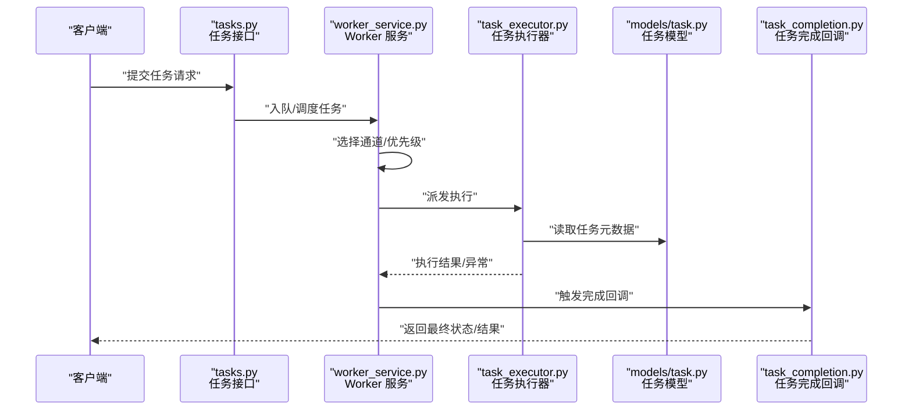

图表来源
- [backend/app/api/tasks.py](file://backend/app/api/tasks.py)
- [backend/app/services/agent_runtime/worker_service.py](file://backend/app/services/agent_runtime/worker_service.py)
- [backend/app/services/task_executor.py](file://backend/app/services/task_executor.py)
- [backend/app/models/task.py](file://backend/app/models/task.py)
- [backend/app/services/agent_runtime/task_completion.py](file://backend/app/services/agent_runtime/task_completion.py)

## 详细组件分析

### Worker 服务（worker_service.py）
- 职责：任务拉取、分派、生命周期管理、与调度通道和线程锁协作。
- 关键点：
  - 基于通道的任务分发，支持按类型或租户隔离。
  - 使用线程锁保护共享状态，避免重复消费与并发写入冲突。
  - 集成取消源，支持任务级取消信号传播。
  - 与任务执行器对接，统一捕获异常与结果。
  - 可配置的重试与退避策略，结合超时控制。

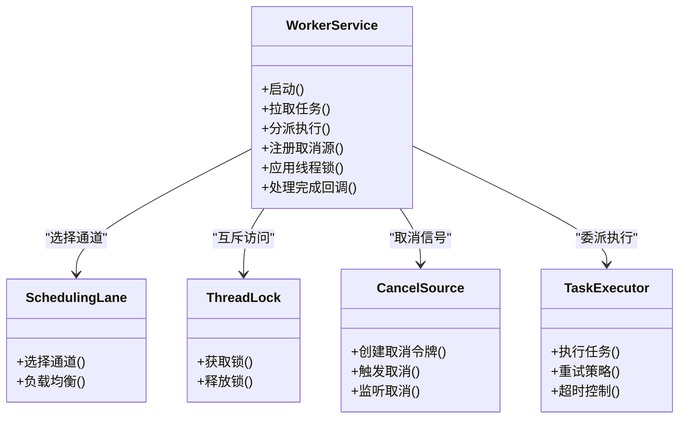

图表来源
- [backend/app/services/agent_runtime/worker_service.py](file://backend/app/services/agent_runtime/worker_service.py)
- [backend/app/services/agent_runtime/scheduling_lane.py](file://backend/app/services/agent_runtime/scheduling_lane.py)
- [backend/app/services/agent_runtime/thread_lock.py](file://backend/app/services/agent_runtime/thread_lock.py)
- [backend/app/services/agent_runtime/cancel_source.py](file://backend/app/services/agent_runtime/cancel_source.py)
- [backend/app/services/task_executor.py](file://backend/app/services/task_executor.py)

章节来源
- [backend/app/services/agent_runtime/worker_service.py](file://backend/app/services/agent_runtime/worker_service.py)
- [backend/tests/test_agent_runtime_worker_service.py](file://backend/tests/test_agent_runtime_worker_service.py)

### 命令工作器（command_worker.py）
- 职责：处理命令式任务，通常用于批量或维护类操作。
- 关键点：
  - 独立的任务通道，避免与常规业务任务争抢资源。
  - 支持幂等性校验与事务边界控制。
  - 与线程锁配合，确保同一命令实例串行执行。

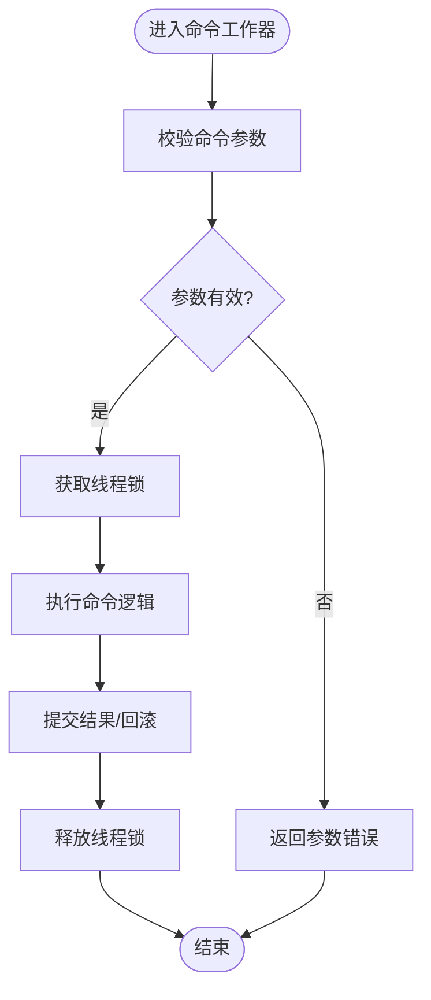

图表来源
- [backend/app/services/agent_runtime/command_worker.py](file://backend/app/services/agent_runtime/command_worker.py)
- [backend/app/services/agent_runtime/thread_lock.py](file://backend/app/services/agent_runtime/thread_lock.py)

章节来源
- [backend/app/services/agent_runtime/command_worker.py](file://backend/app/services/agent_runtime/command_worker.py)
- [backend/tests/test_agent_runtime_command_worker.py](file://backend/tests/test_agent_runtime_command_worker.py)

### 任务执行器（task_executor.py）
- 职责：封装任务执行的核心逻辑，包括重试、超时、错误分类与恢复。
- 关键点：
  - 指数退避重试，支持最大重试次数与间隔上限。
  - 超时控制，防止任务长时间占用资源。
  - 异常分类：可重试、不可重试、用户中断等。
  - 与取消源联动，及时终止阻塞操作。

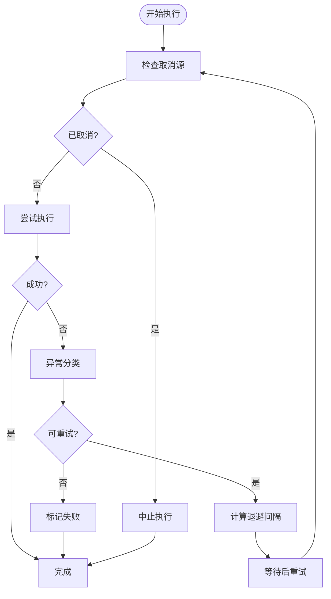

图表来源
- [backend/app/services/task_executor.py](file://backend/app/services/task_executor.py)
- [backend/app/services/agent_runtime/cancel_source.py](file://backend/app/services/agent_runtime/cancel_source.py)

章节来源
- [backend/app/services/task_executor.py](file://backend/app/services/task_executor.py)

### 任务模型（models/task.py）
- 职责：定义任务的数据结构与持久化字段。
- 关键字段：
  - 任务 ID、类型、状态、优先级、重试次数、超时时间、创建/更新时间。
  - 执行上下文、结果摘要、错误信息。
- 约束：
  - 唯一性约束（如任务 ID）。
  - 状态机约束（如仅允许合法状态迁移）。

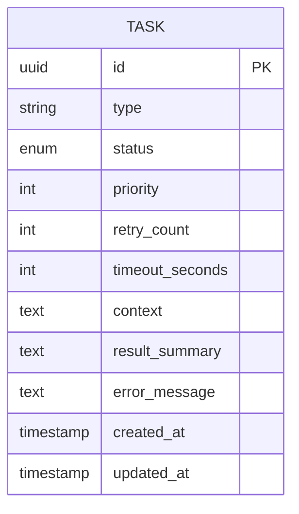

图表来源
- [backend/app/models/task.py](file://backend/app/models/task.py)

章节来源
- [backend/app/models/task.py](file://backend/app/models/task.py)

### 线程锁（thread_lock.py）
- 职责：为共享资源或任务实例提供互斥访问，避免竞态条件。
- 关键点：
  - 细粒度锁设计，减少锁持有时间。
  - 支持超时获取，防止死锁。
  - 与任务生命周期绑定，自动释放。

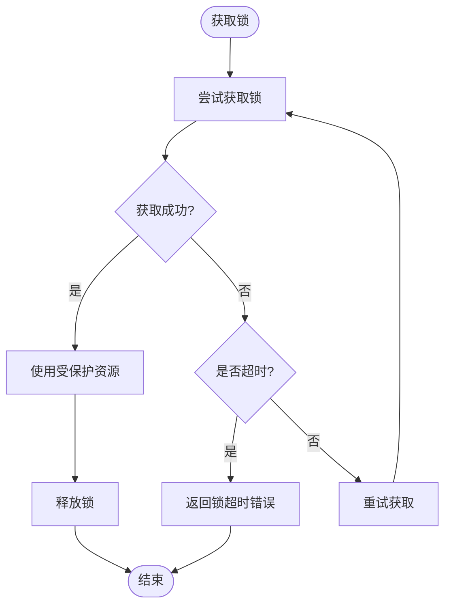

图表来源
- [backend/app/services/agent_runtime/thread_lock.py](file://backend/app/services/agent_runtime/thread_lock.py)

章节来源
- [backend/app/services/agent_runtime/thread_lock.py](file://backend/app/services/agent_runtime/thread_lock.py)

### 取消源（cancel_source.py）
- 职责：统一管理任务取消信号，支持外部触发与内部传播。
- 关键点：
  - 创建取消令牌，供任务执行器监听。
  - 支持多级取消（任务级、通道级、全局级）。
  - 与超时控制协同，及时释放资源。

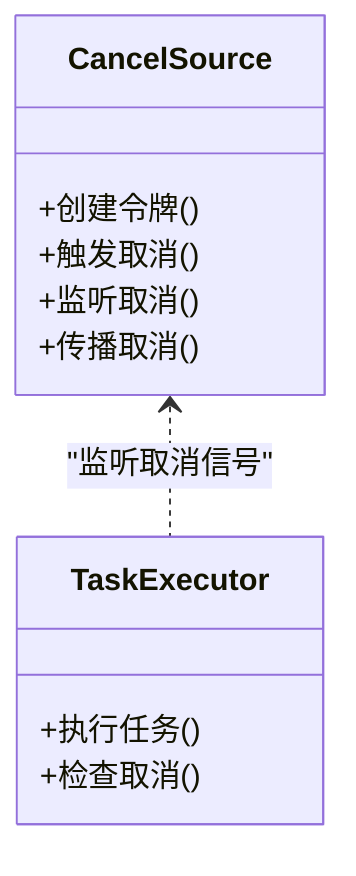

图表来源
- [backend/app/services/agent_runtime/cancel_source.py](file://backend/app/services/agent_runtime/cancel_source.py)
- [backend/app/services/task_executor.py](file://backend/app/services/task_executor.py)

章节来源
- [backend/app/services/agent_runtime/cancel_source.py](file://backend/app/services/agent_runtime/cancel_source.py)

### 异步工具轮询（async_tool_poll.py）
- 职责：对需要长轮询的外部工具或服务进行周期性检查与结果聚合。
- 关键点：
  - 可配置的轮询间隔与最大等待时间。
  - 支持部分结果聚合与增量更新。
  - 与取消源联动，及时停止轮询。

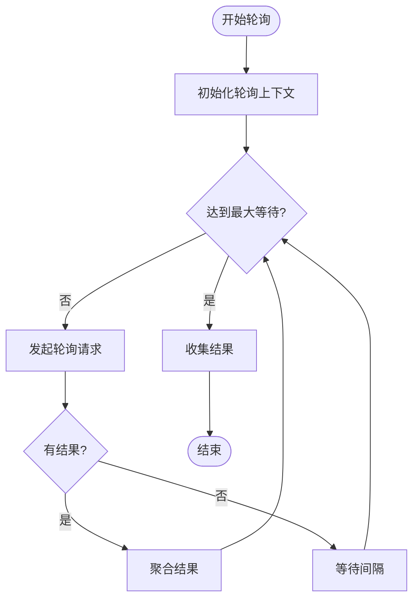

图表来源
- [backend/app/services/agent_runtime/async_tool_poll.py](file://backend/app/services/agent_runtime/async_tool_poll.py)
- [backend/app/services/agent_runtime/cancel_source.py](file://backend/app/services/agent_runtime/cancel_source.py)

章节来源
- [backend/app/services/agent_runtime/async_tool_poll.py](file://backend/app/services/agent_runtime/async_tool_poll.py)

### 调度通道（scheduling_lane.py）
- 职责：按类型或租户划分任务通道，实现隔离与负载均衡。
- 关键点：
  - 多通道并行，避免热点通道拥塞。
  - 动态权重调整，适应不同负载特征。
  - 与 Worker 服务协作，选择最优通道。

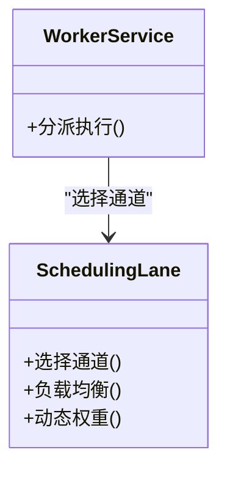

图表来源
- [backend/app/services/agent_runtime/scheduling_lane.py](file://backend/app/services/agent_runtime/scheduling_lane.py)
- [backend/app/services/agent_runtime/worker_service.py](file://backend/app/services/agent_runtime/worker_service.py)

章节来源
- [backend/app/services/agent_runtime/scheduling_lane.py](file://backend/app/services/agent_runtime/scheduling_lane.py)

### 任务完成回调（task_completion.py）
- 职责：在任务完成后统一处理结果落库、事件通知与清理。
- 关键点：
  - 原子状态更新，避免不一致。
  - 事件发布，供下游订阅。
  - 清理临时资源与日志归档。

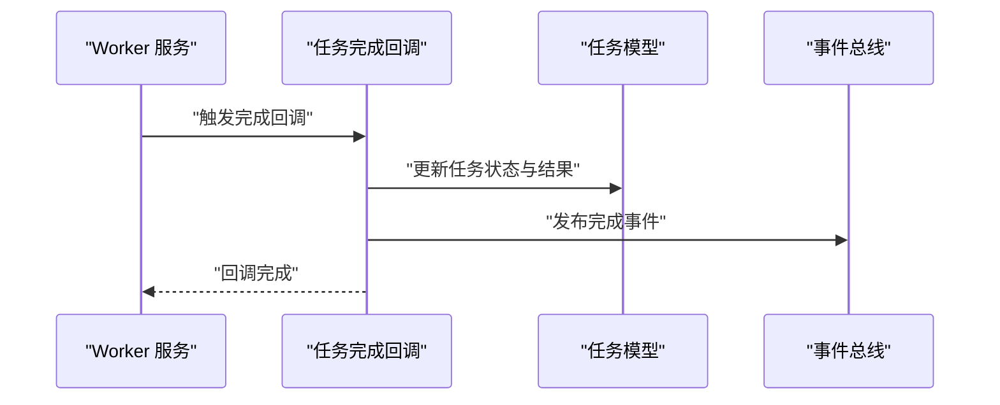

图表来源
- [backend/app/services/agent_runtime/task_completion.py](file://backend/app/services/agent_runtime/task_completion.py)
- [backend/app/models/task.py](file://backend/app/models/task.py)

章节来源
- [backend/app/services/agent_runtime/task_completion.py](file://backend/app/services/agent_runtime/task_completion.py)
- [backend/tests/test_agent_runtime_task_completion.py](file://backend/tests/test_agent_runtime_task_completion.py)

### API 入口（api/tasks.py）
- 职责：暴露任务提交、查询、取消等接口。
- 关键点：
  - 输入校验与权限控制。
  - 将请求转换为内部任务模型并交由 Worker 服务处理。
  - 返回任务 ID 与初始状态，支持后续查询。

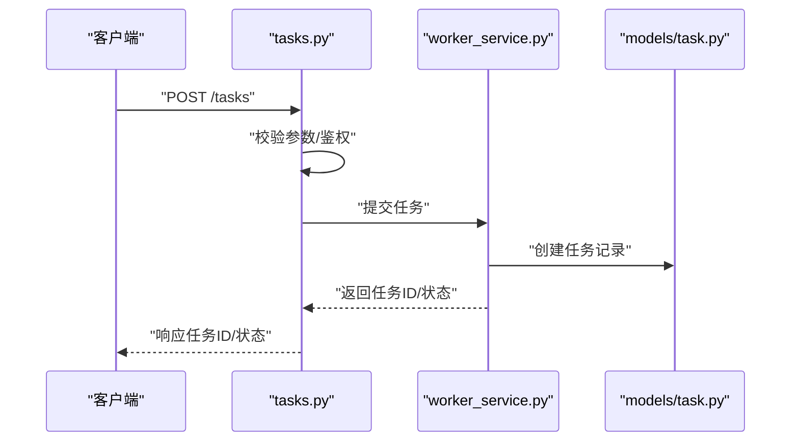

图表来源
- [backend/app/api/tasks.py](file://backend/app/api/tasks.py)
- [backend/app/services/agent_runtime/worker_service.py](file://backend/app/services/agent_runtime/worker_service.py)
- [backend/app/models/task.py](file://backend/app/models/task.py)

章节来源
- [backend/app/api/tasks.py](file://backend/app/api/tasks.py)

## 依赖关系分析
- Worker 服务依赖调度通道、线程锁、取消源与任务执行器。
- 任务执行器依赖取消源与任务模型。
- API 层依赖 Worker 服务与任务模型。
- 测试用例覆盖 Worker、命令工作器与任务完成回调的关键路径。

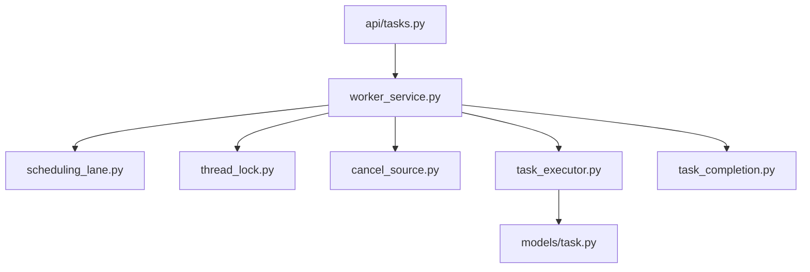

图表来源
- [backend/app/api/tasks.py](file://backend/app/api/tasks.py)
- [backend/app/services/agent_runtime/worker_service.py](file://backend/app/services/agent_runtime/worker_service.py)
- [backend/app/services/agent_runtime/scheduling_lane.py](file://backend/app/services/agent_runtime/scheduling_lane.py)
- [backend/app/services/agent_runtime/thread_lock.py](file://backend/app/services/agent_runtime/thread_lock.py)
- [backend/app/services/agent_runtime/cancel_source.py](file://backend/app/services/agent_runtime/cancel_source.py)
- [backend/app/services/task_executor.py](file://backend/app/services/task_executor.py)
- [backend/app/models/task.py](file://backend/app/models/task.py)
- [backend/app/services/agent_runtime/task_completion.py](file://backend/app/services/agent_runtime/task_completion.py)

章节来源
- [backend/app/api/tasks.py](file://backend/app/api/tasks.py)
- [backend/app/services/agent_runtime/worker_service.py](file://backend/app/services/agent_runtime/worker_service.py)
- [backend/app/services/agent_runtime/scheduling_lane.py](file://backend/app/services/agent_runtime/scheduling_lane.py)
- [backend/app/services/agent_runtime/thread_lock.py](file://backend/app/services/agent_runtime/thread_lock.py)
- [backend/app/services/agent_runtime/cancel_source.py](file://backend/app/services/agent_runtime/cancel_source.py)
- [backend/app/services/task_executor.py](file://backend/app/services/task_executor.py)
- [backend/app/models/task.py](file://backend/app/models/task.py)
- [backend/app/services/agent_runtime/task_completion.py](file://backend/app/services/agent_runtime/task_completion.py)

## 性能考量
- 通道隔离与负载均衡：通过调度通道分散热点任务，避免单点拥塞。
- 锁粒度与持有时间：细化锁范围，缩短持有时间，提升并发度。
- 重试与退避：合理设置最大重试次数与退避间隔，降低瞬时失败影响。
- 超时控制：为任务与外部调用设置超时，防止资源泄漏。
- 轮询优化：调整轮询间隔与最大等待时间，平衡延迟与负载。
- 资源清理：任务完成后及时释放资源，避免内存与连接泄漏。
- 监控与指标：采集任务耗时、成功率、重试率、取消率等指标，指导调优。

[本节为通用指导，不直接分析具体文件]

## 故障排查指南
- 任务卡住：检查线程锁是否超时获取、取消源是否被触发、任务是否设置了过长超时。
- 重复执行：确认 Worker 是否正确使用线程锁与幂等键，避免重复消费。
- 重试风暴：调整重试策略与退避间隔，观察失败原因是否可恢复。
- 外部调用失败：查看轮询配置与超时设置，确认外部服务健康状态。
- 资源泄漏：检查任务完成后是否清理临时资源与数据库连接。

章节来源
- [backend/app/services/agent_runtime/thread_lock.py](file://backend/app/services/agent_runtime/thread_lock.py)
- [backend/app/services/agent_runtime/cancel_source.py](file://backend/app/services/agent_runtime/cancel_source.py)
- [backend/app/services/task_executor.py](file://backend/app/services/task_executor.py)
- [backend/app/services/agent_runtime/async_tool_poll.py](file://backend/app/services/agent_runtime/async_tool_poll.py)

## 结论
Clawith 的异步任务处理系统以 Worker 服务为核心，结合调度通道、线程锁、取消源与任务执行器，构建了高可用、可扩展的异步任务处理框架。通过合理的优先级、重试、超时与轮询策略，系统在复杂场景下仍能保持稳定与高效。建议在生产环境中持续监控关键指标，并根据实际负载动态调整配置，以获得最佳性能与可靠性。

[本节为总结，不直接分析具体文件]

## 附录
- 配置项参考：查看运行时配置文件，了解 Worker 数量、通道权重、重试策略、超时与轮询参数的默认值与可调范围。
- 测试用例：参考相关测试文件，了解关键路径的断言与模拟策略，便于本地验证与回归。

章节来源
- [backend/app/services/agent_runtime/config.py](file://backend/app/services/agent_runtime/config.py)
- [backend/tests/test_agent_runtime_worker_service.py](file://backend/tests/test_agent_runtime_worker_service.py)
- [backend/tests/test_agent_runtime_command_worker.py](file://backend/tests/test_agent_runtime_command_worker.py)
- [backend/tests/test_agent_runtime_task_completion.py](file://backend/tests/test_agent_runtime_task_completion.py)