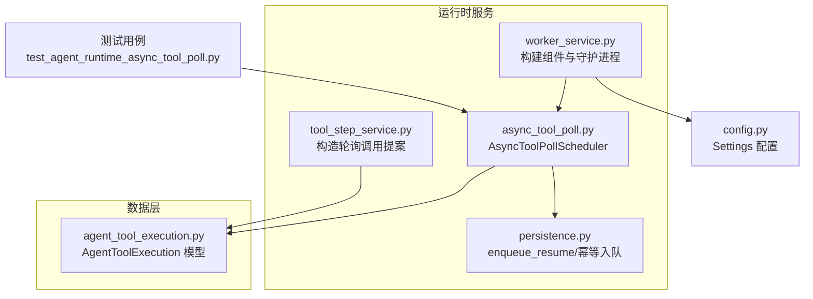
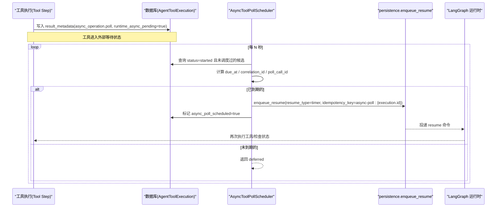
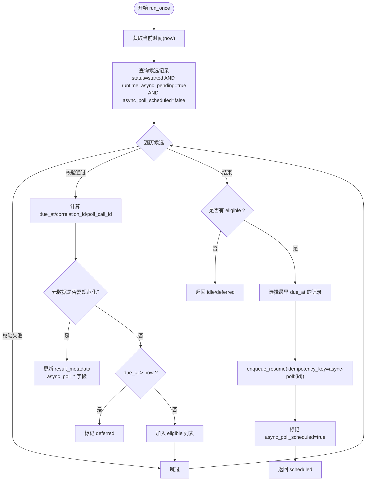
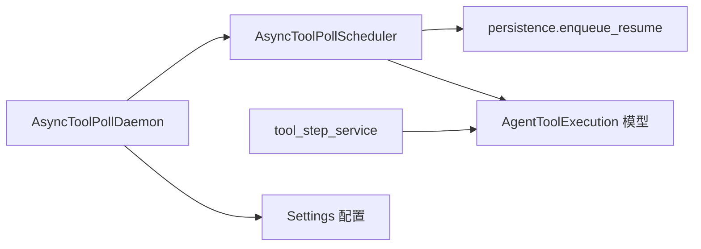

# 异步工具轮询机制

<cite>
**本文引用的文件**   
- [async_tool_poll.py](file://backend/app/services/agent_runtime/async_tool_poll.py)
- [worker_service.py](file://backend/app/services/agent_runtime/worker_service.py)
- [persistence.py](file://backend/app/services/agent_runtime/persistence.py)
- [agent_tool_execution.py](file://backend/app/models/agent_tool_execution.py)
- [tool_step_service.py](file://backend/app/services/agent_runtime/tool_step_service.py)
- [config.py](file://backend/app/config.py)
- [test_agent_runtime_async_tool_poll.py](file://backend/tests/test_agent_runtime_async_tool_poll.py)
</cite>

## 目录
1. [简介](#简介)
2. [项目结构](#项目结构)
3. [核心组件](#核心组件)
4. [架构总览](#架构总览)
5. [详细组件分析](#详细组件分析)
6. [依赖关系分析](#依赖关系分析)
7. [性能考量](#性能考量)
8. [故障排查指南](#故障排查指南)
9. [结论](#结论)
10. [附录：配置参数与调优建议](#附录配置参数与调优建议)

## 简介
本技术文档聚焦于 Clawith 的“异步工具轮询机制”，围绕 AsyncToolPollScheduler 的工作原理展开，涵盖定时任务调度、状态管理、幂等性保证；详细说明异步工具执行的生命周期（从启动到完成的状态转换）；解释轮询间隔计算、超时处理、重试策略；并给出数据库查询优化、锁机制、并发控制要点。最后提供配置参数说明与性能调优建议，帮助读者在生产环境中稳定、高效地运行该机制。

## 项目结构
异步工具轮询机制主要位于后端运行时服务中，关键文件如下：
- 调度器实现：backend/app/services/agent_runtime/async_tool_poll.py
- 守护进程与生命周期编排：backend/app/services/agent_runtime/worker_service.py
- 持久化与命令入队：backend/app/services/agent_runtime/persistence.py
- 工具执行记录模型：backend/app/models/agent_tool_execution.py
- 工具步骤服务（构造轮询调用提案）：backend/app/services/agent_runtime/tool_step_service.py
- 应用配置（扫描间隔等）：backend/app/config.py
- 单元测试（行为验证）：backend/tests/test_agent_runtime_async_tool_poll.py

图表来源 
- [worker_service.py:201-350](file://backend/app/services/agent_runtime/worker_service.py#L201-L350)
- [async_tool_poll.py:103-232](file://backend/app/services/agent_runtime/async_tool_poll.py#L103-L232)
- [persistence.py:477-498](file://backend/app/services/agent_runtime/persistence.py#L477-L498)
- [agent_tool_execution.py:25-119](file://backend/app/models/agent_tool_execution.py#L25-L119)
- [tool_step_service.py:389-437](file://backend/app/services/agent_runtime/tool_step_service.py#L389-L437)
- [config.py:124-161](file://backend/app/config.py#L124-L161)
- [test_agent_runtime_async_tool_poll.py:98-207](file://backend/tests/test_agent_runtime_async_tool_poll.py#L98-L207)

章节来源
- [worker_service.py:201-350](file://backend/app/services/agent_runtime/worker_service.py#L201-L350)
- [async_tool_poll.py:103-232](file://backend/app/services/agent_runtime/async_tool_poll.py#L103-L232)
- [persistence.py:477-498](file://backend/app/services/agent_runtime/persistence.py#L477-L498)
- [agent_tool_execution.py:25-119](file://backend/app/models/agent_tool_execution.py#L25-L119)
- [tool_step_service.py:389-437](file://backend/app/services/agent_runtime/tool_step_service.py#L389-L437)
- [config.py:124-161](file://backend/app/config.py#L124-L161)
- [test_agent_runtime_async_tool_poll.py:98-207](file://backend/tests/test_agent_runtime_async_tool_poll.py#L98-L207)

## 核心组件
- AsyncToolPollScheduler：负责周期性扫描待轮询的工具执行记录，计算下次到期时间，生成幂等的定时器恢复命令，并标记已调度。
- AsyncToolPollDaemon：守护进程，按配置的扫描间隔循环调用 scheduler.run_once()，并在异常时退避重试。
- persistence.enqueue_resume：将 resume 类型的命令持久化，使用 idempotency_key 保证幂等。
- AgentToolExecution：存储工具执行上下文、结果元数据（包含 async_operation.poll 信息）、状态与租约字段。
- tool_step_service：在工具步骤阶段构造“轮询调用”提案，设置 waiting_request 与 pending_tool_calls，使 LangGraph 进入外部等待态。

章节来源
- [async_tool_poll.py:103-232](file://backend/app/services/agent_runtime/async_tool_poll.py#L103-L232)
- [worker_service.py:441-475](file://backend/app/services/agent_runtime/worker_service.py#L441-L475)
- [persistence.py:477-498](file://backend/app/services/agent_runtime/persistence.py#L477-L498)
- [agent_tool_execution.py:25-119](file://backend/app/models/agent_tool_execution.py#L25-L119)
- [tool_step_service.py:389-437](file://backend/app/services/agent_runtime/tool_step_service.py#L389-L437)

## 架构总览
下图展示了异步工具轮询的整体流程：工具执行进入“外部等待”后，由调度器周期性扫描并生成幂等的定时器恢复命令，最终由运行时驱动重新执行业务逻辑。

图表来源 
- [async_tool_poll.py:119-232](file://backend/app/services/agent_runtime/async_tool_poll.py#L119-L232)
- [persistence.py:477-498](file://backend/app/services/agent_runtime/persistence.py#L477-L498)
- [tool_step_service.py:389-437](file://backend/app/services/agent_runtime/tool_step_service.py#L389-L437)

## 详细组件分析

### AsyncToolPollScheduler 工作原理
- 输入与约束
  - 仅处理 status="started" 且 result_metadata.runtime_async_pending=true 的记录。
  - 忽略已标记 async_poll_scheduled=true 的记录，避免重复调度。
  - 校验 async_operation.version=1 以及 poll.tool、poll.arguments、poll.interval_ms 的合法性（interval_ms 为整数且在 0~600000 毫秒范围内）。
- 到期时间计算
  - 优先读取 result_metadata.async_poll_due_at；若不存在，则基于 updated_at + interval_ms 推导 due_at。
  - 兼容旧版缺失字段的情况，回退 correlation_id 为 tool-reconcile:{run_id}，poll_call_id 为 async-poll:{execution.id}。
- 幂等性与去重
  - 使用 idempotency_key="async-poll:{execution.id}" 调用 enqueue_resume，确保同一执行只入队一次。
  - 入队成功后立即更新 async_poll_scheduled=true，防止重复入队。
- 批量扫描与锁定
  - 每次扫描最多 scan_batch_size 条记录，按 updated_at 升序、id 升序排序。
  - 使用 with_for_update(skip_locked=True) 实现行级锁与跳过已锁定行，避免多实例竞争。
- 返回值
  - idle：无候选或无需操作。
  - deferred：存在未来到期项，稍后再试。
  - scheduled：已成功入队一个定时器恢复命令。

图表来源 
- [async_tool_poll.py:119-232](file://backend/app/services/agent_runtime/async_tool_poll.py#L119-L232)

章节来源
- [async_tool_poll.py:103-232](file://backend/app/services/agent_runtime/async_tool_poll.py#L103-L232)

### 守护进程 AsyncToolPollDaemon
- 职责：以固定间隔调用 scheduler.run_once()，根据返回状态决定下一次扫描延迟。
- 错误处理：捕获异常并记录日志，随后以 error_delay_seconds 退避重试。
- 集成：由 worker_service 在进程启动时创建任务，随进程生命周期启停。

章节来源
- [worker_service.py:441-475](file://backend/app/services/agent_runtime/worker_service.py#L441-L475)
- [worker_service.py:628-636](file://backend/app/services/agent_runtime/worker_service.py#L628-L636)

### 持久化与幂等：enqueue_resume
- 功能：在不提交外层事务的前提下，向命令表插入一条 resume 命令，并使用 idempotency_key 保证幂等。
- 冲突处理：若并发插入导致唯一键冲突，会尝试解析已有命令并校验 payload 一致性，一致则返回已有记录。

章节来源
- [persistence.py:477-498](file://backend/app/services/agent_runtime/persistence.py#L477-L498)

### 工具步骤服务中的轮询提案
- 当工具需要外部等待时，tool_step_service 会构造一个函数调用提案（function call），并设置 waiting_request.reason="async_tool_poll_pending"，同时保留 pending_tool_calls，以便后续恢复时优先执行轮询。

章节来源
- [tool_step_service.py:389-437](file://backend/app/services/agent_runtime/tool_step_service.py#L389-L437)

### 数据模型：AgentToolExecution
- 关键字段：
  - status：started/succeeded/failed/unknown
  - result_metadata：JSONB，包含 runtime_async_pending、async_operation.poll、async_poll_* 等
  - lease_owner/lease_expires_at：用于分布式锁/租约
  - started_at/completed_at/updated_at：时间戳
- 索引与约束：
  - 针对 tenant_id/status/started_at 的复合索引提升查询效率
  - 对 (run_id, tool_call_id) 的唯一约束保证幂等

章节来源
- [agent_tool_execution.py:25-119](file://backend/app/models/agent_tool_execution.py#L25-L119)

## 依赖关系分析
- AsyncToolPollScheduler 依赖：
  - 数据库会话工厂 RuntimeSessionFactory
  - 持久化模块 persistence.enqueue_resume
  - 模型 AgentToolExecution
- 守护进程依赖 Settings 中的扫描间隔配置
- 工具步骤服务依赖 result_metadata 的结构约定（async_operation.poll）

图表来源 
- [async_tool_poll.py:103-232](file://backend/app/services/agent_runtime/async_tool_poll.py#L103-L232)
- [worker_service.py:441-475](file://backend/app/services/agent_runtime/worker_service.py#L441-L475)
- [persistence.py:477-498](file://backend/app/services/agent_runtime/persistence.py#L477-L498)
- [agent_tool_execution.py:25-119](file://backend/app/models/agent_tool_execution.py#L25-L119)
- [tool_step_service.py:389-437](file://backend/app/services/agent_runtime/tool_step_service.py#L389-L437)
- [config.py:124-161](file://backend/app/config.py#L124-L161)

章节来源
- [async_tool_poll.py:103-232](file://backend/app/services/agent_runtime/async_tool_poll.py#L103-L232)
- [worker_service.py:441-475](file://backend/app/services/agent_runtime/worker_service.py#L441-L475)
- [persistence.py:477-498](file://backend/app/services/agent_runtime/persistence.py#L477-L498)
- [agent_tool_execution.py:25-119](file://backend/app/models/agent_tool_execution.py#L25-L119)
- [tool_step_service.py:389-437](file://backend/app/services/agent_runtime/tool_step_service.py#L389-L437)
- [config.py:124-161](file://backend/app/config.py#L124-L161)

## 性能考量
- 数据库查询优化
  - 使用 JSONB 条件过滤 runtime_async_pending 与 async_poll_scheduled，配合 with_for_update(skip_locked=True) 减少锁竞争。
  - 复合索引 ix_agent_tool_executions_tenant_status_started 加速按租户与状态的筛选。
- 批处理与限流
  - scan_batch_size 限制单次扫描量，避免大事务与长事务。
  - 守护进程按 idle/deferred 返回不同延迟，降低空转开销。
- 幂等与去重
  - idempotency_key="async-poll:{execution.id}" 确保同一执行仅入队一次。
  - async_poll_scheduled 标志位防止重复入队。
- 并发控制
  - 多实例部署下，skip_locked=True 避免重复锁定同一条记录。
  - 命令消费端（Command Worker）通过 claim 机制与 lane 持有保证顺序与并发安全。

[本节为通用指导，不直接分析具体文件]

## 故障排查指南
- 常见问题定位
  - 未触发轮询：检查 result_metadata 是否包含 runtime_async_pending=true 与有效的 async_operation.poll。
  - 重复入队：确认 async_poll_scheduled 是否正确置位；查看 enqueue_resume 的 idempotency_key 是否一致。
  - 轮询间隔异常：核对 poll.interval_ms 是否在合法范围；检查 updated_at 与 due_at 的计算是否符合预期。
  - 守护进程未运行：确认 worker_service 是否成功创建 AsyncToolPollDaemon 任务，以及 AGENT_RUNTIME_ASYNC_TOOL_POLL_SCAN_SECONDS 配置。
- 调试建议
  - 启用相关日志输出，观察 scheduler.run_once 的返回状态（idle/deferred/scheduled）。
  - 检查数据库中的 AgentToolExecution 记录，确认状态与元数据字段。
  - 使用测试用例作为参考，验证入队 payload 结构与幂等键。

章节来源
- [test_agent_runtime_async_tool_poll.py:98-207](file://backend/tests/test_agent_runtime_async_tool_poll.py#L98-L207)
- [async_tool_poll.py:119-232](file://backend/app/services/agent_runtime/async_tool_poll.py#L119-L232)
- [worker_service.py:628-636](file://backend/app/services/agent_runtime/worker_service.py#L628-L636)

## 结论
Clawith 的异步工具轮询机制通过 AsyncToolPollScheduler 与守护进程实现了可靠、幂等、可伸缩的定时器恢复能力。借助数据库 JSONB 元数据、行级锁与幂等入队，系统在多实例环境下也能保持稳定。结合合理的配置与索引设计，可在高并发场景下保持低延迟与高吞吐。

[本节为总结，不直接分析具体文件]

## 附录：配置参数与调优建议
- 关键配置项（来自 Settings）
  - AGENT_RUNTIME_ASYNC_TOOL_POLL_SCAN_SECONDS：轮询扫描间隔（秒），默认 0.25
  - AGENT_RUNTIME_COMMAND_CONCURRENCY：命令并发度（影响整体吞吐）
  - AGENT_RUNTIME_COMMAND_CLAIM_TTL_SECONDS / CLAIM_RENEW_SECONDS：命令租约与续期
  - AGENT_RUNTIME_COMMAND_MAX_ATTEMPTS：命令最大尝试次数
  - AGENT_RUNTIME_CHANNEL_DELIVERY_*：通道交付相关（与轮询无关但影响整体稳定性）
- 调优建议
  - 扫描间隔：根据业务延迟要求调整 AGENT_RUNTIME_ASYNC_TOOL_POLL_SCAN_SECONDS，过小会增加数据库压力，过大增加端到端延迟。
  - 批大小：可通过构造函数参数 scan_batch_size 调整（默认 64），平衡吞吐与事务长度。
  - 索引：确保 tenant_id/status/started_at 索引有效；必要时增加 on updated_at/id 的覆盖索引。
  - 幂等键：保持 idempotency_key 稳定，避免重复入队导致的额外负载。
  - 监控与告警：关注 scheduler 返回状态分布（idle/deferred/scheduled）与异常率。

章节来源
- [config.py:124-161](file://backend/app/config.py#L124-L161)
- [async_tool_poll.py:103-118](file://backend/app/services/agent_runtime/async_tool_poll.py#L103-L118)
- [worker_service.py:628-636](file://backend/app/services/agent_runtime/worker_service.py#L628-L636)