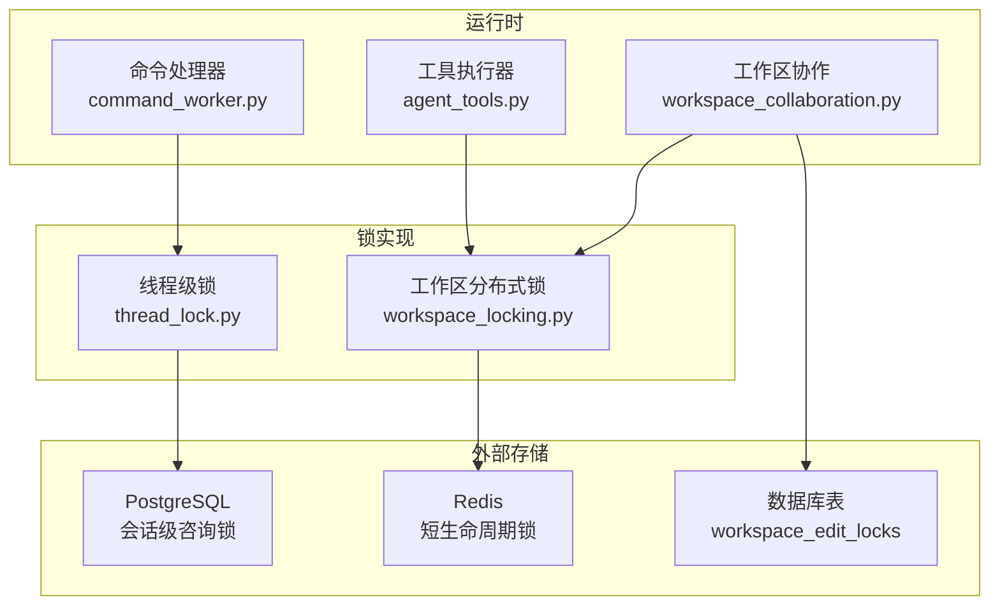
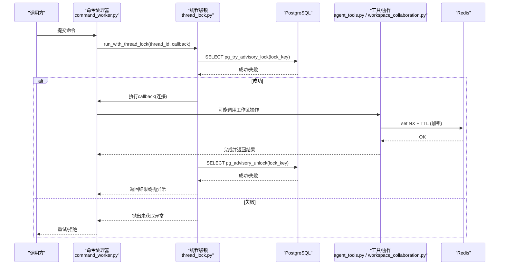
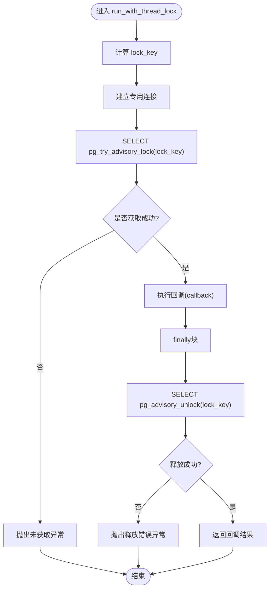
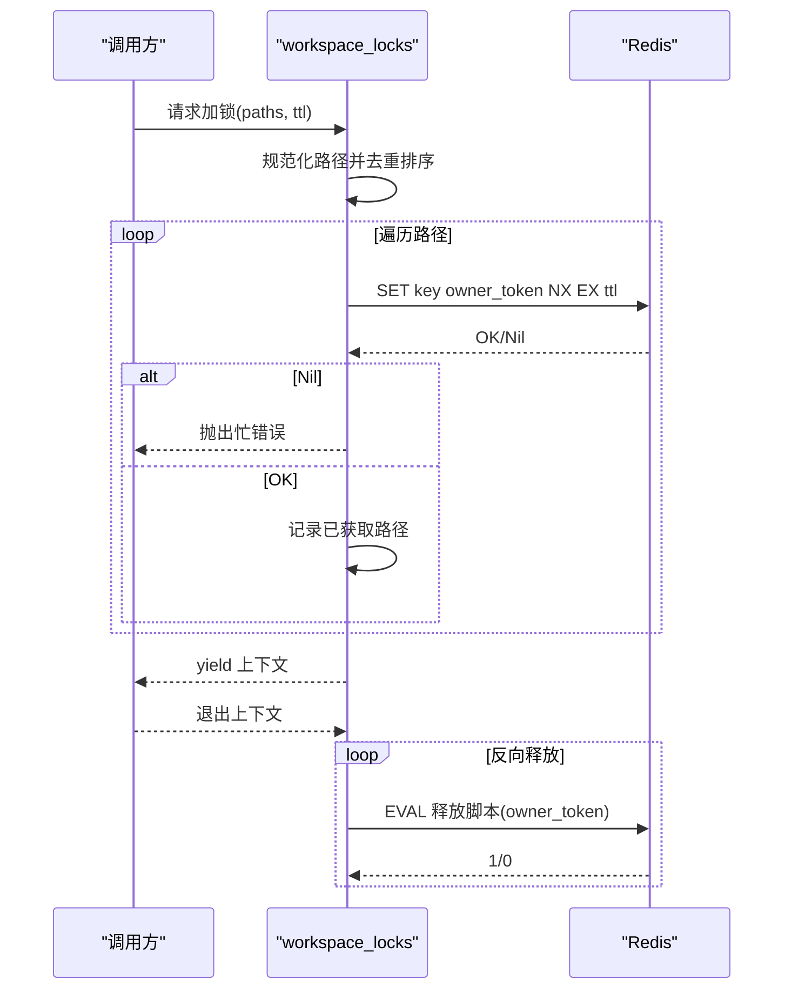
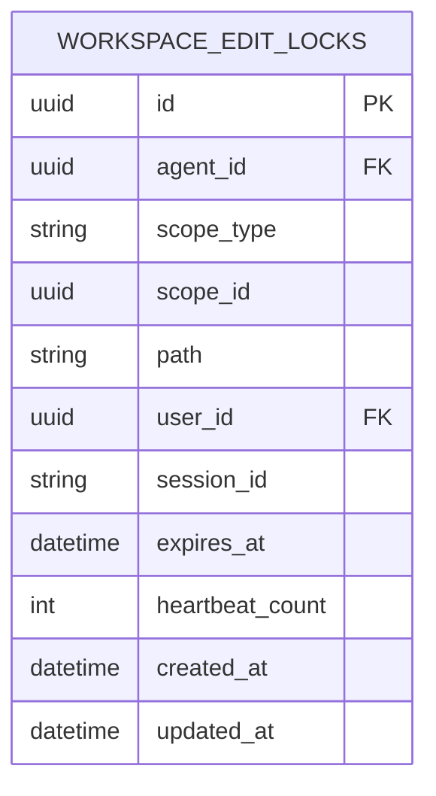
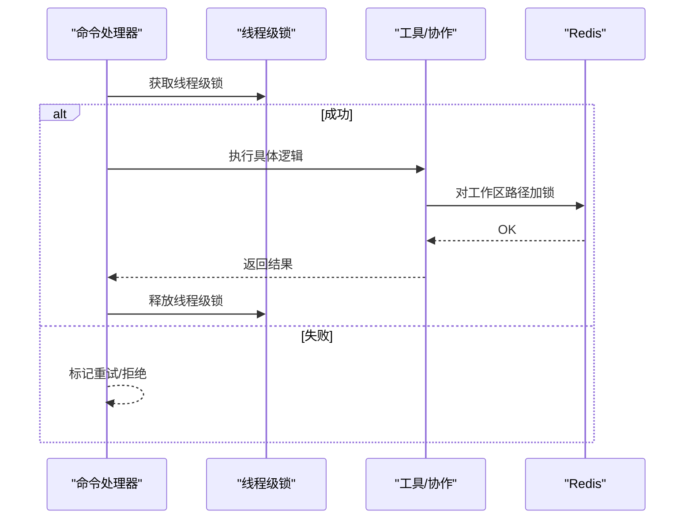
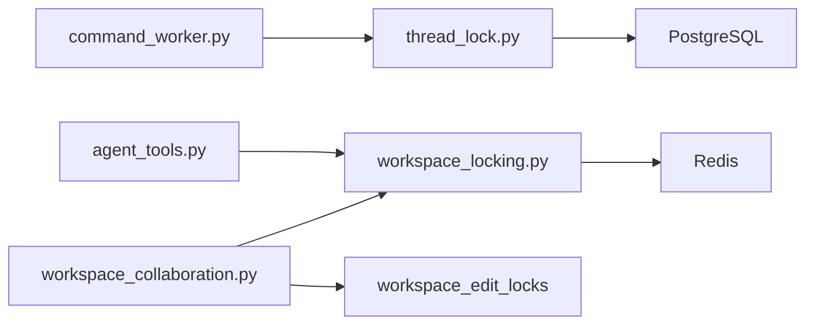

# 线程锁机制

<cite>
**本文引用的文件**   
- [thread_lock.py](file://backend/app/services/agent_runtime/thread_lock.py)
- [workspace_locking.py](file://backend/app/services/workspace_locking.py)
- [command_worker.py](file://backend/app/services/agent_runtime/command_worker.py)
- [agent_tools.py](file://backend/app/services/agent_tools.py)
- [workspace_collaboration.py](file://backend/app/services/workspace_collaboration.py)
- [workspace.py](file://backend/app/models/workspace.py)
- [test_agent_runtime_thread_lock.py](file://backend/tests/test_agent_runtime_thread_lock.py)
</cite>

## 目录
1. [引言](#引言)
2. [项目结构](#项目结构)
3. [核心组件](#核心组件)
4. [架构总览](#架构总览)
5. [详细组件分析](#详细组件分析)
6. [依赖关系分析](#依赖关系分析)
7. [性能考量](#性能考量)
8. [故障排查指南](#故障排查指南)
9. [结论](#结论)
10. [附录](#附录)

## 引言
本文件面向Clawith的线程锁与分布式锁机制，系统性阐述两类锁的设计与实现：
- 进程内“线程级”互斥锁：基于PostgreSQL会话级咨询锁（advisory lock），用于确保同一Agent运行线程在同一时刻仅由一个工作协程执行关键路径。
- 跨进程“工作区”分布式锁：基于Redis短生命周期锁，用于对Agent工作区的文件写入、移动、删除等并发操作进行互斥保护。

文档覆盖锁的获取、释放、超时策略、死锁预防、粒度设计、并发场景应用、性能监控与统计、使用模式与最佳实践，以及常见问题的定位方法。

## 项目结构
与线程锁相关的关键代码分布在以下模块：
- 线程级锁实现：后端服务 agent_runtime/thread_lock.py
- 工作区分布式锁实现：后端服务 workspace_locking.py
- 线程锁调用方（命令处理）：agent_runtime/command_worker.py
- 工作区锁调用方（工具与协作）：agent_tools.py、workspace_collaboration.py
- 数据库模型（编辑锁记录）：models/workspace.py
- 单元测试：tests/test_agent_runtime_thread_lock.py

图表来源
- [command_worker.py:920-983](file://backend/app/services/agent_runtime/command_worker.py#L920-L983)
- [thread_lock.py:60-89](file://backend/app/services/agent_runtime/thread_lock.py#L60-L89)
- [workspace_locking.py:40-81](file://backend/app/services/workspace_locking.py#L40-L81)
- [workspace_collaboration.py:660-859](file://backend/app/services/workspace_collaboration.py#L660-L859)
- [workspace.py:70-108](file://backend/app/models/workspace.py#L70-L108)

章节来源
- [command_worker.py:920-983](file://backend/app/services/agent_runtime/command_worker.py#L920-L983)
- [thread_lock.py:1-89](file://backend/app/services/agent_runtime/thread_lock.py#L1-L89)
- [workspace_locking.py:1-81](file://backend/app/services/workspace_locking.py#L1-L81)
- [workspace_collaboration.py:660-859](file://backend/app/services/workspace_collaboration.py#L660-L859)
- [workspace.py:70-108](file://backend/app/models/workspace.py#L70-L108)

## 核心组件
- 线程级锁（PostgreSQL advisory lock）
  - 通过会话级咨询锁保证同一run thread_id在单连接上串行执行关键逻辑。
  - 提供稳定的bigint键生成函数，避免冲突。
  - 封装了获取、回调执行、释放的完整生命周期，失败时抛出明确异常类型。
- 工作区分布式锁（Redis）
  - 针对Agent工作区路径提供短生命周期锁，支持TTL自动过期。
  - 原子性释放脚本确保只有持有者能释放锁。
  - 提供上下文管理器批量加锁与反向释放，保障一致性。
- 人类编辑锁（数据库持久化）
  - 记录当前正在被人类用户编辑的文件路径、用户、会话、过期时间等，供协作流程判断是否允许删除/移动等操作。

章节来源
- [thread_lock.py:1-89](file://backend/app/services/agent_runtime/thread_lock.py#L1-L89)
- [workspace_locking.py:1-81](file://backend/app/services/workspace_locking.py#L1-L81)
- [workspace.py:70-108](file://backend/app/models/workspace.py#L70-L108)

## 架构总览
下图展示了命令处理与工作区操作的锁交互流程。

图表来源
- [command_worker.py:920-983](file://backend/app/services/agent_runtime/command_worker.py#L920-L983)
- [thread_lock.py:60-89](file://backend/app/services/agent_runtime/thread_lock.py#L60-L89)
- [workspace_locking.py:40-81](file://backend/app/services/workspace_locking.py#L40-L81)

## 详细组件分析

### 线程级锁（PostgreSQL会话级咨询锁）
- 设计要点
  - 锁粒度：按run thread_id映射到bigint key，确保同一线程ID在同一时刻仅有一个连接持有锁。
  - 连接隔离：整个获取-回调-释放过程绑定单一连接，避免连接池复用导致锁归属错乱。
  - 异常语义：未获取锁抛出“未获取”异常；释放失败抛出“释放错误”异常，便于上层区分处理。
- 关键流程
  - 计算lock_key：对thread_id做稳定哈希，得到有符号bigint。
  - 获取锁：执行pg_try_advisory_lock，成功则进入回调。
  - 释放锁：finally中执行pg_advisory_unlock，失败则抛异常。
- 复杂度与性能
  - 哈希计算O(1)，SQL为常量时间；整体开销极低。
  - 由于是会话级锁，无需轮询续期，天然避免长时间占用导致的死锁。
- 使用模式
  - 适用于需要严格串行化的关键路径，如检查点提交、状态变更、命令应用等。

图表来源
- [thread_lock.py:60-89](file://backend/app/services/agent_runtime/thread_lock.py#L60-L89)

章节来源
- [thread_lock.py:1-89](file://backend/app/services/agent_runtime/thread_lock.py#L1-L89)
- [test_agent_runtime_thread_lock.py:60-155](file://backend/tests/test_agent_runtime_thread_lock.py#L60-L155)

### 工作区分布式锁（Redis）
- 设计要点
  - 锁粒度：以agent_id与规范化后的路径作为key，精确到文件或目录级别。
  - 短生命周期：默认TTL秒级过期，防止僵尸锁。
  - 原子释放：Lua脚本确保仅锁持有者可释放，避免误删他人锁。
- 关键流程
  - 加锁：set NX + EX，返回布尔值表示是否成功。
  - 释放：eval Lua脚本，比较owner_token后删除。
  - 批量加锁：排序去重后逐个加锁，失败则全部回滚释放已获取的锁。
- 复杂度与性能
  - Redis操作O(1)，网络往返一次；批量加锁线性于路径数。
  - TTL过期可兜底，但建议业务层尽快释放。
- 使用模式
  - 适用于文件写入、移动、删除等写操作的互斥保护，避免并发冲突。

图表来源
- [workspace_locking.py:40-81](file://backend/app/services/workspace_locking.py#L40-L81)

章节来源
- [workspace_locking.py:1-81](file://backend/app/services/workspace_locking.py#L1-L81)

### 人类编辑锁（数据库持久化）
- 设计要点
  - 表结构包含scope_type、scope_id、path、user_id、session_id、expires_at、heartbeat_count等字段。
  - 唯一约束保证同一作用域+路径仅一条活跃编辑锁。
  - 索引优化查询与过期清理。
- 使用场景
  - 在删除/移动等操作前检查是否存在活跃的人类编辑锁，若存在则拒绝或提示。
- 与Redis锁的关系
  - 人类编辑锁是“元信息”层面的可见性控制；Redis锁是“写操作”层面的互斥控制，二者互补。

图表来源
- [workspace.py:70-108](file://backend/app/models/workspace.py#L70-L108)

章节来源
- [workspace.py:70-108](file://backend/app/models/workspace.py#L70-L108)

### 调用方集成（命令处理器与工作区操作）
- 命令处理器
  - 在命令执行前后使用线程级锁包裹关键路径，捕获未获取锁异常并返回重试信号。
  - 结合心跳与取消信号，确保异常路径也能正确释放资源。
- 工作区操作
  - 在写入、移动、删除等路径上使用workspace_locks上下文管理器，确保并发安全。
  - 配合版本令牌（version token）进行条件写入，进一步降低冲突概率。

图表来源
- [command_worker.py:920-983](file://backend/app/services/agent_runtime/command_worker.py#L920-L983)
- [agent_tools.py:1470-1669](file://backend/app/services/agent_tools.py#L1470-L1669)
- [workspace_collaboration.py:660-859](file://backend/app/services/workspace_collaboration.py#L660-L859)

章节来源
- [command_worker.py:920-983](file://backend/app/services/agent_runtime/command_worker.py#L920-L983)
- [agent_tools.py:1470-1669](file://backend/app/services/agent_tools.py#L1470-L1669)
- [workspace_collaboration.py:660-859](file://backend/app/services/workspace_collaboration.py#L660-L859)

## 依赖关系分析
- 线程级锁依赖PostgreSQL的会话级咨询锁能力，要求调用方传入AsyncEngine并在同一连接上完成获取与释放。
- 工作区分布式锁依赖Redis的原子操作能力，要求提供get_redis接口。
- 人类编辑锁依赖数据库表结构与唯一约束，需确保索引与检查约束生效。

图表来源
- [command_worker.py:920-983](file://backend/app/services/agent_runtime/command_worker.py#L920-L983)
- [thread_lock.py:60-89](file://backend/app/services/agent_runtime/thread_lock.py#L60-L89)
- [workspace_locking.py:40-81](file://backend/app/services/workspace_locking.py#L40-L81)
- [workspace_collaboration.py:660-859](file://backend/app/services/workspace_collaboration.py#L660-L859)
- [workspace.py:70-108](file://backend/app/models/workspace.py#L70-L108)

章节来源
- [command_worker.py:920-983](file://backend/app/services/agent_runtime/command_worker.py#L920-L983)
- [thread_lock.py:60-89](file://backend/app/services/agent_runtime/thread_lock.py#L60-L89)
- [workspace_locking.py:40-81](file://backend/app/services/workspace_locking.py#L40-L81)
- [workspace_collaboration.py:660-859](file://backend/app/services/workspace_collaboration.py#L660-L859)
- [workspace.py:70-108](file://backend/app/models/workspace.py#L70-L108)

## 性能考量
- 线程级锁
  - 单次SQL开销极小，适合高频调用；关键在于避免在回调中进行长耗时I/O阻塞。
  - 连接隔离确保锁归属正确，但需注意连接池配置与超时设置。
- 工作区分布式锁
  - Redis操作低延迟，批量加锁线性增长；建议合并路径以减少多次网络往返。
  - TTL应合理设置，过短可能导致竞争加剧，过长可能增加僵尸锁风险。
- 人类编辑锁
  - 查询与更新频率较低；可通过定时任务清理过期锁，减少表膨胀。

[本节为通用指导，不直接分析具体文件]

## 故障排查指南
- 未获取线程级锁
  - 现象：抛出“未获取”异常，上层收到重试信号。
  - 排查：确认thread_id是否正确、PostgreSQL是否可用、是否存在其他持有者。
  - 参考：测试用例验证了未获取时的行为与异常类型。
- 释放线程级锁失败
  - 现象：抛出“释放错误”异常。
  - 排查：检查连接是否仍有效、是否有权限执行解锁SQL。
- 工作区锁忙
  - 现象：加锁失败，返回忙错误。
  - 排查：确认TTL设置、是否存在未释放的锁、Redis是否可达。
- 人类编辑锁冲突
  - 现象：删除/移动操作被拒绝，提示有人正在编辑。
  - 排查：查询编辑锁表，确认expires_at与heartbeat_count，必要时清理过期锁。

章节来源
- [test_agent_runtime_thread_lock.py:96-155](file://backend/tests/test_agent_runtime_thread_lock.py#L96-L155)
- [workspace_locking.py:40-81](file://backend/app/services/workspace_locking.py#L40-L81)
- [workspace.py:70-108](file://backend/app/models/workspace.py#L70-L108)

## 结论
Clawith的线程锁机制通过两层锁协同实现高可靠并发控制：
- 线程级锁确保同一运行线程内的关键路径串行执行，避免状态不一致。
- 工作区分布式锁确保多进程/多线程下的文件操作互斥，结合版本令牌与人类编辑锁，形成完整的并发安全体系。
建议在业务侧遵循最小粒度加锁、快速释放、合理TTL、幂等重试等最佳实践，以获得稳定高效的并发处理能力。

[本节为总结性内容，不直接分析具体文件]

## 附录
- 使用模式与最佳实践
  - 线程级锁：将最关键的临界区放入回调，避免在回调中进行阻塞式I/O。
  - 工作区锁：合并路径、统一规范化、设置合理TTL，确保原子释放。
  - 人类编辑锁：定期清理过期锁，结合心跳延长活跃编辑。
- 监控与统计
  - 建议收集锁获取成功率、平均等待时间、释放失败次数、TTL过期率等指标。
  - 对热点路径进行采样分析，识别潜在瓶颈。

[本节为补充说明，不直接分析具体文件]