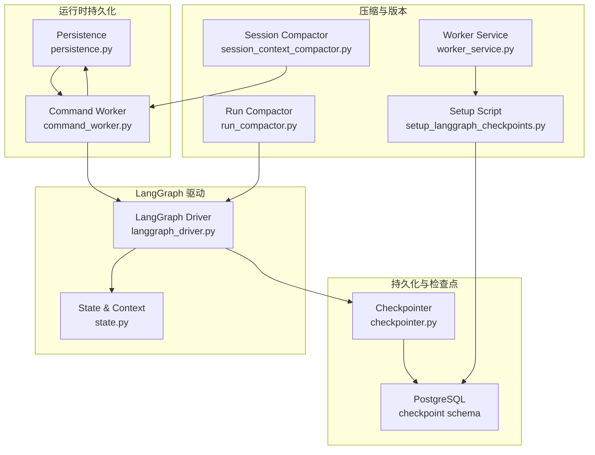
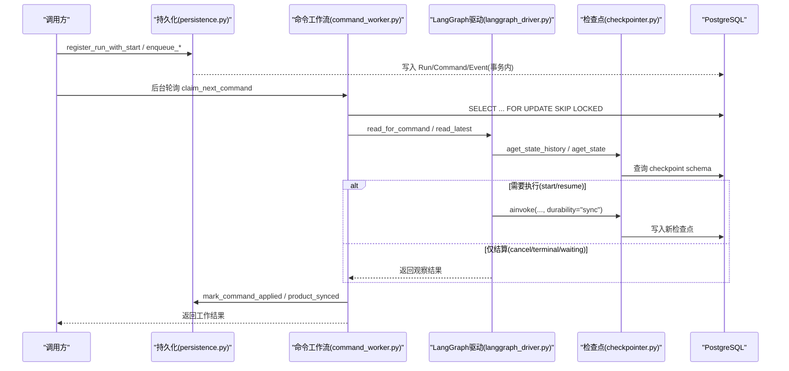
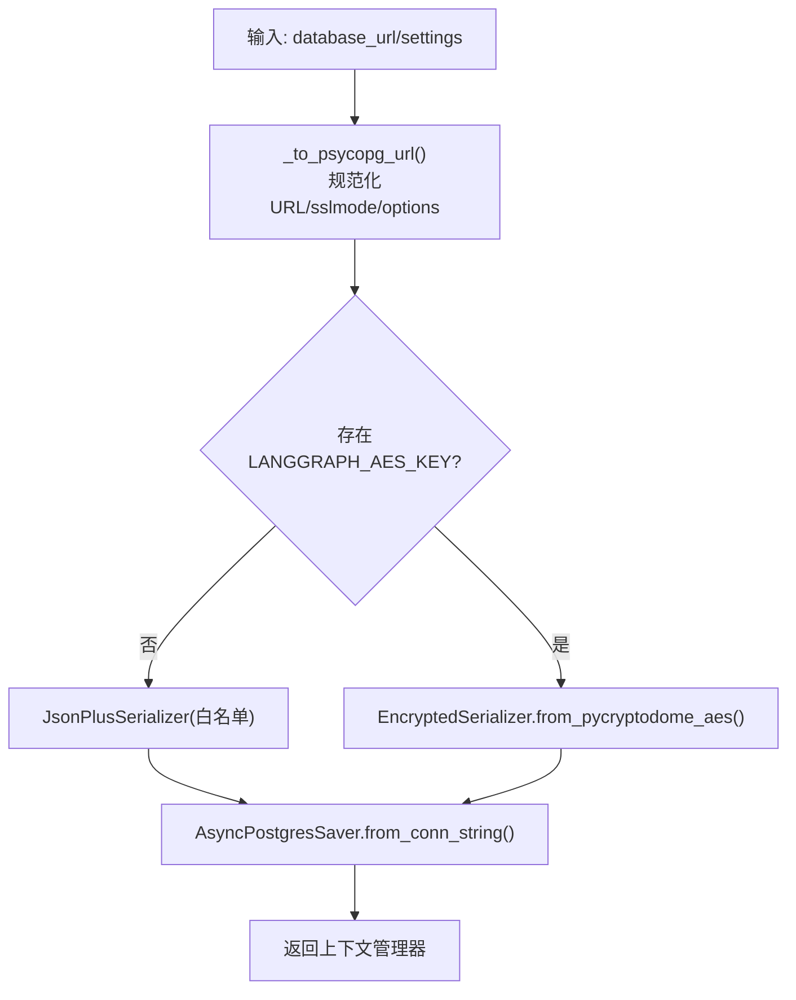
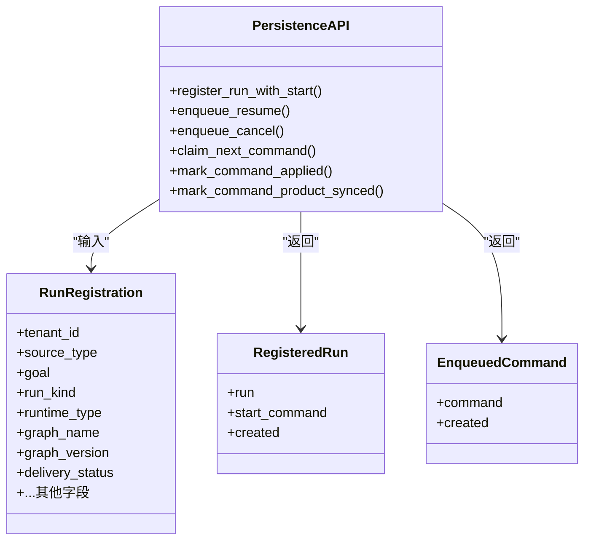
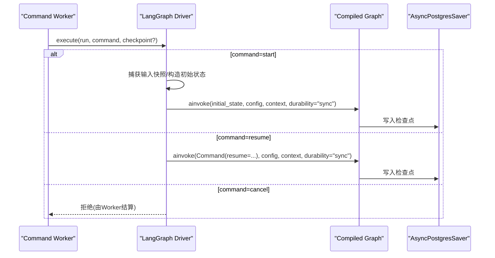
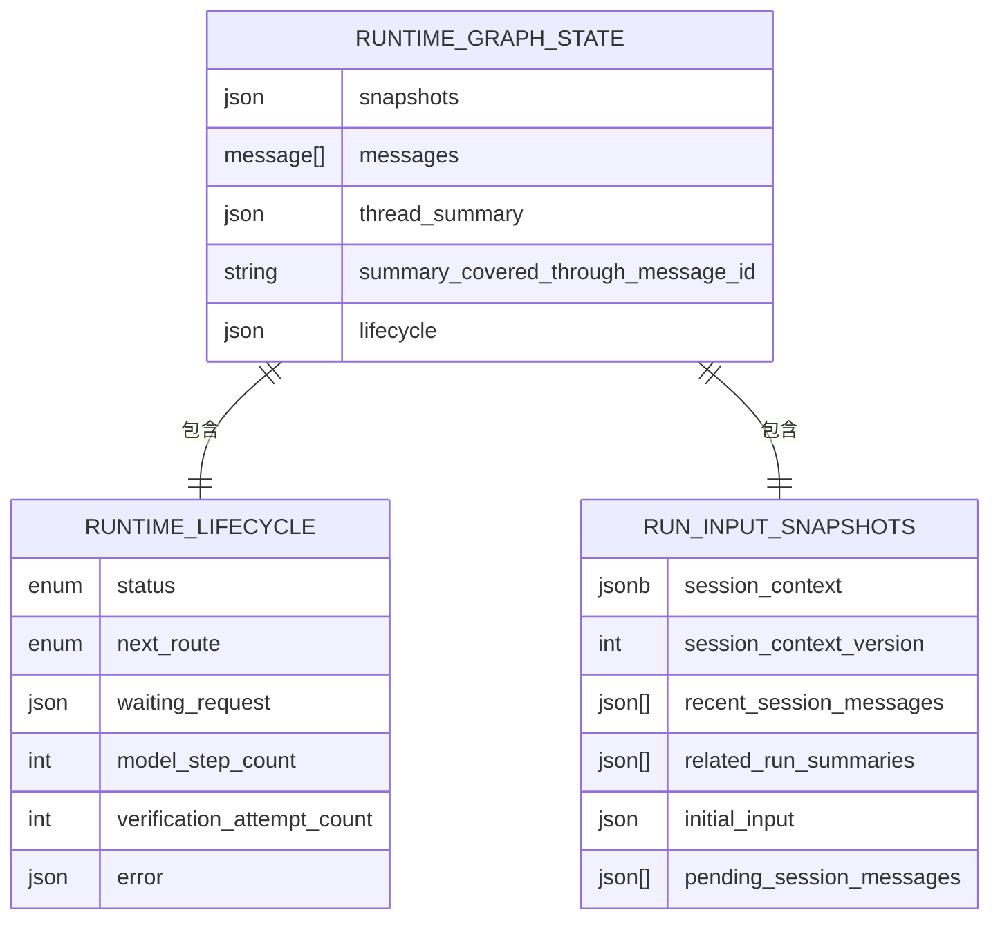
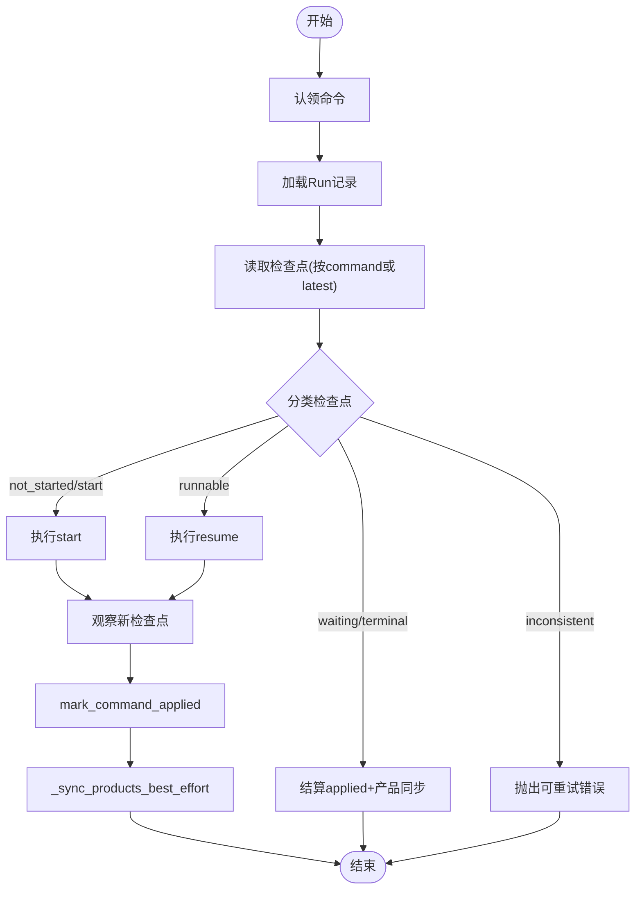
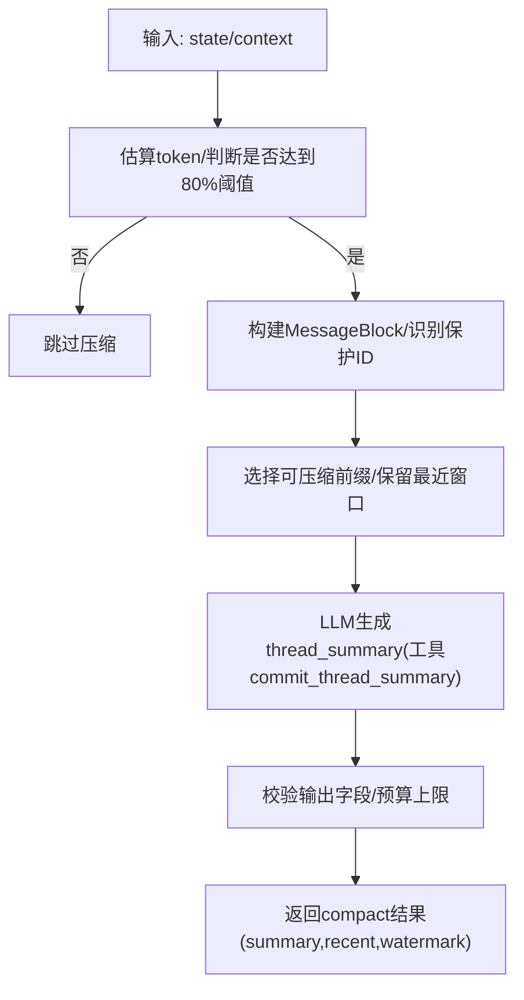
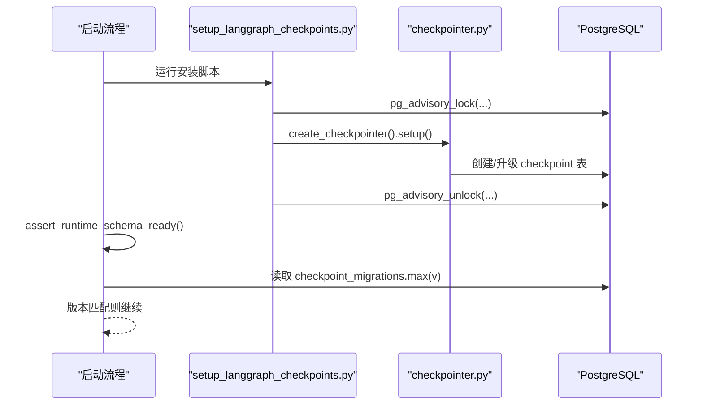
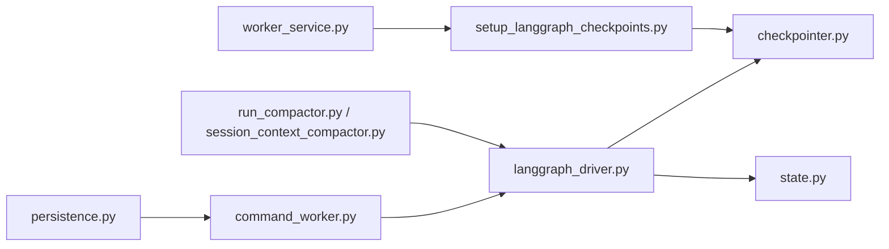

# 检查点与持久化

<cite>
**本文引用的文件**   
- [checkpointer.py](file://backend/app/services/agent_runtime/checkpointer.py)
- [persistence.py](file://backend/app/services/agent_runtime/persistence.py)
- [langgraph_driver.py](file://backend/app/services/agent_runtime/langgraph_driver.py)
- [state.py](file://backend/app/services/agent_runtime/state.py)
- [command_worker.py](file://backend/app/services/agent_runtime/command_worker.py)
- [run_compactor.py](file://backend/app/services/agent_runtime/run_compactor.py)
- [session_context_compactor.py](file://backend/app/services/agent_runtime/session_context_compactor.py)
- [setup_langgraph_checkpoints.py](file://backend/app/scripts/setup_langgraph_checkpoints.py)
- [worker_service.py](file://backend/app/services/agent_runtime/worker_service.py)
</cite>

## 目录
1. [简介](#简介)
2. [项目结构](#项目结构)
3. [核心组件](#核心组件)
4. [架构总览](#架构总览)
5. [详细组件分析](#详细组件分析)
6. [依赖关系分析](#依赖关系分析)
7. [性能考量](#性能考量)
8. [故障恢复指南](#故障恢复指南)
9. [结论](#结论)
10. [附录：API与调试](#附录api与调试)

## 简介
本文件系统性阐述 Clawith 的“检查点与持久化”体系，覆盖以下关键主题：
- 检查点创建机制、状态快照与恢复策略
- 持久化存储方案（PostgreSQL + LangGraph Checkpoint）、数据一致性保证与并发访问控制
- 检查点压缩、增量保存与版本管理
- 故障恢复流程、数据迁移策略与性能优化
- 检查点操作 API 与调试方法

该体系以 PostgreSQL 为权威持久化层，结合 LangGraph 的检查点能力，通过“命令入队—线程锁—检查点观测—幂等执行—产品侧同步”的闭环，确保长时运行 Agent 的可恢复性与强一致性。

## 项目结构
与检查点与持久化相关的核心代码位于后端服务 agent_runtime 子系统中，主要文件职责如下：
- checkpointer.py：LangGraph 检查点连接、序列化器与数据库 URL 解析
- persistence.py：运行时 Run/Command 的幂等持久化、命令认领与生命周期
- langgraph_driver.py：基于 LangGraph 的检查点读取与命令执行驱动
- state.py：运行时状态模型、消息通道与上下文契约
- command_worker.py：命令工作流编排（认领、校验、执行、结算）
- run_compactor.py：线程级历史压缩（Thread Compact）
- session_context_compactor.py：会话上下文压缩（Session Context Compact）
- setup_langgraph_checkpoints.py：检查点表结构的独立安装与升级
- worker_service.py：启动时的 schema 就绪校验与组件装配

**图表来源** 
- [checkpointer.py:1-178](file://backend/app/services/agent_runtime/checkpointer.py#L1-L178)
- [persistence.py:1-800](file://backend/app/services/agent_runtime/persistence.py#L1-L800)
- [langgraph_driver.py:1-501](file://backend/app/services/agent_runtime/langgraph_driver.py#L1-L501)
- [state.py:1-216](file://backend/app/services/agent_runtime/state.py#L1-L216)
- [command_worker.py:1-800](file://backend/app/services/agent_runtime/command_worker.py#L1-L800)
- [run_compactor.py:1-732](file://backend/app/services/agent_runtime/run_compactor.py#L1-L732)
- [session_context_compactor.py:1-464](file://backend/app/services/agent_runtime/session_context_compactor.py#L1-L464)
- [setup_langgraph_checkpoints.py:1-74](file://backend/app/scripts/setup_langgraph_checkpoints.py#L1-L74)
- [worker_service.py:140-339](file://backend/app/services/agent_runtime/worker_service.py#L140-L339)

**章节来源**
- [checkpointer.py:1-178](file://backend/app/services/agent_runtime/checkpointer.py#L1-L178)
- [persistence.py:1-800](file://backend/app/services/agent_runtime/persistence.py#L1-L800)
- [langgraph_driver.py:1-501](file://backend/app/services/agent_runtime/langgraph_driver.py#L1-L501)
- [state.py:1-216](file://backend/app/services/agent_runtime/state.py#L1-L216)
- [command_worker.py:1-800](file://backend/app/services/agent_runtime/command_worker.py#L1-L800)
- [run_compactor.py:1-732](file://backend/app/services/agent_runtime/run_compactor.py#L1-L732)
- [session_context_compactor.py:1-464](file://backend/app/services/agent_runtime/session_context_compactor.py#L1-L464)
- [setup_langgraph_checkpoints.py:1-74](file://backend/app/scripts/setup_langgraph_checkpoints.py#L1-L74)
- [worker_service.py:140-339](file://backend/app/services/agent_runtime/worker_service.py#L140-L339)

## 核心组件
- 检查点连接器（Checkpointer）
  - 负责解析并规范化检查点数据库 URL、构建序列化器（支持可选 AES 加密），以及创建 AsyncPostgresSaver 上下文管理器。
  - 提供 thread/command 配置构造函数，用于绑定 Thread/checkpoint 身份与 Clawith Run/Command 元数据。
- 运行时持久化（Persistence）
  - 定义 Run 注册与 Command 入队的幂等写入接口；实现命令认领、尝试计数、过期释放与产品侧同步标记。
  - 使用 SQL 事务与唯一约束保障并发安全，避免重复入队与竞态条件。
- LangGraph 驱动（Driver）
  - 根据 Run 类型选择当前部署的图拓扑，按 run_id/command_id 过滤读取检查点，执行 start/resume/cancel 三类命令。
  - 将输入快照与初始消息注入状态，确保可恢复性。
- 状态模型（State）
  - 定义运行时图状态、生命周期、消息通道与不可变快照（RunInputSnapshots）。
  - 提供消息标准化与兼容旧版 checkpoint 的迁移路径。
- 命令工作流（Command Worker）
  - 统一编排：认领命令→加载 Run→读取检查点→分类状态→执行或结算→产品侧副作用→幂等标记。
  - 内置心跳续租、最大尝试次数、不一致检查点处理与拒绝码映射。
- 压缩子系统
  - RunCompactor：对线程历史进行“运行摘要+最近消息”的压缩，严格保护当前输入与未完成的工具交换边界。
  - SessionContextCompactor：对会话上下文进行结构化压缩，输出受控字段集，保证可验证与可回滚。
- 版本与迁移
  - setup_langgraph_checkpoints.py：在独立 schema 中安装/升级 LangGraph 检查点表，使用 advisory lock 保证多进程安全。
  - worker_service.py：启动时校验产品 schema 与 checkpoint 迁移版本是否匹配预期。

**章节来源**
- [checkpointer.py:1-178](file://backend/app/services/agent_runtime/checkpointer.py#L1-L178)
- [persistence.py:1-800](file://backend/app/services/agent_runtime/persistence.py#L1-L800)
- [langgraph_driver.py:1-501](file://backend/app/services/agent_runtime/langgraph_driver.py#L1-L501)
- [state.py:1-216](file://backend/app/services/agent_runtime/state.py#L1-L216)
- [command_worker.py:1-800](file://backend/app/services/agent_runtime/command_worker.py#L1-L800)
- [run_compactor.py:1-732](file://backend/app/services/agent_runtime/run_compactor.py#L1-L732)
- [session_context_compactor.py:1-464](file://backend/app/services/agent_runtime/session_context_compactor.py#L1-L464)
- [setup_langgraph_checkpoints.py:1-74](file://backend/app/scripts/setup_langgraph_checkpoints.py#L1-L74)
- [worker_service.py:140-339](file://backend/app/services/agent_runtime/worker_service.py#L140-L339)

## 架构总览
下图展示了从命令入队到检查点落盘、再到产品侧同步的整体流程，强调幂等、可恢复与一致性边界。

**图表来源** 
- [persistence.py:321-401](file://backend/app/services/agent_runtime/persistence.py#L321-L401)
- [command_worker.py:362-800](file://backend/app/services/agent_runtime/command_worker.py#L362-L800)
- [langgraph_driver.py:337-491](file://backend/app/services/agent_runtime/langgraph_driver.py#L337-L491)
- [checkpointer.py:169-178](file://backend/app/services/agent_runtime/checkpointer.py#L169-L178)

## 详细组件分析

### 检查点连接器（Checkpointer）
- 功能要点
  - 规范化数据库 URL，强制 search_path 指向专用 schema，避免跨 schema 冲突。
  - 构建 JsonPlusSerializer，并通过 EncryptedSerializer 可选地启用 AES 加密（要求密钥长度为 16/24/32 字节）。
  - 暴露 runtime_thread_config 与 runtime_command_config，将 Clawith 的 run_id/command_id 绑定到 checkpoint metadata。
- 设计权衡
  - 将 DDL 迁移与运行时解耦，由独立脚本完成，避免启动阻塞。
  - 通过 allowed_msgpack_modules 白名单限制反序列化范围，降低安全风险。

**图表来源** 
- [checkpointer.py:71-136](file://backend/app/services/agent_runtime/checkpointer.py#L71-L136)
- [checkpointer.py:145-167](file://backend/app/services/agent_runtime/checkpointer.py#L145-L167)
- [checkpointer.py:169-178](file://backend/app/services/agent_runtime/checkpointer.py#L169-L178)

**章节来源**
- [checkpointer.py:1-178](file://backend/app/services/agent_runtime/checkpointer.py#L1-L178)

### 运行时持久化（Persistence）
- 幂等写入
  - register_run_with_start：在调用者事务内原子写入 Run、start 命令与 created 事件；遇到唯一键冲突时回退到重试路径。
  - enqueue_resume/enqueue_cancel：按 idempotency_key 去重，确保相同请求不重复入队。
- 命令认领与并发控制
  - claim_next_command：使用 with_for_update(skip_locked=True) 获取最老可用命令，同时考虑 per-Run 顺序与 lane 持有逻辑。
  - begin_command_attempt/marking applied/rejected：维护 attempt_count、claim_expires_at、error_code 等字段，支撑重试与隔离。
- 产品侧同步标记
  - mark_command_product_synced：清除 product_sync_pending 标记，允许后续 reconciler 继续推进。

**图表来源** 
- [persistence.py:34-80](file://backend/app/services/agent_runtime/persistence.py#L34-L80)
- [persistence.py:321-401](file://backend/app/services/agent_runtime/persistence.py#L321-L401)
- [persistence.py:477-522](file://backend/app/services/agent_runtime/persistence.py#L477-L522)
- [persistence.py:635-698](file://backend/app/services/agent_runtime/persistence.py#L635-L698)

**章节来源**
- [persistence.py:1-800](file://backend/app/services/agent_runtime/persistence.py#L1-L800)

### LangGraph 驱动（Driver）
- 检查点读取
  - read_latest：按 thread_id 与 filter(clawith_run_id) 取最新快照。
  - read_for_command：进一步限定 clawith_command_id，确保命令与检查点一一对应。
  - read_checkpoint：按 checkpoint_id 精确读取。
- 命令执行
  - start：若已有 checkpoint 则拒绝；否则捕获输入快照并初始化状态，调用 ainvoke(durability="sync")。
  - resume：校验 waiting_request.correlation_id 与 resume payload，提交 Command(resume=...)。
  - cancel：作为控制面指令，不直接修改 checkpoint，而是由 Worker 结算。

**图表来源** 
- [langgraph_driver.py:337-491](file://backend/app/services/agent_runtime/langgraph_driver.py#L337-L491)

**章节来源**
- [langgraph_driver.py:1-501](file://backend/app/services/agent_runtime/langgraph_driver.py#L1-L501)

### 状态模型（State）
- RuntimeGraphState：包含 snapshots（不可变输入快照）、messages（原生 reducer-backed 历史）、lifecycle（权威生命周期）等。
- RunInputSnapshots：固定 Run 启动时的上下文与输入，确保 resume 时语义一致。
- RuntimeLifecycle：记录 status、next_route、waiting_request、verification 等，供 classify_checkpoint 判定执行状态。

**图表来源** 
- [state.py:47-135](file://backend/app/services/agent_runtime/state.py#L47-L135)

**章节来源**
- [state.py:1-216](file://backend/app/services/agent_runtime/state.py#L1-L216)

### 命令工作流（Command Worker）
- 认领与心跳
  - claim_next_command：按优先级与顺序挑选命令，必要时抢占 lane。
  - _renew_claim/_heartbeat：周期性续租，防止长时间执行导致丢失所有权。
- 检查点分类与执行
  - classify_checkpoint：依据 lifecycle/status、tasks/interrupts/next_nodes 的一致性判定 not_started/runnable/waiting/terminal/inconsistent。
  - 针对 waiting/terminal 直接结算；inconsistent 抛出可重试错误；runnable 进入执行。
- 结算与产品侧同步
  - mark_command_applied：记录 applied_checkpoint_id 与 error_code="product_sync_pending"。
  - _sync_products_best_effort：调用 post_checkpoint_handler 做幂等产品副作用，失败不影响已落盘的 checkpoint。

**图表来源** 
- [command_worker.py:362-800](file://backend/app/services/agent_runtime/command_worker.py#L362-L800)

**章节来源**
- [command_worker.py:1-800](file://backend/app/services/agent_runtime/command_worker.py#L1-L800)

### 压缩子系统
- RunCompactor（线程级压缩）
  - 触发条件：当完整请求 token 达到有效预算的 80% 高水位线。
  - 保护边界：当前输入、修复中的消息、未完成的工具交换均不被压缩。
  - 输出：thread_summary（固定字段集）+ recent_messages（保留最近窗口）+ covered_through_message_id（水位线）。
- SessionContextCompactor（会话上下文压缩）
  - 输入：当前 snapshot + 新消息 + terminal_delta。
  - 输出：受控字段集的候选上下文，带 watermark 标识覆盖范围。
  - 模型选择：区分 group/direct session，动态解析模型能力与预算。

**图表来源** 
- [run_compactor.py:104-123](file://backend/app/services/agent_runtime/run_compactor.py#L104-L123)
- [run_compactor.py:521-724](file://backend/app/services/agent_runtime/run_compactor.py#L521-L724)
- [session_context_compactor.py:266-456](file://backend/app/services/agent_runtime/session_context_compactor.py#L266-L456)

**章节来源**
- [run_compactor.py:1-732](file://backend/app/services/agent_runtime/run_compactor.py#L1-L732)
- [session_context_compactor.py:1-464](file://backend/app/services/agent_runtime/session_context_compactor.py#L1-L464)

### 版本管理与迁移
- 检查点表安装
  - setup_langgraph_checkpoints.py：通过 advisory lock 串行化 DDL，调用 checkpointer.setup() 完成表创建/升级。
- 启动就绪校验
  - worker_service.py：检查产品 schema 是否存在必要表，并读取 checkpoint_migrations 的最大版本号，与期望值比对，不一致则拒绝启动。

**图表来源** 
- [setup_langgraph_checkpoints.py:21-66](file://backend/app/scripts/setup_langgraph_checkpoints.py#L21-L66)
- [worker_service.py:144-198](file://backend/app/services/agent_runtime/worker_service.py#L144-L198)

**章节来源**
- [setup_langgraph_checkpoints.py:1-74](file://backend/app/scripts/setup_langgraph_checkpoints.py#L1-L74)
- [worker_service.py:140-339](file://backend/app/services/agent_runtime/worker_service.py#L140-L339)

## 依赖关系分析
- 组件耦合
  - Command Worker 依赖 Persistence（幂等入队/认领）与 Driver（检查点读写）。
  - Driver 依赖 Checkpointer（PostgreSQL saver）与 State（状态模型）。
  - Compactors 依赖 LLM 客户端与模型能力解析，但不直接写 checkpoint，仅产出可替换的摘要/上下文。
- 外部依赖
  - PostgreSQL：产品 schema 与 checkpoint schema（独立 schema）。
  - LangGraph：AsyncPostgresSaver、消息 reducer、Command 协议。
  - pycryptodome（可选）：AES 加密序列化器。

**图表来源** 
- [persistence.py:1-800](file://backend/app/services/agent_runtime/persistence.py#L1-L800)
- [command_worker.py:1-800](file://backend/app/services/agent_runtime/command_worker.py#L1-L800)
- [langgraph_driver.py:1-501](file://backend/app/services/agent_runtime/langgraph_driver.py#L1-L501)
- [checkpointer.py:1-178](file://backend/app/services/agent_runtime/checkpointer.py#L1-L178)
- [state.py:1-216](file://backend/app/services/agent_runtime/state.py#L1-L216)
- [run_compactor.py:1-732](file://backend/app/services/agent_runtime/run_compactor.py#L1-L732)
- [session_context_compactor.py:1-464](file://backend/app/services/agent_runtime/session_context_compactor.py#L1-L464)
- [setup_langgraph_checkpoints.py:1-74](file://backend/app/scripts/setup_langgraph_checkpoints.py#L1-L74)
- [worker_service.py:140-339](file://backend/app/services/agent_runtime/worker_service.py#L140-L339)

**章节来源**
- [persistence.py:1-800](file://backend/app/services/agent_runtime/persistence.py#L1-L800)
- [command_worker.py:1-800](file://backend/app/services/agent_runtime/command_worker.py#L1-L800)
- [langgraph_driver.py:1-501](file://backend/app/services/agent_runtime/langgraph_driver.py#L1-L501)
- [checkpointer.py:1-178](file://backend/app/services/agent_runtime/checkpointer.py#L1-L178)
- [state.py:1-216](file://backend/app/services/agent_runtime/state.py#L1-L216)
- [run_compactor.py:1-732](file://backend/app/services/agent_runtime/run_compactor.py#L1-L732)
- [session_context_compactor.py:1-464](file://backend/app/services/agent_runtime/session_context_compactor.py#L1-L464)
- [setup_langgraph_checkpoints.py:1-74](file://backend/app/scripts/setup_langgraph_checkpoints.py#L1-L74)
- [worker_service.py:140-339](file://backend/app/services/agent_runtime/worker_service.py#L140-L339)

## 性能考量
- 检查点序列化
  - 使用 JsonPlusSerializer 与白名单 msgpack 模块，减少反序列化开销与攻击面；可选 AES 加密带来 CPU 开销，需权衡安全需求。
- 数据库访问
  - 使用 skip_locked 与 for update 提升并发吞吐，避免锁竞争热点；lane 持有与排序键减少争用。
- 压缩策略
  - 仅在 80% 阈值触发压缩，保持低延迟；summary 与 recent 双缓冲，控制模型上下文窗口占用。
- 异步与耐久
  - ainvoke 使用 durability="sync" 确保检查点落盘后再返回，避免丢失中间状态；心跳续租降低长任务丢失风险。

[本节为通用指导，无需特定文件引用]

## 故障恢复指南
- 常见错误与处理
  - inconsistent_checkpoint：检查点内部状态不一致（values/next/tasks/interrupts 不匹配），应重试或人工介入。
  - checkpoint_not_observed：执行后未观察到包含该命令的检查点，需等待或排查持久化链路。
  - product_sync_pending：产品侧副作用未完成，reconciler 会重试直至清除标记。
  - invalid_checkpoint_config/id：检查点配置缺失或 ID 为空，需检查 driver 与 checkpointer 配置。
- 恢复步骤
  - 确认 checkpoint schema 版本与期望一致（worker_service 启动校验）。
  - 检查命令是否被认领且未超时（attempt_count、claim_expires_at）。
  - 查看 latest 与 command-specific 检查点是否一致，必要时回滚到上一稳定 checkpoint。
  - 若压缩失败，检查模型能力与预算，确保 protected 边界未被破坏。

**章节来源**
- [command_worker.py:256-339](file://backend/app/services/agent_runtime/command_worker.py#L256-L339)
- [langgraph_driver.py:154-187](file://backend/app/services/agent_runtime/langgraph_driver.py#L154-L187)
- [worker_service.py:144-198](file://backend/app/services/agent_runtime/worker_service.py#L144-L198)

## 结论
Clawith 的检查点与持久化系统以 PostgreSQL 为核心，结合 LangGraph 的检查点能力，构建了幂等、可恢复、强一致的长时运行框架。通过严格的命令认领、检查点分类与产品侧解耦同步，系统在复杂并发场景下仍能保证状态一致与可恢复性。压缩子系统在保证语义正确性的前提下显著降低上下文成本。版本与迁移机制确保部署过程的安全与可控。

[本节为总结，无需特定文件引用]

## 附录：API与调试
- 检查点操作 API（面向调用方）
  - 注册 Run 与 start 命令：register_run_with_start(db, registration, start_payload, start_idempotency_key, ...)
  - 入队 resume/cancel：enqueue_resume / enqueue_cancel
  - 认领命令：claim_next_command(claimant, claim_ttl_seconds, max_attempts, clock)
  - 标记应用与产品同步：mark_command_applied / mark_command_product_synced
- 调试方法
  - 检查点表安装：运行 setup_langgraph_checkpoints.py，确认 checkpoint_migrations 版本与期望一致。
  - 启动校验：确保 assert_runtime_schema_ready 通过，无 missing tables 或版本不匹配。
  - 日志定位：关注 Command Worker 的 rejected/applied/reconciled 状态与 error_code，结合 checkpoint_id 追踪。
  - 压缩诊断：检查 compact 触发阈值、protected 消息集合与模型预算，确认 summary/recent 大小符合预期。

**章节来源**
- [persistence.py:321-401](file://backend/app/services/agent_runtime/persistence.py#L321-L401)
- [persistence.py:477-522](file://backend/app/services/agent_runtime/persistence.py#L477-L522)
- [persistence.py:635-698](file://backend/app/services/agent_runtime/persistence.py#L635-L698)
- [setup_langgraph_checkpoints.py:56-66](file://backend/app/scripts/setup_langgraph_checkpoints.py#L56-L66)
- [worker_service.py:164-198](file://backend/app/services/agent_runtime/worker_service.py#L164-L198)