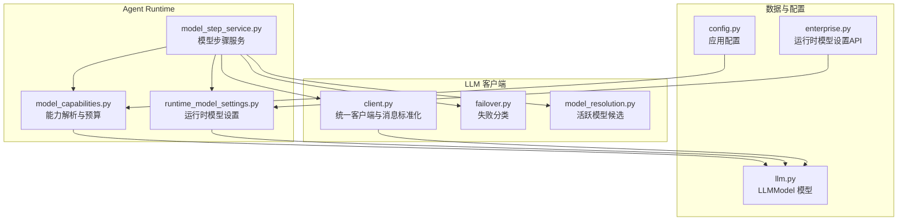
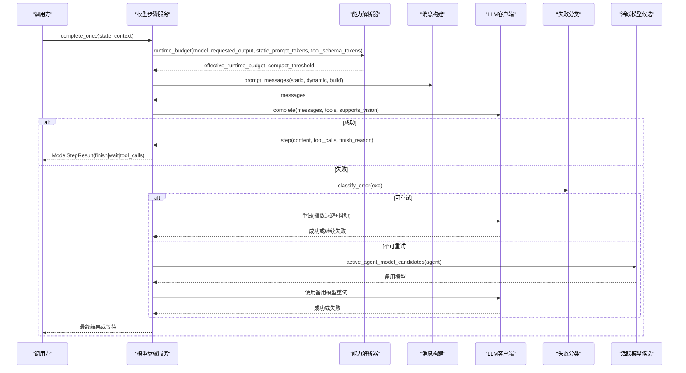
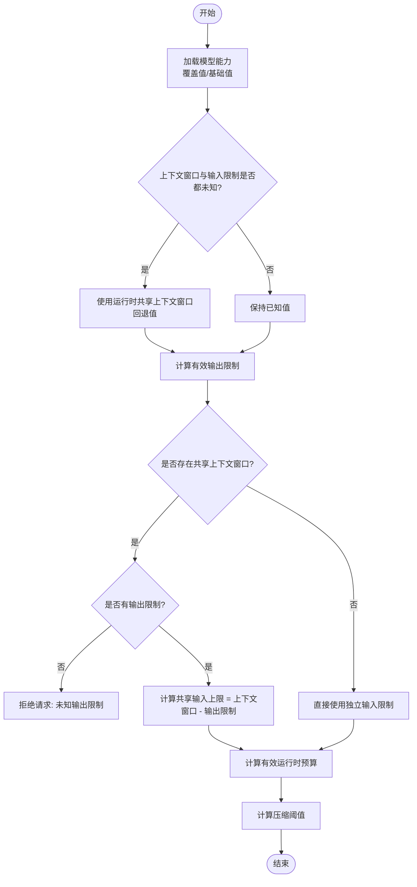
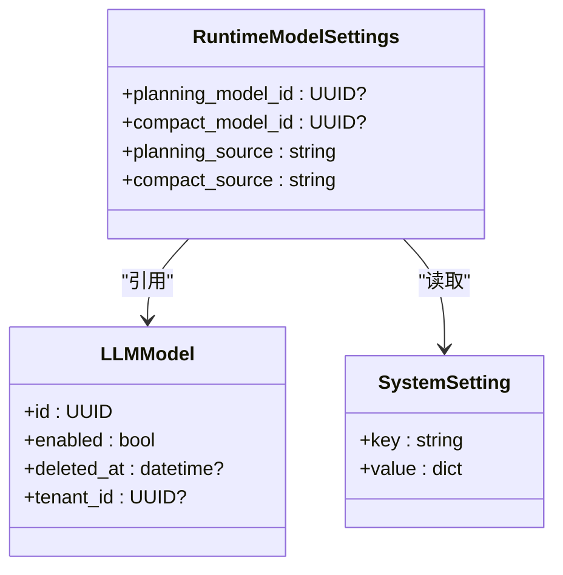
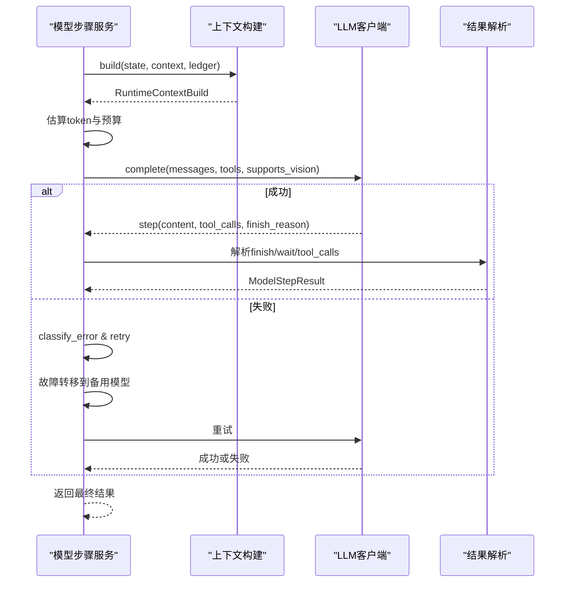
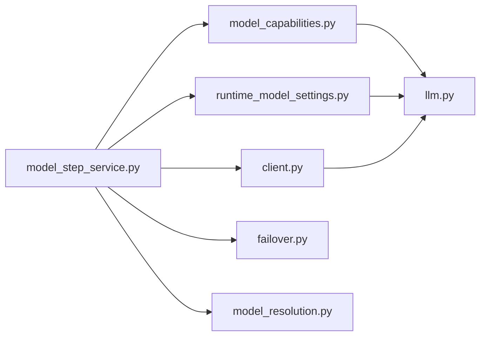

# 模型能力管理

<cite>
**本文引用的文件**   
- [model_capabilities.py](file://backend/app/services/agent_runtime/model_capabilities.py)
- [runtime_model_settings.py](file://backend/app/services/agent_runtime/runtime_model_settings.py)
- [model_step_service.py](file://backend/app/services/agent_runtime/model_step_service.py)
- [client.py](file://backend/app/services/llm/client.py)
- [failover.py](file://backend/app/services/llm/failover.py)
- [model_resolution.py](file://backend/app/services/llm/model_resolution.py)
- [llm.py](file://backend/app/models/llm.py)
- [config.py](file://backend/app/config.py)
- [enterprise.py](file://backend/app/api/enterprise.py)
</cite>

## 目录
1. [简介](#简介)
2. [项目结构](#项目结构)
3. [核心组件](#核心组件)
4. [架构总览](#架构总览)
5. [详细组件分析](#详细组件分析)
6. [依赖关系分析](#依赖关系分析)
7. [性能考虑](#性能考虑)
8. [故障排查指南](#故障排查指南)
9. [结论](#结论)
10. [附录](#附录)

## 简介
本技术文档围绕 Clawith 的“模型能力管理系统”展开，覆盖以下关键主题：
- 模型能力探测与特性支持检测（上下文窗口、输入/输出限制、工具调用能力）
- 降级策略与多模型支持（主模型、备用模型、租户默认模型）
- 运行时模型设置与动态切换（平台级与租户级配置、环境回退）
- 模型步骤服务、调用优化、错误处理（重试、超时、失败分类）
- 负载均衡与故障转移（按错误类型分类、指数退避抖动）
- 模型配置与性能调优（预算计算、压缩阈值、流式与缓存控制）

## 项目结构
与模型能力管理相关的后端代码主要分布在 agent_runtime 与 llm 两个子系统中：
- agent_runtime：负责运行时模型选择、能力解析、请求预算、消息构建、步骤执行与结果解析
- llm：统一客户端抽象、消息格式标准化、提供商适配、失败分类与重试策略
- models：LLMModel 数据模型定义能力字段与约束
- config：运行时全局配置项（如共享上下文窗口回退值、多智能体规划/压缩模型 ID）
- api：企业端 API 暴露运行时模型设置查询与更新接口

**图表来源** 
- [model_step_service.py:1028-1600](file://backend/app/services/agent_runtime/model_step_service.py#L1028-L1600)
- [model_capabilities.py:76-203](file://backend/app/services/agent_runtime/model_capabilities.py#L76-L203)
- [runtime_model_settings.py:39-118](file://backend/app/services/agent_runtime/runtime_model_settings.py#L39-L118)
- [client.py:512-650](file://backend/app/services/llm/client.py#L512-L650)
- [failover.py:21-78](file://backend/app/services/llm/failover.py#L21-L78)
- [model_resolution.py:53-107](file://backend/app/services/llm/model_resolution.py#L53-L107)
- [llm.py:13-80](file://backend/app/models/llm.py#L13-L80)
- [config.py:151-154](file://backend/app/config.py#L151-L154)
- [enterprise.py:994-1046](file://backend/app/api/enterprise.py#L994-L1046)

**章节来源**
- [model_step_service.py:1028-1600](file://backend/app/services/agent_runtime/model_step_service.py#L1028-L1600)
- [model_capabilities.py:76-203](file://backend/app/services/agent_runtime/model_capabilities.py#L76-L203)
- [runtime_model_settings.py:39-118](file://backend/app/services/agent_runtime/runtime_model_settings.py#L39-L118)
- [client.py:512-650](file://backend/app/services/llm/client.py#L512-L650)
- [failover.py:21-78](file://backend/app/services/llm/failover.py#L21-L78)
- [model_resolution.py:53-107](file://backend/app/services/llm/model_resolution.py#L53-L107)
- [llm.py:13-80](file://backend/app/models/llm.py#L13-L80)
- [config.py:151-154](file://backend/app/config.py#L151-L154)
- [enterprise.py:994-1046](file://backend/app/api/enterprise.py#L994-L1046)

## 核心组件
- 模型能力解析器（ModelCapabilityResolver）
  - 解析上下文窗口、最大输入/输出 token 限制，并应用管理员覆盖值；未知能力时回退到运行时配置
  - 计算单次请求的安全输入上限与有效输出预留，生成运行时预算与压缩阈值
- 运行时模型设置（RuntimeModelSettings）
  - 从数据库读取租户或平台的规划/压缩模型选择，支持环境变量回退
- 模型步骤服务（RuntimeModelStepService）
  - 加载模型与 Agent、构建提示与工具集、估算 token 预算、调用 LLM、解析响应、处理 finish/wait/tool_calls
  - 实现重试与失败分类、模型故障转移、视觉证据注入
- 统一 LLM 客户端（OpenAICompatibleClient 等）
  - 标准化消息形状、支持流式与非流式、工具调用、思考内容提取、缓存控制
- 失败分类（FailoverErrorType）
  - 将异常分类为可重试/不可重试/未知，驱动重试与故障转移
- 活跃模型候选（active_agent_model_candidates）
  - 基于 Agent 的主模型、备用模型、租户默认模型顺序返回可用模型列表
- LLMModel 数据模型
  - 存储 provider、model、能力字段（上下文窗口、输入/输出限制、工具调用能力）、启用状态、租户范围等

**章节来源**
- [model_capabilities.py:76-203](file://backend/app/services/agent_runtime/model_capabilities.py#L76-L203)
- [runtime_model_settings.py:39-118](file://backend/app/services/agent_runtime/runtime_model_settings.py#L39-L118)
- [model_step_service.py:1028-1600](file://backend/app/services/agent_runtime/model_step_service.py#L1028-L1600)
- [client.py:512-650](file://backend/app/services/llm/client.py#L512-L650)
- [failover.py:21-78](file://backend/app/services/llm/failover.py#L21-L78)
- [model_resolution.py:53-107](file://backend/app/services/llm/model_resolution.py#L53-L107)
- [llm.py:13-80](file://backend/app/models/llm.py#L13-L80)

## 架构总览
下图展示了模型能力管理与运行时调用的整体流程：从能力探测与预算计算，到消息构建与调用，再到失败分类与故障转移。

**图表来源** 
- [model_step_service.py:1537-1600](file://backend/app/services/agent_runtime/model_step_service.py#L1537-L1600)
- [model_capabilities.py:156-203](file://backend/app/services/agent_runtime/model_capabilities.py#L156-L203)
- [client.py:512-650](file://backend/app/services/llm/client.py#L512-L650)
- [failover.py:21-78](file://backend/app/services/llm/failover.py#L21-L78)
- [model_resolution.py:53-107](file://backend/app/services/llm/model_resolution.py#L53-L107)

## 详细组件分析

### 模型能力解析与预算计算
- 能力解析
  - 优先使用模型覆盖值（context_window_tokens_override、max_input_tokens_override），否则回退到基础值
  - 若两者均未知，则使用运行时配置的共享上下文窗口回退值（AGENT_RUNTIME_FALLBACK_CONTEXT_WINDOW_TOKENS）
  - 输出限制通过 legacy 兼容逻辑处理（非正数视为未设置）
- 输入限制与安全预算
  - 若仅存在共享上下文窗口且无输出限制，拒绝请求（避免不安全预算）
  - 计算 effective_runtime_budget = input_limit - (static_prompt_tokens + tool_schema_tokens + reserved_runtime_tokens + safety_margin_tokens)
  - 压缩阈值 = effective_runtime_budget × compact_threshold_ratio
- 平台/组模型解析
  - resolve_platform_model：要求平台级模型（tenant_id 为空），禁用或不存在则报错
  - resolve_group_model：允许平台或租户范围内的模型，校验 tenant_id 匹配
  - resolve_multi_agent_*：结合环境与数据库设置，解析规划/压缩模型

**图表来源** 
- [model_capabilities.py:76-203](file://backend/app/services/agent_runtime/model_capabilities.py#L76-L203)

**章节来源**
- [model_capabilities.py:76-203](file://backend/app/services/agent_runtime/model_capabilities.py#L76-L203)
- [config.py:151-154](file://backend/app/config.py#L151-L154)

### 运行时模型设置与动态切换
- 设置来源优先级
  - 数据库租户级设置 > 数据库全局设置 > 环境变量
- 解析流程
  - 读取 SystemSetting 中 multi_agent_runtime_models 键值对
  - 校验 UUID 有效性，过滤出已启用且未被删除的模型
  - 返回 planning_model_id 与 compact_model_id 及其来源（database/environment/unavailable）
- API 暴露
  - GET /enterprise/runtime-model-settings：查询租户可用的运行时模型选择
  - PUT /enterprise/runtime-model-settings：保存租户级运行时模型设置

**图表来源** 
- [runtime_model_settings.py:22-118](file://backend/app/services/agent_runtime/runtime_model_settings.py#L22-L118)
- [enterprise.py:994-1046](file://backend/app/api/enterprise.py#L994-L1046)

**章节来源**
- [runtime_model_settings.py:39-118](file://backend/app/services/agent_runtime/runtime_model_settings.py#L39-L118)
- [enterprise.py:994-1046](file://backend/app/api/enterprise.py#L994-L1046)

### 模型步骤服务与调用优化
- 消息构建
  - 静态提示 + 动态提示 + 运行时上下文快照
  - 根据 supports_vision 决定是否注入私有截图证据（Base64 data URL）
- 预算与压缩
  - 在构建消息前估算固定部分 token 数，计算有效运行时预算
  - 根据预算裁剪线程消息与运行摘要，确保不超过模型限制
- 调用与重试
  - 指数退避 + 抖动重试，仅对可重试错误进行
  - 失败分类后尝试备用模型（主→备→租户默认）
- 结果解析
  - 识别 finish、wait、tool_calls 三类意图
  - 对无效工具调用或空输出进行修复指令返回

**图表来源** 
- [model_step_service.py:1267-1454](file://backend/app/services/agent_runtime/model_step_service.py#L1267-L1454)
- [model_step_service.py:1456-1516](file://backend/app/services/agent_runtime/model_step_service.py#L1456-L1516)
- [model_step_service.py:801-1026](file://backend/app/services/agent_runtime/model_step_service.py#L801-L1026)

**章节来源**
- [model_step_service.py:1267-1454](file://backend/app/services/agent_runtime/model_step_service.py#L1267-L1454)
- [model_step_service.py:1456-1516](file://backend/app/services/agent_runtime/model_step_service.py#L1456-L1516)
- [model_step_service.py:801-1026](file://backend/app/services/agent_runtime/model_step_service.py#L801-L1026)

### 统一 LLM 客户端与消息标准化
- 消息标准化
  - normalize_provider_messages：合并多个 system 消息，保留第一个作为可缓存前缀，后续动态内容折叠到尾部
  - validate_openai_message_shape：确保 OpenAI 风格请求最多一个 system 消息且在首位
- 提供商适配
  - OpenAICompatibleClient：支持 tool_choice、parallel_tool_calls、stream_options.include_usage
  - Anthropic 适配：处理 thinking、tool_use、tool_result、image 源转换
- 流式处理
  - 解析 SSE 行，累积 JSON 缓冲，处理 usage 统计与 finish_reason
  - 支持 reasoning_content 提取与 <think> 标签路由

**章节来源**
- [client.py:391-427](file://backend/app/services/llm/client.py#L391-L427)
- [client.py:564-722](file://backend/app/services/llm/client.py#L564-L722)
- [client.py:724-800](file://backend/app/services/llm/client.py#L724-L800)

### 失败分类与故障转移
- 错误分类
  - 认证/授权错误（401/403）→ 不可重试
  - 验证/Schema 错误（400/422）→ 不可重试
  - 内容策略违规 → 不可重试
  - 限流（429）、服务器错误（5xx）、网络/超时 → 可重试
- 重试策略
  - 指数退避 + 随机抖动，最大延迟限制
  - 记录重试日志与 HTTP 状态码
- 故障转移
  - 当主模型不可用且错误可重试耗尽后，尝试备用模型（active_agent_model_candidates）

**章节来源**
- [failover.py:21-78](file://backend/app/services/llm/failover.py#L21-L78)
- [model_step_service.py:1456-1516](file://backend/app/services/agent_runtime/model_step_service.py#L1456-L1516)
- [model_resolution.py:53-107](file://backend/app/services/llm/model_resolution.py#L53-L107)

### 活跃模型候选与多模型支持
- 候选顺序
  - Agent.primary_model_id → Agent.fallback_model_id → Tenant.default_model_id
- 可用性检查
  - 模型必须 enabled、未删除、tenant_id 匹配（平台或租户）
- 返回元组
  - 按顺序返回可用模型，供上层选择主/备模型

**章节来源**
- [model_resolution.py:53-107](file://backend/app/services/llm/model_resolution.py#L53-L107)

### 模型能力探测与工具调用支持
- 探测方法
  - 通过专用 capability_probe 工具调用，验证模型是否支持结构化工具调用
  - 记录 tool_calling_supported、latency、error 等信息
- 能力字段
  - supports_tool_calling、tool_calling_capability_source、tool_calling_checked_at、tool_calling_error

**章节来源**
- [enterprise.py:41-345](file://backend/app/api/enterprise.py#L41-L345)
- [llm.py:71-74](file://backend/app/models/llm.py#L71-L74)

## 依赖关系分析
- 模块耦合
  - model_step_service 依赖 model_capabilities、runtime_model_settings、llm client、failover、model_resolution
  - model_capabilities 依赖 config（运行时回退值）与 LLMModel 模型
  - runtime_model_settings 依赖 SystemSetting 与 LLMModel
  - client 提供统一接口，被 model_step_service 调用
- 外部依赖
  - SQLAlchemy 异步会话用于数据库访问
  - httpx 用于 HTTP 请求
  - loguru 用于日志记录

**图表来源** 
- [model_step_service.py:1028-1600](file://backend/app/services/agent_runtime/model_step_service.py#L1028-L1600)
- [model_capabilities.py:76-203](file://backend/app/services/agent_runtime/model_capabilities.py#L76-L203)
- [runtime_model_settings.py:39-118](file://backend/app/services/agent_runtime/runtime_model_settings.py#L39-L118)
- [client.py:512-650](file://backend/app/services/llm/client.py#L512-L650)
- [failover.py:21-78](file://backend/app/services/llm/failover.py#L21-L78)
- [model_resolution.py:53-107](file://backend/app/services/llm/model_resolution.py#L53-L107)
- [llm.py:13-80](file://backend/app/models/llm.py#L13-L80)

**章节来源**
- [model_step_service.py:1028-1600](file://backend/app/services/agent_runtime/model_step_service.py#L1028-L1600)
- [model_capabilities.py:76-203](file://backend/app/services/agent_runtime/model_capabilities.py#L76-L203)
- [runtime_model_settings.py:39-118](file://backend/app/services/agent_runtime/runtime_model_settings.py#L39-L118)
- [client.py:512-650](file://backend/app/services/llm/client.py#L512-L650)
- [failover.py:21-78](file://backend/app/services/llm/failover.py#L21-L78)
- [model_resolution.py:53-107](file://backend/app/services/llm/model_resolution.py#L53-L107)
- [llm.py:13-80](file://backend/app/models/llm.py#L13-L80)

## 性能考虑
- Token 预算与压缩
  - 精确估算静态提示、工具 Schema、运行时上下文 token 数
  - 根据有效预算裁剪线程消息与运行摘要，避免超限
  - 压缩阈值用于触发上下文压缩，减少后续请求大小
- 流式与缓存控制
  - 支持 stream_options.include_usage 获取实时用量
  - 对 OpenAI 兼容提供商启用 cache_control（ephemeral）提升重复请求性能
- 重试与退避
  - 指数退避 + 抖动避免雪崩效应
  - 仅对可重试错误进行重试，减少无效开销
- 视觉证据注入
  - 仅在 supports_vision 为真时注入 Base64 图像，避免不必要的编码开销

[本节为通用性能指导，不直接分析具体文件]

## 故障排查指南
- 常见错误类型
  - 认证/授权失败（401/403）：检查 API Key、权限配置
  - 请求验证失败（400/422）：检查消息形状、工具 Schema、参数合法性
  - 内容策略违规：调整提示词或内容
  - 限流（429）：降低请求频率或增加配额
  - 服务器错误（5xx）：重试或切换提供商
- 调试建议
  - 查看日志中的 [RuntimeModelRetry] 与 [LLM-Debug] 信息
  - 检查能力探测结果（tool_calling_supported、latency_ms）
  - 验证运行时模型设置（planning/compact model IDs）

**章节来源**
- [failover.py:21-78](file://backend/app/services/llm/failover.py#L21-L78)
- [enterprise.py:41-345](file://backend/app/api/enterprise.py#L41-L345)
- [model_step_service.py:1456-1516](file://backend/app/services/agent_runtime/model_step_service.py#L1456-L1516)

## 结论
Clawith 的模型能力管理系统通过精细的能力解析、严格的预算控制、健壮的重试与故障转移机制，实现了多模型支持与高可用性。运行时模型设置与环境回退提供了灵活的配置管理能力，统一客户端抽象简化了多提供商集成。通过性能优化（流式、缓存、压缩）与完善的错误处理，系统能够在复杂场景下稳定运行。

[本节为总结性内容，不直接分析具体文件]

## 附录
- 配置项参考
  - AGENT_RUNTIME_FALLBACK_CONTEXT_WINDOW_TOKENS：共享上下文窗口回退值
  - MULTI_AGENT_PLANNING_MODEL_ID / MULTI_AGENT_COMPACT_MODEL_ID：多智能体规划/压缩模型 ID
- API 端点
  - GET /enterprise/runtime-model-settings：查询运行时模型设置
  - PUT /enterprise/runtime-model-settings：更新运行时模型设置

**章节来源**
- [config.py:151-154](file://backend/app/config.py#L151-L154)
- [enterprise.py:994-1046](file://backend/app/api/enterprise.py#L994-L1046)