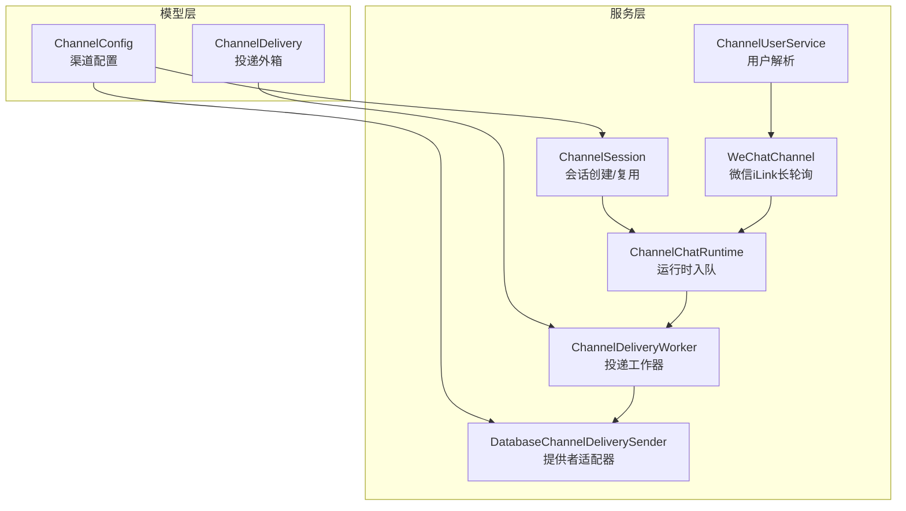
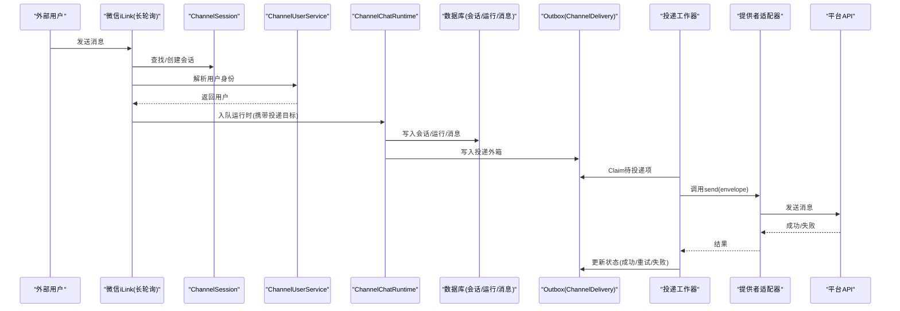
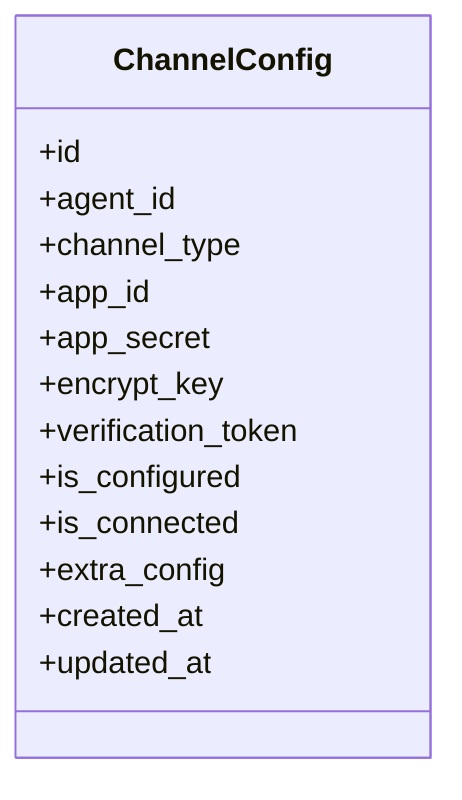
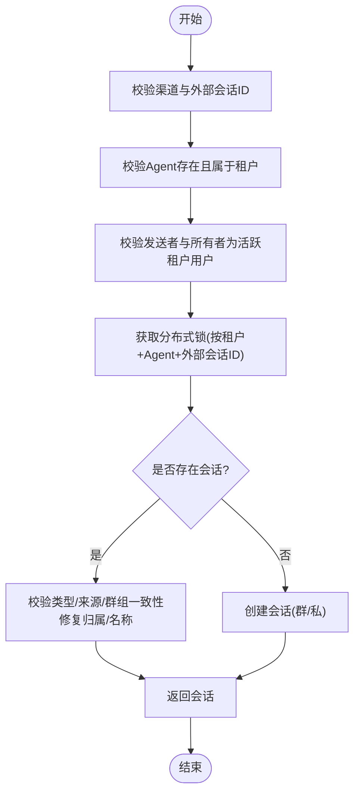
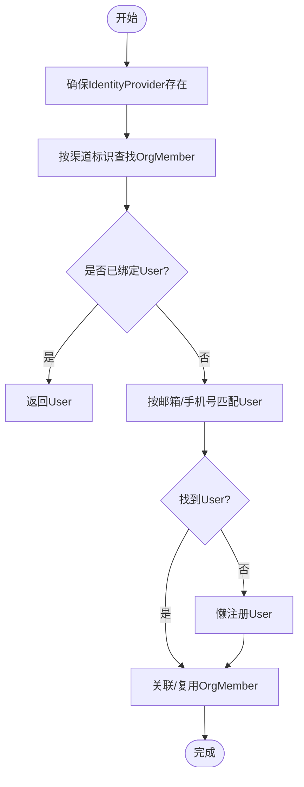
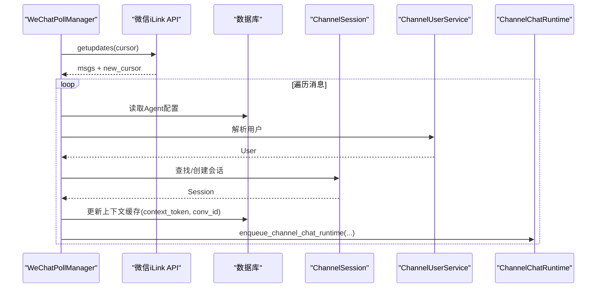
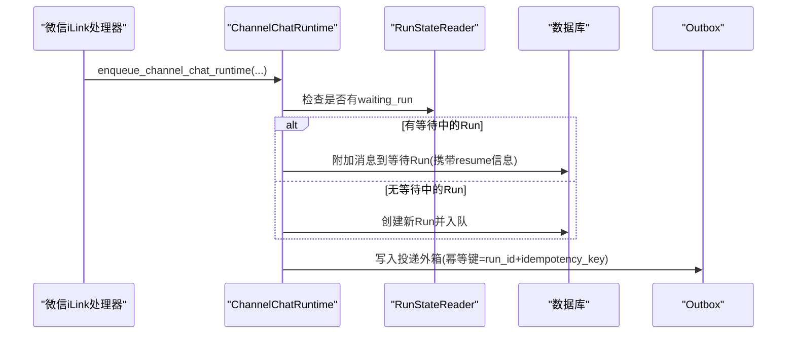
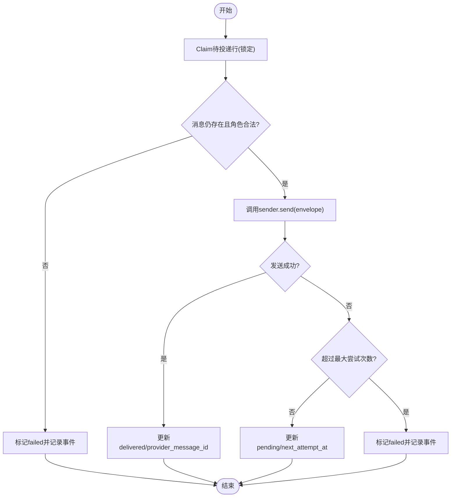
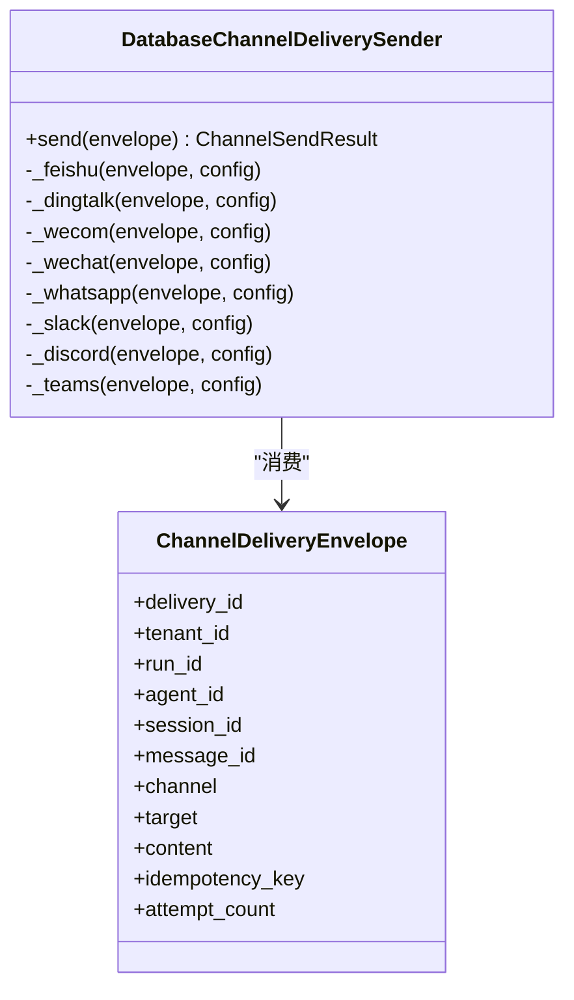
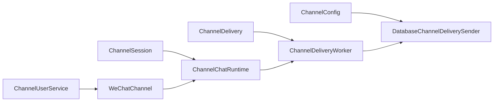

# 渠道集成适配器

<cite>
**本文引用的文件**   
- [channel_config.py](file://backend/app/models/channel_config.py)
- [channel_delivery.py](file://backend/app/models/channel_delivery.py)
- [channel_session.py](file://backend/app/services/channel_session.py)
- [channel_user_service.py](file://backend/app/services/channel_user_service.py)
- [wechat_channel.py](file://backend/app/services/wechat_channel.py)
- [channel_chat.py](file://backend/app/services/agent_runtime/channel_chat.py)
- [channel_delivery_worker.py](file://backend/app/services/agent_runtime/channel_delivery.py)
- [channel_provider_delivery.py](file://backend/app/services/agent_runtime/channel_provider_delivery.py)
</cite>

## 目录
1. [引言](#引言)
2. [项目结构](#项目结构)
3. [核心组件](#核心组件)
4. [架构总览](#架构总览)
5. [详细组件分析](#详细组件分析)
6. [依赖关系分析](#依赖关系分析)
7. [性能考量](#性能考量)
8. [故障排查指南](#故障排查指南)
9. [结论](#结论)
10. [附录：新渠道接入与开发规范、测试方法、配置与监控](#附录新渠道接入与开发规范测试方法配置与监控)

## 引言
本技术文档面向Clawith的“渠道集成适配器”子系统，聚焦多渠道消息处理、统一接口设计、消息路由机制，以及聊天适配、消息投递、提供者特定逻辑。文档覆盖消息格式转换、状态同步、错误处理，并提供新渠道接入指南、适配器开发规范、测试方法与配置管理、监控方案，帮助开发者快速扩展与维护多平台渠道（飞书、企业微信、钉钉、WhatsApp、Slack、Discord、Microsoft Teams、微信iLink等）。

## 项目结构
围绕渠道集成的关键代码分布在模型层与服务层：
- 模型层：渠道配置、投递外箱持久化
- 服务层：会话与用户解析、渠道接入（如微信iLink）、运行时入队、投递工作器与提供者适配器

图表来源 
- [channel_config.py:13-52](file://backend/app/models/channel_config.py#L13-L52)
- [channel_delivery.py:26-169](file://backend/app/models/channel_delivery.py#L26-L169)
- [channel_session.py:24-184](file://backend/app/services/channel_session.py#L24-L184)
- [channel_user_service.py:27-208](file://backend/app/services/channel_user_service.py#L27-L208)
- [wechat_channel.py:275-450](file://backend/app/services/wechat_channel.py#L275-L450)
- [channel_chat.py:104-162](file://backend/app/services/agent_runtime/channel_chat.py#L104-L162)
- [channel_delivery_worker.py:192-429](file://backend/app/services/agent_runtime/channel_delivery.py#L192-L429)
- [channel_provider_delivery.py:57-103](file://backend/app/services/agent_runtime/channel_provider_delivery.py#L57-L103)

章节来源
- [channel_config.py:13-52](file://backend/app/models/channel_config.py#L13-L52)
- [channel_delivery.py:26-169](file://backend/app/models/channel_delivery.py#L26-L169)
- [channel_session.py:24-184](file://backend/app/services/channel_session.py#L24-L184)
- [channel_user_service.py:27-208](file://backend/app/services/channel_user_service.py#L27-L208)
- [wechat_channel.py:275-450](file://backend/app/services/wechat_channel.py#L275-L450)
- [channel_chat.py:104-162](file://backend/app/services/agent_runtime/channel_chat.py#L104-L162)
- [channel_delivery_worker.py:192-429](file://backend/app/services/agent_runtime/channel_delivery.py#L192-L429)
- [channel_provider_delivery.py:57-103](file://backend/app/services/agent_runtime/channel_provider_delivery.py#L57-L103)

## 核心组件
- 渠道配置 ChannelConfig：存储各渠道凭证与连接状态，支持JSON扩展字段，按Agent维度唯一约束。
- 投递外箱 ChannelDelivery：仅用于可靠投递的Outbox表，记录重试、幂等键、状态机流转与错误信息。
- 会话服务 ChannelSession：跨租户安全地查找或创建统一会话，保证外部会话ID与内部会话映射一致。
- 用户解析 ChannelUserService：基于OrgMember/SSO的多渠道用户解析与懒注册，兼容不同平台的身份标识。
- 渠道接入 WeChatChannel：微信iLink长轮询客户端，负责拉取消息、上下文缓存、入队到统一运行时。
- 运行时入队 ChannelChatRuntime：将渠道消息原子性地挂接到新的或等待中的Run，并携带投递目标。
- 投递工作器 ChannelDeliveryWorker：从Outbox中Claim并执行发送，失败退避重试，不触发Graph重跑。
- 提供者适配器 DatabaseChannelDeliverySender：按渠道分发到具体平台API，封装差异与错误。

章节来源
- [channel_config.py:13-52](file://backend/app/models/channel_config.py#L13-L52)
- [channel_delivery.py:26-169](file://backend/app/models/channel_delivery.py#L26-L169)
- [channel_session.py:24-184](file://backend/app/services/channel_session.py#L24-L184)
- [channel_user_service.py:27-208](file://backend/app/services/channel_user_service.py#L27-L208)
- [wechat_channel.py:275-450](file://backend/app/services/wechat_channel.py#L275-L450)
- [channel_chat.py:104-162](file://backend/app/services/agent_runtime/channel_chat.py#L104-L162)
- [channel_delivery_worker.py:192-429](file://backend/app/services/agent_runtime/channel_delivery.py#L192-L429)
- [channel_provider_delivery.py:57-103](file://backend/app/services/agent_runtime/channel_provider_delivery.py#L57-L103)

## 架构总览
下图展示多渠道消息从接入到投递的全链路：

图表来源 
- [wechat_channel.py:190-273](file://backend/app/services/wechat_channel.py#L190-L273)
- [channel_session.py:24-184](file://backend/app/services/channel_session.py#L24-L184)
- [channel_user_service.py:73-208](file://backend/app/services/channel_user_service.py#L73-L208)
- [channel_chat.py:104-162](file://backend/app/services/agent_runtime/channel_chat.py#L104-L162)
- [channel_delivery_worker.py:192-429](file://backend/app/services/agent_runtime/channel_delivery.py#L192-L429)
- [channel_provider_delivery.py:84-103](file://backend/app/services/agent_runtime/channel_provider_delivery.py#L84-L103)

## 详细组件分析

### 渠道配置与状态
- ChannelConfig提供按Agent维度的渠道配置，包含通用字段与扩展JSON；维护is_configured/is_connected状态，便于生命周期管理与监控。
- 典型字段包括应用ID/密钥、加密参数、验证令牌、额外配置等。

图表来源 
- [channel_config.py:13-52](file://backend/app/models/channel_config.py#L13-L52)

章节来源
- [channel_config.py:13-52](file://backend/app/models/channel_config.py#L13-L52)

### 会话与会话映射
- find_or_create_channel_session确保外部会话ID与内部会话一一对应，支持群聊/私聊场景，使用事务锁避免并发冲突，修正历史数据归属。

图表来源 
- [channel_session.py:24-184](file://backend/app/services/channel_session.py#L24-L184)

章节来源
- [channel_session.py:24-184](file://backend/app/services/channel_session.py#L24-L184)

### 用户解析与懒注册
- ChannelUserService按优先级解析用户：已绑定OrgMember→通过邮箱/手机号匹配→懒注册新用户；对不同渠道的unionid/open_id/external_id进行差异化处理，避免重复创建。

图表来源 
- [channel_user_service.py:73-208](file://backend/app/services/channel_user_service.py#L73-L208)

章节来源
- [channel_user_service.py:73-208](file://backend/app/services/channel_user_service.py#L73-L208)

### 微信iLink接入与上下文缓存
- WeChatPollManager周期性拉取消息，解析文本、提取上下文token，持久化上下文缓存，入队统一运行时；支持会话过期与指数退避。

图表来源 
- [wechat_channel.py:275-450](file://backend/app/services/wechat_channel.py#L275-L450)
- [wechat_channel.py:190-273](file://backend/app/services/wechat_channel.py#L190-L273)

章节来源
- [wechat_channel.py:190-273](file://backend/app/services/wechat_channel.py#L190-L273)
- [wechat_channel.py:275-450](file://backend/app/services/wechat_channel.py#L275-L450)

### 运行时入队与消息路由
- channel_message_id将外部事件ID映射为稳定的ChatMessage ID，避免重复处理。
- enqueue_channel_chat_runtime在等待中的Run上恢复执行，或在新的Run中入队，同时附带channel_delivery_target以便后续投递。

图表来源 
- [channel_chat.py:34-162](file://backend/app/services/agent_runtime/channel_chat.py#L34-L162)
- [channel_delivery_worker.py:143-175](file://backend/app/services/agent_runtime/channel_delivery.py#L143-L175)

章节来源
- [channel_chat.py:34-162](file://backend/app/services/agent_runtime/channel_chat.py#L34-L162)
- [channel_delivery_worker.py:143-175](file://backend/app/services/agent_runtime/channel_delivery.py#L143-L175)

### 投递外箱与工作器
- ChannelDeliveryWorker以for_update(skip_locked=True)锁定行，Claim后调用sender.send；失败时按退避策略重试，达到最大尝试次数后标记失败并记录事件。
- Outbox表保障最终一致性，独立于Graph生命周期，避免重放风险。

图表来源 
- [channel_delivery_worker.py:192-429](file://backend/app/services/agent_runtime/channel_delivery.py#L192-L429)

章节来源
- [channel_delivery_worker.py:192-429](file://backend/app/services/agent_runtime/channel_delivery.py#L192-L429)

### 提供者适配器与渠道差异
- DatabaseChannelDeliverySender根据envelope.channel分派到对应实现，处理鉴权、分块、回调、Webhook、WebSocket等差异。
- 各渠道的错误被规范化为带code/message的结构，便于统一监控与告警。

图表来源 
- [channel_provider_delivery.py:57-103](file://backend/app/services/agent_runtime/channel_provider_delivery.py#L57-L103)
- [channel_provider_delivery.py:104-498](file://backend/app/services/agent_runtime/channel_provider_delivery.py#L104-L498)

章节来源
- [channel_provider_delivery.py:57-103](file://backend/app/services/agent_runtime/channel_provider_delivery.py#L57-L103)
- [channel_provider_delivery.py:104-498](file://backend/app/services/agent_runtime/channel_provider_delivery.py#L104-L498)

## 依赖关系分析
- 模型依赖：ChannelDelivery与AgentRun/ChatMessages/ChatSessions建立外键与索引，保障查询与幂等性。
- 服务依赖：ChannelSession依赖chat_session_service与participant_identity；ChannelUserService依赖sso_service与OrgMember；WeChatChannel依赖channel_chat与channel_user_service；ChannelDeliveryWorker依赖RuntimeSessionFactory与ChannelDeliverySender。
- 外部依赖：httpx用于HTTP调用；SQLAlchemy异步会话；日志库loguru。

图表来源 
- [channel_config.py:13-52](file://backend/app/models/channel_config.py#L13-L52)
- [channel_delivery.py:26-169](file://backend/app/models/channel_delivery.py#L26-L169)
- [channel_session.py:24-184](file://backend/app/services/channel_session.py#L24-L184)
- [channel_user_service.py:27-208](file://backend/app/services/channel_user_service.py#L27-L208)
- [wechat_channel.py:190-273](file://backend/app/services/wechat_channel.py#L190-L273)
- [channel_chat.py:104-162](file://backend/app/services/agent_runtime/channel_chat.py#L104-L162)
- [channel_delivery_worker.py:192-429](file://backend/app/services/agent_runtime/channel_delivery.py#L192-L429)
- [channel_provider_delivery.py:57-103](file://backend/app/services/agent_runtime/channel_provider_delivery.py#L57-L103)

章节来源
- [channel_config.py:13-52](file://backend/app/models/channel_config.py#L13-L52)
- [channel_delivery.py:26-169](file://backend/app/models/channel_delivery.py#L26-L169)
- [channel_session.py:24-184](file://backend/app/services/channel_session.py#L24-L184)
- [channel_user_service.py:27-208](file://backend/app/services/channel_user_service.py#L27-L208)
- [wechat_channel.py:190-273](file://backend/app/services/wechat_channel.py#L190-L273)
- [channel_chat.py:104-162](file://backend/app/services/agent_runtime/channel_chat.py#L104-L162)
- [channel_delivery_worker.py:192-429](file://backend/app/services/agent_runtime/channel_delivery.py#L192-L429)
- [channel_provider_delivery.py:57-103](file://backend/app/services/agent_runtime/channel_provider_delivery.py#L57-L103)

## 性能考量
- Outbox投递采用行级锁与skip_locked，避免竞争与重复处理；指数退避控制重试风暴。
- 会话创建使用数据库级事务锁，防止并发重复创建；对群聊/私聊类型进行一致性校验。
- 用户解析优先命中已有OrgMember/User，减少DB压力与重复注册。
- 长轮询拉取设置超时与重试上限，异常路径快速失败并记录状态。
- 大消息分块发送（WhatsApp/Slack/Discord），降低单次请求体积与失败影响范围。

[本节为通用指导，无需引用具体文件]

## 故障排查指南
- 渠道未配置或凭证缺失：检查ChannelConfig.is_configured与extra_config必填字段；确认app_id/app_secret/bot_token等。
- 会话映射不一致：核对source_channel与external_conv_id，确保群/私聊类型一致；查看ChannelSessionError码。
- 用户解析失败：检查OrgMember是否存在、unionid/open_id/external_id是否正确；关注Feishu特殊规则（禁止仅用open_id懒注册）。
- 投递失败：查看ChannelDelivery.status/last_error_code/last_error；确认claim_expires_at与claimed_by；检查平台API响应码与错误体。
- 微信iLink会话过期：捕获WeChatSessionExpiredError，清空cursor并重置session_expired标志。

章节来源
- [channel_session.py:16-22](file://backend/app/services/channel_session.py#L16-L22)
- [channel_user_service.py:23-25](file://backend/app/services/channel_user_service.py#L23-L25)
- [channel_delivery_worker.py:177-186](file://backend/app/services/agent_runtime/channel_delivery.py#L177-L186)
- [channel_provider_delivery.py:27-54](file://backend/app/services/agent_runtime/channel_provider_delivery.py#L27-L54)
- [wechat_channel.py:35-37](file://backend/app/services/wechat_channel.py#L35-L37)

## 结论
Clawith渠道集成适配器通过统一的会话与用户解析、可靠的Outbox投递与可插拔的提供者适配器，实现了多渠道消息的稳定接入与投递。其设计强调幂等、最终一致性与可扩展性，便于快速接入新渠道并保持系统稳定性。

[本节为总结，无需引用具体文件]

## 附录：新渠道接入与开发规范、测试方法、配置与监控

### 新渠道接入步骤
- 定义渠道枚举值并在ChannelConfig.channel_type中添加新值。
- 在DatabaseChannelDeliverySender中新增_send_<channel>方法，实现鉴权、分块、错误规范化。
- 若需要接收消息，实现长轮询/WebSocket/回调处理器，遵循ChannelSession与ChannelUserService的解析流程，并通过enqueue_channel_chat_runtime入队。
- 在ChannelDeliveryWorker支持的渠道集合中添加新渠道。

章节来源
- [channel_config.py:20-26](file://backend/app/models/channel_config.py#L20-L26)
- [channel_provider_delivery.py:84-103](file://backend/app/services/agent_runtime/channel_provider_delivery.py#L84-L103)
- [channel_chat.py:104-162](file://backend/app/services/agent_runtime/channel_chat.py#L104-L162)
- [channel_delivery_worker.py:23-34](file://backend/app/services/agent_runtime/channel_delivery.py#L23-L34)

### 适配器开发规范
- 所有对外API调用需设置超时与重试上限，错误必须抛出结构化异常（含code与message）。
- 消息内容过大时需分块发送，并保留provider_message_id用于追踪。
- 投递过程不得触发Graph重跑，仅更新Outbox状态与事件。
- 敏感信息（Bearer Token、URL）需在错误信息中脱敏。

章节来源
- [channel_delivery_worker.py:177-186](file://backend/app/services/agent_runtime/channel_delivery.py#L177-L186)
- [channel_provider_delivery.py:49-54](file://backend/app/services/agent_runtime/channel_provider_delivery.py#L49-L54)

### 测试方法
- 单元测试：模拟ChannelDeliveryEnvelope与sender.send，断言状态流转与错误处理。
- 集成测试：使用内存数据库或测试容器，验证Outbox写入、Claim与完成流程。
- 渠道端点Mock：对平台API进行Mock，覆盖成功、失败、超时、会话过期等分支。
- 端到端：构造真实渠道消息流（如微信iLink长轮询），验证会话/用户/运行时入队与投递全链路。

[本节为通用指导，无需引用具体文件]

### 渠道配置管理
- 通过ChannelConfig集中管理凭证与扩展配置，确保is_configured与is_connected状态准确。
- 使用extra_config存放平台特定参数（如baseurl、route_tag、api_version等）。
- 定期巡检配置有效性，自动检测会话过期并提示重新授权。

章节来源
- [channel_config.py:13-52](file://backend/app/models/channel_config.py#L13-L52)
- [wechat_channel.py:408-446](file://backend/app/services/wechat_channel.py#L408-L446)

### 监控方案
- 指标采集：Outbox待投递数、平均重试次数、失败率、平台API延迟与错误码分布。
- 告警规则：连续失败阈值、会话过期频率、Claim堆积、长时间未完成的投递。
- 日志规范：统一记录错误码、消息ID、渠道名、租户ID、运行ID，便于定位问题。

[本节为通用指导，无需引用具体文件]