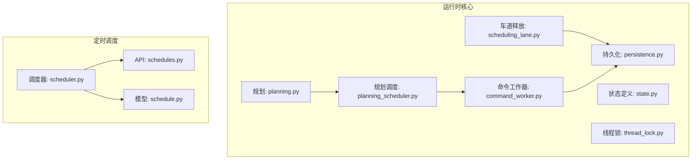
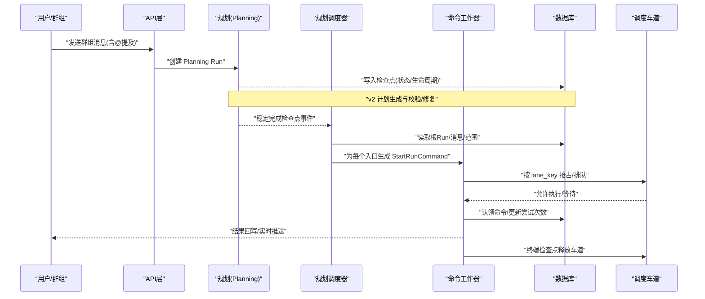
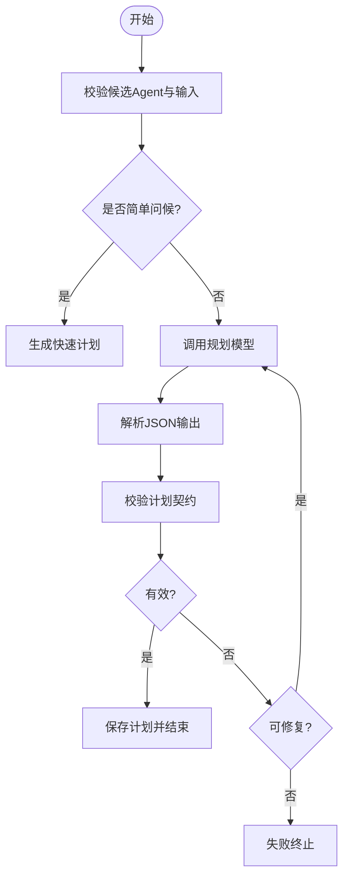
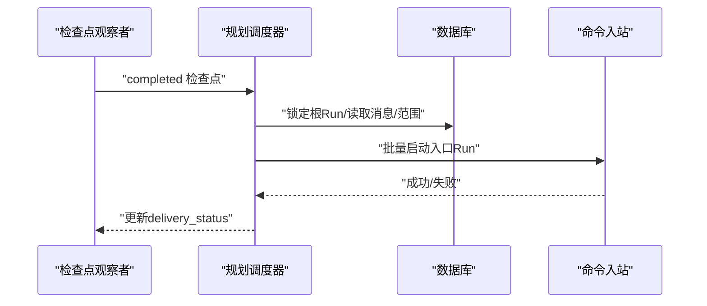
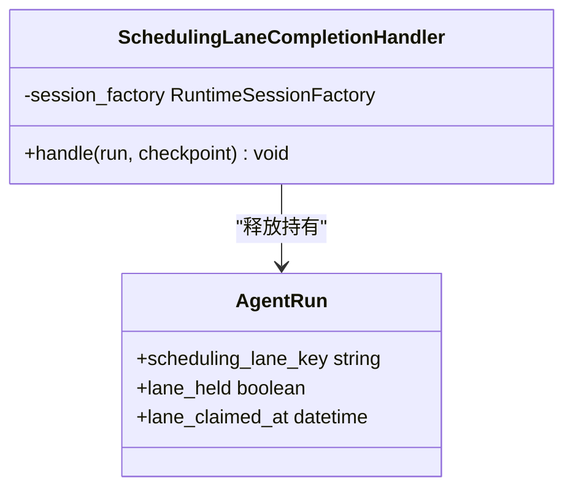
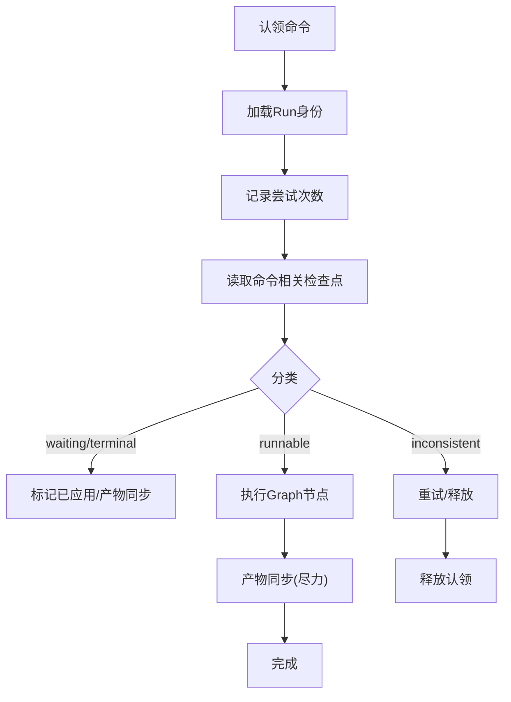
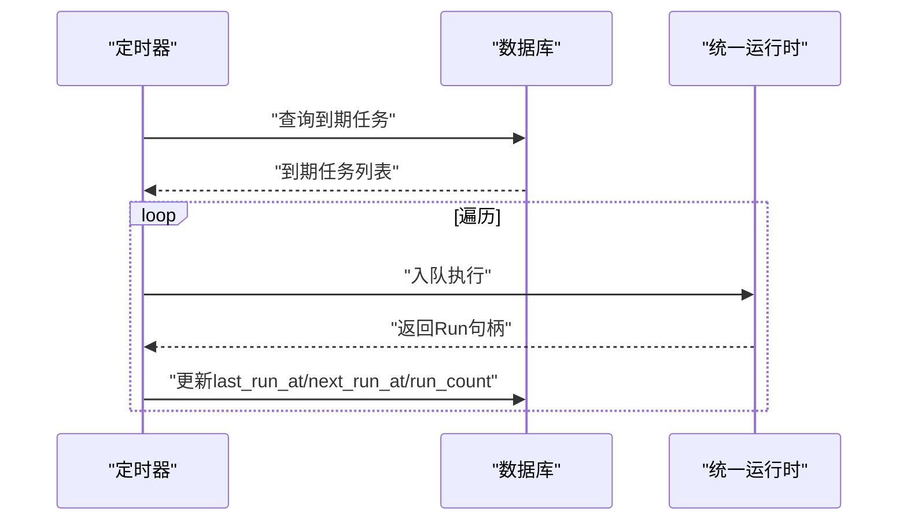
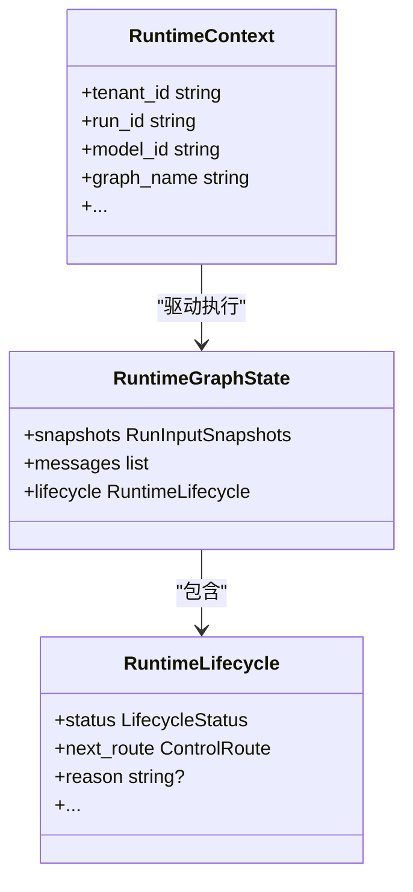
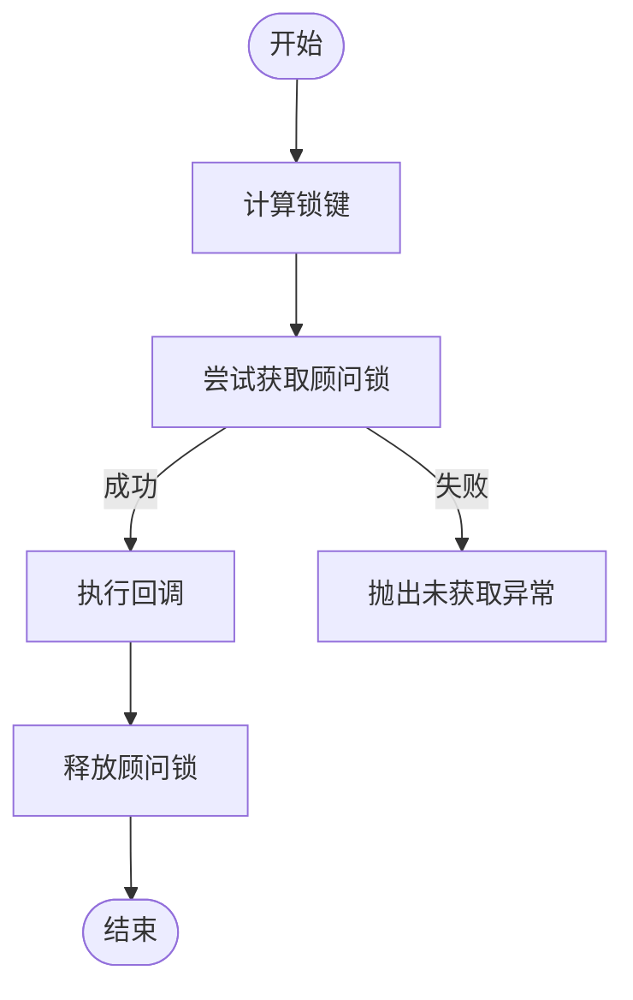
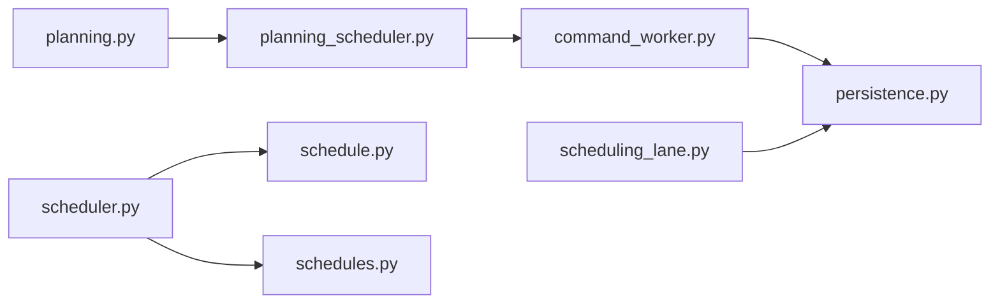

# 规划与调度

<cite>
**本文引用的文件**   
- [planning.py](file://backend/app/services/agent_runtime/planning.py)
- [planning_scheduler.py](file://backend/app/services/agent_runtime/planning_scheduler.py)
- [scheduling_lane.py](file://backend/app/services/agent_runtime/scheduling_lane.py)
- [scheduler.py](file://backend/app/services/scheduler.py)
- [command_worker.py](file://backend/app/services/agent_runtime/command_worker.py)
- [state.py](file://backend/app/services/agent_runtime/state.py)
- [schedule.py](file://backend/app/models/schedule.py)
- [schedules.py](file://backend/app/api/schedules.py)
- [thread_lock.py](file://backend/app/services/agent_runtime/thread_lock.py)
- [persistence.py](file://backend/app/services/agent_runtime/persistence.py)
</cite>

## 目录
1. [简介](#简介)
2. [项目结构](#项目结构)
3. [核心组件](#核心组件)
4. [架构总览](#架构总览)
5. [详细组件分析](#详细组件分析)
6. [依赖关系分析](#依赖关系分析)
7. [性能考量](#性能考量)
8. [故障排查指南](#故障排查指南)
9. [结论](#结论)
10. [附录：配置与调试](#附录配置与调试)

## 简介
本技术文档聚焦于 Clawith 的“规划与调度系统”，围绕智能规划算法、任务分解策略、依赖关系管理，以及调度器设计、时间片分配、优先级管理进行系统化说明。同时阐述“调度车道”概念、资源隔离与冲突解决机制，并给出规划优化策略、动态调整机制、性能监控与排障方法，帮助读者全面理解系统的运行原理与工程实践。

## 项目结构
Clawith 的规划与调度能力主要位于后端服务模块中，关键代码分布在 agent_runtime 子目录下的规划、调度、命令工作器与状态定义等文件中；此外还包含基于 cron 的定时调度模型与 API。

**图表来源** 
- [planning.py](file://backend/app/services/agent_runtime/planning.py)
- [planning_scheduler.py](file://backend/app/services/agent_runtime/planning_scheduler.py)
- [scheduling_lane.py](file://backend/app/services/agent_runtime/scheduling_lane.py)
- [command_worker.py](file://backend/app/services/agent_runtime/command_worker.py)
- [state.py](file://backend/app/services/agent_runtime/state.py)
- [thread_lock.py](file://backend/app/services/agent_runtime/thread_lock.py)
- [persistence.py](file://backend/app/services/agent_runtime/persistence.py)
- [scheduler.py](file://backend/app/services/scheduler.py)
- [schedule.py](file://backend/app/models/schedule.py)
- [schedules.py](file://backend/app/api/schedules.py)

**章节来源**
- [planning.py](file://backend/app/services/agent_runtime/planning.py)
- [planning_scheduler.py](file://backend/app/services/agent_runtime/planning_scheduler.py)
- [scheduling_lane.py](file://backend/app/services/agent_runtime/scheduling_lane.py)
- [scheduler.py](file://backend/app/services/scheduler.py)
- [command_worker.py](file://backend/app/services/agent_runtime/command_worker.py)
- [state.py](file://backend/app/services/agent_runtime/state.py)
- [schedule.py](file://backend/app/models/schedule.py)
- [schedules.py](file://backend/app/api/schedules.py)
- [thread_lock.py](file://backend/app/services/agent_runtime/thread_lock.py)
- [persistence.py](file://backend/app/services/agent_runtime/persistence.py)

## 核心组件
- 智能规划（Planning v2）：以不可变计划契约驱动多 Agent 协作，支持建议模式与强制模式，输出目标、计划提示词与入口步骤，并通过校验与修复循环保证稳定性。
- 规划调度器：在 Planning Run 达到稳定完成检查点后，将计划转换为产品侧的入口 Run，确保身份一致性、消息源一致性与候选参与者有效性。
- 调度车道（Scheduling Lane）：按租户与目标 Agent 维度序列化并发，避免同一会话或同一目标的竞争执行；在终端检查点安全释放。
- 命令工作器（Command Worker）：负责命令认领、重入保护、检查点分类、执行与产物同步，提供幂等与可恢复的执行语义。
- 定时调度器（Cron Scheduler）：每 30 秒扫描到期任务，计算下次触发时间，将任务入队到统一运行时。
- 状态与上下文：统一的运行时状态结构与节点执行接口，支撑图式执行与可恢复性。

**章节来源**
- [planning.py](file://backend/app/services/agent_runtime/planning.py)
- [planning_scheduler.py](file://backend/app/services/agent_runtime/planning_scheduler.py)
- [scheduling_lane.py](file://backend/app/services/agent_runtime/scheduling_lane.py)
- [command_worker.py](file://backend/app/services/agent_runtime/command_worker.py)
- [scheduler.py](file://backend/app/services/scheduler.py)
- [state.py](file://backend/app/services/agent_runtime/state.py)

## 架构总览
下图展示了从用户消息到规划、再到任务分解与执行的端到端流程，包括车道隔离与终端释放。

**图表来源** 
- [planning.py](file://backend/app/services/agent_runtime/planning.py)
- [planning_scheduler.py](file://backend/app/services/agent_runtime/planning_scheduler.py)
- [command_worker.py](file://backend/app/services/agent_runtime/command_worker.py)
- [scheduling_lane.py](file://backend/app/services/agent_runtime/scheduling_lane.py)
- [persistence.py](file://backend/app/services/agent_runtime/persistence.py)

## 详细组件分析

### 智能规划（Planning v2）
- 输入约束：候选 Agent 列表必须至少两个且唯一；支持简单问候场景的快速路径。
- 输出契约：版本固定为 v2，字段包含 version、mode、goal、plan_prompt、entry_steps；entry_steps 限定数量上限与唯一性。
- 修复与重试：当模型输出无效或非法时，记录上次原始输出与错误信息，进入修复上下文再次调用，最多允许若干次修复。
- 角色与路由：通过 system_role 区分规划节点与 Agent 节点，路由到对应执行器。

**图表来源** 
- [planning.py](file://backend/app/services/agent_runtime/planning.py)

**章节来源**
- [planning.py](file://backend/app/services/agent_runtime/planning.py)

### 规划调度器（Planning Checkpoint Scheduler）
- 触发条件：仅对 Planning Run 的稳定完成检查点进行处理。
- 身份与范围校验：验证根 Run、消息、会话、投递目标的一致性，确保候选参与者与权威提及一致。
- 入口命令生成：为每个 entry 生成 StartRunCommand，设置调度车道键、位置信息与交付目标。
- 失败处理：若调度失败，返回确定性失败终端消息，避免无限重试。

**图表来源** 
- [planning_scheduler.py](file://backend/app/services/agent_runtime/planning_scheduler.py)

**章节来源**
- [planning_scheduler.py](file://backend/app/services/agent_runtime/planning_scheduler.py)

### 调度车道（Scheduling Lane）
- 概念：按 tenant_id 与目标 Agent 维度划分串行通道，确保同一会话或同一目标的并发控制。
- 持有与释放：仅在权威终端检查点释放，避免中间状态导致的不一致。
- 冲突解决：通过数据库行级锁与队列顺序保障公平性与幂等性。

**图表来源** 
- [scheduling_lane.py](file://backend/app/services/agent_runtime/scheduling_lane.py)
- [persistence.py](file://backend/app/services/agent_runtime/persistence.py)

**章节来源**
- [scheduling_lane.py](file://backend/app/services/agent_runtime/scheduling_lane.py)
- [persistence.py](file://backend/app/services/agent_runtime/persistence.py)

### 命令工作器（Command Worker）
- 认领与心跳：周期性续租认领，防止长时间占用导致死锁。
- 检查点分类：根据状态、next_nodes、tasks、interrupts 判定 runnable/waiting/terminal/inconsistent。
- 执行与产物同步：在 Graph 边界内执行，成功后尽力同步产物，失败则持久化拒绝码与消息。
- 取消与幂等：对未开始的 start 命令支持取消，保证幂等与可恢复。

**图表来源** 
- [command_worker.py](file://backend/app/services/agent_runtime/command_worker.py)

**章节来源**
- [command_worker.py](file://backend/app/services/agent_runtime/command_worker.py)

### 定时调度器（Cron Scheduler）
- 周期扫描：每 30 秒扫描 next_run_at <= now 的启用任务。
- 计算下次触发：使用 croniter 计算下一次触发时间。
- 入队执行：调用统一运行时入队，记录审计日志与运行计数。

**图表来源** 
- [scheduler.py](file://backend/app/services/scheduler.py)
- [schedule.py](file://backend/app/models/schedule.py)
- [schedules.py](file://backend/app/api/schedules.py)

**章节来源**
- [scheduler.py](file://backend/app/services/scheduler.py)
- [schedule.py](file://backend/app/models/schedule.py)
- [schedules.py](file://backend/app/api/schedules.py)

### 状态与上下文（Runtime State & Context）
- 状态结构：包含 snapshots、messages、lifecycle 等，支持 reducer 消息历史与可恢复执行。
- 节点执行接口：统一 execute(node, state, context) 协议，便于扩展不同节点逻辑。
- 上下文传递：每次调用携带租户、运行身份、模型、图标识等元数据，不持久化。

**图表来源** 
- [state.py](file://backend/app/services/agent_runtime/state.py)

**章节来源**
- [state.py](file://backend/app/services/agent_runtime/state.py)

### 线程锁（Thread Lock）
- 目的：为单个 Agent Runtime 线程提供 PostgreSQL 会话级顾问锁，确保同一线程的并发访问互斥。
- 实现：通过 blake2b 生成稳定锁键，使用 pg_try_advisory_lock/pg_advisory_unlock 获取与释放。
- 异常：无法获取或释放时抛出明确异常，便于上层处理。

**图表来源** 
- [thread_lock.py](file://backend/app/services/agent_runtime/thread_lock.py)

**章节来源**
- [thread_lock.py](file://backend/app/services/agent_runtime/thread_lock.py)

## 依赖关系分析
- 规划与调度：planning.py 产出 v2 计划，planning_scheduler.py 将其转化为产品侧入口 Run，两者通过检查点事件耦合。
- 命令与工作器：command_worker.py 依赖 persistence.py 进行命令认领、尝试计数与产物同步。
- 车道与持久化：scheduling_lane.py 在终端检查点释放 lane_held，依赖 AgentRun 表状态。
- 定时调度：scheduler.py 依赖 schedule.py 模型与 schedules.py API，统一入队到运行时。

**图表来源** 
- [planning.py](file://backend/app/services/agent_runtime/planning.py)
- [planning_scheduler.py](file://backend/app/services/agent_runtime/planning_scheduler.py)
- [command_worker.py](file://backend/app/services/agent_runtime/command_worker.py)
- [scheduling_lane.py](file://backend/app/services/agent_runtime/scheduling_lane.py)
- [scheduler.py](file://backend/app/services/scheduler.py)
- [schedule.py](file://backend/app/models/schedule.py)
- [schedules.py](file://backend/app/api/schedules.py)
- [persistence.py](file://backend/app/services/agent_runtime/persistence.py)

**章节来源**
- [planning.py](file://backend/app/services/agent_runtime/planning.py)
- [planning_scheduler.py](file://backend/app/services/agent_runtime/planning_scheduler.py)
- [command_worker.py](file://backend/app/services/agent_runtime/command_worker.py)
- [scheduling_lane.py](file://backend/app/services/agent_runtime/scheduling_lane.py)
- [scheduler.py](file://backend/app/services/scheduler.py)
- [schedule.py](file://backend/app/models/schedule.py)
- [schedules.py](file://backend/app/api/schedules.py)
- [persistence.py](file://backend/app/services/agent_runtime/persistence.py)

## 性能考量
- 规划修复上限：限制最大修复次数，避免模型反复失败导致的资源浪费。
- 车道序列化：通过 lane_key 减少热点竞争，提升吞吐与一致性。
- 检查点分类：快速识别 waiting/terminal 状态，避免不必要的执行。
- 定时扫描间隔：30 秒轮询平衡延迟与负载。
- 顾问锁粒度：会话级锁降低跨进程冲突成本。

[本节为通用指导，无需特定文件引用]

## 故障排查指南
- 规划失败：检查模型能力、输入候选列表、JSON 输出合法性与修复上下文。
- 调度失败：核对根 Run 身份、消息内容、提及快照与候选参与者一致性。
- 车道冲突：确认 lane_held 状态与终端检查点释放逻辑。
- 命令认领失败：查看尝试次数、认领 TTL、心跳续租与数据库锁。
- 定时任务未触发：验证 cron 表达式、next_run_at 计算与运行时启用状态。

**章节来源**
- [planning.py](file://backend/app/services/agent_runtime/planning.py)
- [planning_scheduler.py](file://backend/app/services/agent_runtime/planning_scheduler.py)
- [scheduling_lane.py](file://backend/app/services/agent_runtime/scheduling_lane.py)
- [command_worker.py](file://backend/app/services/agent_runtime/command_worker.py)
- [scheduler.py](file://backend/app/services/scheduler.py)

## 结论
Clawith 的规划与调度系统以不可变的 v2 计划为核心，结合稳定的检查点与命令工作器，实现了高可靠、可恢复的多 Agent 协作。调度车道与顾问锁提供了细粒度的资源隔离与冲突解决，定时调度器则补充了周期性任务的自动化能力。整体架构清晰、职责分离，具备良好的扩展性与可观测性。

[本节为总结性内容，无需特定文件引用]

## 附录：配置与调试
- 规划模型选择：通过租户或平台模型 ID 绑定规划模型，确保能力满足输入预算。
- 计划模式：advisory（建议）与 enforced（强制），依据人类显式约束决定。
- 车道键命名：group_mention:{tenant_id}:{agent_id}，用于会话与目标隔离。
- 定时任务配置：cron 表达式、启用状态、指令文本；可通过 API 创建、更新、删除与手动触发。
- 调试工具：活动日志、审计日志、运行时状态读取与 WebSocket 事件流，辅助定位问题。

**章节来源**
- [planning.py](file://backend/app/services/agent_runtime/planning.py)
- [planning_scheduler.py](file://backend/app/services/agent_runtime/planning_scheduler.py)
- [schedules.py](file://backend/app/api/schedules.py)
- [scheduler.py](file://backend/app/services/scheduler.py)