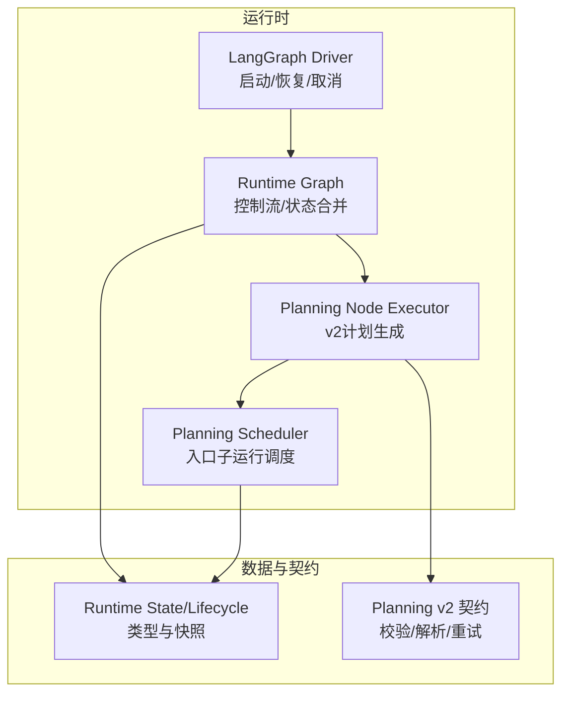
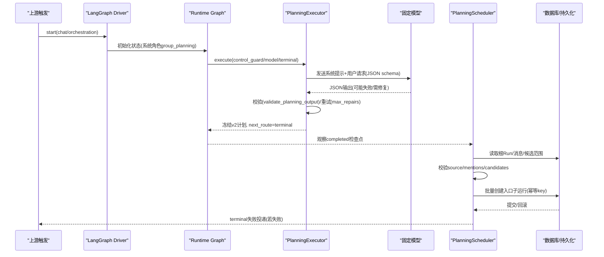
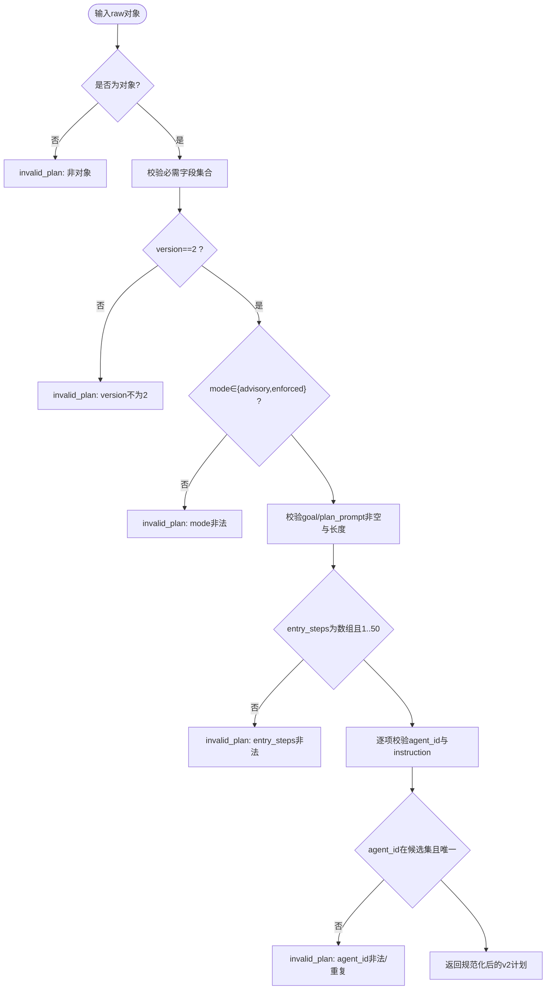
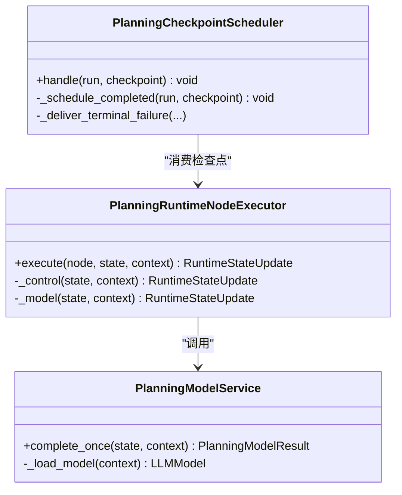
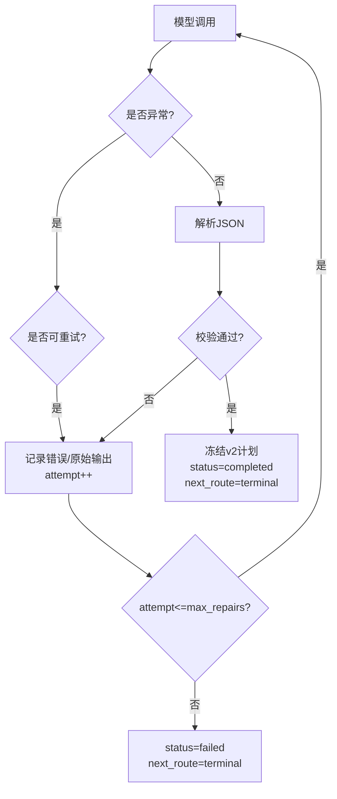
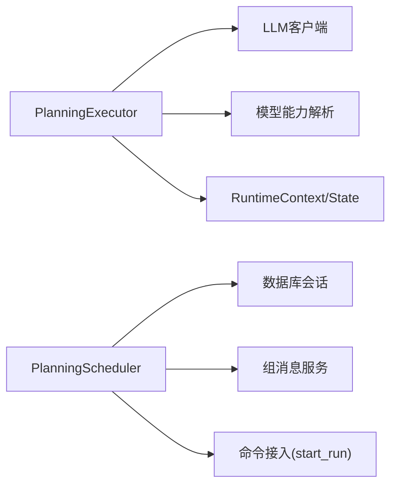

# 规划算法

<cite>
**本文引用的文件**   
- [planning.py](file://backend/app/services/agent_runtime/planning.py)
- [planning_scheduler.py](file://backend/app/services/agent_runtime/planning_scheduler.py)
- [state.py](file://backend/app/services/agent_runtime/state.py)
- [graph.py](file://backend/app/services/agent_runtime/graph.py)
- [langgraph_driver.py](file://backend/app/services/agent_runtime/langgraph_driver.py)
- [test_agent_runtime_planning.py](file://backend/tests/test_agent_runtime_planning.py)
- [test_agent_runtime_planning_scheduler.py](file://backend/tests/test_agent_runtime_planning_scheduler.py)
</cite>

## 目录
1. [简介](#简介)
2. [项目结构](#项目结构)
3. [核心组件](#核心组件)
4. [架构总览](#架构总览)
5. [详细组件分析](#详细组件分析)
6. [依赖关系分析](#依赖关系分析)
7. [性能考量](#性能考量)
8. [故障排查指南](#故障排查指南)
9. [结论](#结论)
10. [附录：使用示例与最佳实践](#附录使用示例与最佳实践)

## 简介
本技术文档聚焦于Clawith的“规划算法模块”，围绕Planning v2模型契约、智能规划算法实现、任务分解策略展开，详细说明候选Agent选择机制、指令解析逻辑、依赖关系管理、简单问候检测、并行执行优化、约束验证、规划模式（advisory/enforced）、版本控制、错误处理机制，以及规划输出验证、JSON格式解析、重试策略的实现细节与使用示例。该模块通过LangGraph驱动的运行时图，将多Agent协作的“计划生成”与“入口调度”解耦为两个阶段：先由规划节点产出不可变v2计划，再由调度器基于稳定检查点创建子运行并进入公共组消息协作流程。

## 项目结构
规划相关代码位于后端服务层的agent_runtime子系统中，核心文件包括：
- planning.py：定义Planning v2契约、校验器、LLM调用封装、规划节点执行器与路由。
- planning_scheduler.py：基于已完成的规划检查点，生成入口子运行的调度器。
- state.py：运行时状态、生命周期、上下文等类型定义。
- graph.py：运行时图的通用控制流、重试策略与状态合并。
- langgraph_driver.py：驱动LangGraph线程、初始状态构建与命令分发。
- 测试文件：覆盖契约校验、重试、幂等性、失败回滚等关键路径。

图表来源
- [langgraph_driver.py:426-458](file://backend/app/services/agent_runtime/langgraph_driver.py#L426-L458)
- [graph.py:159-190](file://backend/app/services/agent_runtime/graph.py#L159-L190)
- [planning.py:530-647](file://backend/app/services/agent_runtime/planning.py#L530-L647)
- [planning_scheduler.py:363-549](file://backend/app/services/agent_runtime/planning_scheduler.py#L363-L549)
- [state.py:100-144](file://backend/app/services/agent_runtime/state.py#L100-L144)

章节来源
- [planning.py:1-688](file://backend/app/services/agent_runtime/planning.py#L1-L688)
- [planning_scheduler.py:1-549](file://backend/app/services/agent_runtime/planning_scheduler.py#L1-L549)
- [state.py:1-200](file://backend/app/services/agent_runtime/state.py#L1-L200)
- [graph.py:50-93](file://backend/app/services/agent_runtime/graph.py#L50-L93)
- [langgraph_driver.py:426-458](file://backend/app/services/agent_runtime/langgraph_driver.py#L426-L458)

## 核心组件
- PlanningModelService：调用被固定的Group租户或平台模型，无工具调用能力，负责构造系统提示与用户请求、解析JSON输出、调用校验器。
- PlanningRuntimeNodeExecutor：规划节点的执行器，维护尝试次数、支持可重试修复、在成功时冻结v2计划并终止规划Run。
- RuntimeNodeExecutorRouter：根据system_role选择规划或Agent执行器。
- PlanningCheckpointScheduler：对已完成且稳定的规划检查点进行再验证，解析entry_steps，按候选范围创建入口子运行，保证幂等与事务一致性。
- 校验与解析：validate_planning_output、_parse_json_output、checkpoint_plan确保v2契约、字段唯一性、候选范围与长度限制。
- 简单问候检测：_simple_check_in_plan快速返回确定性并行回复计划，避免不必要的LLM调用。

章节来源
- [planning.py:374-508](file://backend/app/services/agent_runtime/planning.py#L374-L508)
- [planning.py:530-647](file://backend/app/services/agent_runtime/planning.py#L530-L647)
- [planning.py:273-354](file://backend/app/services/agent_runtime/planning.py#L273-L354)
- [planning.py:208-271](file://backend/app/services/agent_runtime/planning.py#L208-L271)
- [planning_scheduler.py:363-549](file://backend/app/services/agent_runtime/planning_scheduler.py#L363-L549)

## 架构总览
规划算法采用“两阶段”设计：
- 阶段一：规划节点生成不可变的Planning v2计划，包含version=2、mode、goal、plan_prompt、entry_steps（仅入口步骤）。
- 阶段二：调度器基于稳定检查点，校验源消息、候选范围与目标可用性，批量创建入口子运行，进入公共组消息协作。

图表来源
- [langgraph_driver.py:426-458](file://backend/app/services/agent_runtime/langgraph_driver.py#L426-L458)
- [planning.py:530-647](file://backend/app/services/agent_runtime/planning.py#L530-L647)
- [planning_scheduler.py:441-549](file://backend/app/services/agent_runtime/planning_scheduler.py#L441-L549)

## 详细组件分析

### Planning v2模型契约与校验
- 字段要求：version必须为2；mode仅限advisory或enforced；goal与plan_prompt为非空字符串且有长度上限；entry_steps为数组，每项含agent_id与instruction，agent_id必须在候选集合中且唯一。
- 长度与数量限制：goal最大10000字符，plan_prompt最大40000字符，entry_steps最多50项。
- 候选范围校验：entry_steps中的agent_id必须来自initial_input.candidate_agents，且至少有两个不同候选。
- 未知字段拒绝：严格白名单校验，禁止额外字段。
- 版本控制：仅接受version=2，拒绝legacy v1或其他版本。

图表来源
- [planning.py:273-354](file://backend/app/services/agent_runtime/planning.py#L273-L354)

章节来源
- [planning.py:273-354](file://backend/app/services/agent_runtime/planning.py#L273-L354)
- [planning.py:175-206](file://backend/app/services/agent_runtime/planning.py#L175-L206)
- [planning.py:357-372](file://backend/app/services/agent_runtime/planning.py#L357-L372)

### 候选Agent选择机制与指令解析
- 候选来源：initial_input.candidate_agents，每个元素需包含agent_id与name等字段，至少两个不同候选。
- 指令绑定规则：@提及顺序决定责任绑定；若无显式说明，按提及顺序分配工作；模糊语义最小字面解释，不跨Agent转移职责。
- 简单问候检测：当去除@提及与标点后的归一化文本属于预设问候集合，直接生成并行回复计划，不调用LLM。
- 指令解析：将用户目标重写为清晰指令，明确每个Agent的动作、输入、公开输出与依赖，仅从这些指令构建goal与plan_prompt。

图表来源
- [planning.py:374-508](file://backend/app/services/agent_runtime/planning.py#L374-L508)
- [planning.py:530-647](file://backend/app/services/agent_runtime/planning.py#L530-L647)
- [planning_scheduler.py:363-549](file://backend/app/services/agent_runtime/planning_scheduler.py#L363-L549)

章节来源
- [planning.py:175-206](file://backend/app/services/agent_runtime/planning.py#L175-L206)
- [planning.py:208-271](file://backend/app/services/agent_runtime/planning.py#L208-L271)
- [planning.py:69-96](file://backend/app/services/agent_runtime/planning.py#L69-L96)

### 依赖关系管理与协作模式
- 依赖声明：v2计划不暴露steps/depends_on_step_ids等依赖字段，依赖通过公共组消息的公开交接推进。
- 协作约束：禁止自交接；每个被分配的Agent必须自行撰写公开组回复；禁止通过私有A2A路由计划中的组转换；禁止等待私有结果。
- 顺序过渡：plan_prompt与入口指令必须明确下一个要唤醒的不同Agent、传递的具体结果与该Agent的回复内容。

章节来源
- [planning.py:69-96](file://backend/app/services/agent_runtime/planning.py#L69-L96)
- [planning.py:273-354](file://backend/app/services/agent_runtime/planning.py#L273-L354)

### 简单问候检测与并行执行优化
- 快速路径：匹配预设问候集合，直接生成每个被提及Agent的并行简短回复计划，跳过LLM调用，显著降低延迟。
- 并行入口：entry_steps可为多个Agent同时启动，无需描述DAG或后续步骤。

章节来源
- [planning.py:208-271](file://backend/app/services/agent_runtime/planning.py#L208-L271)
- [planning.py:69-96](file://backend/app/services/agent_runtime/planning.py#L69-L96)

### 规划模式（advisory/enforced）与版本控制
- advisory：默认模式，适用于一般协作场景。
- enforced：当人类显式指定工作流约束（如Agent分配、顺序、轮次、依赖、分支、完成条件）时使用。
- 版本控制：仅接受version=2，拒绝旧版或不兼容结构。

章节来源
- [planning.py:38-42](file://backend/app/services/agent_runtime/planning.py#L38-L42)
- [planning.py:273-354](file://backend/app/services/agent_runtime/planning.py#L273-L354)

### 错误处理机制与重试策略
- 规划失败分类：
  - invalid_plan：JSON无效、字段缺失/多余、长度超限、agent_id不在候选集、重复等。
  - planning_model_call_failed：模型调用异常，标记retryable=true。
  - planning_model_unavailable / capability_invalid：固定模型不可用或能力不足。
- 重试策略：
  - 规划节点支持max_repairs次修复（默认2），每次失败记录last_error与last_raw_output，并在attempt<=max_repairs时重新进入model节点。
  - 超过阈值后，状态置failed，next_route=terminal，携带error.code与message。
- 调度失败：
  - 若入口目标不可用或校验失败，抛出PlanningSchedulingError，投递terminal失败消息，保持幂等与事务回滚。

图表来源
- [planning.py:573-626](file://backend/app/services/agent_runtime/planning.py#L573-L626)
- [planning.py:422-508](file://backend/app/services/agent_runtime/planning.py#L422-L508)

章节来源
- [planning.py:422-508](file://backend/app/services/agent_runtime/planning.py#L422-L508)
- [planning.py:573-626](file://backend/app/services/agent_runtime/planning.py#L573-L626)
- [planning_scheduler.py:394-440](file://backend/app/services/agent_runtime/planning_scheduler.py#L394-L440)

### 规划输出验证、JSON格式解析与幂等性
- JSON解析：支持Markdown包裹的JSON块，自动剥离前后标记；解析失败抛出invalid_plan。
- 输出验证：严格字段白名单、长度限制、候选范围与唯一性校验。
- 幂等性：调度器使用source_execution_id与idempotency_key确保重复处理不产生重复子运行。

章节来源
- [planning.py:357-372](file://backend/app/services/agent_runtime/planning.py#L357-L372)
- [planning.py:273-354](file://backend/app/services/agent_runtime/planning.py#L273-L354)
- [planning_scheduler.py:294-361](file://backend/app/services/agent_runtime/planning_scheduler.py#L294-L361)

### 运行时状态与生命周期
- RuntimeGraphState：包含snapshots、messages、lifecycle等，支持消息归约与历史迁移。
- RuntimeLifecycle：权威的状态机，包含status、next_route、reason、error、planning、planning_attempt_count等。
- 控制路由：control_guard、compact、model、tool、verify、wait、terminal，受图层约束。

章节来源
- [state.py:100-144](file://backend/app/services/agent_runtime/state.py#L100-L144)
- [graph.py:159-190](file://backend/app/services/agent_runtime/graph.py#L159-L190)

## 依赖关系分析
- 规划节点依赖：
  - LLM客户端：complete_llm_once，无工具调用。
  - 模型能力解析：ModelCapabilityResolver，确保输入预算安全。
  - 运行时上下文：RuntimeContext提供tenant_id、run_id、model_id等。
- 调度器依赖：
  - 数据库会话：读取根Run、消息、候选范围与目标可用性。
  - 组消息服务：_load_sender_scope、_resolve_mentions。
  - 命令接入：RuntimeCommandIntake.start_run创建子运行。

图表来源
- [planning.py:374-508](file://backend/app/services/agent_runtime/planning.py#L374-L508)
- [planning_scheduler.py:441-549](file://backend/app/services/agent_runtime/planning_scheduler.py#L441-L549)

章节来源
- [planning.py:374-508](file://backend/app/services/agent_runtime/planning.py#L374-L508)
- [planning_scheduler.py:441-549](file://backend/app/services/agent_runtime/planning_scheduler.py#L441-L549)

## 性能考量
- 简单问候快速路径：避免LLM调用，降低延迟与成本。
- 并行入口：entry_steps允许多个Agent同时启动，提升吞吐。
- 重试与修复：有限次修复避免无限循环，失败快速收敛。
- 幂等调度：避免重复创建子运行，减少冗余负载。
- 状态合并与迁移：图层清理旧字段，减少序列化开销。

[本节为通用指导，不直接分析具体文件]

## 故障排查指南
- 常见错误码：
  - invalid_plan：JSON结构或字段校验失败。
  - planning_model_call_failed：模型调用异常，可重试。
  - planning_model_unavailable / capability_invalid：固定模型不可用或能力不足。
  - planning_entry_unavailable：入口目标不可用或校验失败。
  - planning_source_invalid：触发消息或候选人不一致。
- 排查步骤：
  - 检查initial_input.candidate_agents是否满足至少两个不同候选。
  - 确认entry_steps中的agent_id均在候选集中且唯一。
  - 查看last_error与last_raw_output定位模型输出问题。
  - 验证source与mentions是否与根Run一致。
  - 检查调度幂等键是否重复导致未创建新运行。

章节来源
- [planning.py:422-508](file://backend/app/services/agent_runtime/planning.py#L422-L508)
- [planning_scheduler.py:394-440](file://backend/app/services/agent_runtime/planning_scheduler.py#L394-L440)
- [planning_scheduler.py:229-259](file://backend/app/services/agent_runtime/planning_scheduler.py#L229-L259)

## 结论
Clawith的规划算法模块以Planning v2契约为核心，结合严格的校验与有限重试，确保在多Agent协作中生成稳定、可执行的入口计划。通过简单问候快速路径与并行入口优化，显著提升响应速度与吞吐。调度器基于稳定检查点，保证幂等性与事务一致性，失败时及时投递终端错误。整体设计兼顾可靠性、可扩展性与可观测性，适合复杂的多Agent编排场景。

[本节为总结，不直接分析具体文件]

## 附录：使用示例与最佳实践
- 输入准备：
  - initial_input.candidate_agents至少包含两个不同候选，每个候选需提供agent_id与name。
  - goal应清晰表达用户需求，便于模型重写为明确指令。
- 规划模式选择：
  - 一般协作使用advisory；显式约束工作流时使用enforced。
- 重试与修复：
  - 合理设置max_repairs，避免过多修复导致延迟。
  - 关注last_error与last_raw_output，定位模型输出问题。
- 幂等性保障：
  - 使用source_execution_id与idempotency_key确保重复处理不产生重复运行。
- 故障排查：
  - 检查候选范围、字段合法性、长度限制与唯一性。
  - 验证source与mentions一致性，确保目标可用。

章节来源
- [planning.py:175-206](file://backend/app/services/agent_runtime/planning.py#L175-L206)
- [planning.py:273-354](file://backend/app/services/agent_runtime/planning.py#L273-L354)
- [planning_scheduler.py:294-361](file://backend/app/services/agent_runtime/planning_scheduler.py#L294-L361)
- [test_agent_runtime_planning.py:158-224](file://backend/tests/test_agent_runtime_planning.py#L158-L224)
- [test_agent_runtime_planning_scheduler.py:315-373](file://backend/tests/test_agent_runtime_planning_scheduler.py#L315-L373)