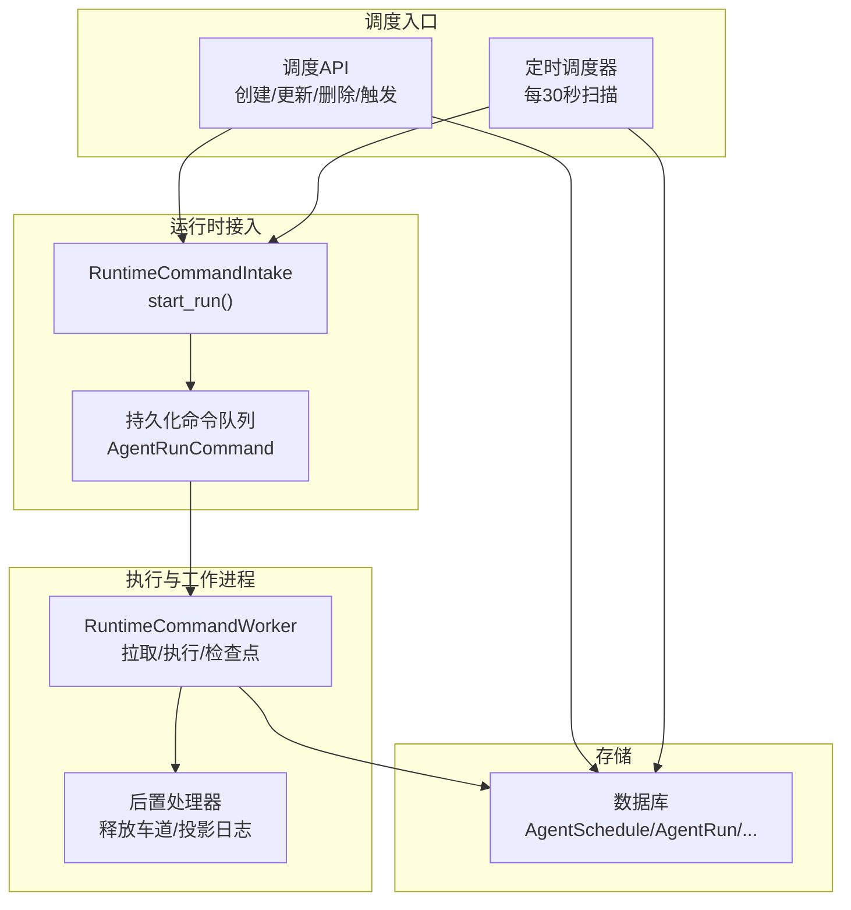
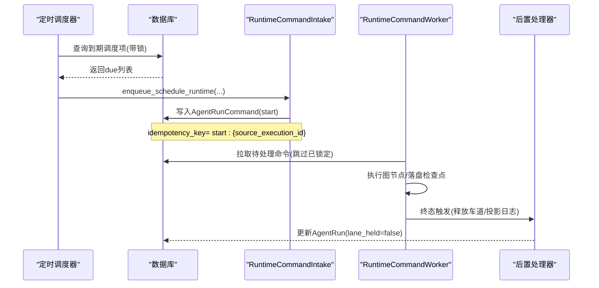
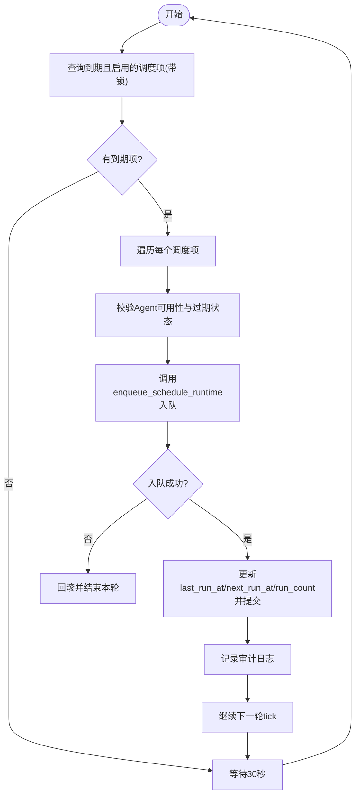
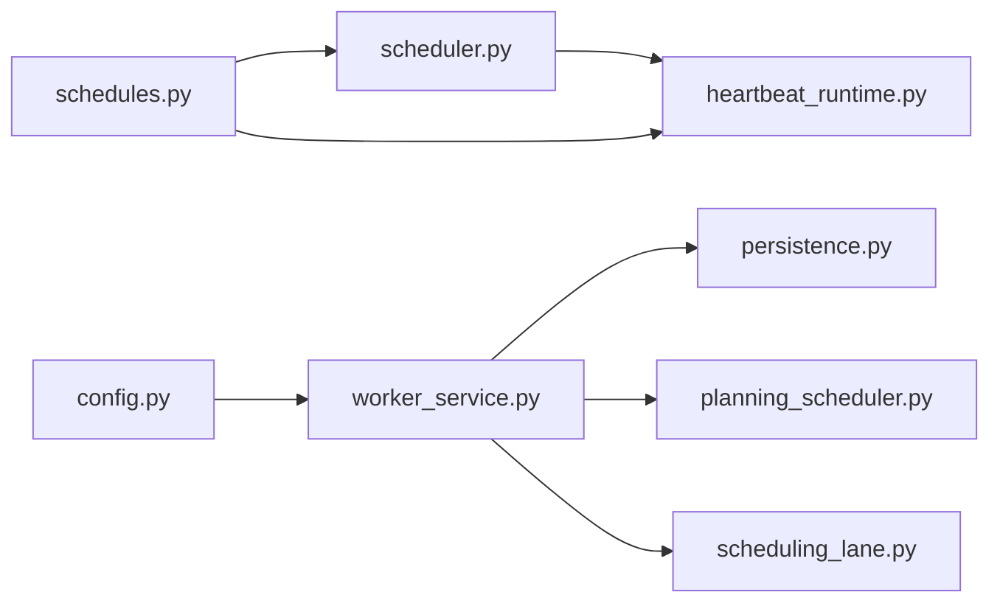

# 调度引擎

<cite>
**本文引用的文件**   
- [scheduler.py](file://backend/app/services/scheduler.py)
- [schedules.py](file://backend/app/api/schedules.py)
- [schedule.py](file://backend/app/models/schedule.py)
- [heartbeat_runtime.py](file://backend/app/services/heartbeat_runtime.py)
- [planning_scheduler.py](file://backend/app/services/agent_runtime/planning_scheduler.py)
- [scheduling_lane.py](file://backend/app/services/agent_runtime/scheduling_lane.py)
- [worker_service.py](file://backend/app/services/agent_runtime/worker_service.py)
- [persistence.py](file://backend/app/services/agent_runtime/persistence.py)
- [config.py](file://backend/app/config.py)
- [test_schedule_scheduler.py](file://backend/tests/test_schedule_scheduler.py)
- [test_agent_runtime_group_scheduling.py](file://backend/tests/test_agent_runtime_group_scheduling.py)
</cite>

## 目录
1. [简介](#简介)
2. [项目结构](#项目结构)
3. [核心组件](#核心组件)
4. [架构总览](#架构总览)
5. [详细组件分析](#详细组件分析)
6. [依赖关系分析](#依赖关系分析)
7. [性能考量](#性能考量)
8. [故障排查指南](#故障排查指南)
9. [结论](#结论)
10. [附录](#附录)

## 简介
本技术文档面向Clawith的调度引擎，系统性阐述其调度器架构、时间片分配与优先级机制、任务队列管理、资源隔离策略、冲突解决算法、调度状态机、执行监控与性能优化。同时提供调度配置参数说明、调试工具使用建议、故障恢复机制，以及调度策略定制、负载均衡与扩展点开发的实践指南。

## 项目结构
调度相关代码主要分布在后端服务中：
- 定时调度器：轻量级 asyncio 后台任务，周期性扫描到期调度项并投递到统一运行时。
- 调度API：提供CRUD与手动触发能力，校验Cron表达式并计算下次运行时间。
- 模型层：AgentSchedule定义调度元数据（名称、指令、Cron、启用状态、最近/下次运行时间、计数等）。
- 运行时接入：心跳/计划/一次性任务统一通过RuntimeCommandIntake进入持久化命令队列。
- 工作进程：LangGraph驱动的工作者从命令队列拉取任务，执行图节点，落盘检查点，并在终态触发副作用处理器（如释放调度车道、投影活动日志等）。

图表来源
- [schedules.py:1-247](file://backend/app/api/schedules.py#L1-L247)
- [scheduler.py:1-125](file://backend/app/services/scheduler.py#L1-L125)
- [heartbeat_runtime.py:1-200](file://backend/app/services/heartbeat_runtime.py#L1-L200)
- [worker_service.py:267-331](file://backend/app/services/agent_runtime/worker_service.py#L267-L331)
- [persistence.py:586-973](file://backend/app/services/agent_runtime/persistence.py#L586-L973)

章节来源
- [scheduler.py:1-125](file://backend/app/services/scheduler.py#L1-L125)
- [schedules.py:1-247](file://backend/app/api/schedules.py#L1-L247)
- [schedule.py:1-31](file://backend/app/models/schedule.py#L1-L31)

## 核心组件
- 定时调度器（scheduler）：每30秒扫描next_run_at<=now且启用的调度项，锁定行避免重复消费，校验Agent可用性后入队；失败时回滚并记录审计日志。
- 调度API（schedules）：提供CRUD接口，创建/更新时校验Cron并计算next_run_at；支持手动触发，返回run_id。
- 运行时接入（heartbeat_runtime）：统一将调度/心跳/一次性任务转换为StartRunCommand，设置source_type、idempotency_key、payload等，交由RuntimeCommandIntake持久化。
- 工作进程（worker_service）：构建LangGraph驱动的执行器，注册后置处理器（PlanningCheckpointScheduler、SchedulingLaneCompletionHandler等），在检查点或终态触发副作用。
- 持久化与并发控制（persistence）：基于with_for_update(skip_locked=True)和lane_held字段实现“按租户+会话”的串行化调度车道，避免同一会话内并发启动。

章节来源
- [scheduler.py:1-125](file://backend/app/services/scheduler.py#L1-L125)
- [schedules.py:1-247](file://backend/app/api/schedules.py#L1-L247)
- [heartbeat_runtime.py:1-200](file://backend/app/services/heartbeat_runtime.py#L1-L200)
- [worker_service.py:267-331](file://backend/app/services/agent_runtime/worker_service.py#L267-L331)
- [persistence.py:586-973](file://backend/app/services/agent_runtime/persistence.py#L586-L973)

## 架构总览
调度引擎采用“轻量调度器 + 统一运行时 + 持久化命令队列 + 工作者”的分层架构：
- 调度器负责发现到期任务并生成稳定的occurrence标识，确保幂等。
- 运行时接入层将不同来源的任务标准化为统一的StartRunCommand。
- 持久化层保证高可用与可恢复性，结合数据库锁实现无锁竞争下的公平排队。
- 工作者执行图节点，落盘检查点，并在终态触发副作用（如释放调度车道、投影活动日志、触发下游事件）。

图表来源
- [scheduler.py:27-116](file://backend/app/services/scheduler.py#L27-L116)
- [heartbeat_runtime.py:81-130](file://backend/app/services/heartbeat_runtime.py#L81-L130)
- [persistence.py:586-632](file://backend/app/services/agent_runtime/persistence.py#L586-L632)
- [worker_service.py:299-313](file://backend/app/services/agent_runtime/worker_service.py#L299-L313)

## 详细组件分析

### 定时调度器（scheduler）
- 时间片分配算法：基于croniter解析Cron表达式，计算next_run_at；每次tick仅处理因期的调度项。
- 优先级机制：未显式实现多优先级队列，按next_run_at顺序被扫描；可通过Cron表达式控制频率。
- 冲突解决：使用with_for_update(skip_locked=True)对到期行加排他锁，避免多实例重复消费。
- 执行监控：记录schedule_tick/schedule_fire/schedule_error审计日志。
- 错误处理：若运行时不可用则回滚事务并终止本轮tick，防止脏推进。

图表来源
- [scheduler.py:27-116](file://backend/app/services/scheduler.py#L27-L116)

章节来源
- [scheduler.py:1-125](file://backend/app/services/scheduler.py#L1-L125)
- [test_schedule_scheduler.py:1-146](file://backend/tests/test_schedule_scheduler.py#L1-L146)

### 调度API（schedules）
- CRUD：创建时校验Cron并计算next_run_at；更新时根据是否启用重新计算；删除直接移除。
- 手动触发：POST /{schedule_id}/run，调用enqueue_schedule_runtime并返回run_id；若运行时未启用返回503。
- 权限控制：仅创建者可管理；过期Agent禁止触发。

章节来源
- [schedules.py:1-247](file://backend/app/api/schedules.py#L1-L247)
- [schedule.py:1-31](file://backend/app/models/schedule.py#L1-L31)

### 运行时接入（heartbeat_runtime）
- 统一入队：将调度/心跳/一次性任务转为StartRunCommand，设置source_type、run_kind、model_id、delivery_status、idempotency_key、payload等。
- 稳定性：occurrence_id由schedule_id与时间戳派生，保证幂等；source_execution_id用于去重。
- 决策：decide_runtime_v2决定走v2路径，否则返回None表示不启用。

章节来源
- [heartbeat_runtime.py:1-200](file://backend/app/services/heartbeat_runtime.py#L1-L200)

### 规划调度器（planning_scheduler）
- 作用：在Planning v2检查点完成后，依据checkpoint_plan中的entry_steps，为每个候选Agent生成StartRunCommand，进入组内调度车道。
- 身份校验：严格校验根Run、消息、发送者范围、提及目标的一致性，防止错配。
- 失败处理：遇到不可恢复的错误，投递terminal消息并标记failed，避免无限重试。

章节来源
- [planning_scheduler.py:1-549](file://backend/app/services/agent_runtime/planning_scheduler.py#L1-L549)

### 调度车道（scheduling_lane）
- 目的：针对同一会话内的并发启动进行串行化，避免重复执行。
- 机制：AgentRun.scheduling_lane_key唯一标识一个会话的串行通道；lane_held=true表示占用；终态检查点触发释放。
- 修复：release_rejected_start_lanes清理旧版本遗留的车道占用。

章节来源
- [scheduling_lane.py:1-71](file://backend/app/services/agent_runtime/scheduling_lane.py#L1-L71)
- [persistence.py:599-632](file://backend/app/services/agent_runtime/persistence.py#L599-L632)
- [test_agent_runtime_group_scheduling.py:1-191](file://backend/tests/test_agent_runtime_group_scheduling.py#L1-L191)

### 工作进程与后置处理器（worker_service）
- 构建：组装LangGraph驱动、节点执行器、快照工厂、上下文压缩扫描器等。
- 后置处理器：注册PlanningCheckpointScheduler、SessionContextCompletionHandler、TaskRuntimeCompletionHandler、TriggerRuntimeCompletionHandler、HeartbeatRuntimeCompletionHandler、OnboardingRuntimeCompletionHandler、A2ARuntimeCompletionHandler、SchedulingLaneCompletionHandler等。
- 职责：在检查点或终态触发对应副作用，保证一致性。

章节来源
- [worker_service.py:267-331](file://backend/app/services/agent_runtime/worker_service.py#L267-L331)

## 依赖关系分析
- 调度器依赖数据库模型AgentSchedule与运行时接入模块enqueue_schedule_runtime。
- 调度API依赖compute_next_run与enqueue_schedule_runtime。
- 工作进程依赖持久化层（命令拉取、车道锁定）、检查点读取与执行器、后置处理器。
- 配置集中管理运行时行为（并发度、声明TTL、扫描间隔、检查点保留等）。

图表来源
- [scheduler.py:1-125](file://backend/app/services/scheduler.py#L1-L125)
- [schedules.py:1-247](file://backend/app/api/schedules.py#L1-L247)
- [heartbeat_runtime.py:1-200](file://backend/app/services/heartbeat_runtime.py#L1-L200)
- [worker_service.py:267-331](file://backend/app/services/agent_runtime/worker_service.py#L267-L331)
- [persistence.py:586-973](file://backend/app/services/agent_runtime/persistence.py#L586-L973)
- [planning_scheduler.py:1-549](file://backend/app/services/agent_runtime/planning_scheduler.py#L1-L549)
- [scheduling_lane.py:1-71](file://backend/app/services/agent_runtime/scheduling_lane.py#L1-L71)
- [config.py:120-268](file://backend/app/config.py#L120-L268)

章节来源
- [config.py:120-268](file://backend/app/config.py#L120-L268)

## 性能考量
- 扫描间隔：调度器每30秒扫描一次，适合低频定时任务；高频场景可考虑缩短间隔或引入外部消息队列。
- 并发度：AGENT_RUNTIME_COMMAND_CONCURRENCY控制单进程并发执行的命令数；需与CPU/IO能力匹配。
- 锁粒度：with_for_update(skip_locked=True)减少锁竞争；lane_held保障会话内串行。
- 检查点保留：AGENT_RUNTIME_CHECKPOINT_RETENTION_DAYS控制历史检查点保留时长，影响存储与恢复成本。
- 异步工具轮询：AGENT_RUNTIME_ASYNC_TOOL_POLL_SCAN_SECONDS控制轮询间隔，平衡延迟与开销。

[本节为通用指导，无需特定文件引用]

## 故障排查指南
- 调度未触发：
  - 检查Agent状态与过期状态；确认is_enabled与next_run_at计算正确。
  - 查看审计日志schedule_tick/schedule_fire/schedule_error定位问题。
- 运行时不可用：
  - 触发接口返回503；确认decide_runtime_v2选择与AGENT_RUNTIME_V2_ENABLED配置。
- 车道未释放：
  - 检查终态检查点是否到达；必要时运行release_rejected_start_lanes修复。
- 重复执行：
  - 确认idempotency_key与source_execution_id唯一性；检查数据库约束与幂等逻辑。

章节来源
- [scheduler.py:99-116](file://backend/app/services/scheduler.py#L99-L116)
- [schedules.py:189-210](file://backend/app/api/schedules.py#L189-L210)
- [persistence.py:929-973](file://backend/app/services/agent_runtime/persistence.py#L929-L973)

## 结论
Clawith调度引擎以轻量调度器为核心，结合统一运行时与持久化命令队列，实现了高可靠、幂等、可扩展的定时与计划任务执行体系。通过调度车道与会话串行化、数据库锁与检查点机制，有效解决了并发冲突与故障恢复问题。配置项覆盖并发、TTL、扫描间隔与检查点保留等关键维度，便于在不同负载环境下调优。

[本节为总结，无需特定文件引用]

## 附录

### 调度配置参数（节选）
- AGENT_RUNTIME_V2_ENABLED：是否启用运行时v2路径。
- AGENT_RUNTIME_COMMAND_CONCURRENCY：单进程并发执行命令数。
- AGENT_RUNTIME_COMMAND_CLAIM_TTL_SECONDS：命令声明存活时间。
- AGENT_RUNTIME_COMMAND_CLAIM_RENEW_SECONDS：声明续期间隔。
- AGENT_RUNTIME_ASYNC_TOOL_POLL_SCAN_SECONDS：异步工具轮询间隔。
- AGENT_RUNTIME_CHANNEL_DELIVERY_CLAIM_TTL_SECONDS：渠道投递声明TTL。
- AGENT_RUNTIME_SESSION_COMPACT_SCAN_SECONDS：会话上下文压缩扫描间隔。
- AGENT_RUNTIME_CHECKPOINT_RETENTION_DAYS：检查点保留天数。

章节来源
- [config.py:120-268](file://backend/app/config.py#L120-L268)

### 调试与测试要点
- 单元测试覆盖调度器tick流程、运行时禁用回滚、停止Agent不触发等场景。
- 组内调度车道释放测试验证终态检查点正确释放lane_held。
- 规划调度器测试验证身份校验、失败终端消息投递、子任务模型选择等。

章节来源
- [test_schedule_scheduler.py:1-146](file://backend/tests/test_schedule_scheduler.py#L1-L146)
- [test_agent_runtime_group_scheduling.py:1-191](file://backend/tests/test_agent_runtime_group_scheduling.py#L1-L191)
- [planning_scheduler.py:435-602](file://backend/tests/test_agent_runtime_planning_scheduler.py#L435-L602)

### 调度策略定制与扩展点
- 自定义调度策略：可在scheduler._tick中扩展优先级排序或批量策略，但需保持幂等与原子提交。
- 负载均衡：通过AGENT_RUNTIME_COMMAND_CONCURRENCY与多进程部署横向扩展；结合lanes键控实现租户/会话级均衡。
- 扩展点开发：
  - 新增后置处理器：在post_checkpoint_handler/terminal_handlers中注册，处理检查点或终态副作用。
  - 自定义入队逻辑：复用RuntimeCommandIntake.start_run，确保idempotency_key与source_execution_id唯一。
  - 自定义检查点观察：在checkpoint_handlers中插入逻辑，如PlanningCheckpointScheduler。

章节来源
- [worker_service.py:299-313](file://backend/app/services/agent_runtime/worker_service.py#L299-L313)
- [heartbeat_runtime.py:81-130](file://backend/app/services/heartbeat_runtime.py#L81-L130)
- [planning_scheduler.py:363-549](file://backend/app/services/agent_runtime/planning_scheduler.py#L363-L549)